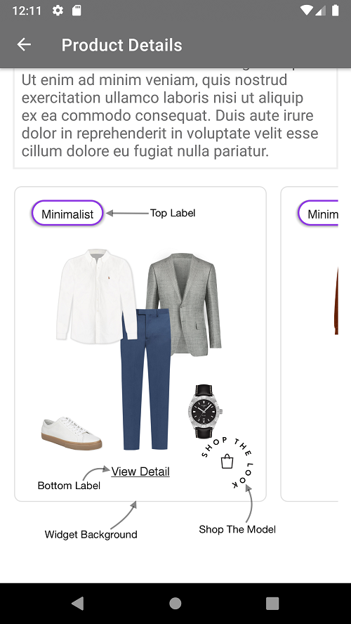
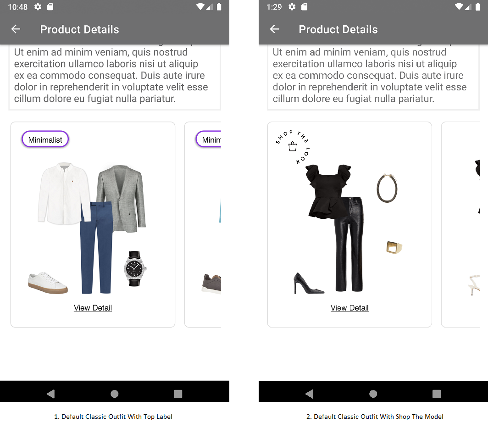
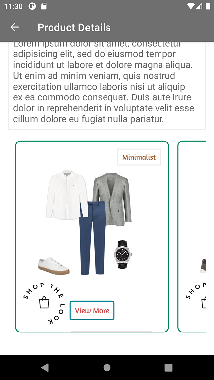
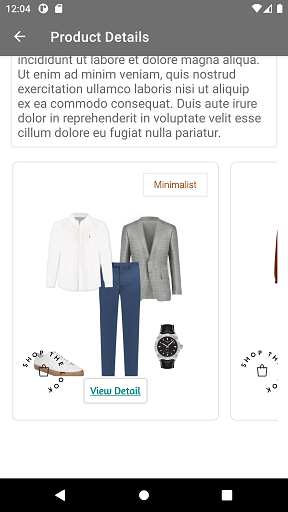
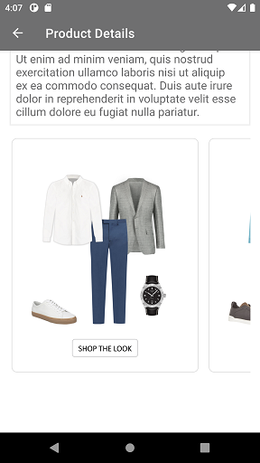

# CLASSIC WIDGET

It provides view to display Stylitics data. It also handles invoking of Widget tracking events based on user interaction with these views.

Below are the features for Classic Outfit Widget.</br>

* Configure all the UI elements for each Outfit
* Handles Outfit `View` and `Click` tracking events so Sample Integrator App does not have to do it
* Provides listeners to Sample Integrator App so they can handle the Outfit View and Click events
* Configure whether to display Outfit Items directly from SDK or not
    * When Outfit Items are configured to display from SDK, Sample Integrator App can provide configs for it along with Classic configs

## Configurations:



### Widget Background

| Fields             | Description                                                                                     | Default Value |
|--------------------|-------------------------------------------------------------------------------------------------|---------------|
| `borderColor`      | is border color and is accessed from *_**stroke color**_* in drawable resource file             | `#E1E1E1`     |
| `borderWeight`     | is border width and is accessed from *_**stroke width**_* in drawable resource file             | `1px`         |
| `cornerRadius`     | is border corner radius and is accessed from *_**corner radius**_* in drawable resource file    | `8px`         |
| `backgroundColor`  | is widget background color and is accessed from *_**solid color**_* in drawable resource file   | `#FFFFFF`     |

In Android, Outfit Widget background is set using below XML code of drawable resource file, which contains configurations for the above parameters. 

Drawable Resource File name : classic_widget_background
```xml
<?xml version="1.0" encoding="utf-8"?>
<shape xmlns:android="http://schemas.android.com/apk/res/android">
    <solid android:color="@color/white"/>
    <stroke
        android:width="@dimen/size_2"
        android:color="#6F0C208F" />

    <corners android:radius="@dimen/size_10"/>
</shape>
```

*_**widgetBackground**_* is the configurable parameter to set borderColor, borderWeight, cornerRadius and backgroundColor as shown below.

```kotlin
 widgetBackground = R.drawable.classic_widget_background
```

### Top Label

UX SDK provides various Label styles for the Top Label. [Click here](LABELS_README.md) to learn more about it.

### Bottom Label

| Fields                 | Description                                                                                    | Default Value            |
|------------------------|------------------------------------------------------------------------------------------------|--------------------------|
| `title`                | to set the title of the label                                                                  | `View Detail`            |
| `fontFamilyAndWeight`  | is the font style with the font weight and is accessed from the font resource folder           | `Helvetica Neue Regular` |
| `fontSize`             | is the font size in float and internally it is converted into sp                               | `14f`                    |
| `fontColor`            | is text color and is accessed from color.xml resource file                                     | `#212121`                |
| `showUnderLine`        | to HIDE or SHOW the underline for label                                                        | `true`(Show Underline)   |
| `paddingVertical`      | is top and bottom padding of the button in float and internally it is converted to dp          | `0f`                     |
| `paddingHorizontal`    | is left and right padding of the button in float and internally it is converted to dp          | `0f`                     |
| `bottomSpacing`        | is to set space between the bottom of label and widget of bottom                               | `24f`                    |
| `backgroundColor`      | is background color and is accessed from *_**solid color**_* in drawable resource file         | `#FFFFFF`                |
| `borderColor`          | to set border color and is accessed from *_**stroke color**_* in drawable resource file        | `#E1E1E1`                |
| `borderWeight`         | is border width and is accessed from *_**stroke width**_* in drawable resource file            | `0f`                     |
| `cornerRadius`         | is border corner radius and is accessed from *_**corner radius**_* in drawable resource file   | `0f`                     |
| `bottomSpacing`        | is to set space between the bottom of label and widget of bottom                               | `24f`                    |

### Shop The Model

| Fields   | Description                                                                                                                                   | Default Value                    |
|----------|-----------------------------------------------------------------------------------------------------------------------------------------------|----------------------------------|
| `name`     | is the name of image to be displayed for Shop the model badge and is accessed from drawable resource folder                                   | Mandatory                        |
| `position` | is to change the badge position to the Top Left, Top Right, Bottom Left and Bottom Right. 16dp to the top and the left is the default padding | `ShopTheModelPosition.TOP_LEFT`  |
| `width`    | is the width of image view in float and internally it is converted to dp                                                                      | `60f`                            |
| `height`   | is the height of image view in float and internally it is converted to dp                                                                     | `60f`                            |

### Show ScrollBar

| Fields           | Description                                                                         | Default Value |
|------------------|-------------------------------------------------------------------------------------|---------------|
| `showScrollBar`  | is Boolean value, to Show or Hide the horizontal ScrollBar of Classic Outfit widget | `false`       |

### Widget Top Spacing

| Fields              | Description                                                                                          | Default Value |
|---------------------|------------------------------------------------------------------------------------------------------|---------------|
| `widgetTopSpacing`  | is Float value to set space between the top border of Classic Outfit widget and top of Outfit Image  | `50f`         |

[Click here](CODE_REFERENCE_README.md#Classic-Widget-Configuration-Samples) to find code references for different configuration examples.

## Default Configurations:

* Below are the examples of Classic Outfit Widget when Sample Integrator App chooses to use default UI configurations.</br>

* The Classic Outfit UI component can be implemented in below different ways.
    1. Product List enabled from SDK
    2. Product List disabled from SDK
    3. Configure Event Listeners
    4. Shop The Model

*_**XML**_*

```xml
<com.stylitics.ui.StyliticsUIApi 
        android:id="@+id/outfitsRecyclerView"
        android:layout_width="match_parent"
        android:layout_height="@dimen/size_400" />
```

*_**Kotlin**_*

### 1. Product List enabled from SDK:

When product list is enabled from UX SDK and Sample Integrator App does not provide configurations, it will take default configurations from SDK.

```kotlin
val outfitsRecyclerView = findViewById<StyliticsUIApi>(R.id.outfitsRecyclerView)

private fun classicWidgetWithProductListFromUXSDK(outfits: Outfits) {
    outfitsRecyclerView.load(
        outfits,
        OutfitsTemplate.Classic(),
        ProductListScreenState.Enable(
            productListScreenConfig = ProductListScreenConfig(
                productListTemplate = ProductListTemplate.Standard(
                    productListListener = ProductListListener(
                        onOutfitItemClick = { outfitInfo, outfitItemInfo ->
                            //Here, in addition to handling any integrator analytics, natively navigate the user to the selected item's PDP (or launch a quick shop experience).
                            Toast.makeText(this, getString(R.string.outfit_item_clicked).plus(" ${outfitItemInfo.position}"), Toast.LENGTH_LONG).show()
                        }
                    )
                )
            )
        )
    )
}
```

### 2. Product List disabled from SDK:

```kotlin
val outfitsRecyclerView = findViewById<StyliticsUIApi>(R.id.outfitsRecyclerView)

private fun classicWidgetWhenProductListFromIntegrator(outfits: Outfits) {
    outfitsRecyclerView.load(
        outfits,
        OutfitsTemplate.Classic(
            classicListener = ClassicListener(
                onClick = { outfitInfo ->
                    //Display Product List Screen from Integrator here
                    showProductList(outfitInfo.outfit)
                }
            )),
        ProductListScreenState.Disable
    )
}
```

### 3. Configure Event Listeners:

```kotlin
val outfitsRecyclerView = findViewById<StyliticsUIApi>(R.id.outfitsRecyclerView)

private fun classicWidgetWithListenersConfigured(outfits: Outfits) {
    outfitsRecyclerView.load(
        outfits,
        OutfitsTemplate.Classic(
            classicListener = ClassicListener(
                onClick = { outfitInfo ->
                    Log.i("OutfitEvent", " Outfit click event triggered. ${outfitInfo.outfit.id}")
                },
                onView = { outfitInfo ->
                    Log.i("OutfitEvent", " Outfit view event triggered. ${outfitInfo.outfit.id}")
                }
            )
        )
    )
}
```

### 4. Shop The Model:

If in the Outfits response, `on-model-image` flag is true & Sample Integrator App provides a valid image for Shop The Model it will be displayed for the Outfit.

```kotlin
val outfitsRecyclerView = findViewById<StyliticsUIApi>(R.id.outfitsRecyclerView)

private fun classicWidgetWithShopTheModel(outfits: Outfits) {
    outfitsRecyclerView.load(
        outfits,
        OutfitsTemplate.Classic(
            classicConfig = ClassicConfig(
                shopTheModel = ShopTheModel(name = R.drawable.shop_the_look)
            )
        )
    )
}
```

### Default Classic Outfit Widget Screen**

* Below is the Classic Outfit Widget screenshot when Sample Integrator App uses the above configurations.

</br></br>

## Custom Configurations:

* Sample Integrator App can customise some or all configurations & implement listeners.
* Below are the examples of Classic Outfit Widget when Sample Integrator App customises configurations.

### 1. With all configurations & Listeners:

```kotlin
val outfitsRecyclerView = findViewById<StyliticsUIApi>(R.id.outfitsRecyclerView)

private fun classicWidgetWithAllCustomConfigurations(outfits: Outfits) {
    val topLabelConfig = TopLabel(
        label3 = TopLabel.Label3(
            position = TopLabelPosition.TOP_RIGHT,
            fontFamilyAndWeight = R.font.amaranth,
            fontSize = 14f,
            fontColor = R.color.dark_brown,
            paddingVertical = 8f,
            paddingHorizontal = 10f,
            background = R.drawable.top_label_border
        )
    )
    outfitsRecyclerView.load(
        outfits, OutfitsTemplate.Classic(
            classicConfig = ClassicConfig(
                widgetBackground = R.drawable.classic_outfit_border,
                topLabel = topLabelConfig,
                bottomLabel = ClassicConfig.BottomLabel(
                    title = "View More",
                    fontFamilyAndWeight = R.font.amaranth,
                    fontColor = R.color.black,
                    fontSize = 15f,
                    background = R.drawable.view_detail_background,
                    paddingHorizontal = 10f,
                    paddingVertical = 10f,
                    showUnderLine = false
                ),
                shopTheModel = ShopTheModel(
                    name = R.drawable.shop_the_look,
                    position = ShopTheModelPosition.BOTTOM_LEFT,
                    width = 80f,
                    height = 80f
                ),
                showScrollBar = true,
                widgetTopSpacing = 40f
            ),
            classicListener = ClassicListener(
                onClick = { outfitInfo ->
                    Log.i("OutfitEvent", " Outfit click event triggered. ${outfitInfo.outfit.id}")
                },
                onView = { outfitInfo ->
                    Log.i("OutfitEvent", " Outfit view event triggered. ${outfitInfo.outfit.id}")
                }
            )
        )
    )
}         
```

*Note : For Shop the model configuration, if height and width provided by Sample Integrator has different aspect ratio than the Image, it will leave some default space around the image and the image will be at the center*.

* Below is the Classic Outfit Widget screenshot when Sample Integrator App uses the above configurations.

</br>

### 2. With some custom configurations & Listeners:

If Sample Integrator App provides only few configurations, UX SDK will take default configurations for missing fields.

```kotlin
val outfitsRecyclerView = findViewById<StyliticsUIApi>(R.id.outfitsRecyclerView)

private fun classicWidgetWithSomeCustomConfigurations(outfits: Outfits) {
    //Passing custom configurations for multiple Label styles
    val topLabelConfig = TopLabel(
        label2 = TopLabel.Label2(
            background = R.drawable.top_label_border,
        ),
        label3 = TopLabel.Label3(
            position = TopLabelPosition.TOP_RIGHT,
            fontFamilyAndWeight = R.font.amaranth,
            fontSize = 14f,
            fontColor = R.color.dark_brown,
            paddingVertical = 8f,
            paddingHorizontal = 10f,
            background = R.drawable.top_label_border
        ),
        label7 = TopLabel.Label7(
            fontColor = R.color.black
        )
    )
    outfitsRecyclerView.load(
        outfits, OutfitsTemplate.Classic(
            classicConfig = ClassicConfig(
                topLabel = topLabelConfig,
                bottomLabel = ClassicConfig.BottomLabel(
                    title = "View Detail",
                    fontFamilyAndWeight = R.font.amaranth,
                    fontSize = 15f,
                    fontColor = R.color.teal_700,
                    background = R.drawable.view_detail_background,
                    paddingHorizontal = 10f,
                    paddingVertical = 10f
                ),
                shopTheModel = ShopTheModel(
                    name = R.drawable.shop_the_look,
                    position = ShopTheModelPosition.BOTTOM_LEFT
                )
            ),
            classicListener = ClassicListener(
                onClick = { outfitInfo ->
                    Log.i("OutfitEvent", " Outfit click event triggered. ${outfitInfo.outfit.id}")
                }
            )
        )
    )
}         
```

* Below is the Classic Outfit Widget screenshot when Sample Integrator App uses the above configurations.

</br>

### 3. Bottom label configuration to display border without overlap with Outfit image:

```kotlin
val outfitsRecyclerView = findViewById<StyliticsUIApi>(R.id.outfitsRecyclerView)

private fun classicWidgetWithBottomLabelBorder(outfits: Outfits) {
    outfitsRecyclerView.load(
        outfits,
        OutfitsTemplate.Classic(
            classicConfig = ClassicConfig(
                bottomLabel = ClassicConfig.BottomLabel(
                    title = "SHOP THE LOOK",
                    fontSize = 13f,
                    fontColor = R.color.black,
                    showUnderLine = false,
                    paddingVertical = 7f,
                    paddingHorizontal = 10f,
                    fontFamilyAndWeight = R.font.calibri,
                    background = R.drawable.bottom_label_border
                )
            )
        ),
        ProductListScreenState.Enable()
    )
}
```

* Below is the Classic Outfit Widget screenshot when Sample Integrator App uses the above configurations.

</br>

