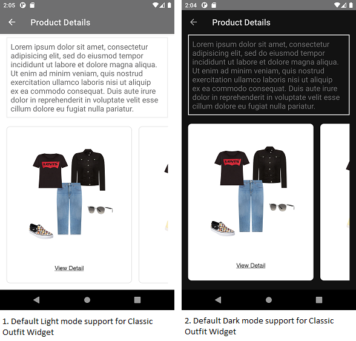
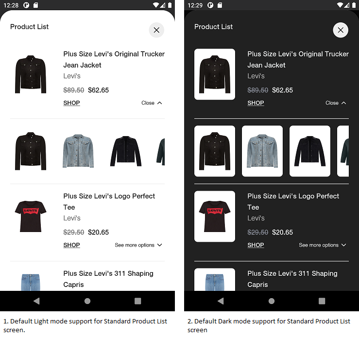
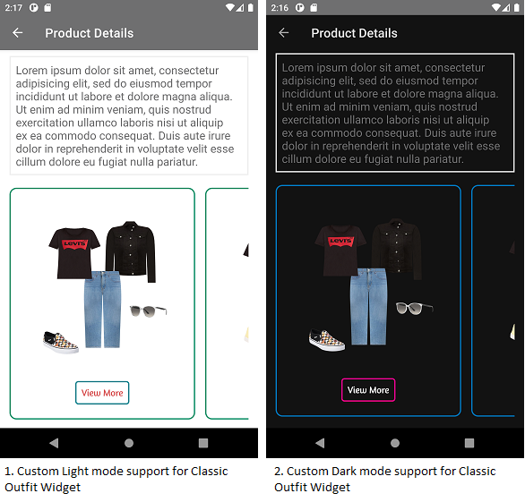
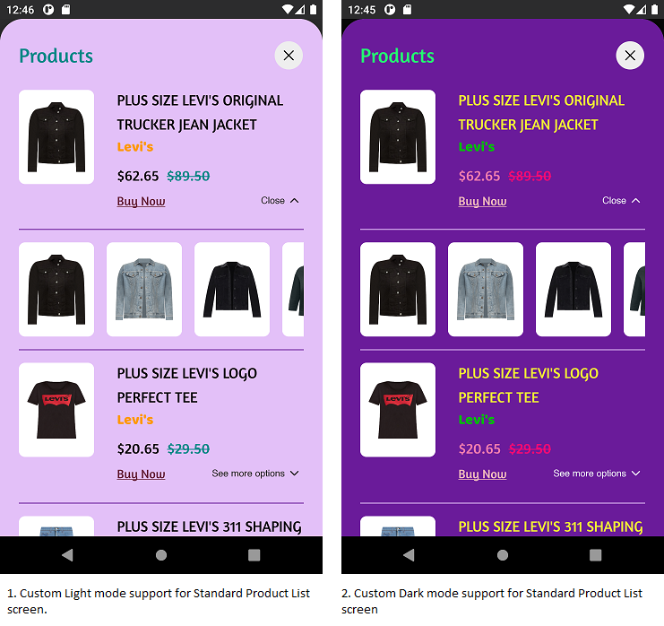

# Light and Dark Mode Support

This document provides the information about *_**Light and Dark mode support**_* for both default and custom configurations.

## Default Light and Dark Mode Support

Below are the implementation details for the *_**default Light and Dark mode**_* support for UI components implemented in UX SDK.

### 1. Classic Outfit Widget

**Colors :** Below table shows the Classic Outfit Widget component's default colors in Light and Dark mode.

| Component                     | Light Mode | Dark Mode  |
|-------------------------------|------------|------------|
| Bottom label font color       | `#212121`  | `#212121`  |
| Bottom label background color | `#FFFFFF`  | `#FFFFFF`  |
| Widget background color       | `#FFFFFF`  | `#FFFFFF`  |
| Widget border color           | `#E1E1E1`  | `#E1E1E1`  |

**Screenshots :**



### 2. Product List

**Colors :** Below table shows the Product List component's default colors in Light and Dark mode.

| Component                            | Light Mode | Dark Mode  |
|--------------------------------------|------------|------------|
| Product list screen title font color | `#212121`  | `#F3F6F6`  |
| Item name font color                 | `#212121`  | `#F3F6F6`  |
| Item price font color                | `#212121`  | `#F3F6F6`  |
| Item sale price font color           | `#212121`  | `#F3F6F6`  |
| Strike through price font color      | `#757575`  | `#858994`  |
| Shop text font color                 | `#212121`  | `#F3F6F6`  |
| Shop button text font color          | `#212121`  | `#33363E`  |
| Shop button background color         | `#F5F5F5`  | `#D9DFEB`  |
| See more config font color           | `#212121`  | `#F3F6F6`  |
| Product list item background color   | `#FFFFFF`  | `#212121`  |
| Product list item divider color      | `#EEEEEE`  | `#EEEEEE`  |


**Screenshots :**

</br>


## Custom Light and Dark Mode Support

The default Light and Dark mode colors can be customised by adding colors to the *_**color.xml resource file**_*. Use *_**color.xml from values folder**_* to define Light mode colors and *_**color.xml from values-night folder**_* to define Dark mode colors. Below is the screenshot for the reference.<br /><br />


**_**Note**_* : <br />1. If you define a color in Light mode color.xml file(values folder) and *_**not in Dark mode color.xml(values-night folder)**_*, the same color will be used in Dark mode too. <br />2. If you define a color in Dark mode color.xml file(values-night folder) and *_**not in Light mode color.xml(values folder)**_*, this will give the syntax error. So the colors should be defined in both the color.xml files*

Below are the implementation details to customise the Light and Dark mode support from Sample Integrator App.

### 1. Classic Outfit Widget

**Colors :** Below table shows the Classic Outfit Widget component's *_**custom colors for Light and Dark**_* mode.

| Component                      | Light Mode  | Dark Mode   |
|--------------------------------|-------------|-------------|
| Bottom label font color        | `#D85454`   | `#FFFFFFFF` |
| Bottom label border font color | `#00838F`   | `#FB048C`   |
| Widget border color            | `#0C8F66`   | `#0277BD`   |
| Top label font color           | `#A15B26`   | `#13F6C9`   |
| Top label border color         | `#EEEEEE`   | `#70C5F8`   |
| Top label background color     | `#FFFFFFFF` | `#04304A`   |


**Screenshots :**



### 2. Product List

**Colors :** Below table shows the Product List component's *_**custom colors in Light and Dark**_* mode.

| Component                             | Light Mode   | Dark Mode  |
|---------------------------------------|--------------|------------|
| Screen title font color               | `#FF018786`  | `#25F772`  |
| Item name font color                  | `#000000`    | `#EFEE37`  |
| Item Brand font color                 | `#666666`    | `#B8B8B8`  |
| Item price font color                 | `#FA0505`    | `#3AF4DD`  |
| Item sale price font color            | `#FF000000`  | `#EF7CAE`  |
| item strike through price font color  | `#FF018786`  | `#FA0A73`  |
| Shop text font color                  | `#631D35`    | `#F4BCBC`  |
| Shop button font color                | `#680D35`    | `#09CA13`  |
| See more config font color            | `#631D35`    | `#D59FF7`  |
| Product list item background color    | `#E3C0F8`    | `#6A1B9A`  |
| Product list item divider color       | `#6A1B9A`    | `#E3C0F8`  |

**Screenshots :**

</br>

**color.xml (from values folder) for Light Mode in Sample Integrator App**

```xml
<?xml version="1.0" encoding="utf-8"?>
<resources>

    <color name="classic_bottom_label_font_color">#D85454</color>
    <color name="classic_bottom_label_border_color">#00838F</color>
    <color name="classic_widget_border_color">#0C8F66</color>
    <color name="classic_top_label_font_color">#A15B26</color>
    <color name="classic_top_label_border_color">#EEEEEE</color>
    <color name="classic_top_label_background_color">#FFFFFFFF</color>

    <color name="standard_product_list_screen_title_font_color">#FF018786</color>
    <color name="standard_product_list_item_name_font_color">#000000</color>
    <color name="standard_product_list_item_price_font_color">#FA0505</color>
    <color name="standard_product_list_item_sale_price_font_color">#FF000000</color>
    <color name="standard_product_list_item_strike_through_price_font_color">#FF018786</color>
    <color name="standard_product_list_shop_button_font_color">#680D35</color>
    <color name="standard_product_list_shop_text_font_color">#631D35</color>
    <color name="standard_product_list_see_more_config_font_color">#631D35</color>
    <color name="standard_product_list_item_background_color">#E3C0F8</color>
    <color name="standard_product_list_item_divider_color">#6A1B9A</color>
    <color name="dark_mode_switch_text_font_color">#000000</color>

</resources>
```

**color.xml (from values-night folder) for Dark Mode in Sample Integrator App**

```xml
<?xml version="1.0" encoding="utf-8"?>
<resources>
    <color name="classic_bottom_label_font_color">#FFFFFFFF</color>
    <color name="classic_bottom_label_border_color">#FB048C</color>
    <color name="classic_widget_border_color">#0277BD</color>
    <color name="classic_top_label_font_color">#13F6C9</color>
    <color name="classic_top_label_border_color">#70C5F8</color>
    <color name="classic_top_label_background_color">#04304A</color>

    <color name="standard_product_list_screen_title_font_color">#25F772</color>
    <color name="standard_product_list_item_name_font_color">#EFEE37</color>
    <color name="standard_product_list_item_price_font_color">#3AF4DD</color>
    <color name="standard_product_list_item_sale_price_font_color">#EF7CAE</color>
    <color name="standard_product_list_item_strike_through_price_font_color">#FA0A73</color>
    <color name="standard_product_list_shop_button_font_color">#09CA13</color>
    <color name="standard_product_list_shop_text_font_color">#F4BCBC</color>
    <color name="standard_product_list_see_more_config_font_color">#D59FF7</color>
    <color name="standard_product_list_item_background_color">#6A1B9A</color>
    <color name="standard_product_list_item_divider_color">#E3C0F8</color>
    <color name="dark_mode_switch_text_font_color">#D1D1D1</color>

</resources>
```

**Code example to customize the Dark And Light Mode colors**

```kotlin

val outfitsRecyclerView = findViewById<StyliticsUIApi>(R.id.outfitsRecyclerView)

private fun customizeDarkAndLightModeConfiguration(outfits: Outfits){
    val topLabelConfig = TopLabel(
        label3 = TopLabel.Label3(
            fontColor = R.color.classic_top_label_font_color,
            background = R.drawable.top_label_border
        )
    )
    outfitsRecyclerView.load(
        outfits, OutfitsTemplate.Classic(
            
            //Custom color configuration for Classic Outfit Widget components
            classicConfig = ClassicConfig(
                widgetBackground = R.drawable.classic_outfit_border,
                topLabel = topLabelConfig,
                bottomLabel = ClassicConfig.BottomLabel(
                    fontColor = R.color.classic_bottom_label_font_color,
                    background = R.drawable.view_detail_background,
                )
            )
        ),
        ProductListScreenState.Enable(
            productListScreenConfig = ProductListScreenConfig(
                //Custom color configuration for Product List screen title
                itemListHeader = ProductListScreenConfig.ItemListHeader(
                    fontColor = R.color.standard_product_list_screen_title_font_color,
                ),
                productListTemplate = ProductListTemplate.Standard(
                    //Custom color configuration for Product List view components
                    productListConfig = ProductListConfig(
                        itemName = ProductListConfig.ItemName(
                            fontColor = R.color.standard_product_list_item_name_font_color
                        ),
                        itemPrice = ProductListConfig.ItemPrice(
                            priceFontColor = R.color.standard_product_list_item_price_font_color,
                            salePriceFontColor = R.color.standard_product_list_item_sale_price_font_color,
                            strikeThroughPriceFontColor = R.color.standard_product_list_item_strike_through_price_font_color,
                        ),
                        shop = ShopViewType.Text(
                            fontColor = R.color.standard_product_list_shop_text_font_color
                        ),
                        seeMoreConfig = ProductListConfig.SeeMoreOptionsConfig(
                            fontColor = R.color.standard_product_list_see_more_config_font_color,
                        ),
                        itemBackgroundColor = R.color.standard_product_list_item_background_color,
                        itemDividerColor = R.color.standard_product_list_item_divider_color
                    )
                )
            )
        )
    )
}
```

## In-App Dark Mode Support

### Settings screen

In this screen, user can enable/disable the dark mode manually from application.

Below is the reference code to programmatically change light/dark mode.

```kotlin
override fun onCheckedChanged(view: CompoundButton?, isChecked: Boolean) {
  when (view?.id) {
    R.id.switchCompat -> {
      if (isChecked) {
        AppCompatDelegate.setDefaultNightMode(AppCompatDelegate.MODE_NIGHT_YES)
      } else {
        AppCompatDelegate.setDefaultNightMode(AppCompatDelegate.MODE_NIGHT_NO)
      }
    }
  }
}
```


### Disable Dark Mode

Use the below line of code to disable Dark mode in Integrator app and SDK.

```kotlin
AppCompatDelegate.setDefaultNightMode(AppCompatDelegate.MODE_NIGHT_NO)
```

## Android Versioning Support

- Minimum required android API level to access features of UX SDK is - 21(Android 5.0)
- Target android API level is 32(Android 13/ Beta)

## License

Copyright © 2023 Stylitics
