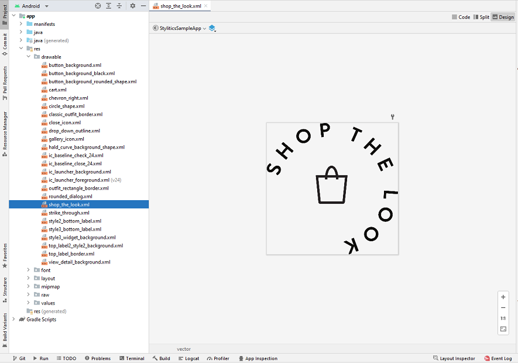

# Stylitics Sample Integrator App Code Reference 

This document provides references for implementation details by Sample Integrator App screen.

## Configure Username and Environment

Below are the implementation details for Username and Environment configurations screen

* **UserAccountsActivity.kt** This activity has all the implementations to display the available usernames and based on the user selection it proceeds to the user, client and environment configuration.
* **UserAccountsViewModel.kt** This class handles business logic behind first screen using below methods.
     1. **configureSDK()** - This performs the required data configurations


## Show Product Items(Grid Screen)

Below are the implementation details for Show Product Items(Grid screen) screen

* **ItemsActivity.kt** This class is responsible for displaying the Sample Product items.

## PDP Screen

Below are the implementation details for Product details page.

* **OutfitsViewModel.kt** This class fetches Stylitics Outfits data from the server using Data SDK. It has below methods implemented.
     1. **`outfits(itemNumber: String = "1234567890")`** This makes the Outfits API call using item number.
     2. **`success(outfits: Outfits)`** This saves the success response for the Outfits API call.

* **ProductDetailPageActivity.kt** This class is responsible for displaying the product details and its related Outfits using sample methods defined in the template based classes.
     1. **`displayOutfits()`** This makes call to the sample code to display required Views.
 
* **ProductDetailPageViewModel.kt** This class handles business logic for Product Detail screen.
     1. **`trackJumplinkClickedEvent()`** Invokes the `jumplinkclicked` tracking event.

* **activity_product_detail_page.xml** This is the XML file which holds the UI components to be displayed on the screen.

## Classic Widget Configuration Samples

* **ClassicWidgetConfigSamples.kt** class has code samples for various custom configurations for Classic template. 

## Hotspot Widget Configuration Samples

* **HotspotWidgetConfigSamples.kt** class has code samples for various custom configurations for Hotspot template.

## Standard Product List View Configuration Samples

* **ProductListViewConfigSamples.kt** class has code samples for Product list view when called from Integrator App.

## Show Product Items

* **OutfitItemsFragment** This is the bottomSheet fragment to display Product list and implements the click listener. This implementation is invoked when Product list screen from UX SDK is disabled.
     1. **`updateViews()`** This method loads the Product list view implemented in the UX SDK. 

* **ItemFragmentViewModel** This class handles business logic for Product Detail screen

## Classic - Shop The Model

Integrator app should add image for Shop The Model view in *_**Android resource drawable folder**_* as shown in below screenshot.

</br>

Shop The Model configuration for Classic widget can be done as below,

```kotlin
  shopTheModel = ShopTheModel(
    name = R.drawable.shop_the_look,
    position = ShopTheModelPosition.BOTTOM_LEFT,
    width = 80f,
    height = 80f
  )
```

**ClassicWidgetConfigSamples.kt** class has an example for Shop The Model configuration.

## Settings Screen

* **SettingsActivity.kt**  This class is responsible for showing application settings.

## Gallery Screen

Below are the implementation details for Gallery screen.

* **GalleryActivity.kt** This class is responsible for displaying the gallery items by fetching required data from the *_**GalleryViewModel.kt**_*. 

* **GalleryViewModel.kt** This class handles business logic for Gallery screen.

* **ConfigStyles** This class has sample style configurations for Outfit widget and Product list Templates.
    1. **`Style`**  - is the enum for set of styles
    2. **`fun getStyle(style: Style = Style.DEFAULT_STYLE): OutfitsTemplate`** This method returns the OutfitTemplate configs for the provided style.
    3. **`fun getStyle(style: Style = Style.DEFAULT_STYLE): ProductListTemplate`** This method returns the ProductListTemplate configs for the provided style. 

* **activity_gallery** This is the XML file which holds the UI components to be displayed on the Gallery screen.

## License

Copyright © 2023 Stylitics
