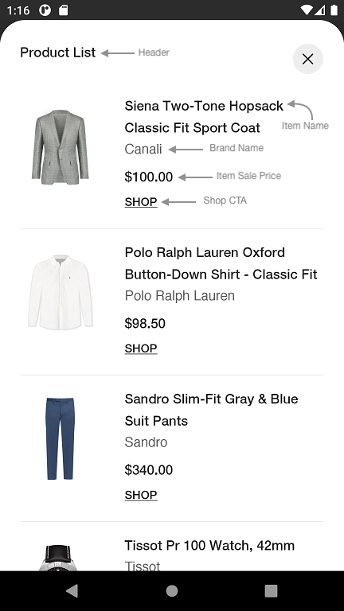
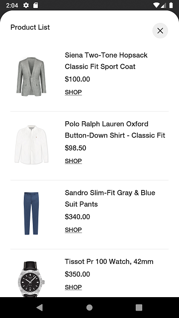
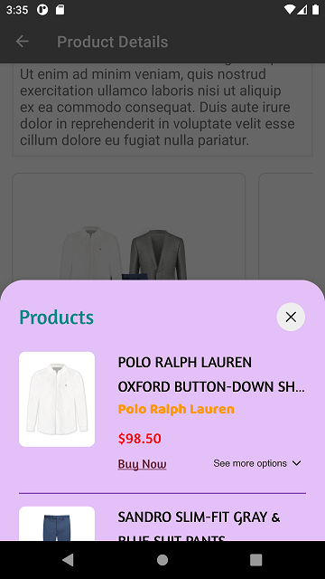
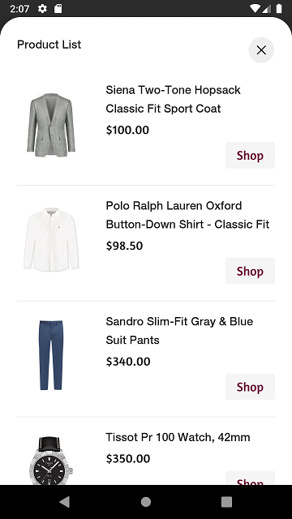
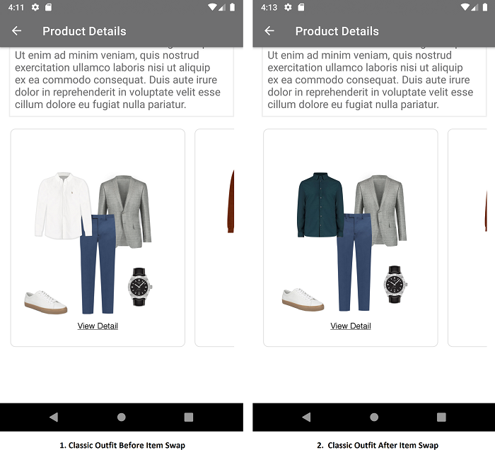
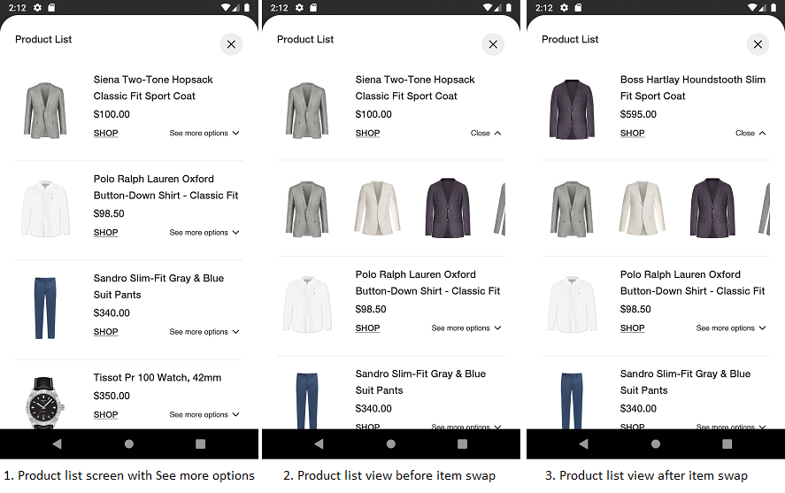
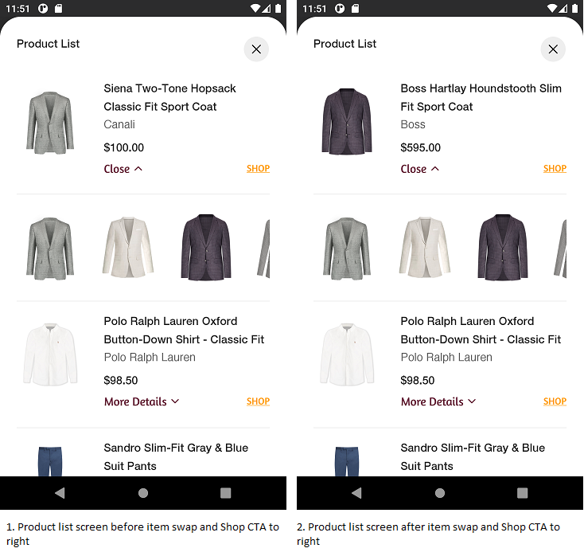

# STANDARD PRODUCT LIST

It provides views to display Stylitics data Outfit items. It also handles invoking of item tracking events based on user interaction with these views.

## Product List Screen

* This screen is displayed when user clicks on an Outfit.
* There are two different ways to show Product List Screen.
    1. Product List Screen From UX SDK
    2. Product List Screen From Sample Integrator App

### Product List Screen From UX SDK

Below are the features for Product List Screen 
* Configure all the UI elements for Product List Screen
* Handles Outfit Item `View` and `Click` tracking events so Sample Integrator App does not have to do it
* Provides listeners to Sample Integrator App so they can handle the Outfit Item `View` and `Click` events
* If Sample Integrator App does not implement Outfit Item click listener, a Web View is opened when user selects an Outfit Item

*Note: It is recommended that Sample Integrator App always provides the **onOutfitItemClick** listener implementation*.

### Product List Screen Configurations

</br>

### Header

| Fields                         | Description                                                                                                          | Default Value                  |
|--------------------------------|----------------------------------------------------------------------------------------------------------------------|--------------------------------|
| `title`                        | to set the header of the screen                                                                                      | `Product List`                 |
| `productListScreenHeaderAlign` | to set the product list screen title alignment with close button. It will be center aligned when the value is CENTER | `Top`                          |
| `fontFamilyAndWeight`          | is the font style with the font weight and is accessed from the font resource folder                                 | `R.font.helvetica_neue_medium` |
| `fontSize`                     | is the font size in float and internally it is converted into SP                                                     | `16f`                          |
| `fontColor`                    | is text color and is accessed from color.xml resource file                                                           | `#212121`                      |

### Presentation Style

| Fields               | Description                                 | Default Value                    |
|----------------------|---------------------------------------------|----------------------------------|
| `presentationStyle`  | to set the Product List Presentation style  | `PresentationStyle.FULL_SCREEN`  |

### Item Name

| Fields                | Description                                                                                | Default Value                  |
|-----------------------|--------------------------------------------------------------------------------------------|--------------------------------|
| `fontFamilyAndWeight` | is text font style with the font weight and is accessed from the font resource folder      | `R.font.helvetica_neue_medium` |
| `titleTextTransform`  | to change the case of item name text. When the value is UPPER it will appear in upper case | `None`                         |
| `fontSize`            | is font size in float and internally it is converted into SP                               | `16f`                          |
| `fontColor`           | is text color which is accessed from color.xml resource file                               | `#212121`                      |

### Brand

| Fields                | Description                                                                                | Default Value                   |
|-----------------------|--------------------------------------------------------------------------------------------|---------------------------------|
| `showBrand`           | to show or hide the brand name                                                             | `false`                         |
| `fontFamilyAndWeight` | is text font style with the font weight and is accessed from the font resource folder      | `R.font.helvetica_neue_regular` |
| `fontSize`            | is font size in float and internally it is converted into SP                               | `16f`                           |
| `fontColor`           | is text color which is accessed from color.xml resource file                               | `#666666`                       |

### Item Price

| Fields                        | Description                                                                                                    | Default Value                  |
|-------------------------------|-------------------------------------------------------------------------------------------------------------------|--------------------------------|
| `fontFamilyAndWeight`         | is the text font style with the font weight and is accessed from the font resource folder                         | `R.font.helvetica_neue_medium` |
| `fontSize`                    | is font size in float and internally it is converted into sp                                                      | `16f`                          |
| `priceFontColor`              | to set item price text color which is accessed from color.xml resource file                                       | `#212121`                      |
| `salePriceFontColor`          | to set item sale price text color which is accessed from color.xml resource file                                  | `#212121`                      |
| `strikeThroughPriceFontColor` | is strike through price text color which is accessed from color.xml resource file                                 | `#757575`                      |
| `style`                       | to show or hide the Strike Through Price                                                                          | `PriceStrikeThrough.SHOW`      |
| `decimal`                     | is the number of digits to show after decimal point and it is accepted as a integer                               | `2`                            |
| `swapPricesPosition`          | is boolean value, when it is false it shows strike through price first and then sale price. Vice versa when true. | `false`                        |

*Note : 1. *_**swapPricesPosition**_* in Item Price is to reverse the positions of Price and Strike Through Price.<br />
 &nbsp;&nbsp;&nbsp;&nbsp;&nbsp;&nbsp;&nbsp;&nbsp;&nbsp;&nbsp;2. *_**priceFontColor**_* is to change the color of item price.<br />
 &nbsp;&nbsp;&nbsp;&nbsp;&nbsp;&nbsp;&nbsp;&nbsp;&nbsp;&nbsp;2. *_**salePriceFontColor**_* is to change the color of item sale price.<br />
 &nbsp;&nbsp;&nbsp;&nbsp;&nbsp;&nbsp;&nbsp;&nbsp;&nbsp;&nbsp;3. *_**strikeThroughPriceFontColor**_* is to change the color of old price of item.*

### Shop CTA

It can be used as a Text or Button, below are the configurations for both.

### Shop Text

| Fields                | Description                                                                               | Default Value                   |
|-----------------------|-------------------------------------------------------------------------------------------|---------------------------------|
| `title`               | to set the title of the text                                                              | `SHOP`                          |
| `fontFamilyAndWeight` | is the text font style with the font weight and is accessed from the font resource folder | `R.font.helvetica_neue_medium`  |
| `fontSize`            | is font size in float and internally it is converted into sp                              | `14f`                           |
| `fontColor`           | is text color which is accessed from color.xml resource file                              | `#212121`                       |
| `position`            | is to change shop text position to bottom left or bottom right                            | `ShopViewPosition.LEFT`         |

### Shop Button

| Fields                  | Description                                                                               | Default Value                       |
|-------------------------|-------------------------------------------------------------------------------------------|-------------------------------------|
| `title`                 | to set the title of the text                                                              | `Shop`                              |
| `fontFamilyAndWeight`   | is the text font style with the font weight and is accessed from the font resource folder | `R.font.helvetica_neue_medium`      |
| `buttonBackgroundColor` | is the shop button background drawable                                                    | `R.drawable.shop_button_background` |
| `fontSize`              | is font size in float and internally it is converted into sp                              | `14f`                               |
| `fontColor`             | is text color which is accessed from color.xml resource file                              | `#212121`                           |
| `paddingVertical`       | is top and bottom padding of the button in float and internally it is converted to dp     | `8f`                                |
| `paddingHorizontal`     | is left and right padding of the button in float and internally it is converted to dp     | `16f`                               |

### Show ScrollBar

| Fields           | Description                                                                   | Default Value |
|------------------|-------------------------------------------------------------------------------|---------------|
| `showScrollBar`  | is Boolean value, to Show or Hide the vertical ScrollBar of Product List view | `false`       |

### Product List Background Color

| Fields                 | Description                                                                                  | Default Value |
|------------------------|----------------------------------------------------------------------------------------------|---------------|
| `itemBackgroundColor`  | is to change Product List view background color and is accessed from color.xml resource file | `#FFFFFF`     |

### Product List Item Divider Color

| Fields              | Description                                                                    | Default Value |
|---------------------|--------------------------------------------------------------------------------|---------------|
| `itemDividerColor`  | is to change item divider color and is accessed from color.xml resource file   | `#EEEEEE`     |

### Hide Anchor Item

| Fields            | Description                                                                         | Default Value for Classic | Default Value for Hotspot |
|-------------------|-------------------------------------------------------------------------------------|---------------------------|---------------------------|
| `hideAnchorItem ` | is to hide anchor item in Product list screen, it will be hidden when set to `true` | `false`                   | `true`                    |

[Click here](CODE_REFERENCE_README.md#Classic-Widget-Configuration-Samples) to find code references for different configuration examples.


### Product List Screen from UX SDK with Default Configurations

Below is the example of Product List Screen when Sample Integrator App chooses to use default UI configurations.

*_**XML**_*

```xml
<com.stylitics.ui.StyliticsUIApi 
        android:id="@+id/outfitsRecyclerView"
        android:layout_width="match_parent"
        android:layout_height="@dimen/size_400" />
```

*_**Kotlin**_*

Below is the code to access Product List Screen from UX SDK.

It is recommended that Sample Integrator App provide the **onOutfitItemClick** listener implementation.

```kotlin
val outfitsRecyclerView = findViewById<StyliticsUIApi>(R.id.outfitsRecyclerView)

private fun classicWidgetWithProductListFromUXSDKAndAllDefaultConfigurations(outfits: Outfits) {
    outfitsRecyclerView.load(
        outfits,
        OutfitsTemplate.Classic(),
        ProductListScreenState.Enable(
            productListScreenConfig = ProductListScreenConfig(
                productListTemplate = ProductListTemplate.Standard(
                    productListListener = ProductListListener(
                        onOutfitItemClick = { outfitInfo, outfitItemInfo ->
                            //Here, in addition to handling any integrator analytics, natively navigate the user to the selected item's PDP (or launch a quick shop experience).
                            Toast.makeText(this, getString(R.string.outfit_item_clicked).plus(" ${outfitItemInfo.position}"), Toast.LENGTH_LONG).show()
                        }
                    )
                )
            )
        )
    )
}
```
* When Product List Screen is displayed from UX SDK, Sample Integrator App can choose to close it using below code.

```Kotlin
val outfitsRecyclerView = findViewById<StyliticsUIApi>(R.id.outfitsRecyclerView)
outfitsRecyclerView.closeProductListScreen()
```
* Below is the Product List screenshot when Sample Integrator App uses the default configurations

</br>

### Product List Screen from UX SDK with Custom Configurations

Below are the examples of Product List Screen when Sample Integrator App chooses to use custom configurations.

*_**XML**_*

```xml
<com.stylitics.ui.StyliticsUIApi 
        android:id="@+id/outfitsRecyclerView"
        android:layout_width="match_parent"
        android:layout_height="@dimen/size_400" />
```

*_**Kotlin**_*

### 1. With All Custom Configurations and Listeners

```kotlin
val outfitsRecyclerView = findViewById<StyliticsUIApi>(R.id.outfitsRecyclerView)

private fun classicWidgetWithProductListFromUXSDKAndAllCustomConfigurations(outfits: Outfits) {
    outfitsRecyclerView.load(
        outfits,
        OutfitsTemplate.Classic(),
        ProductListScreenState.Enable(
            productListScreenConfig = ProductListScreenConfig(
                itemListHeader = ProductListScreenConfig.ItemListHeader(
                    title = "Products",
                    productListScreenHeaderAlign = ProductListScreenHeaderAlign.CENTER,
                    fontFamilyAndWeight = R.font.amaranth,
                    fontColor = R.color.teal_700,
                    fontSize = 26f
                ),
                presentationStyle = PresentationStyle.HALF_SCREEN,
                productListTemplate = ProductListTemplate.Standard(
                    productListConfig = ProductListConfig(
                        itemName = ProductListConfig.ItemName(
                            fontFamilyAndWeight = R.font.amaranth,
                            titleTextTransform = TitleTextTransform.UPPER,
                            fontSize = 19f,
                            fontColor = R.color.black
                        ),
                        brand = ProductListConfig.Brand(
                            showBrand = true,
                            fontFamilyAndWeight = R.font.baloo_bhai,
                            fontSize = 18f,
                            fontColor = R.color.standard_product_list_item_brand_font_color
                        ),
                        /*
                            itemPrice - is to set ItemPrice configurations.
                            priceFontColor - is the color configuration of actual price.
                            salePriceFontColor - is the color configuration of sale price.
                            strikeThroughPriceFontColor - is the color configuration of old price.
                            style - is Hide or Show the strikeThroughPriceFontColor.
                            swapPricesPosition - swaps the positions of Sale Price and Strike-Through Price.
                        */
                        itemPrice = ProductListConfig.ItemPrice(
                            fontFamilyAndWeight = R.font.amaranth,
                            fontSize = 19f,
                            priceFontColor = R.color.black,
                            salePriceFontColor = R.color.red,
                            strikeThroughPriceFontColor = R.color.teal_700,
                            style = PriceStrikeThrough.SHOW,
                            decimal = 2,
                            swapPricesPosition = true
                        ),
                        shop = ShopViewType.Text(
                            title = "Buy Now",
                            fontFamilyAndWeight = R.font.amaranth,
                            fontSize = 20f,
                            fontColor = R.color.brown
                        ),
                        showScrollBar = true,
                        itemBackgroundColor = R.color.standard_product_list_item_background_color,
                        itemDividerColor = R.color.standard_product_list_item_divider_color,
                        hideAnchorItem = true
                    ),
                    productListListener = ProductListListener(
                        onOutfitItemClick = { outfitInfo, outfitItemInfo ->
                            //Here, in addition to handling any integrator analytics, natively navigate the user to the selected item's PDP (or launch a quick shop experience).
                            Toast.makeText(this, getString(R.string.outfit_item_clicked).plus(" ${outfitItemInfo.position}"), Toast.LENGTH_LONG).show()
                        },
                        onOutfitItemView = { outfitInfo, outfitItemInfo ->
                            Log.i("OutfitItemEvent", " OutfitItem view event triggered. ${outfitInfo.outfit.id}, ${outfitItemInfo.outfitItem.name}")
                        }
                    )
                )
            )
        )
    )
}
```

* Below is the Product List screenshot when Sample Integrator App uses the above configurations.

</br>

### 2. With some custom configurations and listeners

```kotlin
val outfitsRecyclerView = findViewById<StyliticsUIApi>(R.id.outfitsRecyclerView)

private fun classicWidgetWithProductListFromUXSDKAndSomeCustomConfigurations(outfits: Outfits) {
    outfitsRecyclerView?.load(
        outfits,
        OutfitsTemplate.Classic(),
        productListScreenTemplate = ProductListScreenTemplate.Standard(
            productListScreenConfig = ProductListScreenConfig(
                productListConfig = ProductListConfig(
                    itemPrice = ProductListConfig.ItemPrice(
                        fontFamilyAndWeight = R.font.amaranth,
                        strikeThroughPriceFontColor = R.color.teal_700,
                        fontSize = 18f,
                        style = PriceStrikeThrough.HIDE
                    ),
                    shop = ShopViewType.Button(
                        fontFamilyAndWeight = R.font.amaranth,
                        fontSize = 18f,
                        fontColor = R.color.purple
                    )
                ),
                productListListener = ProductListListener(
                    onOutfitItemClick = { outfitInfo, outfitItemInfo ->
                        //Here, in addition to handling any integrator analytics, natively navigate the user to the selected item's PDP (or launch a quick shop experience).
                        Toast.makeText(this, getString(R.string.outfit_item_clicked).plus(" ${outfitItemInfo.position}"), Toast.LENGTH_LONG).show()
                    }
                )
            )
        )
    )
}
```

* Below is the Product List screenshot when Sample Integrator App uses the above configurations.

</br>

### Product List Screen From Sample Integrator App

If Sample Integrator App wants to implement their own Product List Screen, they need to implement Outfit click listener as shown below and create Activity/Fragment by their own.

```kotlin
val outfitsRecyclerView = findViewById<StyliticsUIApi>(R.id.outfitsRecyclerView)

private fun classicWidgetWhenProductListFromIntegrator(outfits: Outfits) {
    outfitsRecyclerView.load(
        outfits,
        OutfitsTemplate.Classic(
            classicListener = ClassicListener(
                onClick = { outfitInfo ->
                    //Display Product List Screen from Integrator here
                    showProductList(outfitInfo.outfit)
                }
            )),
        ProductListScreenState.Disable
    )
}
```

Sample Integrator can create their own Product List View or access and implement it from UX SDK as given below.

### 1. Product List View with default configurations

Below is the code to call your own Product List Screen. 

```Kotlin
private fun showProductList(outfit: Outfit) {
    val outfitItemsFragment = OutfitItemsFragment.newInstance(outfit)
    outfitItemsFragment.show(supportFragmentManager, outfitItemsFragment.tag)
}
```

*_**OutfitItemsFragment**_* is the fragment class to show Product List Screen

Add below xml code to your Fragments xml file

*_**XML**_*

```xml
<com.stylitics.ui.StyliticsUIApi 
        android:id="@+id/outfitItemsRecyclerView"
        android:layout_width="match_parent"
        android:layout_height="@dimen/size_400" />
```

*_**Kotlin**_*

To load the Product List invoke below method from Fragments `onCreateView`. 

```Kotlin
val itemView: View = inflater.inflate(R.layout.outfit_items_fragment, container, false)
val outfitItemRecyclerView = itemView.findViewById<StyliticsUIApi>(R.id.outfitsItemRecyclerView)

private fun displayOutfitItemsWithDefaultConfigurations(containerView: View) {
    lifecycleScope.launch {
        itemFragmentViewModel.outfit.collect { outfit ->
            outfitItemRecyclerView.load(
                outfit,
                ProductListTemplate.Standard(
                    productListListener = ProductListListener(
                        onOutfitItemClick = { outfitInfo, outfitItemInfo ->
                            //Here, in addition to handling any integrator analytics, natively navigate the user to the selected item's PDP (or launch a quick shop experience).
                            Toast.makeText(context, getString(R.string.outfit_item_clicked).plus(" ${outfitItemInfo.position}"), Toast.LENGTH_LONG).show()
                        }
                    )
                )
            )
        }
    }
}
```

### 2. Product List View with custom configurations

```Kotlin
val itemView: View = inflater.inflate(R.layout.outfit_items_fragment, container, false)
val outfitItemRecyclerView = itemView.findViewById<StyliticsUIApi>(R.id.outfitsItemRecyclerView)

private fun displayOutfitItemsWithCustomConfigurations(containerView: View) {
    lifecycleScope.launch {
        itemFragmentViewModel.outfit.collect { outfit ->
            outfitItemRecyclerView.load(
                outfit,
                ProductListTemplate.Standard(
                    productListConfig = ProductListConfig(
                        itemName = ProductListConfig.ItemName(
                            fontFamilyAndWeight = R.font.amaranth,
                            fontSize = 19f,
                            fontColor = R.color.black
                        ),
                        itemPrice = ProductListConfig.ItemPrice(
                            fontFamilyAndWeight = R.font.amaranth,
                            fontSize = 18f,
                            priceFontColor = R.color.black,
                            strikeThroughPriceFontColor = R.color.teal_700,
                            style = PriceStrikeThrough.SHOW,
                            decimal = 2
                        ),
                        shop = ShopViewType.Text(
                            title = "Buy",
                            fontFamilyAndWeight = R.font.amaranth,
                            fontSize = 18f,
                            fontColor = R.color.gray_800
                        )
                    ),
                    productListListener = ProductListListener(
                        onOutfitItemClick = { outfitInfo, outfitItemInfo ->
                            //Here, in addition to handling any integrator analytics, natively navigate the user to the selected item's PDP (or launch a quick shop experience).
                            Toast.makeText(context, getString(R.string.outfit_item_clicked).plus(" ${outfitItemInfo.position}"), Toast.LENGTH_LONG).show()
                        },
                        onOutfitItemView = { outfitInfo, outfitItemInfo ->
                            Log.i("OutfitItemEvent", " OutfitItem view event triggered. ${outfitInfo.outfit.id}, ${outfitItemInfo.outfitItem.name}")
                        }
                    )
                )
            )
        }
    }
}
```

## Mix and Match (MnM)

* Mix and Match (MnM) feature can be enabled or disabled from Sample Integrator App
* [Data SDK](DATA_SDK_README.md#mix-and-match) has more details to enable Mix & Match
* When Mix and Match feature is enabled, user can swap items from -
    1. Classic Outfit Widget
    2. Product List View

### Classic Outfit Widget with Mix and Match enabled

 * When Mix and Match is enabled
    * Swap action is disabled by default but Sample Integrator can enable it
    * Handles item swap tracking event and exposes its listener to Sample Integrator App, for item swap event
 * Below is the example to enable swap action and implement the swap listener
 
*_**XML**_*

```xml
<com.stylitics.ui.StyliticsUIApi 
        android:id="@+id/outfitsRecyclerView"
        android:layout_width="match_parent"
        android:layout_height="@dimen/size_400" />
```

*_**Kotlin**_*
 ```Kotlin
val outfitsRecyclerView = findViewById<StyliticsUIApi>(R.id.outfitsRecyclerView)

private fun widgetWithItemSwapEnabled(outfits: Outfits) {
    // When fetching outfits from the Server make sure Mix And Match is enabled to test below feature.
    outfitsRecyclerView.load(
        outfits, OutfitsTemplate.Classic(
            classicListener = ClassicListener(
                onItemSwap = { outfitId, oldItemId, newItemId ->
                    //When user swaps any item in Product List Screen, this will be triggered.
                    Log.i("ItemSwapEvent", "Event: Swap, OutfitId: $outfitId, OldItemId: $oldItemId, NewItemId: $newItemId")
                }),
            isItemSwapEnabled = true
        )
    )
}
```

* Below is the Classic Outfit Widget screenshot when Sample Integrator App uses the above configurations.

</br>

### Product List Screen with Mix and Match

* When Mix and Match is enabled
    * See more options CTA will be displayed for each Outfit Item having Replacement Items
    * User can swap item from replacement row in Product List
    * Handles item swap tracking event and exposes its listener to Sample Integrator App, for item swap event

### See More Options

| Fields                | Description                                                                               | Default Value                    |
|-----------------------|-------------------------------------------------------------------------------------------|----------------------------------|
| `title`               | is the title of text                                                                      | `See more options`               |
| `fontFamilyAndWeight` | is the text font style with the font weight and is accessed from the font resource folder | `R.font.helvetica_neue_regular`  |
| `fontSize`            | is font size in float and internally it is converted into sp                              | `12f`                            |
| `fontColor`           | is text color which is accessed from color.xml resource file                              | `#212121`                        |

### 1. MnM with Default Configurations

*_**Kotlin**_*

 ```Kotlin
val outfitsRecyclerView = findViewById<StyliticsUIApi>(R.id.outfitsRecyclerView)

private fun widgetWithItemSwapFeatureEnabled(outfits: Outfits) {
    // When fetching outfits from the Server make sure Mix And Match is enabled to test below feature
    outfitsRecyclerView.load(
        outfits, OutfitsTemplate.Classic(),
        productListScreenTemplate = ProductListScreenTemplate.Standard(
            productListScreenConfig = ProductListScreenConfig(
                productListListener = ProductListListener(
                    onOutfitItemClick = { outfitInfo, outfitItemInfo ->
                        //Here, in addition to handling any integrator analytics, natively navigate the user to the selected item's PDP (or launch a quick shop experience).
                        Toast.makeText(context, context?.getString(R.string.outfit_item_clicked).plus(" ${outfitItemInfo.position}"), Toast.LENGTH_LONG).show()
                    },
                    onItemSwap = { outfitId, oldItemId, newItemId ->
                        //When user swaps any item in Product List Screen, this will be triggered.
                        Log.i("ItemSwapEvent", "Event: Swap, OutfitId: $outfitId, OldItemId: $oldItemId, NewItemId: $newItemId")
                    }
                )
            )
        )
    )
}
```
*Note: When replacement row is open the title will change to Close and it is not configurable by Sample Integrator*.

* Below is the Product List screenshot when Sample Integrator App uses the above configurations.

</br>

### 2. Classic Outfit Widget with some custom configurations for Product List

By default Shop CTA is displayed on left and See more options CTA displayed on right. Sample Integrator can choose to display Shop CTA on right which automatically moves See more options CTA to left

```kotlin
val outfitsRecyclerView = findViewById<StyliticsUIApi>(R.id.outfitsRecyclerView)

private fun widgetWithMnMCustomConfigurationsOnProductListScreen(outfits: Outfits) {
    // When fetching outfits from the Server make sure Mix And Match is enabled to test below feature. Here is the link to know about Mix and Match - https://github.com/Stylitics/mobile-sdk-ui-android-app/blob/main/DATA_SDK_README.md
    outfitsRecyclerView.load(
        outfits,
        OutfitsTemplate.Classic(),
        productListScreenTemplate = ProductListScreenTemplate.Standard(
            productListScreenConfig = ProductListScreenConfig(
                productListConfig = ProductListConfig(
                    shop = ShopViewType.Text(
                        fontColor = R.color.dark_yellow,
                        position = ShopViewPosition.RIGHT,
                        fontFamilyAndWeight = R.font.amaranth
                    ),
                    seeMoreConfig = ProductListConfig.SeeMoreOptionsConfig(
                        title = "More Details",
                        fontSize = 17f,
                        fontColor = R.color.brown,
                        fontFamilyAndWeight = R.font.amaranth
                    ),
                    brand = ProductListConfig.Brand(
                        showBrand = true
                    )
                ),
                productListListener = ProductListListener(
                    onOutfitItemClick = { outfitInfo, outfitItemInfo ->
                        //Here, in addition to handling any integrator analytics, natively navigate the user to the selected item's PDP (or launch a quick shop experience).
                        Toast.makeText(context, context?.getString(R.string.outfit_item_clicked).plus(" ${outfitItemInfo.position}"), Toast.LENGTH_LONG).show()
                    },
                    onItemSwap = { outfitId, oldItemId, newItemId ->
                        //When user swaps any item in Product List Screen, this will be triggered.
                        Log.i("ItemSwapEvent", "Event: Swap, OutfitId: $outfitId, OldItemId: $oldItemId, NewItemId: $newItemId")
                    }
                )
            )
        )
    )
}
```

* Below is the Product List screenshot when Sample Integrator App uses the above configurations.

</br>
