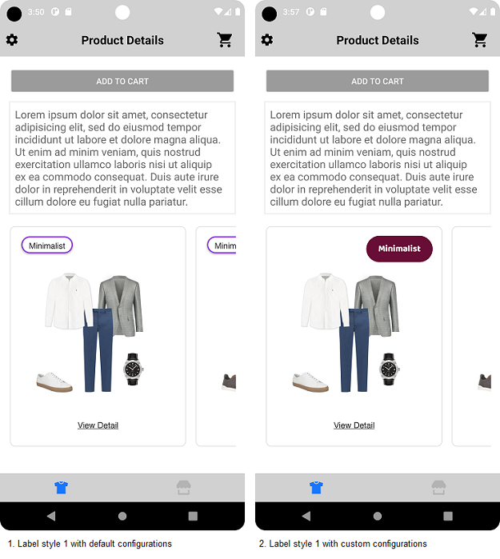
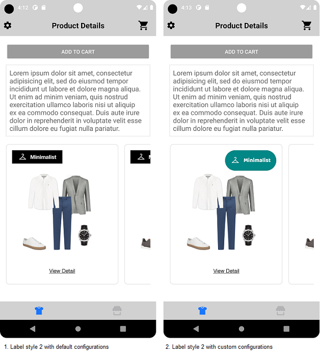
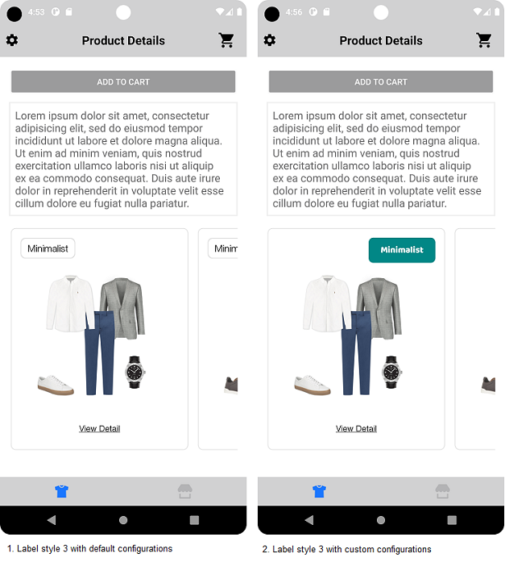
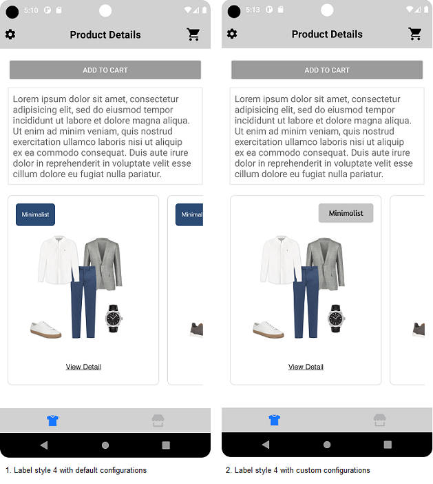
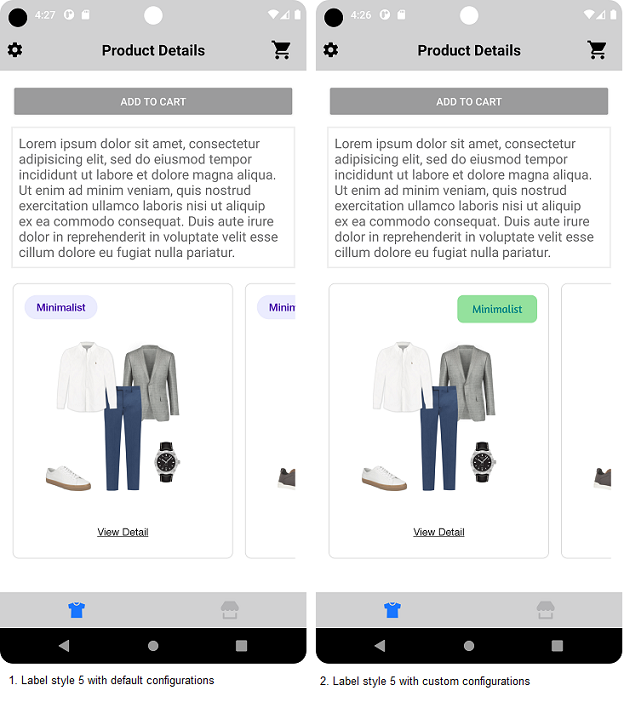
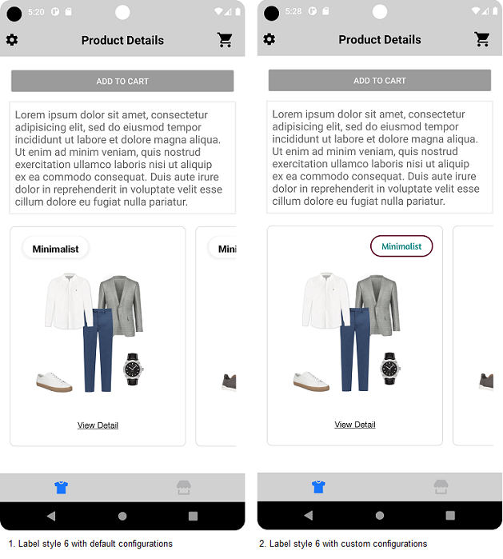
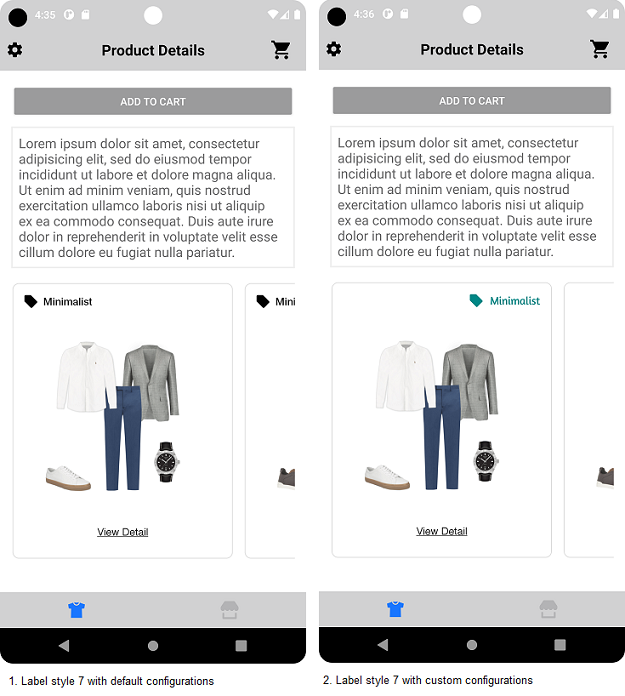

# Labels

UX SDK provides various Label styles for the Top Label view displayed in Classic Outfit Widget.

## Label Styles Configuration

Data SDK fetches from the Stylitics server which Label style is supposed to be used for displaying Top Label in the Classic Outfit Widget. The Top label is displayed only when below conditions are satisfied-
1. Data SDK receives from Stylitics server which label style is expected to be used. 
2. When Outfits received from Stylitics server are configured to display the Label.

There are seven Label styles available in the UX SDK. If Integrator app does not provide configurations for the top label styles, UX SDK uses the default configurations. If Integrator app does not want to continue with the default configs, they can provide their own custom configurations.

Below are the labels styles with their *_**default configurations, syntax to pass custom configurations and their screenshots**_*. 

### Label 1 

### 1. Default configurations

| Config Parameters     | Description                                                                                | Default Value             |
|-----------------------|---|---------------------------|
| `title`               | to set the title of the label                                                              | Personalised Text         |
| `fontFamilyAndWeight` | is the font style with the font weight and is accessed from the font resource folder       | `Helvetica Neue Regular`  |
| `fontSize`            | is the font size in float and internally it is converted into sp                           | `14f`                     |
| `fontColor`           | is text color and is accessed from color.xml resource file                                 | `#212121`                 |
| `backgroundColor`     | is background color and is accessed from drawable resource file                            | `#FFFFFF`                 |
| `borderColor`         | is border color and is accessed from drawable resource file                                | `#8E39E3`                 |
| `borderWeight`        | is border width and is accessed from drawable resource file                                | `2`                       |
| `cornerRadius`        | is border radius and is accessed from drawable resource file                               | `100`                     |
| `paddingVertical`     | is top and bottom padding of the button in float and internally it is converted to dp      | `6`                       |
| `paddingHorizontal`   | is left and right padding of the button in float and internally it is converted to dp      | `16`                      |

### 2. Syntax to pass custom Configurations

Below is the code to provide the custom configurations for the Label1.
 
```kotlin
val topLabelConfig = TopLabel(
            label1 = TopLabel.Label1(
                background = R.drawable.top_label_border,
                fontSize = 15f,
                fontColor = R.color.black,
                fontFamilyAndWeight = R.font.baloo_bhai,
                paddingVertical = 10f,
                paddingHorizontal = 20f,
            )
)

itemsRecyclerView.load(
    outfits, OutfitsTemplate.Classic(
        classicConfig = ClassicConfig(
            topLabel = topLabelConfig,
        )
    )
)
```

*Note : The Top Label view position is only configurable in the Classic Outfit widget. By default, it is configured to Top Left.*

Below is the example code to re-configure the Top Label view position to Top.Right in Classic Outfit widget.

```kotlin
val topLabelConfig = TopLabel(
            label1 = TopLabel.Label1(
                background = R.drawable.top_label_border,
                fontSize = 15f,
                fontColor = R.color.black,
                fontFamilyAndWeight = R.font.baloo_bhai,
                paddingVertical = 10f,
                paddingHorizontal = 20f,
            )
)

itemsRecyclerView.load(
    outfits, OutfitsTemplate.Classic(
        classicConfig = ClassicConfig(
            topLabel = topLabelConfig,
            topLabelPosition = TopLabelPosition.TOP_RIGHT
        )
    )
)
```

</br>


### Label 2

### 1. Default configurations

| Config Parameters   | Description                                                                                              | Default Value         |
|---|---|-----------------------|
| `title`               | to set the title of the label                                                                            | Personalised Text     |
| `fontFamilyAndWeight` | is the font style with the font weight and is accessed from the font resource folder                     | `Helvetica Neue Bold` |
| `fontSize`            | is the font size in float and internally it is converted into sp                                         | `14f`                 |
| `fontColor`           | is text color and is accessed from color.xml resource file                                               | `#FFFFFF`             |
| `backgroundColor`     | is background color and is accessed from drawable resource file                                          | `#000000`             |
| `textAndIconSpacing`  | is space between the icon and the title text.It is accessed in float and internally converted to the dp  | `8`                   |
| `paddingVertical`     | is top and bottom padding of the button in float and internally it is converted to dp                    | `6`                   |
| `paddingHorizontal`   | is left and right padding of the button in float and internally it is converted to dp                    | `16`                  |

### 2. Syntax to pass custom Configurations

Below is the code to provide the custom configurations for the Label2.

```kotlin
val topLabelConfig = TopLabel(
    label2 = TopLabel.Label2(
        background = R.drawable.top_label_border,
        fontSize = 15f,
        fontColor = R.color.white,
        fontFamilyAndWeight = R.font.baloo_bhai,
        paddingVertical = 15f,
        paddingHorizontal = 15f,
        iconAndTitleSpacing = 10f,
    )
)
```

</br>

### Label 3

### 1. Default configurations

| Config Parameters   | Description                                                                                | Default Value          |
|---|---|------------------------|
| `title`               | to set the title of the label                                                              | Personalised Text      |
| `fontFamilyAndWeight` | is the font style with the font weight and is accessed from the font resource folder       | `Helvetica Neue Light` |
| `fontSize`            | is the font size in float and internally it is converted into sp                           | `16f`                  |
| `fontColor`           | is text color and is accessed from color.xml resource file                                 | `#000000`              |
| `backgroundColor`     | is background color and is accessed from drawable resource file                            | `#FFFFFF`              |
| `shadow`              | is background shadow and is accessed from drawable resource file                           | `blurr 4 #000000  16%` |
| `cornerRadius`        | is border radius and is accessed from drawable resource file                               | `8`                    |
| `paddingVertical`     | is top and bottom padding of the button in float and internally it is converted to dp      | `8`                    |
| `paddingHorizontal`   | is left and right padding of the button in float and internally it is converted to dp      | `12`                   |

### 2. Syntax to pass custom Configurations

Below is the code to provide the custom configurations for the Label3.

```kotlin
val topLabelConfig = TopLabel(
    label3 = TopLabel.Label3(
        background = R.drawable.top_label_border,
        fontSize = 15f,
        fontColor = R.color.white,
        fontFamilyAndWeight = R.font.baloo_bhai,
        paddingVertical = 9f,
        paddingHorizontal = 20f,
    )
)
```

</br>

### Label 4

### 1. Default configurations 

| Config Parameters          | Description                                                                           | Default Value                                                                |
|----------------------------|---------------------------------------------------------------------------------------|------------------------------------------------------------------------------|
| `title`                    | to set the title of the label                                                         | Personalised Text                                                            |
| `fontFamilyAndWeight`      | is the font style with the font weight and is accessed from the font resource folder  | `Helvetica Neue Regular`                                                     |
| `fontSize`                 | is the font size in float and internally it is converted into sp                      | `12f`                                                                        |
| `fontColor`                | is text color and is accessed from color.xml resource file                            | `#FFFFFF`                                                                    |
| `background`               | is background before animation and is accessed from drawable resource folder          | [View default configs](LABELS_README.md#Label-4-Background-Before-Animation) |
| `backgroundAfterAnimation` | is background after animation and is accessed from drawable resource folder           | [View default configs](LABELS_README.md#Label-4-Background-After-Animation)  |
| `paddingVertical`          | is top and bottom padding of the button in float and internally it is converted to dp | `12`                                                                         |
| `paddingHorizontal`        | is left and right padding of the button in float and internally it is converted to dp | `12`                                                                         |

#### Label 4 Background Before Animation 

'background' is a resource drawable file that holds below configurations

| Config Parameters   | Description          | Default Value |
|---------------------|----------------------|---------------|
| `color`             | is background color  | '#2E4A55'     |
| `radius`            | is border radius     | `6`           |

#### Label 4 Background After Animation

'backgroundAfterAnimation' is a resource drawable file that holds below configurations

| Config Parameters   | Description         | Default Value |
|---------------------|---------------------|---------------|
| `color`             | is background color | '#2B4B75'     |
| `radius`            | is border radius    | `6`           |


### 2. Syntax to pass custom Configurations

Below is the code to provide the custom configurations for the Label4.

```kotlin
val topLabelConfig = TopLabel(
    label4 = TopLabel.Label4(
        background = R.drawable.top_label_border,
        fontSize = 15f,
        fontColor = R.color.black,
        paddingVertical = 10f,
        paddingHorizontal = 20f,
        fontFamilyAndWeight = R.font.amaranth,
        backgroundAfterAnimation = R.drawable.background_after_animation
    )
)
```

</br>

### Label 5

### 1. Default configurations

| Config Parameters   | Description                                                                           | Default Value           |
|---|---|-------------------------|
| `title`               | to set the title of the label                                                         | `View Detail`           |
| `fontFamilyAndWeight` | is the font style with the font weight and is accessed from the font resource folder  | `Helvetica Neue Medium` |
| `fontSize`            | is the font size in float and internally it is converted into sp                      | `14f`                   |
| `fontColor`           | is text color and is accessed from color.xml resource file                            | `#4700AB`               |
| `backgroundColor`     | is background color and is accessed from drawable resource file                       | `#EBECFE`               |
| `cornerRadius`        | is border radius and is accessed from drawable resource file                          | `100`                   |
| `paddingVertical`     | is top and bottom padding of the button in float and internally it is converted to dp | `8`                     |
| `paddingHorizontal`   | is left and right padding of the button in float and internally it is converted to dp | `16`                    |

### 2. Syntax to pass custom Configurations

Below is the code to provide the custom configurations for the Label5.

```kotlin
val topLabelConfig = TopLabel(
    label5 = TopLabel.Label5(
        background = R.drawable.top_label_border,
        fontSize = 15f,
        fontColor = R.color.teal_700,
        paddingVertical = 10f,
        paddingHorizontal = 20f,
        fontFamilyAndWeight = R.font.amaranth,
    )
)
```

</br>

### Label 6

### 1. Default configurations

| Config Parameters          | Description                                                                           | Default Value                                                                |
|----------------------------|---------------------------------------------------------------------------------------|------------------------------------------------------------------------------|
| `title`                    | to set the title of the label                                                         | Personalised Text                                                            |
| `fontFamilyAndWeight`      | is the font style with the font weight and is accessed from the font resource folder  | `Helvetica Neue Bold`                                                        |
| `fontSize`                 | is the font size in float and internally it is converted into sp                      | `16f`                                                                        |
| `fontColor`                | is text color and is accessed from color.xml resource file                            | `#1E1E1E`                                                                    |
| `background`               | is background before animation and is accessed from drawable resource folder          | [View default configs](LABELS_README.md#Label-6-Background-Before-Animation) |
| `backgroundAfterAnimation` | is background after animation and is accessed from drawable resource folder           | [View default configs](LABELS_README.md#Label-6-Background-Before-Animation) |
| `borderColor`              | is border color and is accessed from drawable resource file                           | `#8E39E3`                                                                    |
| `backgroundWeight`         | is the border width and is accessed from drawable resource file                       | `2`                                                                          |
| `cornerRadius`             | is border radius and is accessed from drawable resource file                          | `32`                                                                         |
| `paddingVertical`          | is top and bottom padding of the button in float and internally it is converted to dp | `12`                                                                         |
| `paddingHorizontal`        | is left and right padding of the button in float and internally it is converted to dp | `22`                                                                         |

#### Label 6 Background Before Animation

'background' is a resource drawable file that holds below configurations

| Config Parameters | Description          | Default Value |
|-------------------|----------------------|---------------|
| `color`           | is background color  | '#FFFFFF'     |
| `radius`          | is corner radius     | `6`           |

#### Label 6 Background After Animation

'backgroundAfterAnimation' is a resource drawable file that holds below configurations

| Config Parameters           | Description          | Default Value          |
|-----------------------------|----------------------|------------------------|
| `color`                     | is background color  | '#FFFFFF'              |
| `radius`                    | is border radius     | `6`                    |
| `shadow`                    | is background shadow | `blurr 10 #000000  5%` |

### 2. Syntax to pass custom Configurations

Below is the code to provide the custom configurations for the Label6.

```kotlin
val topLabelConfig = TopLabel(
    label6 = TopLabel.Label6(
        background = R.drawable.top_label_border,
        fontSize = 15f,
        fontColor = R.color.teal_700,
        paddingVertical = 10f,
        paddingHorizontal = 20f,
        fontFamilyAndWeight = R.font.amaranth,
        backgroundAfterAnimation = R.drawable.background_after_animation
    )
)
```

</br>

### Label 7

### 1. Default configurations

| Config Parameters   | Description                                                                                              | Default Value           |
|---|---|-------------------------|
| `title`               | to set the title of the label                                                                            | Personalised Text       |
| `icon`                | is background color and is accessed from drawable resource file                                          | `#000000`               |
| `fontFamilyAndWeight` | is the font style with the font weight and is accessed from the font resource folder                     | `Helvetica Neue Medium` |
| `fontSize`            | is the font size in float and internally it is converted into sp                                         | `14f`                   |
| `fontColor`           | is text color and is accessed from color.xml resource file                                               | `#1E1E1E`               |
| `textAndIconSpacing`  | is space between the icon and the title text.It is accessed in float and internally converted to the dp  | `8`                     |
| `paddingVertical`     | is top and bottom padding of the button in float and internally it is converted to dp                    | `6`                     |
| `paddingHorizontal`   | is left and right padding of the button in float and internally it is converted to dp                    | `16`                    |

### 2. Syntax to pass custom Configurations

Below is the code to provide the custom configurations for the Label7.

```kotlin
val topLabelConfig = TopLabel(
    label7 = TopLabel.Label7(
        fontSize = 15f,
        fontColor = R.color.teal_700,
        fontFamilyAndWeight = R.font.amaranth,
        iconAndTitleSpacing = 10f,
        iconColor = R.color.teal_700
    )
)
```

</br>


### Configuring All Label Styles

Integrator app can pass custom configurations for multiple Label styles.

### Syntax to pass custom configurations for all Label styles

```kotlin
val topLabelConfig = TopLabel(
    label1 = TopLabel.Label1(
        background = R.drawable.top_label_border,
        fontSize = 15f,
    ),
    label2 = TopLabel.Label2(
        fontSize = 15f
    ),
    label3 = TopLabel.Label3(
        fontColor = R.color.black
    ),
    label4 = TopLabel.Label4(
        fontFamilyAndWeight = R.font.baloo_bhai,
        paddingVertical = 10f,
        paddingHorizontal = 15f
    ),
    label5 = TopLabel.Label5(
        fontFamilyAndWeight = R.font.baloo_bhai
    ),
    label6 = TopLabel.Label6(
        fontSize = 15f,
        fontColor = R.color.black,
        paddingVertical = 10f,
        paddingHorizontal = 15f
    ),
    label7 = TopLabel.Label7(
        fontSize = 15f,
        fontColor = R.color.black,
    )
)

itemsRecyclerView.load(
    outfits, OutfitsTemplate.Classic(
        classicConfig = ClassicConfig(
            topLabel = topLabelConfig,
        )
    )
)
```

### Configuring Some Label Styles

*_**Syntax to pass custom configurations for some Label styles**_*

```kotlin
val topLabelConfig = TopLabel(
    label2 = TopLabel.Label2(
        background = R.drawable.top_label_border,
        fontSize = 15f,
    ),
    label3 = TopLabel.Label3(
        fontSize = 15f
    ),
    label7 = TopLabel.Label7(
        fontColor = R.color.black
    )
)

itemsRecyclerView.load(
    outfits, OutfitsTemplate.Classic(
        classicConfig = ClassicConfig(
            topLabel = topLabelConfig,
        )
    )
)
```


## License

Copyright © 2023 Stylitics
