# Light and Dark Mode Support

This document provides the information about *_**Light and Dark mode support**_* for both default and custom configurations.

## Default Light and Dark Mode Support

Below are the implementation details for the *_**default Light and Dark mode**_* support for UI components implemented in UX SDK.

### 1. Classic Outfit Widget
 
Below screenshot shows the Classic Outfit Widget in default Light and Dark mode.

**Screenshots :**

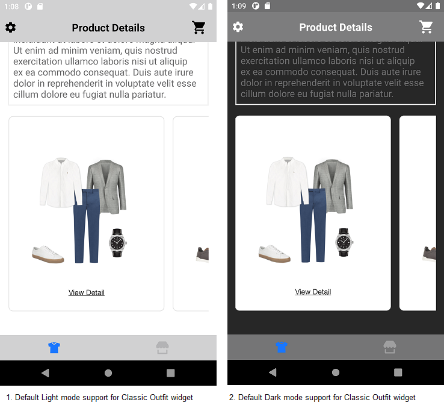

### 2. Hotspot Outfit Widget

No default dark mode support is added to the Hotspot Outfit Widget. In dark mode, the Outfit widget will be displayed with the same configurations as shown below. 

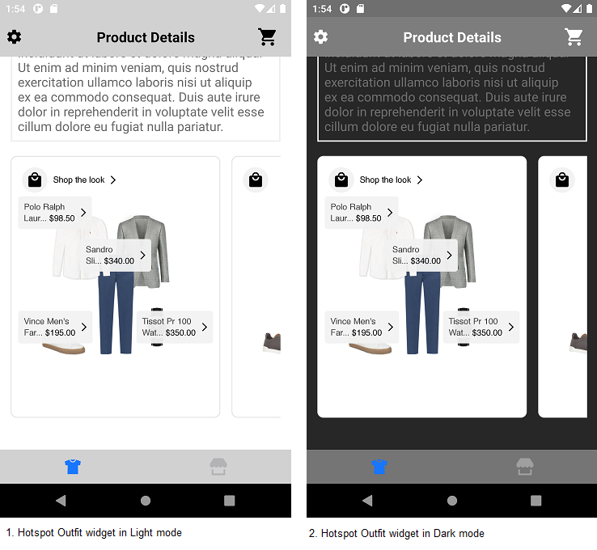

### 3. Dynamic Gallery Widget

No default dark mode support is added to the Dynamic Gallery Widget. In dark mode, the Dynamic Gallery widget will be displayed with the same configurations as shown below.

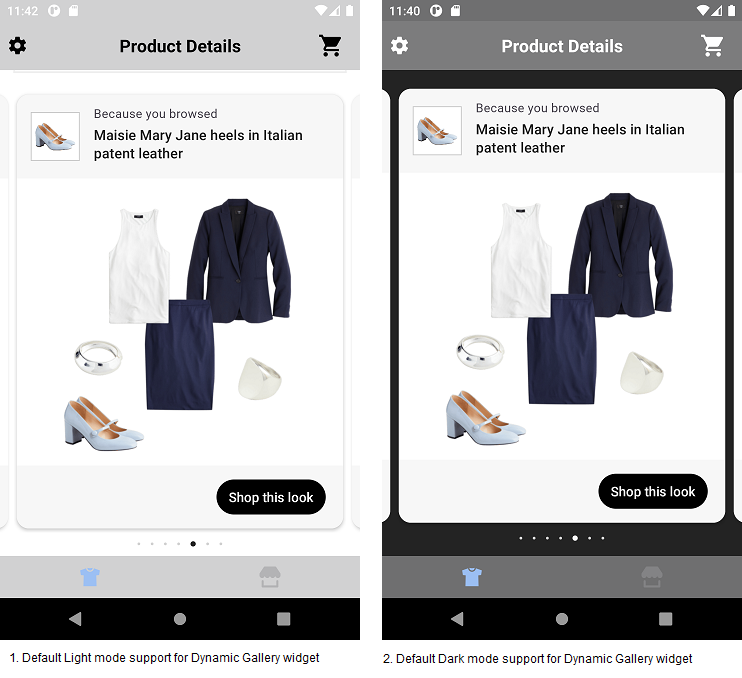

### 4. Standard Product List

Below screenshot shows the Product List screen in default Light and Dark mode.

**Screenshots :**

</br>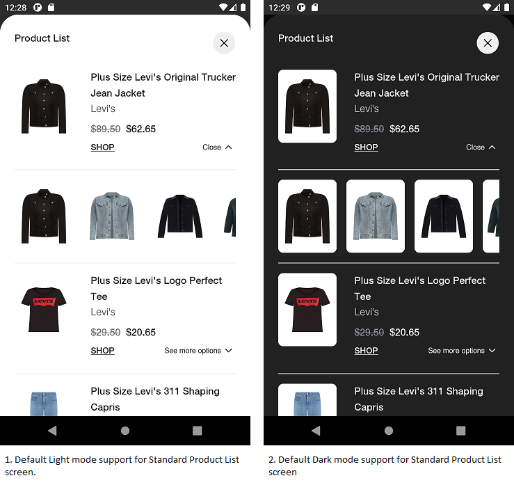

### 5. Dynamic Gallery Product List

No default dark mode support is added to the Dynamic Gallery Product List. In dark mode, the Dynamic Gallery Product List will be displayed with the same configurations as shown below.

**Screenshots :**

</br>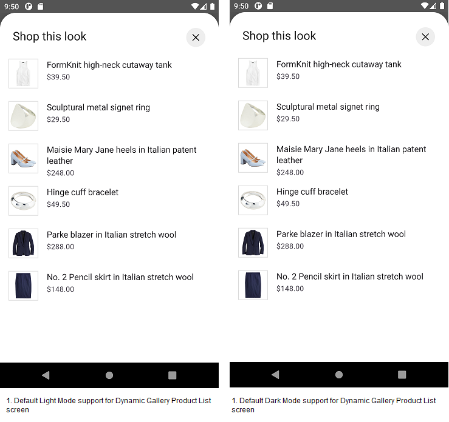


## Custom Light and Dark Mode Support

The default Light and Dark mode colors can be customised by adding colors to the *_**color.xml resource file**_*. Use *_**color.xml from values folder**_* to define Light mode colors and *_**color.xml from values-night folder**_* to define Dark mode colors. Below is the screenshot for the reference.<br /><br />

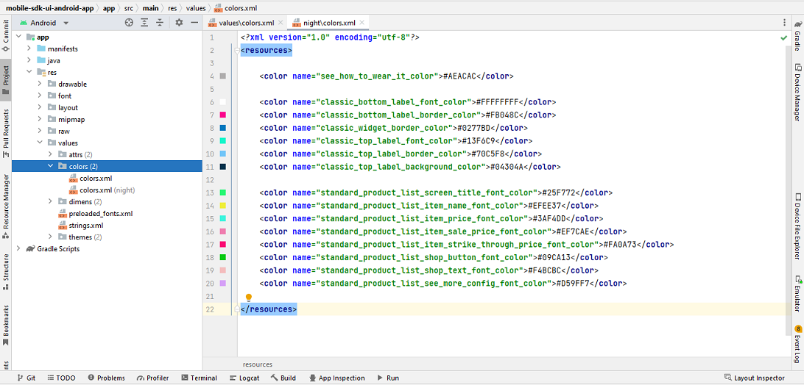

**_**Note**_* : <br />1. If you define a color in Light mode color.xml file(values folder) and *_**not in Dark mode color.xml(values-night folder)**_*, the same color will be used in Dark mode too. <br />2. If you define a color in Dark mode color.xml file(values-night folder) and *_**not in Light mode color.xml(values folder)**_*, this will give the syntax error. So the colors should be defined in both the color.xml files*

Below are the implementation details to customise the Light and Dark mode support from Sample Integrator App.

### 1. Classic Outfit Widget

Below screenshot shows the Classic Outfit Widget in custom Light and Dark mode.

**Screenshots :**

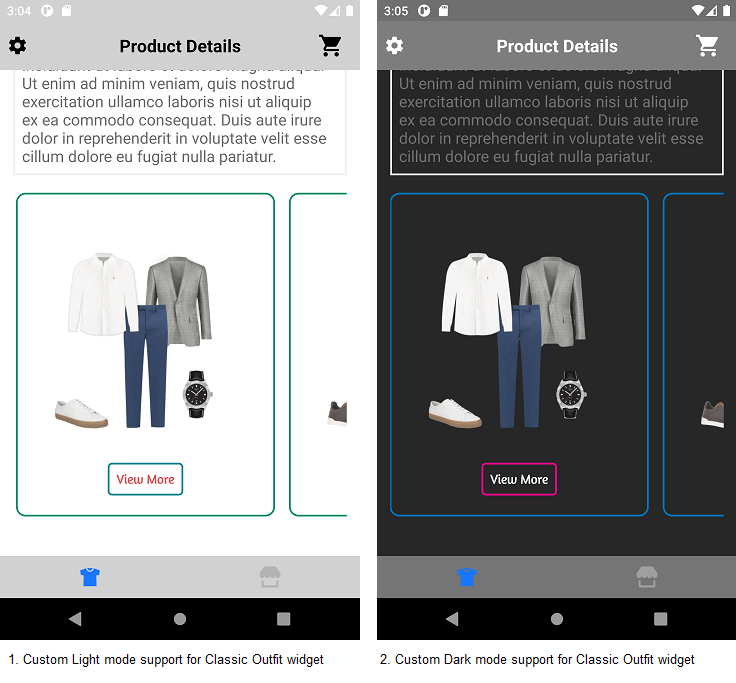

### 2. Hotspot Outfit Widget

Below screenshot shows the Hotspot Outfit Widget in custom Light and Dark mode.

**Screenshots :**

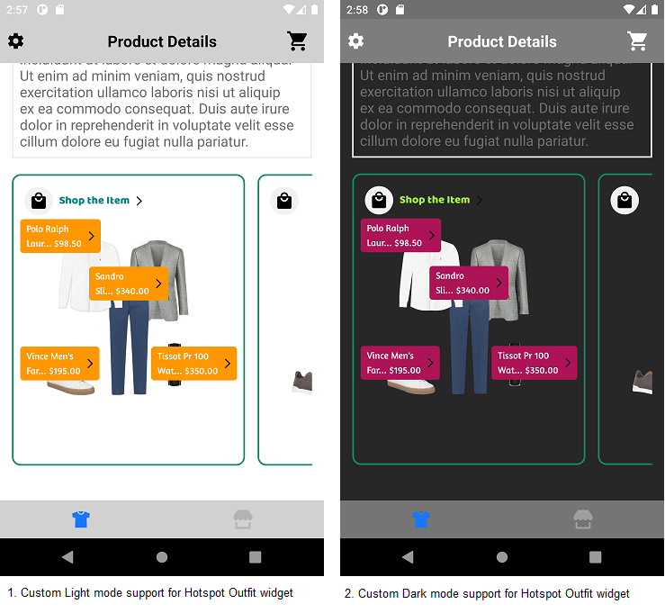

### 3. Dynamic Gallery Widget

Below screenshot shows the Dynamic Gallery Widget in custom Light and Dark mode.

**Screenshots :** 

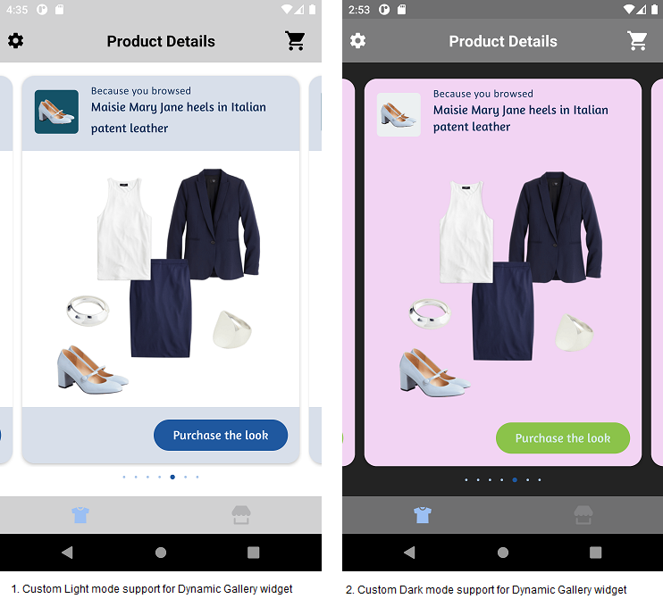

### 3. Standard Product List

Below screenshot shows the Standard Product List screen in custom Light and Dark mode.

**Screenshots :** 

</br>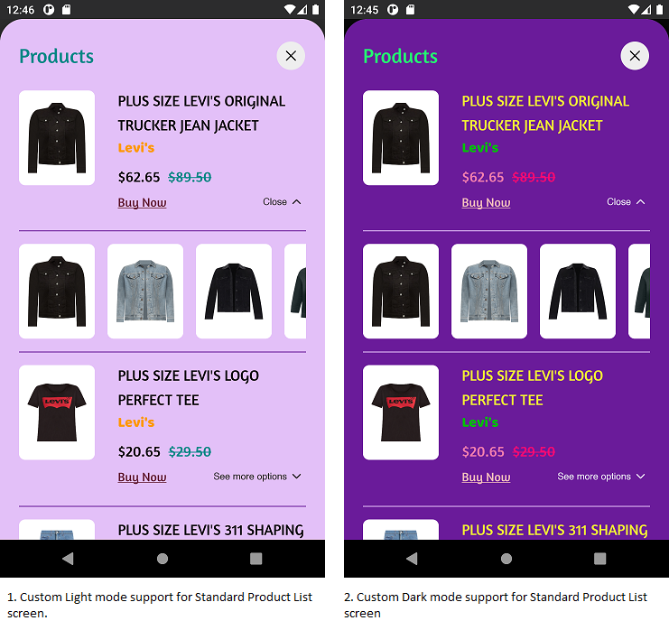

### 4. Dynamic Gallery Product List

Below screenshot shows the Dynamic Gallery Product List screen in custom Light and Dark mode.

**Screenshots :**

</br>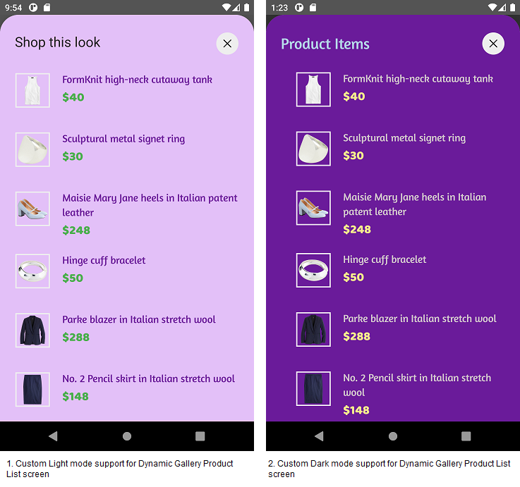


**Code example to customize the Dark And Light Mode colors**

```kotlin

val outfitsRecyclerView = findViewById<StyliticsUIApi>(R.id.outfitsRecyclerView)

private fun customizeDarkAndLightModeConfiguration(outfits: Outfits) {
    val topLabelConfig = TopLabel(
        label3 = TopLabel.Label3(
            fontColor = R.color.classic_top_label_font_color,
            background = R.drawable.top_label_border
        )
    )
    outfitsRecyclerView?.load(
        outfits, OutfitsTemplate.Classic(

            //Custom color configuration for Classic Outfit Widget components
            classicConfig = ClassicConfig(
                widgetBackground = R.drawable.classic_outfit_border,
                topLabel = topLabelConfig,
                bottomLabel = ClassicConfig.BottomLabel(
                    fontColor = R.color.classic_bottom_label_font_color,
                    background = R.drawable.view_detail_background,
                )
            )
        ),
        productListScreenTemplate = ProductListScreenTemplate.Standard(
            productListScreenConfig = ProductListScreenConfig(
                //Custom color configuration for Product List screen title
                itemListHeader = ProductListScreenConfig.ItemListHeader(
                    fontColor = R.color.standard_product_list_screen_title_font_color,
                ),
                //Custom color configuration for Product List view components
                productListConfig = ProductListConfig(
                    itemName = ProductListConfig.ItemName(
                        fontColor = R.color.standard_product_list_item_name_font_color
                    ),
                    itemPrice = ProductListConfig.ItemPrice(
                        priceFontColor = R.color.standard_product_list_item_price_font_color,
                        salePriceFontColor = R.color.standard_product_list_item_sale_price_font_color,
                        strikeThroughPriceFontColor = R.color.standard_product_list_item_strike_through_price_font_color,
                    ),
                    shop = ShopViewType.Text(
                        fontColor = R.color.standard_product_list_shop_text_font_color
                    ),
                    seeMoreConfig = ProductListConfig.SeeMoreOptionsConfig(
                        fontColor = R.color.standard_product_list_see_more_config_font_color,
                    ),
                    itemBackgroundColor = R.color.standard_product_list_item_background_color,
                    itemDividerColor = R.color.standard_product_list_item_divider_color
                )
            )
        )
    )
}
```

Use `color.xml` (from values folder) for Light Mode and `color.xml` (from values-night folder) for Dark Mode in Sample Integrator App.

## In-App Dark Mode Support

### Settings screen

In this screen, user can enable/disable the dark mode manually from application.

Below is the reference code to programmatically change light/dark mode.

```kotlin
override fun onCheckedChanged(view: CompoundButton?, isChecked: Boolean) {
  when (view?.id) {
    R.id.switchCompat -> {
      if (isChecked) {
        AppCompatDelegate.setDefaultNightMode(AppCompatDelegate.MODE_NIGHT_YES)
      } else {
        AppCompatDelegate.setDefaultNightMode(AppCompatDelegate.MODE_NIGHT_NO)
      }
    }
  }
}
```

### Disable Dark Mode

Use the below line of code to disable Dark mode in Integrator app and SDK.

```kotlin
AppCompatDelegate.setDefaultNightMode(AppCompatDelegate.MODE_NIGHT_NO)
```

## License

Copyright © 2023 Stylitics
