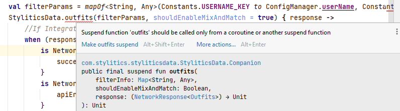

# Stylitics Data SDK

The Stylitics Data SDK enables a host app to use Stylitics services. Currently, the Data SDK provides services to fetch outfits, item replacements, dynamic gallery and send tracking events.

## Dependency

In App level `.build.gradle` file, to access the Data SDK APIs, please add the dependency:

```jsx
implementation files('libs/styliticsdatarelease.aar')
```

*Note: check name of the .aar file and use the provided version if different from above.*

## SDK Configuration

Integrator App must provide an application context and a valid string value for `clientName`. All other configurations have a default value, which can be customized if required by the Integrator app.


- `timeout` - default value is 60 (seconds)
- `enableDebugLogs` - default set to `false`
- `dataApisHost `- default host(Production Environment)
- `trackingApisHost` - default host(Production Environment)
- `clientName` - should always be provided. It is used by Data SDK to fetch Stylitics Experience Configs to identify which features are enabled for the client. Stylitics will provide this value to you.
- `context` - should always be provided
- `locale` - Global config for locale. Default value is null. When it is set to a valid locale, Data SDK APIs will retrieve the relevant data from the server and return localized data.
- `customerProfileId` - Global config for Customer Profile Id. Default value is null. When it is set to a string, the Data SDK will internally convert it to MD5 hash and send it to all tracking events by adding a new key-value pair, i.e., `"client_user_id"`:`"Converted MD5 hashed string for Profile Id"`. 

***Notes*** :

- If the integrator app tries to access any of the Data APIs
    - Before configuring the Data SDK with a valid client name, the Data SDK throws a runtime error with the message “*Client name not configured*”.
    - By configuring SDK without context, it will throw an exception with the message - *“Application context is required, please initialise it using StyliticsData.configure(this) method.”*
- This configuration should be provided only once before using SDK APIs. If you try to configure it again, the Data SDK throws a runtime error with the message *“Already configured, cannot be initialised again”*.

### Configuration Examples

Below are a few samples of how Sample/Integrator app can use the configuration API.

To continue with default configurations:

```kotlin
StyliticsData.configure(MyApplication.getAppContext(), config = StyliticsConfig(clientName =  "ABC"))
```

To enable Retrofit and Stylitics SDK logs in logcat:

```kotlin
StyliticsData.configure(MyApplication.getAppContext(), config = StyliticsConfig(clientName =  "ABC", enableDebugLogs = true))
```

To change the timeout value for Stylitics Data SDK APIs:

```kotlin
StyliticsData.configure(MyApplication.getAppContext(), config = StyliticsConfig(clientName =  "ABC", timeout = 70))
```

To configure the locale value for Stylitics Data SDK APIs, use the below syntax:

```kotlin
StyliticsData.configure(MyApplication.getAppContext(), config = StyliticsConfig(clientName = "ABC", locale = "en-gb"))
```

To configure the Customer Profile Id value for Stylitics Data SDK, use the below syntax:

```kotlin
StyliticsData.configure(MyApplication.getAppContext(), config = StyliticsConfig(clientName = "ABC", customerProfileId = "myCustomerProfileId@123"))
```


### Hosts config

For **Data APIs**, the SDK supports Production, Staging, and Custom hosts. The syntax for setting up a staging and custom host for Data APIs is as follows: (*Note: Since production is default, no need to configure it.)*

**Staging**

```kotlin
StyliticsData.configure(MyApplication.getAppContext(), config = StyliticsConfig(clientName =  "ABC", dataApisHost = DataApisHost.Staging))
```

**Custom**

```kotlin
StyliticsData.configure(MyApplication.getAppContext(), config = StyliticsConfig(clientName =  "ABC", dataApisHost = DataApisHost.Custom("xyz.stylitics.com")))
```

For **Tracking APIs**, the SDK supports Production, Staging, and Custom hosts. The syntax for setting up a staging and custom host for tracking APIs is as follows: (*Note : Since production is default no need to configure it*.)

**Staging**

```kotlin
StyliticsData.configure(MyApplication.getAppContext(), config = StyliticsConfig(clientName =  "ABC", trackingApisHost = TrackingApisHost.Staging))
```

**Custom**

```kotlin
StyliticsData.configure(MyApplication.getAppContext(), config = StyliticsConfig(clientName =  "ABC", trackingApisHost = TrackingApisHost.Custom("xyz.stylitics.com")))
```

To update multiple or all configuration values for Stylitics Data SDK APIs, use the below syntax:

```kotlin
StyliticsData.configure(
    MyApplication.getAppContext(),
    config = StyliticsConfig(
        clientName = "ABC",
        enableDebugLogs = BuildConfig.DEBUG,
        dataApisHost = DataApisHost.Staging,
        trackingApisHost = TrackingApisHost.Staging,
        timeout = 90,
        locale = "en-gb",
        customerProfileId = "myCustomerProfileId@123"
    )
)
```

## Update Global locale

The `updateGlobalLocale(_)` method is used to update global locale configured during SDK initialisation.

- `locale`: An optional string representing the locale to be set globally.

### Description

This method checks whether the SDK has been configured or not. If the SDK is configured, it updates the global locale value. If the SDK is not configured, it throws an error. After a successful update, all subsequent Stylitics API calls will use the updated global locale value (if there is no locale in outfits Api call). The results of previously fetched API calls will not be affected.

### Throws

This method may throw an exception if the SDK is not configured. The exception type is `RuntimeException` with the message "Data SDK isn't configured yet.".

### Example

```kotlin
val locale = "en-GB"
StyliticsData.updateGlobalLocale(locale)
```

## Update Global Customer Profile Id

The `updateCustomerProfileId(_)` method is used to update Customer Profile Id.

- `customerProfileId`: An optional string representing the Customer Profile Id to be set globally.

### Description

This method checks whether the SDK has been configured or not. If the SDK is configured, it updates the `customerProfileId` value. If the SDK is not configured, it throws an error. After a successful update, the Data SDK will internally convert it to MD5 hash and send it to all tracking events.

### Throws

This method may throw an exception if the SDK is not configured. The exception type is `RuntimeException` with the message "Data SDK isn't configured yet.".

### Example

```kotlin
val customerProfileId = "myCustomerProfileId@123"
StyliticsData.updateCustomerProfileId(customerProfileId)
```

## Mix and Match

If the client has the Mix and Match Experience enabled and if the Sample/Integrator app sends `shouldEnableMixAndMatch` as true in the Outfits API call, Mix and Match feature is enabled.

### Experiences API  /  in-app config flag behavior

| Experience config API, MnM enabled? | shouldEnableMixAndMatch flag | Result |
|-------------------------------------|------------------------------|--------|
| true                                | true                         | true   |
| true                                | false                        | false  |
| false                               | true                         | false  |
| false                               | false                        | false  |

*Note : Experience API permissions are fetched by Data SDK using provided `clientName` during SDK configuration.*

### Example to enable Mix and Match from Sample/Integrator App

*Note: assumes per the above table that MnM is enabled server-side, and reported as such by the Experiences API*

```kotlin
val filterParams = mapOf<String, Any>("username" to "xyz", "item_number" to "123456")

StyliticsData.outfits(filterParams, shouldEnableMixAndMatch = true) { 
	response ->    
		when (response) {
	    is NetworkResponse.Success -> {
				println("Success : isMixAndMatchEnabled ${response.body.isMixAndMatchEnabled}")         
			}         
			is NetworkResponse.ApiError -> {             
				println("API error : ${response.error}")         
			}         
			is NetworkResponse.NetworkError -> {             
				println("Network error : ${response.throwable}")         
			}    
	}
}
```

## Stylitics Data API Call Examples

After configuring the Stylitics Data SDK, the Integrator App can invoke the APIs

*Note*: All functions responsible for API calls are 'suspend' functions. Integrators must call the API either from a suspend function or using coroutines; otherwise, it will result in the compilation error shown below.



### Fetch Outfits using item number

*Note*: *More than 1 item number can be passed as a comma separated string.*

```kotlin
val filterParams = mapOf<String, Any>("username" to "xyz", "item_number" to "123456")

StyliticsData.outfits(filterParams) { response ->    
	when (response) {     
		is NetworkResponse.Success -> {
        println("Success ${response.body}")    
		}     
		is NetworkResponse.NetworkError -> { 
       println("Network error : ${response.throwable}")
    }     
		is NetworkResponse.ApiError -> {
       println("API error : ${response.error}")   
	  }   
  }
}
```

### Fetch Outfits using tags

*Note : More than 1 tag can be passed as a comma separated string.*

```kotlin
val filterParams = mapOf<String, Any>("username" to "xyz", "tags" to "abc")
StyliticsData.outfits(filterParams) { response ->    
	when (response) {     
		is NetworkResponse.Success -> {
			println("Success ${response.body}")
		}     
		is NetworkResponse.NetworkError -> {
			println("Network error : ${response.throwable}")
		}     
		is NetworkResponse.ApiError -> {
			println("API error : ${response.error}")
		}    
	}
}
```

### Fetch Outfits using item number and locale

*Note : If the Integrator App has provided a locale value in the API call, it will have higher precedence than the Global config (if configured).*

```kotlin
val filterParams = mapOf<String, Any>("username" to "xyz", "item_number" to "123456", "locale" to "en-gb")

StyliticsData.outfits(filterParams) { response ->
    when (response) {
        is NetworkResponse.Success -> {
            println("Success ${response.body}")
        }
        is NetworkResponse.NetworkError -> {
            println("Network error : ${response.throwable}")
        }
        is NetworkResponse.ApiError -> {
            println("API error : ${response.error}")
        }
    }
}
```

The price fields that are accessible for localization in the API response are listed below.
- `priceLocalized` - Actual product price
- `salePriceLocalized` - Price after discount

### Fetch Outfits using item number with price configs

To configure price, Integrator App should send `price_rounding` and `price_hide_double_zero_cents` as URL params.

*_**Price rounding**_*

| Fields | Description |
| --- | --- |
| none | default |
| floor | round down in every case no matter the decimal count |
| ceiling | round up in every case no matter the decimal count |
| round | round up when equal or greater than .50, and round down when equal or lesser than .49 |

`price_hide_double_zero_cents` - Hide decimals that are .00

```kotlin
val filterParams = mapOf<String, Any>("username" to "xyz", "item_number" to "123456", "price_rounding" to "round", "price_hide_double_zero_cents" to false)

StyliticsData.outfits(filterParams) { response ->
  when (response) {
    is NetworkResponse.Success -> {
      println("Success ${response.body}")
    }
    is NetworkResponse.NetworkError -> {
      println("Network error : ${response.throwable}")
    }
    is NetworkResponse.ApiError -> {
      println("API error : ${response.error}")
    }
  }
}
```

The configured price values are accessible using below fields.
- `priceLocalized` - Actual product price
- `salePriceLocalized` - Price after discount


### Fetch Replacements

*Note: More than 1 id can be passed as a comma separated string.*

```kotlin
val optionsInfo = mapOf("ids" to "123456")
StyliticsData.replacements(optionsInfo) { 
	response ->    
		when (response) {         
			is NetworkResponse.Success -> {
			  println("Success ${response.body}")
			}         
			is NetworkResponse.NetworkError -> {            
				println("Network error : ${response.throwable}")         
			}         
			is NetworkResponse.ApiError -> {
				println("API error : ${response.error}")        
		 }    
	}
}
```

### Fetch Replacements with price configs

To configure price, Integrator App should send `price_rounding` and `price_hide_double_zero_cents` as URL params.

*_**Price rounding**_*

| Fields | Description |
| --- | --- |
| none | default |
| floor | round down in every case no matter the decimal count |
| ceiling | round up in every case no matter the decimal count |
| round | round up when equal or greater than .50, and round down when equal or lesser than .49 |

- `price_hide_double_zero_cents` - Hide decimals that are .00

```kotlin
val requestId = outfitResponse.body.list.first().requestId

val optionsInfo = mapOf("ids" to "123456", "request_id" to requestId, "price_rounding" to "floor", "price_hide_double_zero_cents" to true)
StyliticsData.replacements(optionsInfo) { 
	response ->    
		when (response) {         
			is NetworkResponse.Success -> {
			  println("Success ${response.body}")
			}         
			is NetworkResponse.NetworkError -> {            
				println("Network error : ${response.throwable}")         
			}         
			is NetworkResponse.ApiError -> {
				println("API error : ${response.error}")        
		 }    
	}
}
```

The configured price values are accessible using below fields.
- `priceLocalized` - Actual product price
- `salePriceLocalized` - Price after discount

*_**Note**_*
- To configure price, Integrator app should send `request_id` value from Outfits response
- If the Replacement API has no price configurations, it will use the price configuration used in Outfits Api (if any)

### Fetch Dynamic Gallery

Below is the list of filter parameters to invoke the Dynamic Gallery Api, along with an example of an Api call.
- `username` - Should always be provided.
- `session_id` - Data SDK generates the UUID if Integrator App doesn't pass a value for this. 
- `page` - A string value that represents a web url of the page. Should always be provided.
- `max` - Integrator App should send `max` value in range 1 to 10. If it is beyond the range or no value is sent, Data SDK sets it to `10`.
- `min` - Integrator App should send `min` value in range 1 to 10. If it is beyond the range or no value is sent, Data SDK sets it to `3`. It should not be greater than `max` value.
- `p.b` - A string value of comma-separated previously browsed item ids.
- `p.p` - A string value of comma-separated previously purchased item ids.

```kotlin
val filterParams = mapOf(
  "username" to "demo123",
  "session_id" to "9fc06715-0a59-47e4-b752-be29ff282ea4",
  "page" to "www.stylitics-demo123.com/womens/apparel",
  "min" to 4,
  "max" to 9,
  "p.b" to "BP313_EE3740,BP313_BK0001",
  "p.p" to "BP508_NA6445,BG654_BL8133"
)
viewModelScope.launch {
  StyliticsData.dynamicGalleries(filterParams) { response ->
    when (response) {
      is NetworkResponse.Success -> {
        success(response.body)
      }
      is NetworkResponse.ApiError -> {
        apiError(response.error)
      }
      is NetworkResponse.NetworkError -> {
        networkError(response.throwable)
      }
    }
  }
}
```

## Tracking API Examples

*Note: The `position` is 0 index-based, where referenced*

### Jumplink clicked event

This event should be triggered when the user clicks on the “See How To Wear It” button, using below syntax.

*Note: This must be triggered by the host app, even if the UI SDK is present, because the “jumplink” is always implemented at the host app level.*

```kotlin
val engagementsTrackingInfo = EngagementsTrackingInfo(Event.JUMPLINK)
Engagements.track(engagementsTrackingInfo)
```

### Outfit view event

This event is already triggered inside UX SDK when an Outfit template is used from UX SDK to display Outfits. If Integrator App uses its own custom view to display Outfits, please refer to the below information on triggering the Outfit view event. This event should be triggered when Outfits come into the viewport and are visible. *This event should be triggered only once per Outfit page session, using the below syntax. When triggered by the Stylitics UX SDK, this is accounted for.*

```kotlin
val engagementsTrackingInfo = EngagementsTrackingInfo(Event.VIEW, EngagementInfo.OutfitData(outfit = outfit, position = index))

StyliticsData.engagements(engagementsTrackingInfo)
```

### Outfit click event

This event is already triggered inside UX SDK when an Outfit template is used from UX SDK to display Outfits. If Integrator App uses its own custom view to display Outfits, please refer to the below example of triggering the Outfit click event.

```kotlin
val engagementsTrackingInfo = EngagementsTrackingInfo(Event.CLICK, EngagementInfo.OutfitData(outfit = outfit, position = index))

StyliticsData.engagements(engagementsTrackingInfo)
```

### OutfitItem view event

This event is already handled inside UX SDK when product list view is used from UX SDK to display Outfit items. If Integrator App uses its own custom view to display OutfitItem, this event should be triggered when the user clicks on an outfit and is shown a list of items. Send the outfitItem view event when the item comes into the viewport and is visible, using below syntax.

```kotlin
val engagementsTrackingInfo = EngagementsTrackingInfo(Event.VIEW, EngagementInfo.OutfitItemData(outfitItem = outfitItem, position = index))

StyliticsData.engagements(engagementsTrackingInfo)
```

### OutfitItem click event

This event is already handled inside UX SDK when product list view is used from UX SDK to display Outfit items. If Integrator App uses its own custom view to display OutfitItem, this event should be triggered when a user clicks on an item, using below syntax.

```kotlin
val engagementsTrackingInfo = EngagementsTrackingInfo(Event.CLICK, EngagementInfo.OutfitItemData(outfitItem = outfitItem, position = index))

StyliticsData.engagements(engagementsTrackingInfo)
```

## Dynamic Gallery Bundle view event

This event is already triggered inside UX SDK when Dynamic Gallery template is used from UX SDK to display GalleryBundles. If Integrator App uses its own custom view to display GalleryBundles, please refer to the below information on triggering the GalleryBundle view event. This event should be triggered when GalleryBundles come into the viewport and are visible. *This event should be triggered only once per GalleryBundle page session, using the below syntax. When triggered by the Stylitics UX SDK, this is accounted for.*

```kotlin
val engagementsTrackingInfo = EngagementsTrackingInfo(Event.VIEW, EngagementInfo.GalleryBundleData(galleryBundle = galleryBundle, position = index))

StyliticsData.engagements(engagementsTrackingInfo)
```

## Dynamic Gallery Bundle click event

This event is already triggered inside UX SDK when an Dynamic Gallery template is used from UX SDK to display GalleryBundles. If Integrator App uses its own custom view to display GalleryBundles, please refer to the below example of triggering the GalleryBundle click event.

```kotlin
val engagementsTrackingInfo = EngagementsTrackingInfo(Event.CLICK, EngagementInfo.GalleryBundleData(galleryBundle = galleryBundle, position = index))

StyliticsData.engagements(engagementsTrackingInfo)
```

## Dynamic Gallery Bundle Item view event

This event is already handled inside UX SDK when Gallery Product List view is used from UX SDK to display Gallery Bundle items. If Integrator App uses its own custom view to display GalleryBundleItems, this event should be triggered when the user clicks on an GalleryBundle and is shown a list of items. Send the outfitItem view event when the item comes into the viewport and is visible, using below syntax.

```kotlin
val engagementsTrackingInfo = EngagementsTrackingInfo(Event.VIEW, EngagementInfo.GalleryBundleItemData(galleryBundleItem = galleryBundleItem, position = index))

StyliticsData.engagements(engagementsTrackingInfo)
```

## Dynamic Gallery Bundle Item click event

This event is already handled inside UX SDK when Gallery Product List view is used from UX SDK to display Gallery Bundle items. If Integrator App uses its own custom view to display GalleryBundleItems, this event should be triggered when a user clicks on an item, using below syntax.

```kotlin
val engagementsTrackingInfo = EngagementsTrackingInfo(Event.CLICK, EngagementInfo.GalleryBundleItemData(galleryBundleItem = galleryBundleItem, position = index))

StyliticsData.engagements(engagementsTrackingInfo)
```

### Item add-to-cart event

This event should be triggered when the user adds a Stylitics data item to the cart, using below syntax.

**Outfit Item**
```kotlin
val engagementsTrackingInfo = EngagementsTrackingInfo(Event.ADD_TO_CART, EngagementInfo.OutfitItemData(outfitItem = outfitItem, position = index))

StyliticsData.engagements(engagementsTrackingInfo)
```

**Gallery Bundle Item**
```kotlin
val engagementsTrackingInfo = EngagementsTrackingInfo(Event.ADD_TO_CART, EngagementInfo.GalleryBundleItemData(galleryBundleItem = galleryBundleItem, position = index))

StyliticsData.engagements(engagementsTrackingInfo)
```

### Purchase event

This event should be triggered by Integrator/Sample app when user purchases any item provided by Stylitics data. It will help Stylitics provide better recommendations for the user.

Setting up the purchased items data:

```kotlin
val itemInfoList:PurchasedItemInfo = PurchasedItemInfo(itemId = 1234, price = 12.34)
```

When order id is not available:

```kotlin
val purchasedItems = PurchasedItems(currency = Constants.CURRENCY, itemInfoList = itemInfoList)
```

When order id is available:

```kotlin
val purchasedItems = PurchasedItems(currency= Constants.CURRENCY, orderId= orderId, itemInfoList= itemInfoList)
```

Then (in either case):

```kotlin
StyliticsData.purchases(purchasedItems) {  
	if (it is NetworkResponse.NetworkError) {
		println("Network error : ${it.throwable}")  
	} else if (it is NetworkResponse.ApiError) {
		println("API error: ${it.error}, Header: ${it.headers}")  
	}
}
```

## Stylitics API Documentation

Go through the below link to learn more about the Data and Tracking APIs and their input parameters.

### Data API

[https://widget-api-staging.stylitics.com/index.html#/](https://widget-api-staging.stylitics.com/index.html#/)

### Tracking API

[http://datastream-staging.stylitics.com/api/api-docs/](http://datastream-staging.stylitics.com/api/api-docs/)

## Technologies Used

- Android Studio as IDE(**v** Chipmunk | 2021.2.1 Patch 1)
- Kotlin as programming language(**v** 1.6.21)

## Permissions

Please ensure that the Internet permission is provided in the Manifest file of Integrator App.

```
 <uses-permission android:name="android.permission.INTERNET"/>
```

## License

Copyright © 2023 Stylitics
