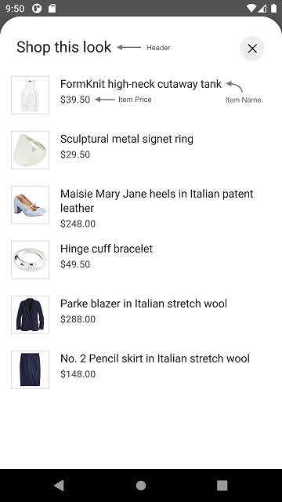
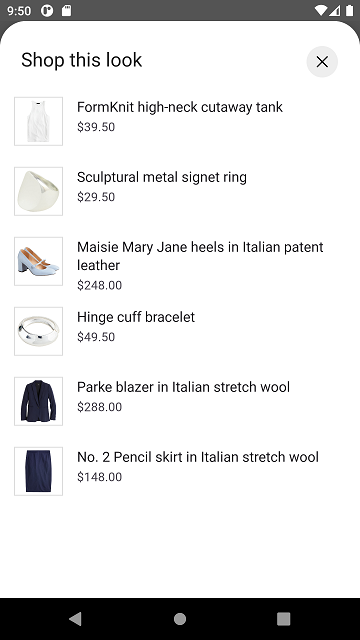
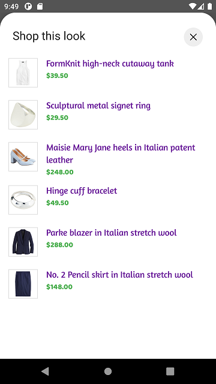

# DYNAMIC GALLERY PRODUCT LIST

It provides views to display Stylitics Dynamic GalleryBundleItems. It also handles invoking of item tracking events based on user interaction with these views.

## Gallery Product List Screen

* This screen is displayed when user clicks on an Dynamic Gallery widget `Shop this look` cta.
* There are two different ways to show Gallery Product List Screen.
    1. Product List Screen From UX SDK
    2. Product List Screen From Sample Integrator App

### Gallery Product List Screen From UX SDK

Below are the features for Gallery Product List Screen 
* Configure all the UI elements for Gallery Product List Screen
* Handles GalleryBundle Item `View` and `Click` tracking events so Sample Integrator App does not have to do it
* Provides listeners to Sample Integrator App so they can handle the GalleryBundle Item `View` and `Click` events
* If Sample Integrator App does not implement GalleryBundle Item click listener, a Web View is opened when user selects GalleryBundleItem

*Note: It is recommended that Sample Integrator App always provides the **onOutfitItemClick** listener implementation*.

### Gallery Product List Screen Configurations

</br>

### Header

| Fields                         | Description                                                                                                          | Default Value                  |
|--------------------------------|----------------------------------------------------------------------------------------------------------------------|--------------------------------|
| `title`                        | to set the header of the screen                                                                                      | `Shop this look`               |           
| `productListScreenHeaderAlign` | to set the product list screen title alignment with close button. It will be center aligned when the value is CENTER | `Top`                          |           
| `fontFamilyAndWeight`          | is the font style with the font weight and is accessed from the font resource folder                                 | `R.font.roboto_regular`        |
| `fontSize`                     | is the font size in float and internally it is converted into SP                                                     | `22f`                          |
| `fontColor`                    | is text color and is accessed from color.xml resource file                                                           | `#212121`                      |

### Presentation Style

| Fields               | Description                                 | Default Value                    |
|----------------------|---------------------------------------------|----------------------------------|
| `presentationStyle`  | to set the Product List Presentation style  | `PresentationStyle.FULL_SCREEN`  |

### Gallery Product List view 

| Fields                       | Description                                                                                  | Default Value                                 | 
|------------------------------|----------------------------------------------------------------------------------------------|-----------------------------------------------|
| `backgroundColor`            | is to change gallery product list background color and is accessed from color.xml resource file      | `#FFFFFF`                                     |
| `paddingVertical`            | is top and bottom padding of the button in float and internally it is converted to dp        | `12f`                                         |            
| `paddingHorizontal`          | is left and right padding of the button in float and internally it is converted to dp        | `16f`                                         |            
| `imageBackground      `      | is the item image background drawable                                                        | `R.drawable.gallery_pl_item_biew_background`  |            
| `productDetailsPadding`      | is left and right padding of the item text content view in float and internally it is converted into dp                                 | `16f`                                         |

### Item Name

| Fields                       | Description                                                                                | Default Value                  | 
|------------------------------|--------------------------------------------------------------------------------------------|--------------------------------|
| `productNameFontSize`        | is font size in float and internally it is converted into sp                               | `16f`                          | 
| `productNameVerticalSpacing` | is to set the spacing between two lines                                                    | `2f`                           |            
| `productNameFontColor`       | is text color which is accessed from color.xml resource file                               | `#1D1B20`                      | 
| `productNameFontFamily`      | is text font style with the font weight and is accessed from the font resource folder      | `R.font.roboto_regular`               |

### Item Price

| Fields                        | Description                                                                                                       | Default Value                  | 
|-------------------------------|-------------------------------------------------------------------------------------------------------------------|--------------------------------|
| `priceFontSize`               | is font size in float and internally it is converted into sp                                                      | `14f`                          |            
| `priceVerticalSpacing`        | is to set top margin in float and internally it is converted into DP                                              | `3f`                           |
| `priceFontColor`              | to set item price text color which is accessed from color.xml resource file                                       | `#49454F`                      | 
| `priceFontFamily`             | is the text font style with the font weight and is accessed from the font resource folder                         | `R.font.roboto_regular`               |           
| `salePriceFontColor`          | to set item sale price text color which is accessed from color.xml resource file                                  | `#212121`                      |
| `strikeThroughPriceFontColor` | is strike through price text color which is accessed from color.xml resource file                                 | `#757575`                      | 
| `decimal`                     | is the number of digits to show after decimal point and it is accepted as a integer                               | `2`                            |            
| `swapPricesPosition`          | is boolean value, when it is false it shows strike through price first and then sale price. Vice versa when true. | `false`                        |
| `style`                       | to show or hide the Strike Through Price                                                                          | `PriceStrikeThrough.SHOW`      |

*Note : 1. *_**swapPricesPosition**_* in Item Price is to reverse the positions of Price and Strike Through Price.<br />
 &nbsp;&nbsp;&nbsp;&nbsp;&nbsp;&nbsp;&nbsp;&nbsp;&nbsp;&nbsp;2. *_**priceFontColor**_* is to change the color of item price.<br />
 &nbsp;&nbsp;&nbsp;&nbsp;&nbsp;&nbsp;&nbsp;&nbsp;&nbsp;&nbsp;2. *_**salePriceFontColor**_* is to change the color of item sale price.<br />
 &nbsp;&nbsp;&nbsp;&nbsp;&nbsp;&nbsp;&nbsp;&nbsp;&nbsp;&nbsp;3. *_**strikeThroughPriceFontColor**_* is to change the color of old price of item.*

[Click here](CODE_REFERENCE_README.md#Dynamic-Gallery-Product-List-View-Configuration-Samples) to find code references for different configuration examples.

### Gallery Product List Screen from UX SDK with Default Configurations

Below is the example of Gallery Product List Screen when Sample Integrator App chooses to use default UI configurations.

*_**XML**_*

```xml
<com.stylitics.ui.StyliticsUIApi 
        android:id="@+id/galleryRecyclerView"
        android:layout_width="match_parent"
        android:layout_height="@dimen/size_520" />
```

*_**Kotlin**_*

Below is the code to access Gallery Product List Screen from UX SDK.

It is recommended that Sample Integrator App provide the **onOutfitItemClick** listener implementation.

```kotlin
val galleryRecyclerView = findViewById<StyliticsUIApi>(R.id.galleryRecyclerView)

fun widgetWithProductListFromUXSDKAndAllDefaultConfigurations(galleryBundles: GalleryBundles) {
    galleryRecyclerView.load(
        galleryBundles,
        dynamicGalleryProductListScreenConfig = DynamicGalleryProductListScreenConfig(
            productListListener = DynamicGalleryProductListListener(
                onOutfitItemClick = { galleryBundleInfo, galleryBundleItemInfo ->
                    //Here, in addition to handling any integrator analytics, natively navigate the user to the selected item's PDP (or launch a quick shop experience).
                    Toast.makeText(context, context?.getString(R.string.outfit_item_clicked).plus(" ${galleryBundleItemInfo.position}"), Toast.LENGTH_LONG).show()
                }
            )
        )
    )
}
```
* Below is the Gallery Product List screenshot when Sample Integrator App uses the default configurations

</br>

### Gallery Product List Screen from UX SDK with Custom Configurations

Below are the examples of Gallery Product List Screen when Sample Integrator App chooses to use custom configurations.

*_**XML**_*

```xml
<com.stylitics.ui.StyliticsUIApi 
        android:id="@+id/galleryRecyclerView"
        android:layout_width="match_parent"
        android:layout_height="@dimen/size_520" />
```

*_**Kotlin**_*

### 1. With All Custom Configurations and Listeners

```kotlin
val galleryRecyclerView = findViewById<StyliticsUIApi>(R.id.galleryRecyclerView)

fun widgetWithProductListFromUXSDKAndAllCustomConfigurations(galleryBundles: GalleryBundles) {
    galleryRecyclerView?.load(
        galleryBundles,
        dynamicGalleryProductListScreenConfig = DynamicGalleryProductListScreenConfig(
            itemListHeader = DynamicGalleryProductListScreenConfig.ItemListHeader(
                title = "Product Items",
                fontSize = 25f,
                fontColor = R.color.white,
                fontFamilyAndWeight = R.font.amaranth,
                productListScreenHeaderAlign = GalleryProductListScreenHeaderAlign.CENTER
            ),
            presentationStyle = GalleryProductListPresentationStyle.HALF_SCREEN,
            productListConfigs = DynamicGalleryProductListConfig(
                backgroundColor = R.color.standard_product_list_item_background_color,
                itemName = DynamicGalleryProductListConfig.ItemName(
                    productNameFontSize = 17f,
                    productNameVerticalSpacing = 3f,
                    productNameFontColor = R.color.gallery_product_list_item_name_text_color,
                    productNameFontFamily = R.font.amaranth
                ),
                itemPrice = DynamicGalleryProductListConfig.ItemPrice(
                    priceFontColor = R.color.gallery_product_list_item_price_text_color,
                    priceFontFamily = R.font.baloo_bhai,
                    priceVerticalSpacing = 4f,
                    priceFontSize = 20f,
                    style = PriceStrikeThrough.SHOW,
                    salePriceFontColor = R.color.white,
                    strikeThroughPriceFontColor = R.color.white,
                    decimal = 0,
                    swapPricesPosition = false
                ),
                paddingVertical = 20f,
                paddingHorizontal = 25f,
                imageBackground = R.drawable.outfit_rectangle_border,
                productDetailsPadding = 20f
            ),
            productListListener = DynamicGalleryProductListListener(
                onOutfitItemView = { galleryBundleInfo, galleryBundleItemInfo ->
                    Log.i("GalleryBundleItemEvent", " view event triggered. ${galleryBundleItemInfo.galleryBundleItem.itemId}")
                },
                onOutfitItemClick = { galleryBundleInfo, galleryBundleItemInfo ->
                    Log.i("GalleryBundleItemEvent", " click event triggered. ${galleryBundleItemInfo.galleryBundleItem.itemId}")
                }
            )
        )
    )
}
```

* Below is the Gallery Product List screenshot when Sample Integrator App uses the above configurations.

</br>

### 2. With some custom configurations and listeners

```kotlin
val galleryRecyclerView = findViewById<StyliticsUIApi>(R.id.galleryRecyclerView)

fun widgetWithProductListFromUXSDKAndSomeCustomConfigurations(galleryBundles: GalleryBundles) {
    recyclerView?.load(
        galleryBundles,
        DynamicGalleryInfo(
            dynamicGalleryListener = DynamicGalleryListener(
                onClick = { galleryBundleInfo ->
                    Log.i("DynamicGalleryEvent", " click event triggered. ${galleryBundleInfo.id}")
                }
            )
        ),
        dynamicGalleryProductListScreenConfig = DynamicGalleryProductListScreenConfig(
            productListConfigs = DynamicGalleryProductListConfig(
                itemName = DynamicGalleryProductListConfig.ItemName(
                    productNameFontSize = 17f,
                    productNameVerticalSpacing = 3f,
                    productNameFontColor = R.color.gallery_product_list_item_name_text_color,
                    productNameFontFamily = R.font.amaranth
                ),
                itemPrice = DynamicGalleryProductListConfig.ItemPrice(
                    priceFontColor = R.color.gallery_product_list_item_price_text_color,
                    priceFontFamily = R.font.baloo_bhai,
                    style = PriceStrikeThrough.SHOW,
                    salePriceFontColor = R.color.white,
                ),
            ),
            productListListener = DynamicGalleryProductListListener(
                onOutfitItemClick = { galleryBundleInfo, galleryBundleItemInfo ->
                    Log.i("GalleryProductListEvent", " click event triggered. ${galleryBundleItemInfo.galleryBundleItem.itemId}")
                }
            )
        )
    )
}
```

* Below is the Gallery Product List screenshot when Sample Integrator App uses the above configurations.

</br>

### Gallery Product List Screen From Sample Integrator App

If Sample Integrator App wants to implement their own Gallery Product List Screen, they need to implement GalleryBundle click listener as shown below and create Activity/Fragment by their own.

```kotlin
val galleryRecyclerView = findViewById<StyliticsUIApi>(R.galleryRecyclerView)

fun widgetWhenProductListFromIntegrator(galleryBundles: GalleryBundles) {
    galleryRecyclerView?.load(
        galleryBundles,
        DynamicGalleryInfo(
            dynamicGalleryListener = DynamicGalleryListener(
                onClick = {
                    //Display Product List Screen from Integrator here
                    context?.showGalleryProductList(it)
                }
            )
        ),
        displayGalleryProductListFromSDK = false
    )
}
```

Sample Integrator can create their own Gallery Product List View or access and implement it from UX SDK as given below.

### 1. Gallery Product List View with default configurations

Below is the code to call your own Gallery Product List Screen. 

```Kotlin
fun FragmentActivity.showGalleryProductList(galleryBundle: GalleryBundle) {
    val outfitItemsFragment = DynamicGalleryProductListFragment.newInstance(galleryBundle)
    FragmentManagerUtil.addFragmentOnTop(this, R.id.fragmentContainer, outfitItemsFragment)
}
```

*_**DynamicGalleryProductListFragment**_* is the fragment class to show Gallery Product List Screen

Add below xml code to your Fragments xml file

*_**XML**_*

```xml
<com.stylitics.ui.StyliticsUIApi 
        android:id="@+id/bundleItemsRecyclerView"
        android:layout_width="match_parent"
        android:layout_height="match_parent" />
```

*_**Kotlin**_*

To load the Gallery Product List invoke below method from Fragments `onCreateView`. 

```Kotlin
val itemView: View = inflater.inflate(R.layout.fragment_gallery_bundle_items, container, false)

val bundleItemsRecyclerView = itemView.findViewById<StyliticsUIApi>(R.id.bundleItemsRecyclerView)

fun displayBundleItemsWithDefaultConfigurations(
    galleryBundle: GalleryBundle,
    galleryBundleItem: GalleryBundleItem
) {
    bundleItemsRecyclerView.load(
        galleryBundle,
        dynamicGalleryProductListListener = DynamicGalleryProductListListener(
            onOutfitItemClick = { galleryBundleInfo, galleryBundleItemInfo ->
                //Here, in addition to handling any integrator analytics, natively navigate the user to the selected item's PDP (or launch a quick shop experience).
                Toast.makeText(context, context?.getString(R.string.outfit_item_clicked).plus(" ${galleryBundleItemInfo.position}"), Toast.LENGTH_LONG).show()
            }
        )
    )
}
```

### 2. Gallery Product List View with custom configurations

```Kotlin
val itemView: View = inflater.inflate(R.layout.fragment_gallery_bundle_items, container, false)
val bundleItemsRecyclerView = itemView.findViewById<StyliticsUIApi>(R.id.bundleItemsRecyclerView)

private fun displayBundleItemsWithAllCustomConfigurations(galleryBundle: GalleryBundle) {
    bundleItemsRecyclerView.load(
        galleryBundle,
        galleryProductListConfig = DynamicGalleryProductListConfig(
            backgroundColor = R.color.standard_product_list_item_background_color,
            itemName = DynamicGalleryProductListConfig.ItemName(
                productNameFontSize = 17f,
                productNameVerticalSpacing = 3f,
                productNameFontColor = R.color.gallery_product_list_item_name_text_color,
                productNameFontFamily = R.font.amaranth
            ),
            itemPrice = DynamicGalleryProductListConfig.ItemPrice(
                priceFontColor = R.color.gallery_product_list_item_price_text_color,
                priceFontFamily = R.font.baloo_bhai,
                priceVerticalSpacing = 4f,
                priceFontSize = 20f,
                style = PriceStrikeThrough.SHOW,
                salePriceFontColor = R.color.white,
                strikeThroughPriceFontColor = R.color.white,
                decimal = 0,
                swapPricesPosition = false
            ),
            paddingVertical = 20f,
            paddingHorizontal = 25f,
            imageBackground = R.drawable.outfit_rectangle_border,
            productDetailsPadding = 20f
        ),
        dynamicGalleryProductListListener = DynamicGalleryProductListListener(
            onOutfitItemView = { galleryBundleInfo, galleryBundleItemInfo ->
                Log.i("GalleryBundleItemEvent", " view event triggered. ${galleryBundleItemInfo.galleryBundleItem.itemId}")
            },
            onOutfitItemClick = { galleryBundleInfo, galleryBundleItemInfo ->
                Log.i("GalleryBundleItemEvent", " click event triggered. ${galleryBundleItemInfo.galleryBundleItem.itemId}")
            }
        )
    )
}
```

## License

Copyright © 2023 Stylitics