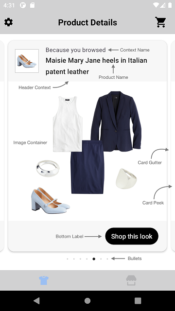
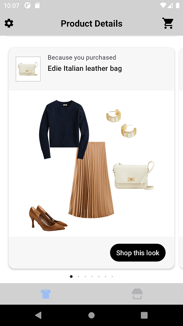
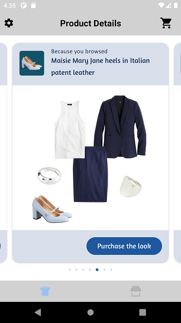
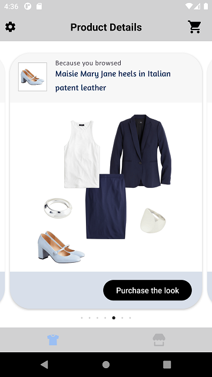

# DYNAMIC GALLERY WIDGET

It provides view to display Stylitics Dynamic Gallery data. It also handles invoking of Widget tracking events based on user interaction with these views.

Below are the features for Dynamic Gallery Widget.</br>

* Configure the UI elements for each Dynamic Gallery Bundle
* Handles `View` and `Click` tracking events so Sample Integrator App does not have to do it
* Provides listeners to Sample Integrator App so they can handle the View and Click events
* Configure whether to display Gallery Bundle Items directly from SDK or not
    * When Gallery Bundle Items are configured to display from SDK, Sample Integrator App can provide configs for it along with Dynamic Gallery configs

## Configurations:



### Widget Background

| Fields             | Description                                                                                       | Default Value | 
|--------------------|---------------------------------------------------------------------------------------------------|---------------|
| `cornerRadius`     | is border corner radius and is accessed from *_**corner radius**_* in drawable resource file      | `14f`         |             
| `backgroundColor`  | is widget background color and is accessed from color.xml resource file                           | `#FFFFFF`     |
| `cardGutter`       | is the space between two widget card and is accessed as float and internally it is converted to dp|  `12f`        |  
| `cardPeek`        | is to set widget card peek size and and is accessed as float and internally it is converted to dp  |  `16f`        |                                                                                      

### Header Context

| Fields                 | Description                                                                                    | Default Value            |
|------------------------|------------------------------------------------------------------------------------------------|--------------------------|
| `backgroundColor`      | is header context background color and is accessed from color.xml resource file                | `#F7F7F7`                | 
| `imageBackgroundColor` | is background color and is accessed from drawable resource file                                | `#FFFFFF`                | 
| `paddingVertical`      | is top and bottom padding of the widget header in float and internally it is converted to dp   | `12f`                    | 
| `paddingHorizontal`    | is left and right padding of the widget header in float and internally it is converted to dp   | `16f`                    |  
| `productNameFontColor` | is text color and is accessed from color.xml resource file                                     | `#212121`                | 
| `productNameFontFamilyAndWeight`  | is the font style with the font weight and is accessed from the font resource folder| `R.font.roboto_medium`          |   
| `productNameVerticalSpacing`| is to set space between the two lines of the text                                         | `2f`                     |            
| `productNameFontSize`       | is the font size in float and internally it is converted into sp                          | `16f`                    |            
| `titleFontColor`            | is text color and is accessed from color.xml resource file                                | `#49454F`                | 
| `titleFontFamilyAndWeight`  | is the font style with the font weight and is accessed from the font resource folder      | `R.font.roboto_regular`         |            
| `titleFontSize`             | is the font size in float and internally it is converted into sp                          | `14f`                    |            

### Bottom Label

| Fields                 | Description                                                                                       | Default Value            |
|------------------------|---------------------------------------------------------------------------------------------------|--------------------------|
| `title`                | to set the title of bottom label                                                                  | `Shop this look`         |                  
| `fontFamilyAndWeight`  | is the font style with the font weight and is accessed from the font resource folder              | `R.font.roboto_medium`   |                  
| `fontSize`             | is the font size in float and internally it is converted into sp                                  | `15f`                    |                  
| `fontColor`            | is text color and is accessed from color.xml resource file                                        | `#FFFFFF`                |         
| `backgroundColor`      | is background color and is accessed from color.xml resource file                                  | `#F7F7F7`                |         
| `ctaBackgroundColor`   | is background color and is accessed from *_**solid color**_* in drawable resource file            |  `R.drawable.shop_this_look_background`|        
| `paddingVertical`      | is top and bottom padding of the widget footer in float and internally it is converted to dp      | `16f`                    | 
| `paddingHorizontal`    | is left and right padding of the widget label footer in float and internally it is converted to dp| `20f`                    |   
| `ctaPaddingVertical`   | is top and bottom padding of the Shop this look cta in float and internally it is converted to dp | `7f`                     |  
| `ctaPaddingHorizontal` | is left and right padding of the Shop this look cta in float and internally it is converted to dp | `14f`                    |

In Android, Bottom Label background color is set using below XML code of drawable resource file, which contains configurations for the above parameters.

Drawable Resource File name : shop_this_look_background
```xml
<?xml version="1.0" encoding="utf-8"?>
<shape xmlns:android="http://schemas.android.com/apk/res/android">

  <corners android:radius="@dimen/size_100"/>
  <solid android:color="@android:color/black"/>
</shape>
```

*_**ctaBackgroundColor**_* is the configurable parameter to set cornerRadius and backgroundColor as shown below.

```kotlin
 ctaBackgroundColor = R.drawable.shop_this_look_background
```

### Bullet

| Fields            | Description                                                                                 | Default Value |
|-------------------|---------------------------------------------------------------------------------------------|---------------|
| `defaultColor`    | is background color and is accessed from color.xml resource file                            | `#D3D3D3`     |
| `highlightedColor`| is background color and is accessed from color.xml resource file                            | `#212121`     |
| `paddingVertical` | is top and bottom padding of the bullet view in float and internally it is converted to dp  | `10f`         |   


[Click here](CODE_REFERENCE_README.md#Dynamic-Gallery-Widget-Configuration-Samples) to find code references for different configuration examples.

## Default Configurations:

* Below are the examples of Dynamic Gallery Widget when Sample Integrator App chooses to use default UI configurations.</br>

* The Dynamic Gallery UI component can be implemented in below different ways.
    1. Dynamic Gallery Product List enabled from SDK
    2. Dynamic Gallery Product List disabled from SDK
    3. Configure Event Listeners

* Dynamic Gallery Widget supports different heights with the following constraints:
  1. Recommended height: `wrap_content`
  2. Minimum supported height: 530dp

  If the Integrator sets a height below 530dp, they may experience UI glitches within the widget.

*_**XML**_*

```xml
<com.stylitics.ui.StyliticsUIApi 
        android:id="@+id/galleryRecyclerView"
        android:layout_width="match_parent"
        android:layout_height="@dimen/size_520" />
```

*_**Kotlin**_*

### 1. Dynamic Gallery Product List enabled from SDK:

When product list is enabled from UX SDK and Sample Integrator App does not provide configurations, it will take default configurations from SDK.

```kotlin
val galleryRecyclerView = findViewById<StyliticsUIApi>(R.id.galleryRecyclerView)

fun widgetWithProductListFromUXSDK(galleryBundles: GalleryBundles) {
       galleryRecyclerView.load(
             galleryBundles
       )
}
```

### 2. Dynamic Gallery Product List disabled from SDK:

```kotlin
val galleryRecyclerView = findViewById<StyliticsUIApi>(R.id.galleryRecyclerView)

fun widgetWhenProductListFromIntegrator(galleryBundles: GalleryBundles) {
     galleryRecyclerView?.load(
          galleryBundles,
          DynamicGalleryInfo(
              dynamicGalleryListener = DynamicGalleryListener(
                  onClick = {
                        //Display Product List Screen from Integrator here
                        context?.showGalleryProductList(it)
                  }
              )
          ),
          displayGalleryProductListFromSDK = false
     )
}
```

### 3. Configure Event Listeners:

```kotlin
val galleryRecyclerView = findViewById<StyliticsUIApi>(R.id.galleryRecyclerView)

private fun widgetWithListenersConfigured(galleryBundles: GalleryBundles) {
  galleryRecyclerView?.load(
        galleryBundles,
            DynamicGalleryInfo(
                 dynamicGalleryListener = DynamicGalleryListener(
                      onClick = { galleryBundleInfo ->
                           Log.i("DynamicGalleryEvent", " click event triggered. ${galleryBundleInfo.id}")
                      },
                      onView = { galleryBundleInfo ->
                           Log.i("DynamicGalleryEvent", " view event triggered. ${galleryBundleInfo.id}")
                      }
                 )
            )
        )
}
```

### Default Dynamic Gallery Widget Screen

* Below is the Dynamic Gallery Widget screenshot when Sample Integrator App uses the above configurations.

</br></br>

## Custom Configurations:

* Sample Integrator App can customise some or all configurations & implement listeners.
* Below are the examples of Dynamic Gallery Widget when Sample Integrator App customises configurations.

### 1. With all configurations & Listeners:

```kotlin
val galleryRecyclerView = findViewById<StyliticsUIApi>(R.id.galleryRecyclerView)

fun widgetWithAllCustomConfigurations(galleryBundles: GalleryBundles) {
    galleryRecyclerView?.load(
    galleryBundles,
        DynamicGalleryInfo(
        dynamicGalleryConfig = DynamicGalleryConfig(
             widget = DynamicGalleryConfig.Widget(
               cardGutter = 20,
               cornerRadius = 16f,
               cardPeek = 25f,
               backgroundColor = R.color.white
             ),
             headerContext = DynamicGalleryConfig.HeaderContext(
               backgroundColor = R.color.header_color,
               imageBackgroundColor = R.drawable.thumbnail_back,
               paddingVertical = 10f,
               paddingHorizontal = 16f,
               productNameFontColor = R.color.text_color,
               productNameFontFamilyAndWeight = R.font.amaranth,
               titleFontColor = R.color.text_color,
               titleFontFamilyAndWeight = R.font.calibri
             ),
             bottomLabel = DynamicGalleryConfig.BottomLabel(
               title = "Purchase the look",
               fontFamilyAndWeight = R.font.amaranth,
               fontSize = 16f,
               fontColor = R.color.white,
               ctaBackgroundColor = R.drawable.footer_cta_back,
               backgroundColor = R.color.header_color,
               paddingVertical = 15f,
               paddingHorizontal = 15f,
               ctaPaddingHorizontal = 25f,
               ctaPaddingVertical = 10f
             ),
             bullet = DynamicGalleryConfig.Bullet(
               defaultColor = R.color.default_bullet_color,
               highlightedColor = R.color.selected_bullet_color,
               paddingVertical = 10f
             )
        ),
        dynamicGalleryListener = DynamicGalleryListener(
            onClick = { galleryBundleInfo ->
                Log.i("DynamicGalleryEvent", " click event triggered. ${galleryBundleInfo.id}")
            },
            onView = { galleryBundleInfo ->
                Log.i("DynamicGalleryEvent", " view event triggered. ${galleryBundleInfo.id}")
            }
        )
        )
    )
}         
```

* Below is the Dynamic Gallery widget screenshot when Sample Integrator App uses the above configurations.

</br>

### 2. With some custom configurations & Listeners:

If Sample Integrator App provides only few configurations, UX SDK will take default configurations for missing fields.

```kotlin
val galleryRecyclerView = findViewById<StyliticsUIApi>(R.id.galleryRecyclerView)

private fun widgetWithSomeCustomConfigurations(galleryBundles: GalleryBundles) {
    //Passing custom configurations for multiple Label styles
     galleryRecyclerView?.load(
         galleryBundles,
         DynamicGalleryInfo(
             dynamicGalleryConfig = DynamicGalleryConfig(
                 widget = DynamicGalleryConfig.Widget(
                     cornerRadius = 40f,
                     backgroundColor = R.color.white,
                 ),
                 headerContext = DynamicGalleryConfig.HeaderContext(
                     paddingVertical = 10f,
                     productNameFontColor = R.color.text_color,
                     productNameFontFamilyAndWeight = R.font.amaranth,
                     titleFontFamilyAndWeight = R.font.calibri
                 ),
                 bottomLabel = DynamicGalleryConfig.BottomLabel(
                     title = "Purchase the look",
                     fontColor = R.color.white,
                     backgroundColor = R.color.header_color,
                     ctaPaddingHorizontal = 25f,
                 )
             ),
        dynamicGalleryListener = DynamicGalleryListener(
            onClick = { galleryBundleInfo ->
                 Log.i("DynamicGalleryEvent", " click event triggered. ${galleryBundleInfo.id}")
            }
        )
    )
  )
}
```

* Below is the Dynamic Gallery Widget screenshot when Sample Integrator App uses the above configurations.

</br>

## Refresh Dynamic Gallery Widget

**Overview**

The `refreshDynamicGalleryTemplate` method can be used to update the Dynamic Gallery widget data or its configurations or both.

**Example**

```Kotlin
fun refreshDynamicGalleryTemplate(galleryBundles: GalleryBundles? = null, widgetConfig: IWidgetConfig? = null)
```

**Parameters**

- `galleryBundles`: Optional parameter to provide updated GalleryBundles data.
- `widgetConfig`: Optional parameter to provide updated configurations for Dynamic Gallery template.

**Usage**

Call the method on the view with optional data/config.

- Get the Dynamic Gallery Widget Template id
```Kotlin
val galleryRecyclerView = findViewById<StyliticsUIApi>(R.id.galleryRecyclerView)
//Load Dynamic Gallery Widget Template
galleryRecyclerView.load(galleryBundles)
```

- To refresh the Dynamic Gallery Widget Template with new GalleryBundles data
```Kotlin
galleryRecyclerView.refreshDynamicGalleryTemplate(galleryBundles = newGalleryBundles)
```
- To refresh the Dynamic Gallery Widget Template with new config
```Kotlin
galleryRecyclerView.refreshDynamicGalleryTemplate(widgetConfig = newConfig)
```
- To refresh the Dynamic Gallery Widget Template with both new GalleryBundles data and config
```Kotlin
galleryRecyclerView.refreshDynamicGalleryTemplate(newGalleryBundles, newConfig)
```

## License

Copyright © 2023 Stylitics