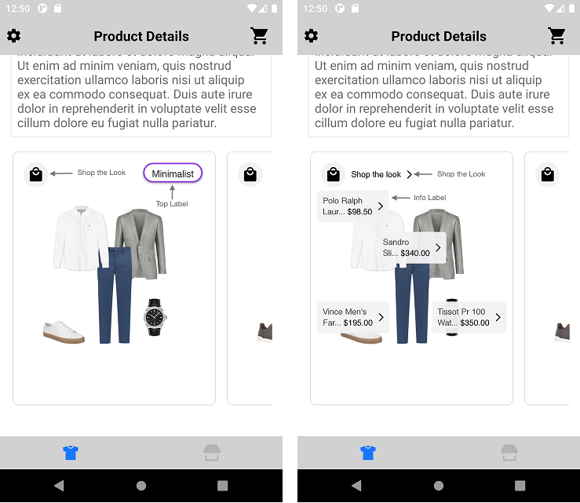
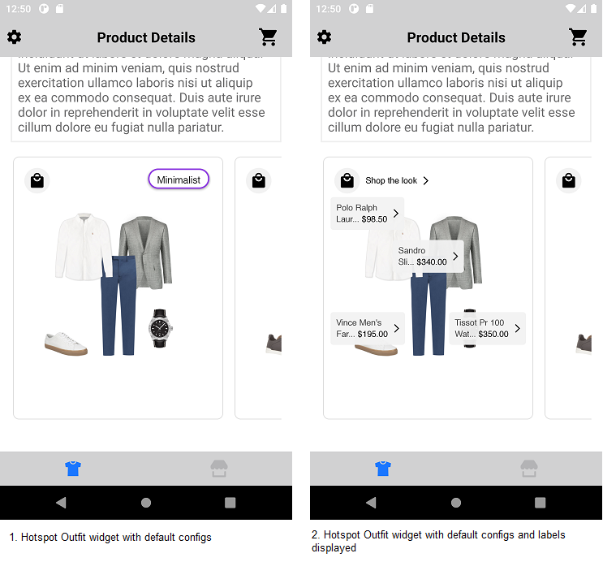
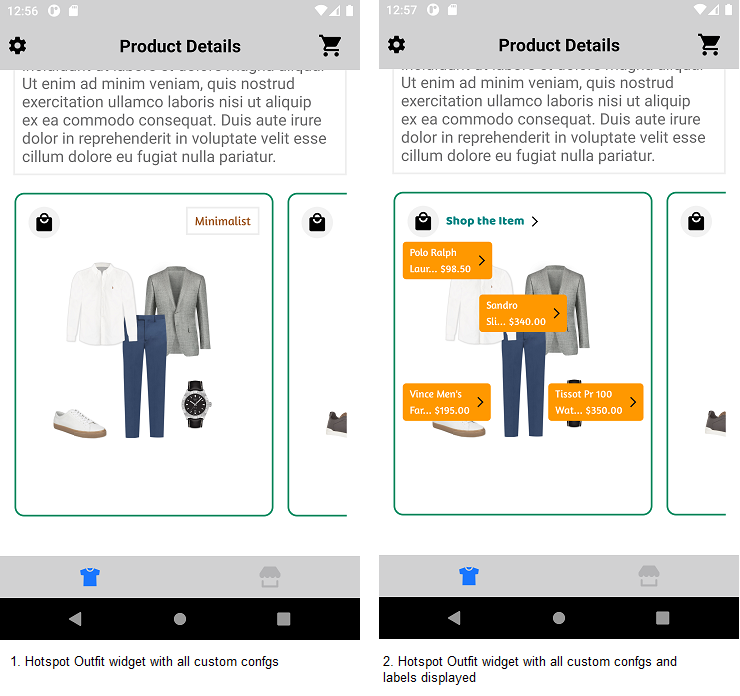
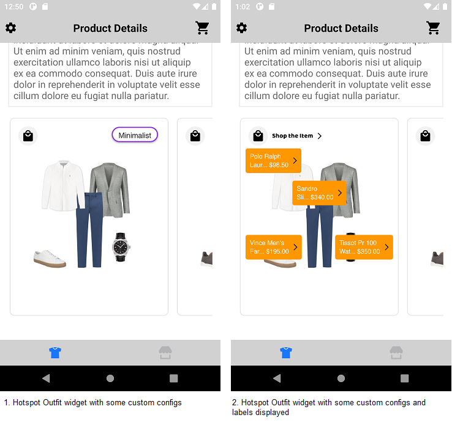

# HOTSPOT WIDGET

It provides view to display Stylitics data. It also handles invoking of tracking events based on user interaction with these views.

Below are the features for Hotspot Outfit Widget.</br>

* Configure all the UI elements for each Outfit
* Handles Outfit tracking events so Sample Integrator App does not have to do it
* Provides listeners to Sample Integrator App so they can handle the Outfit related events
* Configure whether to display Outfit Items directly from SDK or not
    * When Outfit Items are configured to display from SDK, Sample Integrator App can provide configs for it along with Hotspot configs.

## Configurations:



### Widget Background

| Fields             | Description                                                                                    | Default Value |
|--------------------|------------------------------------------------------------------------------------------------|---------------|
| `borderColor`      | is border color and is accessed from *_**stroke color**_* in drawable resource file            | `#E1E1E1`     |
| `borderWeight`     | is border width and is accessed from *_**stroke width**_* in drawable resource file            | `1px`         |
| `cornerRadius`     | is border corner radius and is accessed from *_**corner radius**_* in drawable resource file   | `8px`         |
| `backgroundColor`  | is widget background color and is accessed from *_**solid color**_* in drawable resource file  | `#FFFFFF`     |

In Android, Outfit Widget background is set using below XML code of drawable resource file, which contains configurations for the above parameters. 

Drawable Resource File name : hotspot_widget_background
```xml
<?xml version="1.0" encoding="utf-8"?>
<shape xmlns:android="http://schemas.android.com/apk/res/android">
    <solid android:color="@color/d_hotspot_widget_background_color" />
    <stroke
        android:width="@dimen/size_1"
        android:color="@color/d_hotspot_widget_border_color" />
    <corners android:radius="@dimen/size_8" />
</shape>
```

*_**widgetBackground**_* is the configurable parameter to set borderColor, borderWeight, cornerRadius and backgroundColor as shown below.

```kotlin
 val widgetBackground: Int = R.drawable.hotspot_widget_background
```

### Info Label

| Fields                 | Description                                                                                  | Default Value            |
|------------------------|----------------------------------------------------------------------------------------------|--------------------------|
| `backgroundColor`      | is background color and is accessed from *_**solid color**_* in drawable resource file       | `#F2F2F2F2`              |
| `cornerRadius`         | is border corner radius and is accessed from *_**corner radius**_* in drawable resource file | `4f`                     |
| `fontFamily`           | is the font style and is accessed from the font resource folder                              | `Helvetica Neue Regular` |
| `productNameFontColor` | is product name text color and is accessed from color.xml resource file                      | `#444444`                |
| `priceFontColor`       | is price text color and is accessed from color.xml resource file                             | `#000000`                |

### Shop The Look

| Fields                 | Description                                                                            | Default Value             |
|------------------------|----------------------------------------------------------------------------------------|---------------------------|
| `title`                | to set the title of the text                                                           | `Shop the look`           |
| `fontFamilyAndWeight`  | is the font style with the font weight and is accessed from the font resource folder   | `Helvetica Neue Regular`  |
| `fontSize`             | is font size in float and internally it is converted into SP                           | `12f`                     |
| `fontColor`            | is text color which is accessed from color.xml resource file                           | `#000000`                 |

### Show ScrollBar

| Fields           | Description                                                                         | Default Value |
|------------------|-------------------------------------------------------------------------------------|---------------|
| `showScrollBar`  | is Boolean value, to Show or Hide the horizontal ScrollBar of Hotspot Outfit widget | `false`       |

[Click here](CODE_REFERENCE_README.md#Classic-Widget-Configuration-Samples) to find different configuration examples of classic widget.

## Default Configurations:

* Below are the examples of Hotspot Outfit Widget when Sample Integrator App chooses to use default UI configurations.</br>

* The Hotspot Outfit UI component can be implemented in below different ways.
    1. Product List enabled from SDK
    2. Product List disabled from SDK
    3. Configure Event Listeners

* Hotspot Outfit Widget supports different heights with the following constraints:
    1. Recommended height: 370dp
    2. Minimum supported height: 360dp
    3. Maximum supported height: 450dp
  
  If the integrator sets a height below 360dp or above 450dp, they may experience UI glitches or overlapping issues.

*_**XML**_*

```xml
<com.stylitics.ui.StyliticsUIApi 
        android:id="@+id/outfitsRecyclerView"
        android:layout_width="match_parent"
        android:layout_height="@dimen/size_370" />
```

*_**Kotlin**_*

### 1. Product List enabled from SDK:

When product list is enabled from UX SDK and Sample Integrator App does not provide configurations, it will take default configurations from SDK.

```kotlin
val outfitsRecyclerView = findViewById<StyliticsUIApi>(R.id.outfitsRecyclerView)

private fun widgetWithProductListFromUXSDK(outfits: Outfits) {
    outfitsRecyclerView.load(
        outfits,
        OutfitsTemplate.Hotspot()
    )
}
```

### 2. Product List disabled from SDK:

```kotlin
val outfitsRecyclerView = findViewById<StyliticsUIApi>(R.id.outfitsRecyclerView)

fun widgetWhenProductListFromIntegrator(outfits: Outfits) {
  outfitsRecyclerView?.load(
    outfits,
    OutfitsTemplate.Hotspot(
      hotspotListener = HotspotListener(
        onViewDetailsClick = { outfitInfo ->
          //Invoke Product List Screen from Integrator here
          context?.showProductList(outfitInfo.outfit)
        }
      )
    ),
    displayProductListFromSDK = false
    //ProductListViewConfigSamples.kt is the class for sample code to configure product list when displayed form Integrator App.
  )
}
```

### 3. Configure Event Listeners:

```kotlin
val outfitsRecyclerView = findViewById<StyliticsUIApi>(R.id.outfitsRecyclerView)

fun widgetWithListenersConfigured(outfits: Outfits) {
  outfitsRecyclerView?.load(
    outfits,
    OutfitsTemplate.Hotspot(
      hotspotListener = HotspotListener(
        onClick = { outfitInfo ->
          Log.i("OutfitEvent", " Outfit click event triggered. ${outfitInfo.outfit.id}")
        },
        onViewDetailsClick = { outfitInfo ->
          Log.i("OutfitEvent", " Outfit view details click event triggered. ${outfitInfo.outfit.id}")
        },
        onView = { outfitInfo ->
          Log.i("OutfitEvent", " Outfit view event triggered. ${outfitInfo.outfit.id}")
        },
        onOutfitItemClick = { outfitInfo, outfitItemInfo ->
          Log.i("OutfitEvent", " Outfit Item click event triggered. ${outfitInfo.outfit.id}")
        }
      )
    )
  )
}
```

### Default Hotspot Outfit Widget Screen

* Below is the Hotspot Outfit Widget screenshot when Sample Integrator App uses the above configurations.

</br></br>

## Custom Configurations:

* Sample Integrator App can customise some or all configurations & implement listeners.
* Below are the examples of Hotspot Outfit Widget when Sample Integrator App customises configurations.

### 1. With all configurations & Listeners:

```kotlin
val outfitsRecyclerView = findViewById<StyliticsUIApi>(R.id.outfitsRecyclerView)

fun widgetWithAllCustomConfigurations(outfits: Outfits) {
  val topLabelConfig = TopLabel(
    label1 = TopLabel.Label1(
      fontFamilyAndWeight = R.font.amaranth,
      fontSize = 14f,
      fontColor = R.color.top_label_font_color,
      paddingVertical = 8f,
      paddingHorizontal = 10f,
      background = R.drawable.top_label_border
    )
  )
  outfitsRecyclerView?.load(
    outfits, OutfitsTemplate.Hotspot(
      hotspotConfig = HotspotConfig(
        widgetBackground = R.drawable.hotspot_outfit_border,
        topLabel = topLabelConfig,
        infoLabel = HotspotConfig.InfoLabel(
          backgroundColor = R.color.hotspot_info_label_background_color,
          cornerRadius = 4f,
          fontFamily = R.font.amaranth,
          productNameFontColor = R.color.hotspot_info_label_product_name_font_color,
          priceFontColor = R.color.hotspot_info_label_price_font_color
        ),
        shopTheLook = HotspotConfig.ShopTheLook(
          title = "Shop the Item",
          fontFamilyAndWeight = R.font.baloo_bhai,
          fontSize = 14f,
          fontColor = R.color.hotspot_shop_the_look_font_color
        ),
        showScrollBar = true
      ),
      hotspotListener = HotspotListener(
        onClick = { outfitInfo ->
          Log.i("OutfitEvent", " Outfit click event triggered. ${outfitInfo.outfit.id}")
        },
        onViewDetailsClick = { outfitInfo ->
          Log.i("OutfitEvent", " Outfit view details click event triggered. ${outfitInfo.outfit.id}")
        },
        onView = { outfitInfo ->
          Log.i("OutfitEvent", " Outfit view event triggered. ${outfitInfo.outfit.id}")
        },
        onOutfitItemClick = { outfitInfo, outfitItemInfo ->
          Log.i("OutfitEvent", " Outfit Item click event triggered. ${outfitInfo.outfit.id}")
        }
      )
    )
  )
}         
```

* Below is the Hotspot Outfit Widget screenshot when Sample Integrator App uses the above configurations.

</br>

### 2. With some custom configurations & Listeners:

If Sample Integrator App provides only few configurations, UX SDK will take default configurations for missing fields.

```kotlin
val outfitsRecyclerView = findViewById<StyliticsUIApi>(R.id.outfitsRecyclerView)

private fun widgetWithSomeCustomConfigurations(outfits: Outfits) {
  //Passing custom configurations for multiple Label styles
  val topLabelConfig = TopLabel(
    label2 = TopLabel.Label2(
      background = R.drawable.top_label_border,
    ),
    label3 = TopLabel.Label3(
      fontFamilyAndWeight = R.font.amaranth,
      fontSize = 14f,
      fontColor = R.color.top_label_font_color,
      paddingVertical = 8f,
      paddingHorizontal = 10f,
      background = R.drawable.top_label_border
    ),
    label7 = TopLabel.Label7(
      fontColor = R.color.top_label_font_color
    )
  )
    outfitsRecyclerView.load(
         outfits, OutfitsTemplate.Hotspot(
              hotspotConfig = HotspotConfig(
                  topLabel = topLabelConfig,
                  infoLabel = HotspotConfig.InfoLabel(
                      backgroundColor = R.color.hotspot_info_label_background_color,
                      productNameFontColor = R.color.hotspot_info_label_product_name_font_color,
                      priceFontColor = R.color.hotspot_info_label_price_font_color
                  ),
                  shopTheLook = HotspotConfig.ShopTheLook(
                      title = "Shop the Item",
                      fontFamilyAndWeight = R.font.baloo_bhai,
                  )
              ),
              hotspotListener = HotspotListener(
                  onClick = { outfitInfo ->
                    Log.i("OutfitEvent", " Outfit click event triggered. ${outfitInfo.outfit.id}")
                  }
              )  
         )
    )
}         
```

* Below is the Hotspot Outfit Widget screenshot when Sample Integrator App uses the above configurations.

</br>


## Refresh Hotspot Outfit Widget

**Overview**

The `refreshTemplate` method can be used to update the Hotspot Outfit widget data or its configurations or both.

**Example**

```Kotlin
fun refreshTemplate(outfits: Outfits? = null, widgetConfig: IWidgetConfig? = null)
```

**Parameters**

- `outfits`: Optional parameter to provide updated Outfits data.
- `widgetConfig`: Optional parameter to provide updated configurations for Hotspot Outfits template.

**Usage**

Call the method on the view with optional data/config.

- Get the Hotspot Outfit Widget Template id
```Kotlin
val outfitsRecyclerView = findViewById<StyliticsUIApi>(R.id.outfitsRecyclerView)
//Load Hotspot Outfit Widget Template
outfitsRecyclerView.load(outfits, OutfitsTemplate.Hotspot())
```

- To refresh the Hotspot Outfit Widget Template with new Outfit data
```Kotlin
outfitsRecyclerView.refreshTemplate(outfits = newOutfits)
```
- To refresh the Hotspot Outfit Widget Template with new config
```Kotlin
outfitsRecyclerView.refreshTemplate(widgetConfig = newConfig)
```
- To refresh the Hotspot Outfit Widget Template with both new Outfit data and config
```Kotlin
outfitsRecyclerView.refreshTemplate(newOutfits, newConfig)
```

## License

Copyright © 2023 Stylitics