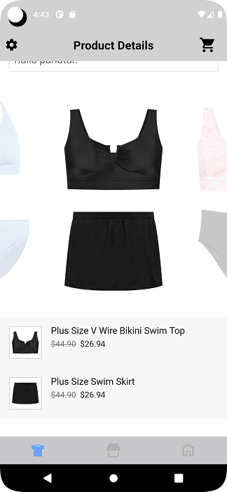
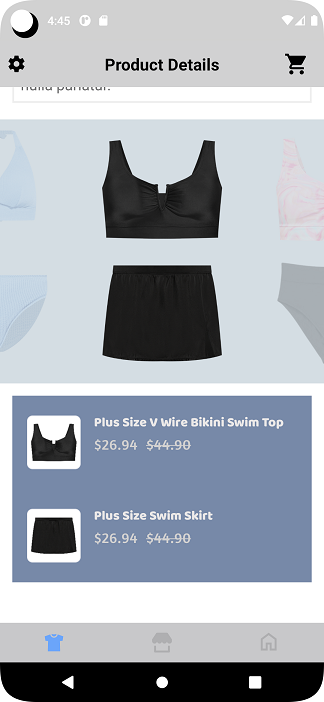
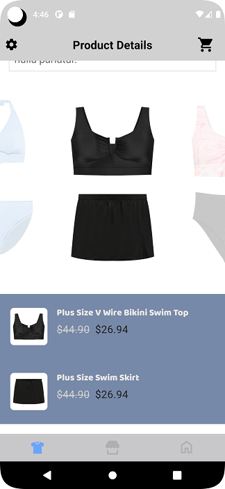

# SHOP THE SET WIDGET

It provides view to display Stylitics Shop the Set data. It also handles invoking of widget tracking events based on user interaction with these views.

Below are the features for Shop the Set widget.</br>

* Configure all the UI elements for Shop the Set data
* Handles `View` and `Click` tracking event for Shop the Set items in carousel and its item list.
* Provides listeners to Sample Integrator App so they can handle the Set item View and Click events

## Configurations:


### Carousel

| Fields             | Description                                                                                                | Default Value | 
|--------------------|------------------------------------------------------------------------------------------------------------|---------------|
| `paddingVertical`  | is top and bottom padding of the carousel in float and internally it is converted to dp                    | `16f`         |             
| `backgroundColor`  | is carousel background color and is accessed from *_**solid color**_* in drawable resource file            | `#FFFFFF`     |
| `imageSize`        | is product image height and width value and it is accepted as a float                                      | `176f`        |             
| `cardGutter`       | is the space between two carousel item card and is accessed as float and internally it is converted to dp  | `48`          |             

### ItemList

| Fields                      | Description                                                                                                       | Default Value             |
|-----------------------------|-------------------------------------------------------------------------------------------------------------------|---------------------------|
| `backgroundColor`           | is item list background color and is accessed from color.xml resource file                                        | `#FFFFFF`                 |
| `paddingVertical`           | is top and bottom padding of the item details view in float and internally it is converted to dp                  | `0f`                      |       
| `paddingHorizontal`         | is left and right padding of the item details view in float and internally it is converted to dp                  | `0f`                      |  
| `itemNameFontColor`         | is item name text color and is accessed from color.xml resource file                                              | `#000000`                 |
| `itemNameFontFamilyAndWeight`| is item name font style with the font weight and is accessed from the font resource folder                       | `roboto_regular`          |            
| `itemNameFontSize`          | is item name font size in float and internally it is converted into sp                                            | `16f`                     |            
| `itemPaddingVertical`       | is top and bottom padding of the item row in float and internally it is converted to dp                           | `12f`                     |            
| `itemPaddingHorizontal`     | is left and right padding of the item row in float and internally it is converted to dp                           | `16f`                     |            
| `itemBackgroundColor`       | is item row background color and is accessed from color.xml resource file                                         | `#F7F7F7`                 |
| `itemImageBackground`       | is item image background and is accessed from drawable resource folder                                            | `R.drawable.header_thumbnail_background`                 |
| `itemImageSize`             | is item image size and it is accepted as a float                                                                  | `56f`                     |            
| `priceDecimal`              | is the number of digits to show after decimal point and it is accepted as a integer                               | `2`                       |            
| `priceFontColor`            | to set item price text color which is accessed from color.xml resource file                                       | `#000000`                 |            
| `priceFontFamilyAndWeight`  | is the item price text font style with the font weight and is accessed from the font resource folder              | `roboto_regular`          |            
| `priceFontSize`             | is item price text font size in float and internally it is converted into sp                                      | `14f`                     |            
| `salePriceFontColor`        | to set item sale price text color which is accessed from color.xml resource file                                  | `#212121`                 |            
| `strikeThroughPriceFontColor`| is strike through price text color which is accessed from color.xml resource file                                | `#757575`                 |            
| `style`                     | to show or hide the Strike Through Price                                                                          | `PriceStrikeThrough.SHOW` |            
| `swapPricesPosition`        | is boolean value, when it is false it shows strike through price first and then sale price. Vice versa when true. | `false`                   |            

[Click here](CODE_REFERENCE_README.md#Shop-the-Set-Widget-Configuration-Samples) to find code references for different configuration examples.


## Implement Exposed Listeners
Below are the list of Shop the Set widget listeners exposed to the Sample Integrator app.

1. `onItemView` - When user swipes top or bottom item from carousel, this listener will be invoked.
2. `onItemClick` - On click event of item from item list fo Shop the Set widget, this listener will be invoked.

## Default Configurations:

* Below are the examples of Shop the Set widget when Sample Integrator App chooses to use default UI configurations.</br>

* The Shop the Set UI component can be implemented in below different ways.
    1. Default Shop the set widget 
    2. Configure Event Listeners

* Shop the Set widget supports different heights with the following constraints:
  1. Recommended height: 650
  2. Minimum supported height: 600

  If the Integrator sets a height below 600dp, they may experience UI glitches within the widget.

*_**XML**_*

```xml
<com.stylitics.ui.StyliticsUIApi 
        android:id="@+id/shopTheSetRecyclerView"
        android:layout_width="match_parent"
        android:layout_height="@dimen/size_600" />
```

*_**Kotlin**_*

### 1. Default Shop the Set:

```kotlin
val shopTheSetRecyclerView = findViewById<StyliticsUIApi>(R.id.shopTheSetRecyclerView)

fun widgetWithProductListFromUXSDK(shopTheSet: ShopTheSet) {
        shopTheSetRecyclerView.load(
            shopTheSet
        )
}
```


### 2. Configure Event Listeners:

```kotlin
val outfitsRecyclerView = findViewById<StyliticsUIApi>(R.id.outfitsRecyclerView)

fun widgetWithListenersConfigured(shopTheSet: ShopTheSet){
    recyclerView?.load(
         shopTheSet,
            ShopTheSetInfo(
                shopTheSetListener = ShopTheSetListener(
                    onItemClick = {
                          Log.i("shopTheSetListener", "onItemClick, topItemId: ${it.topItem.itemId}, topItemPosition: ${it.topItemPosition}, bottomItemId: ${it.bottomItem.itemId}, bottomItemPosition: ${it.bottomItemPosition}, actionItemPosition: ${it.actionItemPosition.name}")
                    },
                    onItemView = {
                          Log.i("shopTheSetListener", "onItemView, topItemId: ${it.topItem.itemId}, topItemPosition: ${it.topItemPosition}, bottomItemId: ${it.bottomItem.itemId}, bottomItemPosition: ${it.bottomItemPosition}, actionItemPosition: ${it.actionItemPosition.name}")              
                    }
                )
            )
    )
}
```

* Below is the Shop the Set widget screenshot when Sample Integrator App uses default configurations.

</br>


## Custom Configurations:

* Sample Integrator App can customise some or all configurations & implement listeners.
* Below are the examples of Shop the Set widget when Sample Integrator App customises configurations.

### 1. With all configurations & Listeners:

```kotlin
val shopTheSetRecyclerView = findViewById<StyliticsUIApi>(R.id.shopTheSetRecyclerView)

fun widgetWithAllCustomConfigurations(shopTheSet: ShopTheSet) {
  shopTheSetRecyclerView?.load(
    shopTheSet,
    ShopTheSetInfo(
      ShopTheSetConfigs(
        carousel = ShopTheSetConfigs.Carousel(
          paddingVertical = 10f,
          backgroundColor = R.color.shop_the_set_carousel_background,
          imageSize = 150f,
          imageGutter = 50
        ),
        itemList = ShopTheSetConfigs.ItemList(
          backgroundColor = R.color.shop_the_set_item_details_background_color,
          paddingVertical = 15f,
          paddingHorizontal = 15f,
          itemNameFontColor = R.color.shop_the_set_item_title_color,
          itemNameFontFamilyAndWeight = R.font.baloo_bhai,
          itemNameFontSize = 16f,
          itemPaddingVertical = 20f,
          itemPaddingHorizontal = 18f,
          itemBackgroundColor = R.color.shop_the_set_item_background_color,
          itemImageBackground = R.drawable.shop_the_set_image_background_reosurce,
          imageSize = 65f,
          priceDecimal = 2,
          priceFontColor = R.color.shop_the_set_strike_throught_color,
          priceFontFamilyAndWeight = R.font.amaranth,
          priceFontSize = 18f,
          salePriceFontColor = R.color.shop_the_set_item_price_color,
          strikeThroughPriceFontColor = R.color.shop_the_set_strike_throught_color,
          style = PriceStrikeThrough.SHOW,
          swapPricesPosition = true
        )
      ),
      shopTheSetListener = ShopTheSetListener(
        onItemClick = {
          Log.i("shopTheSetListener", "onItemClick, topItemId: ${it.topItem.itemId}, topItemPosition: ${it.topItemPosition}, bottomItemId: ${it.bottomItem.itemId}, bottomItemPosition: ${it.bottomItemPosition}, actionItemPosition: ${it.actionItemPosition.name}")
        },
        onItemView = {
          Log.i("shopTheSetListener", "onItemView, topItemId: ${it.topItem.itemId}, topItemPosition: ${it.topItemPosition}, bottomItemId: ${it.bottomItem.itemId}, bottomItemPosition: ${it.bottomItemPosition}, actionItemPosition: ${it.actionItemPosition.name}")                
        }
      )
    )
  )
}        
```

* Below is the Shop the Set widget screenshot when Sample Integrator App uses the above configurations.

</br>

### 2. With some custom configurations & Listeners:

If Sample Integrator App provides only few configurations, UX SDK will take default configurations for missing fields.

```kotlin
val shopTheSetRecyclerView = findViewById<StyliticsUIApi>(R.id.shopTheSetRecyclerView)

fun widgetWithSomeCustomConfigurations(shopTheSet: ShopTheSet) {
  shopTheSetRecyclerView?.load(
    shopTheSet,
    ShopTheSetInfo(
      ShopTheSetConfigs(
        carousel = ShopTheSetConfigs.Carousel(
          imageSize = 150f,
          imageGutter = 50
        ),
        itemList = ShopTheSetConfigs.ItemList(
          backgroundColor = R.color.shop_the_set_item_details_background_color,
          paddingVertical = 15f,
          paddingHorizontal = 0f,
          itemNameFontColor = R.color.shop_the_set_item_title_color,
          itemNameFontFamilyAndWeight = R.font.baloo_bhai,
          itemNameFontSize = 16f,
          itemPaddingVertical = 20f,
          itemPaddingHorizontal = 18f,
          itemBackgroundColor = R.color.shop_the_set_item_background_color,
          itemImageBackground = R.drawable.shop_the_set_image_background_reosurce,
          imageSize = 65f,
          priceFontColor = R.color.shop_the_set_item_price_color,
          priceFontSize = 18f,
          strikeThroughPriceFontColor = R.color.shop_the_set_strike_throught_color,
          style = PriceStrikeThrough.SHOW,
        )
      )
    )
  )
}       
```

* Below is the Shop the Set widget screenshot when Sample Integrator App uses the above configurations.

</br>


## Refresh Shop the Set

**Overview**

The `refreshShopTheSetTemplate` method can be used to update the Shop the Set widget data or its configurations or both.

**Example**

```Kotlin
fun refreshShopTheSetTemplate(shopTheSet: ShopTheSet? = null, widgetConfig: IWidgetConfig? = null)
```

**Parameters**

- `shopTheSet`: Optional parameter to provide updated Shop the Set data.
- `widgetConfig`: Optional parameter to provide updated configurations for Shop the Set template.

**Usage**

Call the method on the view with optional data/config.

- Get the Shop the Set widget Template id
```Kotlin
val shopTheSetRecyclerView = findViewById<StyliticsUIApi>(R.id.shopTheSetRecyclerView)
//Load Shop the Set Widget Template
shopTheSetRecyclerView.load(shopTheSet)
```

- To refresh the Shop the Set widget Template with new Shop the Set data
```Kotlin
shopTheSetRecyclerView.refreshShopTheSetTemplate(shopTheSet = newShopTheSet)
```
- To refresh the Shop the Set widget Template with new config
```Kotlin
shopTheSetRecyclerView.refreshShopTheSetTemplate(widgetConfig = newConfig)
```
- To refresh the Shop the Set widget Template with both new Shop the Set data and config
```Kotlin
shopTheSetRecyclerView.refreshShopTheSetTemplate(newShopTheSet, newConfig)
```

## License

Copyright © 2023 Stylitics