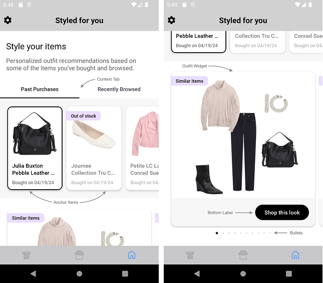
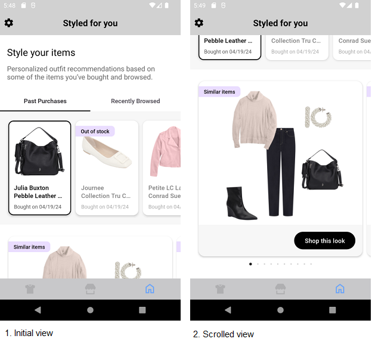
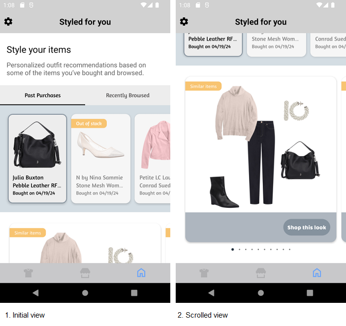
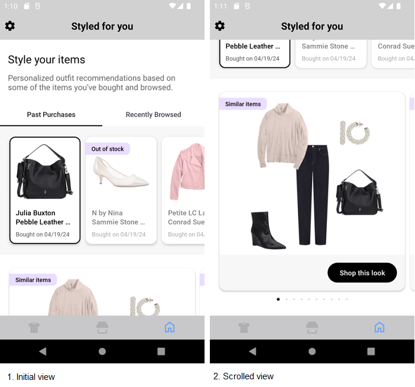

# STYLED FOR YOU WIDGET

It provides view to display Stylitics Styled For You data. It also handles invoking of Widget tracking events based on user interaction with these views.

Below are the features for Styled For You Widget.</br>

* Configure all the UI elements for Styled For You Widget
* Handles tracking events so Sample Integrator App does not have to do it
* Provides listeners to Integrator App so they can handle the events (if needed) based on user interaction.
* Configure whether to display Styled For You Bundle Items directly from SDK or not
* When Bundle Items are configured to display from SDK, Integrator App can provide configs for it.


## Configurations:



### Tab Context

| Fields                      | Description                                                                                         | Default Value          | 
|-----------------------------|-----------------------------------------------------------------------------------------------------|------------------------|
| `backgroundColor`           | is context background color and is accessed from color.xml resource file                            | `#FFFFFF`              | 
| `labelSelectedColor`        | is selected tab font color and is accessed from color.xml resource file                             | `#1D1B20`              |
| `labelFontColor`            | is unselected tab font color and is accessed from color.xml resource file                           | `#49454F`              | 
| `labelFontSize`             | is the tab font size in float and internally it is converted into sp                                | `14f`                  |
| `labelFontFamilyAndWeight`  | is the tab font style with the font weight and is accessed from the font resource folder            | `R.font.roboto_medium` |


### Anchor Items

| Fields                           | Description                                                                                                       | Default Value            | 
|----------------------------------|-------------------------------------------------------------------------------------------------------------------|--------------------------|
| `backgroundColor`                | is the anchor item list view background color and is accessed from color.xml resource file                        | `#F7F7F7`                | 
| `selectedBorderColor`            | is the selected anchor item's border color and is accessed from color.xml resource file                           | `#000000`                |
| `itemBackgroundColor`            | is the anchor item card background color and is accessed from color.xml resource file                             | `#FFFFFF`                |
| `itemCornerRadius`               | is the anchor item card corner radius and is accessed from *_**corner radius**_* in drawable resource file        | `12f`                    | 
| `cardGutterWidth`                | is the space between anchor item cards and is accessed as float and internally it is converted to dp              | `2f`                    |  
| `cardPaddingVertical`            | is top and bottom spacing for the content inside the card, accepts float value and internally it is converted to dp                    | `12f`                    |            
| `cardPaddingHorizontal`          | is left and right spacing for the content inside the card, accepts float value and internally it is converted to dp                    | `12f`                    |            
| `productNameFontColor`           | is the product name font color and is accessed from color.xml resource file                                       | `#000000`                | 
| `productNameFontFamilyAndWeight` | is the product name font style with the font weight and is accessed from the font resource folder                 | `R.font.roboto_medium`   |            
| `productNameFontSize`            | is the product name font size in float and internally it is converted into sp                                     | `14f`                    |            
| `contextNameFontColor`           | is the context text font color and is accessed from color.xml resource file                                       | `#575757`                | 
| `contextNameFontFamilyAndWeight` | is context text font style with the font weight and is accessed from the font resource folder                     | `R.font.roboto_regular`  |            
| `contextNameFontSize`            | is context text font size in float and internally it is converted into sp                                         | `12f`                    |            
| `contextDateFormat`              | is the date format for the date displayed in the context                                                          | `DateFormat.MM_DD_YY`    | 
| `priceDecimal`                   | is the number of digits to show after decimal point and it is accepted as a integer	                           | `2`                       |
| `priceFontColor`                 | is the item price font color	                                                                                   | `#575757`                 |
| `priceFontFamilyAndWeight`       | is the item price font style with the font weight	                                                               | `R.font.roboto_regular`   |
| `priceFontSize`                  | is the font size of item price displayed in float	                                                           | `14px`                    |
| `salePriceFontColor`             | is the item sale price font color	                                                                               | `#575757`                 |
| `strikeThroughPriceFontColor`    | is strike through price text color	                                                                               | `#575757`                 |
| `style`                          | is to show or hide the strike through price	                                                                   | `PriceStrikeThrough.SHOW`|
| `swapPricesPosition`             | is boolean value, when it is false it shows strike through price first and then sale price. Vice versa when true  | `false`                   |     


Integrator App can customize the `contextDateFormat` by selecting from the available date format options defined in the UX SDK, listed below.
1. MM_DD_YY("MM/dd/yy"),
2. DD_MM_YY("dd/MM/yy"),
3. MM_DD_YYYY("MM/dd/yyyy"),
4. DD_MM_YYYY("dd/MM/yyyy")

### Widget

| Fields            | Description                                                                                               | Default Value  |
|-------------------|-----------------------------------------------------------------------------------------------------------|----------------|
| `cardGutter`      | is the space between two OutfitBundle cards and is accessed as float and internally it is converted to dp | `12f`          |  

### Out Of Stock

| Fields                     | Description                                                                                                | Default Value          | 
|----------------------------|------------------------------------------------------------------------------------------------------------|------------------------|
| `badgeFontColor`           | is the badge font color and is accessed from color.xml resource file                                       | `#000000`              | 
| `badgeFontFamilyAndWeight` | is the badge font style with the font weight and is accessed from the font resource folder                 | `R.font.roboto_medium` |            
| `badgeFontSize`            | is the badge font size in float and internally it is converted into sp                                     | `12f`                  |            
| `badgeVerticalSpacing`     | is top and bottom spacing for the badge's content, accepts float value and internally it is converted to dp| `4f`                   |            
| `badgeHorizontalSpacing`   | is left and right spacing for the badge's content, accepts float value and internally it is converted to dp| `12f`                  |            
| `badgeBackgroundColor`     | is the badge background color and is accessed from color.xml resource file                                 | `#EADDFF`              | 

### Similar Items

| Fields                   | Description                                                                                      | Default Value            | 
|--------------------------|--------------------------------------------------------------------------------------------------|--------------------------|
| `badgeFontColor`         | is the badge font color and is accessed from color.xml resource file                             | `#000000`                | 
| `badgeFontSize`          | is the badge font size in float and internally it is converted into sp                           | `12f`                    |            
| `badgeFontFamilyAndWeight`| is the badge font style with the font weight and is accessed from the font resource folder       | `R.font.roboto_medium`   |            
| `badgeVerticalSpacing`   | is top and bottom spacing for the badge's content, accepts float value and internally it is converted to dp                          | `4f`                     |            
| `badgeHorizontalSpacing` | is left and right spacing for the badge's content, accepts float value and internally it is converted to dp                          | `12f`                    |            
| `badgeBackgroundColor`   | is the badge background color and is accessed from color.xml resource file                       | `#EADDFF`                | 


### Bottom Label

| Fields                 | Description                                                                                          | Default Value                           | 
|------------------------|------------------------------------------------------------------------------------------------------|-----------------------------------------|
| `ctaTitle`             | to set the title of the label                                                                        | `Shop this look`                        |            
| `fontFamilyAndWeight`  | is the label font style with the font weight and is accessed from the font resource folder           | `R.font.roboto_medium`                  |            
| `fontSize`             | is the label font size in float and internally it is converted into sp                               | `14f`                                   |
| `fontColor`            | is label text color and is accessed from color.xml resource file                                     | `#FFFFFF`                               | 
| `backgroundColor`      | is widget footer background color and is accessed from color.xml resource file                       | `#F7F7F7`                               | 
| `ctaBackgroundColor`   | is label background color and is accessed from *_**solid color**_* in drawable resource file         | `R.drawable.shop_this_look_background`                               | 
| `paddingVertical`      | is top and bottom spacing for the content inside widget footer, accepts float value and internally it is converted to dp         | `16f`                                   |            
| `paddingHorizontal`    | is left and right spacing for the content inside widget footer, accepts float value and internally it is converted to dp         | `16f`                                   |            
| `ctaPaddingVertical`   | is top and bottom spacing for the label's content, accepts float value and internally it is converted to dp  | `10f`                                   |            
| `ctaPaddingHorizontal` | is left and right spacing for the label's content, accepts float value and internally it is converted to dp  | `24f`                                   |


In Android, Bottom label background is set using below XML code of drawable resource file, which contains configurations for the above parameters.

Drawable Resource File name : shop_this_look_background
```xml
<?xml version="1.0" encoding="utf-8"?>
<shape xmlns:android="http://schemas.android.com/apk/res/android">

  <corners android:radius="@dimen/size_100"/>
  <solid android:color="@android:color/black"/>
</shape>
```

*_**ctaBackgroundColor**_* is the configurable parameter to set cornerRadius and ctaBackgroundColor as shown below.

```kotlin
 ctaBackgroundColor = R.drawable.shop_this_look_background
```

### Bullet

| Fields             | Description                                                                                                | Default Value  |
|--------------------|------------------------------------------------------------------------------------------------------------|----------------|
| `defaultColor`     | is to set default bullet color and is accessed from *_**solid color**_* in drawable resource file          | `#D3D3D3`      | 
| `highlightedColor` | to set highlighted bullet color and is accessed from *_**solid color**_* in drawable resource file         | `#212121`      | 
| `paddingVertical`  | is top and bottom spacing for the bullet view, accepts float value and internally it is converted to dp    | `10f`          |            


[Click here](CODE_REFERENCE_README.md#Styled-For-You-Widget-Configuration-Samples) to find code references for different configuration examples.

# Implement Exposed Listeners
Below are the list of Styled For You widget listeners exposed to the Sample Integrator app. If Sample integrator wishes to implement their own product list screen they will have to provide the definition for widget `onOutfitClickCTA` listener.

1. `onContextClick` - On click event of context label, this listener will be invoked.
2. `onAnchorItemClick` - On click event of an anchor item, this listener will be invoked.
3. `onAnchorItemView` - On view event of an anchor item, this listener will be invoked.
4. `onOutfitClick` - On click event of Outfit bundle, this listener will be invoked.
5. `onOutfitClickCTA` - On click event of `Shop this look` cta in Styled For You widget, this listener will be invoked.
6. `onOutfitView` -  On view event of Outfit bundle, this listener will be invoked.

## Default Configurations:

* Below are the examples of Styled For You Widget when Sample Integrator App chooses to use default UI configurations.</br>

* The Styled For You UI component can be implemented in below different ways.
    1. Product List enabled from SDK
    2. Product List disabled from SDK
    3. Configure Event Listeners

* Styled For You Widget supports different heights with the following constraints:
  1. Recommended height: `wrap_content`
  2. Minimum supported height: 800dp

  If the integrator sets a height below 800dp, they may experience UI glitches within the widget.

*_**XML**_*

```xml
<com.stylitics.ui.StyliticsUIApi 
        android:id="@+id/styledForYouRecyclerView"
        android:layout_width="match_parent"
        android:layout_height="wrap_content" />
```

*_**Kotlin**_*

### 1. Product List enabled from SDK:

When product list is enabled from UX SDK and Sample Integrator App does not provide configurations, it will take default configurations from SDK.

```kotlin
val rvStyledForYou = findViewById<StyliticsUIApi>(R.id.rvStyledForYou)

private fun widgetWithProductListFromUXSDK(outfits: Outfits) {
  rvStyledForYou?.load(
    styledForYou
  )
}
```

### 2. Product List disabled from SDK:

```kotlin
val rvStyledForYou = findViewById<StyliticsUIApi>(R.id.rvStyledForYou)

private fun widgetWhenProductListFromIntegrator(styledForYou: StyledForYou) {
  rvStyledForYou?.load(
    styledForYou,
    StyledForYouInfo(
      styledForYouListener = StyledForYouListener(
        onOutfitClickCTA = {
          context?.showGalleryProductList(it.outfitBundle)
        }
      )
    ),
    displayProductListFromSDK = false
  )
}
```

### 3. Configure Event Listeners:

```kotlin
val rvStyledForYou = findViewById<StyliticsUIApi>(R.id.rvStyledForYou)

private fun widgetWithListenersConfigured(styledForYou: StyledForYou) {
  rvStyledForYou?.load(
    styledForYou,
    StyledForYouInfo(
      styledForYouListener = StyledForYouListener(
        onContextClick = { contextType, contextItems ->
          Log.i("StyledForYouEvent", " onContextClick. $contextType")
          for(contextItem in contextItems){
            Log.i("StyledForYouEvent", "item name. ${contextItem.name}")
          }
        },
        onAnchorItemClick = { contextItemInfo ->
          Log.i("StyledForYouEvent", " onAnchorItemClick contextType:${contextItemInfo.contextType}, " +
                  "position:${contextItemInfo.position}, name:${contextItemInfo.contextItem.name} ")
        },
        onAnchorItemView = { contextItemInfo ->
          Log.i("StyledForYouEvent", " onAnchorItemView. contextType:${contextItemInfo.contextType}, " +
                  "position:${contextItemInfo.position}, name:${contextItemInfo.contextItem.name} ")
        },
        onOutfitClick = { outfitBundleInfo ->
          Log.i("StyledForYouEvent", " onOutfitClick. $outfitBundleInfo")
        },
        onOutfitView = { outfitBundleInfo ->
          Log.i("StyledForYouEvent", " onOutfitView. $outfitBundleInfo")
        },
        onOutfitClickCTA = { outfitBundleInfo->
          Log.i("StyledForYouEvent", " onOutfitClickCTA. $outfitBundleInfo")
        }
      )
    )
  )
}
```


### Default Styled For You Widget Screen**

* Below is the Styled For You Widget screenshot when Sample Integrator App uses the above configurations.

</br></br>

## Custom Configurations:

* Sample Integrator App can customise some or all configurations & implement listeners.
* Below are the examples of Styled For You Widget when Sample Integrator App customises configurations.

### 1. With all configurations & Listeners:

```kotlin
val rvStyledForYou = findViewById<StyliticsUIApi>(R.id.rvStyledForYou)

private fun widgetWithAllCustomConfigurations(styledForYou: StyledForYou) {
  rvStyledForYou?.load(
    styledForYou,
    StyledForYouInfo(
      styledForYouConfigs = StyledForYouConfigs(
        tabContext = StyledForYouConfigs.TabContext(
          backgroundColor = R.color.styled_for_you_tab_background_color,
          labelSelectedColor = R.color.styled_for_you_selected_label_color,
          labelFontColor = R.color.styled_for_you_unselected_label_color,
          labelFontSize = 14f,
          labelFontFamilyAndWeight = R.font.amaranth
        ),
        anchorItems = StyledForYouConfigs.AnchorItems(
          backgroundColor = R.color.styled_for_you_anchor_items_background_color,
          selectedBorderColor = R.color.styled_for_you_selected_border_color,
          itemBackgroundColor = R.color.styled_for_you_anchor_item_background_color,
          itemCornerRadius = 12f,
          cardGutterWidth = 2f,
          cardPaddingVertical = 12f,
          cardPaddingHorizontal = 12f,
          productNameFontColor = R.color.styled_for_you_product_name_font_color,
          productNameFontFamilyAndWeight = R.font.amaranth,
          productNameFontSize = 14f,
          contextNameFontColor = R.color.styled_for_you_context_name_font_color,
          contextNameFontFamilyAndWeight = R.font.amaranth,
          contextNameFontSize = 12f,
          contextDateFormat = DateFormat.MM_DD_YY,
          priceFontFamilyAndWeight = R.font.amaranth,
          priceFontSize = 15f,
          priceFontColor = R.color.styled_for_you_anchor_item_price_font_color,
          salePriceFontColor = R.color.styled_for_you_anchor_item_sale_price_font_color,
          strikeThroughPriceFontColor = R.color.styled_for_you_anchor_item_sale_price_strike_font_color,
          style = PriceStrikeThrough.SHOW,
          priceDecimal = 2,
          swapPricesPosition = false
        ),
        widget = StyledForYouConfigs.Widget(
          cardGutter = 20
        ),
        outOfStock = StyledForYouConfigs.OutOfStock(
          badgeFontColor = R.color.styled_for_you_out_of_stock_badge_text_color,
          badgeFontFamilyAndWeight = R.font.amaranth,
          badgeFontSize = 12f,
          badgeVerticalSpacing = 4f,
          badgeHorizontalSpacing = 12f,
          badgeBackgroundColor = R.color.styled_for_you_out_of_stock_badge_background_color
        ),
        similarItems = StyledForYouConfigs.SimilarItems(
          badgeFontColor = R.color.styled_for_you_similar_item_font_color,
          badgeFontSize = 12f,
          badgeFontFamilyAndWeight = R.font.calibri,
          badgeVerticalSpacing = 4f,
          badgeHorizontalSpacing = 12f,
          badgeBackgroundColor = R.color.styled_for_you_similar_item_background_color
        ),
        bottomLabel = StyledForYouConfigs.BottomLabel(
          ctaTitle = "Shop this look",
          fontFamilyAndWeight = R.font.baloo_bhai,
          fontSize = 14f,
          fontColor = R.color.styled_for_you_bottom_label_font_color,
          backgroundColor = R.color.styled_for_you_bottom_label_background_color,
          ctaBackgroundColor = R.drawable.styled_for_you_shop_this_look_background,
          paddingVertical = 15f,
          paddingHorizontal = 15f,
          ctaPaddingVertical = 10f,
          ctaPaddingHorizontal = 10f
        ),
        bullet = StyledForYouConfigs.Bullet(
          defaultColor = R.color.styled_for_you_default_bullet_color,
          highlightedColor = R.color.styled_for_you_selected_bullet_color,
          paddingVertical = 10f
        )
      ),
      styledForYouListener = StyledForYouListener(
        onContextClick = { contextType, contextItems ->
          Log.i("StyledForYouEvent", " Styled For You Context click event triggered. $contextType")
          for (contextItem in contextItems) {
            Log.i("StyledForYouEvent", "item name. ${contextItem.name}")
          }
        },
        onAnchorItemClick = { contextItemInfo ->
          Log.i("StyledForYouEvent", " Styled For You Anchor item click event triggered. contextType:${contextItemInfo.contextType}, " +
                  "position:${contextItemInfo.position}, name:${contextItemInfo.contextItem.name} ")
        },
        onAnchorItemView = { contextItemInfo ->
          Log.i("StyledForYouEvent", " Styled For You Anchor item View event triggered. contextType:${contextItemInfo.contextType}, " +
                  "position:${contextItemInfo.position}, name:${contextItemInfo.contextItem.name} ")
        },
        onOutfitClick = { outfitBundleInfo ->
          Log.i("StyledForYouEvent", " Styled For You Outfit click event triggered. $outfitBundleInfo")
        },
        onOutfitView = { outfitBundleInfo ->
          Log.i("StyledForYouEvent", " Styled For You Outfit view event triggered. $outfitBundleInfo")
        },
        onOutfitClickCTA = { outfitBundleInfo ->
          Log.i("StyledForYouEvent", " Styled For You Outfit Click event triggered. $outfitBundleInfo")
        }
      )
    )
  )
}         
```


* Below is the Styled For You Widget screenshot when Sample Integrator App uses the above configurations.

</br>

### 2. With some custom configurations & Listeners:

If Sample Integrator App provides only few configurations, UX SDK will take default configurations for missing fields.

```kotlin
val rvStyledForYou = findViewById<StyliticsUIApi>(R.id.rvStyledForYou)

private fun widgetWithSomeCustomConfigurations(styledForYou: StyledForYou) {
  recyclerView?.load(
    styledForYou,
    StyledForYouInfo(
      styledForYouConfigs = StyledForYouConfigs(
        tabContext = StyledForYouConfigs.TabContext(
          backgroundColor = R.color.styled_for_you_tab_background_color,
          labelSelectedColor = R.color.styled_for_you_selected_label_color,
          labelFontColor = R.color.styled_for_you_unselected_label_color,
          labelFontSize = 16f
        ),
        widget = StyledForYouConfigs.Widget(
          cardGutter = 30
        ),
        bottomLabel = StyledForYouConfigs.BottomLabel(
          ctaTitle = "Shopping",
          fontSize = 16f,
          fontColor = R.color.styled_for_you_bottom_label_font_color,
          backgroundColor = R.color.styled_for_you_bottom_label_background_color,
        ),
        bullet = StyledForYouConfigs.Bullet(
          defaultColor = R.color.styled_for_you_default_bullet_color,
          highlightedColor = R.color.styled_for_you_selected_bullet_color,
          paddingVertical = 100f
        )
      ),
      styledForYouListener = StyledForYouListener(
        onContextClick = { contextType, contextItems ->
          Log.i("StyledForYouEvent", " Styled For You Context click event triggered. $contextType")
          for (contextItem in contextItems) {
            Log.i("StyledForYouEvent", "item name. ${contextItem.name}")
          }
        },
        onAnchorItemClick = { contextItemInfo ->
          Log.i("StyledForYouEvent", " Styled For You Anchor item click event triggered. contextType:${contextItemInfo.contextType}, " +
                  "position:${contextItemInfo.position}, name:${contextItemInfo.contextItem.name} ")
        },
        onAnchorItemView = { contextItemInfo ->
          Log.i("StyledForYouEvent", " Styled For You Anchor item View event triggered. contextType:${contextItemInfo.contextType}, " +
                  "position:${contextItemInfo.position}, name:${contextItemInfo.contextItem.name} ")
        }
      )
    )
  )
}         
```

* Below is the Styled For You Widget screenshot when Sample Integrator App uses the above configurations.

</br>


## Refresh Styled For You Widget

**Overview**

The `refreshStyledForYouTemplate` method can be used to update the Styled For You widget data or its configurations or both.

**Example**

```Kotlin
fun refreshStyledForYouTemplate(styledForYou: StyledForYou? = null, widgetConfig: IWidgetConfig? = null)
```

**Parameters**

- `styledForYou`: Optional parameter to provide updated StyledForYou data.
- `widgetConfig`: Optional parameter to provide updated configurations for Styled For You template.

**Usage**

Call the method on the view with optional data/config.

- Get the Styled For You Widget Template id
```Kotlin
val rvStyledForYou = findViewById<StyliticsUIApi>(R.id.rvStyledforYou)
//Load Classic Outfit Widget Template
rvStyledForYou.load(styledForYou)
```

- To refresh the Styled For You Widget Template with new StyledForYou data
```Kotlin
rvStyledForYou.refreshTemplate(newStyledForYou = styledForYou)
```
- To refresh the Styled For You Widget Template with new config
```Kotlin
rvStyledForYou.refreshTemplate(widgetConfig = newConfig)
```
- To refresh the Styled For You Widget Template with both new StyledForYou data and config
```Kotlin
rvStyledForYou.refreshTemplate(newStyledForYou, newConfig)
```

## License

Copyright © 2023 Stylitics