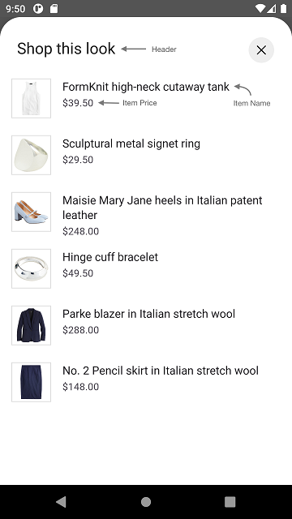

# OUTFIT BUNDLE PRODUCT LIST

It provides views to display Stylitics OutfitBundleItems. It also handles invoking of item tracking events based on user interaction with these views.

## Outfit Bundle Product List Screen

* This screen is displayed when user clicks on an Outfit Bundle widget `Shop this look` cta.
* There are two different ways to show Outfit Bundle Product List Screen.
    1. Product List Screen From UX SDK
    2. Product List Screen From Integrator App

### Outfit Bundle Product List Screen From UX SDK

Below are the features for Outfit Bundle Product List Screen 
* Configure all the UI elements for Product List Screen
* Handles OutfitBundleItem `View` and `Click` tracking events so Integrator App does not have to do it
* Provides listeners to Integrator App so they can handle the OutfitBundle Item `View` and `Click` events
* If Integrator App does not implement OutfitBundle Item click listener, a Web View is opened when user selects OutfitBundleItem

*Note: It is recommended that Integrator App always provides the **onOutfitItemClick** listener implementation*.

### OutfitBundle Product List Screen Configurations

</br>

### Header

| Fields                         | Description                                                                                                          | Default Value                  |
|--------------------------------|----------------------------------------------------------------------------------------------------------------------|--------------------------------|
| `title`                        | to set the header of the screen                                                                                      | `Shop this look`               |           
| `productListScreenHeaderAlign` | to set the product list screen title alignment with close button. It will be center aligned when the value is CENTER | `Top`                          |           
| `fontFamilyAndWeight`          | is the font style with the font weight and is accessed from the font resource folder                                 | `R.font.roboto_regular`        |
| `fontSize`                     | is the font size in float and internally it is converted into SP                                                     | `22f`                          |
| `fontColor`                    | is text color and is accessed from color.xml resource file                                                           | `#212121`                      |

### Presentation Style

| Fields               | Description                                 | Default Value                    |
|----------------------|---------------------------------------------|----------------------------------|
| `presentationStyle`  | to set the Product List Presentation style  | `PresentationStyle.FULL_SCREEN`  |

### Product List view 

| Fields                       | Description                                                                                  | Default Value                                 | 
|------------------------------|----------------------------------------------------------------------------------------------|-----------------------------------------------|
| `backgroundColor`            | is to change product list background color and is accessed from color.xml resource file      | `#FFFFFF`                                     |
| `paddingVertical`            | is top and bottom padding of the button in float and internally it is converted to dp        | `12f`                                         |            
| `paddingHorizontal`          | is left and right padding of the button in float and internally it is converted to dp        | `16f`                                         |            
| `imageBackground      `      | is the item image background drawable                                                        | `R.drawable.gallery_pl_item_biew_background`  |            
| `productDetailsPadding`      | is left and right padding of the item text content view in float and internally it is converted into dp                                 | `16f`                                         |

### Item Name

| Fields                       | Description                                                                                | Default Value                  | 
|------------------------------|--------------------------------------------------------------------------------------------|--------------------------------|
| `fontSize`                   | is font size in float and internally it is converted into sp                               | `16f`                          | 
| `verticalSpacing`            | is to set the spacing between two lines                                                    | `2f`                           |            
| `fontColor`                  | is text color which is accessed from color.xml resource file                               | `#1D1B20`                      | 
| `fontFamilyAndWeight`        | is text font style with the font weight and is accessed from the font resource folder      | `R.font.roboto_regular`               |

### Item Price

| Fields                        | Description                                                                                                       | Default Value                  | 
|-------------------------------|-------------------------------------------------------------------------------------------------------------------|--------------------------------|
| `fontSize`                    | is font size in float and internally it is converted into sp                                                      | `14f`                          |            
| `verticalSpacing`             | is to set top margin in float and internally it is converted into DP                                              | `3f`                           |
| `priceFontColor`              | to set item price text color which is accessed from color.xml resource file                                       | `#49454F`                      | 
| `fontFamilyAndWeight`         | is the text font style with the font weight and is accessed from the font resource folder                         | `R.font.roboto_regular`               |           
| `salePriceFontColor`          | to set item sale price text color which is accessed from color.xml resource file                                  | `#212121`                      |
| `strikeThroughPriceFontColor` | is strike through price text color which is accessed from color.xml resource file                                 | `#757575`                      | 
| `priceDecimal`                | is the number of digits to show after decimal point and it is accepted as a integer                               | `2`                            |            
| `swapPricesPosition`          | is boolean value, when it is false it shows strike through price first and then sale price. Vice versa when true. | `false`                        |
| `style`                       | to show or hide the Strike Through Price                                                                          | `PriceStrikeThrough.SHOW`      |

*Note : 1. *_**swapPricesPosition**_* in Item Price is to reverse the positions of Price and Strike Through Price.<br />
 &nbsp;&nbsp;&nbsp;&nbsp;&nbsp;&nbsp;&nbsp;&nbsp;&nbsp;&nbsp;2. *_**priceFontColor**_* is to change the color of item price.<br />
 &nbsp;&nbsp;&nbsp;&nbsp;&nbsp;&nbsp;&nbsp;&nbsp;&nbsp;&nbsp;2. *_**salePriceFontColor**_* is to change the color of item sale price.<br />
 &nbsp;&nbsp;&nbsp;&nbsp;&nbsp;&nbsp;&nbsp;&nbsp;&nbsp;&nbsp;3. *_**strikeThroughPriceFontColor**_* is to change the color of old price of item.*

[Click here](CODE_REFERENCE_README.md#OutfitBundle-Product-List-View-Configuration-Samples) to find code references for different configuration examples.


## Implement Exposed Listeners
Below are the list of OutfitBundle Product List view listeners exposed to the Integrator app.

1. `onOutfitItemClick` - On click event of OutfitBundle Item, this listener will be triggered. It is highly recommended that Integrator app should implement this listener.
2. `onOutfitItemView` - On view event of OutfitBundle Item, this listener will be triggered.

### Compatible with

OutfitBundle product list screen can be used for the following templates:
1. Dynamic Gallery widget
2. Styled For You widget

### OutfitBundle Product List Screen from UX SDK with Default Configurations

Below is the example of OutfitBundle Product List Screen when Sample Integrator App chooses to use default UI configurations.

*_**XML**_*

```xml
<com.stylitics.ui.StyliticsUIApi 
        android:id="@+id/widgetRecyclerView"
        android:layout_width="match_parent"
        android:layout_height="@dimen/size_520" />
```

*_**Kotlin**_*

Below is the code to access OutfitBundle Product List Screen from UX SDK.

It is recommended that Integrator App provide the **onOutfitItemClick** listener implementation.

```kotlin
val bundleRecyclerView = findViewById<StyliticsUIApi>(R.id.bundleRecyclerView)

//Code example for Dynamic gallery widget with default OutfitBundle Product list screen.
fun widgetWithProductListFromUXSDKAndAllDefaultConfigurations(bundles: GalleryBundles) {
    bundleRecyclerView?.load(
        bundles,
        outfitBundleProductListScreenConfig = OutfitBundleProductListScreenConfig(
            productListListener = OutfitBundleProductListListener(
                onOutfitItemClick = { OutfitBundleInfo, OutfitBundleItemInfo ->
                    //Here, in addition to handling any integrator analytics, natively navigate the user to the selected item's PDP (or launch a quick shop experience).
                    Toast.makeText(context, context?.getString(R.string.outfit_item_clicked).plus(" ${OutfitBundleInfo.position}"), Toast.LENGTH_LONG).show()
                }
            )
        )
    )
}

//Code example for Styled For You widget with default OutfitBundle Product list screen. 
fun widgetWithProductListFromUXSDKAndAllDefaultConfigurations(bundles: StyledForYou) {
    bundleRecyclerView?.load(
        bundles,
        outfitBundleProductListScreenConfig = OutfitBundleProductListScreenConfig(
            productListListener = OutfitBundleProductListListener(
                onOutfitItemClick = { OutfitBundleInfo, OutfitBundleItemInfo ->
                    //Here, in addition to handling any integrator analytics, natively navigate the user to the selected item's PDP (or launch a quick shop experience).
                    Toast.makeText(context, context?.getString(R.string.outfit_item_clicked).plus(" ${OutfitBundleInfo.position}"), Toast.LENGTH_LONG).show()
                }
            )
        )
    )
}
```
**_**Note:**_* The rest of the code examples are provided only for the *_**Dynamic Gallery widget**_*, similar ones can be referred to for the Styled For You widget.*

* When OutfitBundle Product List Screen is displayed from UX SDK, Sample Integrator App can choose to close it using below code.

```Kotlin
val bundleRecyclerView = findViewById<StyliticsUIApi>(R.id.bundleRecyclerView)
val requestId = outfitBundleItem.requestId
bundleRecyclerView.closeProductListScreen(requestId = requestId)
```

* Below is the OutfitBundle Product List screenshot when Sample Integrator App uses the default configurations

</br>

### OutfitBundle Product List Screen from UX SDK with Custom Configurations

Below are the examples of OutfitBundle Product List Screen when Sample Integrator App chooses to use custom configurations.

*_**XML**_*

```xml
<com.stylitics.ui.StyliticsUIApi 
        android:id="@+id/outfitBundleRecyclerView"
        android:layout_width="match_parent"
        android:layout_height="@dimen/size_520" />
```

*_**Kotlin**_*

### 1. With All Custom Configurations and Listeners

```kotlin
val outfitBundleRecyclerView = findViewById<StyliticsUIApi>(R.id.outfitBundleRecyclerView)

fun widgetWithProductListFromUXSDKAndAllCustomConfigurations(bundles: GalleryBundles) {
    outfitBundleRecyclerView?.load(
        bundles,
        outfitBundleProductListScreenConfig = OutfitBundleProductListScreenConfig(
            itemListHeader = OutfitBundleProductListScreenConfig.ItemListHeader(
                title = "Product Items",
                fontSize = 25f,
                fontColor = R.color.white,
                fontFamilyAndWeight = R.font.amaranth,
                productListScreenHeaderAlign = OutfitBundleProductListScreenHeaderAlign.CENTER
            ),
            presentationStyle = OutfitBundleProductListPresentationStyle.HALF_SCREEN,
            productListConfigs = OutfitBundleProductListConfig(
                backgroundColor = R.color.custom_product_list_background_color,
                itemName = OutfitBundleProductListConfig.ItemName(
                    fontSize = 17f,
                    verticalSpacing = 3f,
                    fontColor = R.color.gallery_product_list_item_name_text_color,
                    fontFamilyAndWeight = R.font.amaranth
                ),
                itemPrice = OutfitBundleProductListConfig.ItemPrice(
                    priceFontColor = R.color.gallery_product_list_item_price_text_color,
                    fontFamilyAndWeight = R.font.baloo_bhai,
                    verticalSpacing = 4f,
                    fontSize = 20f,
                    style = PriceStrikeThrough.SHOW,
                    salePriceFontColor = R.color.white,
                    strikeThroughPriceFontColor = R.color.white,
                    priceDecimal = 0,
                    swapPricesPosition = false
                ),
                paddingVertical = 20f,
                paddingHorizontal = 25f,
                imageBackground = R.drawable.outfit_rectangle_border,
                productDetailsPadding = 20f
            ),
            productListListener = OutfitBundleProductListListener(
                onOutfitItemView = { OutfitBundleInfo, outfitBundleItemInfo ->
                    Log.i(
                        "OutfitBundleItemEvent", " view event triggered. ${outfitBundleItemInfo.outfitBundleItem.itemId}"
                    )
                },
                onOutfitItemClick = { outfitBundleInfo, outfitBundleItemInfo ->
                    Log.i(
                        "OutfitBundleItemEvent", " click event triggered. ${outfitBundleItemInfo.outfitBundleItem.itemId}"
                    )
                }
            )
        )
    )
}
```

* Below is the OutfitBundle Product List screenshot when Sample Integrator App uses the above configurations.

</br>

### 2. With some custom configurations and listeners

```kotlin
val outfitBundleRecyclerView = findViewById<StyliticsUIApi>(R.id.outfitBundleRecyclerView)

fun widgetWithProductListFromUXSDKAndSomeCustomConfigurations(bundles: GalleryBundles) {
    outfitBundleRecyclerView?.load(
        bundles,
        DynamicGalleryInfo(
            dynamicGalleryListener = DynamicGalleryListener(
                onClick = { outfitBundleInfo ->
                    Log.i("OutfitBundleEvent", " OutfitBundle click event triggered. ${outfitBundleInfo.id}")
                }
            )
        ),
        outfitBundleProductListScreenConfig = OutfitBundleProductListScreenConfig(
            productListConfigs = OutfitBundleProductListConfig(
                itemName = OutfitBundleProductListConfig.ItemName(
                    fontSize = 17f,
                    verticalSpacing = 3f,
                    fontColor = R.color.gallery_product_list_item_name_text_color,
                    fontFamilyAndWeight = R.font.amaranth
                ),
                itemPrice = OutfitBundleProductListConfig.ItemPrice(
                    priceFontColor = R.color.gallery_product_list_item_price_text_color,
                    fontFamilyAndWeight = R.font.baloo_bhai,
                    style = PriceStrikeThrough.SHOW,
                    salePriceFontColor = R.color.white,
                ),
            ),
            productListListener = OutfitBundleProductListListener(
                onOutfitItemClick = { outfitBundleInfo, outfitBundleItemInfo ->
                    Log.i("OutfitBundleProductListEvent", " OutfitBundle ProductList click event triggered. ${outfitBundleItemInfo.outfitBundleItem.itemId}")
                }
            )
        )
    )
}
```

* Below is the OutfitBundle Product List screenshot when Sample Integrator App uses the above configurations.

</br>

### OutfitBundle Product List Screen From Sample Integrator App

If Integrator App wants to implement their own OutfitBundle Product List Screen, they need to implement OutfitBundle click listener as shown below and create Activity/Fragment by their own.

```kotlin
val outfitBundleRecyclerView = findViewById<StyliticsUIApi>(R.outfitBundleRecyclerView)

fun widgetWhenProductListFromIntegrator(bundles: GalleryBundles) {
    outfitBundleRecyclerView?.load(
        bundles,
        dynamicGalleryListener = DynamicGalleryListener(
            onClick = {
                context?.showGalleryProductList(it)
            }
        ),
        displayProductListFromSDK = false
    )
}
```

Integrator can create their own OutfitBundle Product List View or access and implement it from UX SDK as given below.

### 1. OutfitBundle Product List View with default configurations

Below is the code to call your own OutfitBundle Product List Screen.

```Kotlin
fun FragmentActivity.showGalleryProductList(bundles: GalleryBundle) {
    val outfitItemsFragment = OutfitBundleProductListFragment.newInstance(bundles)
    FragmentManagerUtil.addFragmentOnTop(this, R.id.fragmentContainer, outfitItemsFragment)
}
```

*_**OutfitBundleProductListFragment**_* is the fragment class to show Gallery Product List Screen

Add below xml code to your Fragments xml file

*_**XML**_*

```xml
<com.stylitics.ui.StyliticsUIApi 
        android:id="@+id/bundleItemsRecyclerView"
        android:layout_width="match_parent"
        android:layout_height="match_parent" />
```

*_**Kotlin**_*

To load the OutfitBundle Product List invoke below method from Fragments `onCreateView`. 

```Kotlin
val itemView: View = inflater.inflate(R.layout.fragment_gallery_bundle_items, container, false)

val bundleItemsRecyclerView = itemView.findViewById<StyliticsUIApi>(R.id.bundleItemsRecyclerView)

fun displayBundleItemsWithDefaultConfigurations(
    outfitBundle: OutfitBundle,
) {
    bundleItemsRecyclerView.load(
        outfitBundle,
        outfitBundleProductListListener = OutfitBundleProductListListener(
            onOutfitItemClick = { outfitBundleInfo, outfitBundleItemInfo ->
                //Here, in addition to handling any integrator analytics, natively navigate the user to the selected item's PDP (or launch a quick shop experience).
                Toast.makeText(context, context?.getString(R.string.outfit_item_clicked).plus(" ${outfitBundleItemInfo.position}"), Toast.LENGTH_LONG).show()
            }
        )
    )
}
```

### 2. OutfitBundle Product List View with custom configurations

```Kotlin
val itemView: View = inflater.inflate(R.layout.fragment_gallery_bundle_items, container, false)
val rvOutfitBundleItem = itemView.findViewById<StyliticsUIApi>(R.id.rvOutfitBundleItem)

private fun displayBundleItemsWithAllCustomConfigurations(outfitBundle: OutfitBundle) {
    rvOutfitBundleItem.load(
        outfitBundle,
        outfitBundleProductListConfig = OutfitBundleProductListConfig(
            backgroundColor = R.color.gallery_product_list_item_background_color,
            itemName = OutfitBundleProductListConfig.ItemName(
                fontSize = 17f,
                verticalSpacing = 3f,
                fontColor = R.color.gallery_product_list_item_name_text_color,
                fontFamilyAndWeight = R.font.amaranth
            ),
            itemPrice = OutfitBundleProductListConfig.ItemPrice(
                priceFontColor = R.color.gallery_product_list_item_price_text_color,
                fontFamilyAndWeight = R.font.baloo_bhai,
                verticalSpacing = 4f,
                fontSize = 20f,
                style = PriceStrikeThrough.SHOW,
                salePriceFontColor = R.color.white,
                strikeThroughPriceFontColor = R.color.white,
                priceDecimal = 0,
                swapPricesPosition = false
            ),
            paddingVertical = 20f,
            paddingHorizontal = 25f,
            imageBackground = R.drawable.outfit_rectangle_border,
            productDetailsPadding = 20f
        ),
        outfitBundleProductListListener = OutfitBundleProductListListener(
            onOutfitItemView = { outfitBundleInfo, outfitBundleItemInfo ->
                Log.i("OutfitBundleItemEvent", " view event triggered. ${outfitBundleItemInfo.outfitBundleItem.itemId}")
            },
            onOutfitItemClick = { outfitBundleInfo, outfitBundleItemInfo ->
                Log.i("OutfitBundleItemEvent", " click event triggered. ${outfitBundleItemInfo.outfitBundleItem.itemId}")
            }
        )
    )
}
```

## License

Copyright © 2023 Stylitics