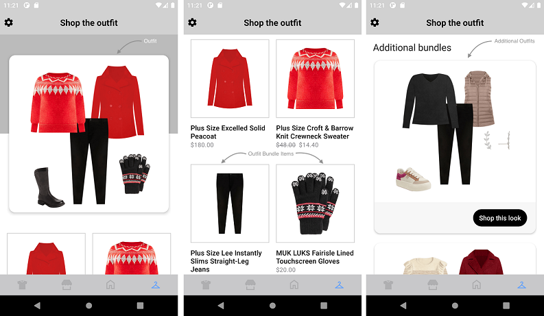
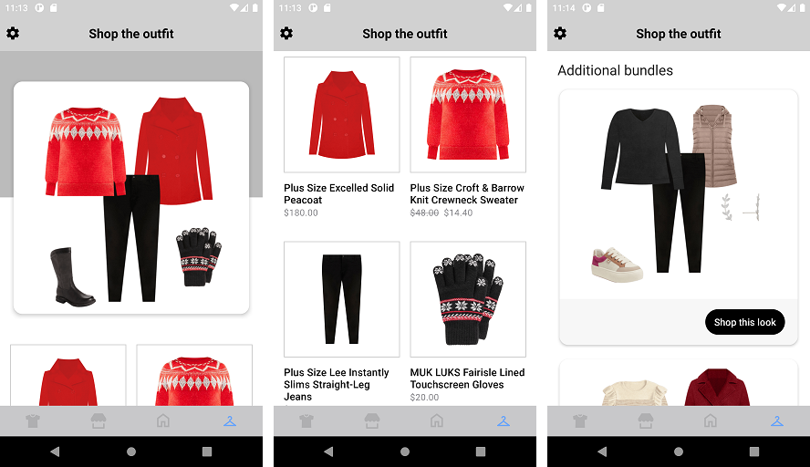
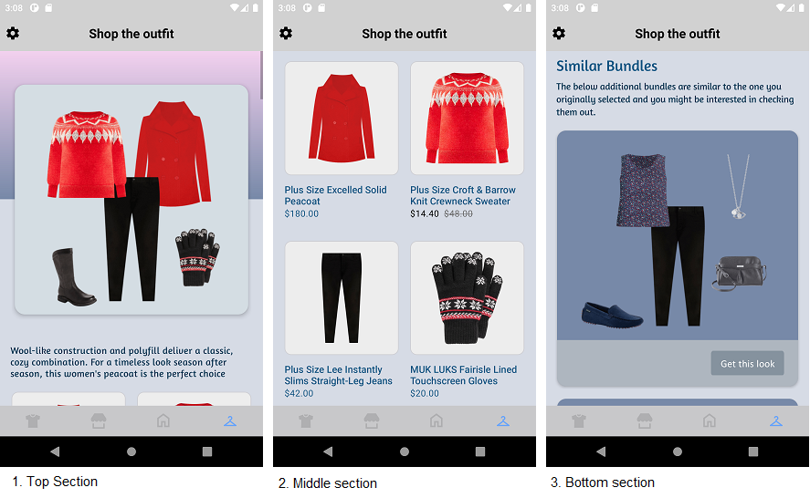
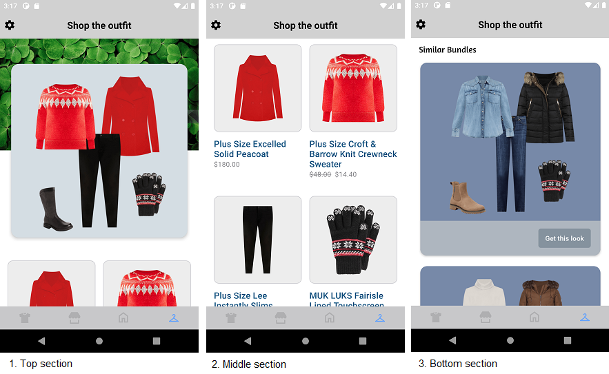

# OUTFIT LANDING PAGE(OLP) WIDGET

It provides view to display Stylitics OLP data. It also handles invoking of Widget tracking events based on user interaction with these views.

Below are the features for OLP Widget.</br>

* Configure all the UI elements for OLP Widget.
* Handles tracking events so Integrator App does not have to do it.
* Provides listeners to Integrator App so they can handle the events (if needed) based on user interaction.
* Configure whether to display bundle items of Additional Bundles directly from SDK or not.
* When Bundle Items of Additional bundles are configured to display from SDK, Integrator App can provide configs for it.

## Configurations:



### Outfit Image

| Fields                      | Description                                                                                               | Default Value                     | 
|-----------------------------|-----------------------------------------------------------------------------------------------------------|-----------------------------------|
| `backgroundColor`           | is the gradient background for the Outfit card and is accessed from drawable resource file                | `R.drawable.olp_background_color` | 
| `backgroundImageUrl`        | is the image URL for the image to be displayed as a Outfit card background and is accessed as string      | `null`                            |
| `cardBackgroundColor`       | is Outfit card background color and is accessed from color.xml resource file                              | `#FFFFFF`                         | 
| `cardBorderRadius`          | is Outfit card corner radius and is accessed as float and internally it is converted to dp                | `14f`                             |
| `cardPaddingVertical`       | is top spacing of the Outfit card. It accepts float value and internally it is converted to dp            | `40f`                             |
| `cardPaddingHorizontal`     | is left and right spacing of the Outfit card. It accepts a float value, which is internally converted to dp | `16f`                             | 
| `paddingVertical`           | is top and bottom spacing to the Image inside Outfit card. It accepts float value and internally it is converted to dp| `8f`                              |


In Android, Outfit Image *_**backgroundColor**_* is set using below XML code of drawable resource file, which contains configurations for background color.

Drawable Resource File name : olp_background_color
```xml
<?xml version="1.0" encoding="utf-8"?>
<shape xmlns:android="http://schemas.android.com/apk/res/android">
<solid android:color="#BBBBBB"/>
</shape>
```

*_**backgroundColor**_* is the configurable parameter to set backgroundColor as shown below.

```kotlin
 backgroundColor = R.drawable.olp_background_color
```
### Outfit Description

| Fields                           | Description                                                                                            | Default Value        | 
|----------------------------------|--------------------------------------------------------------------------------------------------------|----------------------|
| `text`                           | is the Outfit description text for the label                                                           | ``                   | 
| `paddingHorizontal`              | is left and right spacing to the label. It accepts float value and internally it is converted to dp    | `18f`                |
| `paddingBottom`                  | is bottom spacing for the label. It accepts float value and internally it is converted to dp           | `24f`                |
| `fontColor`                      | is label text font color and is accessed from color.xml resource file                                  | `#666666`            | 
| `fontSize`                       | is label font size in float and internally it is converted into sp                                     | `16f`                |  
| `fontFamilyAndWeight`            | is label font style with the font weight and is accessed from the font resource folder                 | `roboto_regular`     |

### Items

| Fields                       | Description                                                                                                                    | Default Value  |
|------------------------------|--------------------------------------------------------------------------------------------------------------------------------|----------------|
| `paddingOutsideHorizontal`   | is left and right spacing of the Outfit items with the margin. It accepts float value and internally it is converted to dp     | `16f`          |  
| `paddingInsideHorizontal`    | is the horizontal spacing between two items of Outfit items. It accepts float value and internally it is converted to dp       | `16f`          |  
| `paddingInsideVertical`      | is the vertical spacing between two items of Outfit items. It accepts float value and internally it is converted to dp         | `36f`          |

### Item

| Fields                        | Description                                                                                                                   | Default Value                    | 
|-------------------------------|-------------------------------------------------------------------------------------------------------------------------------|----------------------------------|
| `backgroundColor`             | is the background to the item image and is accessed from drawable resource file                                               | `R.drawable.olp_item_background` | 
| `imageMarginHorizontal`       | is left and right spacing inside item imageView within an item. It accepts float value and internally it is converted to dp       | `17f`                            |            
| `imageMarginVertical`         | is top and bottom spacing inside item imageView within an item. It accepts float value and internally it is converted to dp       | `17f`                            |            
| `fontColor`                   | is item name text color and is accessed from color.xml resource file                                                          | `#000000`                        |            
| `fontFamilyAndWeight`         | is item name font style with the font weight and is accessed from the font resource folder                                    | `roboto_medium`                  |            
| `fontSize`                    | is the item name font size in float and internally it is converted into sp                                                    | `16f`                            |
| `priceDecimal`                | is the number of digits to show after decimal point and it is accepted as a integer                                           | `2`                              |
| `priceFontColor`              | to set item price text color which is accessed from color.xml resource file                                                   | `#8A8A8E`                        |            
| `priceFontFamilyAndWeight`    | is the item price font style with the font weight and is accessed from the font resource folder                               | `roboto_regular`                 |            
| `priceFontSize`               | is the item price font size in float and internally it is converted into sp                                                   | `14f`                            |            
| `salePriceFontColor`          | to set item sale price text color which is accessed from color.xml resource file                                              | `#8A8A8E`                        |            
| `strikeThroughPriceFontColor` | is strike through price text color which is accessed from color.xml resource file                                             | `#8A8A8E`                        |
| `style`                       | to show or hide the Strike Through Price                                                                                      | `PriceStrikeThrough.SHOW`        |            
| `swapPricesPosition`          | is boolean value, when it is false it shows strike through price first and then sale price. Vice versa when true.             | `false`                          |


In Android, Item *_**backgroundColor**_* is set using below XML code of drawable resource file, which contains configurations for background color.

Drawable Resource File name : olp_item_background
```xml
<?xml version="1.0" encoding="utf-8"?>
<shape xmlns:android="http://schemas.android.com/apk/res/android">
  <stroke android:width="@dimen/size_1"
          android:color="#3D212121"/>
  <solid android:color="@color/white"/>
</shape>
```

*_**backgroundColor**_* is the configurable parameter to set backgroundColor as shown below.

```kotlin
 backgroundColor = R.drawable.olp_item_background
```

### AdditionalItems

| Fields                      | Description                                                                                             | Default Value            | 
|-----------------------------|---------------------------------------------------------------------------------------------------------|--------------------------|
| `verticalPadding`           | is top spacing to the header. It accepts float value and internally it is converted to dp               | `40f`                    | 
| `headerText`                | to set the header text                                                                                  | `Additional bundles`     |            
| `headerFontColor`           | is header text color and is accessed from color.xml resource file                                       | `#212121`                |            
| `headerFontFamilyAndWeight` | is the header text font style with the font weight and is accessed from the font resource folder        | `roboto_regular`         |            
| `headerFontSize`            | is the header text font size in float and internally it is converted into sp                            | `22f`                    |            
| `headerVerticalPadding`     | is bottom spacing to the header text. It accepts float value and internally it is converted to dp       | `12f`                    |
| `subHeaderText`             | to set the sub header text                                                                              | ``                       |
| `subHeaderFontColor`        | is sub sub header text color and is accessed from color.xml resource file                               | `#666666`                |            
| `subHeaderFontFamilyAndWeight`| is the sub header font style with the font weight and is accessed from the font resource folder       | `roboto_regular`         |            
| `subHeaderFontSize`         | is the sub header font size in float and internally it is converted into sp                             | `16f`                    |            

### OutfitCard

| Fields                 | Description                                                                                                                 | Default Value           | 
|------------------------|-----------------------------------------------------------------------------------------------------------------------------|-------------------------|
| `backgroundColor`      | is background color to the additional Outfit bundle card and is accessed from color.xml resource file                       | `#FFFFFF`               |            
| `paddingVertical`      | is the spacing between two Outfit bundle cards. It accepts float value and internally it is converted to dp                 | `16f`                   |            
| `paddingHorizontal`    | is left and right spacing to the additional bundles list. It accepts float value and internally it is converted to dp       | `16f`                   |
| `cornerRadius`         | is border radius to the Outfit bundle card. It accepts float value and internally it is converted to dp                     | `14f`                   |

### BottomLabel

| Fields                | Description                                                                                                             | Default Value     |
|-----------------------|-------------------------------------------------------------------------------------------------------------------------|-------------------|
| `ctaTitle`            | to set the title of the label                                                                                           | `Shop this look`  | 
| `fontFamilyAndWeight` | is the label font style with the font weight and is accessed from the font resource folder                              | `roboto_medium`   | 
| `fontSize`            | is the label font size in float and internally it is converted into sp                                                  | `15f`             |
| `fontColor`           | is label text color and is accessed from color.xml resource file                                                        | `#FFFFFF`         |
| `backgroundColor`     | is widget footer background color and is accessed from color.xml resource file                                          | `#F7F7F7`         |
| `ctaBackgroundColor`  | is label background color and is accessed from drawable resource file                                                   | `R.drawable.shop_this_look_background`|
| `paddingVertical`     | is top and bottom padding of the widget footer in float and internally it is converted to dp                            | `16f`             |
| `paddingHorizontal`   | is left and right spacing for the content inside widget footer, accepts float value and internally it is converted to dp| `20f`             |
| `ctaPaddingVertical`  | is top and bottom spacing for the label's content. It accepts float value and internally it is converted to dp          | `7f`              |
| `ctaPaddingHorizontal`| is left and right spacing for the label's content. It accepts float value and internally it is converted to dp             | `14f`             |

In Android, Bottom label background is set using below XML code of drawable resource file, which contains configurations for the above parameters.

Drawable Resource File name : shop_this_look_background
```xml
<?xml version="1.0" encoding="utf-8"?>
<shape xmlns:android="http://schemas.android.com/apk/res/android">

  <corners android:radius="@dimen/size_100"/>
  <solid android:color="@android:color/black"/>
</shape>
```

*_**ctaBackgroundColor**_* is the configurable parameter to set cornerRadius and ctaBackgroundColor as shown below.

```kotlin
 ctaBackgroundColor = R.drawable.shop_this_look_background
```

### Show ScrollBar

| Fields           | Description                                                                         | Default Value |
|------------------|-------------------------------------------------------------------------------------|---------------|
| `showScrollBar`  | is Boolean value, to Show or Hide the horizontal ScrollBar of widget                | `false`       |

### Background Color

| Fields                 | Description                                                                                  | Default Value | 
|------------------------|----------------------------------------------------------------------------------------------|---------------|
| `backgroundColor`      | is to change widget background color and is accessed from color.xml resource file            | `#FFFFFF`     |


[Click here](CODE_REFERENCE_README.md#OLP-Widget-Configuration-Samples) to find code references for different configuration examples.

# Implement Exposed Listeners
Below are the list of OLP widget listeners exposed to the Integrator app. If Integrator wishes to implement their own product list screen they will have to provide the definition for widget `onOutfitClickCTA` listener.

1. `onOutfitView` - On view event of Outfit card and additional Outfit bundle, this listener will be invoked.
2. `onOutfitClick` - On click event of additional Outfit bundle, this listener will be invoked.
3. `onOutfitClickCTA` - On click event of `Shop this look` cta on additional Outfit bundle, this listener will be invoked.
4. `onItemView` - On view event of an Outfit bundle item displayed in either an OLP widget or a product list, this listener will be invoked.
5. `onItemClick` - On click event of an Outfit bundle item displayed in either an OLP widget or a product list, this listener will be invoked.

## Default Configurations:

* Below are the examples of OLP Widget when Integrator App chooses to use default UI configurations.</br>

* The OLP UI component can be implemented in below different ways.
    1. Product List enabled from SDK
    2. Product List disabled from SDK
    3. Configure Event Listeners
    
*_**XML**_*

```xml
<com.stylitics.ui.StyliticsUIApi
    android:id="@+id/recyclerViewOLP"
    android:layout_width="match_parent"
    android:layout_height="wrap_content" />
```

*_**Kotlin**_*

### 1. Product List enabled from SDK:

When product list is enabled from UX SDK and Integrator App does not provide configurations, it will take default configurations from SDK.

```kotlin
val recyclerViewOLP = findViewById<StyliticsUIApi>(R.id.recyclerViewOLP)

fun widgetWithProductListFromUXSDK(outfitLandingPage: OutfitLandingPage) {
  recyclerViewOLP?.load(
    outfitLandingPage
  )
}
```

### 2. Product List disabled from SDK:

```kotlin
val recyclerViewOLP = findViewById<StyliticsUIApi>(R.id.recyclerViewOLP)

fun widgetWhenProductListFromIntegrator(outfitLandingPage: OutfitLandingPage) {
  recyclerViewOLP?.load(
    outfitLandingPage,
    OutfitLandingPageInfo(
      outfitLandingPageListeners = OutfitLandingPageListeners(
        onOutfitClickCTA = { outfitBundleInfo ->
          context?.showGalleryProductList(outfitBundleInfo.outfitBundle)
        }
      )
    ),
    displayProductListFromSDK = false
  )
}
```

### 3. Configure Event Listeners:

```kotlin
val recyclerViewOLP = findViewById<StyliticsUIApi>(R.id.recyclerViewOLP)

fun widgetWithListenersConfigured(outfitLandingPage: OutfitLandingPage) {
  recyclerViewOLP?.load(
    outfitLandingPage,
    OutfitLandingPageInfo(
      outfitLandingPageListeners = OutfitLandingPageListeners(
        onOutfitClick = { outfitBundleInfo ->
          Log.i("OutfitLandingPageEvent", " onOutfitClick. outfitId:${outfitBundleInfo.outfitBundle.id} outfitPosition:${outfitBundleInfo.position}")
        },
        onOutfitView = { outfitBundleInfo ->
          Log.i("OutfitLandingPageEvent", " onOutfitView. outfitId:${outfitBundleInfo.outfitBundle.id} outfitPosition:${outfitBundleInfo.position}")
        },
        onOutfitClickCTA = { outfitBundleInfo ->
          Log.i("OutfitLandingPageEvent", " onOutfitClickCTA. outfitId${outfitBundleInfo.outfitBundle.id} outfitPosition:${outfitBundleInfo.position}")
        },
        onItemView = { outfitBundleInfo, outfitBundleItemInfo ->
          Log.i("OutfitLandingPageEvent", " onItemView. itemId:${outfitBundleItemInfo.outfitBundleItem.itemId} outfitId:${outfitBundleInfo.outfitBundle.id} outfitPosition:${outfitBundleItemInfo.position}")
        },
        onItemClick = { outfitBundleInfo, outfitBundleItemInfo ->
          Log.i("OutfitLandingPageEvent", " onItemClick. itemId:${outfitBundleItemInfo.outfitBundleItem.itemId} outfitId:${outfitBundleInfo.outfitBundle.id} outfitPosition:${outfitBundleItemInfo.position}")
        }
      )
    )
  )
}
```


### Default OLP Widget Screen**

* Below is the OLP Widget screenshot when Sample Integrator App uses the above configurations.

</br></br>

## Custom Configurations:

* Integrator App can customise some or all configurations & implement listeners.
* Below are the examples of OLP Widget when Sample Integrator App customises configurations.

### 1. With all configurations & Listeners:

```kotlin
val recyclerViewOLP = findViewById<StyliticsUIApi>(R.id.recyclerViewOLP)

private fun widgetWithAllCustomConfigurations(outfitLandingPage: OutfitLandingPage) {
  recyclerViewOLP?.load(
    outfitLandingPage,
    OutfitLandingPageInfo(
      outfitLandingPageConfigs = OutfitLandingPageConfigs(
        outfitImage = OutfitLandingPageConfigs.OutfitImage(
          backgroundColor = R.drawable.olp_outfit_image_gradient_background,
          cardBackgroundColor = R.color.olp_outfit_image_card_background_color,
          cardBorderRadius = 16f,
          cardPaddingVertical = 45f,
          cardPaddingHorizontal = 18f,
          paddingVertical = 10f
        ),
        outfitDescription = OutfitLandingPageConfigs.OutfitDescription(
          text = "Wool-like construction and polyfill deliver a classic, cozy combination. For a timeless look season after season, this women's peacoat is the perfect choice",
          paddingHorizontal = 16f,
          paddingBottom = 20f,
          fontColor = R.color.olp_outfit_description_font_color,
          fontSize = 15f,
          fontFamilyAndWeight = R.font.amaranth
        ),
        items = OutfitLandingPageConfigs.Items(
          paddingOutsideHorizontal = 18f,
          paddingInsideHorizontal = 18f,
          paddingInsideVertical = 34f
        ),
        item = OutfitLandingPageConfigs.Item(
          backgroundColor = R.drawable.custom_olp_item_background, 
          imageMarginHorizontal = 15f, 
          imageMarginVertical = 15f, 
          fontColor = R.color.olp_item_title_font_color,
          fontSize = 15f,
          priceDecimal = 3,
          priceFontColor = R.color.olp_item_cost_font_color,
          priceFontFamilyAndWeight = R.font.amaranth,
          priceFontSize = 18f,
          salePriceFontColor = R.color.olp_item_sale_price_font_color,
          strikeThroughPriceFontColor = R.color.olp_item_strike_through_price_font_color,
          style = PriceStrikeThrough.SHOW,
          swapPricesPosition = true
        ),
        additionalItems = OutfitLandingPageConfigs.AdditionalItems(
          verticalPadding = 42f,
          headerText = "Similar Bundles",
          headerFontColor = R.color.olp_addition_bundle_items_header_font_Color,
          headerFontFamilyAndWeight = R.font.amaranth,
          headerFontSize = 24f,
          headerVerticalPadding = 10f,
          subHeaderText = "The below additional bundles are similar to the one you originally selected and you might be interested in checking them out.",
          subHeaderFontColor = R.color.olp_additional_bundles_items_sub_header_font_color,
          subHeaderFontFamilyAndWeight = R.font.amaranth,
          subHeaderFontSize = 15f
        ),
        outfitCard = OutfitLandingPageConfigs.OutfitCard(
          backgroundColor = R.color.olp_outfit_card_background_color,
          paddingVertical = 14f,
          paddingHorizontal = 14f,
          cornerRadius = 15f
        ),
        bottomLabel = OutfitLandingPageConfigs.BottomLabel(
          ctaTitle = "Get this look",
          fontFamilyAndWeight = R.font.calibri,
          fontSize = 16f,
          fontColor = R.color.olp_bottom_label_font_color,
          backgroundColor = R.color.olp_header_footer_background_color,
          ctaBackgroundColor = R.drawable.custom_shop_this_look_backgroud_olp,
          paddingVertical = 17f,
          paddingHorizontal = 22f,
          ctaPaddingVertical = 6f,
          ctaPaddingHorizontal = 15f
        ),
        showScrollBar = true,
        backgroundColor = R.color.olp_widget_background_color
      ),
      outfitLandingPageListeners = OutfitLandingPageListeners(
        onOutfitClick = { outfitBundleInfo ->
          Log.i("OutfitLandingPageEvent", " onOutfitClick. outfitId:${outfitBundleInfo.outfitBundle.id} outfitPosition:${outfitBundleInfo.position}")
        },
        onOutfitView = { outfitBundleInfo ->
          Log.i("OutfitLandingPageEvent", " onOutfitView. outfitId:${outfitBundleInfo.outfitBundle.id} outfitPosition:${outfitBundleInfo.position}")
        },
        onOutfitClickCTA = { outfitBundleInfo ->
          Log.i("OutfitLandingPageEvent", " onOutfitClickCTA. outfitId${outfitBundleInfo.outfitBundle.id} outfitPosition:${outfitBundleInfo.position}")
        },
        onItemView = { outfitBundleInfo, outfitBundleItemInfo ->
          Log.i("OutfitLandingPageEvent", " onItemView. itemId:${outfitBundleItemInfo.outfitBundleItem.itemId} outfitId:${outfitBundleInfo.outfitBundle.id} outfitPosition:${outfitBundleItemInfo.position}")
        },
        onItemClick = { outfitBundleInfo, outfitBundleItemInfo ->
          Log.i("OutfitLandingPageEvent", " onItemClick. itemId:${outfitBundleItemInfo.outfitBundleItem.itemId} outfitId:${outfitBundleInfo.outfitBundle.id} outfitPosition:${outfitBundleItemInfo.position}")
        }
      )
    )
  )
}
```


* Below is the OLP Widget screenshot when Sample Integrator App uses the above configurations.

</br>

### 2. With some custom configurations & Listeners:

If Integrator App provides only few configurations, UX SDK will take default configurations for missing fields.

```kotlin
val recyclerViewOLP = findViewById<StyliticsUIApi>(R.id.recyclerViewOLP)

fun widgetWithSomeCustomConfigurations(outfitLandingPage: OutfitLandingPage) {
  recyclerViewOLP?.load(
    outfitLandingPage,
    OutfitLandingPageInfo(
      outfitLandingPageConfigs = OutfitLandingPageConfigs(
        outfitImage = OutfitLandingPageConfigs.OutfitImage(
          backgroundImageUrl = "https://media.istockphoto.com/id/157617234/photo/close-up-of-a-bunch-of-green-clover.jpg?s=2048x2048&w=is&k=20&c=lRCpNockNQtnHfjT3fJdbVVdb_l63K2vr886XM6sRwk=",
          cardBackgroundColor = R.color.olp_outfit_image_card_background_color,
          cardBorderRadius = 16f,
          cardPaddingVertical = 45f,
          cardPaddingHorizontal = 18f,
          paddingVertical = 10f
        ),
        item = OutfitLandingPageConfigs.Item(
          backgroundColor = R.drawable.custom_olp_item_background, 
          fontColor = R.color.olp_item_title_font_color,
          fontSize = 18f
        ),
        outfitCard = OutfitLandingPageConfigs.OutfitCard(
          backgroundColor = R.color.olp_outfit_card_background_color
        ),
        bottomLabel = OutfitLandingPageConfigs.BottomLabel(
          ctaTitle = "Get this look",
          fontSize = 14f,
          fontColor = R.color.olp_bottom_label_font_color,
          backgroundColor = R.color.olp_header_footer_background_color,
          ctaBackgroundColor = R.drawable.custom_shop_this_look_backgroud_olp
        ),
        additionalItems = OutfitLandingPageConfigs.AdditionalItems(
          verticalPadding = 50f,
          headerText = "Similar Bundles",
          headerFontColor = R.color.black,
          headerFontFamilyAndWeight = R.font.amaranth,
          headerFontSize = 18f
        )
      ),
      outfitLandingPageListeners = OutfitLandingPageListeners(
        onOutfitClick = { outfitBundleInfo ->
          Log.i("OutfitLandingPageEvent", " onOutfitClick. outfitId:${outfitBundleInfo.outfitBundle.id} outfitPosition:${outfitBundleInfo.position}")
        },
        onOutfitView = { outfitBundleInfo ->
          Log.i("OutfitLandingPageEvent", " onOutfitView. outfitId:${outfitBundleInfo.outfitBundle.id} outfitPosition:${outfitBundleInfo.position}")
        },
        onOutfitClickCTA = { outfitBundleInfo ->
          Log.i("OutfitLandingPageEvent", " onOutfitClickCTA. outfitId:${outfitBundleInfo.outfitBundle.id} outfitPosition:${outfitBundleInfo.position}")
        }
      )
    )
  )
}
```

* Below is the OLP Widget screenshot when Sample Integrator App uses the above configurations.

</br>

*Note: It is recommended to set either the `backgroundColor` or `backgroundImage` configuration parameter of the *_**OutfitImage**_* component at a time. If both parameters are provided, the `backgroundImage` will be displayed.*

## Refresh Outfit Landing Page Widget

**Overview**

The `refreshOLPTemplate` method can be used to update the OLP widget data or its configurations or both.

**Example**

```Kotlin
fun refreshOLPTemplate(outfitLandingPage: OutfitLandingPage? = null, widgetConfig: IWidgetConfig? = null)
```

**Parameters**

- `outfitLandingPage`: Optional parameter to provide updated OLP data.
- `widgetConfig`: Optional parameter to provide updated configurations for OLP template.

**Usage**

Call the method on the view with optional data/config.

- Get the OLP Widget Template id
```Kotlin
val recyclerViewOLP = findViewById<StyliticsUIApi>(R.id.recyclerViewOLP)
//Load OLP Widget
recyclerViewOLP.load(outfitLandingPage)
```

- To refresh the OLP Widget Template with new OLP data
```Kotlin
recyclerViewOLP.refreshTemplate(outfitLandingPage = newOLPData)
```
- To refresh the OLP Widget Template with new configs
```Kotlin
recyclerViewOLP.refreshTemplate(widgetConfig = newConfig)
```
- To refresh the OLP Widget Template with both new OLP data and configs
```Kotlin
recyclerViewOLP.refreshTemplate(newOLPData, newConfig)
```

## License

Copyright © 2023 Stylitics