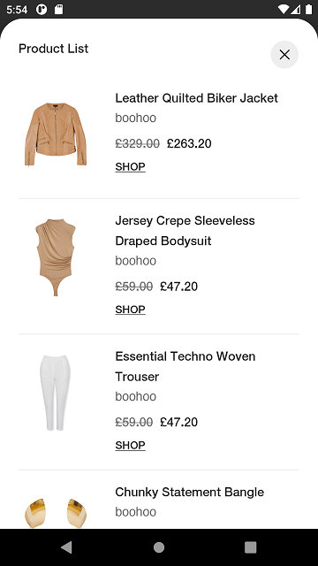

# Stylitics UX SDK

It provides views to display Stylitics data. It also handles invoking of tracking events based on user interaction with these views.

## Features

SDK provides multiple custom view options to Sample Integrator App so it can easily display Stylitics data.

### Outfits

1. Outfits
   * [Classic Outfit Widget](CLASSIC_WIDGET_README.md)
   * [Hotspot Outfit Widget](HOTSPOT_WIDGET_README.md)
   * [Grid_Outfit_Widget](GRID_WIDGET_README.md)

2. Outfit Items
   * [Standard Product List View](STANDARD_PRODUCTLIST_README.md)

3. Replacements
   * Replacement View (Displayed internally from Product List View)

### Dynamic GalleryBundles

1. GalleryBundles
   * [Dynamic Gallery Widget](DYNAMIC_GALLERY_WIDGET_README.md)

2. OutfitBundleItems
   * [OutfitBundle Product List View](OUTFIT_BUNDLE_PRODUCTLIST_README.md)

### Shop the Set

1. ShopTheSet
   * [Shop the Set Widget](SHOP_THE_SET_WIDGET_README.md)

### Styled For You

1. StyledForYou
   * [Styled For You Widget](STYLED_FOR_YOU_WIDGET_README.md)

2. OutfitBundleItems
   * [Product List View](OUTFIT_BUNDLE_PRODUCTLIST_README.md)
   

### Outfit Landing Page

1. OutfitLandingPage
   * [Outfit Landing Page](OUTFIT_LANDING_PAGE_WIDGET_README.md)

2. OutfitBundleItems
   * [Product List View](OUTFIT_BUNDLE_PRODUCTLIST_README.md)

## Localization

Below is the screenshot with localized data when locale is configured to "en-GB". Locale parameter in Outfits data Api is case-insensitive, so it accepts both "en-GB" and "en-gb".
 

*Note : When 'locale' is configured and the product items are displayed with the localized data, the price decimal parameter configuration will be ignored.*

## License

Copyright © 2023 Stylitics
