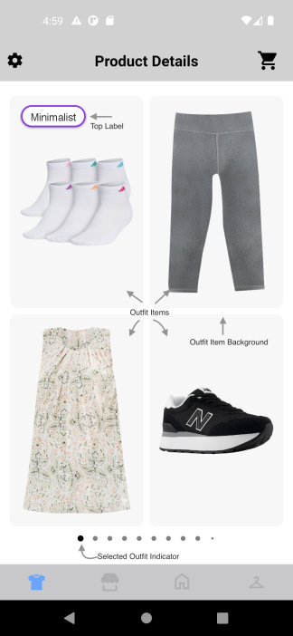
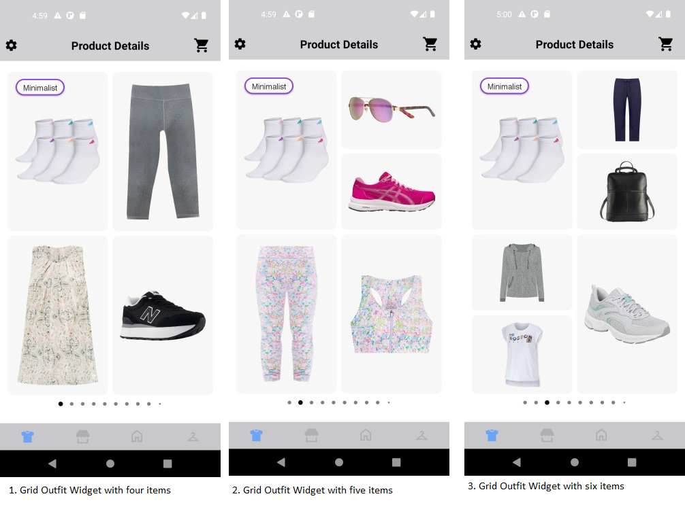
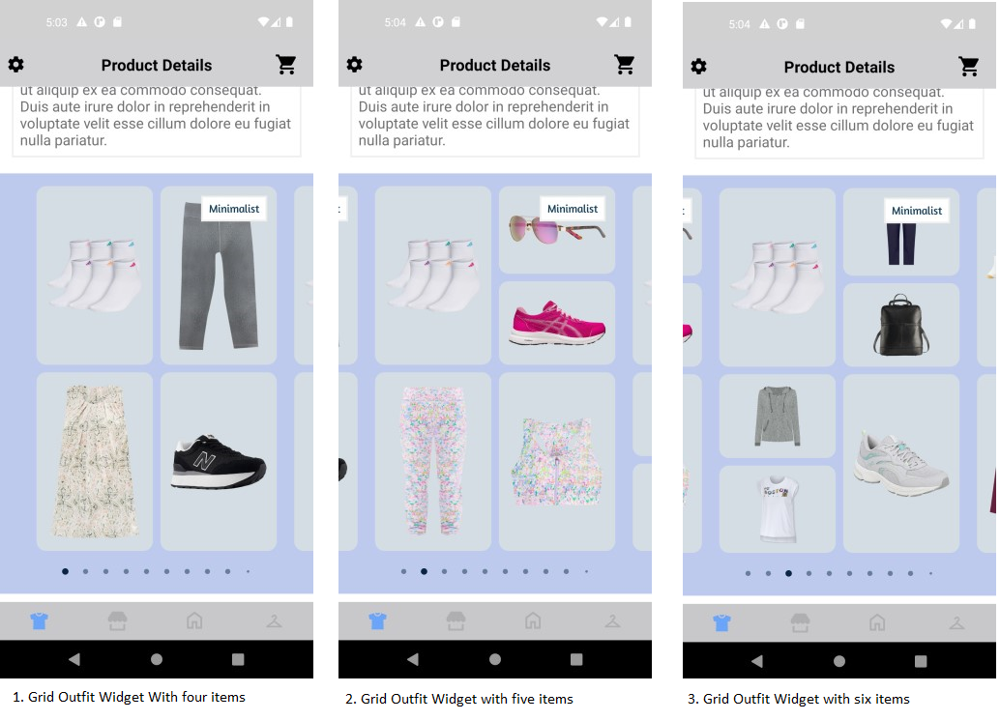
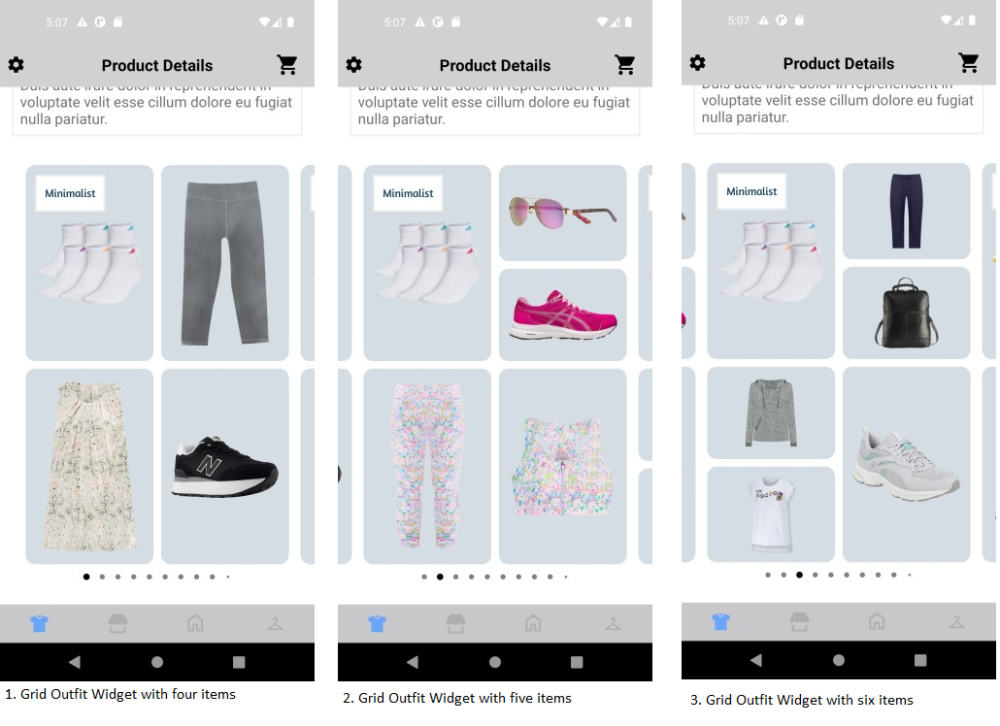

# GRID WIDGET

It provides view to display Stylitics data. It also handles invoking of Widget tracking events based on user interaction with these views.

Below are the features for Grid Outfit Widget.</br>

* Configure all the UI elements for each Outfit
* Handles Outfit `View` and `Click` tracking events so Integrator App does not have to do it
* Provides listeners to Integrator App so they can handle the Outfit View and Click events
* Configure whether to display Outfit Items directly from SDK or not
    * When Outfit Items are configured to display from SDK, Integrator App can provide configs for it along with Grid configs

## Configurations:



### Widget Background

| Fields             | Description                                                                                                    | Default Value | 
|--------------------|----------------------------------------------------------------------------------------------------------------|---------------|
| `backgroundColor`  | is widget background color and is accessed from color.xml resource file                                        | `#FFFFFF`     |
| `cardPeek`         | is the previous and next Outfit card peek and is accessed as float and internally it is converted to dp        | `0f`          |           
| `cardGutter`       | is the space between two adjacent widget cards and is accessed as float and internally it is converted to dp   | `18f`         |            

### Top Label

UX SDK provides various Label styles for the Top Label. [Click here](LABELS_README.md) to learn more about it.      

### Item Image

| Fields             | Description                                                                                           | Default Value | 
|--------------------|-------------------------------------------------------------------------------------------------------|---------------|
| `backgroundColor`  | is item image background color and is accessed from *_**solid color**_* in drawable resource file     | `#F7F7F7`     |
| `padding`          | is padding of the widget in float and internally it is converted to dp                                | `8f`          |             

In Android, Outfit Widget background is set using below XML code of drawable resource file, which contains configurations for the above parameters.

Drawable Resource File name : grid_item_image_background
```xml
<?xml version="1.0" encoding="utf-8"?>
<shape xmlns:android="http://schemas.android.com/apk/res/android">
    <solid android:color="@color/grid_item_images_background_color" />
    <corners android:radius="@dimen/size_10" />
</shape>
```
### Bullet

| Fields               | Description                                                                                                    | Default Value | 
|----------------------|----------------------------------------------------------------------------------------------------------------|---------------|
| `unselectedColor`    | is color of unselected bullet and is accessed from color.xml resource file                                     | `#D3D3D3`     | 
| `selectedColor`      | is color of selected bullet and is accessed from color.xml resource file                                       | `#212121`     | 
| `paddingVertical`    | is top and bottom spacing of the page indicator view in float and internally it is converted to dp             | `10f`         |             
| `paddingHorizontal`  | is spacing between two adjacent bullets of page indicator view in float and internally it is converted to dp   | `10f`         |             

### Top Label Position

| Fields              | Description                                                  | Default Value |
|---------------------|--------------------------------------------------------------|---------------|
| `topLabelPosition`  | is to change the top label position to top left or top right | `TOP.LEFT`    |

[Click here](CODE_REFERENCE_README.md#Grid-Widget-Configuration-Samples) to find code references for different configuration examples.

## Implement Exposed Listeners
Below are the list of Grid Outfit widget listeners exposed to the Integrator app. If integrator wishes to implement their own product list screen they will have to provide the definition for widget `onOutfitClick` listener.

1. `onOutfitClick` - On click event of widget, this listener will be triggered.
2. `onOutfitView` - On view event of Outfit, this listener will be triggered.

## Default Configurations:

* Below are the examples of Grid Outfit Widget when Integrator App chooses to use default UI configurations.</br>

* The Grid Outfit UI component can be implemented in below different ways.
  1. Product List enabled from SDK
  2. Product List disabled from SDK
  3. Configure Event Listeners

* Grid Outfit Widget supports `WRAP_CONTENT` as a height.

*_**XML**_*

```xml
<com.stylitics.ui.StyliticsUIApi 
        android:id="@+id/outfitsRecyclerView"
        android:layout_width="match_parent"
        android:layout_height="@dimen/size_592" />
```

*_**Kotlin**_*

### 1. Product List enabled from SDK:

When product list is enabled from UX SDK and Integrator App does not provide configurations, it will take default configurations from SDK.

```kotlin
val outfitsRecyclerView = findViewById<StyliticsUIApi>(R.id.outfitsRecyclerView)

private fun widgetWithProductListFromUXSDK(outfits: Outfits) {
    outfitsRecyclerView.load(
        outfits,
        OutfitsTemplate.Grid()
    )
}
```

### 2. Product List disabled from SDK:

```kotlin
val outfitsRecyclerView = findViewById<StyliticsUIApi>(R.id.outfitsRecyclerView)

private fun widgetWhenProductListFromIntegrator(outfits: Outfits) {
    outfitsRecyclerView.load(
        outfits,
        OutfitsTemplate.Grid(
            gridListener = GridListener(
                onOutfitClick = { outfitBundleInfo ->
                    //Display Product List Screen from Integrator here
                    context?.showProductList(outfitBundleInfo.outfitBundle)
                }
            )),
        displayProductListFromSDK = false
    )
}
```

### 3. Configure Event Listeners:

```kotlin
val outfitsRecyclerView = findViewById<StyliticsUIApi>(R.id.outfitsRecyclerView)

private fun widgetWithListenersConfigured(outfits: Outfits) {
    outfitsRecyclerView.load(
        outfits,
        OutfitsTemplate.Grid(
            gridListener = GridListener(
                onOutfitClick = { outfitBundleInfo ->
                    Log.i("OutfitEvent", " Outfit click event triggered. ${outfitBundleInfo.outfitBundle.id}")
                },
                onOutfitView = { outfitBundleInfo ->
                    Log.i("OutfitEvent", " Outfit view event triggered. ${outfitBundleInfo.outfitBundle.id}")
                }
            )
        )
    )
}
```

### Default Grid Outfit Widget Screen

* Below is the Grid Outfit Widget screenshot when Integrator App uses the above configurations.

</br></br>

## Custom Configurations:

* Integrator App can customise some or all configurations & implement listeners.
* Below are the examples of Grid Outfit Widget when Integrator App customises configurations.

### 1. With all configurations & Listeners:

```kotlin
fun customConfigs(): GridConfig {
    val topLabelConfig = TopLabel(
        label1 = TopLabel.Label1(
            fontFamilyAndWeight = R.font.amaranth,
            fontSize = 14f,
            fontColor = R.color.grid_top_label_font_color,
            paddingVertical = 8f,
            paddingHorizontal = 10f,
            background = R.drawable.top_label_border
        )
    )

    return GridConfig(
        widget = GridConfig.Widget(
            backgroundColor = R.color.grid_widget_bg_color,
            cardPeek = 35f,
            cardGutter = 30
        ),
        topLabel = topLabelConfig,
        itemImage = GridConfig.ItemImage(
            backgroundColor = R.drawable.grid_item_image_rounded_background,
            padding = 10f
        ),
        bullet = GridConfig.Bullet(
            unselectedColor = R.color.grid_unselected_bullet_color,
            selectedColor = R.color.grid_selected_bullet_color,
            paddingVertical = 30f,
            paddingHorizontal = 12f
        ),
        topLabelPosition = TopLabelPosition.TOP_RIGHT
    )
}
```

```kotlin
val outfitsRecyclerView = findViewById<StyliticsUIApi>(R.id.outfitsRecyclerView)

private fun widgetWithAllCustomConfigurations(outfits: Outfits) {
    itemsRecyclerView?.load(
        outfits, OutfitsTemplate.Grid(
            gridConfig = customConfigs(),
            gridListener = GridListener(
                onOutfitClick = { outfitBundleInfo ->
                    Log.i("OutfitEvent", " Outfit click event triggered. ${outfitBundleInfo.outfitBundle.id}")
                },
                onOutfitView = { outfitBundleInfo ->
                    Log.i("OutfitEvent", " Outfit view event triggered. ${outfitBundleInfo.outfitBundle.id}")
                }
            )
        )
    )
}         
```

* Below is the Grid Outfit Widget screenshot when Integrator App uses the above configurations.

</br>

### 2. With some custom configurations & Listeners:

If Integrator App provides only few configurations, UX SDK will take default configurations for missing fields.

```kotlin
val outfitsRecyclerView = findViewById<StyliticsUIApi>(R.id.outfitsRecyclerView)

private fun widgetWithSomeCustomConfigurations(outfits: Outfits) {
    //Passing custom configurations for multiple Label styles
    val topLabelConfig = TopLabel(
        label2 = TopLabel.Label2(
            background = R.drawable.top_label_border,
        ),
        label1 = TopLabel.Label1(
            fontFamilyAndWeight = R.font.amaranth,
            fontSize = 14f,
            fontColor = R.color.grid_top_label_font_color,
            paddingVertical = 15f,
            paddingHorizontal = 12f,
            background = R.drawable.top_label_border
        ),
        label7 = TopLabel.Label7(
            fontColor = R.color.grid_top_label_font_color
        )
    )
    outfitsRecyclerView?.load(
        outfits, OutfitsTemplate.Grid(
            gridConfig = GridConfig(
                widget = GridConfig.Widget(
                   cardPeek = 25f, 
                   cardGutter = 20
                ),
                topLabel = topLabelConfig,
                itemImage = GridConfig.ItemImage(
                   backgroundColor = R.drawable.grid_item_image_rounded_background,
                   padding = 10f
                )
            ),
            gridListener = GridListener(
                onOutfitClick = { outfitBundleInfo ->
                    Log.i("OutfitEvent", " Outfit click event triggered. ${outfitBundleInfo.outfitBundle.id}")
                }
            )
        )
    )
}         
```

* Below is the Grid Outfit Widget screenshot when Integrator App uses the above configurations.

</br>

## Refresh Grid Outfit Widget

**Overview**

The `refreshTemplate` method can be used to update the Grid Outfit widget data or its configurations or both.

**Example**

```Kotlin
fun refreshTemplate(outfits: Outfits? = null, widgetConfig: IWidgetConfig? = null)
```

**Parameters**

- `outfits`: Optional parameter to provide updated Outfits data.
- `widgetConfig`: Optional parameter to provide updated configurations for Grid Outfits template.

**Usage**

Call the method on the view with optional data/config.

- Get the Grid Outfit Widget Template id
```Kotlin
val outfitsRecyclerView = findViewById<StyliticsUIApi>(R.id.outfitsRecyclerView)
//Load Grid Outfit Widget Template
outfitsRecyclerView.load(outfits, OutfitsTemplate.Grid())
```

- To refresh the Grid Outfit Widget Template with new Outfit data
```Kotlin
outfitsRecyclerView.refreshTemplate(outfits = newOutfits)
```
- To refresh the Grid Outfit Widget Template with new config
```Kotlin
outfitsRecyclerView.refreshTemplate(widgetConfig = newConfig)
```
- To refresh the Grid Outfit Widget Template with both new Outfit data and config
```Kotlin
outfitsRecyclerView.refreshTemplate(newOutfits, newConfig)
```

## License

Copyright © 2024 Stylitics