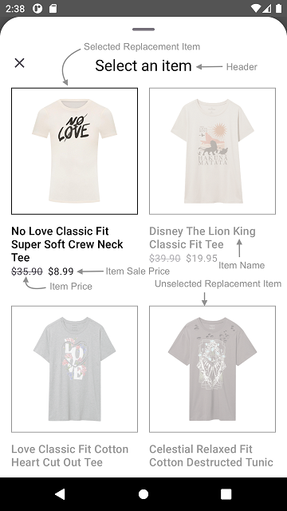
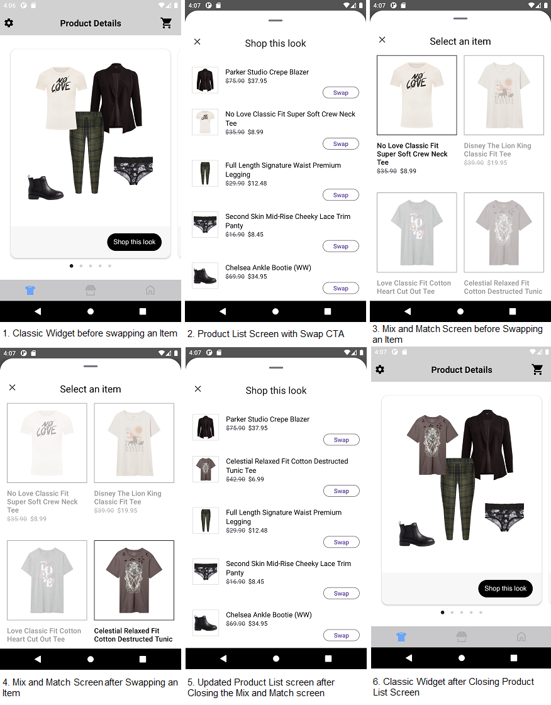
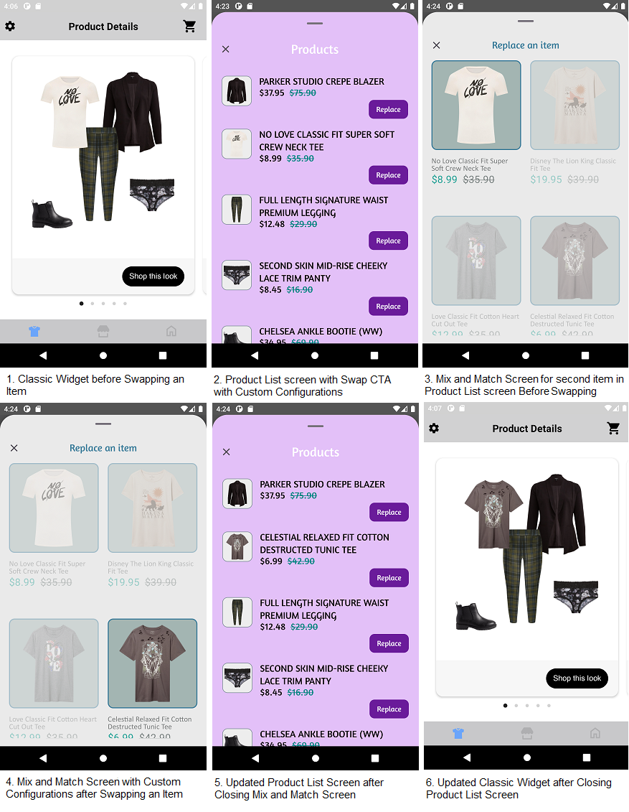
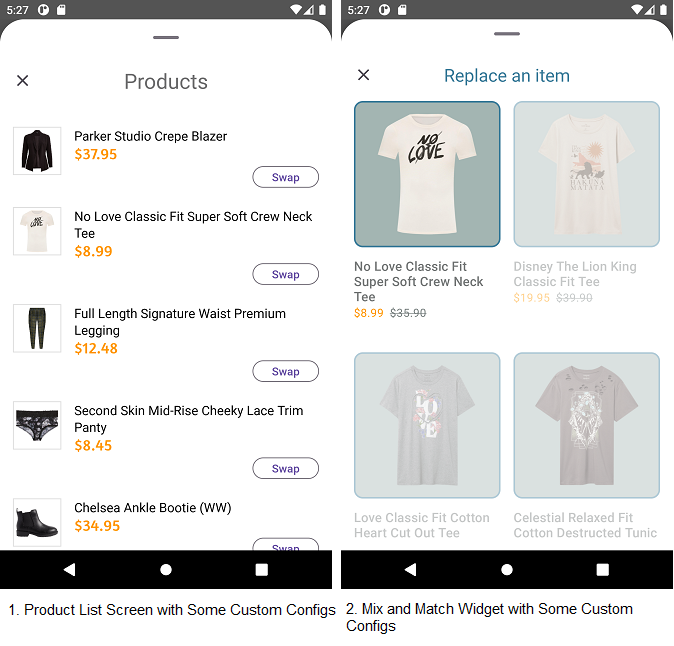

# MIX AND MATCH SCREEN

This screen is displayed when user clicks on `Swap` CTA in Product list screen. It provides views to display Replacements items for Product list item. It also handles invoking of item tracking events based on user interaction with these views.

Below are the features for Mix and Match Screen 
* Configure all the UI elements for Mix and Match Screen
* Handles tracking events so Integrator App does not have to do it
* Provides listeners to Integrator App so they can handle the events

## Configurations

</br>

#### Background Color

| Fields                   | Description                                                                                      | Default Value                       |
|--------------------------|--------------------------------------------------------------------------------------------------|-------------------------------------|
| `backgroundColor`        | is to change Mix and Match Screen background color and is accessed from color.xml resource file  | `#FFFFFF`                           |

#### Header

| Fields                | Description                                                                                                            | Default Value           | 
|-----------------------|------------------------------------------------------------------------------------------------------------------------|-------------------------|
| `title`               | to set the header of the screen                                                                                        | `Select an item`        |           
| `align`               | to set the Mix and Match screen title alignment with close button. It will be center aligned when the value is CENTER  | `Align.TOP`             |           
| `fontFamilyAndWeight` | is the font style with the font weight and is accessed from the font resource folder                                   | `R.font.roboto_regular` |           
| `fontSize`            | is the font size in float and internally it is converted into SP                                                       | `22f`                   |           
| `fontColor`           | is text color and is accessed from color.xml resource file                                                             | `#000000`               |

#### Presentation Style

| Fields               | Description                                         | Default Value                    |
|----------------------|-----------------------------------------------------|----------------------------------|
| `presentationStyle`  | to set the Mix and Match Screen Presentation style  | `PresentationStyle.FULL_SCREEN`  |


### Items

| Fields                     | Description                                                                                                                     | Default Value | 
|----------------------------|---------------------------------------------------------------------------------------------------------------------------------|---------------|
| `paddingOutsideHorizontal` | is left and right spacing of the replacement items with the margin. It accepts float value and internally it is converted to dp | `16f`         |           
| `paddingInsideHorizontal`  | is the horizontal spacing between two replacement items. It accepts float value and internally it is converted to dp            | `16f`         |           
| `paddingInsideVertical`    | is the vertical spacing between two replacement items. It accepts float value and internally it is converted to dp              | `40f`         |           

### Item

| Fields                        | Description                                                                                                       | Default Value                                           | 
|-------------------------------|-------------------------------------------------------------------------------------------------------------------|---------------------------------------------------------|
| `imageBackgroundColor`        | is the background to the item image and is accessed from drawable resource file                                   | `R.drawable.selected_replacement_item_image_background` |            
| `fontColor`                   | to set item text color which is accessed from color.xml resource file                                             | `#000000`                                               | 
| `fontFamilyAndWeight`         | is the font style with the font weight and is accessed from the font resource folder                              | `R.font.roboto_medium`                                  | 
| `fontSize`                    | is font size in float and internally it is converted into sp                                                      | `16f`                                                   |
| `priceFontColor`              | is price text color which is accessed from color.xml resource file                                                | `#1D1B20`                                               | 
| `priceFontFamilyAndWeight`    | is the price font style with the font weight and is accessed from the font resource folder                        | `R.font.roboto_regular`                                 |            
| `priceFontSize`               | is the price font size in float and internally it is converted into sp                                            | `14f`                                                   |
| `salePriceFontColor`          | to set item sale price text color which is accessed from color.xml resource file                                  | `#1D1B20`                                               |
| `strikeThroughPriceFontColor` | is strike through price text color which is accessed from color.xml resource file                                 | `#49454F`                                               |
| `style`                       | to show or hide the Strike Through Price                                                                          | `PriceStrikeThrough.SHOW`                               |            
| `swapPricesPosition`          | is boolean value, when it is false it shows strike through price first and then sale price. Vice versa when true. | `false`                                                 |
| `paddingHorizontal`           | is to set left and right spacing inside the item. It accepts float value and internally it is converted to dp     | `16f`                                                   |
| `paddingVertical`             | is to set top and bottom spacing inside the item. It accepts float value and internally it is converted to dp     | `16f`                                                   |

The Item Image background is set using below XML code of drawable resource file, which contains the configurations parameters.

Drawable Resource File name : selected_replacement_item_image_background

```xml
<shape xmlns:android="http://schemas.android.com/apk/res/android">
    <stroke
        android:width="@dimen/size_1"
        android:color="@color/replacement_item_stroke_color" />
    <solid android:color="@color/replacement_item_image_background_color" />
</shape>
```

`imageBackgroundColor` is the configurable parameter to set configurations for borderWidth, borderColor and backgroundColor as shown below.

```kotlin
imageBackgroundColor = R.drawable.selected_replacement_item_image_background
```

##### Implement Exposed Listeners
Below are the list of Mix and Match screen listeners exposed to the Integrator app.

1. `onMixAndMatchExpand` - On click event of `Swap` CTA, this listener will be triggered.
2. `onMixAndMatchCollapse` - On Mix and Match screen collapse event, this listener will be invoked.
3. `onItemSwap` - On swap event of item in Mix and Match screen, this listener will be triggered.

## Mix and Match Screen When Product List Screen Displayed From UX SDK

### With Default Configurations

Below is the example of Product List Screen when Sample Integrator App chooses to use default UI configurations.

*_**XML**_*

```xml
<com.stylitics.ui.StyliticsUIApi 
        android:id="@+id/outfitsRecyclerView"
        android:layout_width="match_parent"
        android:layout_height="@dimen/size_400" />
```

*_**Kotlin**_*

Below is the code to access Product List Screen from UX SDK.

It is recommended that Integrator App provide the **onOutfitItemClick** listener implementation.

```kotlin
val outfitsRecyclerView = findViewById<StyliticsUIApi>(R.id.outfitsRecyclerView)

private fun classicWidgetWithProductListFromUXSDKAndAllDefaultConfigurations(outfits: Outfits) {
    outfitsRecyclerView.load(
        outfits,
        OutfitsTemplate.Classic(),
        productListScreenTemplate = ProductListScreenTemplate.Standard(
            productListScreenConfig = ProductListScreenConfig(
                productListListener = ProductListListener(
                    onOutfitItemClick = { outfitBundleInfo, outfitBundleItemInfo ->
                        //Here, in addition to handling any integrator analytics, natively navigate the user to the selected item's PDP (or launch a quick shop experience).
                        Toast.makeText(this, getString(R.string.outfit_item_clicked).plus(" ${outfitBundleItemInfo.position}"), Toast.LENGTH_LONG).show()
                    }
                )
            )
        )
    )
}
```

* Below is the Product List and Mix and Match Screen screenshot when Sample Integrator App uses the default configurations

</br>

### With Custom Configurations

Below are the examples of Product List Screen when Sample Integrator App chooses to use custom configurations.

*_**XML**_*

```xml
<com.stylitics.ui.StyliticsUIApi 
        android:id="@+id/outfitsRecyclerView"
        android:layout_width="match_parent"
        android:layout_height="@dimen/size_400" />
```

*_**Kotlin**_*

#### 1. With All Custom Configurations and Listeners

```kotlin
val outfitsRecyclerView = findViewById<StyliticsUIApi>(R.id.outfitsRecyclerView)

fun widgetWithProductListFromUXSDKAndAllCustomConfigsForProductListAndReplacementScreen(outfits: Outfits) {
    itemsRecyclerView?.load(
        outfits,
        OutfitsTemplate.Classic(),
        productListScreenTemplate = ProductListScreenTemplate.Standard(
            productListScreenConfig = ProductListScreenConfig(
                itemListHeader = ProductListScreenConfig.ItemListHeader(
                    title = "Products",
                    productListScreenHeaderAlign = ProductListScreenHeaderAlign.CENTER,
                    fontFamilyAndWeight = R.font.amaranth,
                    fontColor = R.color.white,
                    fontSize = 26f
                ),
                presentationStyle = PresentationStyle.HALF_SCREEN,
                productListConfig = ProductListConfig(
                    itemName = ProductListConfig.ItemName(
                        fontFamilyAndWeight = R.font.amaranth,
                        titleTextTransform = TitleTextTransform.UPPER,
                        fontSize = 19f,
                        fontColor = R.color.standard_product_list_item_name_font_color
                    ),
                    /*
                        itemPrice - is to set ItemPrice configurations.
                        priceFontColor - is the color configuration of actual price.
                        salePriceFontColor - is the color configuration of sale price.
                        strikeThroughPriceFontColor - is the color configuration of old price.
                        style - is Hide or Show the strikeThroughPriceFontColor.
                        swapPricesPosition - swaps the positions of Sale Price and Strike-Through Price.
                    */
                    itemPrice = ProductListConfig.ItemPrice(
                        fontFamilyAndWeight = R.font.amaranth,
                        fontSize = 19f,
                        priceFontColor = R.color.standard_product_list_item_price_font_color,
                        salePriceFontColor = R.color.standard_product_list_item_sale_price_font_color,
                        strikeThroughPriceFontColor = R.color.standard_product_list_item_strike_through_price_font_color,
                        style = PriceStrikeThrough.SHOW,
                        swapPricesPosition = true
                    ),
                    backgroundColor = R.color.standard_product_list_item_background_color,
                    hideAnchorItem = false,
                    paddingVertical = 10f,
                    paddingHorizontal = 20f,
                    imageBackground = R.drawable.product_list_item_image_background,
                    productDetailsPadding = 15f,
                    swapButton = ProductListConfig.SwapButton(
                        title = "Replace",
                        backgroundColor = R.drawable.standard_product_list_swap_button_background,
                        paddingHorizontal = 15f,
                        paddingVertical = 10f,
                        fontColor = R.color.standard_product_list_swap_button_fontColor,
                        fontSize = 15f,
                        fontFamilyAndWeight = R.font.amaranth,
                    )
                ),
                productListListener = ProductListListener(
                    onOutfitItemClick = { outfitBundleInfo, outfitBundleItemInfo ->
                        //Here, in addition to handling any integrator analytics, natively navigate the user to the selected item's PDP (or launch a quick shop experience).
                        Toast.makeText(context, context?.getString(R.string.outfit_item_clicked).plus(" ${outfitBundleItemInfo.position}"), Toast.LENGTH_LONG).show()
                    },
                    onOutfitItemView = { outfitBundleInfo, outfitBundleItemInfo ->
                        Log.i("OutfitItemEvent", " Outfit Item view event triggered. ${outfitBundleInfo.outfitBundle.id}, ${outfitBundleItemInfo.outfitBundleItem.name}")
                    }
                )
            ),
            replacementScreenConfig = ReplacementScreenConfig(
                backgroundColor = R.color.custom_replacement_screen_background,
                header = ReplacementScreenConfig.Header(
                    title = "Replace an item",
                    align = Align.CENTER,
                    fontFamilyAndWeight = R.font.amaranth,
                    fontSize = 20f,
                    fontColor = R.color.custom_replacement_screen_title_font_color
                ),
                config = ReplacementItemConfig(
                    items = ReplacementItemConfig.Items(
                        paddingOutsideHorizontal = 18f,
                        paddingInsideHorizontal = 18f,
                        paddingInsideVertical = 60f
                    ),
                    item = ReplacementItemConfig.Item(
                        imageBackgroundColor = R.drawable.replacement_item_image_background,
                        fontColor = R.color.custom_replacement_item_name_fonr_color,
                        fontFamilyAndWeight = R.font.calibri,
                        fontSize = 15f,
                        priceFontColor = R.color.custom_replacement_item_price_font_color,
                        priceFontFamilyAndWeight = R.font.calibri,
                        priceFontSize = 20f,
                        salePriceFontColor = R.color.custom_replacement_item_sale_price_fonr_color,
                        strikeThroughPriceFontColor = R.color.custom_replacement_strike_trough_price_color,
                        style = PriceStrikeThrough.SHOW,
                        swapPricesPosition = true,
                        paddingHorizontal = 15f,
                        paddingVertical = 12f
                    )
                ),
                listener = ReplacementListener(
                    onItemSwap = { outfitId, oldItemId, newItemId ->
                        Log.i("OutfitItemEvent","OutfitItem swap event triggered ${outfitId}, ${oldItemId}, ${newItemId}")
                    },
                    onMixAndMatchExpand = { outfitBundleInfo, outfitBundleITemInfo ->
                        Log.i("OutfitItemEvent"," onMixAndMatchExpand event triggered ${outfitBundleInfo.position}, ${outfitBundleITemInfo.position}")
                    },
                    onMixAndMatchCollapse = { outfitBundleInfo, outfitBundleITemInfo ->
                        Log.i("OutfitItemEvent","onMixAndMatchCollapse event triggered ${outfitBundleInfo.position}, ${outfitBundleITemInfo.position}")
                    }
                ),
                presentationStyle = PresentationStyle.HALF_SCREEN
            )
        )
    )
}
```

* Below is the Product List and Mix and Match Screen screenshot when Sample Integrator App uses the above configurations.

</br>

#### 2. With Some Custom Configurations and listeners

```kotlin
val outfitsRecyclerView = findViewById<StyliticsUIApi>(R.id.outfitsRecyclerView)

fun widgetWithProductListFromUXSDKAndSomeCustomConfigurationsForProductListAndReplacementScreen(outfits: Outfits) {
    outfitsRecyclerView?.load(
        outfits,
        OutfitsTemplate.Classic(),
        productListScreenTemplate = ProductListScreenTemplate.Standard(
            replacementScreenConfig = ReplacementScreenConfig(
                header = ReplacementScreenConfig.Header(
                    title = "Replace an item",
                    align = Align.CENTER,
                    fontColor = R.color.custom_replacement_screen_title_font_color
                ),
                config = ReplacementItemConfig(
                    item = ReplacementItemConfig.Item(
                        imageBackgroundColor = R.drawable.replacement_item_image_background,
                        priceFontColor = R.color.custom_replacement_item_price_font_color,
                        salePriceFontColor = R.color.dark_yellow,
                        strikeThroughPriceFontColor = R.color.custom_replacement_strike_trough_price_color,
                        style = PriceStrikeThrough.SHOW,
                        fontSize = 22f
                    )
                )
            ),
            productListScreenConfig = ProductListScreenConfig(
                itemListHeader = ProductListScreenConfig.ItemListHeader(
                    title = "Products",
                    productListScreenHeaderAlign = ProductListScreenHeaderAlign.CENTER,
                    fontColor = R.color.gray_500,
                    fontSize = 26f
                ),
                productListConfig = ProductListConfig(
                    itemPrice = ProductListConfig.ItemPrice(
                        fontFamilyAndWeight = R.font.amaranth,
                        fontSize = 20f,
                        salePriceFontColor = R.color.dark_yellow,
                        style = PriceStrikeThrough.HIDE
                    )
                ),
                productListListener = ProductListListener(
                    onOutfitItemClick = { outfitBundleInfo, outfitBundleItemInfo ->
                        //Here, in addition to handling any integrator analytics, natively navigate the user to the selected item's PDP (or launch a quick shop experience).
                        Toast.makeText(context, context?.getString(R.string.outfit_item_clicked).plus(" ${outfitBundleItemInfo.position}"), Toast.LENGTH_LONG).show()
                    }
                )
            )
        )
    )
}
```

* Below is the Product List and Mix and Match Screen screenshot when Sample Integrator App uses the above configurations.

</br>

## Mix and Match Screen When Product List Screen from Integrator App

### With Default Configurations

To load the Product List view invoke below method from Product List Screen Fragment's `onCreateView` method. 

```Kotlin
val itemView: View = inflater.inflate(R.layout.outfit_items_fragment, container, false)
val outfitItemRecyclerView = itemView.findViewById<StyliticsUIApi>(R.id.outfitsItemRecyclerView)

private fun displayOutfitBundleItemsAndMixAndMatchWidgetWithDefaultConfigurations(outfitBundle: OutfitBundle) {
    outfitItemRecyclerView.load(
        outfitBundle,
        ProductListTemplate.Standard(
            productListListener = ProductListListener(
                onOutfitItemClick = { outfitBundleInfo, outfitBundleItemInfo ->
                    //Here, in addition to handling any integrator analytics, natively navigate the user to the selected item's PDP (or launch a quick shop experience).
                    Toast.makeText(context, context?.getString(R.string.outfit_item_clicked).plus(" ${outfitBundleItemInfo.position}"), Toast.LENGTH_LONG).show()
                }
            )
        )
    )
}
```

### With Custom Configurations

```Kotlin
val itemView: View = inflater.inflate(R.layout.outfit_items_fragment, container, false)
val outfitItemRecyclerView = itemView.findViewById<StyliticsUIApi>(R.id.outfitsItemRecyclerView)

fun displayOutfitBundleItemsAndMixAndMatchWidgetWithCustomConfigurations(outfitBundle: OutfitBundle) {
    outfitItemRecyclerView.load(
        outfitBundle,
        ProductListTemplate.Standard(
            productListConfig = ProductListConfig(
                itemName = ProductListConfig.ItemName(
                    fontFamilyAndWeight = R.font.amaranth,
                    titleTextTransform = TitleTextTransform.UPPER,
                    fontSize = 19f,
                    fontColor = R.color.standard_product_list_item_name_font_color
                ),
                /*
                    itemPrice - is to set ItemPrice configurations.
                    priceFontColor - is the color configuration of actual price.
                    salePriceFontColor - is the color configuration of sale price.
                    strikeThroughPriceFontColor - is the color configuration of old price.
                    style - is Hide or Show the strikeThroughPriceFontColor.
                    swapPricesPosition - swaps the positions of Sale Price and Strike-Through Price.
                */
                itemPrice = ProductListConfig.ItemPrice(
                    fontFamilyAndWeight = R.font.amaranth,
                    fontSize = 19f,
                    priceFontColor = R.color.standard_product_list_item_price_font_color,
                    salePriceFontColor = R.color.standard_product_list_item_sale_price_font_color,
                    strikeThroughPriceFontColor = R.color.standard_product_list_item_strike_through_price_font_color,
                    style = PriceStrikeThrough.SHOW,
                    swapPricesPosition = true
                ),
                backgroundColor = R.color.standard_product_list_item_background_color,
                hideAnchorItem = true,
                paddingVertical = 10f,
                paddingHorizontal = 20f,
                imageBackground = R.drawable.product_list_item_image_background,
                productDetailsPadding = 15f,
                swapButton = ProductListConfig.SwapButton(
                    title = "Replace",
                    backgroundColor = R.drawable.standard_product_list_swap_button_background,
                    paddingHorizontal = 15f,
                    paddingVertical = 10f,
                    fontColor = R.color.standard_product_list_swap_button_fontColor,
                    fontSize = 15f,
                    fontFamilyAndWeight = R.font.amaranth,
                )
            ),
            replacementScreenConfig = ReplacementScreenConfig(
                backgroundColor = R.color.custom_replacement_screen_background,
                header = ReplacementScreenConfig.Header(
                    title = "Replace an item",
                    align = Align.CENTER,
                    fontFamilyAndWeight = R.font.amaranth,
                    fontSize = 20f,
                    fontColor = R.color.custom_replacement_screen_title_font_color
                ),
                config = ReplacementItemConfig(
                    items = ReplacementItemConfig.Items(
                        paddingOutsideHorizontal = 18f,
                        paddingInsideHorizontal = 18f,
                        paddingInsideVertical = 60f
                    ),
                    item = ReplacementItemConfig.Item(
                        imageBackgroundColor = R.drawable.replacement_item_image_background,
                        fontColor = R.color.custom_replacement_item_name_fonr_color,
                        fontFamilyAndWeight = R.font.calibri,
                        fontSize = 15f,
                        priceFontColor = R.color.custom_replacement_item_price_font_color,
                        priceFontFamilyAndWeight = R.font.calibri,
                        priceFontSize = 20f,
                        salePriceFontColor = R.color.custom_replacement_item_sale_price_fonr_color,
                        strikeThroughPriceFontColor = R.color.custom_replacement_strike_trough_price_color,
                        style = PriceStrikeThrough.SHOW,
                        swapPricesPosition = true,
                        paddingHorizontal = 15f,
                        paddingVertical = 12f
                    )
                ),
                listener = ReplacementListener(
                    onItemSwap = { outfitId, oldItemId, newItemId ->
                        Log.i("OutfitItemEvent","OutfitItem swap event triggered ${outfitId}, ${oldItemId}, ${newItemId}")
                    },
                    onMixAndMatchExpand = { outfitBundleInfo, outfitBundleITemInfo ->
                        Log.i("OutfitItemEvent"," onMixAndMatchExpand event triggered ${outfitBundleInfo.position}, ${outfitBundleITemInfo.position}")
                    },
                    onMixAndMatchCollapse = { outfitBundleInfo, outfitBundleITemInfo ->
                        Log.i("OutfitItemEvent","onMixAndMatchCollapse event triggered ${outfitBundleInfo.position}, ${outfitBundleITemInfo.position}")
                    }
                ),
                presentationStyle = PresentationStyle.FULL_SCREEN
            ),
            productListListener = ProductListListener(
                onOutfitItemClick = { outfitBundleInfo, outfitBundleItemInfo ->
                    Log.i("OutfitItemEvent","click event triggered ${outfitBundleInfo.position}, ${outfitBundleItemInfo.position}")
                },
                onOutfitItemView = { outfitBundleInfo, outfitBundleItemInfo ->
                    Log.i("OutfitItemEvent","view event triggered ${outfitBundleInfo.position}, ${outfitBundleItemInfo.position}")
                }
            )
        )
    )
}
```

## License

Copyright © 2024 Stylitics