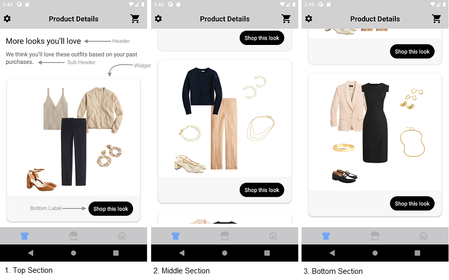
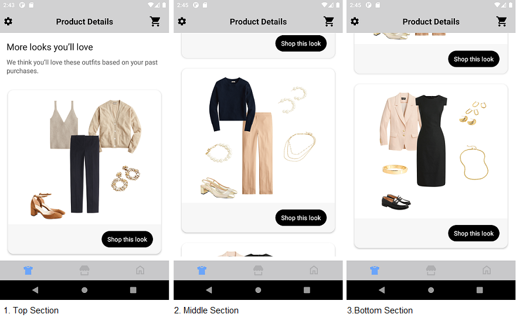
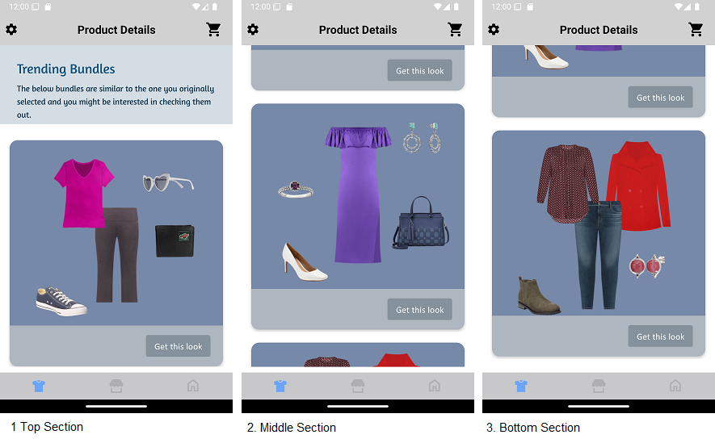
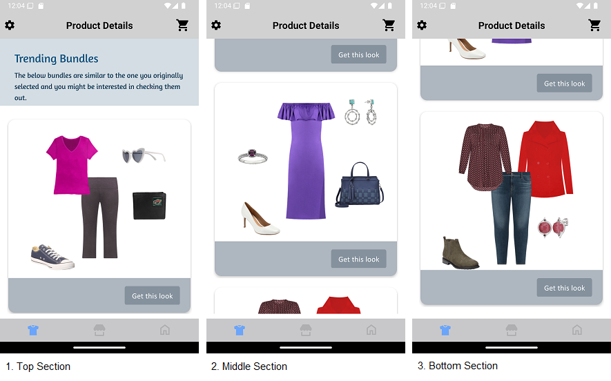

# TRENDING BUNDLES WIDGET

It provides view to display Stylitics Trending Bundles data. It also handles invoking of widget tracking events based on user interaction with these views.

Below are the features for Trending Bundles Widget.</br>

* Configure all the UI elements for Trending Bundles Widget
* Handles tracking events so Integrator App does not have to do it
* Provides listeners to Integrator App so they can handle the events (if needed) based on user interaction.
* Configure whether to display Trending Bundle Items directly from SDK or not
* When Bundle Items are configured to display from SDK, Integrator App can provide configs for it.


## Configurations:



### Header

| Fields                         | Description                                                                                                        | Default Value                                                     |
|--------------------------------|--------------------------------------------------------------------------------------------------------------------|-------------------------------------------------------------------|
| `backgroundColor`              | to set the background color to the header of the widget                                                            | `#FFFFFF`                                                         |           
| `paddingVertical`              | is top spacing for the content inside header, accepts float value and internally it is converted to dp             | `35f`                                                             |           
| `paddingHorizontal`            | is left and right spacing of the header view, accepts float value and internally it is converted to dp             | `16f`                                                             |
| `headerText`                   | is to set text for the header                                                                                      | `More looks you’ll love`                                          |
| `headerFontColor`              | is header text color and is accessed from color.xml resource file                                                  | `#212121`                                                         |
| `headerFontFamilyAndWeight`    | is the header font style with the font weight and is accessed from the font resource folder                        | `R.font.roboto_regular`                                           |           
| `headerFontSize`               | is the header font size in float and internally it is converted into sp                                            | `22f`                                                             |           
| `headerLineHeight`             | to set the vertical space between lines of header text, accepts float value and internally it is converted to dp   | `2f`                                                              |
| `subHeaderText`                | is to set text for the sub header                                                                                  | `We think you’ll love these outfits based on your past purchases` |
| `subHeaderFontColor`           | is sub header text color and is accessed from color.xml resource file                                              | `#666666`                                                         |
| `subHeaderFontFamilyAndWeight` | is the sub title font style with the font weight and is accessed from the font resource folder                     | `R.font.roboto_regular`                                           |
| `subHeaderFontSize`            | is the sub title font size in float and internally it is converted into sp                                         | `16f`                                                             |
| `subHeaderLineHeight`          | to set the height to the header text, accepts float value and internally it is converted to dp                     | `2f`                                                              |

### Widget

| Fields               | Description                                                                                                        | Default Value |
|----------------------|--------------------------------------------------------------------------------------------------------------------|---------------|
| `backgroundColor`    | is widget background color and is accessed from color.xml resource file                                            | `#FFFFFF`     |
| `cornerRadius`       | is border corner radius and is accessed from *_**corner radius**_* in drawable resource file                       | `14f`         |  
| `paddingVertical`    | is the left and right margin to the lists of bundles and is accessed as float and internally it is converted to dp | `16f`         |  
| `paddingHorizontal`  | is the bottom spacing to the widget and is accessed as float and internally it is converted to dp                  | `16f`         |

### Bottom Label

| Fields                 | Description                                                                                                              | Default Value                         | 
|------------------------|--------------------------------------------------------------------------------------------------------------------------|---------------------------------------|
| `ctaTitle`             | to set the title of the label                                                                                            | `Shop this look`                      |            
| `fontFamilyAndWeight`  | is the label font style with the font weight and is accessed from the font resource folder                               | `R.font.roboto_medium`                |            
| `fontSize`             | is the label font size in float and internally it is converted into sp                                                   | `14f`                                 |
| `fontColor`            | is label text color and is accessed from color.xml resource file                                                         | `#FFFFFF`                             | 
| `backgroundColor`      | is widget footer background color and is accessed from color.xml resource file                                           | `#F7F7F7`                             | 
| `ctaBackgroundColor`   | is label background color and is accessed from *_**solid color**_* in drawable resource file                             | `R.drawable.shop_this_look_background` | 
| `paddingVertical`      | is top and bottom spacing for the content inside widget footer, accepts float value and internally it is converted to dp | `16f`                                 |            
| `paddingHorizontal`    | is left and right spacing for the content inside widget footer, accepts float value and internally it is converted to dp | `20f`                                 |            
| `ctaPaddingVertical`   | is top and bottom spacing for the label's content, accepts float value and internally it is converted to dp              | `7f`                                  |            
| `ctaPaddingHorizontal` | is left and right spacing for the label's content, accepts float value and internally it is converted to dp              | `14f`                                 |


In Android, Bottom label background is set using below XML code of drawable resource file, which contains configurations for the above parameters.

Drawable Resource File name : shop_this_look_background
```xml
<?xml version="1.0" encoding="utf-8"?>
<shape xmlns:android="http://schemas.android.com/apk/res/android">

  <corners android:radius="@dimen/size_100"/>
  <solid android:color="@android:color/black"/>
</shape>
```

*_**ctaBackgroundColor**_* is the configurable parameter to set cornerRadius and ctaBackgroundColor as shown below.

```kotlin
 ctaBackgroundColor = R.drawable.shop_this_look_background
```

[Click here](CODE_REFERENCE_README.md#Trending-Bundles-Widget-Configuration-Samples) to find code references for different configuration examples.

# Implement Exposed Listeners
Below are the list of Trending Bundles widget listeners exposed to the Integrator app. If Integrator wishes to implement their own product list screen they will have to provide the definition for widget `onOutfitClickCTA` listener.

1. `onOutfitView` -  On view event of Trending Outfit bundle, this listener will be invoked.
2. `onOutfitClick` - On click event of Trending Outfit bundle, this listener will be invoked.
3. `onOutfitClickCTA` - On click event of `Shop this look` cta in Trending Bundles widget, this listener will be invoked.

## Default Configurations:

* Below are the examples of Trending Bundles Widget when Integrator App chooses to use default UI configurations.</br>

* The Trending Bundles UI component can be implemented in below different ways.
    1. Product List enabled from SDK
    2. Product List disabled from SDK
    3. Configure Event Listeners
    

*_**XML**_*

```xml
<com.stylitics.ui.StyliticsUIApi 
        android:id="@+id/trendingBundlesRecyclerView"
        android:layout_width="match_parent"
        android:layout_height="wrap_content" />
```

*_**Kotlin**_*

### 1. Product List enabled from SDK:

When product list is enabled from UX SDK and Integrator App does not provide configurations, it will take default configurations from SDK.

```kotlin
val rvTrendingBundles = findViewById<StyliticsUIApi>(R.id.rvTrendingBundles)

private fun widgetWithProductListFromUXSDK(trendingBundles: TrendingBundles) {
  rvTrendingBundles?.load(
    trendingBundles
  )
}
```

### 2. Product List disabled from SDK:

```kotlin
val rvTrendingBundles = findViewById<StyliticsUIApi>(R.id.rvTrendingBundles)

fun widgetWhenProductListFromIntegrator(trendingBundles: TrendingBundles) {
    rvTrendingBundles?.load(
        trendingBundles,
        TrendingBundlesInfo(
            listener = TrendingBundlesListener(
                onOutfitClickCTA = {
                     context?.showGalleryProductList(it.outfitBundle)
                }
            )
        ),
    displayProductListFromSDK = false
  )
}
```

### 3. Configure Event Listeners:

```kotlin
val rvTrendingBundles = findViewById<StyliticsUIApi>(R.id.rvTrendingBundles)

fun widgetWithListenersConfigured(trendingBundles: TrendingBundles) {
  rvTrendingBundles?.load(
    trendingBundles,
    TrendingBundlesInfo(
      listener = TrendingBundlesListener(
        onOutfitView = { outfitBundleInfo ->
          Log.i("TrendingBundlesEvent", "onView. $outfitBundleInfo")
        },
        onOutfitClick = { outfitBundleInfo ->
          Log.i("TrendingBundlesEvent", "onClick. $outfitBundleInfo")
        },
        onOutfitClickCTA = { outfitBundleInfo ->
          Log.i("TrendingBundlesEvent", "onOutfitClickCTA $outfitBundleInfo")
        }
      )
    )
  )
}
```


### Default Trending Bundles Screen

* Below is the Trending Bundles Widget screenshot when Sample Integrator App uses the above configurations.

</br></br>

## Custom Configurations:

* Integrator App can customise some or all configurations & implement listeners.
* Below are the examples of Trending Bundles Widget when Sample Integrator App customises configurations.

### 1. With all configurations & Listeners:

```kotlin
val rvTrendingBundles = findViewById<StyliticsUIApi>(R.id.rvTrendingBundles)

fun widgetWithAllCustomConfigurations(trendingBundles: TrendingBundles) {
  rvTrendingBundles?.load(
    trendingBundles,
    TrendingBundlesInfo(
      TrendingBundlesConfig(
        header = TrendingBundlesConfig.Header(
          backgroundColor = R.color.trending_bundles_header_background_color,
          paddingVertical = 30f,
          paddingHorizontal = 30f,
          headerText = "Trending Bundles",
          headerFontColor = R.color.trending_bundles_header_font_color,
          headerFontFamilyAndWeight = R.font.amaranth,
          headerFontSize = 24f,
          headerLineHeight = 5f,
          subHeaderText = "The below bundles are similar to the one you originally selected and you might be interested in checking them out.",
          subHeaderFontColor = R.color.trending_bundles_header_sub_header_font_color,
          subHeaderFontFamilyAndWeight = R.font.amaranth,
          subHeaderFontSize = 15f,
          subHeaderLineHeight = 5f
        ),
        widget = TrendingBundlesConfig.Widget(
          backgroundColor = R.color.trending_bundles_widget_background_color,
          paddingVertical = 14f,
          paddingHorizontal = 14f
        ),
        bottomLabel = TrendingBundlesConfig.BottomLabel(
          ctaTitle = "Get this look",
          fontFamilyAndWeight = R.font.calibri,
          fontSize = 16f,
          fontColor = R.color.trending_bundles_bottom_label_font_color,
          backgroundColor = R.color.trending_bundles_bottom_label_background_color,
          ctaBackgroundColor = R.drawable.custom_shop_this_look_background_for_trending_bundles,
          paddingVertical = 17f,
          paddingHorizontal = 22f,
          ctaPaddingVertical = 6f,
          ctaPaddingHorizontal = 15f
        )
      )
    )
  )
}        
```


* Below is the Trending Bundles Widget screenshot when Sample Integrator App uses the above configurations.

</br>

### 2. With some custom configurations & Listeners:

If Integrator App provides only few configurations, UX SDK will take default configurations for missing fields.

```kotlin
val rvTrendingBundles = findViewById<StyliticsUIApi>(R.id.rvTrendingBundles)

fun widgetWithSomeCustomConfigurations(trendingBundles: TrendingBundles) {
  rvTrendingBundles?.load(
    trendingBundles,
    TrendingBundlesInfo(
      config = TrendingBundlesConfig(
        header = TrendingBundlesConfig.Header(
          backgroundColor = R.color.trending_bundles_header_background_color,
          headerText = "Trending Bundles",
          headerFontColor = R.color.trending_bundles_header_font_color,
          subHeaderText = "The below bundles are similar to the one you originally selected and you might be interested in checking them out.",
          subHeaderFontColor = R.color.trending_bundles_header_sub_header_font_color,
        ),
        bottomLabel = TrendingBundlesConfig.BottomLabel(
          ctaTitle = "Get this look",
          fontColor = R.color.trending_bundles_bottom_label_font_color,
          backgroundColor = R.color.trending_bundles_bottom_label_background_color,
          ctaBackgroundColor = R.drawable.custom_shop_this_look_background_for_trending_bundles,
          ctaPaddingVertical = 6f,
          ctaPaddingHorizontal = 15f
        )
      )
    )
  )
}        
```

* Below is the Trending Bundles Widget screenshot when Sample Integrator App uses the above configurations.

</br>


## Refresh Trending Bundles Widget

**Overview**

The `refreshTrendingBundlesTemplate` method can be used to update the Trending Bundles widget data or its configurations or both.

**Example**

```Kotlin
fun refreshTrendingBundlesTemplate(trendingBundles: TrendingBundles? = null, widgetConfig: IWidgetConfig? = null)
```

**Parameters**

- `trendingBundles`: Optional parameter to provide updated TrendingBundles data.
- `widgetConfig`: Optional parameter to provide updated configurations for Trending Bundles template.

**Usage**

Call the method on the view with optional data/config.

- Get the Trending Bundles Widget Template id
```Kotlin
val rvTrendingBundles = findViewById<StyliticsUIApi>(R.id.rvTrendingBundles)
//Load TrendingBundles Widget Template
rvTrendingBundles.load(trendingBundles)
```

- To refresh the Trending Bundles Widget Template with new TrendingBundles data
```Kotlin
rvTrendingBundles.refreshTemplate(newTrendingBundles = trendingBundles)
```
- To refresh the Trending Bundles Widget Template with new config
```Kotlin
rvTrendingBundles.refreshTemplate(widgetConfig = newConfig)
```
- To refresh the Trending Bundles Widget Template with both new TrendingBundles data and config
```Kotlin
rvTrendingBundles.refreshTemplate(newTrendingBundles, newConfig)
```

## License

Copyright © 2023 Stylitics