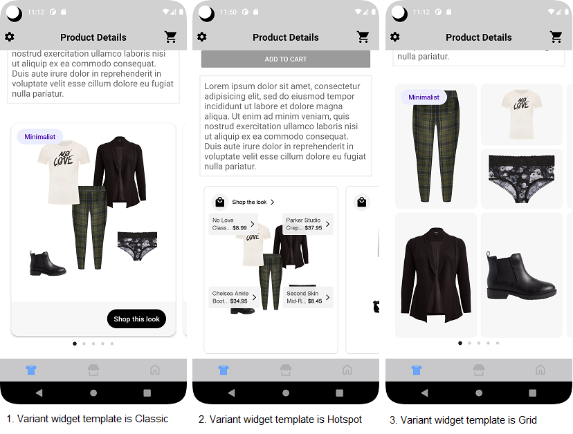
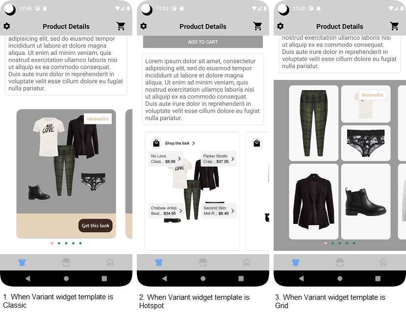
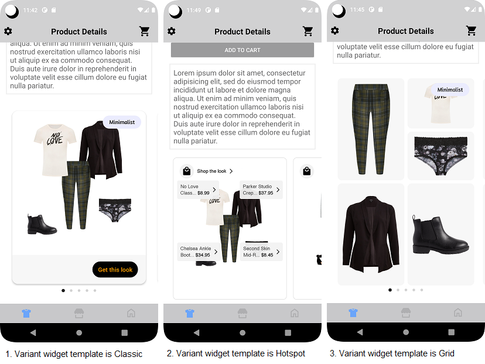

# VARIANT WIDGET

It provides view to display Stylitics data. It also handles invoking of Widget tracking events based on user interaction with these views.

Below are the features for Variant Widget.</br>

* Configure all the UI elements for each Outfit
* Handles Outfit `View` and `Click` tracking events so Integrator App does not have to do it
* Provides listeners to Integrator App so they can handle the Outfit View and Click events
* Configure whether to display Outfit Items directly from SDK or not
    * When Outfit Items are configured to display from SDK, Integrator App can provide configs for it along with Variant Widget configs

## Configurations:

### Widget

| Fields            | Description                                                                                                     | Default Value  |
|-------------------|-----------------------------------------------------------------------------------------------------------------|----------------|
| `cornerRadius`    | is the border corner radius and is accessed as float and internally it is converted to dp                       | `14f`          |
| `backgroundColor` | is the widget background color and is accessed from color.xml resource file                                     | `#FFFFFF`      |
| `cardGutter`      | is the space between two OutfitBundle cards and is accessed as float and internally it is converted to dp       | `12f`          |
| `cardPeek`        | is the previous and next OutfitBundle card peek and is accessed as float and internally it is converted to dp   | `16f`          |  

### Top Label

UX SDK provides various Label styles for the Top Label. [Click here](LABELS_README.md) to learn more about it.

### Bottom Label

| Fields                 | Description                                                                                                              | Default Value                          | 
|------------------------|--------------------------------------------------------------------------------------------------------------------------|----------------------------------------|
| `ctaTitle`             | to set the title of the label                                                                                            | `Shop this look`                       |            
| `fontFamilyAndWeight`  | is the label font style with the font weight and is accessed from the font resource folder                               | `R.font.roboto_medium`                 |            
| `fontSize`             | is the label font size in float and internally it is converted into sp                                                   | `15f`                                  |
| `fontColor`            | is label text color and is accessed from color.xml resource file                                                         | `#FFFFFF`                              | 
| `backgroundColor`      | is widget footer background color and is accessed from color.xml resource file                                           | `#F7F7F7`                              | 
| `ctaBackgroundColor`   | is label background color and is accessed from *_**solid color**_* in drawable resource file                             | `R.drawable.shop_this_look_background` | 
| `paddingVertical`      | is top and bottom spacing for the content inside widget footer, accepts float value and internally it is converted to dp | `16f`                                  |            
| `paddingHorizontal`    | is left and right spacing for the content inside widget footer, accepts float value and internally it is converted to dp | `20f`                                  |            
| `ctaPaddingVertical`   | is top and bottom spacing for the label's content, accepts float value and internally it is converted to dp              | `7f`                                   |            
| `ctaPaddingHorizontal` | is left and right spacing for the label's content, accepts float value and internally it is converted to dp              | `14f`                                  |

In Android, Bottom label background is set using below XML code of drawable resource file, which contains configurations for the above parameters.

Drawable Resource File name : shop_this_look_background
```xml
<?xml version="1.0" encoding="utf-8"?>
<shape xmlns:android="http://schemas.android.com/apk/res/android">

  <corners android:radius="@dimen/size_100"/>
  <solid android:color="@android:color/black"/>
</shape>
```

*_**ctaBackgroundColor**_* is the configurable parameter to set cornerRadius and ctaBackgroundColor as shown below.

```kotlin
 ctaBackgroundColor = R.drawable.shop_this_look_background
```


### Bullet

| Fields               | Description                                                                                                    | Default Value | 
|----------------------|----------------------------------------------------------------------------------------------------------------|---------------|
| `unselectedColor`    | is color of unselected bullet and is accessed from color.xml resource file                                     | `#D3D3D3`     | 
| `selectedColor`      | is color of selected bullet and is accessed from color.xml resource file                                       | `#212121`     | 
| `paddingVertical`    | is top and bottom spacing of the page indicator view in float and internally it is converted to dp             | `10f`         |             
| `paddingHorizontal`  | is spacing between two adjacent bullets of page indicator view in float and internally it is converted to dp   | `8f`          |             

### Top Label Position

| Fields              | Description                                                  | Default Value |
|---------------------|--------------------------------------------------------------|---------------|
| `topLabelPosition`  | is to change the top label position to top left or top right | `TOP.LEFT`    |

[Click here](CODE_REFERENCE_README.md#Variant-Widget-Configuration-Samples) to find code references for different configuration examples.

## Implement Exposed Listeners
Below are the list of Variant Widget listeners exposed to the Integrator app. If integrator wishes to implement their own product list screen they will have to provide the definition for widget `onClick` listener.

1. `onClick` - On click event of widget, this listener will be triggered.
2. `onView` - On view event of Outfit, this listener will be triggered.
3. `onOutfitItemClick` - On outfit item label click in Hotspot widget as apart of Variant Widget, this listener will be triggered.

## Default Configurations:

* Variant Widget supports Classic, Hotspot and Grid templates. Classic is the default template. Below are the examples of Variant Widget when Integrator App chooses to use default UI configurations.</br>

* The Variant Widget UI component can be implemented in below different ways.
    1. Product List enabled from SDK
    2. Product List disabled from SDK
    3. Configure Event Listeners

* Variant Widget supports `WRAP_CONTENT` as a height.


*_**XML**_*

```xml
<com.stylitics.ui.StyliticsUIApi 
        android:id="@+id/outfitsRecyclerView"
        android:layout_width="match_parent"
        android:layout_height="wrap_content"/>
```

*_**Kotlin**_*

### 1. Product List enabled from SDK:

#### Without Default Template Configuration 

When product list is enabled from UX SDK and Integrator App does not provide configurations, it will take default configurations from SDK.

```kotlin
val outfitsRecyclerView = findViewById<StyliticsUIApi>(R.id.outfitsRecyclerView)

fun widgetWithoutDefaultConfiguration(outfits: Outfits) {
  outfitsRecyclerView?.load(
    outfits, VariantWidgetInfo()
  )
}
```

#### With Default Template Configuration 

```kotlin
val outfitsRecyclerView = findViewById<StyliticsUIApi>(R.id.outfitsRecyclerView)

fun widgetWithoutDefaultConfiguration(outfits: Outfits) {
  outfitsRecyclerView?.load(
    outfits, VariantWidgetInfo(), VariantWidgetTemplate.GRID_WIDGET
  )
}
```

### 2. Product List disabled from SDK:

#### Without Default Template Configuration

```kotlin
val outfitsRecyclerView = findViewById<StyliticsUIApi>(R.id.outfitsRecyclerView)

fun widgetWhenProductListFromIntegrator(outfits: Outfits) {
  outfitsRecyclerView?.load(
    outfits,
    VariantWidgetInfo(
      variantWidgetListener = VariantWidgetListener(
        onClick = { outfitBundleInfo ->
          Log.i("VariantWidgetEvent", "Outfit click event triggered. $outfitBundleInfo")
          context?.showProductList(outfitBundleInfo.outfitBundle)
        }
      )),
    displayProductListFromSDK = false
  )
}
```

#### With Default Template Configuration

```kotlin
val outfitsRecyclerView = findViewById<StyliticsUIApi>(R.id.outfitsRecyclerView)

fun widgetWhenProductListFromIntegrator(outfits: Outfits) {
  outfitsRecyclerView?.load(
    outfits,
    defaultVariantWidgetTemplate = VariantWidgetTemplate.HOTSPOT_WIDGET,
    variantWidgetInfo = VariantWidgetInfo(
      variantWidgetListener = VariantWidgetListener(
        onClick = { outfitBundleInfo ->
          Log.i("VariantWidgetEvent", "Outfit click event triggered. $outfitBundleInfo")
          context?.showProductList(outfitBundleInfo.outfitBundle)
        }
      )),
    displayProductListFromSDK = false
  )
}
```

### 3. Configure Event Listeners:

```kotlin
val outfitsRecyclerView = findViewById<StyliticsUIApi>(R.id.outfitsRecyclerView)

private fun widgetWithListenersConfigured(outfits: Outfits) {
  outfitsRecyclerView?.load(
    outfits,
    VariantWidgetInfo(
      variantWidgetListener = VariantWidgetListener(
        onView = { outfitBundleInfo ->
          Log.i("VariantWidgetEvent", "Outfit View event triggered. $outfitBundleInfo")
        },
        onClick = { outfitBundleInfo ->
          Log.i("VariantWidgetEvent", "Outfit click event triggered. $outfitBundleInfo")
          context?.showProductList(outfitBundleInfo.outfitBundle)
        },
        onOutfitItemClick = { outfitBundleInfo, outfitBundleItemInfo ->
          Log.i("VariantWidgetEvent", "Outfit item click event triggered. ${outfitBundleInfo.outfitBundle.id}, ${outfitBundleItemInfo.outfitBundleItem.itemId} ")
        }
      )
    )
  )
}
```

### Default Variant Widget Screens

* Below is the Variant Widget screenshot when Sample Integrator App uses the above configurations.

</br></br>

## Custom Configurations:

* Integrator App can customise some or all configurations & implement listeners.
* Below are the examples of Variant Widget when Sample Integrator App customises configurations.

### 1. With all configurations & Listeners:

```kotlin
val outfitsRecyclerView = findViewById<StyliticsUIApi>(R.id.outfitsRecyclerView)

fun widgetWithAllCustomConfigurations(outfits: Outfits) {
  outfitsRecyclerView?.load(
    outfits,
    defaultVariantWidgetTemplate = VariantWidgetTemplate.GRID_WIDGET,
    variantWidgetInfo = VariantWidgetInfo(
      variantWidgetConfig = VariantWidgetConfig(
        widget = VariantWidgetConfig.Widget(
          backgroundColor = R.color.variant_widget_background_color,
          cornerRadius = 15f,
          cardGutter = 30,
          cardPeek = 35f
        ),
        topLabel = TopLabel(
          label5 = TopLabel.Label5(
            fontFamilyAndWeight = R.font.amaranth,
            fontSize = 14f,
            fontColor = R.color.top_label_font_color,
            paddingVertical = 8f,
            paddingHorizontal = 10f,
            background = R.drawable.top_label_border
          )
        ),
        bottomLabel = VariantWidgetConfig.BottomLabel(
          ctaTitle = "Get this look",
          fontFamilyAndWeight = R.font.amaranth,
          fontSize = 15f,
          fontColor = R.color.variant_widget_bottom_label_text_color,
          backgroundColor = R.color.beige,
          ctaBackgroundColor = R.drawable.variant_widget_bottom_background,
          paddingVertical = 2f,
          paddingHorizontal = 10f,
          ctaPaddingVertical = 10f,
          ctaPaddingHorizontal = 10f
        ),
        bullet = VariantWidgetConfig.Bullet(
          unselectedColor = R.color.variant_widget_bullet_unselected_color,
          selectedColor = R.color.card_back_color,
          paddingVertical = 10f,
          paddingHorizontal = 9f
        ),
        topLabelPosition = TopLabelPosition.TOP_RIGHT
      ),
      variantWidgetListener = VariantWidgetListener(
        onView = { outfitBundleInfo ->
          Log.i("VariantWidgetEvent", "Outfit View event triggered. $outfitBundleInfo")
        },
        onClick = { outfitBundleInfo ->
          Log.i("VariantWidgetEvent", "Outfit click event triggered. $outfitBundleInfo")
        },
        onOutfitItemClick = { outfitBundleInfo, outfitBundleItemInfo ->
          Log.i("VariantWidgetEvent", "Outfit item click event triggered. ${outfitBundleInfo.outfitBundle.id}, ${outfitBundleItemInfo.outfitBundleItem.itemId} ")
        }
      )
    )
  )
}
```


* Below is the Variant Widget screenshot when Sample Integrator App uses the above configurations.

</br>

### 2. With some custom configurations & Listeners:

If Sample Integrator App provides only few configurations, UX SDK will take default configurations for missing fields.

```kotlin
val outfitsRecyclerView = findViewById<StyliticsUIApi>(R.id.outfitsRecyclerView)

fun widgetWithSomeCustomConfigurations(outfits: Outfits) {
  outfitsRecyclerView?.load(
    outfits,
    variantWidgetInfo = VariantWidgetInfo(
      variantWidgetConfig = VariantWidgetConfig(
        widget = VariantWidgetConfig.Widget(
          cornerRadius = 15f,
          cardGutter = 30,
        ),
        topLabel = TopLabel(
          label5 = TopLabel.Label5(
            fontFamilyAndWeight = R.font.amaranth,
            fontSize = 14f,
            fontColor = R.color.black,
          )
        ),
        bottomLabel = VariantWidgetConfig.BottomLabel(
          ctaTitle = "Get this look",
          fontColor = R.color.dark_yellow,
        ),
        topLabelPosition = TopLabelPosition.TOP_RIGHT
      ),
      variantWidgetListener = VariantWidgetListener(
        onClick = { outfitBundleInfo ->
          Log.i("VariantWidgetEvent", "Outfit click event triggered. $outfitBundleInfo")
        }
      )
    ),
    defaultVariantWidgetTemplate = VariantWidgetTemplate.GRID_WIDGET
  )
}        
```

* Below is the Variant Widget screenshot when Sample Integrator App uses the above configurations.

</br>

## Refresh Variant Widget

**Overview**

The `refreshTemplate` method can be used to update the Variant Widget data or its configurations or both.

**Example**

```Kotlin
fun refreshTemplate(outfits: Outfits? = null, widgetConfig: IWidgetConfig? = null)
```

**Parameters**

- `outfits`: Optional parameter to provide updated Outfits data.
- `widgetConfig`: Optional parameter to provide updated configurations for Variant Widget template.

**Usage**

Call the method on the view with optional data/config.

- Get the Variant Widget Template id
```Kotlin
val outfitsRecyclerView = findViewById<StyliticsUIApi>(R.id.outfitsRecyclerView)
//Load Variant Widget Template
outfitsRecyclerView?.load(outfits, VariantWidgetInfo())
```

- To refresh the Variant Widget Template with new Outfit data
```Kotlin
outfitsRecyclerView.refreshTemplate(outfits = newOutfits)
```
- To refresh the Variant Widget Template with new config
```Kotlin
outfitsRecyclerView.refreshTemplate(widgetConfig = newConfig)
```
- To refresh the Variant Widget Template with both new Outfit data and config
```Kotlin
outfitsRecyclerView.refreshTemplate(newOutfits, newConfig)
```

## License

Copyright © 2023 Stylitics