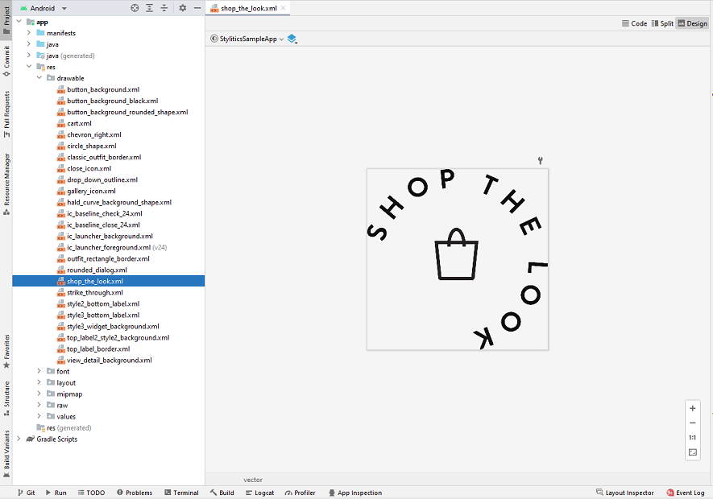

# Stylitics Sample Integrator App Code Reference 

This document provides references for implementation details by Sample Integrator App screen.

## Configure Username and Environment

Below are the implementation details for Username and Environment configurations screen

* **UserAccountsActivity.kt** This activity has all the implementations to display the available usernames and based on the user selection it proceeds to the user, client and environment configuration.
* **UserAccountsViewModel.kt** This class handles business logic behind first screen using below methods.
     1. **configureSDK()** - This performs the required data configurations


## StyliticsUI Screen

* **ItemsActivity.kt** This class has an implementation for the Tab Layout that holds the three tabs. 
* First two tabs are responsible for holding the Grid screen, Product detail screen and custom Product List(If default Product List from UX SDK is disabled.) 
* Third tab is responsible for holding Styled For You screen, Outfit Landing Page screen, StyledForYou Full Page screen and custom gallery product list(If default gallery Product List from UX SDK is disabled.)

### Show Product Items(Grid Screen)

Below are the implementation details for Show Product Items(Grid screen) screen

* **ItemsFragment.kt** This class is responsible for displaying the Sample Product items.

### PDP Screen

Below are the implementation details for Product details page.

* **OutfitsViewModel.kt** This class fetches Stylitics Data from the server using Data SDK. It has below methods implemented.
     1. **`outfits(itemNumber: String = "1234567890")`** This makes the Outfits API call using item number.
     2. **`success(outfits: Outfits)`** This saves the success response for the Outfits API call.
     3. **`dynamicGalleryData()`** This makes the Dynamic Gallery API call using a map of parameters.
     4. **`success(bundles: GalleryBundles)`** This saves the success response for the Dynamic Gallery API call.

* **ShopTheSetViewModel.kt** This class fetches Stylitics Shop the Set Data from the server using Data SDK. It has below methods implemented.
     1. **`shopTheSet()`** This makes the Shop the Set Api call using required filter patameters.
     2. **`success(shopTheSet: ShopTheSet)`** This saves the success response for the Shop the Set API call

* **ProductDetailPageFragment.kt** Based on template selection in settings screen This class is responsible for displaying the product details and its related widgets using sample methods defined in the template based classes.
     1. **`displayOutfits()`** This makes call to the sample code to display required Views.
 
* **ProductDetailPageViewModel.kt** This class handles business logic for Product Detail screen.
     1. **`trackJumplinkClickedEvent()`** Invokes the `jumplinkclicked` tracking event.

* **fragment_product_detail_page.xml** This is the XML file which holds the UI components to be displayed on the screen.

### Styled For You Screen
Below are the implementation details for Styled For You page.

* **StyledForYouViewModel.kt** This class fetches Stylitics StyledForYou Data from the server using Data SDK. It has below methods implemented.
  1. **`styledForYouData()`** This makes the Styled For You Api call using required filter parameters.
  2. **`success(styledForYou: StyledForYou)`** This saves the success response for the Styled For You API call.

* **StyledForYouFragment.kt** This class is responsible for displaying the Styled For You widget using sample methods defined in the template based classes.
  1. **`displayStyledForYou()`** This makes call to the sample code to display required Views.

* **fragment_styled_for_you.xml** This is the XML file which holds the UI components to be displayed on the screen.

### Outfit Landing Page(OLP)

Below are the implementation details for OLP page. 

* **OutfitLandingPageViewModel.kt** This class fetches Stylitics OutfitLandingPage Data from the server using Data SDK. It has below methods implemented.
  1. **`outfitLandingPageData`** This makes the OLP Api call using required filter parameters.
  2. **`success(outfitLandingPage: OutfitLandingPage)`** This saves the success response for the OLP API call.
  3. **`configs()`** Depending on the input for custom config switch in settings screen, this method returns either the custom or default configurations.

* **OutfitLandingPageFragment.kt** This class is responsible for displaying the OLP widget using sample methods defined in the template based classes.
  1. **`displayOutfitLandingPage()`** This makes call to the sample code to display required Views.
  3. **`refreshWidgetWhenLocaleChanged()`** This method calls refreshOLPTemplate() to update the OLP widget with the new OutfitLandingPage data.
  4. **`refreshWidgetWhenConfigChanged()`** This method calls refreshOLPTemplate() to update the OLP widget with the new custom UI configurations.
  5. **`onConfigurationChanged`** This method handles UI configurations based on the Light and Dark mode UI changes. 

* **fragment_outfit_landing_page.xml** This is the XML file which holds the UI components to be displayed on the screen.

### Styled For You Full Page

Below are the implementation details for Styled For You Full Page.

* **StyledForYouFullPageViewModel.kt** This class fetches Stylitics StyledForYouFullPage Data from the server using Data SDK. It has below methods implemented.
  1. **`styledForYouFullPage()`** This makes the StyledForYouFullPage Api call using required filter parameters.
  3. **`configs()`** Depending on the input for custom config switch in settings screen, this method returns either the custom or default configurations.

* **StyledForYouFullPageFragment.kt** This class is responsible for displaying the StyledForYouFullPage widget using sample methods defined in the template based classes.
  1. **`requestStyledForYouFullPage()`** This initiates the Api call method implemented in StyledForYouFullPageViewModel.kt.
  2. **`displayStyledForYouFullPage()`** This makes call to the sample code to display required Views.
  3. **`refreshWidgetWhenDataChanged()`** This method calls refreshSyfyFullPageTemplate() to update the StyledForYouFullPage widget with the new StyledForYouFullPage data.
  4. **`refreshWidgetWhenConfigChanged()`** This method calls refreshSyfyFullPageTemplate() to update the StyledForYouFullPage widget with the new custom UI configurations.
  5. **`onConfigurationChanged(newConfig: Configuration)`** This method handles UI configurations based on the Light and Dark mode UI changes.

### Trending Bundles 

* **TrendingBundlesViewModel.kt** This class fetches Stylitics TrendingBundles Data from the server using Data SDK. It has below methods implemented.
  1. **`trendingBundles()`** This makes the TrendingBundles Api call using required filter parameters.
  2. **`success(trendingBundles: TrendingBundles)`** This saves the success response for the API call.
  3. **`networkError(throwable: Throwable)`** this handles the network error response for the Api call.
  4. **`apiError(error: String)`** this method handles the api error response for the Api call.

### Upsell Items

* **UpsellsViewModel.kt** This class fetches Stylitics Upsell Items Data from the server using Data SDK. It has below methods implemented.
  1. **`upsells()`** This makes the Upsell Items Api call using required filter parameters.
  2. **`success(upsellItems: UpsellItems)`** This saves the success response for the API call.
  3. **`networkError(throwable: Throwable)`** this handles the network error response for the Api call.
  4. **`apiError(error: String)`** this method handles the api error response for the Api call.
  
### Show Product Items for Outfit Items

* **OutfitItemsFragment** This is the fragment to display Product List and implements the click listener. This implementation is invoked when Product List screen from UX SDK is disabled.
  1. **`displayOutfitItems()`** This method loads the Product List view implemented in the UX SDK.

* **ItemFragmentViewModel** This class handles business logic for Product List screen.

### Show Product Items for Dynamic Gallery Bundle Items

* **DynamicGalleryProductListFragment.kt** This is the fragment to display Dynamic Gallery Product List and implements the click listener. This implementation is invoked when Dynamic Gallery Product List screen from UX SDK is disabled.
  1. **`displayGalleryBundleItems(containerView: View)`** This method loads the Dynamic Gallery Product List view implemented in the UX SDK.

* **DynamicProductListFragmentViewModel.kt** This class handles business logic for Dynamic Gallery Product List screen

## Cart Screen

Below are the implementation details for Cart page.

* **CartViewModel.kt** This class Handles the business logic for Cart screen.
  1. **`fun cartItems()`** Retrieves the list of cart items from the local storage.
  2. **`fun trackPurchases()`** Invokes the 'purchase' tracking event.

* **CartActivity.kt** This class is responsible for displaying the item added by user to the Cart.
  1. **`fun updateViews()`** This has implementation to update the views and based on user input it initiates the purchase operations.
  2. **`fun updateScreenViews()`** This manages the Empty Cart view's visibility.


## Classic Widget Configuration Samples

* **ClassicWidgetConfigSamples.kt** class has code samples for various custom configurations for Classic template. 

## Hotspot Widget Configuration Samples

* **HotspotWidgetConfigSamples.kt** class has code samples for various custom configurations for Hotspot template.

## Grid Widget Configuration Samples

* **GridWidgetConfigSamples.kt** class has code samples for various custom configurations for Grid template.

## Standard Product List View Configuration Samples

* **ProductListViewConfigSamples.kt** class has code samples for Product list view when called from Integrator App.

## Dynamic Gallery Widget Configuration Samples

* **DynamicGalleryWidgetConfigSamples.kt** class has code samples for various custom configurations for Dynamic Gallery Widget.

## OutfitBundle Product List View Configuration Samples

* **OutfitBundleProductListViewConfigSamples.kt** class has code samples for various custom configurations for OutfitBundle Product List view.

## Shop the Set Widget Configuration Samples

* **ShopTheSetWidgetConfigSamples.kt** class has code samples for various custom configurations for Shop the Set widget.

## Styled For You Widget Configuration Samples

* **StyledForYouWidgetConfigSamples.kt** class has code samples for various custom configurations for Styled For You widget.

## Outfit Landing Page(OLP) Widget Configuration Samples

* **OutfitLandingPageWidgetConfigurationSamples.kt** class has code samples for various custom configurations for OLP widget.

## StyledForYou Full Page Widget Configuration Samples

* **StyledForYouFullPageWidgetConfigurationSamples.kt**  class has code samples for various custom configurations for StyledForYouFullPage widget

## Trending Bundles Widget Configuration Samples

* **TrendingBundlesWidgetConfigSamples.kt** class has code samples for various custom configurations for Trending Bundles widget

## Upsell Items Widget Configuration Samples

* **UpsellsWidgetConfigSamples.kt** class has code samples for various custom configurations for Upsell Items widget

## Variant Widget Configuration Samples

* **VariantWidgetConfigSamples.kt** class has code samples for various custom configurations for Variant widget

## Classic - Shop The Model

Integrator app should add image for Shop The Model view in *_**Android resource drawable folder**_* as shown in below screenshot.

</br>

Shop The Model configuration for Classic widget can be done as below,

```kotlin
  shopTheModel = ShopTheModel(
    name = R.drawable.shop_the_look,
    position = ShopTheModelPosition.BOTTOM_LEFT,
    width = 80f,
    height = 80f
  )
```

**ClassicWidgetConfigSamples.kt** class has an example for Shop The Model configuration.

## Settings Screen

* **SettingsActivity.kt**  This class is responsible for showing application settings.

## Gallery Screen

Below are the implementation details for Gallery screen.

* **GalleryActivity.kt** This class is responsible for displaying the gallery items by fetching required data from the *_**GalleryViewModel.kt**_*. 

* **GalleryViewModel.kt** This class handles business logic for Gallery screen.

* **ConfigStyles** This class has sample style configurations for Outfit widget and Product list Templates.
    1. **`Style`**  - is the enum for set of styles
    2. **`fun getStyle(style: Style = Style.DEFAULT_STYLE): OutfitsTemplate`** This method returns the OutfitTemplate configs for the provided style.
    3. **`fun getStyle(style: Style = Style.DEFAULT_STYLE): ProductListTemplate`** This method returns the ProductListTemplate configs for the provided style. 

* **activity_gallery** This is the XML file which holds the UI components to be displayed on the Gallery screen.

## License

Copyright © 2023 Stylitics
