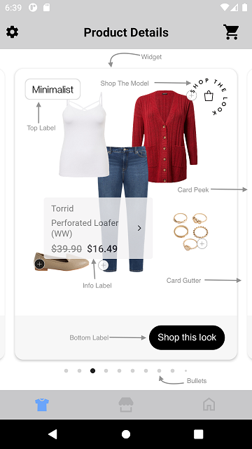

# HOTSPOT WIDGET

It provides view to display Stylitics data. It also handles invoking of Widget tracking events based on user interaction with these views.

Below are the features for Hotspot Outfit Widget.</br>

* Configure all the UI elements for each Outfit
* Handles Outfit `View` and `Click` tracking events so Integrator App does not have to do it
* Provides listeners to Integrator App so they can handle the Outfit View and Click events
* Configure whether to display Outfit Items directly from SDK or not
    * When Outfit Items are configured to display from SDK, Integrator App can provide configs for it along with Hotspot configs.

## Configurations:



### Widget

| Fields            | Description                                                                                                     | Default Value |
|-------------------|-----------------------------------------------------------------------------------------------------------------|---------------|
| `cornerRadius`    | is the border corner radius and is accessed as float and internally it is converted to dp                       | `14f`         |
| `backgroundColor` | is the widget background color and is accessed from color.xml resource file                                     | `#FFFFFF`     |
| `cardGutter`      | is the space between two OutfitBundle cards and is accessed as float and internally it is converted to dp       | `12`          |
| `cardPeek`        | is the previous and next OutfitBundle card peek and is accessed as float and internally it is converted to dp   | `16f`         |  

### Top Label

UX SDK provides various Label styles for the Top Label. [Click here](LABELS_README.md) to learn more about it.

### Bottom Label

| Fields                 | Description                                                                                                              | Default Value                           | 
|------------------------|--------------------------------------------------------------------------------------------------------------------------|-----------------------------------------|
| `ctaTitle`             | to set the title of the label                                                                                            | `Shop this look`                        |            
| `fontFamilyAndWeight`  | is the label font style with the font weight and is accessed from the font resource folder                               | `R.font.helvetica_neue_regular`         |            
| `fontSize`             | is the label font size in float and internally it is converted into sp                                                   | `15f`                                   |
| `fontColor`            | is label text color and is accessed from color.xml resource file                                                         | `#FFFFFF`                               | 
| `backgroundColor`      | is widget footer background color and is accessed from color.xml resource file                                           | `#F7F7F7`                               | 
| `ctaBackgroundColor`   | is label background color and is accessed from *_**solid color**_* in drawable resource file                             | `R.drawable.shop_this_look_background`  | 
| `paddingVertical`      | is top and bottom spacing for the content inside widget footer, accepts float value and internally it is converted to dp | `16f`                                   |            
| `paddingHorizontal`    | is left and right spacing for the content inside widget footer, accepts float value and internally it is converted to dp | `20f`                                   |            
| `ctaPaddingVertical`   | is top and bottom spacing for the label's content, accepts float value and internally it is converted to dp              | `7f`                                    |            
| `ctaPaddingHorizontal` | is left and right spacing for the label's content, accepts float value and internally it is converted to dp              | `14f`                                   |

In Android, Bottom label background is set using below XML code of drawable resource file, which contains configurations for the above parameters.

Drawable Resource File name : shop_this_look_background
```xml
<?xml version="1.0" encoding="utf-8"?>
<shape xmlns:android="http://schemas.android.com/apk/res/android">

  <corners android:radius="@dimen/size_100"/>
  <solid android:color="@android:color/black"/>
</shape>
```

*_**ctaBackgroundColor**_* is the configurable parameter to set cornerRadius and ctaBackgroundColor as shown below.

```kotlin
 ctaBackgroundColor = R.drawable.shop_this_look_background
```

### Shop The Model

| Fields      | Description                                                                                                                             | Default Value              |
|-------------|-----------------------------------------------------------------------------------------------------------------------------------------|----------------------------|
| `name`      | is the name of image (from Integrator resources) to be displayed for Shop the model badge and is accessed from drawable resource folder | None                       |
| `position`  | is to change the badge position to the Top or Bottom. 16dp is the default padding to this view.                                         | `ShopTheModelPosition.TOP` |
| `width`     | is the width of image view in float and internally it is converted to dp                                                                | `60f`                      |
| `height`    | is the height of image view in float and internally it is converted to dp                                                               | `60f`                      |

*Note:</br>1. If the "Shop The Model" position is set to ShopTheModelPosition.TOP, the "Shop The Model" view will be placed either to the Right or Left of the screen, depending on the position of the Top Label, in order to avoid any overlapping of views.</br>2. If the "Shop The Model" position is set to ShopTheModelPosition.BOTTOM, it will be positioned to the Left to prevent overlapping with the Bottom Label.*


### Bullet

| Fields               | Description                                                                                                    | Default Value | 
|----------------------|----------------------------------------------------------------------------------------------------------------|---------------|
| `unselectedColor`    | is color of unselected bullet and is accessed from color.xml resource file                                     | `#D3D3D3`     | 
| `selectedColor`      | is color of selected bullet and is accessed from color.xml resource file                                       | `#212121`     | 
| `paddingVertical`    | is top and bottom spacing of the page indicator view in float and internally it is converted to dp             | `10f`         |             
| `paddingHorizontal`  | is spacing between two adjacent bullets of page indicator view in float and internally it is converted to dp   | `8f`          |             

### Info Label

| Fields                        | Description                                                                                                       | Default Value             |
|-------------------------------|-------------------------------------------------------------------------------------------------------------------|---------------------------|
| `backgroundColor`             | is background color of label and is accessed from color.xml resource file                                         | `#F4F3F4`                 |
| `fontFamilyAndWeight`         | is the item name and brand name font style with the font weight and is accessed from the font resource folder     | `R.font.roboto_regular`   |
| `fontSize`                    | is the item name and brand name font size in float and internally it is converted into sp                         | `14f`                     |
| `fontColor`                   | is item name and brand name font color and is accessed from color.xml resource file                               | `#5B5B5B`                 |
| `cornerRadius`                | is border corner radius and is accessed from *_**corner radius**_* in float                                       | `4f`                      |
| `showArrow`                   | is to hide or show the arrow icon and is accessed boolean                                                         | `true`                    |
| `showBrand`                   | is to hide or show the item brand name and is accessed boolean                                                    | `true`                    |
| `dotBackgroundColor`          | is hotspot dot background color when unselected and is accessed from color.xml resource file                      | `#FFFFFF`                 |
| `dotBackgroundColorSelected`  | is hotspot dot background color when selected and is accessed from color.xml resource file                        | `#161616`                 |
| `paddingHorizontal`           | is left and right spacing for the label's content in float and internally it is converted to dp                   | `12f`                     |
| `paddingVertical`             | is top and bottom spacing for the label's content in float and internally it is converted to dp                   | `10f`                     |             
| `priceFontColor`              | to set item price text color which is accessed from color.xml resource file                                       | `#000000`                 |
| `priceFontFamilyAndWeight`    | is the price text font style with the font weight and is accessed from the font resource folder                   | `R.font.roboto_medium`    |            
| `priceFontSize`               | is price font size in float and internally it is converted into sp                                                | `16f`                     |            
| `salePriceFontColor`          | to set item sale price text color which is accessed from color.xml resource file                                  | `#1D1B20`                 |
| `strikeThroughPriceFontColor` | is strike through price text color which is accessed from color.xml resource file                                 | `#757575`                 | 
| `style`                       | to show or hide the Strike Through Price                                                                          | `PriceStrikeThrough.SHOW` |            
| `swapPricesPosition`          | is boolean value, when it is false it shows strike through price first and then sale price. Vice versa when true. | `false`                   |            

### Top Label Position

| Fields              | Description                                                  | Default Value                |
|---------------------|--------------------------------------------------------------|------------------------------|
| `topLabelPosition`  | is to change the top label position to top left or top right | `TopLabelPosition.TOP_LEFT`  |


[Click here](CODE_REFERENCE_README.md#Hotspot-Widget-Configuration-Samples) to find different configuration examples of hotspot widget.


## Implement Exposed Listeners
Below are the list of Hotspot Outfit widget listeners exposed to the Integrator app. If Integrator wishes to implement their own Product list screen they will have to provide the definition for widget `onClick` listener.

1. `onClick` - On click event of `Shop this look` CTA, this listener will be triggered.
2. `onView` - On view event of Outfit, this listener will be triggered.
3. `onOutfitItemClick` - On click event of `Info-label` in Outfit collage, this listener will be triggered.


## Default Configurations:

* Below are the examples of Hotspot Outfit Widget when Integrator App chooses to use default UI configurations.</br>

* The Hotspot Outfit UI component can be implemented in below different ways.
    1. Product List enabled from SDK
    2. Product List disabled from SDK
    3. Configure Event Listeners
    4. Shop The Model

* Hotspot Outfit Widget supports `WRAP_CONTENT` as a height.

*_**XML**_*

```xml
<com.stylitics.ui.StyliticsUIApi 
        android:id="@+id/outfitsRecyclerView"
        android:layout_width="match_parent"
        android:layout_height="wrap_content" />
```

*_**Kotlin**_*

### 1. Product List enabled from SDK:

When product list is enabled from UX SDK and Integrator App does not provide configurations, it will take default configurations from SDK.

```kotlin
val outfitsRecyclerView = findViewById<StyliticsUIApi>(R.id.outfitsRecyclerView)

private fun widgetWithProductListFromUXSDK(outfits: Outfits) {
    outfitsRecyclerView.load(
        outfits,
        OutfitsTemplate.Hotspot()
    )
}
```

### 2. Product List disabled from SDK:

```kotlin
val outfitsRecyclerView = findViewById<StyliticsUIApi>(R.id.outfitsRecyclerView)

fun widgetWhenProductListFromIntegrator(outfits: Outfits) {
  outfitsRecyclerView?.load(
    outfits,
    OutfitsTemplate.Hotspot(
      hotspotListener = HotspotListener(
        onClick = { outfitBundleInfo ->
          context?.showProductList(outfitBundleInfo.outfitBundle)
          //Invoke Product List Screen from Integrator here
        }
      )
    ),
    displayProductListFromSDK = false
    //ProductListViewConfigSamples.kt is the class for sample code to configure product list when displayed form Integrator App.
  )
}
```

### 3. Configure Event Listeners:

```kotlin
val outfitsRecyclerView = findViewById<StyliticsUIApi>(R.id.outfitsRecyclerView)

fun widgetWithListenersConfigured(outfits: Outfits) {
  outfitsRecyclerView?.load(
    outfits,
    OutfitsTemplate.Hotspot(
      hotspotListener = HotspotListener(
        onClick = { outfitBundleInfo ->
          Log.i("OutfitEvent", " Outfit click event triggered. ${outfitBundleInfo.outfitBundle.id}")
        },
        onView = { outfitBundleInfo ->
          Log.i("OutfitEvent", " Outfit view event triggered. ${outfitBundleInfo.outfitBundle.id}")
        },
        onOutfitItemClick = { outfitBundleInfo, outfitBundleItemInfo ->
          Log.i("OutfitEvent", " Outfit Item click event triggered. ${outfitBundleInfo.outfitBundle.id}")
        }
      )
    )
  )
}
```

### 4. Shop The Model:

If in the Outfits response, `on-model-image` flag is true & Integrator App provides a valid image for Shop The Model it will be displayed for the Outfit.

```kotlin
val outfitsRecyclerView = findViewById<StyliticsUIApi>(R.id.outfitsRecyclerView)

private fun widgetWithShopTheModel(outfits: Outfits) {
  outfitsRecyclerView?.load(
    outfits,
    OutfitsTemplate.Hotspot(
      hotspotConfig = HotspotConfig(
        shopTheModel = ShopTheModel(name = R.drawable.shop_the_look)
      )
    )
  )
}
```

### Default Hotspot Outfit Widget Screen

* Below is the Hotspot Outfit Widget screenshot when Sample Integrator App uses the above configurations.

</br></br>

## Custom Configurations:

* Integrator App can customise some or all configurations & implement listeners.
* Below are the examples of Hotspot Outfit Widget when Sample Integrator App customises configurations.

### 1. With all configurations & Listeners:

```kotlin
val outfitsRecyclerView = findViewById<StyliticsUIApi>(R.id.outfitsRecyclerView)

fun widgetWithAllCustomConfigurations(outfits: Outfits) {
  outfitsRecyclerView?.load(
    outfits, OutfitsTemplate.Hotspot(
      hotspotConfig = HotspotConfig(
        widget = HotspotConfig.Widget(
          cornerRadius = 30.0F,
          cardGutter = 35,
          cardPeek = 40.0F,
          backgroundColor = R.color.theme3_widget_background_color
        ),
        topLabel = TopLabel(
          label3 = TopLabel.Label3(
            fontFamilyAndWeight = R.font.amaranth,
            fontSize = 14f,
            fontColor = R.color.top_label_font_color,
            paddingVertical = 8f,
            paddingHorizontal = 10f,
            background = R.drawable.top_label_border
          )
        ),
        bottomLabel = HotspotConfig.BottomLabel(
          ctaTitle = "Get this look",
          fontFamilyAndWeight = R.font.calibri,
          fontColor = R.color.theme3_bottom_label_font_color,
          fontSize = 16f,
          paddingVertical = 17f,
          paddingHorizontal = 22f,
          ctaPaddingVertical = 6f,
          ctaPaddingHorizontal = 15f,
          backgroundColor = R.color.theme3_bottom_label_background_color,
          ctaBackgroundColor = R.drawable.theme3_bottom_label_cta_background
        ),
        shopTheModel = ShopTheModel(
          name = R.drawable.shop_the_look,
          position = ShopTheModelPosition.TOP,
          height = 75.0F,
          width = 75.0F
        ),
        bullet = HotspotConfig.Bullet(
          unselectedColor = R.color.theme3_bullet_unselected_color,
          selectedColor = R.color.theme3_bullet_selected_color,
          paddingVertical = 10f,
          paddingHorizontal = 9f
        ),
        infoLabel = HotspotConfig.InfoLabel(
          backgroundColor = R.color.theme3_info_label_background_color,
          fontFamilyAndWeight = R.font.baloo_bhai,
          fontSize = 13F,
          fontColor = R.color.theme3_info_label_font_color,
          cornerRadius = 7F,
          showArrow = false,
          showBrand = false,
          dotBackgroundColor = R.color.theme3_dot_background_color,
          dotBackgroundColorSelected = R.color.theme3_dot_selected_background_color,
          paddingHorizontal = 8F,
          paddingVertical = 2F,
          priceFontColor = R.color.theme3_price_font_color,
          priceFontFamilyAndWeight = R.font.amaranth,
          priceFontSize = 15F,
          salePriceFontColor = R.color.theme3_sale_price_font_color,
          strikeThroughPriceFontColor = R.color.theme3_striked_price_font_color,
          style = PriceStrikeThrough.SHOW,
          swapPricesPosition = true
        ),
        topLabelPosition = TopLabelPosition.TOP_RIGHT
      ),
      hotspotListener = HotspotListener(
        onClick = { outfitBundleInfo ->
          Log.i("OutfitEvent", " Outfit click event triggered. ${outfitBundleInfo.outfitBundle.id}")
        },
        onView = { outfitBundleInfo ->
          Log.i("OutfitEvent", " Outfit view event triggered. ${outfitBundleInfo.outfitBundle.id}")
        },
        onOutfitItemClick = { outfitBundleInfo, outfitBundleItemInfo ->
          Log.i("OutfitEvent", " Outfit Item click event triggered. ${outfitBundleInfo.outfitBundle.id}")
        }
      )
    )
  )
}       
```

*Note : For Shop the model configuration, if height and width provided by Sample Integrator has different aspect ratio than the Image, it will leave some default space around the image and the image will be at the center*.

* Below is the Hotspot Outfit Widget screenshot when Sample Integrator App uses the above configurations.

</br>

### 2. With some custom configurations & Listeners:

If Integrator App provides only few configurations, UX SDK will take default configurations for missing fields.

```kotlin
val outfitsRecyclerView = findViewById<StyliticsUIApi>(R.id.outfitsRecyclerView)

fun widgetWithSomeCustomConfigurations(outfits: Outfits) {
  //Passing custom configurations for multiple Label styles
  val topLabelConfig = TopLabel(
    label2 = TopLabel.Label2(
      background = R.drawable.top_label_border,
    ),
    label3 = TopLabel.Label3(
      fontColor = R.color.top_label_font_color,
      paddingVertical = 8f,
      paddingHorizontal = 10f,
      background = R.drawable.top_label_border
    ),
    label7 = TopLabel.Label7(
      fontColor = R.color.top_label_font_color
    )
  )
  outfitsRecyclerView?.load(
    outfits, OutfitsTemplate.Hotspot(
      hotspotConfig = HotspotConfig(
        widget = HotspotConfig.Widget(
          cornerRadius = 30.0F,
          backgroundColor = R.color.theme3_widget_background_color
        ),
        topLabel = topLabelConfig,
        bottomLabel = HotspotConfig.BottomLabel(
          ctaTitle = "Get this look",
          ctaPaddingHorizontal = 15f,
        ),
        infoLabel = HotspotConfig.InfoLabel(
          backgroundColor = R.color.theme3_info_label_background_color,
          fontColor = R.color.theme3_info_label_font_color,
          cornerRadius = 7F,
          showArrow = false,
          showBrand = false,
          dotBackgroundColor = R.color.theme3_dot_background_color,
          dotBackgroundColorSelected = R.color.theme3_dot_selected_background_color,
          salePriceFontColor = R.color.theme3_sale_price_font_color,
          strikeThroughPriceFontColor = R.color.theme3_striked_price_font_color,
          style = PriceStrikeThrough.SHOW
        ),
        topLabelPosition = TopLabelPosition.TOP_RIGHT
      ),
      hotspotListener = HotspotListener(
        onClick = { outfitBundleInfo ->
          Log.i("OutfitEvent", " Outfit click event triggered. ${outfitBundleInfo.outfitBundle.id}")
        }
      )
    )
  )
}         
```

* Below is the Hotspot Outfit Widget screenshot when Sample Integrator App uses the above configurations.

</br>


## Refresh Hotspot Outfit Widget

**Overview**

The `refreshTemplate` method can be used to update the Hotspot Outfit widget data or its configurations or both.

**Example**

```Kotlin
fun refreshTemplate(outfits: Outfits? = null, widgetConfig: IWidgetConfig? = null)
```

**Parameters**

- `outfits`: Optional parameter to provide updated Outfits data.
- `widgetConfig`: Optional parameter to provide updated configurations for Hotspot Outfits template.

**Usage**

Call the method on the view with optional data/config.

- Get the Hotspot Outfit Widget Template id
```Kotlin
val outfitsRecyclerView = findViewById<StyliticsUIApi>(R.id.outfitsRecyclerView)
//Load Hotspot Outfit Widget Template
outfitsRecyclerView.load(outfits, OutfitsTemplate.Hotspot())
```

- To refresh the Hotspot Outfit Widget Template with new Outfit data
```Kotlin
outfitsRecyclerView.refreshTemplate(outfits = newOutfits)
```
- To refresh the Hotspot Outfit Widget Template with new config
```Kotlin
outfitsRecyclerView.refreshTemplate(widgetConfig = newConfig)
```
- To refresh the Hotspot Outfit Widget Template with both new Outfit data and config
```Kotlin
outfitsRecyclerView.refreshTemplate(newOutfits, newConfig)
```

## License

Copyright © 2024 Stylitics