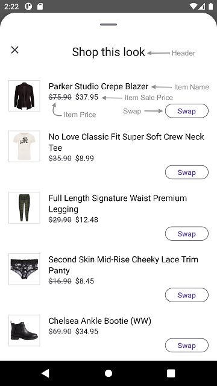
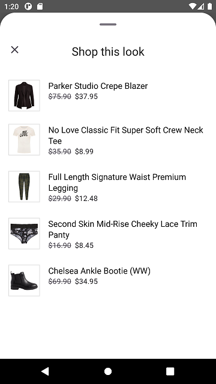
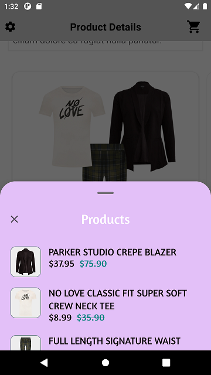
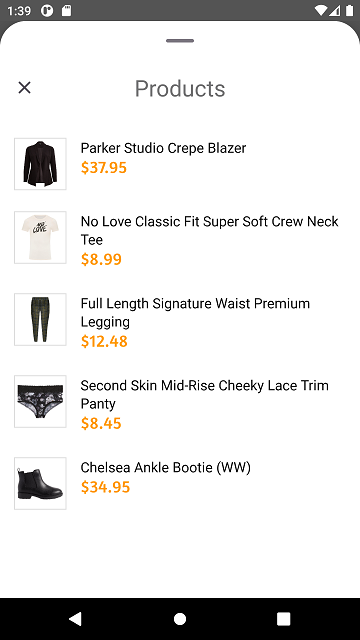
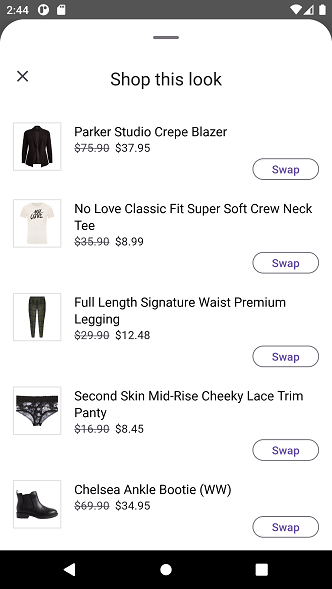
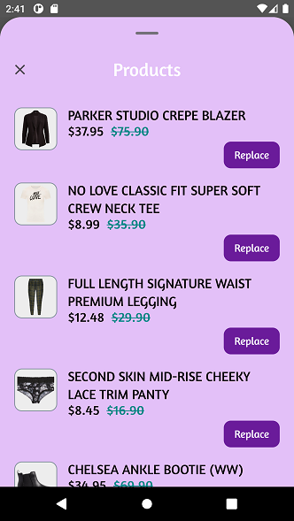

# STANDARD PRODUCT LIST

It provides views to display Stylitics data Outfit items. It also handles invoking of item tracking events based on user interaction with these views.

## Product List Screen

* This screen is displayed when user clicks on an Outfit.
* There are two different ways to show Product List Screen.
    1. Product List Screen From UX SDK
    2. Product List Screen From Integrator App

### Product List Screen From UX SDK

Below are the features for Product List Screen 
* Configure all the UI elements for Product List Screen
* Handles Outfit Item `View` and `Click` tracking events so Integrator App does not have to do it
* Provides listeners to Integrator App so they can handle the Outfit Item `View` and `Click` events
* If Integrator App does not implement Outfit Item click listener, a Web View is opened when user selects an Outfit Item

*Note: It is recommended that Integrator App always provides the **onOutfitItemClick** listener implementation*.

### Product List Screen Configurations

</br>

#### Header

| Fields                         | Description                                                                                                          | Default Value                      | 
|--------------------------------|----------------------------------------------------------------------------------------------------------------------|------------------------------------|
| `title`                        | to set the header of the screen                                                                                      | `Shop this look`                   |           
| `productListScreenHeaderAlign` | to set the product list screen title alignment with close button. It will be center aligned when the value is CENTER | `ProductListScreenHeaderAlign.TOP` |           
| `fontFamilyAndWeight`          | is the font style with the font weight and is accessed from the font resource folder                                 | `R.font.roboto_regular`            |           
| `fontSize`                     | is the font size in float and internally it is converted into SP                                                     | `22f`                              |           
| `fontColor`                    | is text color and is accessed from color.xml resource file                                                           | `#212121`                          |

#### Presentation Style

| Fields               | Description                                 | Default Value                    |
|----------------------|---------------------------------------------|----------------------------------|
| `presentationStyle`  | to set the Product List Presentation style  | `PresentationStyle.FULL_SCREEN`  |

#### Product List View

| Fields                   | Description                                                                                             | Default Value                       |
|--------------------------|---------------------------------------------------------------------------------------------------------|-------------------------------------|
| `backgroundColor`        | is to change product list background color and is accessed from color.xml resource file                 | `#FFFFFF`                           |
| `paddingVertical`        | is top and bottom padding of the button in float and internally it is converted to dp                   | `12f`                               |
| `paddingHorizontal`      | is left and right padding of the button in float and internally it is converted to dp                   | `16f`                               |
| `imageBackground`        | is the background to the item image and is accessed from drawable resource file                         | `R.drawable.item_image_background`  |
| `productDetailsPadding`  | is left and right padding of the item text content view in float and internally it is converted into dp | `16f`                               |

The Item's `imageBackground` is set using below XML code of drawable resource file, which contains the configurations parameters.

Drawable Resource File name : item_image_background

```xml
<?xml version="1.0" encoding="utf-8"?>
<shape xmlns:android="http://schemas.android.com/apk/res/android">
    <stroke
        android:width="@dimen/size_1"
        android:color="#1F000000" />
    <solid android:color="@color/standard_product_list_image_background_color" />
</shape>
```

`imageBackground` is the configurable parameter to set configurations for borderWidth, borderColor and backgroundColor as shown below.

```kotlin
imageBackground = R.drawable.item_image_background
```


#### Hide Anchor Item

| Fields            | Description                                                                         | Default Value for Classic | Default Value for Hotspot |
|-------------------|-------------------------------------------------------------------------------------|---------------------------|---------------------------|
| `hideAnchorItem ` | is to hide anchor item in Product list screen, it will be hidden when set to `true` | `false`                   | `true`                    |


#### Item Name

| Fields                | Description                                                                                | Default Value            | 
|-----------------------|--------------------------------------------------------------------------------------------|--------------------------|
| `fontSize`            | is font size in float and internally it is converted into SP                               | `16f`                    |            
| `verticalSpacing`     | is to set the spacing between two lines                                                    | `2f`                     |            
| `fontColor`           | is text color which is accessed from color.xml resource file                               | `#000000`                | 
| `fontFamilyAndWeight` | is text font style with the font weight and is accessed from the font resource folder      | `R.font.roboto_regular`  |            
| `titleTextTransform`  | to change the case of item name text. When the value is UPPER it will appear in upper case | `None`                   |            

#### Item Price

| Fields                        | Description                                                                                                       | Default Value             | 
|-------------------------------|-------------------------------------------------------------------------------------------------------------------|---------------------------|
| `fontFamilyAndWeight`         | is the text font style with the font weight and is accessed from the font resource folder                         | `R.font.roboto_regular`   |            
| `fontSize`                    | is price font size in float and internally it is converted into sp                                                | `14f`                     |            
| `priceFontColor`              | to set item price text color which is accessed from color.xml resource file                                       | `#1D1B20`                 | 
| `salePriceFontColor`          | to set item sale price text color which is accessed from color.xml resource file                                  | `#1D1B20`                 | 
| `strikeThroughPriceFontColor` | is strike through price text color which is accessed from color.xml resource file                                 | `#49454F`                 | 
| `style`                       | to show or hide the Strike Through Price                                                                          | `PriceStrikeThrough.SHOW` |            
| `swapPricesPosition`          | is boolean value, when it is false it shows strike through price first and then sale price. Vice versa when true. | `false`                   |            
| `verticalSpacing`             | is to set the spacing between two item name and item price text.                                                  | `3`                       |            

*Note : 1. *_**swapPricesPosition**_* in Item Price is to reverse the positions of Price and Strike Through Price.<br />
 &nbsp;&nbsp;&nbsp;&nbsp;&nbsp;&nbsp;&nbsp;&nbsp;&nbsp;&nbsp;2. *_**priceFontColor**_* is to change the color of item price.<br />
 &nbsp;&nbsp;&nbsp;&nbsp;&nbsp;&nbsp;&nbsp;&nbsp;&nbsp;&nbsp;2. *_**salePriceFontColor**_* is to change the color of item sale price.<br />
 &nbsp;&nbsp;&nbsp;&nbsp;&nbsp;&nbsp;&nbsp;&nbsp;&nbsp;&nbsp;3. *_**strikeThroughPriceFontColor**_* is to change the color of old price of item.*


[Click here](CODE_REFERENCE_README.md#Classic-Widget-Configuration-Samples) to find code references for different configuration examples.

### Implement Exposed Listeners
Below are the list of Standard Product list view listeners exposed to the Integrator app.

1. `onOutfitItemClick` - On click event of Outfit Item, this listener will be triggered. It is highly recommended that Integrator app should implement this listener.
2. `onOutfitItemView` - On view event of Outfit Item, this listener will be triggered.

### Product List Screen from UX SDK with Default Configurations

Below is the example of Product List Screen when Sample Integrator App chooses to use default UI configurations.

*_**XML**_*

```xml
<com.stylitics.ui.StyliticsUIApi 
        android:id="@+id/outfitsRecyclerView"
        android:layout_width="match_parent"
        android:layout_height="wrap_content" />
```

*_**Kotlin**_*

Below is the code to access Product List Screen from UX SDK.

It is recommended that Integrator App provide the **onOutfitItemClick** listener implementation.

```kotlin
val outfitsRecyclerView = findViewById<StyliticsUIApi>(R.id.outfitsRecyclerView)

private fun widgetWithProductListFromUXSDKAndAllDefaultConfigurations(outfits: Outfits) {
    outfitsRecyclerView.load(
        outfits,
        OutfitsTemplate.Classic(),
        productListScreenTemplate = ProductListScreenTemplate.Standard(
            productListScreenConfig = ProductListScreenConfig(
                productListListener = ProductListListener(
                    onOutfitItemClick = { outfitBundleInfo, outfitBundleItemInfo ->
                        //Here, in addition to handling any integrator analytics, natively navigate the user to the selected item's PDP (or launch a quick shop experience).
                        Toast.makeText(this, getString(R.string.outfit_item_clicked).plus(" ${outfitBundleItemInfo.position}"), Toast.LENGTH_LONG).show()
                    }
                )
            )
        )
    )
}
```
* When Product List Screen is displayed from UX SDK, Integrator App can choose to close it using below code.

```Kotlin
val outfitsRecyclerView = findViewById<StyliticsUIApi>(R.id.outfitsRecyclerView)
val requestId = outfitBundleItem.requestId
outfitsRecyclerView.closeProductListScreen(requestId = requestId)
```
* Below is the Product List screenshot when Sample Integrator App uses the default configurations

</br>

### Product List Screen from UX SDK with Custom Configurations

Below are the examples of Product List Screen when Sample Integrator App chooses to use custom configurations.

*_**XML**_*

```xml
<com.stylitics.ui.StyliticsUIApi 
        android:id="@+id/outfitsRecyclerView"
        android:layout_width="match_parent"
        android:layout_height="@dimen/size_400" />
```

*_**Kotlin**_*

#### 1. With All Custom Configurations and Listeners

```kotlin
val outfitsRecyclerView = findViewById<StyliticsUIApi>(R.id.outfitsRecyclerView)

fun widgetWithProductListFromUXSDKAndAllCustomConfigurations(outfits: Outfits) {
    outfitsRecyclerView?.load(
        outfits,
        OutfitsTemplate.Classic(),
        productListScreenTemplate = ProductListScreenTemplate.Standard(
            productListScreenConfig = ProductListScreenConfig(
                itemListHeader = ProductListScreenConfig.ItemListHeader(
                    title = "Products",
                    productListScreenHeaderAlign = ProductListScreenHeaderAlign.CENTER,
                    fontFamilyAndWeight = R.font.amaranth,
                    fontColor = R.color.white,
                    fontSize = 26f
                ),
                presentationStyle = PresentationStyle.HALF_SCREEN,
                productListConfig = ProductListConfig(
                    itemName = ProductListConfig.ItemName(
                        fontFamilyAndWeight = R.font.amaranth,
                        titleTextTransform = TitleTextTransform.UPPER,
                        fontSize = 19f,
                        fontColor = R.color.standard_product_list_item_name_font_color
                    ),
                    /*
                        itemPrice - is to set ItemPrice configurations.
                        priceFontColor - is the color configuration of actual price.
                        salePriceFontColor - is the color configuration of sale price.
                        strikeThroughPriceFontColor - is the color configuration of old price.
                        style - is Hide or Show the strikeThroughPriceFontColor.
                        swapPricesPosition - swaps the positions of Sale Price and Strike-Through Price.
                    */
                    itemPrice = ProductListConfig.ItemPrice(
                        fontFamilyAndWeight = R.font.amaranth,
                        fontSize = 19f,
                        priceFontColor = R.color.standard_product_list_item_price_font_color,
                        salePriceFontColor = R.color.standard_product_list_item_sale_price_font_color,
                        strikeThroughPriceFontColor = R.color.standard_product_list_item_strike_through_price_font_color,
                        style = PriceStrikeThrough.SHOW,
                        swapPricesPosition = true,
                        verticalSpacing = 2f
                    ),
                    backgroundColor = R.color.standard_product_list_item_background_color,
                    hideAnchorItem = false,
                    paddingVertical = 10f,
                    paddingHorizontal = 20f,
                    imageBackground = R.drawable.product_list_item_image_background,
                    productDetailsPadding = 15f
                ),
                productListListener = ProductListListener(
                    onOutfitItemClick = { outfitBundleInfo, outfitBundleItemInfo ->
                        //Here, in addition to handling any integrator analytics, natively navigate the user to the selected item's PDP (or launch a quick shop experience).
                        Toast.makeText(context, context?.getString(R.string.outfit_item_clicked).plus(" ${outfitBundleItemInfo.position}"), Toast.LENGTH_LONG).show()
                    },
                    onOutfitItemView = { outfitBundleInfo, outfitBundleItemInfo ->
                        Log.i("OutfitItemEvent", " Outfit Item view event triggered. ${outfitBundleInfo.outfitBundle.id}, ${outfitBundleItemInfo.outfitBundleItem.name}")
                    }
                )
            )
        )
    )
}
```

* Below is the Product List screenshot when Sample Integrator App uses the above configurations.

</br>

#### 2. With Some Custom configurations and Listeners

```kotlin
val outfitsRecyclerView = findViewById<StyliticsUIApi>(R.id.outfitsRecyclerView)

fun widgetWithProductListFromUXSDKAndSomeCustomConfigurations(outfits: Outfits) {
    outfitsRecyclerView?.load(
        outfits,
        OutfitsTemplate.Classic(),
        productListScreenTemplate = ProductListScreenTemplate.Standard(
            productListScreenConfig = ProductListScreenConfig(
                itemListHeader = ProductListScreenConfig.ItemListHeader(
                    title = "Products",
                    productListScreenHeaderAlign = ProductListScreenHeaderAlign.CENTER,
                    fontColor = R.color.gray_500,
                    fontSize = 26f
                ),
                productListConfig = ProductListConfig(
                    itemPrice = ProductListConfig.ItemPrice(
                        fontFamilyAndWeight = R.font.amaranth,
                        fontSize = 20f,
                        salePriceFontColor = R.color.dark_yellow,
                        style = PriceStrikeThrough.HIDE
                    )
                ),
                productListListener = ProductListListener(
                    onOutfitItemClick = { outfitBundleInfo, outfitBundleItemInfo ->
                        //Here, in addition to handling any integrator analytics, natively navigate the user to the selected item's PDP (or launch a quick shop experience).
                        Toast.makeText(context, context?.getString(R.string.outfit_item_clicked).plus(" ${outfitBundleItemInfo.position}"), Toast.LENGTH_LONG).show()
                    }
                )
            )
        )
    )
}
```

* Below is the Product List screenshot when Sample Integrator App uses the above configurations.

</br>

### Product List Screen From Integrator App

If Integrator App wants to implement their own Product List Screen, they need to implement Outfit click listener as shown below and create Activity/Fragment by their own.

```kotlin
val outfitsRecyclerView = findViewById<StyliticsUIApi>(R.id.outfitsRecyclerView)

fun widgetWhenProductListFromIntegrator(outfits: Outfits) {
    outfitsRecyclerView?.load(
        outfits,
        OutfitsTemplate.Classic(
            classicListener = ClassicListener(
                onClick = { outfitBundleInfo ->
                    //Display Product List Screen from Integrator here
                    context?.showProductList(outfitBundleInfo.outfitBundle)
                }
            )),
        displayProductListFromSDK = false
        //Refer 'ProductListViewConfigSamples.kt' class for sample code to configure product list when displayed form Integrator App.
    )
}
```

Integrator can create their own Product List View or access and implement it from UX SDK as given below.

#### 1. Product List View with Default Configurations

Below is the code to call your own Product List Screen. 

```Kotlin
fun FragmentActivity.showProductList(outfitBundle: OutfitBundle) {
    val outfitBundleItemsFragment = OutfitBundleItemsFragment.newInstance(outfitBundle)
    FragmentManagerUtil.addFragmentOnTop(this, R.id.fragmentContainer, outfitBundleItemsFragment)
}
```

*_**OutfitBundleItemsFragment**_* is the fragment class to show Product List Screen

Add below xml code to your Fragments xml file

*_**XML**_*

```xml
<com.stylitics.ui.StyliticsUIApi 
        android:id="@+id/outfitItemsRecyclerView"
        android:layout_width="match_parent"
        android:layout_height="@dimen/size_400" />
```

*_**Kotlin**_*

To load the Product List invoke below method from Fragment's `onCreateView` method. 

```Kotlin
val itemView: View = inflater.inflate(R.layout.outfit_items_fragment, container, false)
val outfitItemRecyclerView = itemView.findViewById<StyliticsUIApi>(R.id.outfitsItemRecyclerView)

private fun displayOutfitBundleItemsWithDefaultConfigurations(containerView: View, outfitBundle: OutfitBundle) {
    outfitItemRecyclerView.load(
        outfitBundle,
        ProductListTemplate.Standard(
            productListListener = ProductListListener(
                onOutfitItemClick = { outfitBundleInfo, outfitBundleItemInfo ->
                    //Here, in addition to handling any integrator analytics, natively navigate the user to the selected item's PDP (or launch a quick shop experience).
                    Toast.makeText(context, context?.getString(R.string.outfit_item_clicked).plus(" ${outfitBundleItemInfo.position}"), Toast.LENGTH_LONG).show()
                }
            )
        )
    )
}
```

#### 2. Product List View with Custom Configurations

```Kotlin
val itemView: View = inflater.inflate(R.layout.outfit_items_fragment, container, false)
val outfitItemRecyclerView = itemView.findViewById<StyliticsUIApi>(R.id.outfitsItemRecyclerView)

fun displayOutfitBundleItemsWithAllCustomConfigurations(outfitBundle: OutfitBundle) {
    outfitItemRecyclerView.load(
        outfitBundle,
        ProductListTemplate.Standard(
            productListConfig = ProductListConfig(
                itemName = ProductListConfig.ItemName(
                    fontFamilyAndWeight = R.font.amaranth,
                    titleTextTransform = TitleTextTransform.UPPER,
                    fontSize = 19f,
                    fontColor = R.color.standard_product_list_item_name_font_color
                ),
                /*
                    itemPrice - is to set ItemPrice configurations.
                    priceFontColor - is the color configuration of actual price.
                    salePriceFontColor - is the color configuration of sale price.
                    strikeThroughPriceFontColor - is the color configuration of old price.
                    style - is Hide or Show the strikeThroughPriceFontColor.
                    swapPricesPosition - swaps the positions of Sale Price and Strike-Through Price.
                */
                itemPrice = ProductListConfig.ItemPrice(
                    fontFamilyAndWeight = R.font.amaranth,
                    fontSize = 19f,
                    priceFontColor = R.color.standard_product_list_item_price_font_color,
                    salePriceFontColor = R.color.standard_product_list_item_sale_price_font_color,
                    strikeThroughPriceFontColor = R.color.standard_product_list_item_strike_through_price_font_color,
                    style = PriceStrikeThrough.SHOW,
                    swapPricesPosition = true
                ),
                backgroundColor = R.color.standard_product_list_item_background_color,
                hideAnchorItem = true,
                paddingVertical = 10f,
                paddingHorizontal = 20f,
                imageBackground = R.drawable.product_list_item_image_background,
                productDetailsPadding = 15f
            ),
            replacementScreenConfig = replacementScreenConfig(),
            productListListener = ProductListListener(
                onOutfitItemView = { outfitBundleInfo, outfitBundleItemInfo ->
                    Log.i("OutfitItemEvent", " Outfit Item view event triggered. ${outfitBundleInfo.outfitBundle.id}, ${outfitBundleItemInfo.outfitBundleItem.name}")
                },
                onOutfitItemClick = { outfitBundleInfo, outfitBundleItemInfo ->
                    Log.i("OutfitItemEvent", " Outfit Item click event triggered. ${outfitBundleInfo.outfitBundle.id}, ${outfitBundleItemInfo.outfitBundleItem.name}")
                }
            )
        )
    )
}
```

## Mix and Match (MnM)

* Mix and Match (MnM) feature can be enabled or disabled from Integrator App
* [Data SDK](DATA_SDK_README.md#mix-and-match) has more details to enable Mix and Match
* When Mix and Match feature is enabled, user can swap items from Product List View

## Product List Screen with Mix and Match 

* When Mix and Match is enabled
    * Swap CTA will be displayed for each Outfit Item having Replacement Items
    * Upon clicking the swap button, the user will be navigated to the Replacement screen, where they can perform the item swapping.
    * Handles item `onMixAndMatchExpand`, `onItemSwap` and `onMixAndMatchCollapse` tracking event. 
    * Exposes `onMixAndMatchExpand`, `OnItemSwap` and `onMixAndMatchCollapse` listener to Integrator App.

#### Swap CTA Configurations

| Fields                | Description                                                                           | Default Value                       |
|-----------------------|---------------------------------------------------------------------------------------|-------------------------------------|
| `title`               | is the title of text                                                                  | `Swap`                              |            
| `backgroundColor`     | is background set to cta and is accessed from drawable resource file                  | `R.drawable.swap_button_background` |            
| `paddingVertical`     | is top and bottom padding of the button in float and internally it is converted to dp | `4f`                                |            
| `paddingHorizontal`   | is left and right padding of the button in float and internally it is converted to dp | `24f`                               |            
| `fontSize`            | is font size in float and internally it is converted into sp                          | `14f`                               |            
| `fontFamilyAndWeight` | is the font style with the font weight and is accessed from the font resource folder  | `R.font.roboto_medium`              |            
| `fontColor`           | is the cta text color and is accessed from color.xml resource file                    | `#6750A4`                           | 

The `Swap` CTA backgroundColor is set using below XML code of drawable resource file, which contains the configurations parameters.

Drawable Resource File name : swap_button_background

```xml
<?xml version="1.0" encoding="utf-8"?>
<shape xmlns:android="http://schemas.android.com/apk/res/android">

    <corners android:radius="@dimen/size_100" />
    <stroke
        android:width="@dimen/size_1"
        android:color="#79747E" />
    <solid android:color="@color/standard_product_list_swap_button_color"/>
</shape>
```

`backgroundColor` is the configurable parameter to set configurations for cornerRadius, borderWidth, borderColor and backgroundColor as shown below.

```kotlin
ctaBackgroundColor = R.drawable.shop_this_look_background
```

#### 1. Product List Screen with Default Configuration for Swap

*_**Kotlin**_*

 ```Kotlin
val outfitsRecyclerView = findViewById<StyliticsUIApi>(R.id.outfitsRecyclerView)

fun widgetWithProductListFromUXSDKAndAllDefaultConfigurations(outfits: Outfits) {
    outfitsRecyclerView?.load(
        outfits,
        OutfitsTemplate.Classic(),
        productListScreenTemplate = ProductListScreenTemplate.Standard(
            productListScreenConfig = ProductListScreenConfig(
                productListListener = ProductListListener(
                    onOutfitItemClick = { outfitBundleInfo, outfitBundleItemInfo ->
                        //Here, in addition to handling any integrator analytics, natively navigate the user to the selected item's PDP (or launch a quick shop experience).
                        Toast.makeText(context, context?.getString(R.string.outfit_item_clicked).plus(" ${outfitBundleItemInfo.position}"), Toast.LENGTH_LONG).show()
                    }
                )
            )
        )
    )
}
```

* Below is the Product List screenshot when Sample Integrator App uses the above configurations.

</br>

#### 2. Product List Screen with Custom configuration for Swap

*_**Kotlin**_*

```kotlin
val outfitsRecyclerView = findViewById<StyliticsUIApi>(R.id.outfitsRecyclerView)

fun widgetWithMnMCustomConfigurationsOnProductListScreen(outfits: Outfits) {
    outfitsRecyclerView?.load(
        outfits,
        OutfitsTemplate.Classic(),
        productListScreenTemplate = ProductListScreenTemplate.Standard(
            productListScreenConfig = ProductListScreenConfig(
                itemListHeader = ProductListScreenConfig.ItemListHeader(
                    title = "Products",
                    productListScreenHeaderAlign = ProductListScreenHeaderAlign.CENTER,
                    fontFamilyAndWeight = R.font.amaranth,
                    fontColor = R.color.white,
                    fontSize = 26f
                ),
                presentationStyle = PresentationStyle.HALF_SCREEN,
                productListConfig = ProductListConfig(
                    itemName = ProductListConfig.ItemName(
                        fontFamilyAndWeight = R.font.amaranth,
                        titleTextTransform = TitleTextTransform.UPPER,
                        fontSize = 19f,
                        fontColor = R.color.standard_product_list_item_name_font_color
                    ),
                    /*
                        itemPrice - is to set ItemPrice configurations.
                        priceFontColor - is the color configuration of actual price.
                        salePriceFontColor - is the color configuration of sale price.
                        strikeThroughPriceFontColor - is the color configuration of old price.
                        style - is Hide or Show the strikeThroughPriceFontColor.
                        swapPricesPosition - swaps the positions of Sale Price and Strike-Through Price.
                    */
                    itemPrice = ProductListConfig.ItemPrice(
                        fontFamilyAndWeight = R.font.amaranth,
                        fontSize = 19f,
                        priceFontColor = R.color.standard_product_list_item_price_font_color,
                        salePriceFontColor = R.color.standard_product_list_item_sale_price_font_color,
                        strikeThroughPriceFontColor = R.color.standard_product_list_item_strike_through_price_font_color,
                        style = PriceStrikeThrough.SHOW,
                        swapPricesPosition = true
                    ),
                    backgroundColor = R.color.standard_product_list_item_background_color,
                    hideAnchorItem = false,
                    paddingVertical = 10f,
                    paddingHorizontal = 20f,
                    imageBackground = R.drawable.product_list_item_image_background,
                    productDetailsPadding = 15f,
                    swapButton = ProductListConfig.SwapButton(
                        title = "Replace",
                        backgroundColor = R.drawable.standard_product_list_swap_button_background,
                        paddingHorizontal = 15f,
                        paddingVertical = 10f,
                        fontColor = R.color.standard_product_list_swap_button_fontColor,
                        fontSize = 15f,
                        fontFamilyAndWeight = R.font.amaranth,
                    )
                ),
                productListListener = ProductListListener(
                    onOutfitItemClick = { outfitBundleInfo, outfitBundleItemInfo ->
                        //Here, in addition to handling any integrator analytics, natively navigate the user to the selected item's PDP (or launch a quick shop experience).
                        Toast.makeText(context, context?.getString(R.string.outfit_item_clicked).plus(" ${outfitBundleItemInfo.position}"), Toast.LENGTH_LONG).show()
                    },
                    onOutfitItemView = { outfitBundleInfo, outfitBundleItemInfo ->
                        Log.i("OutfitItemEvent", " Outfit Item view event triggered. ${outfitBundleInfo.outfitBundle.id}, ${outfitBundleItemInfo.outfitBundleItem.name}")
                    }
                )
            )
        )
    )
}
```

* Below is the Product List screenshot when Sample Integrator App uses the above configurations.

</br>


## Mix and Match Screen

* [Mix and Match Screen](MIX_AND_MATCH_SCREEN_README.md#MIX-AND-MATCH-SCREEN) has more details about Mix and Match Feature.

## License

Copyright © 2024 Stylitics