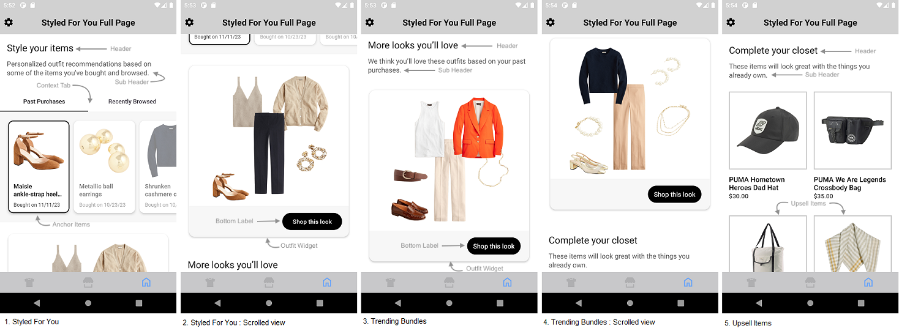
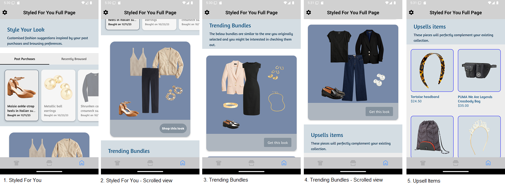
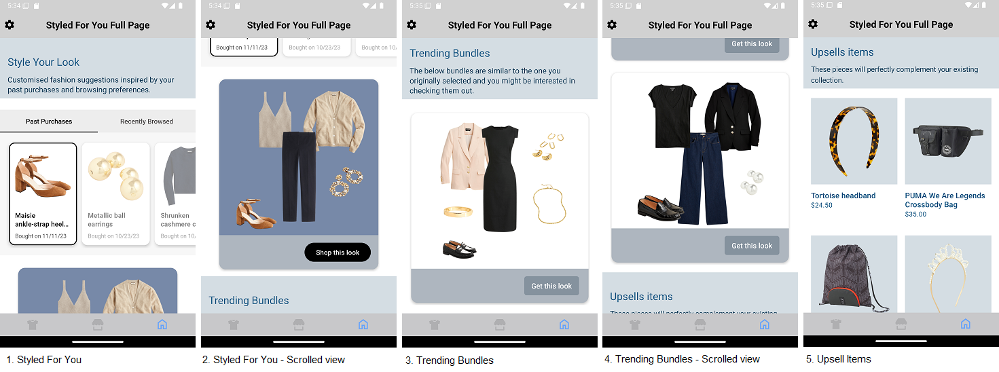

# STYLED FOR YOU FULL PAGE WIDGET

It provides view to display Stylitics StyledForYouFullPage data. It also handles invoking of widget tracking events based on user interaction with these views.

Below are the features for StyledForYou Full Page Widget.</br>

* Configure all the UI elements for StyledForYouFullPage Widget
* Handles tracking events so Integrator App does not have to do it
* Provides listeners to Integrator App so they can handle the events (if needed) based on user interaction.
* Configure whether to display bundle items of StyledForYou and TrendingBundles directly from SDK or not
* When Bundle Items are configured to display from SDK, Integrator App can provide configs for it.


StyledForYou Full Page widget is the combination of [Styled For You](STYLED_FOR_YOU_WIDGET_README.md#Configurations), [Trending Bundles](TRENDING_BUNDLES_WIDGET_README.md#Configurations) and [Upsells Items](UPSELL_ITEMS_WIDGET_README.md#Configurations) widget as shown in the below screenshot.



[Click here](CODE_REFERENCE_README.md#StyledForYou-Full-Page-Widget-Configuration-Samples) to find code references for different configuration examples.

## Default Configurations:

* Below are the examples of StyledForYouFullPage Widget when Integrator App chooses to use default UI configurations.</br>

* The StyledForYouFullPage UI component can be implemented in below different ways.
    1. Product List enabled from SDK
    2. Product List disabled from SDK
    3. Configure Event Listeners
    
*_**XML**_*

```xml
<com.stylitics.ui.StyliticsUIApi
        android:id="@+id/recyclerViewSYFYFullPage"
        android:layout_width="match_parent"
        android:layout_height="match_parent" />
```

*_**Kotlin**_*

### 1. Product List enabled from SDK:

When product list is enabled from UX SDK and Integrator App does not provide configurations, it will take default configurations from SDK.

```kotlin
val rvSYFYFullPage = findViewById<StyliticsUIApi>(R.id.recyclerViewSYFYFullPage)

fun widgetWithProductListFromUXSDK(styledForYouFullPageResponse: StyledForYouFullPageResponse) {
  rvSYFYFullPage?.load(
    styledForYouFullPageResponse
  )
}
```

### 2. Product List disabled from SDK:

```kotlin
val rvSYFYFullPage = findViewById<StyliticsUIApi>(R.id.recyclerViewSYFYFullPage)

fun widgetWhenProductListFromIntegrator(styledForYouFullPageResponse: StyledForYouFullPageResponse) {
  rvSYFYFullPage?.load(
    styledForYouFullPageResponse,
    StyledForYouFullPageInfo(
      StyledForYouInfo(
        styledForYouListener = StyledForYouListener(
          onOutfitClickCTA = { outfitBundleInfo ->
            context?.showGalleryProductList(outfitBundleInfo.outfitBundle)
          }
        )
      ),
      TrendingBundlesInfo(
        listener = TrendingBundlesListener(
          onOutfitClickCTA = { outfitBundleInfo ->
            context?.showGalleryProductList(outfitBundleInfo.outfitBundle)
          }
        )
      )
    ),
    displayProductListFromSDK = false
  )
}
```

*Note : When "displayProductListFromSDK" is set to false, the Product List from UX will be disabled for both StyledForYou and TrendingBundle and vide versa.*

### 3. Configure Event Listeners:

```kotlin
val rvSYFYFullPage = findViewById<StyliticsUIApi>(R.id.recyclerViewSYFYFullPage)

fun widgetWithListenersConfigured(styledForYouFullPageResponse: StyledForYouFullPageResponse) {
  rvSYFYFullPage?.load(
    styledForYouFullPageResponse,
    StyledForYouFullPageInfo(
      StyledForYouInfo(
        styledForYouListener = StyledForYouListener(
          onContextClick = { contextType, contextItems ->
            Log.i("StyledForYouEvent", " onContextClick. $contextType")
            for (contextItem in contextItems) {
              Log.i("StyledForYouEvent", "item name. ${contextItem.name}")
            }
          },
          onAnchorItemClick = { contextItemInfo ->
            Log.i(
              "StyledForYouEvent", " onAnchorItemClick contextType:${contextItemInfo.contextType}, " +
                      "position:${contextItemInfo.position}, name:${contextItemInfo.contextItem.name} "
            )
          },
          onAnchorItemView = { contextItemInfo ->
            Log.i(
              "StyledForYouEvent", " onAnchorItemView. contextType:${contextItemInfo.contextType}, " +
                      "position:${contextItemInfo.position}, name:${contextItemInfo.contextItem.name} "
            )
          },
          onOutfitClick = { outfitBundleInfo ->
            Log.i("StyledForYouEvent", " onOutfitClick. $outfitBundleInfo")
          },
          onOutfitView = { outfitBundleInfo ->
            Log.i("StyledForYouEvent", " onOutfitView. $outfitBundleInfo")
          },
          onOutfitClickCTA = { outfitBundleInfo ->
            Log.i("StyledForYouEvent", " onOutfitClickCTA. $outfitBundleInfo")
          }
        )
      ),
      TrendingBundlesInfo(
        listener = TrendingBundlesListener(
          onOutfitView = { outfitBundleInfo ->
            Log.i("TrendingBundlesEvent", "onView. $outfitBundleInfo")
          },
          onOutfitClick = { outfitBundleInfo ->
            Log.i("TrendingBundlesEvent", "onClick. $outfitBundleInfo")
          },
          onOutfitClickCTA = { outfitBundleInfo ->
            Log.i("TrendingBundlesEvent", "onOutfitClickCTA $outfitBundleInfo")
          }
        )
      ),
      UpsellsInfo(
        listener = UpsellsListener(
          onItemView = { outfitBundleItemInfo ->
            Log.i("UpsellsEvent", "onItemView. $outfitBundleItemInfo")
          },
          onItemClick = { outfitBundleItemInfo ->
            Log.i("UpsellsEvent", "onItemClick. $outfitBundleItemInfo")
          }
        )
      )
    )
  )
}
```


### Default StyledForYou Full Page Screen

* Below is the StyledForYou Full Page Widget screenshot when Sample Integrator App uses the above configurations.

</br></br>

## Custom Configurations:

* Integrator App can customise some or all configurations & implement listeners.
* Below are the examples of StyledForYou Full Page Widget when Sample Integrator App customises configurations.

### 1. With all configurations & Listeners:

```kotlin
val rvSYFYFullPage = findViewById<StyliticsUIApi>(R.id.recyclerViewSYFYFullPage)

fun widgetWithAllCustomConfigurations(styledForYouFullPageResponse: StyledForYouFullPageResponse) {
  rvSYFYFullPage?.load(
    styledForYouFullPageResponse,
    StyledForYouFullPageInfo(
      StyledForYouInfo(
        styledForYouConfigs = StyledForYouConfigs(
          header = StyledForYouConfigs.Header(
            backgroundColor = R.color.styled_for_you_header_background_color,
            paddingVertical = 30f,
            paddingHorizontal = 30f,
            headerText = "Style Your Look",
            headerFontColor = R.color.styled_for_you_header_font_color,
            headerFontFamilyAndWeight = R.font.amaranth,
            headerFontSize = 24f,
            headerLineHeight = 5f,
            subHeaderText = "Customised fashion suggestions inspired by your past purchases and browsing preferences.",
            subHeaderFontColor = R.color.styled_for_you_header_sub_header_font_color,
            subHeaderFontFamilyAndWeight = R.font.amaranth,
            subHeaderFontSize = 15f,
            subHeaderLineHeight = 5f
          ),
          tabContext = StyledForYouConfigs.TabContext(
            backgroundColor = R.color.styled_for_you_tab_background_color,
            labelSelectedColor = R.color.styled_for_you_selected_label_color,
            labelFontColor = R.color.styled_for_you_unselected_label_color,
            labelFontSize = 14f,
            labelFontFamilyAndWeight = R.font.amaranth
          ),
          anchorItems = StyledForYouConfigs.AnchorItems(
            backgroundColor = R.color.styled_for_you_anchor_items_background_color,
            selectedBorderColor = R.color.styled_for_you_selected_border_color,
            itemBackgroundColor = R.color.styled_for_you_anchor_item_background_color,
            itemCornerRadius = 12f,
            cardGutterWidth = 2f,
            cardPaddingVertical = 12f,
            cardPaddingHorizontal = 12f,
            productNameFontColor = R.color.styled_for_you_product_name_font_color,
            productNameFontFamilyAndWeight = R.font.amaranth,
            productNameFontSize = 14f,
            contextNameFontColor = R.color.styled_for_you_context_name_font_color,
            contextNameFontFamilyAndWeight = R.font.amaranth,
            contextNameFontSize = 12f,
            contextDateFormat = DateFormat.MM_DD_YY,
            priceFontFamilyAndWeight = R.font.amaranth,
            priceFontSize = 15f,
            priceFontColor = R.color.styled_for_you_anchor_item_price_font_color,
            salePriceFontColor = R.color.styled_for_you_anchor_item_sale_price_font_color,
            strikeThroughPriceFontColor = R.color.styled_for_you_anchor_item_sale_price_strike_font_color,
            style = PriceStrikeThrough.SHOW,
            swapPricesPosition = false
          ),
          widget = StyledForYouConfigs.Widget(
            cardGutter = 30,
            cornerRadius = 20f,
            backgroundColor = R.color.styled_for_you_widget_background_color,
            cardPeek = 35f
          ),
          outOfStock = StyledForYouConfigs.OutOfStock(
            badgeFontColor = R.color.styled_for_you_out_of_stock_badge_text_color,
            badgeFontFamilyAndWeight = R.font.amaranth,
            badgeFontSize = 12f,
            badgeVerticalSpacing = 4f,
            badgeHorizontalSpacing = 12f,
            badgeBackgroundColor = R.color.styled_for_you_out_of_stock_badge_background_color
          ),
          similarItems = StyledForYouConfigs.SimilarItems(
            badgeFontColor = R.color.styled_for_you_similar_item_font_color,
            badgeFontSize = 12f,
            badgeFontFamilyAndWeight = R.font.calibri,
            badgeVerticalSpacing = 4f,
            badgeHorizontalSpacing = 12f,
            badgeBackgroundColor = R.color.styled_for_you_similar_item_background_color
          ),
          bottomLabel = StyledForYouConfigs.BottomLabel(
            ctaTitle = "Shop this look",
            fontFamilyAndWeight = R.font.baloo_bhai,
            fontSize = 14f,
            fontColor = R.color.styled_for_you_bottom_label_font_color,
            backgroundColor = R.color.styled_for_you_bottom_label_background_color,
            ctaBackgroundColor = R.drawable.styled_for_you_shop_this_look_background,
            paddingVertical = 15f,
            paddingHorizontal = 15f,
            ctaPaddingVertical = 10f,
            ctaPaddingHorizontal = 10f
          ),
          bullet = StyledForYouConfigs.Bullet(
            defaultColor = R.color.styled_for_you_default_bullet_color,
            highlightedColor = R.color.styled_for_you_selected_bullet_color,
            paddingVertical = 10f
          )
        ),
        styledForYouListener = StyledForYouListener(
          onContextClick = { contextType, contextItems ->
            Log.i("StyledForYouEvent", " onContextClick. $contextType")
          },
          onAnchorItemClick = { contextItemInfo ->
            Log.i(
              "StyledForYouEvent", " onAnchorItemClick contextType:${contextItemInfo.contextType}, " +
                      "position:${contextItemInfo.position}, name:${contextItemInfo.contextItem.name} "
            )
          },
          onAnchorItemView = { contextItemInfo ->
            Log.i("StyledForYouEvent", " onAnchorItemView. contextType:${contextItemInfo.contextType}, " +
                      "position:${contextItemInfo.position}, name:${contextItemInfo.contextItem.name} "
            )
          },
          onOutfitClick = { outfitBundleInfo ->
            Log.i("StyledForYouEvent", " onOutfitClick. $outfitBundleInfo")
          },
          onOutfitView = { outfitBundleInfo ->
            Log.i("StyledForYouEvent", " onOutfitView. $outfitBundleInfo")
          },
          onOutfitClickCTA = { outfitBundleInfo ->
            Log.i("StyledForYouEvent", " onOutfitClickCTA. $outfitBundleInfo")
          }
        )
      ),
      TrendingBundlesInfo(
        config = TrendingBundlesConfig(
          header = TrendingBundlesConfig.Header(
            backgroundColor = R.color.trending_bundles_header_background_color,
            paddingVertical = 30f,
            paddingHorizontal = 30f,
            headerText = "Trending Bundles",
            headerFontColor = R.color.trending_bundles_header_font_color,
            headerFontFamilyAndWeight = R.font.amaranth,
            headerFontSize = 24f,
            headerLineHeight = 5f,
            subHeaderText = "The below bundles are similar to the one you originally selected and you might be interested in checking them out.",
            subHeaderFontColor = R.color.trending_bundles_header_sub_header_font_color,
            subHeaderFontFamilyAndWeight = R.font.amaranth,
            subHeaderFontSize = 15f,
            subHeaderLineHeight = 5f
          ),
          widget = TrendingBundlesConfig.Widget(
            backgroundColor = R.color.trending_bundles_widget_background_color,
            paddingVertical = 14f,
            paddingHorizontal = 14f
          ),
          bottomLabel = TrendingBundlesConfig.BottomLabel(
            ctaTitle = "Get this look",
            fontFamilyAndWeight = R.font.calibri,
            fontSize = 16f,
            fontColor = R.color.trending_bundles_bottom_label_font_color,
            backgroundColor = R.color.trending_bundles_bottom_label_background_color,
            ctaBackgroundColor = R.drawable.custom_shop_this_look_background_for_trending_bundles,
            paddingVertical = 17f,
            paddingHorizontal = 22f,
            ctaPaddingVertical = 6f,
            ctaPaddingHorizontal = 15f
          )
        ),
        listener = TrendingBundlesListener(
          onOutfitView = { outfitBundleInfo ->
            Log.i("TrendingBundlesEvent", "onView. $outfitBundleInfo")
          },
          onOutfitClick = { outfitBundleInfo ->
            Log.i("TrendingBundlesEvent", "onClick. $outfitBundleInfo")
          },
          onOutfitClickCTA = { outfitBundleInfo ->
            Log.i("TrendingBundlesEvent", "onOutfitClickCTA $outfitBundleInfo")
          }
        )
      ),
      UpsellsInfo(
        config = UpsellsConfig(
          header = UpsellsConfig.Header(
            backgroundColor = R.color.upsells_header_background_color,
            paddingVertical = 30f,
            paddingHorizontal = 30f,
            headerText = "Upsells items",
            headerFontColor = R.color.upsells_header_font_color,
            headerFontFamilyAndWeight = R.font.amaranth,
            headerFontSize = 24f,
            headerLineHeight = 5f,
            subHeaderText = "These pieces will perfectly complement your existing collection.",
            subHeaderFontColor = R.color.upsells_sub_header_font_color,
            subHeaderFontFamilyAndWeight = R.font.amaranth,
            subHeaderFontSize = 15f,
            subHeaderLineHeight = 5f
          ),
          items = UpsellsConfig.Items(
            paddingOutsideHorizontal = 18f,
            paddingInsideHorizontal = 18f,
            paddingInsideVertical = 34f
          ),
          item = UpsellsConfig.Item(
            backgroundColor = R.color.upsells_item_background_color, //It covers borderColor, borderWidth, borderRadius
            imageBackgroundColor = R.drawable.custom_upsells_item_image_background,
            imageMarginHorizontal = 15f,
            imageMarginVertical = 15f,
            fontColor = R.color.upsells_item_title_font_color,
            fontFamilyAndWeight = R.font.amaranth,
            fontSize = 15f,
            priceFontColor = R.color.upsells_item_cost_font_color,
            priceFontFamilyAndWeight = R.font.amaranth,
            priceFontSize = 18f,
            salePriceFontColor = R.color.upsells_item_discount_price_font_color,
            strikeThroughPriceFontColor = R.color.upsells_item_strike_through_cost_font_color,
            style = PriceStrikeThrough.SHOW,
            swapPricesPosition = true
          )
        ),
        listener = UpsellsListener(
          onItemView = { outfitBundleItemInfo ->
            Log.i("UpsellsEvent", "onItemView. $outfitBundleItemInfo")
          },
          onItemClick = { outfitBundleItemInfo ->
            Log.i("UpsellsEvent", "onItemClick. $outfitBundleItemInfo")
          }
        )
      )
    )
  )
}       
```


* Below is the StyledForYouFullPage Widget screenshot when Sample Integrator App uses the above configurations.

</br>

### 2. With some custom configurations & Listeners:

If Integrator App provides only few configurations, UX SDK will take default configurations for missing fields.

```kotlin
val rvSYFYFullPage = findViewById<StyliticsUIApi>(R.id.recyclerViewSYFYFullPage)

fun widgetWithSomeCustomConfigurations(styledForYouFullPageResponse: StyledForYouFullPageResponse) {
  rvSYFYFullPage?.load(
    styledForYouFullPageResponse,
    StyledForYouFullPageInfo(
      StyledForYouInfo(
        styledForYouConfigs = StyledForYouConfigs(
          header = StyledForYouConfigs.Header(
            backgroundColor = R.color.styled_for_you_header_background_color,
            headerText = "Style Your Look",
            headerFontColor = R.color.styled_for_you_header_font_color,
            subHeaderText = "Customised fashion suggestions inspired by your past purchases and browsing preferences.",
            subHeaderFontColor = R.color.styled_for_you_header_sub_header_font_color,
          ),
          tabContext = StyledForYouConfigs.TabContext(
            backgroundColor = R.color.styled_for_you_tab_background_color,
            labelSelectedColor = R.color.styled_for_you_selected_label_color,
            labelFontColor = R.color.styled_for_you_unselected_label_color,
          ),
          widget = StyledForYouConfigs.Widget(
            cardGutter = 30,
            backgroundColor = R.color.styled_for_you_widget_background_color,
            cardPeek = 35f
          ),
          bottomLabel = StyledForYouConfigs.BottomLabel(
            fontColor = R.color.styled_for_you_bottom_label_font_color,
            backgroundColor = R.color.styled_for_you_bottom_label_background_color,
          ),
          bullet = StyledForYouConfigs.Bullet(
            defaultColor = R.color.styled_for_you_default_bullet_color,
            highlightedColor = R.color.styled_for_you_selected_bullet_color,
          )
        ),
        styledForYouListener = StyledForYouListener(
          onOutfitClick = { outfitBundleInfo ->
            Log.i("StyledForYouEvent", " onOutfitClick. $outfitBundleInfo")
          },
          onOutfitClickCTA = { outfitBundleInfo ->
            Log.i("StyledForYouEvent", " onOutfitClickCTA. $outfitBundleInfo")
          }
        )
      ),
      TrendingBundlesInfo(
        config = TrendingBundlesConfig(
          header = TrendingBundlesConfig.Header(
            backgroundColor = R.color.trending_bundles_header_background_color,
            headerText = "Trending Bundles",
            headerFontColor = R.color.trending_bundles_header_font_color,
            subHeaderText = "The below bundles are similar to the one you originally selected and you might be interested in checking them out.",
            subHeaderFontColor = R.color.trending_bundles_header_sub_header_font_color,
          ),
          bottomLabel = TrendingBundlesConfig.BottomLabel(
            ctaTitle = "Get this look",
            fontColor = R.color.trending_bundles_bottom_label_font_color,
            backgroundColor = R.color.trending_bundles_bottom_label_background_color,
            ctaBackgroundColor = R.drawable.custom_shop_this_look_background_for_trending_bundles,
            ctaPaddingVertical = 6f,
            ctaPaddingHorizontal = 15f
          )
        ),
        listener = TrendingBundlesListener(
          onOutfitClickCTA = { outfitBundleInfo ->
            Log.i("TrendingBundlesEvent", "onOutfitClickCTA $outfitBundleInfo")
          }
        )
      ),
      UpsellsInfo(
        config = UpsellsConfig(
          header = UpsellsConfig.Header(
            backgroundColor = R.color.upsells_header_background_color,
            headerText = "Upsells items",
            headerFontColor = R.color.upsells_header_font_color,
            subHeaderText = "These pieces will perfectly complement your existing collection.",
            subHeaderFontColor = R.color.upsells_sub_header_font_color,
            subHeaderFontSize = 15f,
            subHeaderLineHeight = 5f
          ),
          item = UpsellsConfig.Item(
            imageBackgroundColor = R.color.upsells_item_image_background_color,
            imageMarginHorizontal = 15f,
            fontColor = R.color.upsells_item_title_font_color,
            priceFontColor = R.color.upsells_item_cost_font_color,
            salePriceFontColor = R.color.upsells_item_discount_price_font_color,
            strikeThroughPriceFontColor = R.color.upsells_item_strike_through_cost_font_color,
            style = PriceStrikeThrough.SHOW,
            swapPricesPosition = true
          )
        ),
        listener = UpsellsListener(
          onItemClick = { outfitBundleItemInfo ->
            Log.i("UpsellsEvent", "onItemClick. $outfitBundleItemInfo")
          }
        )
      )
    )
  )
}        
```

* Below is the StyledForYouFullPage Widget screenshot when Sample Integrator App uses the above configurations.

</br>


## Refresh StyledForYou Full Page Widget

**Overview**

The `refreshSyfyFullPageTemplate` method can be used to update the StyledForYou Full Page widget data or its configurations or both.

**Example**

```Kotlin
fun refreshSyfyFullPageTemplate(styledForYouFullPageResponse: StyledForYouFullPageResponse? = null, widgetConfig: IWidgetConfig? = null)
```

**Parameters**

- `styledForYouFullPageResponse`: Optional parameter to provide updated StyledForYouFullPage data.
- `widgetConfig`: Optional parameter to provide updated configurations for StyledForYou Full Page template.

**Usage**

Call the method on the view with optional data/config.

- Get the StyledForYou Full Page widget Template id
```Kotlin
val rvSYFYFullPage = findViewById<StyliticsUIApi>(R.id.recyclerViewSYFYFullPage)
//Load StyledForYou Full Page Widget Template
rvSYFYFullPage?.load(styledForYouFullPageResponse)
```

- To refresh the StyledForYou Full Page widget Template with new StyledForYouFullPage data
```Kotlin
recyclerViewSYFYFullPage.refreshSyfyFullPageTemplate(styledForYouFullPageResponse = styledForYouFullPageResponse)

```
- To refresh the StyledForYou Full Page widget Template with new config
```Kotlin
recyclerViewSYFYFullPage.refreshSyfyFullPageTemplate(widgetConfig = newConfigs)
```
- To refresh the StyledForYou Full Page widget Template with both new StyledForYouFullPage data and config
```Kotlin
recyclerViewSYFYFullPage.refreshSyfyFullPageTemplate(styledForYouFullPageResponse = styledForYouFullPageResponse, widgetConfig = newConfig)
```

## License

Copyright © 2023 Stylitics