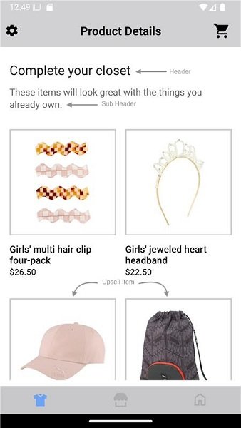
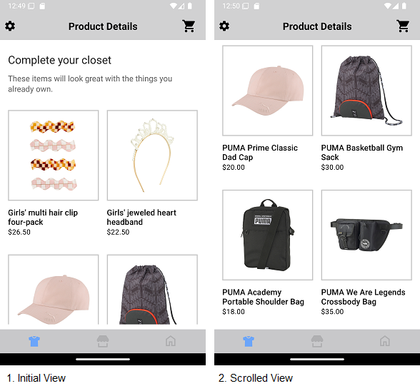
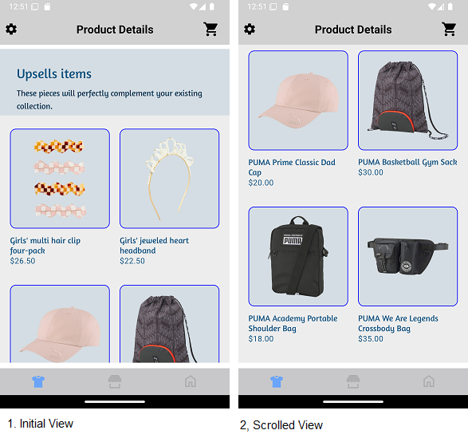
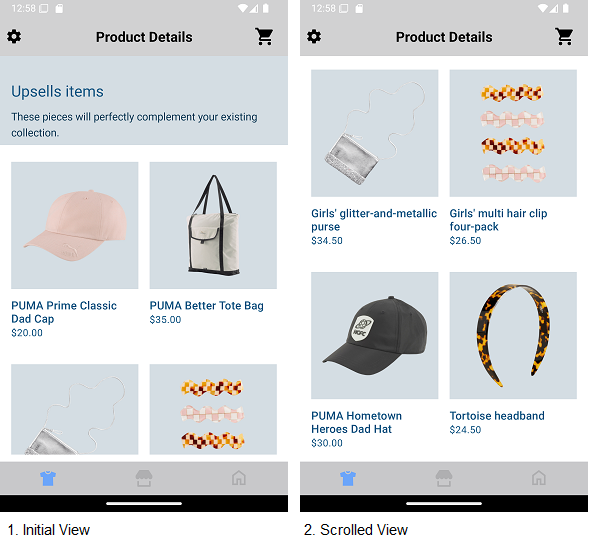

# UPSELL ITEMS WIDGET

It provides view to display Stylitics UpsellItems data. It also handles invoking of widget tracking events based on user interaction with these views.

Below are the features for UpsellItems Widget.</br>

* Configure all the UI elements for UpsellItems Widget
* Handles tracking events so Integrator App does not have to do it
* Provides listeners to Integrator App so they can handle the events (if needed) based on user interaction.


## Configurations:



### Header

| Fields                         | Description                                                                                                        | Default Value                                                 |
|--------------------------------|--------------------------------------------------------------------------------------------------------------------|---------------------------------------------------------------|
| `backgroundColor`              | to set the background color to the header of the widget                                                            | `#FFFFFF`                                                     |           
| `paddingVertical`              | is top spacing for the content inside header, accepts float value and internally it is converted to dp             | `35f`                                                         |           
| `paddingHorizontal`            | is left and right spacing of the header view, accepts float value and internally it is converted to dp             | `16f`                                                         |
| `headerText`                   | is to set text for the header                                                                                      | `Complete your closet`                                        |
| `headerFontColor`              | is header text color and is accessed from color.xml resource file                                                  | `#212121`                                                     |
| `headerFontFamilyAndWeight`    | is the header font style with the font weight and is accessed from the font resource folder                        | `R.font.roboto_regular`                                       |           
| `headerFontSize`               | is the header font size in float and internally it is converted into sp                                            | `22f`                                                         |           
| `headerLineHeight`             | to set the vertical space between lines of header text, accepts float value and internally it is converted to dp   | `2f`                                                          |
| `subHeaderText`                | is to set text for the sub header                                                                                  | `These items will look great with the things you already own` |
| `subHeaderFontColor`           | is sub header text color and is accessed from color.xml resource file                                              | `#666666`                                                     |
| `subHeaderFontFamilyAndWeight` | is the sub title font style with the font weight and is accessed from the font resource folder                     | `R.font.roboto_regular`                                       |
| `subHeaderFontSize`            | is the sub title font size in float and internally it is converted into sp                                         | `16f`                                                         |
| `subHeaderLineHeight`          | to set the height to the header text, accepts float value and internally it is converted to dp                     | `2f`                                                          |

### Items

| Fields                       | Description                                                                                                                | Default Value  |
|------------------------------|----------------------------------------------------------------------------------------------------------------------------|----------------|
| `paddingOutsideHorizontal`   | is left and right spacing of the Upsell items with the margin. It accepts float value and internally it is converted to dp | `16f`          |  
| `paddingInsideHorizontal`    | is the horizontal spacing between two items of Upsell items. It accepts float value and internally it is converted to dp   | `16f`          |  
| `paddingInsideVertical`      | is the vertical spacing between two items of Upsell items. It accepts float value and internally it is converted to dp     | `36f`          |

### Item

| Fields                        | Description                                                                                                                 | Default Value                        | 
|-------------------------------|-----------------------------------------------------------------------------------------------------------------------------|--------------------------------------|
| `backgroundColor`             | is the Upsell items background color and is accessed from color.xml resource file                                           | `#FFFFFF`                            | 
| `imageBackgroundColor`        | is the background to the item image and is accessed from drawable resource file                                             | `R.drawable.upsells_item_background` |
| `imageMarginHorizontal`       | is left and right spacing inside item imageView within an item. It accepts float value and internally it is converted to dp | `17f`                                |            
| `imageMarginVertical`         | is top and bottom spacing inside item imageView within an item. It accepts float value and internally it is converted to dp | `17f`                                |            
| `fontColor`                   | is item name text color and is accessed from color.xml resource file                                                        | `#000000`                            |            
| `fontFamilyAndWeight`         | is item name font style with the font weight and is accessed from the font resource folder                                  | `roboto_medium`                      |            
| `fontSize`                    | is the item name font size in float and internally it is converted into sp                                                  | `16f`                                |
| `priceFontColor`              | to set item price text color which is accessed from color.xml resource file                                                 | `#000000`                            |            
| `priceFontFamilyAndWeight`    | is the item price font style with the font weight and is accessed from the font resource folder                             | `roboto_regular`                     |            
| `priceFontSize`               | is the item price font size in float and internally it is converted into sp                                                 | `14f`                                |            
| `salePriceFontColor`          | to set item sale price text color which is accessed from color.xml resource file                                            | `#8A8A8E`                            |            
| `strikeThroughPriceFontColor` | is strike through price text color which is accessed from color.xml resource file                                           | `#8A8A8E`                            |
| `style`                       | to show or hide the Strike Through Price                                                                                    | `PriceStrikeThrough.SHOW`            |            
| `swapPricesPosition`          | is boolean value, when it is false it shows strike through price first and then sale price. Vice versa when true.           | `false`                              |


In Android, Item *_**imageBackgroundColor**_* is set using below XML code of drawable resource file, which contains configurations for item image background.

Drawable Resource File name : upsells_item_background
```xml
<?xml version="1.0" encoding="utf-8"?>
<shape xmlns:android="http://schemas.android.com/apk/res/android">
    <stroke android:width="@dimen/size_2" 
            android:color="#3D212121" />
    <solid android:color="@color/white" />
</shape>
```

*_**imageBackgroundColor**_* is the configurable parameter to set upsell item backgroundColor as shown below.

```kotlin
 imageBackgroundColor = R.drawable.upsells_item_background
```

[Click here](CODE_REFERENCE_README.md#Upsell-Items-Widget-Configuration-Samples) to find code references for different configuration examples.

# Implement Exposed Listeners

Below are the list of UpsellItems widget listeners exposed to the Integrator app.

4. `onItemView` - On view event of an Outfit bundle item displayed in an UpsellsItems widget, this listener will be invoked.
5. `onItemClick` - On click event of an Outfit bundle item displayed in an UpsellsItems widget, this listener will be invoked.

## Default Configurations:

* Below are the examples of UpsellItems Widget when Integrator App chooses to use default UI configurations.</br>

* The UpsellItems UI component can be implemented in below different ways.
  1. Default UpsellItems widget
  2. Configure Event Listeners
    

*_**XML**_*

```xml
<com.stylitics.ui.StyliticsUIApi 
        android:id="@+id/upsellItemsRecyclerView"
        android:layout_width="match_parent"
        android:layout_height="wrap_content" />
```

*_**Kotlin**_*

### 1. Default UpsellItems widget:

```kotlin
val rvUpsellItems = findViewById<StyliticsUIApi>(R.id.upsellItemsRecyclerView)

fun widgetWhenProductListFromIntegrator(upsellItems: UpsellItems) {
    rvUpsellItems?.load(upsellItems)
}
```

### 2. Configure Event Listeners:

```kotlin
val rvUpsellItems = findViewById<StyliticsUIApi>(R.id.upsellItemsRecyclerView)

fun widgetWithListenersConfigured(upsellItems: UpsellItems) {
  rvUpsellItems?.load(
    upsellItems,
    UpsellsInfo(
      listener = UpsellsListener(
        onItemView = { outfitBundleItemInfo ->
          Log.i("UpsellsEvent", "onItemView. $outfitBundleItemInfo")
        },
        onItemClick = { outfitBundleItemInfo ->
          Log.i("UpsellsEvent", "onItemClick. $outfitBundleItemInfo")
        }
      )
    )
  )
}
```


### Default UpsellItems Screen

* Below is the UpsellItems Widget screenshot when Sample Integrator App uses the above configurations.

</br></br>

## Custom Configurations:

* Integrator App can customise some or all configurations & implement listeners.
* Below are the examples of UpsellItems Widget when Sample Integrator App customises configurations.

### 1. With all configurations & Listeners:

```kotlin
val rvUpsellItems = findViewById<StyliticsUIApi>(R.id.upsellItemsRecyclerView)

fun widgetWithAllCustomConfigurations(upsellItems: UpsellItems) {
  rvUpsellItems?.load(upsellItems, UpsellsInfo(
    UpsellsConfig(
      header = UpsellsConfig.Header(
        backgroundColor = R.color.upsells_header_background_color,
        paddingVertical = 30f,
        paddingHorizontal = 30f,
        headerText = "Upsells items",
        headerFontColor = R.color.upsells_header_font_color,
        headerFontFamilyAndWeight = R.font.amaranth,
        headerFontSize = 24f,
        headerLineHeight = 5f,
        subHeaderText = "These pieces will perfectly complement your existing collection.",
        subHeaderFontColor = R.color.upsells_sub_header_font_color,
        subHeaderFontFamilyAndWeight = R.font.amaranth,
        subHeaderFontSize = 15f,
        subHeaderLineHeight = 5f
      ),
      items = UpsellsConfig.Items(
        paddingOutsideHorizontal = 18f,
        paddingInsideHorizontal = 18f,
        paddingInsideVertical = 34f
      ),
      item = UpsellsConfig.Item(
        backgroundColor = R.color.upsells_item_background_color, //It covers borderColor, borderWidth, borderRadius
        imageBackgroundColor = R.drawable.custom_upsells_item_image_background,
        imageMarginHorizontal = 15f,
        imageMarginVertical = 15f,
        fontColor = R.color.upsells_item_title_font_color,
        fontFamilyAndWeight = R.font.amaranth,
        fontSize = 15f,
        priceFontColor = R.color.upsells_item_cost_font_color,
        priceFontFamilyAndWeight = R.font.amaranth,
        priceFontSize = 18f,
        salePriceFontColor = R.color.upsells_item_discount_price_font_color,
        strikeThroughPriceFontColor = R.color.upsells_item_strike_through_cost_font_color,
        style = PriceStrikeThrough.SHOW,
        swapPricesPosition = true
      )
    ),
    listener = UpsellsListener(
      onItemView = { outfitBundleItemInfo ->
        Log.i("UpsellsEvent", "onItemView. $outfitBundleItemInfo")
      },
      onItemClick = { outfitBundleItemInfo ->
        outfitBundleItemInfo.outfitBundleItem.let { galleryBundleItem ->
          galleryBundleItem.productDetails()?.let { productDetails ->
            val fragment = ProductDetailPageFragment.newInstance(productDetails, galleryBundleItem)
            context?.let {
              FragmentManagerUtil.addFragmentOnTop(it, R.id.fragmentContainer, fragment)
            }
          }
        }
      }
    )
  ))
}
```


* Below is the UpsellItems Widget screenshot when Sample Integrator App uses the above configurations.

</br>

### 2. With some custom configurations & Listeners:

If Integrator App provides only few configurations, UX SDK will take default configurations for missing fields.

```kotlin
val rvUpsellItems = findViewById<StyliticsUIApi>(R.id.upsellItemsRecyclerView)

fun widgetWithSomeCustomConfigurations(upsellItems: UpsellItems) {
  rvUpsellItems?.load(
    upsellItems,
    UpsellsInfo(
      config = UpsellsConfig(
        header = UpsellsConfig.Header(
          backgroundColor = R.color.upsells_header_background_color,
          headerText = "Upsells items",
          headerFontColor = R.color.upsells_header_font_color,
          subHeaderText = "These pieces will perfectly complement your existing collection.",
          subHeaderFontColor = R.color.upsells_sub_header_font_color,
          subHeaderFontSize = 15f,
          subHeaderLineHeight = 5f
        ),
        item = UpsellsConfig.Item(
          imageBackgroundColor = R.color.upsells_item_image_background_color,
          imageMarginHorizontal = 15f,
          fontColor = R.color.upsells_item_title_font_color,
          priceFontColor = R.color.upsells_item_cost_font_color,
          salePriceFontColor = R.color.upsells_item_discount_price_font_color,
          strikeThroughPriceFontColor = R.color.upsells_item_strike_through_cost_font_color,
          style = PriceStrikeThrough.SHOW,
          swapPricesPosition = true
        )
      ),
      listener = UpsellsListener(
        onItemClick = { outfitBundleItemInfo ->
          Log.i("UpsellsEvent", "onItemClick. $outfitBundleItemInfo")
        }
      )
    )
  )
}
```

* Below is the UpsellItems Widget screenshot when Sample Integrator App uses the above configurations.

</br>


## Refresh UpsellItems Widget

**Overview**

The `refreshUpsellsTemplate` method can be used to update the UpsellItems widget data or its configurations or both.

**Example**

```Kotlin
fun refreshUpsellsTemplate(upsellItems: UpsellItems? = null, widgetConfig: IWidgetConfig? = null)
```

**Parameters**

- `upsellItems`: Optional parameter to provide updated UpsellItems data.
- `widgetConfig`: Optional parameter to provide updated configurations for UpsellItems template.

**Usage**

Call the method on the view with optional data/config.

- Get the UpsellItems Widget Template id
```Kotlin
val rvUpsellItems = findViewById<StyliticsUIApi>(R.id.upsellItemsRecyclerView)
//Load UpsellItems Widget Template
rvUpsellItems.load(upsellItems)
```

- To refresh the UpsellItems Widget Template with new UpsellItems data
```Kotlin
rvUpsellItems.refreshUpsellsTemplate(upsellItems = upsellItems)
```
- To refresh the UpsellItems Widget Template with new config
```Kotlin
rvUpsellItems.refreshUpsellsTemplate(widgetConfig = newConfig)
```
- To refresh the UpsellItems Widget Template with both new UpsellItems data and config
```Kotlin
rvUpsellItems.refreshUpsellsTemplate(upsellItems, newConfig)
```

## License

Copyright © 2023 Stylitics