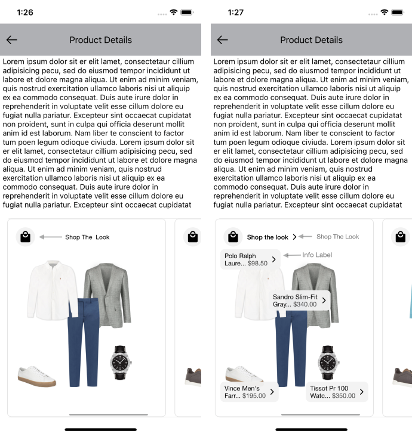
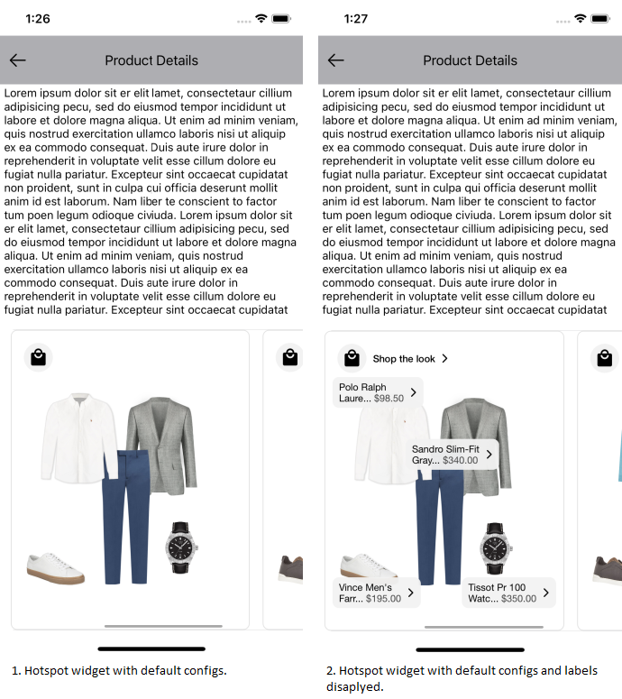
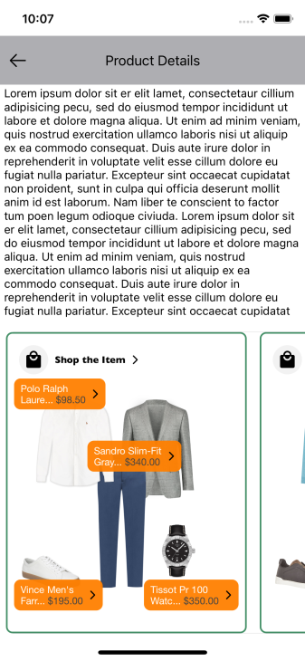

# HOTSPOT WIDGET

It provides view to display Stylitics data. It also handles invoking of tracking events based on user interaction with these views.

Below are the features for Hotspot Outfit Widget.</br>

* Configure all the UI elements for each Outfit
* Handles Outfit tracking events so Sample Integrator App does not have to do it
* Provides listeners to Sample Integrator App so they can handle the Outfit related events
* Configure whether to display Outfit Items directly from SDK or not
    * When Outfit Items are configured to display from SDK, Sample Integrator App can provide configs for it along with Hotspot configs.

### Hotspot Outfit Widget Configurations:



### Widget Background

| Fields | Description | Default Value |
|---|---|---|
| `borderColor` | is border color | `#E1E1E1` |
| `borderWeight` | is border width  | `1px` |
| `cornerRadius` | is border corner radius | `8px` |
| `backgroundColor` | is widget background color | `#FFFFFF` |

### *_**Info Label**_*

| Fields | Description | Default Value |
|---|---|---|
| `backgroundColor` | is background color | `#F2F2F2` |
| `cornerRadius` | is border corner radius | `4px` |
| `fontFamily` | is the font style with the font weight | `Helvetica Neue regular` |
| `productNameFontColor` | is product name text color | `#444444` |
| `priceFontColor` | is price text color and | `#000000` |

### Shop The Look

| Fields | Description | Default Value |
|---|---|---|
| `title` | to set the title of the text | `Shop the look` |
| `fontFamilyAndWeight` | is the font style with the font weight | `Helvetica Neue regular` |
| `fontSize` | is font size in CGFloat | `12px` |
| `fontColor` | is text color | `#000000` |

### Show ScrollBar

| Fields | Description | Default Value |
|---|---|---|
| `showScrollBar` | is Boolean value, to Show or Hide the horizontal ScrollBar of Hotspot Outfit widget | `false` |

[Click here](CODE_REFERENCE_README.md#hotspot-widget-configuration-samples) to find code references for different configuration examples.


### Default Configurations:

* Below are the examples of Hotspot Outfit Widget when Sample Integrator App chooses to use default UI configurations.</br>

* The Hotspot Outfit UI component can be implemented in below different ways.
    1. Product List enabled from SDK
    2. Product List disabled from SDK
    3. Configure Event Listeners

*_**swift**_*

*_**1. Product List enabled from SDK:**_*

When product list is enabled from UX SDK and Sample Integrator App does not provide configurations, it will take default configurations from SDK.

```swift
static func widgetWithProductListFromUXSDK(outfits: Outfits) -> UIView {
    let productScreenListConfig = ProductListScreenConfig(productListTemplate: .standard( productListListener: ProductListListener(onOutfitItemClick: { outfitInfo, outfitItemInfo in
        /// In addition to any integrator analytics, natively navigate the user to the selected item's PDP (or launch a quick shop experience).
        print("onOutfitItemClick outfit index = \(outfitInfo.position), outfitItemPosition = \(outfitItemInfo.position)")
        print("outfitItem otherClientItemId = \(String(describing: outfitItemInfo.outfitItem.otherClientItemIds))")
    })))
    return StyliticsUIApis.load(outfits: outfits,
                                outfitsTemplate: .hotspot(),
                                productListScreenState: .enable(productListScreenConfig: productScreenListConfig))
}
```

*_**2. Product List disabled from SDK:**_*

```swift
static func widgetWhenProductListFromIntegrator(outfits: Outfits) -> UIView {
    StyliticsUIApis.load(outfits: outfits,
                         outfitsTemplate: .hotspot(hotspotListener: HotspotListener(onOutfitItemClick: { outfitInfo, _ in
        ScreenDisplayUtility.showDetailsOverlayScreen(outfit: outfitInfo.outfit)
        // Invoke Product List Screen from Integrator here
    })),
                         productListScreenState: .disable)
    // StandardProductListConfigurationSamples.swift is the class for sample code to configure product list when displayed form Integrator App.
}
```

*_**3. Configure Event Listeners:**_*

```swift
static func widgetWithListenersConfigured(outfits: Outfits) -> UIView {
    let hotspotListener = HotspotListener(onClick: { outfitInfo in
        print("Outfit click event triggered : OutfitInfo : \(String(describing: outfitInfo.outfit.id))")
    }, onView: { outfitInfo in
        print("Outfit view event triggered : OutfitInfo : \(String(describing: outfitInfo.outfit.id))")
    }, onOutfitItemClick: { outfitInfo, outfitItemInfo in
        print("OutfitItem click event triggered : OutfitInfo : \(String(describing: outfitInfo.outfit.id)) outfitItem name : \(String(describing: outfitItemInfo.outfitItem.name))")
    })
    return StyliticsUIApis.load(outfits: outfits,
                                outfitsTemplate: .hotspot(hotspotListener: hotspotListener),
                                productListScreenState: .disable)
}
```

**Default Hotspot Outfit Widget Screen**

* Below is the Hotspot Outfit Widget screenshot when Sample Integrator App uses the above configurations.

</br></br>

### Custom Configurations:

* Sample Integrator App can customise some or all configurations & implement listeners.
* Below are the examples of Hotspot Outfit Widget when Sample Integrator App customises configurations.

*_**1. With all configurations & Listeners:**_*

```swift
static func widgetWithAllCustomConfigurations(outfits: Outfits) -> UIView {
    guard let widgetBorderColor = UIColor(named: "hotspot_widget_border_color") else {
        return UIView()
    }
    let hotspotConfig = HotspotConfig(widget: HotspotConfig.Widget(borderColor: widgetBorderColor,
                                                                   borderWeight: 2,
                                                                   cornerRadius: 15,
                                                                   backgroundColor: .clear),
                                      infoLabel: HotspotConfig.InfoLabel(fontFamilyAndWeight: "Gill Sans Italic",
                                                                         fontSize: 14,
                                                                         titleFontColor: .white,
                                                                         priceFontColor: .black,
                                                                         cornerRadius: 4,
                                                                         backgroundColor: .orange),
                                      shopTheLook: HotspotConfig.ShopTheLook(title: "Shop the Item",
                                                                             fontFamilyAndWeight: "Gill Sans Bold",
                                                                             fontSize: 19,
                                                                             fontColor: .systemTeal))
    let hotspotListener = HotspotListener(onClick: { outfitInfo in
        print("Outfit click event triggered : OutfitInfo : \(String(describing: outfitInfo.outfit.id))")
    }, onView: { outfitInfo in
        print("Outfit view event triggered : OutfitInfo : \(String(describing: outfitInfo.outfit.id))")
    }, onOutfitItemClick: { outfitInfo, outfitItemInfo in
        print("OutfitItem click event triggered : OutfitInfo : \(String(describing: outfitInfo.outfit.id)) outfitItem name : \(String(describing: outfitItemInfo.outfitItem.name))")
    })

    return StyliticsUIApis.load(outfits: outfits,
                                outfitsTemplate: .hotspot(hotspotConfig: hotspotConfig,
                                                          hotspotListener: hotspotListener,
                                                          showScrollBar: true))
}
```

* Below is the Hotspot Outfit Widget screenshot when Sample Integrator App uses the above configurations.

</br>

</br>*_**2. With some custom configurations & Listeners:**_*

If Sample Integrator App provides only few configurations, UX SDK will take default configurations for missing fields.

```swift
static func widgetWithSomeCustomConfigurations(outfits: Outfits) -> UIView {
    guard let widgetBorderColor = UIColor(named: "hotspot_widget_border_color") else {
        return UIView()
    }
    let hotspotConfig = HotspotConfig(widget: HotspotConfig.Widget(borderColor: widgetBorderColor,
                                                                   borderWeight: 2,
                                                                   backgroundColor: .clear),
                                      infoLabel: HotspotConfig.InfoLabel(fontSize: 12,
                                                                         titleFontColor: .white,
                                                                         backgroundColor: .orange),
                                      shopTheLook: HotspotConfig.ShopTheLook(title: "Shop the Item",
                                                                             fontFamilyAndWeight: "Gill Sans Bold"))
    return StyliticsUIApis.load(outfits: outfits,
                                outfitsTemplate: .hotspot(hotspotConfig: hotspotConfig))
}      
```

* Below is the Hotspot Outfit Widget screenshot when Sample Integrator App uses the above configurations.

</br>

