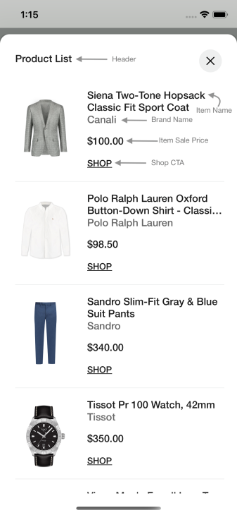
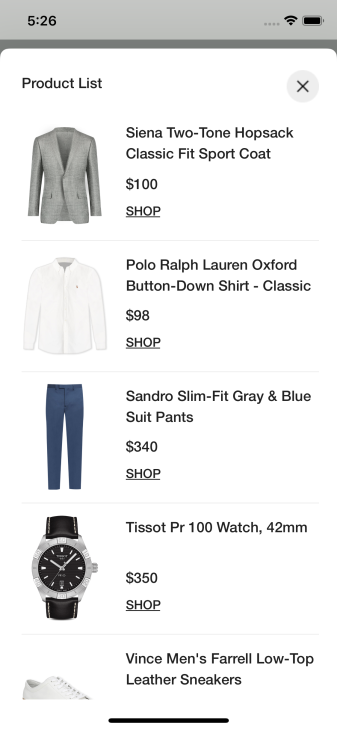
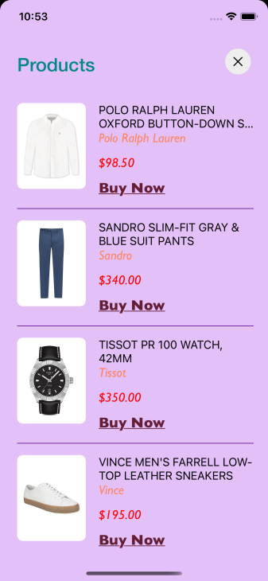
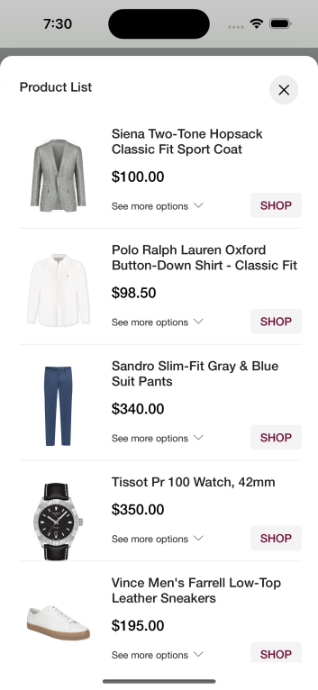
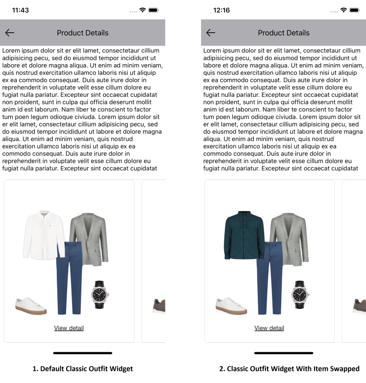
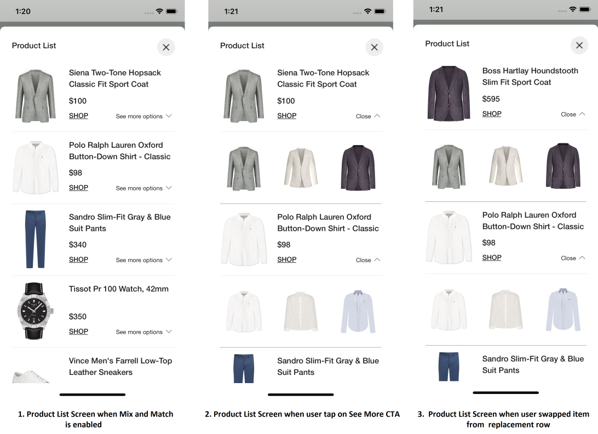
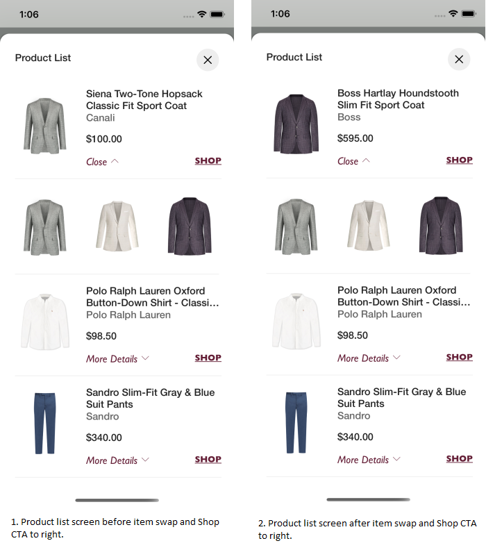

# STANDARD PRODUCT LIST

It provides views to display Stylitics data Outfit items. It also handles invoking of item tracking events based on user interaction with these views.

## Product List Screen

* This screen is displayed when user clicks on an Outfit.
* There are two different ways to show Product List Screen.
    1. Product List Screen From UX SDK
    2. Product List Screen From Sample Integrator App

### Product List Screen From UX SDK

Below are the features for Product List Screen 
- Configure all the UI elements for Product List Screen.
- Handles Outfit Item `View` and `Click` tracking events so Sample Integrator App does not have to do it.
- Provides listeners to Sample Integrator App so they can handle the Outfit Item `View` and `Click` events.
- If Sample Integrator App does not implement Outfit Item click listener, a Web View is opened when user selects an Outfit Item.

*Note - It is recommended that Sample Integrator App always provides the `onOutfitItemClick` listener implementation.*

### Product List Screen Configurations



### Header

  
| Fields | Description | Default Value |
| --- | --- | --- |
| `title` | to set the title of the text  | `Product List` |
| `productListScreenHeaderAlign` | to set the product list screen title alignment. It will be center aligned when the value is CENTER | `top` |  
| `fontFamilyAndWeight` | is the font style with the font weight  | `Helvetica Neue medium` |
| `fontSize` | is the size in CGFloat  | `16px` |
| `fontColor` | is text color  | `#212121` |

### Presentation Style


| Fields | Description | Default Value |
| --- | --- | --- |
| `presentationStyle` | to set the product list presentation style  | `.automatic` |

### Item Name
  
| Fields | Description | Default Value |
| --- | --- | --- |
| `fontFamilyAndWeight` | is the font style with the font weight  | `Helvetica Neue medium` |
| `fontSize` | is the size in CGFloat  | `16px` |
| `fontColor` | is text color  | `#212121` |
| `titleTextTransform` | to change the case of item name text. When the value is upper it will appear in upper case | `none` |

### Brand Name
  
| Fields | Description | Default Value |
| --- | --- | --- |
| `showBrand` | to show or hide the brand name | `false` |
| `fontFamilyAndWeight` | is the font style with the font weight  | `Helvetica Neue medium` |
| `fontSize` | is the size in CGFloat  | `16px` |
| `fontColor` | is text color  | `#666666` |


### Item Price

| Fields | Description | Default Value |
| --- | --- | --- |
| `fontFamilyAndWeight` | is the text font style with the font weight  | `Helvetica Neue medium` |
| `fontSize` | is the font size in CGFloat  | `16px` |
| `priceFontColor` | to set item price text color  | `#212121` |
| `salePriceFontColor` | to set item sale price text color  | `#212121` |
| `strikeThroughPriceFontColor` | is strike through price text color  | `#757575` |
| `style` | is to show or hide the Strike Through Price | `.show` |
| `swapPricesPosition` | is boolean value, when it is false it shows strike through price first and then sale price. Vice versa when true | `false` |
| `decimal` | is the number of digits to show after decimal point and it is accepted as a integer  | `2` |

### Shop CTA

It can be used as a Text or Button, below are the configurations for both

### Shop Text

| Fields | Description | Default Value |
| --- | --- | --- |
| `title` | to set the title of the text  | `Shop` |
| `fontFamilyAndWeight` | is the font style with the font weight  | `Helvetica Neue medium` |
| `fontSize` | is the size in CGFloat  | `14px` |
| `fontColor` | is text color  | `#212121` |
| `position` | is to change shop text position to bottom left or bottom right side  | `.left` |

### Shop Button
    
| Fields | Description | Default Value |
| --- | --- | --- |
| `title` | to set the title of the text  | `Shop` |
| `fontFamilyAndWeight` | is the font style with the font weight  | `Helvetica Neue medium` |
| `buttonBackgroundColor` | is the shop button background color  | `#F5F5F5` |
| `fontSize` | is the size in CGFloat  | `14px` |
| `fontColor` | is text color  | `#212121` |
| `horizontalPadding` | is left and right padding of the shop button in CGFloat  | `16px` |
| `verticalPadding` | is top and bottom padding of the shop button in CGFloat  | `8px` |

### Show ScrollBar

| Fields | Description | Default Value |
| --- | --- | --- |
| `showScrollBar` | is Boolean value, to Show or Hide the vertical ScrollBar of Product List view | `false` |

### Product List Item Background Color

| Fields | Description | Default Value |
| --- | --- | --- |
| `itemBackgroundColor` | is to change Product List view background color | `#FFFFFF` |

### Product List Item Divider Color

| Fields | Description | Default Value |
| --- | --- | --- |
| `itemDividerColor` | is to change item divider color | `#EEEEEE` |

### Hide Anchor Item

| Fields | Description | Default Value for Classic | Default Value for Hotspot |
|---|---|---|---|
| `hideAnchorItem` | is to hide anchor item in Product list screen, it will be hidden when set to `true` | `false` | `true` |


[Click here](CODE_REFERENCE_README.md#Classic-Widget-Configuration-Samples) to find code references for different configuration examples.

### Product List Screen from UX SDK with Default Configurations

Below is the example of Product List Screen when Sample Integrator App chooses to use default UI configurations.

*_**Swift**_*

Below is the code to access Product List Screen from SDK.

It is recommended that Sample Integrator App provide the `onOutfitItemClick` listener implementation.

```swift
static func widgetWithProductListFromUXSDKAndAllDefaultConfigurations(outfits: Outfits) -> UIView {
    let productListListener = ProductListListener(onOutfitItemClick: { outfitInfo, outfitItemInfo in
        print("Outfit item click event triggered : outfitInfo: \(String(describing: outfitInfo.outfit.id)), outfitItemInfo: \(outfitItemInfo.position)")
        print("outfitItem otherClientItemId = \(String(describing: outfitItemInfo.outfitItem.otherClientItemIds))")
    })
    let productListScreenConfig = ProductListScreenConfig(productListListener: productListListener)
    let productListScreenTemplate = ProductListScreenTemplate.standard(productListScreenConfig: productListScreenConfig)
    return StyliticsUIApis.load(outfits: outfits,
                                outfitsTemplate: .classic(),
                                productListScreenTemplate: productListScreenTemplate)
}
```

- When Product List Screen is displayed from UX SDK, Sample Integrator App can choose to close it using below code.

```swift
StyliticsUIApis.closeProductListScreen()
```

- Below is the Product List screenshot when Sample Integrator App uses the default configurations



### Product List Screen from UX SDK with Custom Configurations

Below are the examples of Product List Screen when Sample Integrator App chooses to use custom configurations.

*_**Swift**_*

*_**1. With All Custom Configurations and Listeners**_*

```swift
private func widgetWithProductListFromUXSDKAndAllCustomConfigurations(outfits: Outfits) -> UIView {
    guard let itemNameFontColor = UIColor(named: "standard_product_list_item_name_font_color"),
          let productListBrandNameFontColor = UIColor(named: "standard_product_list_brand_name_font_color"),
          let strikeThroughColor = UIColor(named: "standard_product_list_item_price_strike_color"),
          let shopTextFontColor = UIColor(named: "standard_product_list_shop_text_font_color"),
          let productListScreenTitleFontColor = UIColor(named: "standard_product_list_screen_title_font_color"),
          let productListItemPriceFontColor = UIColor(named: "standard_product_list_item_price_font_color"),
          let productListItemSalePriceFontColor = UIColor(named: "standard_product_list_item_sale_price_font_color"),
          let productListItemBackgroundColor = UIColor(named: "standard_product_list_item_background_color"),
          let itemDividerBackgroundColor = UIColor(named: "standard_product_list_item_divider_color") else {
        return UIView()
    }
    let productListConfig = ProductListConfig(itemName: ProductListConfig.ItemName(fontFamilyAndWeight: "Gill Sans Medium",
                                                                                   fontSize: 19,
                                                                                   fontColor: itemNameFontColor,
                                                                                   titleTextTransform: .upper),
                                              brandName: ProductListConfig.BrandName(showBrand: true,
                                                                                     fontFamilyAndWeight: "Gill Sans Italic",
                                                                                     fontSize: 18,
                                                                                     fontColor: productListBrandNameFontColor),
                                              /**
                                               itemPrice - is to set ItemPrice configurations.
                                               priceFontColor - is the color configuration of actual price.
                                               salePriceFontColor - is the color configuration of sale price.
                                               strikeThroughPriceFontColor - is the color configuration of old price.
                                               style - is Hide or Show the strikeThroughPriceFontColor.
                                               swapPricesPosition - swaps the positions of Sale Price and Strike-Through Price.
                                               */
                                              itemPrice: ProductListConfig.ItemPrice(fontFamilyAndWeight: "Gill Sans Italic",
                                                                                     fontSize: 18,
                                                                                     priceFontColor: productListItemPriceFontColor,
                                                                                     salePriceFontColor: productListItemSalePriceFontColor,
                                                                                     strikeThroughPriceFontColor: strikeThroughColor,
                                                                                     style: .show,
                                                                                     swapPricesPosition: true,
                                                                                     decimal: 2),
                                              shop: .text(ProductListConfig.ShopText(title: "Buy Now",
                                                                                     fontFamilyAndWeight: "Gill Sans Bold",
                                                                                     fontSize: 20,
                                                                                     fontColor: shopTextFontColor)
                                              ),
                                              itemBackgroundColor: productListItemBackgroundColor,
                                              itemDividerColor: itemDividerBackgroundColor,
                                              hideAnchorItem: true
    )

    let productListListener = ProductListListener(onOutfitItemClick: { outfitInfo, outfitItemInfo in
        // Here, in addition to handling any integrator analytics, natively navigate the user to the selected item's PDP (or launch a quick shop experience).
        print("Outfit item click event triggered, outfitInfo : \(String(describing: outfitInfo.outfit.id)), outfitItemInfo : \(String(describing: outfitItemInfo.outfitItem.name))")
        print("outfitItem otherClientItemId = \(String(describing: outfitItemInfo.outfitItem.otherClientItemIds))")
    }, onOutfitItemView: { outfitInfo, outfitItemInfo in
        print("Outfit item view event triggered : \(String(describing: outfitInfo.outfit.id)), outfitItemInfo : \(String(describing: outfitItemInfo.outfitItem.name))")
    })

    let itemListHeader = ProductListScreenConfig.ItemListHeader(title: "Products",
                                                                productListScreenHeaderAlign: .centre,
                                                                fontSize: 26,
                                                                fontColor: productListScreenTitleFontColor)

    let productListScreenConfig = ProductListScreenConfig(itemListHeader: itemListHeader,
                                                          productListConfig: productListConfig,
                                                          productListListener: productListListener,
                                                          presentationStyle: .fullScreen,
                                                          showScrollBar: true)
    let productListScreenTemplate = ProductListScreenTemplate.standard(productListScreenConfig: productListScreenConfig)

    return StyliticsUIApis.load(outfits: outfits,
                                outfitsTemplate: .classic(),
                                productListScreenTemplate: productListScreenTemplate)
}
```
- Below is the Product List screenshot when Sample Integrator App uses the above configurations.

</br>

*_**2. With some custom configurations and listeners**_*

```swift
private func widgetWithProductListFromUXSDKAndSomeCustomConfigurations(outfits: Outfits) -> UIView {
    guard let shopButtonFontColor = UIColor(named: "standard_product_list_shop_button_font_color"),
          let productListItemSalePriceFontColor = UIColor(named: "standard_product_list_item_sale_price_font_color") else {
        return UIView()
    }
    let productListConfig = ProductListConfig(itemPrice: ProductListConfig.ItemPrice(fontSize: 18,
                                                                                     strikeThroughPriceFontColor: productListItemSalePriceFontColor,
                                                                                     style: .hide),
                                              shop: .button(ProductListConfig.ShopButton(fontSize: 14,
                                                                                         fontColor: shopButtonFontColor
                                                                                        )
                                              ))

    let productListListener = ProductListListener(onOutfitItemClick: { outfitInfo, outfitItemInfo in
        // Here, in addition to handling any integrator analytics, natively navigate the user to the selected item's PDP (or launch a quick shop experience).
        print("Outfit item click event triggered : outfitInfo : \(String(describing: outfitInfo.outfit.id)), outfitItemInfo : \(outfitItemInfo.position)")
        print("outfitItem otherClientItemId = \(String(describing: outfitItemInfo.outfitItem.otherClientItemIds))")
    })

    let productListScreenConfig = ProductListScreenConfig(productListConfig: productListConfig,
                                                          productListListener: productListListener)
    let productListScreenTemplate = ProductListScreenTemplate.standard(productListScreenConfig: productListScreenConfig)

    return StyliticsUIApis.load(outfits: outfits,
                                outfitsTemplate: .classic(),
                                productListScreenTemplate: productListScreenTemplate)
}
```
- Below is the Product List screenshot when Sample Integrator App uses the above configurations.



### Product List Screen From Sample Integrator App

If Sample Integrator App wants to implement their own Product List Screen, they need to implement Outfit click listener as shown below and create view on their own.

```swift
static func widgetWhenProductListFromIntegrator(outfits: Outfits) -> UIView {
    let listener = ClassicListener(onClick: { outfitInfo in
        /// To display Product List Screen (from Integrator) when user selects an Outfit
        ScreenDisplayUtility.showDetailsOverlayScreen(outfit: outfitInfo.outfit)
    })
    return StyliticsUIApis.load(outfits: outfits,
                                outfitsTemplate: .classic(classicListener: listener),
                                displayProductListFromSDK: false)
}
```
Sample Integrator can create their own Product List View or access and implement it from UX SDK as given below.

*_**1. Product List View with default configurations**_*

Below is the code to call your own Product List Screen. 

```swift
static func showDetailsOverlayScreen(outfit: Outfit) {
    DispatchQueue.main.async {
        let storyboard = UIStoryboard(name: Constants.CLASSIC_DISPLAY_STORYBOARD_IDENTIFIER,
                                      bundle: nil)
        let detailsOverlayViewController = storyboard.instantiateViewController(withIdentifier: Constants.DETAILS_OVERLAY_SCREEN_IDENTIFIER) as! DetailsOverlayViewController
        detailsOverlayViewController.viewModel.prepareData(outfit)
        UIApplication.shared.activeViewController?.present(detailsOverlayViewController, animated: true)
    }
}
```

```swift
func showProductListFromIntegrator() {
    if let outfit = viewModel.outfit {
        let outfitsView = StyliticsUIApis.load(outfit: outfit,
                                               productListTemplate: .standard(productListListener: ProductListListener(onOutfitItemClick: { outfitInfo, outfitItemInfo in
            print("Outfit item click event triggered : outfitInfo: \(outfitInfo), outfitItemInfo: \(outfitItemInfo)")
        })))
        containerView.addSubviewConstraints(subview: outfitsView)
    }
}
```

*_**2. Product List View with custom configurations**_*

```swift
func showProductListFromIntegrator() {
    if let outfit = viewModel.outfit {
        let outfitsView = StyliticsUIApis.load(outfit: outfit,
                                               productListTemplate: .standard(productListConfig: ProductListConfig(itemName: ProductListConfig.ItemName(fontFamilyAndWeight: "Gill Sans Medium",
                                                                                                                                                        fontSize: 18),
                                                                                                                   itemPrice: ProductListConfig.ItemPrice(fontSize: 14,
                                                                                                                                                          strikeThroughPriceFontColor: UIColor(red: 0,
                                                                                                                                                                                               green: 128/255,
                                                                                                                                                                                               blue: 128/255,
                                                                                                                                                                                               alpha: 1),
                                                                                                                                                          style: .show,
                                                                                                                                                          decimal: 0),
                                                                                                                   shop: .text(ProductListConfig.ShopText(title: "Buy",
                                                                                                                                                          fontFamilyAndWeight: "Gill Sans Bold",
                                                                                                                                                          fontSize: 18,
                                                                                                                                                          fontColor: UIColor(red: 0,
                                                                                                                                                                             green: 0,
                                                                                                                                                                             blue: 128/255,
                                                                                                                                                                             alpha: 1))
                                                                                                                   )),
                                                                              productListListener: ProductListListener(onOutfitItemClick: { outfitInfo, outfitItemInfo in
            print("Outfit item click event triggered : outfitInfo : \(outfitInfo.position), outfitItemInfo : \(outfitItemInfo.position)")
        },
                                                                                                                       onOutfitItemView: { outfitInfo, outfitItemInfo in
            print("Outfit item view event triggered : outfitInfo : \(outfitInfo.position), outfitItemInfo : \(outfitItemInfo.position)")
        })))
        containerView.addSubviewConstraints(subview: outfitsView)
    }
}
```

## Mix and Match (MnM)

- Mix and Match (MnM) feature can be enabled or disabled from Sample Integrator App.
- [DATA SDK](DATA_SDK_README.md#mix-and-match) has more details to enable Mix & Match.
- When Mix and Match feature is enabled, user can swap items from -
    1. Classic Outfit Widget
    2. Product List View
    
### Classic Outfit Widget with Mix and Match enabled

- When Mix and Match is enabled
    * Swap action is disabled by default but Sample Integrator can enable it
    * Handles item swap tracking event and exposes its listener to Sample Integrator App, for item swap event
- Below is the example to enable swap action and implement the swap listener
 
```swift
private func widgetWithItemSwapEnabled(outfits: Outfits) -> UIView {
    StyliticsUIApis.load(outfits: outfits,
                         outfitsTemplate: .classic(classicListener: ClassicListener(onItemSwap: { outfitId, oldItemId, newItemId in
        print("Item swap event triggered, outfitId = \(outfitId), oldItemId = \(oldItemId), newItemId = \(newItemId)")
    }),
                                                   isItemSwapEnabled: true))
}
```

- Below is the Classic Outfit Widget screenshot when Sample Integrator App uses the above configurations.



### Product List Screen with Mix and Match

- When Mix and Match is enabled
    - See more options CTA will be displayed for each Outfit Item having Replacement Items.
    - User can swap item from replacement row in Product List.
    - Handles item swap tracking event and exposes its listener to Sample Integrator App, for item swap event.
    
### See more options
  
| Fields | Description | Default Value |
| --- | --- | --- |
| `title` | to set the title of the text  | `See more options` |
| `fontFamilyAndWeight` | is the font style with the font weight | `Helvetica Neue Regular` |
| `fontSize` | is the size in CGFloat  | `12px` |
| `fontColor` | is text color  | `#212121` |

*_**MnM with Default Configurations**_*

*_**Swift**_*

```swift
static func widgetWithItemSwapFeatureEnabled(outfits: Outfits) -> UIView {
    // When fetching outfits from the Server make sure Mix And Match is enabled to test below feature
    let productListListener = ProductListListener(onOutfitItemClick: { outfitInfo, outfitItemInfo in
        // Here, in addition to handling any integrator analytics, natively navigate the user to the selected item's PDP (or launch a quick shop experience).
        print("Item click event triggered, outfitInfo: \(String(describing: outfitInfo.outfit.id)), outfitItemInfo :\(outfitItemInfo.position)")
        print("outfitItem otherClientItemId = \(String(describing: outfitItemInfo.outfitItem.otherClientItemIds))")
    },
                                                  onItemSwap: { outfitId, oldItemId, newItemId in
        // When user swaps any item in Product List Screen, this will be
        print("Item swap event triggered, outfitId = \(outfitId), oldItemId = \(oldItemId), newItemId = \(newItemId)")
    })

    let productListScreenConfig = ProductListScreenConfig(productListListener: productListListener)
    let productListScreenTemplate = ProductListScreenTemplate.standard(productListScreenConfig: productListScreenConfig)

    return StyliticsUIApis.load(outfits: outfits,
                                outfitsTemplate: .classic(isItemSwapEnabled: true),
                                productListScreenTemplate: productListScreenTemplate)
}
```
*Note: When replacement row is open the title will change to Close and it is not configurable by Sample Integrator*.

- Below is the Product List screenshot when Sample Integrator App uses the above configurations.



*_**Classic Outfit Widget with some custom configurations for Product List**_*

By default Shop CTA is displayed on left and See more options CTA displayed on right. Sample Integrator can choose to display Shop CTA on right which automatically moves See more options CTA to left

```swift
static func widgetWithMnMCustomConfigurationsOnProductListScreen(outfits: Outfits) -> UIView {
    // When fetching outfits from the Server make sure Mix And Match is enabled to test below feature. Here is the link to know about Mix and Match - https://github.com/Stylitics/mobile-sdk-ui-ios-app/blob/main/DATA_SDK_README.md
    guard let shopTextFontColor = UIColor(named: "standard_product_list_shop_text_font_color"),
          let seeMoreFontColor = UIColor(named: "standard_product_list_see_more_font_color") else {
        return UIView()
    }
    let productListConfig = ProductListConfig(brandName: ProductListConfig.BrandName(showBrand: true),
                                              shop: .text(ProductListConfig.ShopText(fontFamilyAndWeight: "Gill Sans Bold",
                                                                                     fontColor: shopTextFontColor,
                                                                                     position: .right)
    ),
                                              seeMoreOptions: ProductListConfig.SeeMoreOptions(title: "More Details",
                                                                                               fontFamilyAndWeight: "Gill Sans Italic",
                                                                                               fontSize: 17,
                                                                                               fontColor: seeMoreFontColor))

    let productListListener = ProductListListener(onOutfitItemClick: { outfitInfo, outfitItemInfo in
        // Here, in addition to handling any integrator analytics, natively navigate the user to the selected item's PDP (or launch a quick shop experience).
        print("Item click event triggered, outfitInfo: \(String(describing: outfitInfo.outfit.id)), outfitItemInfo :\(outfitItemInfo.position)")
        print("outfitItem otherClientItemId = \(String(describing: outfitItemInfo.outfitItem.otherClientItemIds))")
    },
                                                  onItemSwap: { outfitId, oldItemId, newItemId in
        // When user swaps any item in Product List Screen, this will be triggered.
        print("Item swap event triggered, outfitId = \(outfitId), oldItemId = \(oldItemId), newItemId = \(newItemId)")
    })

    let productListScreenConfig = ProductListScreenConfig(productListConfig: productListConfig,
                                                          productListListener: productListListener)
    let productListScreenTemplate = ProductListScreenTemplate.standard(productListScreenConfig: productListScreenConfig)

    return StyliticsUIApis.load(outfits: outfits,
                                outfitsTemplate: .classic(),
                                productListScreenTemplate: productListScreenTemplate)
}
```
* Below is the Product List screenshot when Sample Integrator App uses the above configurations.

</br>

