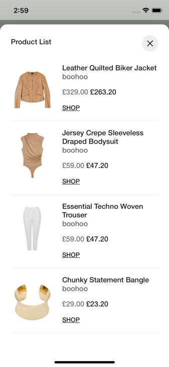

# Stylitics UX SDK

It provides views to display Stylitics data. It also handles invoking of tracking events based on user interaction with these views.

## Features

SDK provides multiple custom view options to Sample Integrator App so it can easily display Stylitics data.

1. Outfits
    * [Classic Outfit Widget](CLASSIC_WIDGET_README.md)
    * [Hotspot Outfit Widget](HOTSPOT_WIDGET_README.md)

2. Outfit Items
    * [Standard Product List View](STANDARD_PRODUCTLIST_README.md)

3. Replacements
    * Replacement View (Displayed internally from Product List View)

## Localization

Below is the screenshot with localized data when locale is configured to "en-gb".

 

*Note : When 'locale' is configured and the product items are displayed with the localized data, the price decimal parameter configuration will be ignored.*

## iOS Versioning Support

- Minimum required iOS APP version to access features of SDK is - (iOS 13.0)

## License

Copyright © 2023 Stylitics
