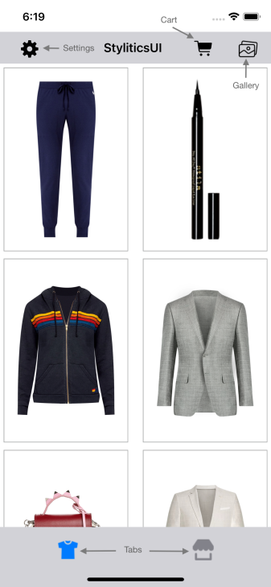
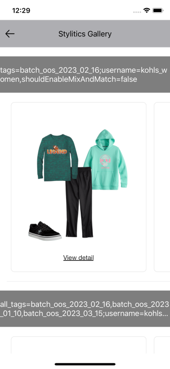
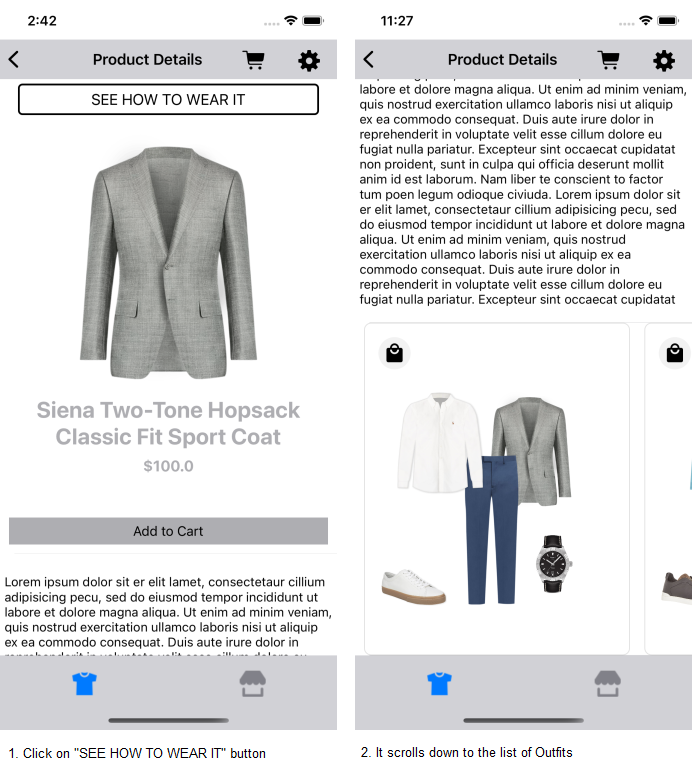
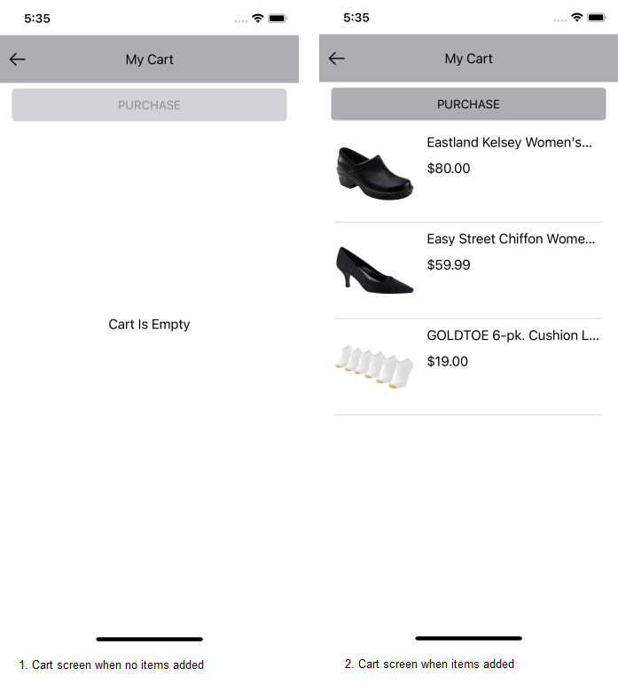
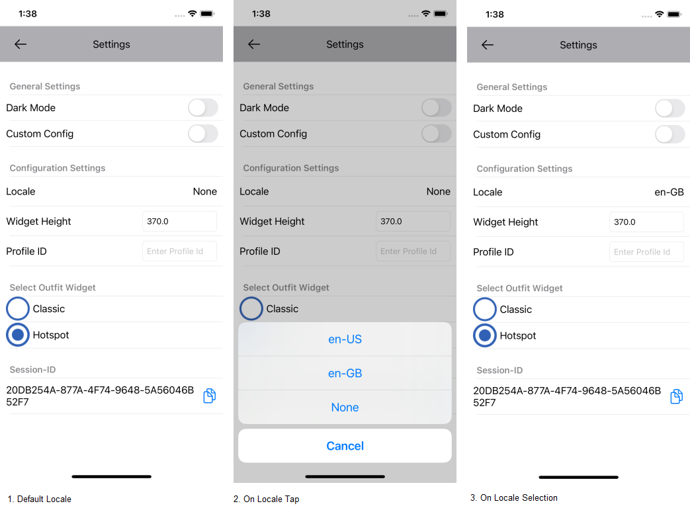

# Stylitics Sample Integrator App

This is a Sample Integrator application to showcase the integration of Stylitics Data & UX SDK.
- The Data SDK is used by Sample Integrator app to use Stylitics services. Currently the Data SDK provides services to fetch Outfits, replacements and send tracking events.
- The UX SDK provides views to display Stylitics data. For example, Classic Outfit widget can be used to display Outfits Data. These views automatically sends the required tracking events to Stylitics server which reduces efforts for the Integrator App.
- This file is an overview of the sample app, with a brief description of its screens and how it uses Stylitics SDKs; more detail can be found in the [DATA SDK README](DATA_SDK_README.md) and the [UX SDK README](UX_SDK_README.md).

## Dependency Manager

## CocoaPods

### Prerequisite
Make sure you have pod installed version > 1.9.0

*Note : To check pod version execute below command:*
```console
pod --version
```
If pod is not installed or version is less than 1.9.0 Execute below command to install or update pod.

```console
gem install cocoapods
```
*Note : Use the command below if a permissions-related problem arises.*
```console
sudo gem install cocoapods
```
    
### Steps To install Dependencies:

   * When Consumer already have podfile.
    
   Add below command in podfile and execute from step 3.

```console
pod ’StyliticsUX', '1.4.0', :source => "git@github.com:Stylitics/ios-sdk-cocoapods-artifacts.git"
```

   * When Consumer Does not have podfile.
    
   1. Open terminal and move inside consumer application folder using cd command.
```console
cd <path to project>/StyliticsSampleApp
```
   2. Create pod file using below command
```console
cat > Podfile <<-EOF
target 'StyliticsSampleApp' do
    use_frameworks!
    pod 'StyliticsUX', '1.4.0', :source => "git@github.com:Stylitics/ios-sdk-cocoapods-artifacts.git"
end
EOF
```
   3. Close any running instance of Xcode.
   4. Install dependencies using below command in terminal.
```console
pod install
```
   5. Open .xcworkspace

### Steps to update any particular version of framework

   * Update version in pod file like below:

```console
pod ’StyliticsUX', '1.4.0', :source => "git@github.com:Stylitics/ios-sdk-cocoapods-artifacts.git"
```
   * Run below command in terminal

```console
pod update
```

## Swift Package Manager

### Adding SPM Dependency in Xcode:

**Prerequisites:**
- Xcode installed on your machine.

**Instructions:**

1. **Open Your Xcode Project:**
   - Open your project in Xcode.

2. **Navigate to the Project Settings:**
   - Select your project in the Xcode Navigator to access the project settings.

3. **Select the Target:**
   - Under the "Targets" section, select the target for which you want to add the SPM dependency.

4. **Open the "Swift Packages" Tab:**
   - Navigate to the "Swift Packages" tab in the project settings.

5. **Add a New Package:**
   - Click on the "+" button to add a new package.

6. **Enter Package Repository URL:**
   - In the dialog that appears, enter the URL of the package repository:
     ```
     https://github.com/Stylitics/ios-ux-sdk-spm-artifacts.git
     ```

7. **Specify the Version:**
   - Choose to specify a version, branch, or commit.


8. **Add the Package:**
   - Click the "Add Package" button.

9. **Confirm Package Addition:**
   - Confirm that you want to add the package to your project.

10. **Wait for Xcode to Resolve Dependencies:**
    - Xcode will resolve and fetch the package. This process might take a moment.

11. **Use the Package:**
    - Once Xcode has finished fetching the package, you can start using the functionality provided by the `ios-ux-sdk-spm-artifacts` package in your project.

## Screens and Features

Sample app supports the below screens to showcase features of Stylitics Data and UX SDKs. 

### Configure Username and Environment
This screen lets the user select and configure the username and Environment. When user taps the *Build Store* button, the Data SDK's Config API is invoked to configure some required and optional configurations for the Data SDK.


### Sample Integrator Product Grid
When the "store" is ready, the user is shown two tabs. Both tabs show a grid of products that have outfit coverage (per the API server of the selected environment). Tapping on one brings the user to a sample PDP screen.

Tapping on -
* The gallery icon, the user will navigate to the Gallery screen
* The settings icon, the user will navigate to the Settings screen.
* The cart icon, the user will navigate to the Cart screen.
* The tab icon, the user can switch to another tab.

</br>

### Gallery

In this screen, we show multiple carousels for the outfits fetched from Stylitics server using different filters.

</br>

### PDP Screen 
On this screen, basic product details are shown, in addition to a recommended client-implemented feature (jumplink / "See How to Wear It"), and the app uses the Data SDK to fetch Outfits. It sends the Outfit response data to the UX SDK to display in the Outfits Widget.



### Jumplink - See How to Wear It
When user clicks on the "See Wow to Wear it" button in the Product details page,
   * It automatically scrolls down to the Outfits view created using UX SDK.
   * Sample Integrator App should invoke 'jumplinkClicked' event using engagements API in Data SDK.
   * When Outfits comes into the view port, UX SDK sends the Outfit 'view' event for the visible Outfits using engagement API in Data SDK.
   * When user selects one of the Outfit, they are navigated to the Product List screen. 

*Note : If there are no outfits for an item, the **See how to wear it** button will be hidden.*

*Note: this is a feature that Stylitics recommend the integrator app put in place; it is not a component provided by the Stylitics UX SDK, currently.*

### Add To Cart
When user taps on Add to Cart CTA in the PDP page, 
* The Item will be added to the Cart.
* Sample Integrator app sends the [`add-to-cart`](DATA_SDK_README.md#Item-add-to-cart-event) tracking event using Data SDK's engagements API.

### Cart Screen
This screen shows the list of product items added by user and they can purchase all the product items from the Cart.
When user taps on `PURCHASE` button, Sample Integrator app sends the [`Purchase`](DATA_SDK_README.md#Purchase-event) tracking event using Data SDK's engagements API.



### Show Product Items
This screen shows the list of all Outfit items belonging to the selected Outfit from Product details page.When user enters this screen, the UX SDK sends item 'view' tracking event for the visible item using Data SDK's engagements API.

When user taps on any item in the list:
- The UX SDK sends the `outfitItemClicked` tracking event using Data SDK's engagements API.
- The UX SDK calls a corresponding listener function, which can be provided / attached by the integrator. All key UX events fire a similar callback/listener function. Many are useful for integrator-specific analytics attachments, but this one is particularly important because Stylitics strongly recommends that the client/integrator implement and attach this callback in order to -- in addition to any integrator analytics -- natively navigate the user to the selected item's PDP (or launch a quick shop experience).
- If the item click listener is not implemented by Sample Integrator App, it redirects to the web view when an item is clicked.

### Settings Screen

1. Enable/Disable Dark Mode
   
   Users can switch application's appearance using this option, by default it reflects the device's appearance setting.

2. Enable/Disable Custom Configuration

   With this option, users can switch to the custom configuration for UX SDK UI components. By default, it is disabled.

3. Change Locale

    This shows the current locale selection in the app and also provides an option to change the locale in global configuration.
    
4. Widget Height
    
    With this option, users can change the Outfit widget view height in Sample/Integrator App.
    
5. Profile Id 

    It provides an option to change Customer Profile Id in global configuration. It also shows the current value for Customer Profile Id.

6. Select Outfit Widget

   With this option, users can change the template for UX SDK UI components used to display Outfits. By default, it is set to Hotspot.

7. Session-ID

   This is a UUID generated in DataSDK, user can view and copy this Id to clipboard.

   

## Tracking Events
This is to track the user's interaction with the App by calling the engagement API implemented in Data SDK.

### Invoked from Data SDK
- **Outfit load event** - When Data SDK receives the Outfit API response from the Stylitics server, it invokes this event.

### Invoked from UX SDK
- **Outfit view event** - When user enters the PDP page, UX SDK invokes this tracking event for all Outfits viewed by the user. This tracking event is sent once per Outfit page session.
- **Outfit item view event** - UX SDK sends this event for all items in the Product list that are viewed by the user.
- **Outfit click event** - When user clicks on any Outfit in the Classic Outfit Widget, UX SDK invokes this event.
- **Outfit item click event** - When user clicks on any Outfit item in the Product list view, UX SDK invokes this event.
- **Outfit item swap event** - UX SDK sends this tracking event when a swap happens in Product List screen or Outfit collage.

### Invoked from Sample Integrator app
- Jumplink Clicked event - This event is invoked when user clicks on "See How To Wear It" button on the PDP page. 
- Purchase events (See Data SDK README)

---

[Click here](CODE_REFERENCE_README.md) for reference to files in the Sample Application that uses Data and UX SDK features.

---

### Configure Data SDK
There are some configurations which are required to access Data SDK features. [Click here](DATA_SDK_README.md#sdk-configuration) to know about the SDK configuration details.

### Fetch Outfits
Fetch Outfits data using Outfits API provided by the Data SDK. [Here](DATA_SDK_README.md#fetch-outfits-using-item-number) are the code examples for fetching the Outfits.

### Display Outfits
Use UX SDK views to display the Stylitics data provided by the Data SDK. [Click here](UX_SDK_README.md) to know more about the UX SDK views and their configurations.

### Implement Exposed Listeners
Outfit and ProductList screen exposes below list of listeners to the Sample Integrator app.

**For Outfit**:
  1. `onClick` - On click event of Outfit, this listener will be triggered.
  2. `onView` - On view event of Outfit, this listener will be `triggered`.
  3. `onItemSwap` - On swap event of item in Outfit collage, this listener will be triggered.

**For Product List**:
  1. `onOutfitItemClick` - On click event of Outfit Item, this listener will be triggered. It is highly recommended that Integrator app should implement this listener.
  2. `onOutfitItemView` - On view event of Outfit Item, this listener will be triggered.
  3. `onItemSwap` - On swap event of item in Product List screen, this listener will be triggered.

### Purchase Events
This event should be triggered by Sample Integrator app when user purchases any item provided by Stylitics data. It will help Stylitics server to provide better recommendations for the user. [Click here to read about Purchase Event implementation](DATA_SDK_README.md#purchase-event).

### Mix And Match
When this feature is enabled, it enables the user to view replacements for the Outfit items.

* *_**Enable Mix and Match**_* - 
    [Click here](DATA_SDK_README.md#Mix-and-Match) to learn about enabling/disabling the mix and match feature.

* *_**Configure Mix and Match**_* - 
    [Click here](STANDARD_PRODUCTLIST_README.md#classic-outfit-widget-with-mix-and-match-enabled) to configure Mix and Match UI feature.

* *_**See more options**_* -  When user clicks on this button, UX SDK shows a list of all replacement items received from the Data SDK belonging to the selected item.

* *_**Swap item in Outfit collage**_* - When user clicks on any item in Outfit collage, it will be replaced with the next item from its available replacements. For swapping it iterates through the replacement item list. When it reaches to the last item, it starts from the first item(default item) in the list. [Here](STANDARD_PRODUCTLIST_README.md#classic-outfit-widget-with-mix-and-match-enabled) are more details and a code example to enable item swapping feature with direct tap on an item in the Outfit collage.

* *_**Swap item in Product List**_* - When user clicks on any item in the replacements row, the currently displayed item will be replaced with the clicked item.
  [Here](STANDARD_PRODUCTLIST_README.md#product-list-screen-with-mix-and-match) are more details and a code example to enable the item swapping feature in Product list screen.

### Memory Management
It is advised to clear data for an Outfit template view(ex. Classic Widget) whenever it's getting removed from screen.
   * To clear data on any particular action(ex. close) or event call below method:

```Swift
StyliticsUIApis.clearData(for: requestId)
```

   * To clear data when view is released call it in `deinit` like below:

```Swift
deinit {
    guard let requestId = outfits.list.first?.requestId else {
        return
    }
    StyliticsUIApis.clearData(for: requestId)
}
```

* *_**Note**_*
   1. `requestId` is present in outfit and outfitItem model.
   2. If memory is released when Outfit template view(ex. Classic Widget) is in use it could lead to crash.

### Refresh Outfit Widget

**Overview**

The `refreshTemplate` method can be used to update the Outfit widget data or its configurations or both.

**Example**

```swift
import StyliticsUI

// Refresh with both new data and config
func refreshTemplate(view: UIView, outfits: Outfits? = nil, widgetConfig: IWidgetConfig? = nil)
```

**Parameters**

- `view`: `outfitsView` returned by Stylitics UX SDK to display Outfits using `StyliticsUIApis.load` method.
- `outfits`: Optional parameter to provide updated Outfits data.
- `widgetConfig`: Optional parameter to provide updated configurations for Outfits template.

**Usage**

Call the method with the view and optional data/config.

- Get the Outfit Widget Template
```swift
// Load Outfit Widget Template
let outfitsView = StyliticsUIApis.load(outfits: outfits, outfitsTemplate: .classic())
```

- To refresh the Outfit Widget Template with new Outfit data
```Swift
StyliticsUIApis.refreshTemplate(view: outfitsView, outfits: newOutfits)
```
- To refresh the Outfit Widget Template with new config
```Swift
StyliticsUIApis.refreshTemplate(view: outfitsView, widgetConfig: newConfig)
```

- To refresh the Outfit Widget Template with both new Outfit data and config
```Swift
StyliticsUIApis.refreshTemplate(view: outfitsView, outfits: newOutfits, widgetConfig: newConfig)
```


## Light And Dark Mode support

The UX SDK provides the default Light and Dark mode support and it is customizable from the Sample Integrator App. [Click here ](DARK_AND_LIGHT_MODE_README.md) to learn more about it.

## Technologies Used

Below technologies are used for implementing the Sample Integrator App.

- Xcode as IDE(**v** 13.3.1)
- Swift as programming language(**v** 5)
- Storyboards for UI implementation
- SwiftLint as quality assurance tool(**v** 0.46.4)

## iOS Versioning Support

- Minimum required iOS APP version to access features of SDK is - (iOS 13.0)

## License

Copyright © 2023 Stylitics
