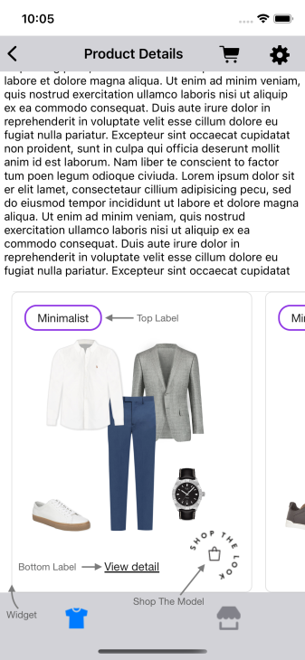
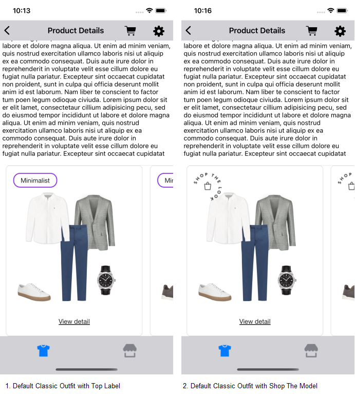
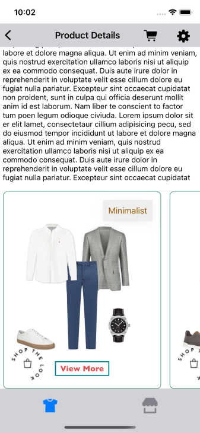
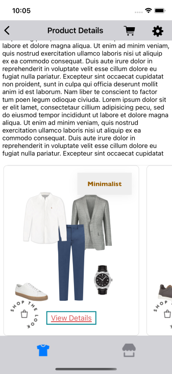
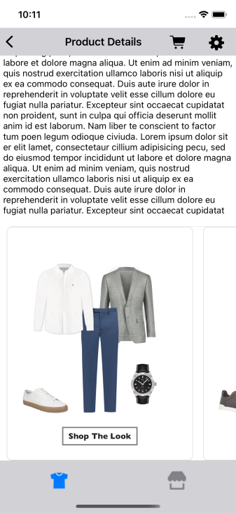

# CLASSIC WIDGET

It provides view to display Stylitics data Outfit widget. It also handles invoking of Widget tracking events based on user interaction with these views.

## Classic Outfit Widget

Below are the features for Classic Outfit Widget.</br>

* Configure all the UI elements for each Outfit
* Handles Outfit `View` and `Click` tracking events so Sample Integrator App does not have to do it
* Provides listeners to Sample Integrator App so they can handle the Outfit View and Click events
* Configure whether to display Outfit Items directly from SDK or not
    * When Outfit Items configured to display from SDK, Sample Integrator App can provide configs for it

### Classic Outfit Widget Configurations:



### Widget Background

| Fields | Description | Default Value | Dark mode |
| --- | --- | --- | --- |
| `borderColor` | is the widget border color | `#E1E1E1` | `#E1E1E1` |
| `borderWeight` | is the widget border weight | `1px` |
| `cornerRadius` | is the widget corner radius | `8px` |
| `backgroundColor` | is the widget background color | `#FFFFFF` | `#FFFFFF` |

### Top Label

UX SDK provides various Label styles for the Top Label. [Click here](LABELS_README.md) to learn more about it.

### Bottom Label

| Fields | Description | Default Value | Dark mode |
|---|---|---| --- |
| `title` | to set the title of the label | `View Detail` |
| `fontFamilyAndWeight` | is the font style with the font weight | `Helvetica Neue regular` |
| `fontSize` | is the font size in CGFloat | `14px` |
| `fontColor` | is text color | `#212121` | `#212121` |
| `showUnderLine` | to HIDE or SHOW the underline for label | `true(Show Underline)` |
| `paddingVertical` | is top and bottom padding of the button in CGFloat | `0px` |
| `paddingHorizontal` | is left and right padding of the button in CGFloat| `0px` |
| `backgroundColor` | is background color | `clear` | `#FFFFFF` |
| `borderColor` | to set border color and | `NA` |
| `borderWeight` | is border width | `0px` |
| `cornerRadius` | is border corner radius | `0px` |
| `bottomSpacing` | is to set space between the bottom of label and bottom of widget | `24px` |

### Shop The Model

| Fields | Description | Default Value |
| --- | --- | --- |
| `name` | is the name of image to be displayed for Shop the model badge | `Mandatory` |
| `position` | is to change the badge position to the Top Left, Top Right, Bottom Left and Bottom Right. 16px to the top and the left is the default padding | `topLeft` |
| `width` | is the width of image view in CGFloat  | `60px` |
| `height` | is the height of image view in CGFloat | `60px` |

### Show ScrollBar

| Fields | Description | Default Value |
| --- | --- | --- |
| `showScrollBar` | is Boolean value, to Show or Hide the horizontal ScrollBar of Classic Outfit widget | `false` |

### Widget Top Spacing

| Fields | Description | Default Value |
|---|---|---|
| `widgetTopSpacing` | is Float value to to set space between the top of Classic Outfit widget and Outfit ImageView top | `37.5px` |

### Top Label Position

| Fields | Description | Default Value |
|---|---|---|
| `topLabelPosition` | is to change the top label position to top left or top right | `topLeft` |

[Click here](CODE_REFERENCE_README.md#Classic-Widget-Configuration-Samples) to find code references for different configuration examples.

### Default Configurations:

Below are the examples of Classic Outfit Widget when Sample Integrator App chooses to use default UI configurations.</br>

- The Classic Outfit UI component can be implemented in below different ways.
    1. Product List enabled from SDK
    2. Product List disabled from SDK
    3. Configure Event Listeners
    4. Shop The Model

* Classic Outfit Widget supports different heights with the following constraints:
  1. Recommended height: 370
  2. Minimum supported height: 250
  3. Maximum supported height: 450

  If the integrator sets a height below 250 or above 450, they may experience UI glitches or overlapping issues.

*_**swift**_*

*_**1. Product List enabled from SDK:**_*

When product list is enabled from UX SDK and Sample Integrator App does not provide configurations, it will take default configurations from SDK.

```swift
static func widgetWithProductListFromUXSDK(outfits: Outfits) -> UIView {
    StyliticsUIApis.load(outfits: outfits,
                         outfitsTemplate: .classic())
}
```

*_**2. Product List disabled from SDK:**_*

```swift
static func widgetWhenProductListFromIntegrator(outfits: Outfits) -> UIView {
    let listener = ClassicListener(onClick: { outfitInfo in
        /// To display Product List Screen (from Integrator) when user selects an Outfit
        ScreenDisplayUtility.showDetailsOverlayScreen(outfit: outfitInfo.outfit)
    })
    return StyliticsUIApis.load(outfits: outfits,
                                outfitsTemplate: .classic(classicListener: listener),
                                displayProductListFromSDK: false)
}
```

*_**3. Configure Event Listeners:**_*

```swift
static func widgetWithListenersConfigured(outfits: Outfits) -> UIView {
    StyliticsUIApis.load(outfits: outfits,
                         outfitsTemplate: .classic(classicListener: ClassicListener(onClick: { outfitInfo in
        print("Outfit click event triggered : OutfitInfo : \(String(describing: outfitInfo.outfit.id))")
    }, onView: { outfitInfo in
        print("Outfit view event triggered : OutfitInfo : \(String(describing: outfitInfo.outfit.id))")
    })))
}
```

*_**4. Shop The Model:**_*

If in the Outfits response, `on-model-image` flag is true & Sample Integrator App provides a valid image for Shop The Model it will be displayed for the Outfit.

```swift
static func widgetWithShopTheModel(outfits: Outfits) -> UIView {
    StyliticsUIApis.load(outfits: outfits,
                         outfitsTemplate: .classic(classicConfig: ClassicConfig(shopTheModel: ShopTheModel(name: "shopTheLook"))))
}
```
**Default Classic Outfit Widget Screen**

- Below is the Classic Outfit Widget screenshot when Sample Integrator App uses the above configurations.



### Custom Configurations:

- Sample Integrator App can customise some or all configurations & implement listeners.
- Below are the examples of Classic Outfit Widget when Sample Integrator App customises configurations.

*_**1. With all custom configurations & Listeners:**_*
```swift
static func widgetWithAllCustomConfigurations(outfits: Outfits) -> UIView {
    guard let widgetBorderColor = UIColor(named: "classic_widget_border_color"),
          let topLabel6FontColor = UIColor(named: "classic_top_label6_font_color"),
          let topLabel6BackgroundColor = UIColor(named: "classic_top_label6_background_color"),
          let bottomLabelFontColor = UIColor(named: "classic_bottom_label_font_color"),
          let bottomLabelBorderColor = UIColor(named: "classic_bottom_label_border_color") else {
        return UIView()
    }
    let classicConfig = ClassicConfig(widget: ClassicConfig.Widget(borderColor: widgetBorderColor,
                                                                   backgroundColor: .clear,
                                                                   widgetTopSpacing: 40),
                                      topLabel: TopLabel(label6: TopLabel.Label6(fontFamilyAndWeight: "Gill Sans Medium",
                                                                                 fontSize: 14,
                                                                                 fontColor: topLabel6FontColor,
                                                                                 backgroundColorAfterAnimation: topLabel6BackgroundColor,
                                                                                 cornerRadius: 0,
                                                                                 paddingVertical: 8,
                                                                                 paddingHorizontal: 10)),
                                      bottomLabel: ClassicConfig.BottomLabel(title: "View More",
                                                                             fontFamilyAndWeight: "Gill Sans Bold",
                                                                             fontSize: 15,
                                                                             fontColor: bottomLabelFontColor,
                                                                             showUnderline: false,
                                                                             backgroundColor: .clear,
                                                                             borderColor: bottomLabelBorderColor,
                                                                             borderWeight: 2,
                                                                             paddingVertical: 5,
                                                                             paddingHorizontal: 10),
                                      shopTheModel: ShopTheModel(name: "shopTheLook",
                                                                 position: .bottomLeft,
                                                                 width: 60,
                                                                 height: 60), 
                                      topLabelPosition: .topRight)

    let classicListener = ClassicListener(onClick: { outfitInfo in
        print("Outfit click event triggered : \(String(describing: outfitInfo.outfit.id))")
    }, onView: { outfitInfo in
        print("Outfit view event triggered : \(String(describing: outfitInfo.outfit.id))")
    })

    return StyliticsUIApis.load(outfits: outfits,
                                outfitsTemplate: .classic(classicConfig: classicConfig,
                                                          classicListener: classicListener,
                                                          showScrollBar: true))
}
```
*Note : For Shop the model configuration, if height and width provided by Sample Integrator has different aspect ratio than the Image, it will leave some default space around the image and the image will be at the center.*

- Below is the Classic Outfit Widget screenshot when Sample Integrator App uses the above configurations.

</br>

*_**2. With some custom configurations & Listeners:**_*

If Sample Integrator App provides only few custom configurations, UX SDK will take default configurations for missing fields.

```swift
static func widgetWithSomeCustomConfigurations(outfits: Outfits) -> UIView {
    guard let topLabel6FontColor = UIColor(named: "classic_top_label6_font_color"),
          let topLabel6BackgroundColor = UIColor(named: "classic_top_label6_background_color"),
          let bottomLabelFontColor = UIColor(named: "classic_bottom_label_font_color"),
          let bottomLabelBorderColor = UIColor(named: "classic_bottom_label_border_color") else {
        return UIView()
    }
    let classicConfig = ClassicConfig(topLabel: TopLabel(label6: TopLabel.Label6(fontFamilyAndWeight: "Gill Sans Bold",
                                                                                 fontSize: 14,
                                                                                 fontColor: topLabel6FontColor,
                                                                                 backgroundColorAfterAnimation: topLabel6BackgroundColor,
                                                                                 cornerRadius: 0)),
                                      bottomLabel: ClassicConfig.BottomLabel(title: "View Details",
                                                                             fontFamilyAndWeight: "Gill Sans Medium",
                                                                             fontSize: 15,
                                                                             fontColor: bottomLabelFontColor,
                                                                             borderColor: bottomLabelBorderColor,
                                                                             borderWeight: 2,
                                                                             paddingVertical: 5,
                                                                             paddingHorizontal: 10),
                                      shopTheModel: ShopTheModel(name: "shopTheLook",
                                                                 position: .bottomLeft),
                                      topLabelPosition: .topRight)

    return StyliticsUIApis.load(outfits: outfits,
                                outfitsTemplate: .classic(classicConfig: classicConfig,
                                                          classicListener: ClassicListener(onClick: { outfitInfo in
        print("Outfit click event triggered : \(String(describing: outfitInfo.outfit.id))")
    })))
}
```

- Below is the Classic Outfit Widget screenshot when Sample Integrator App uses the above configurations.

</br>

</br>*_**3. Bottom label configuration to display border without overlap with Outfit image:**_*

```swift
static func widgetWithBottomLabelBorder(outfits: Outfits) -> UIView {
    StyliticsUIApis.load(outfits: outfits,
                         outfitsTemplate: .classic(classicConfig: ClassicConfig(bottomLabel: ClassicConfig.BottomLabel(title: "Shop The Look",
                                                                                                                       fontFamilyAndWeight: "Gill Sans Bold",
                                                                                                                       fontSize: 13,
                                                                                                                       showUnderline: false,
                                                                                                                       borderColor: .gray,
                                                                                                                       borderWeight: 2,
                                                                                                                       paddingVertical: 7,
                                                                                                                       paddingHorizontal: 10))))
}
```

* Below is the Classic Outfit Widget screenshot when Sample Integrator App uses the above configurations.

</br>

### Refresh Classic Outfit Widget

**Overview**

The `refreshTemplate` method can be used to update the Classic Outfit widget data or its configurations or both.

**Example**

```swift
import StyliticsUI

// Refresh with both new data and config
func refreshTemplate(view: UIView, outfits: Outfits? = nil, widgetConfig: IWidgetConfig? = nil)
```

**Parameters**

- `view`: `outfitsView` returned by Stylitics UX SDK to display Outfits using `StyliticsUIApis.load` method.
- `outfits`: Optional parameter to provide updated Outfits data.
- `widgetConfig`: Optional parameter to provide updated configurations for Classic Outfits template.

**Usage**

Call the method with the view and optional data/config.

- Get the Classic Outfit Widget Template
```swift
// Load Classic Outfit Widget Template
let outfitsView = StyliticsUIApis.load(outfits: outfits, outfitsTemplate: .classic())
```

- To refresh the Classic Outfit Widget Template with new Outfit data
```Swift
StyliticsUIApis.refreshTemplate(view: outfitsView, outfits: newOutfits)
```
- To refresh the Classic Outfit Widget Template with new config
```Swift
StyliticsUIApis.refreshTemplate(view: outfitsView, widgetConfig: newConfig)
```

- To refresh the Classic Outfit Widget Template with both new Outfit data and config
```Swift
StyliticsUIApis.refreshTemplate(view: outfitsView, outfits: newOutfits, widgetConfig: newConfig)
```

## License

Copyright © 2023 Stylitics
