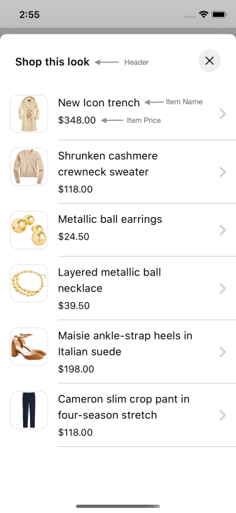

# DYNAMIC GALLERY PRODUCT LIST

It provides views to display Stylitics Dynamic GalleryBundleItems. It also handles invoking of item tracking events based on user interaction with these views.

## Gallery Product List Screen

* This screen is displayed when user clicks on an Dynamic Gallery widget `Shop this look` cta.
* There are two different ways to show Gallery Product List Screen.
    1. Product List Screen From UX SDK
    2. Product List Screen From Sample Integrator App

### Gallery Product List Screen From UX SDK

Below are the features for Gallery Product List Screen 
* Configure all the UI elements for Gallery Product List Screen
* Handles GalleryBundle Item `View` and `Click` tracking events so Sample Integrator App does not have to do it
* Provides listeners to Sample Integrator App so they can handle the GalleryBundle Item `View` and `Click` events
* If Sample Integrator App does not implement GalleryBundle Item click listener, a Web View is opened when user selects GalleryBundleItem

*Note - It is recommended that Sample Integrator App always provides the `onOutfitItemClick` listener implementation.*

### Product List Screen Configurations



### Header

| Fields | Description | Default Value |
| --- | --- | --- |
| `title` | to set the title of the text  | `Shop this look` | 
| `fontFamilyAndWeight` | is the font style with the font weight  | `SFPro Semibold` |
| `fontSize` | is the size in CGFloat  | `17px` |
| `fontColor` | is text color  | `#000000` |

### Presentation Style

| Fields | Description | Default Value |
| --- | --- | --- |
| `presentationStyle` | to set the product list presentation style  | `.automatic` |

### Item Name
  
| Fields | Description | Default Value |
| --- | --- | --- |
| `fontFamilyAndWeight` | is the font style with the font weight  | `SFPro Regular` |
| `fontSize` | is the size in CGFloat  | `17px` |
| `fontColor` | is text color  | `#000000` |
| `productNameVerticalSpacing` | to set the spacing between two lines of product name  | `2px` |

### Item Price

| Fields | Description | Default Value |
| --- | --- | --- |
| `fontFamilyAndWeight` | is the text font style with the font weight  | `SFPro Regular` |
| `fontSize` | is the font size in CGFloat  | `15px` |
| `priceFontColor` | to set item price text color  | `#000000` |
| `salePriceFontColor` | to set item sale price text color  | `#000000` |
| `strikeThroughPriceFontColor` | is strike through price text color  | `#3C3C43` |
| `style` | is to show or hide the Strike Through Price | `.show` |
| `swapPricesPosition` | is boolean value, when it is false it shows strike through price first and then sale price. Vice versa when true | `false` |
| `decimal` | is the number of digits to show after decimal point and it is accepted as a integer  | `2` |

### Product List Background Color

| Fields | Description | Default Value |
| --- | --- | --- |
| `backgroundColor` | is to change Product List view background color | `#FFFFFF` |

### Image Color

| Fields | Description | Default Value |
| --- | --- | --- |
| `imageBackgroundColor` | is to change Product List image background color | `#FFFFFF` |
| `imageBorderColor` | is to change Product List image border color | `#212121` |

### Product List Item Border Color

| Fields | Description | Default Value |
| --- | --- | --- |
| `itemBorderColor` | is to change item divider color | `#212121` |

### Padding

| Fields | Description | Default Value |
| --- | --- | --- |
| `paddingVerical` | is vertical spacing between header view and product name | `12px` |
| `paddingHorizontal` | is horizontal spacing between leading edge and image | `16px` |
| `productDetailsPadding` | is horizontal spacing between image and product content | `16px` |

[Click here](CODE_REFERENCE_README.md#dynamic-gallery-product-list-configuration-samples) to find code references for different configuration examples.

### Product List Screen from UX SDK with Default Configurations

Below is the example of Product List Screen when Sample Integrator App chooses to use default UI configurations.

*_**Swift**_*

Below is the code to access Product List Screen from SDK.

It is recommended that Sample Integrator App provide the `onOutfitItemClick` listener implementation.

```swift
static func widgetWithProductListFromUXSDKAndAllDefaultConfigurations(galleryBundles: GalleryBundles) -> UIView {
    let productListListener = GalleryProductListListener(onOutfitItemClick: { _, bundleItemInfo in
        print("bundle item click event triggered : \(bundleItemInfo)")
    },
                                                         onOutfitItemView: { _, bundleItemInfo in
        print("bundle item view event triggered : \(bundleItemInfo)")
    })

    let productListScreenConfigs = GalleryProductListScreenConfig(galleryProductListInfo: DynamicGalleryProductListInfo(productListListener: productListListener))
    return StyliticsUIApis.load(galleryBundles: galleryBundles,
                                galleryProductListScreenConfig: productListScreenConfigs)

}
```

- When Product List Screen is displayed from UX SDK, Sample Integrator App can choose to close it using below code.

```swift
StyliticsUIApis.closeProductListScreen()
```

- Below is the Product List screenshot when Sample Integrator App uses the default configurations


### Product List Screen from UX SDK with Custom Configurations

Below are the examples of Product List Screen when Sample Integrator App chooses to use custom configurations.

*_**Swift**_*

*_**1. With All Custom Configurations and Listeners**_*

```swift
static func widgetWithProductListFromUXSDKAndAllCustomConfigurations(galleryBundles: GalleryBundles) -> UIView {
    let backgroundColor = UIColor(named: "dynamic_gallery_product_list_background_color")!
    let productListConfigs = GalleryProductListConfig(itemName: GalleryProductListConfig.ItemName(fontFamilyAndWeight: "Gill Sans Italic",
                                                                                                  fontSize: 17,
                                                                                                  fontColor: .purple,
                                                                                                  productNameVerticalSpacing: 5),
                                                      itemPrice: GalleryProductListConfig.ItemPrice(fontFamilyAndWeight: "Gill Sans Bold",
                                                                                                    fontSize: 20,
                                                                                                    priceFontColor: .systemGreen,
                                                                                                    salePriceFontColor: .blue,
                                                                                                    strikeThroughPriceFontColor: .red,
                                                                                                    style: .show,
                                                                                                    decimal: 0,
                                                                                                    priceVerticalSpacing: 5),
                                                      backgroundColor: backgroundColor,
                                                      imageBackgroundColor: .systemGray5,
                                                      imageBorderColor: .blue,
                                                      itemBorderColor: .blue)

    let productListListener = GalleryProductListListener(onOutfitItemClick: { _, bundleItemInfo in
        print("bundle item click event triggered : \(bundleItemInfo)")
        },
                                                         onOutfitItemView: { _, bundleItemInfo in
        print("bundle item view event triggered : \(bundleItemInfo)")
    })

    let headerConfigs = GalleryProductListScreenConfig.ItemListHeader(title: "Product List",
                                                                      productListScreenHeaderAlign: .centre,
                                                                      fontFamilyAndWeight: "Gill Sans Bold",
                                                                      fontColor: .black)

    let productListScreenConfigs = GalleryProductListScreenConfig(itemListHeader: headerConfigs,
                                                                  galleryProductListInfo: DynamicGalleryProductListInfo(productListConfig: productListConfigs,
                                                                                                                        productListListener: productListListener),
                                                                  presentationStyle: .fullScreen)

    return StyliticsUIApis.load(galleryBundles: galleryBundles,
                                galleryProductListScreenConfig: productListScreenConfigs)
}
```
- Below is the Product List screenshot when Sample Integrator App uses the above configurations.

</br>

*_**2. With some custom configurations and listeners**_*

```swift
static func widgetWithProductListFromUXSDKAndSomeCustomConfigurations(galleryBundles: GalleryBundles) -> UIView {
    let productListConfigs = GalleryProductListConfig(itemName: GalleryProductListConfig.ItemName(fontFamilyAndWeight: "Gill Sans Italic",
                                                                                                  fontColor: .purple),
                                                      itemPrice: GalleryProductListConfig.ItemPrice(fontFamilyAndWeight: "Gill Sans Bold",
                                                                                                    fontSize: 20,
                                                                                                    priceFontColor: .systemGreen,
                                                                                                    decimal: 0))
    
    let productListListener = GalleryProductListListener(onOutfitItemClick: { _, bundleItemInfo in
        print("bundle item click event triggered : \(bundleItemInfo)")
        },
                                                         onOutfitItemView: { _, bundleItemInfo in
        print("bundle item view event triggered : \(bundleItemInfo)")
    })

    let productListScreenConfigs = GalleryProductListScreenConfig(galleryProductListInfo: DynamicGalleryProductListInfo(productListConfig: productListConfigs,
                                                                                                                        productListListener: productListListener),
                                                                  presentationStyle: .fullScreen)

    return StyliticsUIApis.load(galleryBundles: galleryBundles,
                                galleryProductListScreenConfig: productListScreenConfigs)
}
```
- Below is the Product List screenshot when Sample Integrator App uses the above configurations.


### Product List Screen From Sample Integrator App

If Sample Integrator App wants to implement their own Product List Screen, they need to implement Outfit click listener as shown below and create view on their own.

```swift
static func widgetWhenProductListFromIntegrator(galleryBundles: GalleryBundles) -> UIView {
    let listener = DynamicGalleryListener(onClick: { galleryBundleInfo in
        ScreenDisplayUtility.showDynamicGalleryOverlayScreen(galleryBundleInfo: galleryBundleInfo)
    })

    return StyliticsUIApis.load(galleryBundles: galleryBundles,
                                dynamicGalleryInfo: DynamicGalleryInfo(listener: listener),
                                displayProductListFromSDK: false)
}
```
Sample Integrator can create their own Product List View or access and implement it from UX SDK as given below.

*_**1. Product List View with default configurations**_*

Below is the code to call your own Product List Screen. 

```swift
static func showDynamicGalleryOverlayScreen(galleryBundleInfo: GalleryBundleInfo) {
    DispatchQueue.main.async {
        let storyboard = UIStoryboard(name: Constants.CLASSIC_DISPLAY_STORYBOARD_IDENTIFIER,
                                      bundle: nil)
        let detailsOverlayViewController = storyboard.instantiateViewController(withIdentifier: Constants.GALLERY_OVERLAY_SCREEN_IDENTIFIER) as! DynamicGalleryViewController
        detailsOverlayViewController.viewModel.prepareData(galleryBundleInfo)
        if let tabViewController = UIApplication.shared.activeViewController as? UITabBarController {
            (tabViewController.selectedViewController as? UINavigationController)?.pushViewController(detailsOverlayViewController, animated: true)
            return
        }
        UIApplication.shared.activeViewController?.present(detailsOverlayViewController, animated: true)
    }
}
```

```swift
func showProductListFromIntegrator() {
    if let galleryBundleInfo = viewModel.galleryBundleInfo {
        let productListView = StyliticsUIApis.load(bundleInfo: galleryBundleInfo,
                                                   galleryProductListInfo: DynamicGalleryProductListInfo(productListListener: GalleryProductListListener(onOutfitItemClick: { galleryBundleInfo, galleryBundleItemInfo in
            print("galley bundle click event triggered : \(galleryBundleInfo) and \(galleryBundleItemInfo)")
        })))
        containerView.addSubviewConstraints(subview: productListView)
    }
}
```

*_**2. Product List View with custom configurations**_*

```swift
func showProductListFromIntegrator() {
    if let galleryBundleInfo = viewModel.galleryBundleInfo {
        let productListConfigs = GalleryProductListConfig(itemName: GalleryProductListConfig.ItemName(fontFamilyAndWeight: "Gill Sans Italic",
                                                                                                      fontSize: 17,
                                                                                                      fontColor: .purple,
                                                                                                      productNameVerticalSpacing: 5),
                                                          itemPrice: GalleryProductListConfig.ItemPrice(fontFamilyAndWeight: "Gill Sans Bold",
                                                                                                        fontSize: 20,
                                                                                                        priceFontColor: .systemGreen,
                                                                                                        salePriceFontColor: .blue,
                                                                                                        strikeThroughPriceFontColor: .red,
                                                                                                        style: .show,
                                                                                                        decimal: 0,
                                                                                                        priceVerticalSpacing: 5),
                                                          imageBackgroundColor: .systemGray5,
                                                          imageBorderColor: .blue,
                                                          itemBorderColor: .blue)
        let productListListener = GalleryProductListListener(onOutfitItemClick: { _, bundleItemInfo in
            print("bundle item click event triggered : \(bundleItemInfo)")
            },
                                                             onOutfitItemView: { _, bundleItemInfo in
            print("bundle item view event triggered : \(bundleItemInfo)")
        })

        let productListView = StyliticsUIApis.load(bundleInfo: galleryBundleInfo,
                                                   galleryProductListInfo: DynamicGalleryProductListInfo(productListConfig: productListConfigs,
                                                                                                         productListListener: productListListener))
        containerView.addSubviewConstraints(subview: productListView)
    }
}
```

## License

Copyright © 2023 Stylitics
