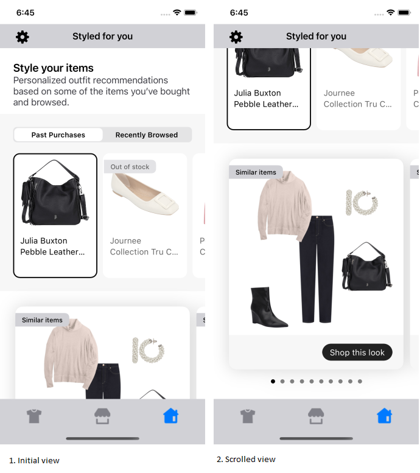
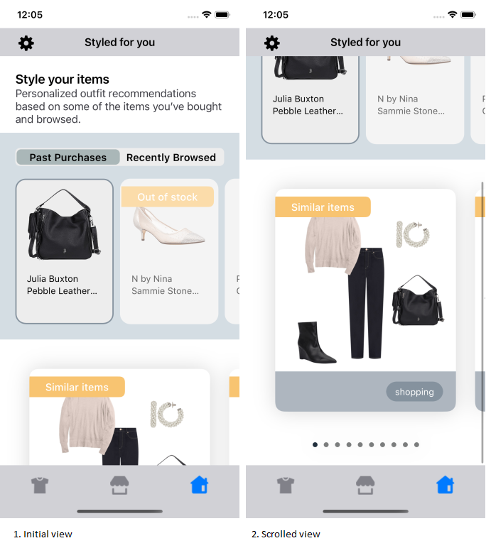
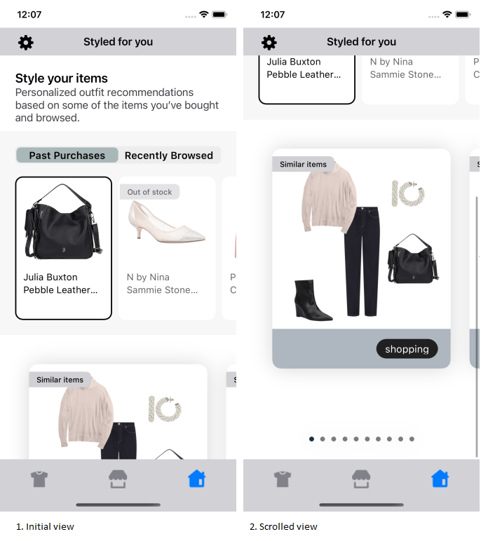

# STYLED FOR YOU WIDGET

It provides view to display Stylitics Styled For You data. It also handles invoking of Widget tracking events based on user interaction with these views.

Below are the features for Styled For You Widget.</br>

* Configure all the UI elements for Styled For You Widget
* Handles tracking events so Sample Integrator App does not have to do it
* Provides listeners to Integrator App so they can handle the events (if needed) based on user interaction.
* Configure whether to display Styled For You Bundle Items directly from SDK or not
* When Bundle Items are configured to display from SDK, Integrator App can provide configs for it.


### Styled For You Widget Configurations:


### Widget

| Fields | Description | Default Value |
| --- | --- | --- |
| `cardGutter` | is the space between two OutfitBundle cards in CGFloat | `12px` |


### TabContext

| Fields | Description | Default Value |
| --- | --- | --- |
| `backgroundColor` | is the context background color | `#767680` |
| `labelBackgroundColor` | is the context label background color | `#767680` |
| `labelSelectedBackgroundColor` | is the selected context label background color | `#FFFFFF` |
| `labelFontFamilyAndWeight` | is the context label font style with the font weight| `SFPro semibold` |
| `labelFontSize` | is the label title font size in CGFloat | `13px` |
| `labelFontColor` | is the label title color | `#000000` |


### AnchorItems

| Fields | Description | Default Value |
| --- | --- | --- |
| `backgroundColor` | is the anchor item list view background color | `#F7F7F7` |
| `selectedBorderColor` | is the selected anchor item's border color | `#000000` |
| `itemBackgroundColor` | is the anchor item card background color | `#FFFFFF` |
| `itemCornerRadius` | is the anchor item card corner radius in CGFloat | `12px` |
| `cardGutterWidth` | is the space between anchor item cards in CGFloat | `10px` |
| `cardPaddingVertical` | is top and bottom spacing for the content inside the card in CGFloat | `8px` |
| `cardPaddingHorizontal` | is left and right spacing for the content inside the card in CGFloat | `13px` |
| `productNameFontColor` | is the product name font color | `#000000` |
| `productNameFontFamilyAndWeight` | is the product name font style with the font weight | `SFPro Regular` |
| `productNameFontSize` | is the product name font size in CGFloat | `15px` |
| `contextNameFontColor` | is the context text font color | `#000000` |
| `contextNameFontFamilyAndWeight` | is the context text font style with the font weight | `SFPro Regular` |
| `contextNameFontSize` | is the context text font size in CGFloat | `13px` |
| `contextDateFormat` | is the date format for the date displayed in the context | `mm_dd_yy` |
| `priceDecimal` | is the number of digits to show after decimal point and it is accepted as a integer | `2` |
| `priceFontColor` | is the item price font color | `#808080` |
| `priceFontFamilyAndWeight` | is the item price font style with the font weight | `SFPro Semibold` |
| `priceFontSize` | is the font size of item price displayed in CGFloat | `13px` |
| `salePriceFontColor` | is the item sale price font color | `#808080` | |
| `strikeThroughPriceFontColor` | is strike through price text color | `#808080` |
| `style` | is to show or hide the strike through price | `show` |
| `swapPricesPosition` | is boolean value, when it is false it shows strike through price first and then sale price. Vice versa when true | `false` |

Integrator App can customize the `contextDateFormat` by selecting from the available date format options defined in the UX SDK, listed below.
  1. `mm_dd_yy`
  2. `dd_mm_yy`
  3. `mm_dd_yyyy`
  4. `dd_mm_yyyy`
  

### OutOfStock

| Fields | Description | Default Value |
| --- | --- | --- |
| `badgeFontColor` | is the badge font color | `#000000` |
| `badgeFontFamilyAndWeight` | is the badge font style with the font weight | `SFPro Medium` |
| `badgeFontSize` | is the badge font size in CGFloat | `12px` |
| `badgeVerticalSpacing` | is top and bottom spacing for the badge's content in CGFloat | `4px` |
| `badgeHorizontalSpacing` | is left and right spacing for the badge's content in CGFloat | `12px` |
| `badgeBackgroundColor` | is the badge background color | `#D1D1D5` |


### SimilarItems

| Fields | Description | Default Value |
| --- | --- | --- |
| `badgeFontColor` | is the badge font color | `#000000` |
| `badgeFontFamilyAndWeight` | is the badge font style with the font weight | `SFPro Medium` |
| `badgeFontSize` | is the badge font size in CGFloat | `12px` |
| `badgeVerticalSpacing` | is top and bottom spacing for the badge's content in CGFloat | `4` |
| `badgeHorizontalSpacing` | is left and right spacing for the badge's content in CGFloat | `12px` |
| `badgeBackgroundColor` | is badge background color | `#D1D1D5` |


### BottomLabel

| Fields | Description | Default Value |
| --- | --- | --- |
| `ctaTitle` | to set the title of the label | `Shop this look` |
| `fontFamilyAndWeight` | is the label font style with the font weight | `SFPro Medium` |
| `fontSize` | is the label font size in CGFloat | `15px` |
| `fontColor` | is label text color | `#FFFFFF` |
| `backgroundColor` | is widget footer background color | `#F7F7F7` |
| `ctaBackgroundColor` | is label background color | `#202020` |
| `cornerRadius` | is border corner radius in CGFloat | `16px` |
| `ctaPaddingVertical` | is top and bottom spacing for the label's content in CGFloat | `7px` |
| `ctaPaddingHorizontal` | is left and right spacing for the label's content in CGFloat | `14px` |
| `paddingVertical` | is top and bottom spacing for the content inside widget footer in CGFloat | `16px` |
| `paddingHorizontal` |  is left and right spacing for the content inside widget footer in CGFloat | `20px` |


### Bullets

| Fields | Description | Default Value |
|---|---|---|
| `defaultColor` | to set the default bullet color | `#808080` |
| `highlightedColor` | to set highlighted bullet color | `#000000` |
| `paddingVertical` | is top and bottom spacing for the bullet view in CGFloat | `10px` |
           

[Click here](CODE_REFERENCE_README.md#styled-for-you-widget-configuration-samples) to find code references for different configuration examples.

### Implement Exposed Listener

Below are the list of Styled For You Widget listeners exposed to Sample Integrator App

  1. `onContextClick` - On click event of context label, this listener will be invoked.
  2. `onAnchorItemClick` - On click event of an anchor item, this listener will be invoked.
  3. `onAnchorItemView` - On view event of an anchor item, this listener will be invoked.
  4. `onOutfitClick` - On click event of Outfit bundle, this listener will be invoked..
  5. `onOutfitClickCTA` - On click event of `Shop this look` cta in Styled For You widget, this listener will be invoked.
  6. `onOutfitView` -  On view event of Outfit bundle, this listener will be invoked.


### Default Configurations:

Below are the examples of Styled For You Widget when Sample Integrator App chooses to use default UI configurations.</br>

- The Styled For You UI component can be implemented in below different ways.
    1. Product List enabled from SDK
    2. Product List disabled from SDK
    3. Configure Event Listeners

* The recommended height for the Styled For You Widget is `750`. 

*_**swift**_*

*_**1. Product List enabled from SDK:**_*

When product list is enabled from UX SDK and Sample Integrator App does not provide configurations, it will take default configurations from SDK.

```swift
static func widgetWithProductListFromUXSDK(styledForYou: StyledForYou) -> UIView {
    StyliticsUIApis.load(styledForYouData: styledForYou)
}
```
*_**2. Product List disabled from SDK:**_*

```swift
    let listener = StyledForYouListener(onOutfitClickCTA: { outfitBundleInfo in
            print("Styled for you onOutfitClickCTA: \(outfitBundleInfo)")
            // Display Product list screen from Integrator app
            ScreenDisplayUtility.showOutfitBundleOverlayScreen(outfitBundleInfo: outfitBundleInfo)
        })
    
    static func widgetWithoutProductListFromUXSDK(styledForYou: StyledForYou) -> UIView {
        StyliticsUIApis.load(styledForYouData: styledForYou,
                                    styledForYouInfo: StyledForYouInfo(listener: listener),
                                    displayProductListFromSDK: false)
    }
```

*_**3. Configure Event Listeners:**_*

```swift
    static var allCustomListener: StyledForYouListener {
        StyledForYouListener { contextType, contextItems in
            print("Styled for you onContextClick type: \(contextType)")
            for contextItem in contextItems {
                print("item name: \(contextItem.name ?? "")")
            }
        } onAnchorItemClick: { contextItemInfo in
            print("Styled for you onAnchorItemClick contextType: \(contextItemInfo.contextType), position: \(contextItemInfo.position), name: \(contextItemInfo.contextItem.name ?? "")")
        } onAnchorItemView: { contextItemInfo in
            print("Styled for you onAnchorItemView contextType: \(contextItemInfo.contextType), position: \(contextItemInfo.position), name: \(contextItemInfo.contextItem.name ?? "")")
        } onOutfitClick: { outfitBundleInfo in
            print("Styled for you onOutfitClick : \(outfitBundleInfo)")
        } onOutfitClickCTA: { outfitBundleInfo in
            print("Styled for you onOutfitClickCTA: \(outfitBundleInfo)")
        } onOutfitView: { outfitBundleInfo in
            print("Styled for you onOutfitView : \(outfitBundleInfo)")
        }
    }
```

### Default Styled For You Widget Screen

* Below is the Styled For You Widget screenshot when Sample Integrator App uses the above configurations.

</br></br>

### Custom Configurations:

- Sample Integrator App can customise some or all configurations & implement listeners.
- Below are the examples of Styled For You Widget when Sample Integrator App customises configurations.

*_**1. With all custom configurations & Listeners:**_*
```swift
     static var allCustomConfig: StyledForYouConfig {
        let contextBackgroundColor = UIColor(named: "styled_for_you_context_background_color")!
        let contextLabelBackgroundColor = UIColor(named: "styled_for_you_context_label_background_color")!
        let contextLabelSelectedBackgroundColor = UIColor(named: "styled_for_you_context_label_selected_background_color")!
        let contextTitleFontColor = UIColor(named: "styled_for_you_context_title_font_color")!
        let anchorItemsBackgroundColor = UIColor(named: "styled_for_you_anchor_items_background_color")!
        let anchorItemsSelectedBorderColor = UIColor(named: "styled_for_you_anchor_items_selected_border_color")!
        let anchorItemBackgroundColor = UIColor(named: "styled_for_you_anchor_item_background_color")!
        let anchorItemProductNameFontColor = UIColor(named: "styled_for_you_anchor_item_product_name_font_color")!
        let anchorItemContextNameFontColor = UIColor(named: "styled_for_you_anchor_item_context_name_font_color")!
        let anchorItemPriceFontColor = UIColor(named: "styled_for_you_anchor_item_price_font_color")!
        let anchorItemSalePriceFontColor = UIColor(named: "styled_for_you_anchor_item_sale_price_font_color")!
        let anchorItemSalePriceStrikeColor = UIColor(named: "styled_for_you_anchor_item_sale_price_strike_color")!
        let outOfStockBadgeFontColor = UIColor(named: "styled_for_you_out_of_stock_badge_font_color")!
        let outOfStockBadgeBackgroundColor = UIColor(named: "styled_for_you_out_of_stock_badge_background_color")!
        let similarItemsBadgeFontColor = UIColor(named: "styled_for_you_similar_items_badge_font_color")!
        let similarItemsBadgeBackgroundColor = UIColor(named: "styled_for_you_similar_items_badge_background_color")!
        let bottomLabelTitleFontColor = UIColor(named: "styled_for_you_bottom_label_title_font_color")!
        let bottomLabelBackgroundColor = UIColor(named: "styled_for_you_bottom_label_background_color")!
        let bottomLabelTitleBackgroundColor = UIColor(named: "styled_for_you_bottom_label_title_background_color")!
        let bulletDefaultColor = UIColor(named: "styled_for_you_bullet_default_color")!
        let bulletHighlightedColor = UIColor(named: "styled_for_you_bullet_highlighted_color")!

        return StyledForYouConfig(widget: StyledForYouConfig.Widget(cardGutter: 30),
                                  tabContext: StyledForYouConfig.TabContext(backgroundColor: contextBackgroundColor,
                                                                            labelBackgroundColor: contextLabelBackgroundColor,
                                                                            labelSelectedBackgroundColor: contextLabelSelectedBackgroundColor,
                                                                            labelFontSize: 16,
                                                                            labelFontColor: contextTitleFontColor),
                                  anchorItems: StyledForYouConfig.AnchorItems(backgroundColor: anchorItemsBackgroundColor,
                                                                              selectedBorderColor: anchorItemsSelectedBorderColor,
                                                                              itemBackgroundColor: anchorItemBackgroundColor,
                                                                              itemCornerRadius: 16,
                                                                              cardPaddingVertical: 13,
                                                                              cardPaddingHorizontal: 18,
                                                                              productNameFontColor: anchorItemProductNameFontColor,
                                                                              productNameFontSize: 14,
                                                                              contextNameFontColor: anchorItemContextNameFontColor,
                                                                              contextNameFontSize: 12,
                                                                              contextDateFormat: .mm_dd_yyyy,
                                                                              priceDecimal: 4,
                                                                              priceFontColor: anchorItemPriceFontColor,
                                                                              priceFontSize: 16,
                                                                              salePriceFontColor: anchorItemSalePriceFontColor,
                                                                              strikeThroughPriceFontColor: anchorItemSalePriceStrikeColor,
                                                                              style: .hide),
                                  outOfStock: StyledForYouConfig.OutOfStock(badgeFontColor: outOfStockBadgeFontColor,
                                                                            badgeFontSize: 16,
                                                                            badgeVerticalSpacing: 5,
                                                                            badgeHorizontalSpacing: 25,
                                                                            badgeBackgroundColor: outOfStockBadgeBackgroundColor),
                                  similarItems: StyledForYouConfig.SimilarItems(badgeFontColor: similarItemsBadgeFontColor,
                                                                                badgeFontSize: 16,
                                                                                badgeVerticalSpacing: 5,
                                                                                badgeHorizontalSpacing: 25,
                                                                                badgeBackgroundColor: similarItemsBadgeBackgroundColor),
                                  bottomLabel: StyledForYouConfig.BottomLabel(ctaTitle: "shopping",
                                                                              fontSize: 14,
                                                                              fontColor: bottomLabelTitleFontColor,
                                                                              backgroundColor: bottomLabelBackgroundColor,
                                                                              ctaBackgroundColor: bottomLabelTitleBackgroundColor),
                                  bullet: StyledForYouConfig.Bullet(defaultColor: bulletDefaultColor,
                                                                    highlightedColor: bulletHighlightedColor,
                                                                    paddingVertical: 40))
    }

    
 static var allCustomListener: StyledForYouListener {
        StyledForYouListener { contextType, contextItems in
            print("Styled for you onContextClick type: \(contextType)")
            for contextItem in contextItems {
                print("item name: \(contextItem.name ?? "")")
            }
        } onAnchorItemClick: { contextItemInfo in
            print("Styled for you onAnchorItemClick contextType: \(contextItemInfo.contextType), position: \(contextItemInfo.position), name: \(contextItemInfo.contextItem.name ?? "")")
        } onAnchorItemView: { contextItemInfo in
            print("Styled for you onAnchorItemView contextType: \(contextItemInfo.contextType), position: \(contextItemInfo.position), name: \(contextItemInfo.contextItem.name ?? "")")
        } onOutfitClick: { outfitBundleInfo in
            print("Styled for you onOutfitClick : \(outfitBundleInfo)")
        } onOutfitClickCTA: { outfitBundleInfo in
            print("Styled for you onOutfitClickCTA: \(outfitBundleInfo)")
            ScreenDisplayUtility.showOutfitBundleOverlayScreen(outfitBundleInfo: outfitBundleInfo)
        } onOutfitView: { outfitBundleInfo in
            print("Styled for you onOutfitView : \(outfitBundleInfo)")
        }
 }
 
     private static var allConfigStyledForYouInfo: StyledForYouInfo {
        StyledForYouInfo(config: allCustomConfig, listener: allCustomListener)
    }

    static func widgetWithProductListFromUXSDKAndAllCustomConfigurations(styledForYou: StyledForYou) -> UIView {
        let productListScreenConfig = OutfitBundleProductListScreenConfig(outfitBundleProductListConfig: OutfitBundleProductListConfigSamples.productListConfig,
                                                                          outfitBundleProductListListener: OutfitBundleProductListConfigSamples.productListListener)
        return StyliticsUIApis.load(styledForYouData: styledForYou,
                                    styledForYouInfo: allConfigStyledForYouInfo,
                                    displayProductListFromSDK: false,
                                    outfitBundleProductListScreenConfig: productListScreenConfig)
    }
 
 ```
 
 - Below is the Styled For You Widget screenshot when Sample Integrator App uses the above configurations.

</br>

 
 *_**2. With some custom configurations & Listeners:**_*
 If Sample Integrator App provides only few configurations, UX SDK will take default configurations for missing fields.

```swift
    static func widgetWithSomeCustomConfigurations(styledForYou: StyledForYou) -> UIView {
        let contextBackgroundColor = UIColor(named: "styled_for_you_context_background_color")!
        let contextLabelBackgroundColor = UIColor(named: "styled_for_you_context_label_background_color")!
        let contextLabelSelectedBackgroundColor = UIColor(named: "styled_for_you_context_label_selected_background_color")!
        let contextTitleFontColor = UIColor(named: "styled_for_you_context_title_font_color")!
        let bottomLabelTitleFontColor = UIColor(named: "styled_for_you_bottom_label_title_font_color")!
        let bottomLabelBackgroundColor = UIColor(named: "styled_for_you_bottom_label_background_color")!
        let bulletDefaultColor = UIColor(named: "styled_for_you_bullet_default_color")!
        let bulletHighlightedColor = UIColor(named: "styled_for_you_bullet_highlighted_color")!

        let bottomCustomConfig = StyledForYouConfig(widget: StyledForYouConfig.Widget(cardGutter: 30),
                                                    tabContext: StyledForYouConfig.TabContext(backgroundColor: contextBackgroundColor,
                                                                                              labelBackgroundColor: contextLabelBackgroundColor,
                                                                                              labelSelectedBackgroundColor: contextLabelSelectedBackgroundColor,
                                                                                              labelFontSize: 16,
                                                                                              labelFontColor: contextTitleFontColor),
                                                    bottomLabel: StyledForYouConfig.BottomLabel(ctaTitle: "shopping",
                                                                                                fontSize: 16,
                                                                                                fontColor: bottomLabelTitleFontColor,
                                                                                                backgroundColor: bottomLabelBackgroundColor),
                                                    bullet: StyledForYouConfig.Bullet(defaultColor: bulletDefaultColor,
                                                                                      highlightedColor: bulletHighlightedColor,
                                                                                      paddingVertical: 100))
        return StyliticsUIApis.load(styledForYouData: styledForYou,
                                    styledForYouInfo: StyledForYouInfo(config: bottomCustomConfig,
                                                                       listener: allCustomListener))
    }
    
     
 ```
- Below is the Styled For You Widget screenshot when Sample Integrator App uses the above configurations.

</br>

### Refresh Styled For You Widget

**Overview**

The `refreshTemplate` method can be used to update the Styled For You widget data or its configurations or both.

**Example**

```swift
import StyliticsUI

// Refresh with both new data and config
func refreshTemplate(view: UIView, styledForYou: StyledForYou? = nil, widgetConfig: IWidgetConfig? = nil)

```
**Parameters**

- `view`: `styledForYouBundlesView` returned by Stylitics UX SDK to display Styled For You Bundles using `StyliticsUIApis.load` method.
- `styledForYou`: Optional parameter to provide updated Styled For You data.
- `widgetConfig`: Optional parameter to provide updated configurations for Styled For You template.

**Usage**

Call the method with the view and optional data/config.

- Get the Styled For You Widget Template
```swift
// Load Styled For You Template
let bundlesView = StyliticsUIApis.load(styledForYouData: styledForYou)
```

- To refresh the Styled For You Widget Template with new Styled For You data
```Swift
StyliticsUIApis.refreshTemplate(view: bundlesView, styledForYou: styledForYou, widgetConfig: StyledForYouConfigurationSample.widgetRefreshConfig)
    
```
- To refresh the Styled For You Widget Template with new config
```Swift
StyliticsUIApis.refreshTemplate(view: bundlesView, widgetConfig: newConfig)
```

- To refresh the Styled For You Widget Template with both new Styled For You data and config
```Swift
StyliticsUIApis.refreshTemplate(view: bundlesView, styledForYou: styledForYou, widgetConfig: newConfig)
```

## License

Copyright © 2023 Stylitics

