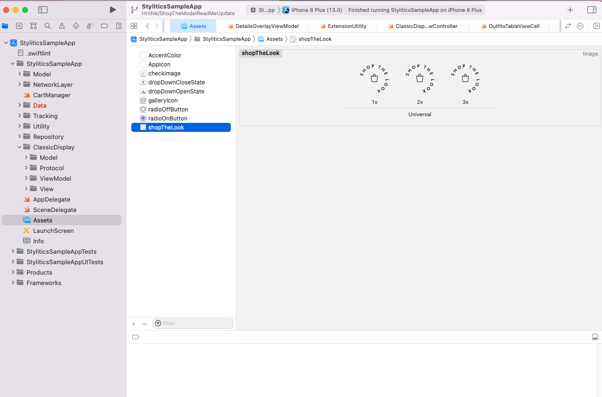

# Stylitics Sample App Code Reference 


### Configure Username and Environment

- *_**BuildViewController.swift**_* - This controller is used to display Configure Username and Environment screen.
- *_**BuildViewModel.swift**_* - This class handles the business logic.
  1. *_**configureApisHostEnvironment()**_* - This method is used to Configure the Data SDK.


### Show Product Items(Grid Screen)

- *_**ItemsViewController.swift**_* - This controller is used to display the Sample Product items.


### Show Styled For You Widget

- *_**StyledForYouViewController.swift**_* - This controller is used to display the Styled For You widget.
- *_**StyledForYouViewModel.swift**_* - This class fetches Stylitics Styled For You data from the server using Data SDK. 
     1. *_**loadData(isSuccess: @escaping (Bool) -> Void)**_* - This makes the Styled For You Api call using required filter parameters.


### Show Outfit Landing Page(OLP) Widget

- *_**OutfitLandingPageViewController.swift**_* - This controller is used to display the OLP widget.
- *_**OutfitLandingPageViewModel.swift**_* - This class fetches Stylitics OLP data from the server using Data SDK. 
     1. *_**loadData(isSuccess: @escaping (Bool) -> Void)**_* - This makes the OLP Api call using outfit id and required filter parameters.

### PDP Screen

- *_**ProductDetailsViewModel.swift**_* - This class fetches Stylitics Outfits data from the server using Data SDK. 
     1. *_**fetchOutfits(itemNumber: String, isSuccess: @escaping (Bool)()**_* - This makes the Outfits API call using item number.
     2. *_**fetchDynamicGalleries(isSuccess: @escaping (Bool) -> Void)**_* - This makes the Dynamic Galleries API call.
     2. *_**trackJumplinkClickedEvent()**_* - Invokes the `jumplinkclicked` tracking event when user taps the "See How To Wear It" button.
     
- *_**OutfitsTableViewCell.swift**_* - This table view cell is used to display the Outfits fetched using Data SDK.
     1. *_**getClassicDisplayWithProductListScreen(outfits: Outfits)**_* - This method loads the Classic Outfits Widget with the option to display Product List Screen from UX SDK. 
     2. *_**getClassicDisplayWithoutProductListScreen(outfits: Outfits)**_* - This is to load the Classic Outfits Widget. Here Integrator app has to implement their own Product list screen.
     
- *_**GridTableViewCell.swift**_* - This table view cell is used to display the Outfits fetched using Data SDK.
     1. *_**getGridDisplayWithProductListScreen(outfits: Outfits)**_* - This method loads the Grid Outfits Widget with the option to display Product List Screen from UX SDK. 
     2. *_**getGridDisplayWithoutProductListScreen(outfits: Outfits)**_* - This is to load the Grid Outfits Widget. Here Integrator app has to implement their own Product list screen.

- *_**BundlesTableViewCell.swift**_* - This table view cell is used to display the GalleryBundles fetched using Data SDK.
     1. *_**widgetWithProductListFromUXSDK(galleryBundles: galleryBundles)**_* - This method loads the Dynamic Gallery Widget with the option to display Product List Screen from UX SDK.
     2. *_**widgetAndProductListWithAllCustomConfigurations(galleryBundles: galleryBundles)**_* - This method loads the Dynamic Gallery Widget with all custom configs, and Product List will be displayed from Integrator App.
     
- *_**ShopTheSetTableViewCell.swift**_* - This table view cell is used to display the ShopTheSet fetched using Data SDK.
     1. *_**widgetWithDefaultConfigurations(shopTheSet: shopTheSet)**_* - This method loads the default Shop The Set Widget.
     2. *_**widgetWithAllCustomConfigurations(shopTheSet: shopTheSet)**_* - This method loads the Shop The Set Widget with all custom configs.  
   
## Cart Screen

Below are the implementation details for Cart page.

* **CartViewModel.swift** This class Handles the business logic for Cart screen.

* **CartItemTableViewCell.swift** This class is responsible for displaying the item added by user to the Cart.
  
### Product List Screen

- *_**DetailsOverlayViewController.swift**_* - This controller is used to display Outfit Items for the selected Outfit. It is used only when the option to display Product List Screen from UX SDK is disabled.

- *_**DynamicGalleryViewController.swift**_* - This controller is used to display Bundle Items for the selected Gallery Bundle. It is used only when the option to display Product List Screen from UX SDK is disabled.

## Shop The Model

Integrator app should add image for Shop The Model view in *_**Assets**_* as shown in below screenshot.

</br>

Shop The Model configuration can be done as below,

```swift
  ShopTheModel(name: "shopTheLook",
               position: .bottomLeft,
               width: 60,
               height: 60)
```

### Classic Widget Configuration Samples

*_**ClassicWidgetConfigurationSamples.swift**_* class has UI configuration examples for some and all custom configurations of Classic views.

### Hotspot Widget Configuration Samples

*_**HotspotWidgetConfigurationSamples.swift**_* class has UI configuration examples for some and all custom configurations of Hotspot views.

### Grid Widget Configuration Samples

*_**GridWidgetConfigurationSamples.swift**_* class has UI configuration examples for some and all custom configurations of Grid views.

### Standard Product List Configuration Samples

*_**StandardProductListConfigurationSamples.swift**_* class has UI configuration examples for some and all custom configurations of Standard Product List views.

### Dynamic Gallery Widget Configuration Samples

*_**DynamicGalleryWidgetConfigurationSamples.swift**_* class has UI configuration examples for some and all custom configurations of Dynamic Gallery views.

### Outfit Bundle Product List Configuration Samples

*_**OutfitBundleProductListConfigSamples.swift**_* class has UI configuration examples for some and all custom configurations of Outfit Bundle Product List views.

### Shop The Set Widget Configuration Samples

*_**ShopTheSetWidgetConfigurationSamples.swift**_* class has UI configuration examples for some and all custom configurations of Shop The Set views.

### Styled For You Widget Configuration Samples

*_**StyledForYouWidgetConfigurationSamples.swift**_* class has UI configuration examples for some and all custom configurations of Styled For You views.

### Outfit Landing Page(OLP) Widget Configuration Samples

*_**OutfitLandingPageConfigurationSamples.swift**_* class has UI configuration examples for some and all custom configurations of OLP views.

## License

Copyright © 2023 Stylitics
