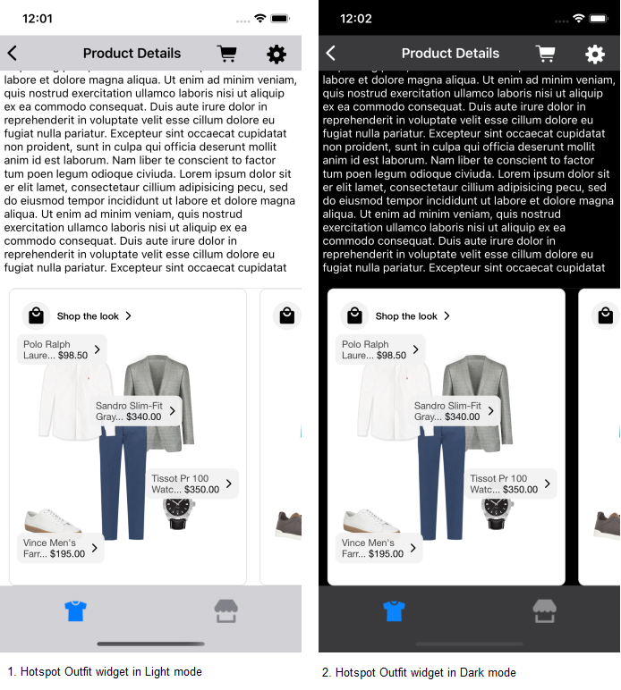

# Light and Dark Mode Support

This document provides the information about *_**Light and Dark mode support**_* for both default and custom configurations.

## Default Light and Dark Mode Support

Below are the implementation details for the *_**default Light and Dark mode**_* support for UI components implemented in UX SDK.

### 1. Classic Outfit Widget

**Screenshots :**


### 2. Hotspot Outfit Widget

No default dark mode support is added to the Hotspot Outfit Widget. In dark mode, the Outfit widget will be displayed with the same configurations as shown below.



### 3. Grid Outfit Widget

No default dark mode support is added to the Grid Outfit Widget. In dark mode, the Outfit widget will be displayed with the same configurations as shown below.


### 4. Dynamic Gallery Widget

No default dark mode support is added to the Dynamic Gallery Widget. In dark mode, the Dynamic Gallery Widget will be displayed with the same configurations as shown below.


### 5. Shop The Set Widget

No default dark mode support is added to the Shop The Set Widget. In dark mode, the Shop The Set Widget will be displayed with the same configurations as shown below.


### 6. Styled For You Widget

No default dark mode support is added to the Styled For You Widget. In dark mode, the Styled For You Widget will be displayed with the same configurations as shown below.


### 7. Outfit Landing Page(OLP) Widget

No default dark mode support is added to the OLP Widget. In dark mode, the OLP Widget will be displayed with the same configurations as shown below.


### 8. Standard Product List

**Screenshots :**


### 9. Outfit Bundle Product List

No default dark mode support is added to the Outfit Bundle Product List. In dark mode, the Outfit Bundle Product List will be displayed with the same configurations as shown below.

**Screenshots :**


## Custom Light and Dark Mode Support

The default Light and Dark mode colors can be customised by adding colors to the *_**Assets file**_*. Use *_**Any**_* to define Light mode colors and *_**Dark**_* to define Dark mode colors. Below is the screenshot for the reference.<br /><br />


**_**Note**_* : <br />1. If you select appearance to be of type *_**None**_*, the same color will be used in light and Dark mode. <br />*

Below are the implementation details to customise the Light and Dark mode support from Sample Integrator App.

### 1. Classic Outfit Widget

Below screenshot shows the Classic Outfit Widget in custom Light and Dark mode.

**Screenshots :**


### 2. Hotspot Outfit Widget

Below screenshot shows the Hotspot Outfit Widget in custom Light and Dark mode.

**Screenshots :**


### 3. Grid Outfit Widget

Below screenshot shows the Grid Outfit Widget in custom Light and Dark mode.

**Screenshots :**


### 4. Dynamic Gallery Widget

Below screenshot shows the Dynamic Gallery Widget in custom Light and Dark mode.

**Screenshots :**


### 5. Shop The Set Widget

Below screenshot shows the Shop The Set Widget in custom Light and Dark mode.

**Screenshots :**


### 6. Styled For You Widget

Below screenshot shows the Styled For You Widget in custom Light and Dark mode.

**Screenshots :**


### 7. Outfit Landing Page(OLP) Widget

Below screenshot shows the OLP Widget in custom Light and Dark mode.

**Screenshots :**


### 8. Standard Product List

Below screenshot shows the Standard Product List in custom Light and Dark mode.

**Screenshots :**


### 9. Outfit Bundle Product List

Below screenshot shows the Outfit Bundle Product List in custom Light and Dark mode.

**Screenshots :**


**Code example to customize the Dark And Light Mode colors**

```swift
func classicWidgetWithProductListFromUXSDKAndAllCustomConfigurations(outfits: Outfits) -> UIView {
    guard let itemNameFontColor = UIColor(named: "standard_product_list_item_name_font_color"),
          let productListBrandNameFontColor = UIColor(named: "standard_product_list_brand_name_font_color"),
          let strikeThroughColor = UIColor(named: "standard_product_list_item_price_strike_color"),
          let shopTextFontColor = UIColor(named: "standard_product_list_shop_text_font_color"),
          let productListScreenTitleFontColor = UIColor(named: "standard_product_list_screen_title_font_color"),
          let productListItemPriceFontColor = UIColor(named: "standard_product_list_item_price_font_color"),
          let productListItemSalePriceFontColor = UIColor(named: "standard_product_list_item_sale_price_font_color"),
          let productListItemBackgroundColor = UIColor(named: "standard_product_list_item_background_color"),
          let itemDividerBackgroundColor = UIColor(named: "standard_product_list_item_divider_color") else {
        return UIView()
    }
    let productListConfig = ProductListConfig(itemName: ProductListConfig.ItemName(fontFamilyAndWeight: "Gill Sans Medium",
                                                                                   fontSize: 19,
                                                                                   fontColor: itemNameFontColor,
                                                                                   titleTextTransform: .upper),
                                              brandName: ProductListConfig.BrandName(fontFamilyAndWeight: "Gill Sans Italic",
                                                                                     fontSize: 18,
                                                                                     fontColor: productListBrandNameFontColor),
                                              /**
                                               itemPrice - is to set ItemPrice configurations.
                                               priceFontColor - is the color configuration of actual price.
                                               salePriceFontColor - is the color configuration of sale price.
                                               strikeThroughPriceFontColor - is the color configuration of old price.
                                               style - is Hide or Show the strikeThroughPriceFontColor.
                                               swapPricesPosition - swaps the positions of Sale Price and Strike-Through Price.
                                               */
                                              itemPrice: ProductListConfig.ItemPrice(fontFamilyAndWeight: "Gill Sans Italic",
                                                                                     fontSize: 18,
                                                                                     priceFontColor: productListItemPriceFontColor,
                                                                                     salePriceFontColor: productListItemSalePriceFontColor,
                                                                                     strikeThroughPriceFontColor: strikeThroughColor,
                                                                                     style: .show,
                                                                                     swapPricesPosition: true,
                                                                                     decimal: 2),
                                              shop: .text(ProductListConfig.ShopText(title: "Buy Now",
                                                                                     fontFamilyAndWeight: "Gill Sans Bold",
                                                                                     fontSize: 20,
                                                                                     fontColor: shopTextFontColor)
                                              ),
                                              itemBackgroundColor: productListItemBackgroundColor,
                                              itemDividerColor: itemDividerBackgroundColor,
                                              hideAnchorItem: true
    )

    let productListListener = ProductListListener(onOutfitItemClick: { outfitInfo, outfitItemInfo in
        // Here, in addition to handling any integrator analytics, natively navigate the user to the selected item's PDP (or launch a quick shop experience).
        print("Outfit item click event triggered, outfitInfo : \(String(describing: outfitInfo.outfit.id)), outfitItemInfo : \(String(describing: outfitItemInfo.outfitItem.name))")
        print("outfitItem otherClientItemId = \(String(describing: outfitItemInfo.outfitItem.otherClientItemIds))")
    }, onOutfitItemView: { outfitInfo, outfitItemInfo in
        print("Outfit item view event triggered : \(String(describing: outfitInfo.outfit.id)), outfitItemInfo : \(String(describing: outfitItemInfo.outfitItem.name))")
    })

    let itemListHeader = ProductListScreenConfig.ItemListHeader(title: "Products",
                                                                productListScreenHeaderAlign: .centre,
                                                                fontSize: 26,
                                                                fontColor: productListScreenTitleFontColor)

    let productListScreenConfig = ProductListScreenConfig(itemListHeader: itemListHeader,
                                                          productListConfig: productListConfig,
                                                          productListListener: productListListener,
                                                          presentationStyle: .fullScreen,
                                                          showScrollBar: true)
    let productListScreenTemplate = ProductListScreenTemplate.standard(productListScreenConfig: productListScreenConfig)

    return StyliticsUIApis.load(outfits: outfits,
                                outfitsTemplate: .classic(),
                                productListScreenTemplate: productListScreenTemplate)
}
```

## In-App Dark Mode Support 

### Settings Screen

In this screen, user can enable/disable the dark mode manually from application.

Below is the reference code to programatically change light/dark mode

```swift
@IBAction func darkModeSwitchAction(_ sender: Any) {
    if #available(iOS 13.0, *) {
        let appDelegate = UIApplication.shared.windows.first
        if darkModeSwitch.isOn {
            appDelegate?.overrideUserInterfaceStyle = .dark
            viewModel.updateDarkModeState(true)
            return
        }
        appDelegate?.overrideUserInterfaceStyle = .light
        viewModel.updateDarkModeState(false)
        return
    }
}
```

### Disable Dark Mode

Use the below line of code to disable Dark mode in Integrator app and SDK.

```swift
let appDelegate = UIApplication.shared.windows.first
appDelegate?.overrideUserInterfaceStyle = .light
```

## iOS Versioning Support

- Minimum required iOS APP version to access features of SDK is - (iOS 13.0)

## License

Copyright © 2023 Stylitics
