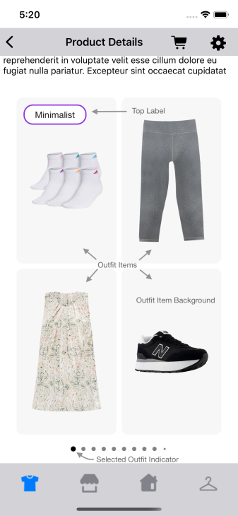
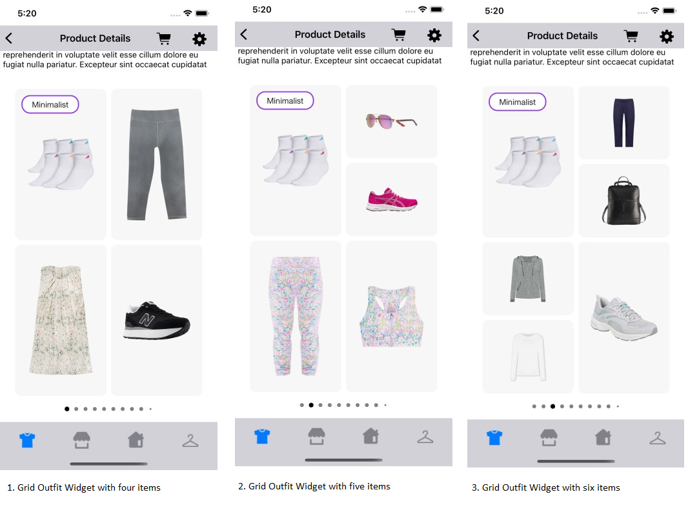
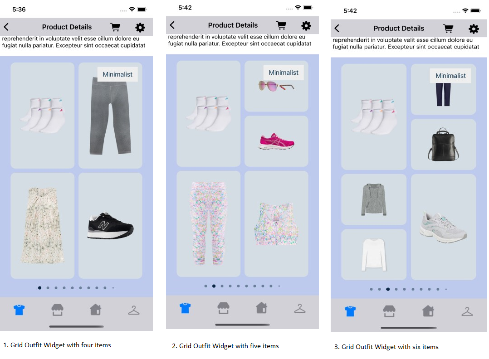
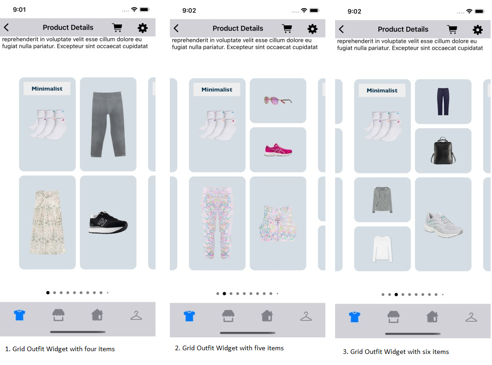

# GRID WIDGET

It provides view to display Stylitics data Outfit widget. It also handles invoking of Widget tracking events based on user interaction with these views.

## Grid Outfit Widget

Below are the features for Grid Outfit Widget.</br>

* Configure all the UI elements for each Outfit
* Handles Outfit `View` and `Click` tracking events so Integrator App does not have to do it
* Provides listeners to Integrator App so they can handle the Outfit View and Click events
* Configure whether to display Outfit Items directly from SDK or not
    * When Outfit Items configured to display from SDK, Integrator App can provide configs for it

### Grid Outfit Widget Configurations:



### Widget

| Fields | Description | Default Value |
| --- | --- | --- |
| `backgroundColor` | is the widget background color | `#FFFFFF` |
| `cardPeek` | is the previous and next Outfit card peek in CGFloat | `0px` |
| `cardGutter` | is the space between two adjacent outfit cards in CGFloat | `24px` |

### Top Label

UX SDK provides various Label styles for the Top Label. [Click here](LABELS_README.md) to learn more about it.

### Item Image

| Fields | Description | Default Value |
| --- | --- | --- |
| `backgroundColor` | is the item image background color | `#F7F7F7` |
| `padding` | is the vertical and horizontal padding between item images | `8px` |
| `cornerRadius` | is the item image corner radius | `10px` |

### Bullet

| Fields | Description | Default Value |
|---|---|---|
| `unselectedColor` | to set the unselected bullet color | `#F7F7F7` |
| `selectedColor` | to set the selected bullet color | `#000000` |
| `paddingVertical` | is the top and bottom padding of bullet in CGFloat | `10px` |
| `paddingHorizontal` | is the horizontal spacing between two adjacent bullets in CGFloat | `8px` |

### Show ScrollBar

| Fields | Description | Default Value |
| --- | --- | --- |
| `showScrollBar` | is Boolean value, to Show or Hide the horizontal ScrollBar of Grid Outfit widget | `false` |

### Top Label Position

| Fields | Description | Default Value |
|---|---|---|
| `topLabelPosition` | is to change the top label position to top left or top right | `topLeft` |

[Click here](CODE_REFERENCE_README.md#Grid-Widget-Configuration-Samples) to find code references for different configuration examples.

## Implement Exposed Listener`
Below are the list of Grid Outfit widget listeners exposed to the Integrator app. If Integrator wishes to implement their own product list screen they will have to provide the definition for widget `onOutfitClick` listener.

  1. `onOutfitClick` - On click event of Outfit, this listener will be triggered.
  2. `onOutfitView` - On view event of Outfit, this listener will be triggered.

### Default Configurations:

Below are the examples of Grid Outfit Widget when Sample Integrator App chooses to use default UI configurations.</br>

- The Grid Outfit UI component can be implemented in below different ways.
    1. Product List enabled from SDK
    2. Product List disabled from SDK
    3. Configure Event Listeners

* Grid Outfit Widget supports different heights, Integrator can use following ways to calculate Grid widget height 

*_**1. Manually calculated height**_*

```swift
func getGridWidgetHeight() -> CGFloat {
    let cardGutter: CGFloat = 24 // This parameter is configurable can be changed with custom configs
    let cardPeek: CGFloat = 0    // This parameter is configurable can be changed with custom configs
    let totalWidth = // This is device screen width
    let widgetItemWidth = totalWidth - (cardGutter * 2) - (cardPeek * 2)
    let widgetItemHeight = widgetItemWidth * 1.6718
    return widgetItemHeight + getBulletTotalHeight()
}

func getBulletTotalHeight() -> CGFloat {
    let bulletVerticalPadding: CGFloat = 10 // This parameter is configurable can be changed with custom configs
    let bulletContainerHeight: CGFloat = 25 // This parameter is fixed and not configurable
    return (bulletVerticalPadding * 2) + bulletContainerHeight
}
```

*_**2. Automatically calculated height**_*

```swift
func getGridWidgetHeight() -> CGFloat {
   UITableView.automaticDimension
}
```

*_**swift**_*

*_**1. Product List enabled from SDK:**_*

When product list is enabled from UX SDK and Integrator App does not provide configurations, it will take default configurations from SDK.

```swift
static func widgetWithProductListFromUXSDK(outfits: Outfits) -> UIView {
    StyliticsUIApis.load(outfits: outfits,
                         outfitsTemplate: .grid())
}
```

*_**2. Product List disabled from SDK:**_*

```swift
static func widgetWhenProductListFromIntegrator(outfits: Outfits) -> UIView {
    let listener = GridListener(onOutfitClick: { outfitInfo in
        /// To display Product List Screen (from Integrator) when user selects an Outfit Bundle
        ScreenDisplayUtility.showDetailsOverlayScreen(outfit: outfitInfo.outfit)
    })
    return StyliticsUIApis.load(outfits: outfits,
                                outfitsTemplate: .grid(gridInfo: GridInfo(listener: listener)),
                                displayProductListFromSDK: false)
}
```

*_**3. Configure Event Listeners:**_*

```swift
static func widgetWithListenersConfigured(outfits: Outfits) -> UIView {
    StyliticsUIApis.load(outfits: outfits,
                         outfitsTemplate: .grid(gridInfo: GridInfo(listener: GridListener(onOutfitView: { outfitInfo in
        print("Outfit view event triggered : outfitInfo : \(outfitInfo))")
    }, onOutfitClick: { outfitInfo in
        print("Outfit click event triggered : outfitInfo : \(outfitInfo)")
    }))))
}
```

**Default Grid Outfit Widget Screen**

- Below is the Grid Outfit Widget screenshot when Sample Integrator App uses the above configurations.



### Custom Configurations:

- Integrator App can customise some or all configurations & implement listeners.
- Below are the examples of Grid Outfit Widget when Sample Integrator App customises configurations.

*_**1. With all custom configurations & Listeners:**_*
```swift
static func widgetWithAllCustomConfigurations(outfits: Outfits) -> UIView {
    let widgetBackgroundColor = UIColor(named: "grid_widget_background_color")!
    let topLabelFontColor = UIColor(named: "grid_top_label6_font_color")!
    let topLabelBackgroundColor = UIColor(named: "grid_top_label6_background_color")!
    let itemImageBackgroundColor = UIColor(named: "grid_item_image_background_color")!
    let bulletUnselectedColor = UIColor(named: "grid_bullet_unselected_color")!
    let bulletSelectedColor = UIColor(named: "grid_bullet_selected_color")!
    let templateType = Template.grid

    let gridConfig = GridConfig(widget: GridConfig.Widget(backgroundColor: widgetBackgroundColor,
                                                          cardPeek: templateType.cardPeek(),
                                                          cardGutter: templateType.cardGutter()),
                                topLabel: TopLabel(label6: TopLabel.Label6(fontFamilyAndWeight: "Gill Sans Medium",
                                                                           fontSize: 14,
                                                                           fontColor: topLabelFontColor,
                                                                           backgroundColorAfterAnimation: topLabelBackgroundColor,
                                                                           cornerRadius: 0,
                                                                           paddingVertical: 8,
                                                                           paddingHorizontal: 10)),
                                itemImage: GridConfig.ItemImage(backgroundColor: itemImageBackgroundColor,
                                                                padding: 10,
                                                                cornerRadius: 12),
                                bullet: GridConfig.Bullet(unselectedColor: bulletUnselectedColor,
                                                          selectedColor: bulletSelectedColor,
                                                          paddingVertical: templateType.bulletVerticalPadding(),
                                                          paddingHorizontal: 12),
                                topLabelPosition: .topRight)

    let gridListener = GridListener(onOutfitView: { outfitInfo in
        print("Outfit view event triggered : \(outfitInfo)")
    }, onOutfitClick: { outfitInfo in
        print("Outfit click event triggered : \(outfitInfo)")
    })

    return StyliticsUIApis.load(outfits: outfits,
                                outfitsTemplate: .grid(gridInfo: GridInfo(config: gridConfig,
                                                                          listener: gridListener)))
}
```

</br>

*_**2. With some custom configurations & Listeners:**_*

If Integrator App provides only few custom configurations, UX SDK will take default configurations for missing fields.

```swift
static func widgetWithSomeConfigurations(outfits: Outfits) -> UIView {
    let topLabelFontColor = UIColor(named: "top_label6_font_color")!
    let topLabelBackgroundColor = UIColor(named: "top_label6_background_color")!
    let itemImageBackgroundColor = UIColor(named: "grid_item_image_background_color")!
    let topLabelBorderColor = UIColor(named: "top_label1_border_color")!
    let templateType = Template.grid

    let topLabelConfig = TopLabel(label1: TopLabel.Label1(fontFamilyAndWeight: "Gill Sans Bold",
                                                          fontSize: 14,
                                                          fontColor: topLabelFontColor,
                                                          backgroundColor: topLabelBackgroundColor,
                                                          borderColor: topLabelBorderColor,
                                                          cornerRadius: 0),
                                  label6: TopLabel.Label6(fontFamilyAndWeight: "Gill Sans Medium",
                                                          fontSize: 14,
                                                          fontColor: topLabelFontColor,
                                                          backgroundColorAfterAnimation: topLabelBackgroundColor),
                                  label7: TopLabel.Label7(fontColor: topLabelFontColor))

    let gridConfig = GridConfig(widget: GridConfig.Widget(cardPeek: 20,
                                                          cardGutter: templateType.cardGutter()),
                                topLabel: topLabelConfig,
                                itemImage: GridConfig.ItemImage(backgroundColor: itemImageBackgroundColor,
                                                                padding: 10,
                                                                cornerRadius: 12))

    let gridListener = GridListener(onOutfitClick: { outfitInfo in
        print("Outfit click event triggered : \(outfitInfo)")
    })

    return StyliticsUIApis.load(outfits: outfits,
                                outfitsTemplate: .grid(gridInfo: GridInfo(config: gridConfig,
                                                                          listener: gridListener)))
}
```

- Below is the Grid Outfit Widget screenshot when Sample Integrator App uses the above configurations.

</br>

### Refresh Grid Outfit Widget

**Overview**

The `refreshTemplate` method can be used to update the Grid Outfit widget data or its configurations or both.

**Example**

```swift
import StyliticsUI

// Refresh with both new data and config
func refreshTemplate(view: UIView, outfits: Outfits? = nil, widgetConfig: IWidgetConfig? = nil)
```

**Parameters**

- `view`: `outfitsView` returned by Stylitics UX SDK to display Outfits using `StyliticsUIApis.load` method.
- `outfits`: Optional parameter to provide updated Outfits data.
- `widgetConfig`: Optional parameter to provide updated configurations for Grid Outfits template.

**Usage**

Call the method with the view and optional data/config.

- Get the Grid Outfit Widget Template
```swift
// Load Grid Outfit Widget Template
let outfitsView = StyliticsUIApis.load(outfits: outfits, outfitsTemplate: .grid())
```

- To refresh the Grid Outfit Widget Template with new Outfit data
```Swift
StyliticsUIApis.refreshTemplate(view: outfitsView, outfits: newOutfits)
```
- To refresh the Grid Outfit Widget Template with new config
```Swift
StyliticsUIApis.refreshTemplate(view: outfitsView, widgetConfig: newConfig)
```

- To refresh the Grid Outfit Widget Template with both new Outfit data and config
```Swift
StyliticsUIApis.refreshTemplate(view: outfitsView, outfits: newOutfits, widgetConfig: newConfig)
```

## License

Copyright © 2023 Stylitics
