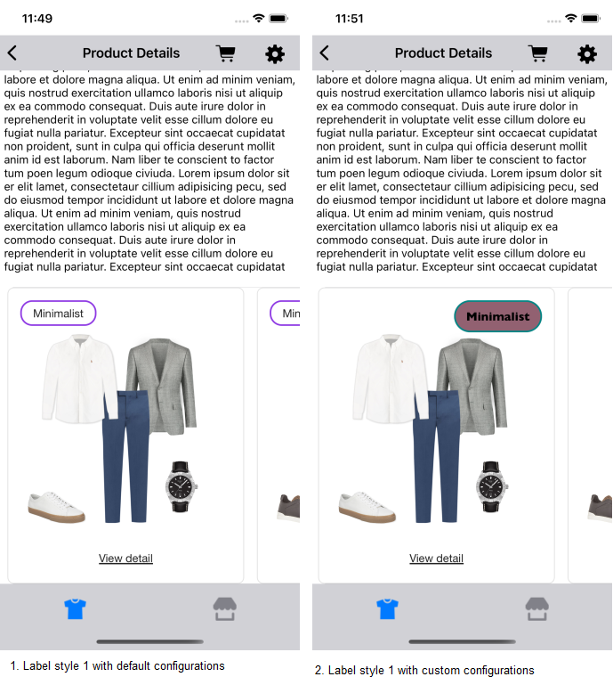
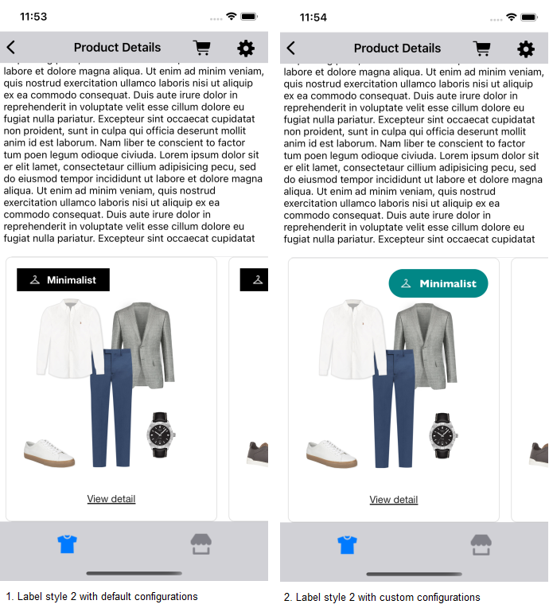
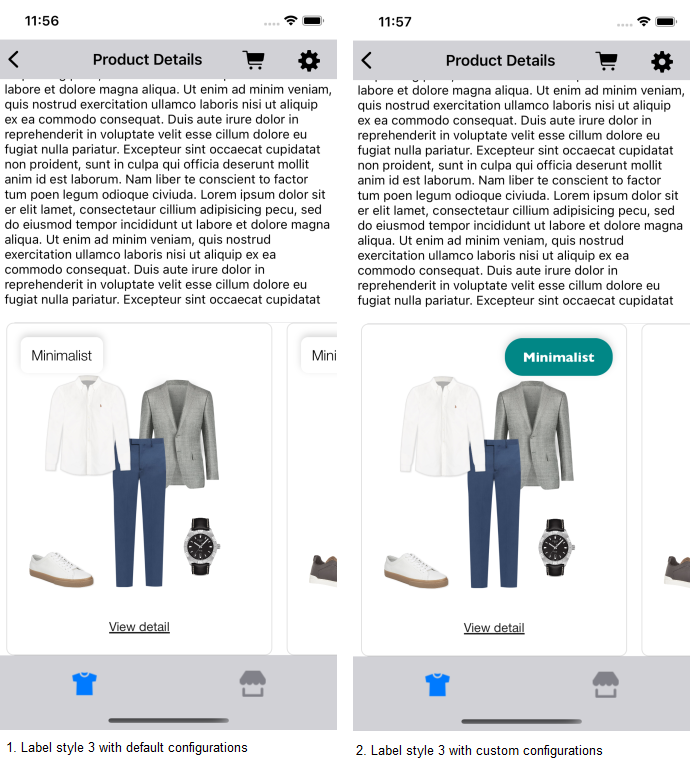
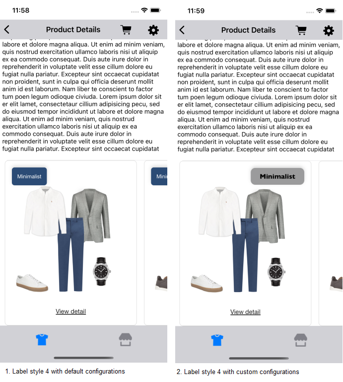
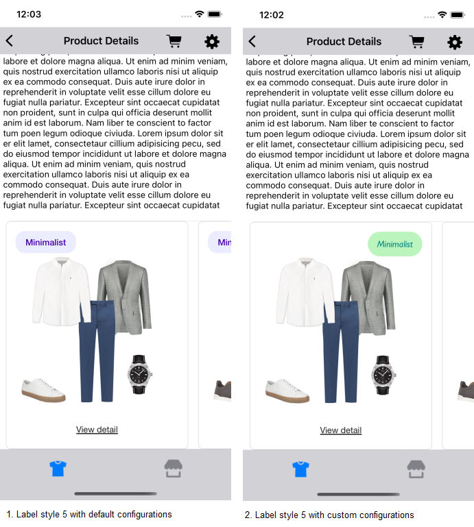
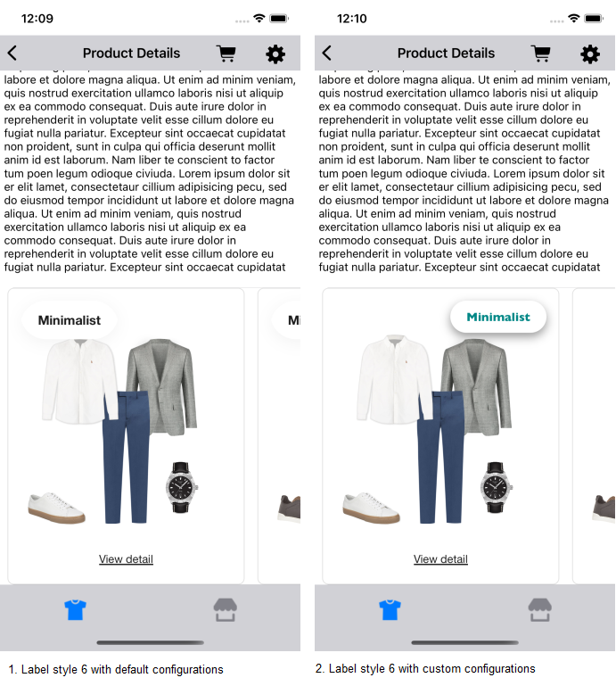
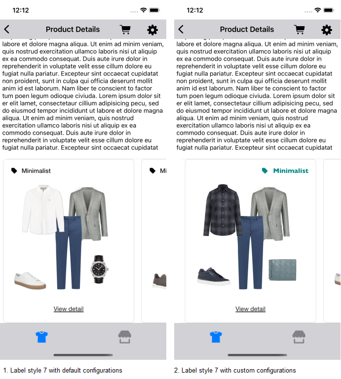

# Labels

UX SDK provides various Label styles for the Top Label view displayed in below widgets:
- Classic Outfit Widget
- Hotspot Outfit Widget
- Grid Outfit Widget

## Label Styles Configuration

Data SDK fetches from the Stylitics server which Label style is supposed to be used for displaying Top Label in the above mentioned Outfit Widgets. The Top label is displayed only when below conditions are satisfied-
1. Data SDK receives from Stylitics server which label style is expected to be used. 
2. When Outfits received from Stylitics server are configured to display the Label.

There are seven Label styles available in the UX SDK. If Integrator app does not provide configurations for the top label styles, UX SDK uses the default configurations. If Integrator app does not want to continue with the default configs, they can provide their own custom configurations.

Below are the label styles with their *_**default configurations, syntax to pass custom configurations and their screenshots**_*.

### Label 1 

*_**1. Default configurations**_*

| Config Parameters | Description| Default Value |
|---|---|---|
| `title` | to set the title of the label | `Personalised Text` |
| `fontFamilyAndWeight` | is the font style with the font weight | `Helvetica Neue Regular` |
| `fontSize` | is the font size in CGFloat  | `14px` |
| `fontColor` | is text color | `#212121` |
| `backgroundColor` | is background color | `#FFFFFF` |
| `borderColor` | is border color | #8E39E3 |
| `borderWeight` | is border weight in CGFloat | `2px` |
| `cornerRadius` | is corner radius in CGFloat | `15px` |
| `paddingVertical` | is top and bottom padding of the top label in CGFloat | `6px` |
| `paddingHorizontal` | is left and right padding of the top label in CGFloat | `16px` |

*_**2. Syntax to pass custom Configurations**_*

Below is the code to provide the custom configurations for the Label1.

```swift
let topLabelConfig = TopLabel(label1: TopLabel.Label1(fontFamilyAndWeight: "Gill Sans Bold",
                                                      fontSize: 15,
                                                      fontColor: .black,
                                                      backgroundColor: UIColor(red: 0.388,
                                                                               green: 0.113,
                                                                               blue: 0.207,
                                                                               alpha: 0.70),
                                                      borderColor: UIColor(red: 0.003,
                                                                           green: 0.529,
                                                                           blue: 0.525,
                                                                           alpha: 1),
                                                      borderWeight: 2,
                                                      cornerRadius: 20,
                                                      paddingVertical: 10,
                                                      paddingHorizontal: 15))
// For Classic Outfit Widget
StyliticsUIApis.load(outfits: outfits,
                     outfitsTemplate: .classic(classicConfig: ClassicConfig(topLabel: topLabelConfig)))

// For Hotspot Outfit Widget
StyliticsUIApis.load(outfits: outfits,
                     outfitsTemplate: .hotspot(hotspotConfig: HotspotConfig(topLabel: topLabelConfig)))

// For Grid Outfit Widget
StyliticsUIApis.load(outfits: outfits,
                     outfitsTemplate: .grid(gridInfo: GridInfo(config: GridConfig(topLabel: topLabelConfig))))
```

* Note : The Top Label view position is only configurable in the Classic Outfit widget. By default, it is configured to Top Left.*

Below is the example code to re-configure the Top Label view position to topRight in Classic Outfit widget.

```swift
let topLabelConfig = TopLabel(label1: TopLabel.Label1(fontFamilyAndWeight: "Gill Sans Bold",
                                                      fontSize: 15,
                                                      fontColor: .black,
                                                      backgroundColor: UIColor(red: 0.388,
                                                                               green: 0.113,
                                                                               blue: 0.207,
                                                                               alpha: 0.70),
                                                      borderColor: UIColor(red: 0.003,
                                                                           green: 0.529,
                                                                           blue: 0.525,
                                                                           alpha: 1),
                                                      borderWeight: 2,
                                                      cornerRadius: 20,
                                                      paddingVertical: 10,
                                                      paddingHorizontal: 15))

StyliticsUIApis.load(outfits: outfits,
                     outfitsTemplate: .classic(classicConfig: ClassicConfig(topLabel: topLabelConfig,
                                                                            topLabelPosition: .topRight)))
```

</br>


### Label 2

*_**1. Default configurations**_*

| Config Parameters | Description | Default Value |
|---|---|---|
| `title` | to set the title of the label | `Personalised Text` |
| `fontFamilyAndWeight` | is the font style with the font weight | `Helvetica Neue bold` |
| `fontSize` | is the font size in CGFloat | `14px` |
| `fontColor` | is text color | `#FFFFFF` |
| `backgroundColor` | is background color | `#000000` |
| `textAndIconSpacing` | is space between the icon and the title text | `8px` |
| `paddingVertical` | is top and bottom padding of the top label in CGFloat | `6px` |
| `paddingHorizontal` | is left and right padding of the top label in CGFloat | `16px` |

*_**2. Syntax to pass custom Configurations**_*

Below is the code to provide the custom configurations for the Label2.

```swift
let topLabelConfig = TopLabel(label2: TopLabel.Label2(fontFamilyAndWeight: "Gill Sans Bold",
                                                      fontSize: 15,
                                                      fontColor: .white,
                                                      backgroundColor: UIColor(red: 0.003,
                                                                               green: 0.529,
                                                                               blue: 0.525,
                                                                               alpha: 1),
                                                      cornerRadius: 20,
                                                      paddingVertical: 10,
                                                      paddingHorizontal: 15,
                                                      iconAndTitleSpacing: 10))
```

</br>

### Label 3

*_**1. Default configurations**_*

| Config Parameters | Description | Default Value |
|---|---|---|
| `title` | to set the title of the label | `Personalised Text` |
| `fontFamilyAndWeight` | is the font style with the font weight | `Helvetica Neue Light` |
| `fontSize` | is the font size in CGFloat | `16px` |
| `fontColor` | is text color | `#000000` |
| `backgroundColor` | is background color | `#FFFFFF` |
| `shadowColor` | is the shadow color | `#000000` |
| `shadowRadius` | is the shadow radius in CGFloat | `4px` |
| `cornerRadius` | is corner radius in CGFloat | `8px` |
| `paddingVertical` | is top and bottom padding of the top label in CGFloat | `8px` |
| `paddingHorizontal` | is left and right padding of the top label in CGFloat | `12px` |

*_**2. Syntax to pass custom Configurations**_*

Below is the code to provide the custom configurations for the Label3.

```swift
let topLabelConfig = TopLabel(label3: TopLabel.Label3(fontFamilyAndWeight: "Gill Sans Bold",
                                                      fontSize: 15,
                                                      fontColor: .white,
                                                      backgroundColor: UIColor(red: 0.003,
                                                                               green: 0.529,
                                                                               blue: 0.525,
                                                                               alpha: 1),
                                                      cornerRadius: 20,
                                                      paddingVertical: 9,
                                                      paddingHorizontal: 20))
```

</br>

### Label 4

*_**1. Default configurations**_*

| Config Parameters  | Description | Default Value |
|---|---|---|
| `title` | to set the title of the label | `Personalised Text` |
| `fontFamilyAndWeight` | is the font style with the font weight | `Helvetica Neue Regular` |
| `fontSize` | is the font size in CGFloat | `12px` |
| `fontColor` | is text color | `#FFFFFF` |
| `backgroundColor` | is background color | `#2B4B75` |
| `shadowColor` | is the shadow color | `#000000` |
| `shadowRadius` | is the shadow radius in CGFloat | `4px` |
| `cornerRadius` | is corner radius in CGFloat | `6px` |
| `paddingVertical` | is top and bottom padding of the top label in CGFloat | `12px` |
| `paddingHorizontal` | is left and right padding of the top label in CGFloat| `12px` |


*_**2. Syntax to pass custom Configurations**_*

Below is the code to provide the custom configurations for the Label4.

```swift
let topLabelConfig = TopLabel(label4: TopLabel.Label4(fontFamilyAndWeight: "Gill Sans Bold",
                                                      fontSize: 15,
                                                      fontColor: .black,
                                                      backgroundColorAfterAnimation: UIColor(red: 0.607,
                                                                                             green: 0.607,
                                                                                             blue: 0.611,
                                                                                             alpha: 1),
                                                      cornerRadius: 10,
                                                      paddingVertical: 10,
                                                      paddingHorizontal: 20))
```

</br>

### Label 5

*_**1. Default configurations**_*

| Config Parameters | Description | Default Value |
|---|---|---|
| `title` | to set the title of the label | `Personalised Text` |
| `fontFamilyAndWeight` | is the font style with the font weight | `Helvetica Neue medium`  |
| `fontSize` | is the font size in CGFloat | `14px` |
| `fontColor` | is text color | `#4700AB` |
| `backgroundColor` | is background color | `#EBECFE` |
| `cornerRadius` | is corner radius in CGFloat | `15px` |
| `paddingVertical` | is top and bottom padding of the top label in CGFloat | `8px` |
| `paddingHorizontal` | is left and right padding of the top label in CGFloat | `16px` |

*_**2. Syntax to pass custom Configurations**_*

Below is the code to provide the custom configurations for the Label5.

```swift
let topLabelConfig = TopLabel(label5: TopLabel.Label5(fontFamilyAndWeight: "Gill Sans Italic",
                                                      fontSize: 15,
                                                      fontColor: UIColor(red: 0.003,
                                                                         green: 0.529,
                                                                         blue: 0.525,
                                                                         alpha: 1),
                                                      backgroundColor: UIColor(red: 0.733,
                                                                               green: 0.956,
                                                                               blue: 0.741,
                                                                               alpha: 1),
                                                      cornerRadius: 20,
                                                      paddingVertical: 10,
                                                      paddingHorizontal: 15))
```

</br>

### Label 6

*_**1. Default configurations**_*

| Config Parameters | Description | Default Value |
|---|---|---|
| `title` | to set the title of the label | `Personalised Text` |
| `fontFamilyAndWeight` | is the font style with the font weight | `Helvetica Neue Bold` |
| `fontSize`  | is the font size in CGFloat | `16px` |
| `fontColor` | is text color | `#1E1E1E` |
| `backgroundColor` | is background color  | `#FFFFFF` |
| `shadowColor` | is the shadow color | `#000000` |
| `shadowRadius` | is the shadow radius in CGFloat | `10px` |
| `shadowOffset` | is the shadow offset | `height = 4px` |
| `borderColor` | is border color | `#8E39E3` |
| `borderWeight` | is border weight in CGFloat | `2px` |
| `cornerRadius` | is corner radius in CGFloat  | `32px` |
| `paddingVertical` | is top and bottom padding of the top label in CGFloat | `12px` |
| `paddingHorizontal` | is left and right padding of the top label in CGFloat | `22px` |

*_**2. Syntax to pass custom Configurations**_*

Below is the code to provide the custom configurations for the Label6.

```swift
let topLabelConfig = TopLabel(label6: TopLabel.Label6(fontFamilyAndWeight: "Gill Sans Bold",
                                                      fontSize: 15,
                                                      fontColor: UIColor(red: 0.003,
                                                                         green: 0.529,
                                                                         blue: 0.525,
                                                                         alpha: 1),
                                                      backgroundColorAfterAnimation: .white,
                                                      cornerRadius: 20,
                                                      shadowColor: UIColor(red: 0,
                                                                           green: 0,
                                                                           blue: 0,
                                                                           alpha: 0.40),
                                                      shadowRadius: 6,
                                                      shadowOffset: CGSize(width: 0, height: 5),
                                                      paddingVertical: 8,
                                                      paddingHorizontal: 20))
```

</br>

### Label 7

*_**1. Default configurations**_*

| Config Parameters | Description | Default Value |
|---|---|---|
| `title` | to set the title of the label | `Personalised Text` |
| `icon` | is background color of icon | `#000000` |
| `fontFamilyAndWeight` | is the font style with the font weight | `Helvetica Neue medium`  |
| `fontSize` | is the font size in CGFloat | `14px` |
| `fontColor` | is text color | `#1E1E1E` |
| `textAndIconSpacing` | is space between the icon and the title text | `8px` |

*_**2. Syntax to pass custom Configurations**_*

Below is the code to provide the custom configurations for the Label7.

```swift
let topLabelConfig = TopLabel(label7: TopLabel.Label7(fontFamilyAndWeight: "Gill Sans Bold",
                                                      fontSize: 15,
                                                      fontColor: UIColor(red: 0.003,
                                                                         green: 0.529,
                                                                         blue: 0.525,
                                                                         alpha: 1),
                                                      iconAndTitleSpacing: 10,
                                                      iconColor: UIColor(red: 0.003,
                                                                         green: 0.529,
                                                                         blue: 0.525,
                                                                         alpha: 1)))
```

</br>

### Configuring All Label Styles

Integrator app can pass custom configurations for multiple Label styles.

*_**Syntax to pass multiple Label custom configuration**_*

```swift
let topLabelConfig = TopLabel(label1: TopLabel.Label1(fontFamilyAndWeight: "Gill Sans",
                                                      fontSize: 15),
                              label2: TopLabel.Label2(fontSize: 15,
                                                      iconAndTitleSpacing: 10),
                              label3: TopLabel.Label3(cornerRadius: 20,
                                                      paddingVertical: 9,
                                                      paddingHorizontal: 20),
                              label4: TopLabel.Label4(fontFamilyAndWeight: "Gill Sans Bold",
                                                      paddingVertical: 10,
                                                      paddingHorizontal: 20),
                              label5: TopLabel.Label5(fontSize: 15),
                              label6: TopLabel.Label6(fontSize: 15,
                                                      fontColor: UIColor(red: 0.003,
                                                                         green: 0.529,
                                                                         blue: 0.525,
                                                                         alpha: 1),
                                                      shadowOffset: CGSize(width: 0, height: 5),
                                                      paddingVertical: 8,
                                                      paddingHorizontal: 20),
                              label7: TopLabel.Label7(fontSize: 15,
                                                      fontColor: UIColor(red: 0.003,
                                                                         green: 0.529,
                                                                         blue: 0.525,
                                                                         alpha: 1)))

StyliticsUIApis.load(outfits: outfits,
                     outfitsTemplate: .classic(classicConfig: ClassicConfig(topLabel: topLabelConfig)))
```

### Configuring Some Label Styles

*_**Syntax to pass some Label custom configuration**_*

```swift
let topLabelConfig = TopLabel(label2: TopLabel.Label2(fontSize: 15,
                                                      iconAndTitleSpacing: 10),
                              label3: TopLabel.Label3(cornerRadius: 20,
                                                      paddingVertical: 9,
                                                      paddingHorizontal: 20),
                              label7: TopLabel.Label7(fontSize: 15,
                                                      fontColor: UIColor(red: 0.003,
                                                                         green: 0.529,
                                                                         blue: 0.525,
                                                                         alpha: 1),
                                                      iconAndTitleSpacing: 10))

StyliticsUIApis.load(outfits: outfits,
                     outfitsTemplate: .classic(classicConfig: ClassicConfig(topLabel: topLabelConfig)))
```

## License

Copyright © 2023 Stylitics
