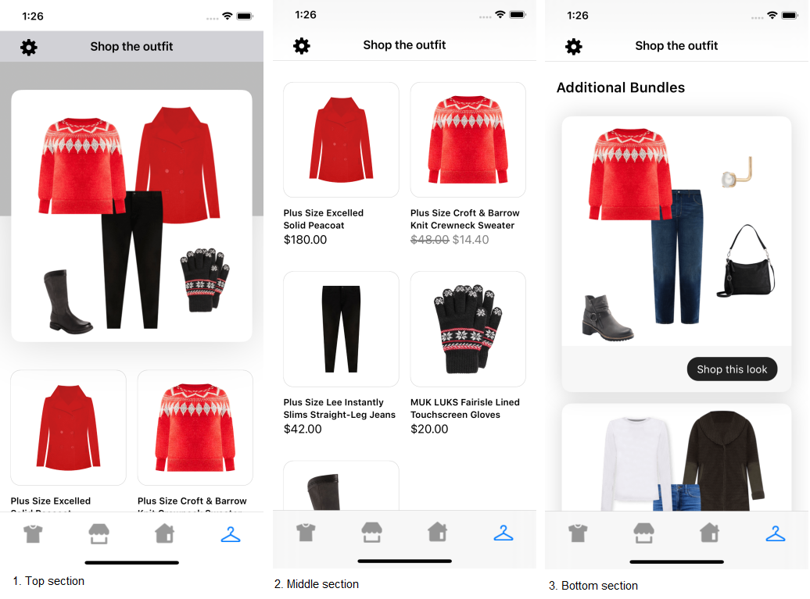
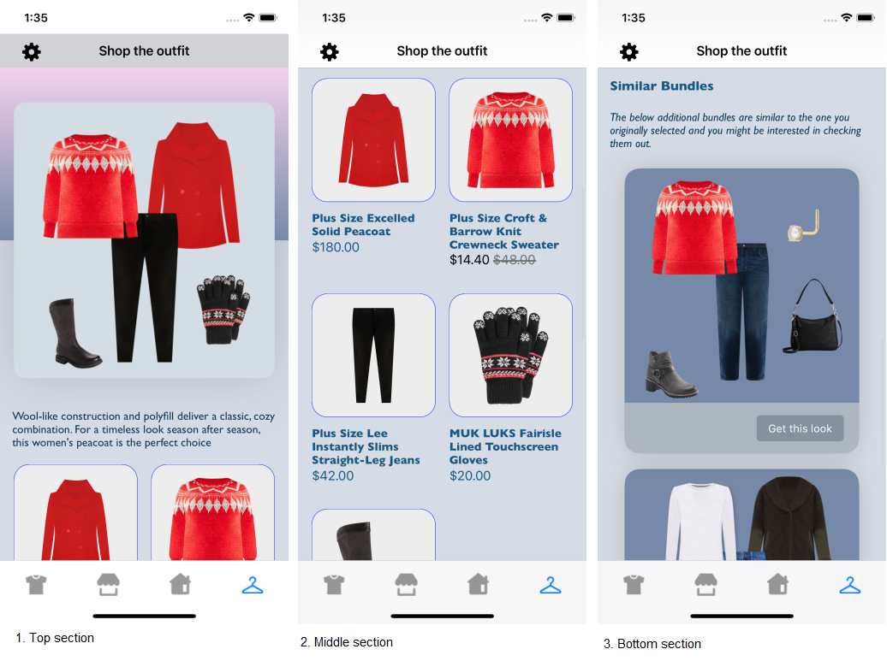
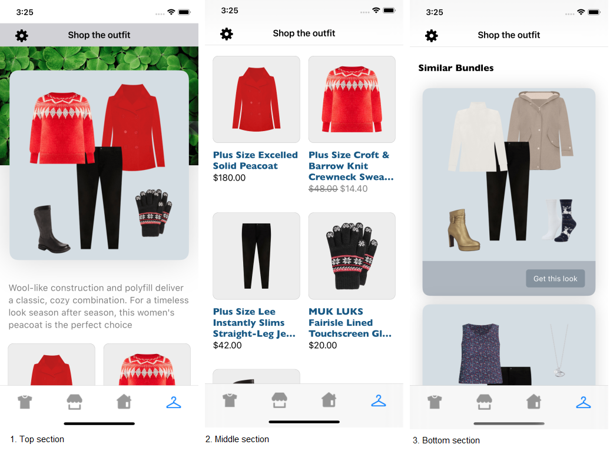

# OUTFIT LANDING PAGE(OLP) WIDGET 

It provides view to display Stylitics OLP data. It also handles invoking of Widget tracking events based on user interaction with these views.

Below are the features for OLP Widget.</br>

* Configure all the UI elements for OLP Widget
* Handles tracking events so Integrator App does not have to do it
* Provides listeners to Integrator App so they can handle the events (if needed) based on user interaction.
* Configure whether to display bundle items of Additional Bundles directly from SDK or not
* When Bundle Items of Additional Bundles are configured to display from SDK, Integrator App can provide configs for it.


### Configurations:


### Widget

| Fields | Description | Default Value |
| --- | --- | --- |
| `backgroundColor` | is the widget background color | `#FFFFFF` |
| `showScrollBar` | is Boolean value, to Show or Hide the vertical ScrollBar of Outfit Landing Page widget | `false` |


### OutfitImage

| Fields | Description | Default Value |
| --- | --- | --- |
| `gradientLayerInfo` | is the gradient layer background for the Outfit card | `#767680` |
| `backgroundImageUrl` | is the image url for the image to be displayed as a Outfit card background | `nil` |
| `cardBackgroundColor` | is the Outfit card background color | `#FFFFFF` |
| `cardBorderRadius` | is the Outfit card border radius | `14` |
| `cardPaddingVertical` | is the top spacing of the Outfit card in CGFloat | `40px` |
| `cardPaddingHorizontal` | is the left and right spacing of the Outfit card in CGFloat | `16px` |
| `paddingVertical` | is the top and bottom spacing to the image inside Outfit card in CGFloat | `8px` |

Integrator App can customize the `gradientLayerInfo` by selecting from the available options defined in the UX SDK, listed below.

| Fields | Description | Default Value |
| --- | --- | --- |
| `colors` | is the colors of gradient layer | `UIColor[UIColor(red: 0.735, green: 0.735, blue: 0.735, alpha: 1.0), UIColor(red: 0.735, green: 0.735, blue: 0.735, alpha: 1.0)]` |
| `startPoint` | is the gradient start point in CGPoint | `CGPoint(x: 1.0, y: 0.0)` |
| `endPoint` | is the gradient end point in CGPoint | `CGPoint(x: 1.0, y: 1.0)` |


### OutfitDescription

| Fields | Description | Default Value |
| --- | --- | --- |
| `text` | to set the Outfit description text for the label | `""` |
| `paddingHorizontal` | is the left and right spacing to the label  | `16px` |
| `paddingBottom` | is the bottom spacing for the label | `24px` |
| `fontColor` | is label text color | `#808080` |
| `fontFamilyAndWeight` | is the label font style with the font weight | `SFProText-Regular` |
| `fontSize` | is the label font size in CGFloat | `17px` |


### Items

| Fields | Description | Default Value |
| --- | --- | --- |
| `paddingOutsideHorizontal` | is left and right spacing of the Outfit items with the margin in CGFloat | `15px` |
| `paddingInsideHorizontal` | is the horizontal spacing between the two items of Outfit items in CGFloat | `16px` |
| `paddingInsideVertical` | is the vertical spacing between the two items of Outfit items in CGFloat | `36px` |


### Item

| Fields | Description | Default Value |
| --- | --- | --- |
| `backgroundColor` | is the item image background color | `#FFFFFF` |
| `borderColor` | is the item image border color | `#212121` |
| `borderWidth` | is the item image border width in CGFloat | `0.5px` |
| `borderRadius` | is the item border radius in CGFloat | `14` |
| `imageMarginHorizontal` | is left and right padding of image view with an item in CGFloat | `17px` |
| `imageMarginVertical` | is top and bottom padding of image view with an item in CGFloat | `17px` |
| `fontColor` | is item name text color | `#000000` |
| `fontFamilyAndWeight` | is the item name font style with the font weight | `SFPro Semibold` |
| `fontSize` | is the item name font size | `13px` |
| `priceDecimal` | is the number of digits to show after decimal point and it is accepted as a integer | `2` |
| `priceFontColor` | is the item price text color | `#000000` |
| `priceFontFamilyAndWeight` | is the item price font style with the font weight | `SFPro Semibold` |
| `priceFontSize` | is the item price font size in CGFloat | `13px` |
| `salePriceFontColor` | is the item sale price text color | `#808080` |
| `strikeThroughPriceFontColor` | is strike through price text color | `#808080` |
| `style` | is to show or hide the strike through price | `show` |
| `swapPricesPosition` | is boolean value, when it is false it shows strike through price first and then sale price. Vice versa when true | `false` |


### AdditionalItems

| Fields | Description | Default Value |
| --- | --- | --- |
| `paddingVertical` | is the top spacing to the header | `40px` |
| `headerText` | to set the header text | `Additional Bundles` |
| `headerFontColor` | is the header text font color | `#000000` |
| `headerFontFamilyAndWeight` | is the header text font style with the font weight | `SFPro Semibold` |
| `headerFontSize` | is the header text font size | `20px` |
| `headerVerticalPadding` | is the bottom spacing to the header text in CGFloat | `4` |
| `subHeaderText` | is the sub header text | `nil` |
| `subHeaderFontColor` | is the sub header text color | `#808080` |
| `subHeaderFontFamilyAndWeight` | is the sub header font style with the font weight  | `SFPro Regular` |
| `subHeaderFontSize` | is the sub header font size | `17px` |


### BottomLabel

| Fields | Description | Default Value |
| --- | --- | --- |
| `ctaTitle` | to set the title of the label | `Shop this look` |
| `fontFamilyAndWeight` | is the label font style with the font weight | `SFPro Regular` |
| `fontSize` | is the label font size in CGFloat | `15px` |
| `fontColor` | is label text color | `#FFFFFF` |
| `backgroundColor` | is widget footer background color | `#F7F7F7` |
| `ctaBackgroundColor` | is label background color | `#212121` |
| `cornerRadius` | is border corner radius in CGFloat | `16px` |
| `ctaPaddingVertical` | is top and bottom spacing for the label's content in CGFloat | `7px` |
| `ctaPaddingHorizontal` | is left and right spacing for the label's content in CGFloat | `14px` |
| `paddingVertical` | is top and bottom spacing for the content inside widget footer in CGFloat | `16px` |
| `paddingHorizontal` |  is left and right spacing for the content inside widget footer in CGFloat | `20px` |


### OutfitCard

| Fields | Description | Default Value |
|---|---|---|
| `cornerRadius` | is border corner radius in CGFloat | `14px` |
| `backgroundColor` | is the background color to the additional Outfit bundle card | `#FFFFFF` |
| `paddingHorizontal` | is the left and right spacing to the additional bundles list | `24px` |
| `paddingVertical` | is the spacing between two Outfit bundle cards | `16px` |

           
[Click here](CODE_REFERENCE_README.md#outfit-landing-page-widget-configuration-samples) to find code references for different configuration examples.

### Implement Exposed Listener

Below are the list of OLP Widget listeners exposed to Integrator App. If Integrator wishes to implement their own product list screen they will have to provide the definition for widget `onOutfitClickCTA` listener. 

  1. `onOutfitClick` - On click event of additional Outfit bundle, this listener will be invoked.
  2. `onOutfitClickCTA` - On click event of `Shop this look` cta on additional Outfit bundle, this listener will be invoked.
  3. `onOutfitView` - On view event of an Outfit card and additional Outfit bundle, this listener will be invoked.
  4. `onItemClick` - On click event of Outfit bundle item displayed in either an OLP widget or a product list, this listener will be invoked.
  5. `onItemView` -  On view event of Outfit bundle item displayed in either an OLP widget or a product list, this listener will be invoked.


### Default Configurations:

Below are the examples of OLP Widget when Integrator App chooses to use default UI configurations.</br>

- The OLP UI component can be implemented in below different ways.
    1. Product List enabled from SDK
    2. Product List disabled from SDK
    3. Configure Event Listeners

*_**swift**_*

*_**1. Product List enabled from SDK:**_*

When product list is enabled from UX SDK and Integrator App does not provide configurations, it will take default configurations from SDK.

```swift
static func widgetWithDefaultConfigurations(outfitLandingPage: OutfitLandingPage) -> UIView {
   StyliticsUIApis.load(outfitLandingPage: outfitLandingPage)
}
```
*_**2. Product List disabled from SDK:**_*

```swift
    let listener = OutfitLandingPageListener(onOutfitClickCTA: { outfitBundleInfo in
        print("Outfit Landing Page onOutfitClickCTA : \(outfitBundleInfo)")
        // Display Product list screen from Integrator app
        ScreenDisplayUtility.showOutfitBundleOverlayScreen(outfitBundleInfo: outfitBundleInfo)
      })
        
   static func widgetWithProductListFromIntegratorAndAllCustomConfigurations(outfitLandingPage: OutfitLandingPage) -> UIView {
        return StyliticsUIApis.load(outfitLandingPage: outfitLandingPage,
                                    outfitLandingPageInfo: OutfitLandingPageInfo(listener: listener),
                                    displayProductListFromSDK: false)
    }
```

*_**3. Configure Event Listeners:**_*

```swift
    static var allCustomListener: OutfitLandingPageListener {
        OutfitLandingPageListener(onOutfitClick: { outfitBundleInfo in
            print("Outfit Landing Page onOutfitClick : \(outfitBundleInfo)")
        },
        onOutfitClickCTA: { outfitBundleInfo in
            print("Outfit Landing Page onOutfitClickCTA : \(outfitBundleInfo)")
            ScreenDisplayUtility.showOutfitBundleOverlayScreen(outfitBundleInfo: outfitBundleInfo)
        },
        onOutfitView: { outfitBundleInfo in
            print("Outfit Landing Page onOutfitView : \(outfitBundleInfo)")
        },
        onItemClick: { outfitBundleInfo, outfitBundleItemInfo in
            print("Outfit Landing Page onItemClick : \(outfitBundleInfo) \(outfitBundleItemInfo)")
            if let itemNumber = outfitBundleItemInfo.outfitBundleItem.remoteId {
                ScreenDisplayUtility.showProductDetailsPage(itemNumber: itemNumber, bundleItem: outfitBundleItemInfo.outfitBundleItem)
            }
        },
        onItemView: { outfitBundleInfo, outfitBundleItemInfo in
            print("Outfit Landing Page onItemView : \(outfitBundleInfo) \(outfitBundleItemInfo)")
        })
    }
```

### Default OLP Widget Screen

* Below is the OLP Widget screenshot when Sample Integrator App uses the above configurations.

</br></br>

### Custom Configurations:

- Integrator App can customise some or all configurations & implement listeners.
- Below are the examples of OLP Widget when Sample Integrator App customises configurations.

*_**1. With all custom configurations & Listeners:**_*
```swift
    static var olpAllCustomConfigs: OutfitLandingPageConfigs {
        let widgetBackgroundColor = UIColor(named: "olp_widget_background_color")!
        let cardbackgroundColor = UIColor(named: "olp_card_background_color")!
        let bottomLabelTitleFontColor = UIColor(named: "olp_bottom_label_title_font_color")!
        let bottomLabelBackgroundColor = UIColor(named: "olp_bottom_label_background_color")!
        let bottomLabelTitleBackgroundColor = UIColor(named: "olp_bottom_label_title_background_color")!
        let itemBackgroundColor = UIColor(named: "olp_item_background_color")!
        let itemFontColor = UIColor(named: "olp_tem_product_name_font_color")!
        let itemPriceFontColor = UIColor(named: "olp_item_price_font_color")!
        let itemSalePriceFontColor = UIColor(named: "olp_item_sale_price_font_color")!
        let itemSalePriceStrikeColor = UIColor(named: "olp_item_sale_price_strike_color")!
        let subHeaderFontColor = UIColor(named: "olp_subheader_font_color")!
        let additionalBundleBackgroundColor = UIColor(named: "olp_additional_bundle_card_background_color")!
        let bottomGradientColor = UIColor(named: "olp_bottom_gradient_color")!
        let topGradientColor = UIColor(named: "olp_top_gradient_color")!

        return OutfitLandingPageConfigs(backgroundColor: widgetBackgroundColor,
                                        showScrollBar: true,
                                        outfitImage: OutfitLandingPageConfigs.OutfitImage(gradientLayerInfo: GradientLayerInfo(colors: [topGradientColor,
                                                                                                                                        bottomGradientColor],
                                                                                                                               startPoint: CGPoint(x: 1.0,
                                                                                                                                                   y: 0.0),
                                                                                                                               endPoint: CGPoint(x: 1.0,
                                                                                                                                                 y: 1.0)),
                                                                                          cardBackgroundColor: cardbackgroundColor,
                                                                                          cardBorderRadius: 15,
                                                                                          cardPaddingVertical: 45,
                                                                                          cardPaddingHorizontal: 18,
                                                                                          paddingVertical: 10),
                                        outfitDescription: OutfitLandingPageConfigs.OutfitDescription(text: "Wool-like construction and polyfill deliver a classic, cozy combination. For a timeless look season after season, this women's peacoat is the perfect choice",
                                                                                                      paddingHorizontal: 16,
                                                                                                      paddingBottom: 20,
                                                                                                      fontColor: subHeaderFontColor,
                                                                                                      fontFamilyAndWeight: "Gill Sans",
                                                                                                      fontSize: 15),
                                        items: OutfitLandingPageConfigs.Items(paddingOutsideHorizontal: 18,
                                                                              paddingInsideHorizontal: 18,
                                                                              paddingInsideVertical: 34),
                                        item: OutfitLandingPageConfigs.Item(backgroundColor: itemBackgroundColor,
                                                                            borderColor: .blue,
                                                                            borderRadius: 20,
                                                                            imageMarginHorizontal: 15,
                                                                            imageMarginVertical: 15,
                                                                            fontColor: itemFontColor,
                                                                            fontFamilyAndWeight: "Gill Sans Bold",
                                                                            fontSize: 15,
                                                                            priceDecimal: 2,
                                                                            priceFontColor: itemPriceFontColor,
                                                                            priceFontFamilyAndWeight: "Gill Sans Bold",
                                                                            priceFontSize: 18,
                                                                            salePriceFontColor: itemSalePriceFontColor,
                                                                            strikeThroughPriceFontColor: itemSalePriceStrikeColor,
                                                                            style: .show,
                                                                            swapPricesPosition: true),
                                        additionalItems: OutfitLandingPageConfigs.AdditionalItems(paddingVertical: 42,
                                                                                                  headerText: "Similar Bundles",
                                                                                                  headerFontColor: itemFontColor,
                                                                                                  headerFontFamilyAndWeight: "Gill Sans Bold",
                                                                                                  headerFontSize: 17,
                                                                                                  headerVerticalPadding: 22,
                                                                                                  subHeaderText: "The below additional bundles are similar to the one you originally selected and you might be interested in checking them out.",
                                                                                                  subHeaderFontColor: subHeaderFontColor,
                                                                                                  subHeaderFontFamilyAndWeight: "Gill Sans Italic",
                                                                                                  subHeaderFontSize: 15),
                                        bottomLabel: OutfitLandingPageConfigs.BottomLabel(ctaTitle: "Get this look",
                                                                                          fontSize: 14,
                                                                                          fontColor: bottomLabelTitleFontColor,
                                                                                          backgroundColor: bottomLabelBackgroundColor,
                                                                                          ctaBackgroundColor: bottomLabelTitleBackgroundColor,
                                                                                          cornerRadius: 5,
                                                                                          ctaPaddingVertical: 7,
                                                                                          ctaPaddingHorizontal: 15),
                                        outfitCard: OutfitLandingPageConfigs.OutfitCard(cornerRadius: 20,
                                                                                        backgroundColor: additionalBundleBackgroundColor,
                                                                                        paddingHorizontal: 35,
                                                                                        paddingVertical: 20))
    }
    
    static var allCustomListener: OutfitLandingPageListener {
        OutfitLandingPageListener(onOutfitClick: { outfitBundleInfo in
            print("Outfit Landing Page onOutfitClick : \(outfitBundleInfo)")
        },
        onOutfitClickCTA: { outfitBundleInfo in
            print("Outfit Landing Page onOutfitClickCTA : \(outfitBundleInfo)")
            ScreenDisplayUtility.showOutfitBundleOverlayScreen(outfitBundleInfo: outfitBundleInfo)
        },
        onOutfitView: { outfitBundleInfo in
            print("Outfit Landing Page onOutfitView : \(outfitBundleInfo)")
        },
        onItemClick: { outfitBundleInfo, outfitBundleItemInfo in
            print("Outfit Landing Page onItemClick : \(outfitBundleInfo) \(outfitBundleItemInfo)")
            if let itemNumber = outfitBundleItemInfo.outfitBundleItem.remoteId {
                ScreenDisplayUtility.showProductDetailsPage(itemNumber: itemNumber, bundleItem: outfitBundleItemInfo.outfitBundleItem)
            }
        },
        onItemView: { outfitBundleInfo, outfitBundleItemInfo in
            print("Outfit Landing Page onItemView : \(outfitBundleInfo) \(outfitBundleItemInfo)")
        })
    } 
     

   private static var allConfigOutfitLandingPageInfo: OutfitLandingPageInfo {
        OutfitLandingPageInfo(config: olpAllCustomConfigs, listener: allCustomListener)
    }

    
   static func widgetWithProductListFromUXSDKAndAllCustomConfigurations(outfitLandingPage: OutfitLandingPage) -> UIView {
        let productListScreenConfig = OutfitBundleProductListScreenConfig(outfitBundleProductListConfig: OutfitBundleProductListConfigSamples.productListConfig,
                                                                          outfitBundleProductListListener: OutfitBundleProductListConfigSamples.productListListener)
        return StyliticsUIApis.load(outfitLandingPage: outfitLandingPage,
                                    outfitLandingPageInfo: allConfigOutfitLandingPageInfo,
                                    outfitBundleProductListScreenConfig: productListScreenConfig)
    }
 
 ```
 
 - Below is the OLP Widget screenshot when Sample Integrator App uses the above configurations.

</br>

 
 *_**2. With some custom configurations & Listeners:**_*
 If Integrator App provides only few configurations, UX SDK will take default configurations for missing fields.

```swift
    static func widgetWithSomeCustomConfigurations(outfitLandingPage: OutfitLandingPage) -> UIView {
        let cardbackgroundColor = UIColor(named: "olp_card_background_color")!
        let bottomLabelTitleFontColor = UIColor(named: "olp_bottom_label_title_font_color")!
        let bottomLabelBackgroundColor = UIColor(named: "olp_bottom_label_background_color")!
        let bottomLabelTitleBackgroundColor = UIColor(named: "olp_bottom_label_title_background_color")!
        let itemBackgroundColor = UIColor(named: "olp_item_background_color")!
        let itemFontColor = UIColor(named: "olp_tem_product_name_font_color")!

        let someCustomConfig =  OutfitLandingPageConfigs(outfitImage: OutfitLandingPageConfigs.OutfitImage(backgroundImageUrl: "https://media.istockphoto.com/id/157617234/photo/close-up-of-a-bunch-of-green-clover.jpg?s=2048x2048&w=is&k=20&c=lRCpNockNQtnHfjT3fJdbVVdb_l63K2vr886XM6sRwk=",
                                                                                          cardBackgroundColor: cardbackgroundColor,
                                                                                          cardBorderRadius: 16,
                                                                                          cardPaddingVertical: 45,
                                                                                          cardPaddingHorizontal: 18,
                                                                                          paddingVertical: 10),
                                        outfitDescription: OutfitLandingPageConfigs.OutfitDescription(text: "Wool-like construction and polyfill deliver a classic, cozy combination. For a timeless look season after season, this women's peacoat is the perfect choice"),
                                        item: OutfitLandingPageConfigs.Item(backgroundColor: itemBackgroundColor,
                                                                            borderRadius: 10,
                                                                            fontColor: itemFontColor,
                                                                            fontFamilyAndWeight: "Gill Sans Bold",
                                                                            fontSize: 18),
                                        additionalItems: OutfitLandingPageConfigs.AdditionalItems(paddingVertical: 50,
                                                                                                  headerText: "Similar Bundles",
                                                                                                  headerFontColor: .black,
                                                                                                  headerFontFamilyAndWeight: "Gill Sans Bold",
                                                                                                  headerFontSize: 18),
                                        bottomLabel: OutfitLandingPageConfigs.BottomLabel(ctaTitle: "Get this look",
                                                                                          fontSize: 14,
                                                                                          fontColor: bottomLabelTitleFontColor,
                                                                                          backgroundColor: bottomLabelBackgroundColor,
                                                                                          ctaBackgroundColor: bottomLabelTitleBackgroundColor,
                                                                                          cornerRadius: 5),
                                        outfitCard: OutfitLandingPageConfigs.OutfitCard(backgroundColor: cardbackgroundColor))
                                                                                        
                                                                                            
        return StyliticsUIApis.load(outfitLandingPage: outfitLandingPage,
                                    outfitLandingPageInfo: OutfitLandingPageInfo(config: olpSomeCustomConfigs,
                                                                                 listener: allCustomListener))
    }
    
     
 ```
- Below is the OLP Widget screenshot when Sample Integrator App uses the above configurations.

</br>


Note: It is recommended to set either the `gradientLayerInfo` or `backgroundImageUrl` configuration parameter of the _**OutfitImage**_ component at a time. If both parameters are provided, the image from `backgroundImageUrl` will be displayed.

### Refresh OLP Widget

**Overview**

The `refreshTemplate` method can be used to update the OLP widget data or its configurations or both.

**Example**

```swift
import StyliticsUI

// Refresh with both new data and config
func refreshTemplate(view: UIView, outfitLandingPage: StyliticsData.OutfitLandingPage? = nil, widgetConfig: (StyliticsUI.IWidgetConfig)? = nil)

```
**Parameters**

- `view`: `Outfit Landing Page View` returned by Stylitics UX SDK to display OLP using `StyliticsUIApis.load` method.
- `outfitLandingPage`: Optional parameter to provide updated OLP data.
- `widgetConfig`: Optional parameter to provide updated configurations for OLP template.

**Usage**

Call the method with the view and optional data/config.

- Get the OLP Widget Template
```swift
// Load OLP Template
let outfitLandingPageView = StyliticsUIApis.load(outfitLandingPage: outfitLandingPage)
```

- To refresh the OLP Widget Template with new OLP data
```Swift
StyliticsUIApis.refreshTemplate(view: outfitLandingPageView, outfitLandingPage: outfitLandingPage)
```

- To refresh the OLP Widget Template with new config
```Swift
StyliticsUIApis.refreshTemplate(view: outfitLandingPageView, widgetConfig: newConfig)
```

- To refresh the OLP Widget Template with both new OLP data and config
```Swift
StyliticsUIApis.refreshTemplate(view: outfitLandingPageView, outfitLandingPage: outfitLandingPage, widgetConfig: newConfig)
```

## License

Copyright © 2023 Stylitics

