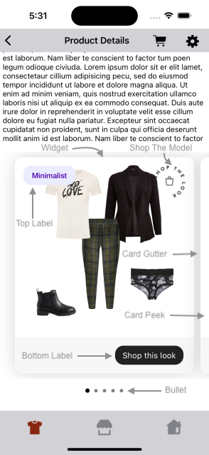
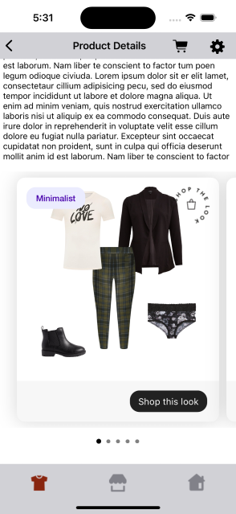
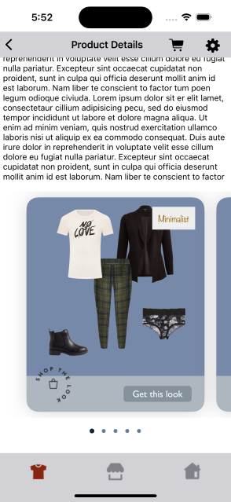
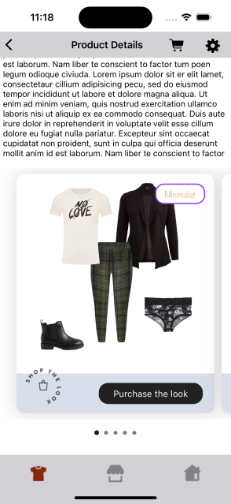

# CLASSIC WIDGET

It provides view to display Stylitics data Outfit widget. It also handles invoking of Widget tracking events based on user interaction with these views.

## Classic Outfit Widget

Below are the features for Classic Outfit Widget.</br>

* Configure all the UI elements for each Outfit
* Handles Outfit `View` and `Click` tracking events so Integrator App does not have to do it
* Provides listeners to Integrator App so they can handle the Outfit View and Click events
* Configure whether to display Outfit Items directly from SDK or not
    * When Outfit Items configured to display from SDK, Integrator App can provide configs for it

### Classic Outfit Widget Configurations:



### Widget

| Fields            | Description                                                                 | Default Value |
| ----------------- | --------------------------------------------------------------------------- | ------------- |
| `cornerRadius`    | is the widget corner radius                                                 | `14`          |
| `backgroundColor` | is the widget background color                                              | `#FFFFFF`     |
| `cardGutter`      | is the space between two OutfitBundle cards and is accessed as CGFloat      | `12`          |
| `cardPeek`        | is the previous and next OutfitBundle card peek and is accessed as CGFloat  | `16`          | 

### Top Label

UX SDK provides various Label styles for the Top Label. [Click here](LABELS_README.md) to learn more about it.

### Bottom Label

| Fields                 | Description                                                                      | Default Value       |
|------------------------|----------------------------------------------------------------------------------|---------------------|
| `ctaTitle`             | to set the title of the label                                                    | `Shop this look`    |
| `fontFamilyAndWeight`  | is the font style with the font weight                                           | `SFProText-Regular` |
| `fontSize`             | is the font size in CGFloat                                                      | `15`                |
| `fontColor`            | is text color                                                                    | `#FFFFFF`           |
| `backgroundColor`      | is widget footer background color and is accessed from assets file               | `#F7F7F7`           | 
| `ctaBackgroundColor`   | is label background color and is accessed from assets files                      | `#202020`           |
| `cornerRadius`         | is the label border corner radius                                                | `16`                |            
| `ctaPaddingVertical`   | is top and bottom spacing for the label's content, accepts CGFloat               | `7`                 |            
| `ctaPaddingHorizontal` | is left and right spacing for the label's content, accepts CGFloat               | `14`                |
| `paddingVertical`      | is top and bottom spacing for the content inside widget footer, accepts CGFloat  | `16`                |            
| `paddingHorizontal`    | is left and right spacing for the content inside widget footer, accepts CGFloat  | `20`                |

### Shop The Model

| Fields     | Description                                                                                     | Default Value |
| ---------- | ----------------------------------------------------------------------------------------------- | ------------- |
| `name`     | is the name of image to be displayed for Shop the model badge                                   | `Mandatory`   |
| `position` | is to change the badge position to the Top and Bottom. 16px is the default padding to this view | `top`         |
| `width`    | is the width of image view in CGFloat                                                           | `60`        |
| `height`   | is the height of image view in CGFloat                                                          | `60`        |

### Bullet
| Fields               | Description                                                                                                    | Default Value | 
|----------------------|----------------------------------------------------------------------------------------------------------------|---------------|
| `unselectedColor`    | is color of unselected bullet and is accessed from color.xml resource file                                     | `#D3D3D3`     | 
| `selectedColor`      | is color of selected bullet and is accessed from color.xml resource file                                       | `#212121`     | 
| `paddingVertical`    | is top and bottom spacing of the page indicator view in float and internally it is converted to dp             | `10f`         |             
| `paddingHorizontal`  | is spacing between two adjacent bullets of page indicator view in float and internally it is converted to dp   | `8f`          | 

### Top Label Position

| Fields             | Description                                                  | Default Value |
|--------------------|--------------------------------------------------------------|---------------|
| `topLabelPosition` | is to change the top label position to top left or top right | `topLeft`      |

[Click here](CODE_REFERENCE_README.md#Classic-Widget-Configuration-Samples) to find code references for different configuration examples.

## Implement Exposed Listeners`
Below are the list of Classic Outfit widget listeners exposed to the Integrator app. If integrator wishes to implement their own product list screen they will have to provide the definition for widget `onClick` listener.

  1. `onClick` - On click event of Outfit, this listener will be triggered.
  2. `onView` - On view event of Outfit, this listener will be triggered.

### Default Configurations:

Below are the examples of Classic Outfit Widget when Integrator App chooses to use default UI configurations.</br>

- The Classic Outfit UI component can be implemented in below different ways.
    1. Product List enabled from SDK
    2. Product List disabled from SDK
    3. Configure Event Listeners
    4. Shop The Model

*_**swift**_*

### 1. Product List enabled from SDK:

When product list is enabled from UX SDK and Integrator App does not provide configurations, it will take default configurations from SDK.

```swift
static func widgetWithProductListFromUXSDK(outfits: Outfits) -> UIView {
    StyliticsUIApis.load(outfits: outfits,
                         outfitsTemplate: .classic())
}
```

### 2. Product List disabled from SDK:

```swift
static func widgetWhenProductListFromIntegrator(outfits: Outfits) -> UIView {
    let listener = ClassicListener(onClick: { outfitBundleInfo in
        /// To display Product List Screen (from Integrator) when user selects an Outfit Bundle
            ScreenDisplayUtility.showDetailsOverlayScreen(outfitBundle: outfitBundleInfo.outfitBundle)
    })
    return StyliticsUIApis.load(outfits: outfits,
                                outfitsTemplate: .classic(classicListener: listener),
                                displayProductListFromSDK: false)
}
```

### 3. Configure Event Listeners:

```swift
static func widgetWithListenersConfigured(outfits: Outfits) -> UIView {
    StyliticsUIApis.load(outfits: outfits,
                         outfitsTemplate: .classic(classicListener: ClassicListener(onClick: { outfitBundleInfo in
        print("Outfit click event triggered : OutfitBundleInfo : \(String(describing: outfitBundleInfo.outfitBundle.id))")
    }, onView: { outfitInfo in
        print("Outfit view event triggered : OutfitBundleInfo : \(String(describing: outfitBundleInfo.outfitBundle.id))")
    })))
}
```

### 4. Shop The Model:

If in the Outfits response, `on-model-image` flag is true & Integrator App provides a valid image for Shop The Model it will be displayed for the Outfit.

```swift
static func widgetWithShopTheModel(outfits: Outfits) -> UIView {
    StyliticsUIApis.load(outfits: outfits,
                         outfitsTemplate: .classic(classicConfig: ClassicConfig(shopTheModel: ShopTheModel(name: "shopTheLook"))))
}
```
**Default Classic Outfit Widget Screen**

- Below is the Classic Outfit Widget screenshot when Sample Integrator App uses the above configurations.



### Custom Configurations:

- Integrator App can customise some or all configurations & implement listeners.
- Below are the examples of Classic Outfit Widget when Sample Integrator App customises configurations.

*_**1. With all custom configurations & Listeners:**_*
```swift
static func widgetWithAllCustomConfigurations(outfits: Outfits) -> UIView {
    let classicConfig = ClassicConfig(widget: ClassicConfig.Widget(cornerRadius: 20,
                                                                   backgroundColor: UIColor(named: "classic_widget_background_color")!,
                                                                   cardGutter: Template.classic.cardGutter(),
                                                                   cardPeek: Template.classic.cardPeek()),
                                      topLabel: TopLabel(label5: TopLabel.Label5(fontFamilyAndWeight: "Noteworthy",
                                                                                 fontSize: 14,
                                                                                 fontColor: UIColor(named: "classic_top_label5_font_color")!,
                                                                                 cornerRadius: 0,
                                                                                 paddingVertical: 8,
                                                                                 paddingHorizontal: 10)),
                                      bottomLabel: ClassicConfig.BottomLabel(ctaTitle: "Get this look",
                                                                             fontFamilyAndWeight: "Gill Sans",
                                                                             fontSize: 16,
                                                                             fontColor: UIColor(named: "classic_bottom_label_title_font_color")!,
                                                                             backgroundColor: UIColor(named: "classic_bottom_label_background_color")!,
                                                                             ctaBackgroundColor: UIColor(named: "classic_bottom_label_title_background_color")!,
                                                                             cornerRadius: 5,
                                                                             ctaPaddingVertical: 6,
                                                                             ctaPaddingHorizontal: 15,
                                                                             paddingVertical: 17,
                                                                             paddingHorizontal: 22),
                                      shopTheModel: ShopTheModel(name: "shopTheLook",
                                                                 position: .bottom,
                                                                 width: 60,
                                                                 height: 60),
                                      bullet: ClassicConfig.Bullet(unselectedColor: UIColor(named: "classic_bullet_unselected_color")!,
                                                                   selectedColor: UIColor(named: "classic_bullet_selected_color")!,
                                                                   paddingVertical: 10,
                                                                   paddingHorizontal: 12),
                                      topLabelPosition: TopLabelPosition.topRight)

    let classicListener = ClassicListener(onClick: { outfitBundleInfo in
        print("Outfit click event triggered : \(String(describing: outfitBundleInfo.outfitBundle.id))")
    }, onView: { outfitBundleInfo in
        print("Outfit view event triggered : \(String(describing: outfitBundleInfo.outfitBundle.id))")
    })
    return StyliticsUIApis.load(outfits: outfits,
                                outfitsTemplate: .classic(classicConfig: classicConfig,
                                                          classicListener: classicListener))
}
```
*Note : For Shop the model configuration, if height and width provided by Sample Integrator has different aspect ratio than the Image, it will leave some default space around the image and the image will be at the center.*

- Below is the Classic Outfit Widget screenshot when Sample Integrator App uses the above configurations.

</br>

*_**2. With some custom configurations & Listeners:**_*

If Sample Integrator App provides only few custom configurations, UX SDK will take default configurations for missing fields.

```swift
static func widgetWithSomeCustomConfigurations(outfits: Outfits) -> UIView {
    let topLabel = TopLabel(label1: TopLabel.Label1(fontFamilyAndWeight: "Noteworthy",
                                                    fontSize: 14,
                                                    fontColor: UIColor(named: "classic_top_label1_font_color")!,
                                                    backgroundColor: UIColor(named: "classic_top_label1_background_color")!),
                            label2: TopLabel.Label2(backgroundColor: UIColor(named: "classic_top_label2_background_color")!),
                            label7: TopLabel.Label7(fontColor: UIColor(named: "classic_top_label1_font_color")!))
    let classicConfig = ClassicConfig(topLabel: topLabel,
                                      bottomLabel: ClassicConfig.BottomLabel(ctaTitle: "Purchase the look",
                                                                             fontColor: .white,
                                                                             backgroundColor: UIColor(hexString: "#D8DFEA")!,
                                                                             ctaPaddingHorizontal: 25),
                                      shopTheModel: ShopTheModel(name: "shopTheLook",
                                                                 position: .bottom),
                                      bullet: ClassicConfig.Bullet(unselectedColor: UIColor(named: "classic_bullet_unselected_color")!,
                                                                   selectedColor: UIColor(named: "classic_bullet_selected_color")!),
                                      topLabelPosition: .topRight)

    return StyliticsUIApis.load(outfits: outfits,
                                outfitsTemplate: .classic(classicConfig: classicConfig,
                                                          classicListener: ClassicListener(onClick: { outfitBundleInfo in
        print("Outfit click event triggered : \(outfitBundleInfo)")
    })))
}
```

- Below is the Classic Outfit Widget screenshot when Sample Integrator App uses the above configurations.

</br>

### Refresh Classic Outfit Widget

**Overview**

The `refreshTemplate` method can be used to update the Classic Outfit widget data or its configurations or both.

**Example**

```swift
import StyliticsUI

// Refresh with both new data and config
func refreshTemplate(view: UIView, outfits: Outfits? = nil, widgetConfig: IWidgetConfig? = nil)
```

**Parameters**

- `view`: `outfitsView` returned by Stylitics UX SDK to display Outfits using `StyliticsUIApis.load` method.
- `outfits`: Optional parameter to provide updated Outfits data.
- `widgetConfig`: Optional parameter to provide updated configurations for Classic Outfits template.

**Usage**

Call the method with the view and optional data/config.

- Get the Classic Outfit Widget Template
```swift
// Load Classic Outfit Widget Template
let outfitsView = StyliticsUIApis.load(outfits: outfits, outfitsTemplate: .classic())
```

- To refresh the Classic Outfit Widget Template with new Outfit data
```Swift
StyliticsUIApis.refreshTemplate(view: outfitsView, outfits: newOutfits)
```
- To refresh the Classic Outfit Widget Template with new config
```Swift
StyliticsUIApis.refreshTemplate(view: outfitsView, widgetConfig: newConfig)
```

- To refresh the Classic Outfit Widget Template with both new Outfit data and config
```Swift
StyliticsUIApis.refreshTemplate(view: outfitsView, outfits: newOutfits, widgetConfig: newConfig)
```

## License

Copyright © 2024 Stylitics
