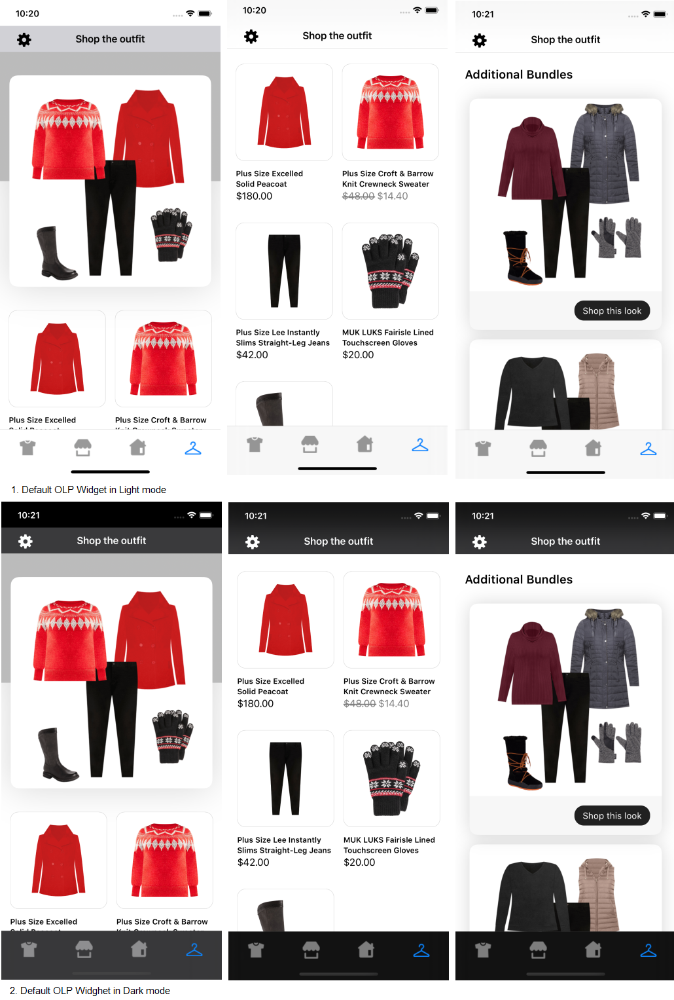
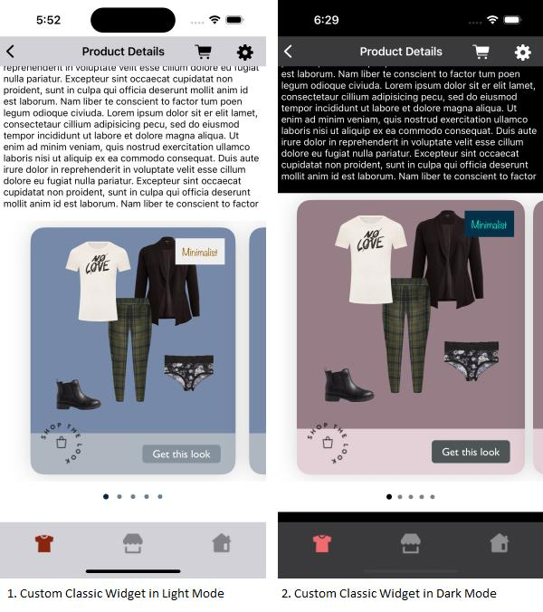
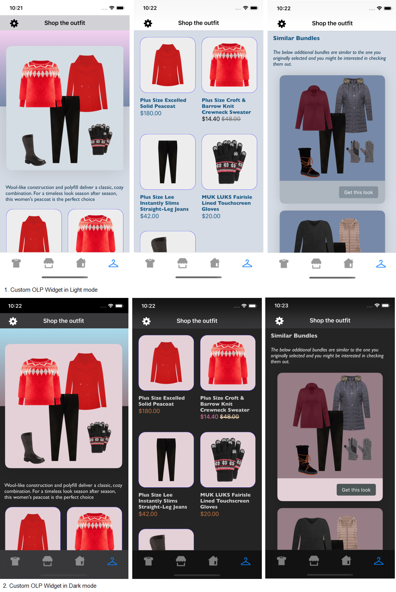

# Light and Dark Mode Support

This document provides the information about *_**Light and Dark mode support**_* for both default and custom configurations.

## Default Light and Dark Mode Support

Below are the implementation details for the *_**default Light and Dark mode**_* support for UI components implemented in UX SDK.

### 1. Classic Outfit Widget


No default dark mode support is added to the Classic Outfit Widget. In dark mode, the Outfit widget will be displayed with the same configurations as shown below.

**Screenshots :**


### 2. Hotspot Outfit Widget

No default dark mode support is added to the Hotspot Outfit Widget. In dark mode, the Outfit widget will be displayed with the same configurations as shown below.


### 3. Grid Outfit Widget

No default dark mode support is added to the Grid Outfit Widget. In dark mode, the Outfit widget will be displayed with the same configurations as shown below.


### 4. Dynamic Gallery Widget

No default dark mode support is added to the Dynamic Gallery Widget. In dark mode, the Dynamic Gallery Widget will be displayed with the same configurations as shown below.


### 5. Shop The Set Widget

No default dark mode support is added to the Shop The Set Widget. In dark mode, the Shop The Set Widget will be displayed with the same configurations as shown below.


### 6. Styled For You Widget

No default dark mode support is added to the Styled For You Widget. In dark mode, the Styled For You Widget will be displayed with the same configurations as shown below.


### 7. Outfit Landing Page(OLP) Widget

No default dark mode support is added to the OLP Widget. In dark mode, the OLP Widget will be displayed with the same configurations as shown below.



### 8. Trending Bundles Widget

No default dark mode support is added to the Trending Bundles Widget. In dark mode, the Trending Bundles widget will be displayed with the same configurations as shown below.


### 9. UpsellItems Widget

No default dark mode support is added to the UpsellItems Widget. In dark mode, the UpsellItems widget will be displayed with the same configurations as shown below.


### 10. Styled For You Full Page Widget

No default dark mode support is added to the Styled For You Full Page Widget. In dark mode, this widget will be displayed with the same configurations as shown below.


### 11. Variant Widget

No default dark mode support is added to the Variant Widget. In dark mode, this widget will be displayed with the same configurations as shown below.


### 12. Standard Product List

**Screenshots :**


### 13. Mix and Match Screen

Below screenshot shows the Mix and Match Screen in default Light and Dark mode.

**Screenshots :**

</br>


### 14. OutfitBundle Product List

No default dark mode support is added to the Outfit Bundle Product List. In dark mode, the Outfit Bundle Product List will be displayed with the same configurations as shown below.

**Screenshots :**


## Custom Light and Dark Mode Support

The default Light and Dark mode colors can be customised by adding colors to the *_**Assets file**_*. Use *_**Any**_* to define Light mode colors and *_**Dark**_* to define Dark mode colors. Below is the screenshot for the reference.<br /><br />


**_**Note**_* : <br />1. If you select appearance to be of type *_**None**_*, the same color will be used in light and Dark mode. <br />*

Below are the implementation details to customise the Light and Dark mode support from Sample Integrator App.

### 1. Classic Outfit Widget

Below screenshot shows the Classic Outfit Widget in custom Light and Dark mode.

**Screenshots :**



### 2. Hotspot Outfit Widget

Below screenshot shows the Hotspot Outfit Widget in custom Light and Dark mode.

**Screenshots :**


### 3. Grid Outfit Widget

Below screenshot shows the Grid Outfit Widget in custom Light and Dark mode.

**Screenshots :**


### 4. Dynamic Gallery Widget

Below screenshot shows the Dynamic Gallery Widget in custom Light and Dark mode.

**Screenshots :**


### 5. Shop The Set Widget

Below screenshot shows the Shop The Set Widget in custom Light and Dark mode.

**Screenshots :**


### 6. Styled For You Widget

Below screenshot shows the Styled For You Widget in custom Light and Dark mode.

**Screenshots :**


### 7. Outfit Landing Page(OLP) Widget

Below screenshot shows the OLP Widget in custom Light and Dark mode.

**Screenshots :**



### 8. Trending Bundles Widget

Below screenshot shows the Trending Bundles Widget in custom Light and Dark mode.

**Screenshots :**


### 9. Upsell Items Widget

Below screenshot shows the Upsell Items Widget in custom Light and Dark mode.

**Screenshots :**


### 10. Styled For You Full Page Widget

Below screenshot shows the Styled For You Full Page Widget in custom Light and Dark mode.

**Screenshots :**


### 11. Variant Widget

Below screenshot shows the Variant Widget in custom Light and Dark mode.

**Screenshots :**

</br>


### 12. Standard Product List

Below screenshot shows the Standard Product List in custom Light and Dark mode.

**Screenshots :**


### 13. Mix and Match Screen

Below screenshot shows the Mix and Match Screen in custom Light and Dark mode.

**Screenshots :**

</br>


### 14. OutfitBundle Product List

Below screenshot shows the Outfit Bundle Product List in custom Light and Dark mode.

**Screenshots :**


**Code example to customize the Dark And Light Mode colors**

```swift
func classicWidgetWithProductListFromUXSDKAndAllCustomConfigurations(outfits: Outfits) -> UIView {
    let itemListHeader = ProductListScreenConfig.ItemListHeader(title: "Products",
                                                                productListScreenHeaderAlign: .centre,
                                                                fontFamilyAndWeight: "Gill Sans Italic",
                                                                fontSize: 26,
                                                                fontColor: UIColor(named: "standard_product_list_screen_title_font_color")!)
    let productListConfig = ProductListConfig(backgroundColor: UIColor(named: "standard_product_list_item_background_color")!,
                                              paddingVertical: 20,
                                              paddingHorizontal: 10,
                                              imageBackgroundColor: UIColor(named: "standard_product_list_image_background_color")!,
                                              imageBorderColor: UIColor(named: "standard_product_list_image_border_color")!,
                                              productDetailsPadding: 20,
                                              itemName: ProductListConfig.ItemName(fontFamilyAndWeight: "Noteworthy",
                                                                                   fontSize: 19,
                                                                                   fontColor: UIColor(named: "standard_product_list_item_name_font_color")!,
                                                                                   titleTextTransform: .upper),
                                              itemPrice: ProductListConfig.ItemPrice(verticalSpacing: 3,
                                                                                     fontFamilyAndWeight: "Gill Sans Italic",
                                                                                     fontSize: 18,
                                                                                     priceFontColor: UIColor(named: "standard_product_list_item_price_font_color")!,
                                                                                     salePriceFontColor: UIColor(named: "standard_product_list_item_sale_price_font_color")!,
                                                                                     strikeThroughPriceFontColor: UIColor(named: "standard_product_list_item_price_strike_color")!,
                                                                                     style: .show,
                                                                                     swapPricesPosition: true),
                                              swapButton: ProductListConfig.SwapButton(title: "Replace",
                                                                                       fontFamilyAndWeight: "Gill Sans Italic",
                                                                                       fontSize: 18,
                                                                                       fontColor: UIColor(named: "standard_product_list_swap_text_font_color")!,
                                                                                       backgroundColor: UIColor(named: "standard_product_list_swap_button_background_color")!,
                                                                                       paddingVertical: 15,
                                                                                       paddingHorizontal: 15,
                                                                                       cornerRadius: 8),
                                              itemDividerColor: UIColor(named: "standard_product_list_item_divider_color")!,
                                              hideAnchorItem: true)
    
    let productListListener = ProductListListener(onOutfitItemClick: { outfitBundleInfo, outfitBundleItemInfo in
        // Here, in addition to handling any integrator analytics, natively navigate the user to the selected item's PDP (or launch a quick shop experience).
        print("Outfit item click event triggered, outfitBundleInfo : \(outfitBundleInfo), outfitBundleItemInfo : \(outfitBundleItemInfo)")
        print("outfitItem otherClientItemId = \(String(describing: outfitBundleItemInfo.outfitBundleItem.otherClientItemIds))")
    }, onOutfitItemView: { outfitBundleInfo, outfitBundleItemInfo in
        // Here, in addition to handling any integrator analytics, natively navigate the user to the selected item's PDP (or launch a quick shop experience).
        print("Outfit item view event triggered, outfitBundleInfo : \(outfitBundleInfo), outfitBundleItemInfo : \(outfitBundleItemInfo)")
        print("outfitItem otherClientItemId = \(String(describing: outfitBundleItemInfo.outfitBundleItem.otherClientItemIds))")
    })
    
    let replacementCustomConfig = ReplacementScreenConfig(backgroundColor: UIColor(named: "replacement_screen_background")!,
                                                          header: ReplacementScreenConfig.Header(title: "Replace an item",
                                                                                                 align: .top,
                                                                                                 fontFamilyAndWeight: "HelveticaNeue-medium",
                                                                                                 fontSize: 20,
                                                                                                 fontColor: UIColor(named: "replacement_screen_title_font_color")!),
                                                          config: ReplacementItemConfig(items: ReplacementItemConfig.Items(paddingOutsideHorizontal: 18,
                                                                                                                           paddingInsideHorizontal: 19,
                                                                                                                           paddingInsideVertical: 20),
                                                                                        item: ReplacementItemConfig.Item(imageBackgroundColor: UIColor(named: "replacement_image_background_color")!,
                                                                                                                         borderColor: UIColor(named: "replacement_item_image_border_color")!,
                                                                                                                         borderWidth: 3,
                                                                                                                         borderRadius: 20,
                                                                                                                         fontColor: UIColor(named: "replacement_item_name_font_color")!,
                                                                                                                         fontFamilyAndWeight: "Gill Sans Bold",
                                                                                                                         fontSize: 15,
                                                                                                                         priceFontColor: UIColor(named: "replacement_item_price_font_color")!,
                                                                                                                         priceFontFamilyAndWeight: "Gill Sans Bold",
                                                                                                                         priceFontSize: 20,
                                                                                                                         salePriceFontColor: UIColor(named: "replacement_item_sale_price_font_color")!,
                                                                                                                         strikeThroughPriceFontColor: UIColor(named: "replacement_strike_trough_price_color")!,
                                                                                                                         style: .show,
                                                                                                                         swapPricesPosition: true,
                                                                                                                         paddingHorizontal: 15,
                                                                                                                         paddingVertical: 12)))
    
    let productListScreenConfig = ProductListScreenConfig(itemListHeader: itemListHeader,
                                                          productListConfig: productListConfig,
                                                          productListListener: productListListener,
                                                          presentationStyle: .fullScreen)
    let productListScreenTemplate = ProductListScreenTemplate.standard(productListScreenConfig: productListScreenConfig,
                                                                       replacementListScreenConfig: replacementCustomConfig)
    
    return StyliticsUIApis.load(outfits: outfits,
                                outfitsTemplate: .classic(),
                                productListScreenTemplate: productListScreenTemplate)
}
```

## In-App Dark Mode Support 

### Settings Screen

In this screen, user can enable/disable the dark mode manually from application.

Below is the reference code to programatically change light/dark mode

```swift
@IBAction func darkModeSwitchAction(_ sender: Any) {
    if #available(iOS 13.0, *) {
        let appDelegate = UIApplication.shared.windows.first
        if darkModeSwitch.isOn {
            appDelegate?.overrideUserInterfaceStyle = .dark
            viewModel.updateDarkModeState(true)
            return
        }
        appDelegate?.overrideUserInterfaceStyle = .light
        viewModel.updateDarkModeState(false)
        return
    }
}
```

### Disable Dark Mode

Use the below line of code to disable Dark mode in Integrator app and SDK.

```swift
let appDelegate = UIApplication.shared.windows.first
appDelegate?.overrideUserInterfaceStyle = .light
```

## iOS Versioning Support

- Minimum required iOS APP version to access features of SDK is - (iOS 13.0)

## License

Copyright © 2023 Stylitics
