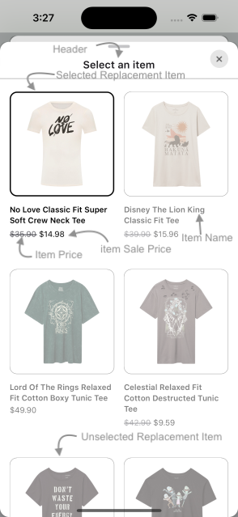
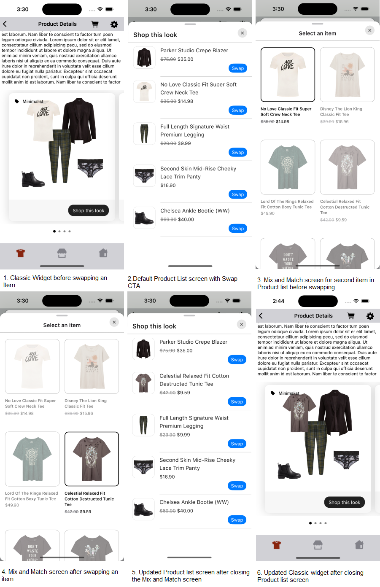
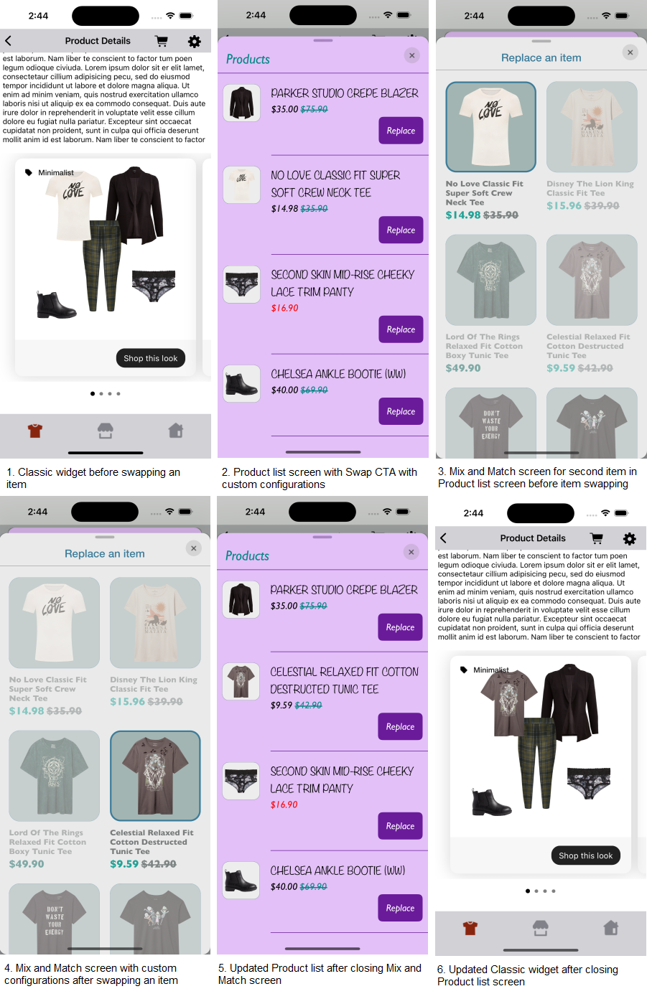
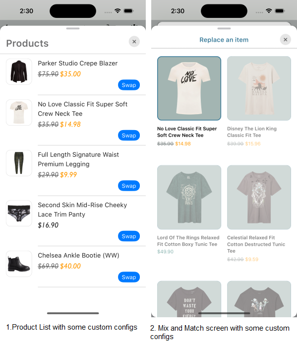

# MIX AND MATCH SCREEN

This screen is displayed when user clicks on `Swap` CTA in Product list screen. It provides views to display Replacements items for Product list item. It also handles invoking of item tracking events based on user interaction with these views.

Below are the features for Mix and Match Screen 
* Configure all the UI elements for Mix and Match Screen
* Handles tracking events so Integrator App does not have to do it
* Provides listeners to Integrator App so they can handle the events

## Configurations

</br>

### Background Color

| Fields                   | Description                                                                   | Default Value  |
|--------------------------|-------------------------------------------------------------------------------|----------------|
| `backgroundColor`        | is to change Mix and Match background color and is accessed from assets file  | `#FFFFFF`      |

### Header

| Fields                | Description                                                                                                           | Default Value           | 
|-----------------------|-----------------------------------------------------------------------------------------------------------------------|-------------------------|
| `title`               | to set the header of the screen                                                                                       | `Select an item`        |           
| `align`               | to set the Mix and Match screen title alignment with close button. It will be center aligned when the value is CENTER | `Align.top`             |           
| `fontFamilyAndWeight` | is the font style with the font weight and is accessed from the font resource folder                                  | `SFProText-Semibold`    |           
| `fontSize`            | is the font size in float and internally it is converted into SP                                                      | `17`                    |           
| `fontColor`           | is text color and is accessed from color.xml resource file                                                            | `#1D1B1F`               |

### Presentation Style

| Fields               | Description                                         | Default Value                         |
|----------------------|-----------------------------------------------------|---------------------------------------|
| `presentationStyle`  | to set the Mix and Match screen Presentation style  | `UIModalPresentationStyle.automatic`  |

### Items

| Fields                     | Description                                                                                   | Default Value | 
|----------------------------|-----------------------------------------------------------------------------------------------|---------------|
| `paddingOutsideHorizontal` | is left and right spacing of the replacement items with the margin. It accepts CGFloat value  | `16`          |           
| `paddingInsideHorizontal`  | is the horizontal spacing between two replacement items. It accepts CGFloat value             | `16`          |           
| `paddingInsideVertical`    | is the vertical spacing between two replacement items. It accepts CGFloat value               | `44`          |           

### Item

| Fields                        | Description                                                                                                       | Default Value              |
|-------------------------------|-------------------------------------------------------------------------------------------------------------------|----------------------------|
| `imageBackgroundColor`        | is the background to the item image and is accessed from drawable resource file                                   | `#FFFFFF`                  |
| `borderColor`                 | is the item image border color                                                                                    | `#000000`                  |
| `borderWidth`                 | is the item image border width in CGFloat                                                                         | `2`                        |
| `borderRadius`                | is the item border radius in CGFloat                                                                              | `12`                       |
| `fontColor`                   | to set item text color which is accessed from assets file                                                         | `#000000`                  |
| `fontFamilyAndWeight`         | is the font style with the font weight                                                                            | `SFProText-Semibold`       |
| `fontSize`                    | is font size in CGFloat                                                                                           | `13`                       |
| `priceFontColor`              | is price text color which is accessed from assets file                                                            | `#000000`                  |
| `priceFontFamilyAndWeight`    | is the price font style with the font weight                                                                      | `SFProText-Regular`        |
| `priceFontSize`               | is the price font size in CGFloat                                                                                 | `13`                       |
| `salePriceFontColor`          | to set item sale price text color which is accessed from assets file                                              | `#000000`                  |
| `strikeThroughPriceFontColor` | is strike through price text color which is accessed from assets file                                             | `#3B3B43`                  |
| `style`                       | to show or hide the Strike Through Price                                                                          | `PriceStrikethrough.show`  |
| `swapPricesPosition`          | is boolean value, when it is false it shows strike through price first and then sale price. Vice versa when true. | `false`                    |
| `paddingHorizontal`           | is to set left and right spacing inside the item. It accepts CGFloat value                                        | `16`                       |
| `paddingVertical`             | is to set top and bottom spacing inside the item. It accepts CGFloat value                                        | `16`                       |


##### Implement Exposed Listeners
Below are the list of Mix and Match screen listeners exposed to the Integrator app.

1. `onMixAndMatchExpand` - On click event of `Swap` CTA, this listener will be triggered.
2. `onMixAndMatchCollapse` - On Mix and Match screen collapse event, this listener will be invoked.
3. `onItemSwap` - On swap event of item in Mix and Match screen, this listener will be triggered.

## Mix and Match Screen When Product List Screen Displayed From UX SDK

### With Default Configurations

Below is the example of Product List and Mix and Match Screen when Sample Integrator App chooses to use default UI configurations.

*_**Swift**_*

Below is the code to access Product List and Mix and Match Screen from UX SDK.

It is recommended that Integrator App provide the **onOutfitItemClick** listener implementation.

```swift
static func widgetWithProductListFromUXSDK(outfits: Outfits) -> UIView {
    StyliticsUIApis.load(outfits: outfits,
                         outfitsTemplate: .classic())
}
```

* Below is the Product List and Mix and Match screenshot when Sample Integrator App uses the default configurations

</br>

### With Custom Configurations

Below are the examples of Product List and Mix and Match Screen when Sample Integrator App chooses to use custom configurations.

*_**Swift**_*

#### 1. With All Custom Configurations and Listeners

```swift
static func widgetWithProductListFromUXSDKAndAllCustomConfigsForProductListAndReplacementScreen(outfits: Outfits) -> UIView {
    let productListListener = ProductListListener { outfitBundleInfo, outfitBundleItemInfo in
        print("Outfit item click event triggered : outfitBundleInfo : \(outfitBundleInfo), outfitBundleItemInfo : \(outfitBundleItemInfo)")
        print("outfitItem otherClientItemId = \(String(describing: outfitBundleItemInfo.outfitBundleItem.otherClientItemIds))")
    } onOutfitItemView: { outfitBundleInfo, outfitBundleItemInfo in
        print("Outfit item view event triggered : \(outfitBundleInfo), outfitBundleItemInfo : \(outfitBundleItemInfo)")
    }

    let productListScreenConfig = ProductListScreenConfig(itemListHeader: ProductListScreenConfig.ItemListHeader(title: "Products",
                                                                                                                 productListScreenHeaderAlign: .top,
                                                                                                                 fontFamilyAndWeight: "Gill Sans Italic",
                                                                                                                 fontSize: 26,
                                                                                                                 fontColor: UIColor(named: "standard_product_list_screen_title_font_color")!),
                                                          productListConfig: ProductListConfig(backgroundColor: UIColor(named: "standard_product_list_item_background_color")!,
                                                                                               paddingVertical: 20,
                                                                                               paddingHorizontal: 10,
                                                                                               imageBackgroundColor: UIColor(named: "standard_product_list_image_background_color")!,
                                                                                               imageBorderColor: UIColor(named: "standard_product_list_image_border_color")!,
                                                                                               productDetailsPadding: 20,
                                                                                               itemName: ProductListConfig.ItemName(fontFamilyAndWeight: "Noteworthy",
                                                                                                                                    fontSize: 19,
                                                                                                                                    fontColor: UIColor(named: "standard_product_list_item_name_font_color")!,
                                                                                                                                    titleTextTransform: .upper),
                                                                                               itemPrice: ProductListConfig.ItemPrice(verticalSpacing: 3,
                                                                                                                                      fontFamilyAndWeight: "Gill Sans Italic",
                                                                                                                                      fontSize: 18,
                                                                                                                                      priceFontColor: UIColor(named: "standard_product_list_item_price_font_color")!,
                                                                                                                                      salePriceFontColor: UIColor(named: "standard_product_list_item_sale_price_font_color")!,
                                                                                                                                      strikeThroughPriceFontColor: UIColor(named: "standard_product_list_item_price_strike_color")!,
                                                                                                                                      style: .show,
                                                                                                                                      swapPricesPosition: true),
                                                                                               swapButton: ProductListConfig.SwapButton(title: "Replace",
                                                                                                                                        fontFamilyAndWeight: "Gill Sans Italic",
                                                                                                                                        fontSize: 18,
                                                                                                                                        fontColor: UIColor(named: "standard_product_list_swap_text_font_color")!,
                                                                                                                                        backgroundColor: UIColor(named: "standard_product_list_swap_button_background_color")!,
                                                                                                                                        paddingVertical: 15,
                                                                                                                                        paddingHorizontal: 15,
                                                                                                                                        cornerRadius: 8),
                                                                                               itemDividerColor: UIColor(named: "standard_product_list_item_divider_color")!,
                                                                                               hideAnchorItem: true),
                                                          productListListener: productListListener,
                                                          presentationStyle: .automatic)
    let replacementListener = ReplacementListener { outfitId, oldItemId, newItemId in
        print("Item swap event triggered, outfitId = \(outfitId), oldItemId = \(oldItemId), newItemId = \(newItemId)")
    } onMixAndMatchExpand: { outfitBundleInfo, outfitBundleItemInfo in
        print("onMixAndMatchExpand event triggered, outfitBundleInfo: \(outfitBundleInfo), outfitBundleItemInfo :\(outfitBundleItemInfo)")
        print("outfitItem otherClientItemId = \(String(describing: outfitBundleItemInfo.outfitBundleItem.otherClientItemIds))")
    } onMixAndMatchCollapse: { outfitBundleInfo, outfitBundleItemInfo in
        print("onMixAndMatchCollapse event triggered, outfitBundleInfo: \(outfitBundleInfo), outfitBundleItemInfo :\(outfitBundleItemInfo)")
        print("outfitItem otherClientItemId = \(String(describing: outfitBundleItemInfo.outfitBundleItem.otherClientItemIds))")
    }

    let replacementScreenConfig = ReplacementScreenConfig(backgroundColor: UIColor(named: "replacement_screen_background")!,
                                                          header: ReplacementScreenConfig.Header(title: "Replace an item",
                                                                                                 align: .top,
                                                                                                 fontFamilyAndWeight: "HelveticaNeue-medium",
                                                                                                 fontSize: 20,
                                                                                                 fontColor: UIColor(named: "replacement_screen_title_font_color")!),
                                                          config: ReplacementItemConfig(items: ReplacementItemConfig.Items(paddingOutsideHorizontal: 18,
                                                                                                                           paddingInsideHorizontal: 19,
                                                                                                                           paddingInsideVertical: 20),
                                                                                        item: ReplacementItemConfig.Item(imageBackgroundColor: UIColor(named: "replacement_image_background_color")!,
                                                                                                                         borderColor: UIColor(named: "replacement_item_image_border_color")!,
                                                                                                                         borderWidth: 3,
                                                                                                                         borderRadius: 20,
                                                                                                                         fontColor: UIColor(named: "replacement_item_name_font_color")!,
                                                                                                                         fontFamilyAndWeight: "Gill Sans Bold",
                                                                                                                         fontSize: 15,
                                                                                                                         priceFontColor: UIColor(named: "replacement_item_price_font_color")!,
                                                                                                                         priceFontFamilyAndWeight: "Gill Sans Bold",
                                                                                                                         priceFontSize: 20,
                                                                                                                         salePriceFontColor: UIColor(named: "replacement_item_sale_price_font_color")!,
                                                                                                                         strikeThroughPriceFontColor: UIColor(named: "replacement_strike_trough_price_color")!,
                                                                                                                         style: .show,
                                                                                                                         swapPricesPosition: true,
                                                                                                                         paddingHorizontal: 15,
                                                                                                                         paddingVertical: 12)),
                                                          listener: replacementListener,
                                                          presentationStyle: .automatic)
    let productListScreenTemplate = ProductListScreenTemplate.standard(productListScreenConfig: productListScreenConfig,
                                                                       replacementListScreenConfig: replacementScreenConfig)
    return StyliticsUIApis.load(outfits: outfits,
                                outfitsTemplate: .classic(),
                                productListScreenTemplate: productListScreenTemplate)
}
```

* Below is the Product List and Mix and Match screenshot when Sample Integrator App uses the above configurations.

</br>

#### 2. With Some Custom Configurations and listeners

```swift
static func widgetWithProductListFromUXSDKAndSomeCustomConfigurationsForProductListAndReplacementScreen(outfits: Outfits) -> UIView {
    let productListScreenConfig = ProductListScreenConfig(itemListHeader: ProductListScreenConfig.ItemListHeader(title: "Products",
                                                                                                                 productListScreenHeaderAlign: .centre,
                                                                                                                 fontSize: 26,
                                                                                                                 fontColor: UIColor(named: "standard_product_list_screen_title_font_color")!),
                                                          productListConfig: ProductListConfig(itemPrice: ProductListConfig.ItemPrice(fontFamilyAndWeight: "Gill Sans Italic",
                                                                                                                                      fontSize: 20,
                                                                                                                                      salePriceFontColor: UIColor(named: "standard_product_list_item_sale_price_font_color")!,
                                                                                                                                      style: .show)))
    let replacementScreenConfig = ReplacementScreenConfig(header: ReplacementScreenConfig.Header(title: "Replace an item",
                                                                                                 align: .centre,
                                                                                                 fontColor: UIColor(named: "replacement_screen_title_font_color")!),
                                                          config: ReplacementItemConfig(item: ReplacementItemConfig.Item(imageBackgroundColor: UIColor(named: "replacement_image_background_color")!,
                                                                                                                         borderColor: UIColor(named: "replacement_item_image_border_color")!,
                                                                                                                         priceFontColor: UIColor(named: "replacement_item_price_font_color")!,
                                                                                                                         salePriceFontColor: UIColor(named: "replacement_item_sale_price_font_color")!,
                                                                                                                         strikeThroughPriceFontColor: UIColor(named: "replacement_strike_trough_price_color")!,
                                                                                                                         style: .show)),
                                                          presentationStyle: .automatic)
    let productListScreenTemplate = ProductListScreenTemplate.standard(productListScreenConfig: productListScreenConfig,
                                                                       replacementListScreenConfig: replacementScreenConfig)
    return StyliticsUIApis.load(outfits: outfits,
                                outfitsTemplate: .classic(),
                                productListScreenTemplate: productListScreenTemplate)
}
```

* Below is the Mix and Match Screen screenshot when Sample Integrator App uses the above configurations.

</br>

## Mix and Match Screen When Product List Screen from Integrator App

### With Default Configurations

```swift
static func displayOutfitBundleItemsAndMixAndMatchWidgetWithDefaultConfigurations(outfits: Outfits) -> UIView {
    let listener = ClassicListener(onClick: { outfitBundleInfo in
        /// To display Product List Screen (from Integrator) when user selects an Outfit Bundle
        ScreenDisplayUtility.showDetailsOverlayScreen(outfitBundle: outfitBundleInfo.outfitBundle)
    })
    return StyliticsUIApis.load(outfits: outfits,
                                outfitsTemplate: .classic(classicListener: listener),
                                displayProductListFromSDK: false)
}
```

### With Custom Configurations

```swift
static func displayOutfitBundleItemsAndMixAndMatchWidgetWithCustomConfigurations(outfits: Outfits) -> UIView {
    let productListListener = ProductListListener { outfitBundleInfo, outfitBundleItemInfo in
        print("Outfit item click event triggered : outfitBundleInfo : \(outfitBundleInfo), outfitBundleItemInfo : \(outfitBundleItemInfo)")
        print("outfitItem otherClientItemId = \(String(describing: outfitBundleItemInfo.outfitBundleItem.otherClientItemIds))")
    } onOutfitItemView: { outfitBundleInfo, outfitBundleItemInfo in
        print("Outfit item view event triggered : \(outfitBundleInfo), outfitBundleItemInfo : \(outfitBundleItemInfo)")
    }

    let productListScreenConfig = ProductListScreenConfig(productListConfig: ProductListConfig(backgroundColor: UIColor(named: "standard_product_list_item_background_color")!,
                                                                                               paddingVertical: 20,
                                                                                               paddingHorizontal: 10,
                                                                                               imageBackgroundColor: UIColor(named: "standard_product_list_image_background_color")!,
                                                                                               imageBorderColor: UIColor(named: "standard_product_list_image_border_color")!,
                                                                                               productDetailsPadding: 20,
                                                                                               itemName: ProductListConfig.ItemName(fontFamilyAndWeight: "Noteworthy",
                                                                                                                                    fontSize: 19,
                                                                                                                                    fontColor: UIColor(named: "standard_product_list_item_name_font_color")!,
                                                                                                                                    titleTextTransform: .upper),
                                                                                               itemPrice: ProductListConfig.ItemPrice(verticalSpacing: 3,
                                                                                                                                      fontFamilyAndWeight: "Gill Sans Italic",
                                                                                                                                      fontSize: 18,
                                                                                                                                      priceFontColor: UIColor(named: "standard_product_list_item_price_font_color")!,
                                                                                                                                      salePriceFontColor: UIColor(named: "standard_product_list_item_sale_price_font_color")!,
                                                                                                                                      strikeThroughPriceFontColor: UIColor(named: "standard_product_list_item_price_strike_color")!,
                                                                                                                                      style: .show,
                                                                                                                                      swapPricesPosition: true),
                                                                                               swapButton: ProductListConfig.SwapButton(title: "Replace",
                                                                                                                                        fontFamilyAndWeight: "Gill Sans Italic",
                                                                                                                                        fontSize: 18,
                                                                                                                                        fontColor: UIColor(named: "standard_product_list_swap_text_font_color")!,
                                                                                                                                        backgroundColor: UIColor(named: "standard_product_list_swap_button_background_color")!,
                                                                                                                                        paddingVertical: 15,
                                                                                                                                        paddingHorizontal: 15,
                                                                                                                                        cornerRadius: 8),
                                                                                               itemDividerColor: UIColor(named: "standard_product_list_item_divider_color")!,
                                                                                               hideAnchorItem: true),
                                                          productListListener: productListListener,
                                                          presentationStyle: .automatic)
    let replacementListener = ReplacementListener { outfitId, oldItemId, newItemId in
        print("Item swap event triggered, outfitId = \(outfitId), oldItemId = \(oldItemId), newItemId = \(newItemId)")
    } onMixAndMatchExpand: { outfitBundleInfo, outfitBundleItemInfo in
        print("onMixAndMatchExpand event triggered, outfitBundleInfo: \(outfitBundleInfo), outfitBundleItemInfo :\(outfitBundleItemInfo)")
        print("outfitItem otherClientItemId = \(String(describing: outfitBundleItemInfo.outfitBundleItem.otherClientItemIds))")
    } onMixAndMatchCollapse: { outfitBundleInfo, outfitBundleItemInfo in
        print("onMixAndMatchCollapse event triggered, outfitBundleInfo: \(outfitBundleInfo), outfitBundleItemInfo :\(outfitBundleItemInfo)")
        print("outfitItem otherClientItemId = \(String(describing: outfitBundleItemInfo.outfitBundleItem.otherClientItemIds))")
    }

    let replacementScreenConfig = ReplacementScreenConfig(backgroundColor: UIColor(named: "replacement_screen_background")!,
                                                          header: ReplacementScreenConfig.Header(title: "Replace an item",
                                                                                                 align: .top,
                                                                                                 fontFamilyAndWeight: "HelveticaNeue-medium",
                                                                                                 fontSize: 20,
                                                                                                 fontColor: UIColor(named: "replacement_screen_title_font_color")!),
                                                          config: ReplacementItemConfig(items: ReplacementItemConfig.Items(paddingOutsideHorizontal: 18,
                                                                                                                           paddingInsideHorizontal: 19,
                                                                                                                           paddingInsideVertical: 20),
                                                                                        item: ReplacementItemConfig.Item(imageBackgroundColor: UIColor(named: "replacement_image_background_color")!,
                                                                                                                         borderColor: UIColor(named: "replacement_item_image_border_color")!,
                                                                                                                         borderWidth: 3,
                                                                                                                         borderRadius: 20,
                                                                                                                         fontColor: UIColor(named: "replacement_item_name_font_color")!,
                                                                                                                         fontFamilyAndWeight: "Gill Sans Bold",
                                                                                                                         fontSize: 15,
                                                                                                                         priceFontColor: UIColor(named: "replacement_item_price_font_color")!,
                                                                                                                         priceFontFamilyAndWeight: "Gill Sans Bold",
                                                                                                                         priceFontSize: 20,
                                                                                                                         salePriceFontColor: UIColor(named: "replacement_item_sale_price_font_color")!,
                                                                                                                         strikeThroughPriceFontColor: UIColor(named: "replacement_strike_trough_price_color")!,
                                                                                                                         style: .show,
                                                                                                                         swapPricesPosition: true,
                                                                                                                         paddingHorizontal: 15,
                                                                                                                         paddingVertical: 12)),
                                                          listener: replacementListener,
                                                          presentationStyle: .automatic)
    let productListScreenTemplate = ProductListScreenTemplate.standard(productListScreenConfig: productListScreenConfig,
                                                                       replacementListScreenConfig: replacementScreenConfig)
    let listener = ClassicListener(onClick: { outfitBundleInfo in
        /// To display Product List Screen (from Integrator) when user selects an Outfit Bundle
        ScreenDisplayUtility.showDetailsOverlayScreen(outfitBundle: outfitBundleInfo.outfitBundle)
    })
    return StyliticsUIApis.load(outfits: outfits,
                                outfitsTemplate: .classic(classicListener: listener),
                                displayProductListFromSDK: false,
                                productListScreenTemplate: productListScreenTemplate)
}
```

## License

Copyright © 2024 Stylitics
