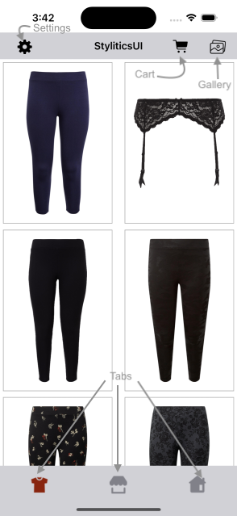
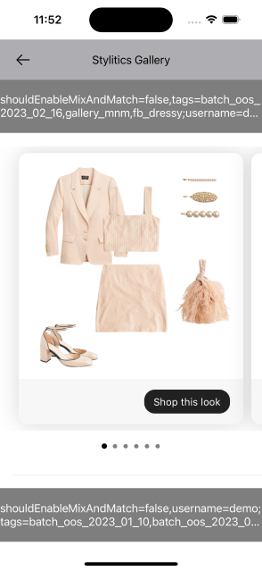
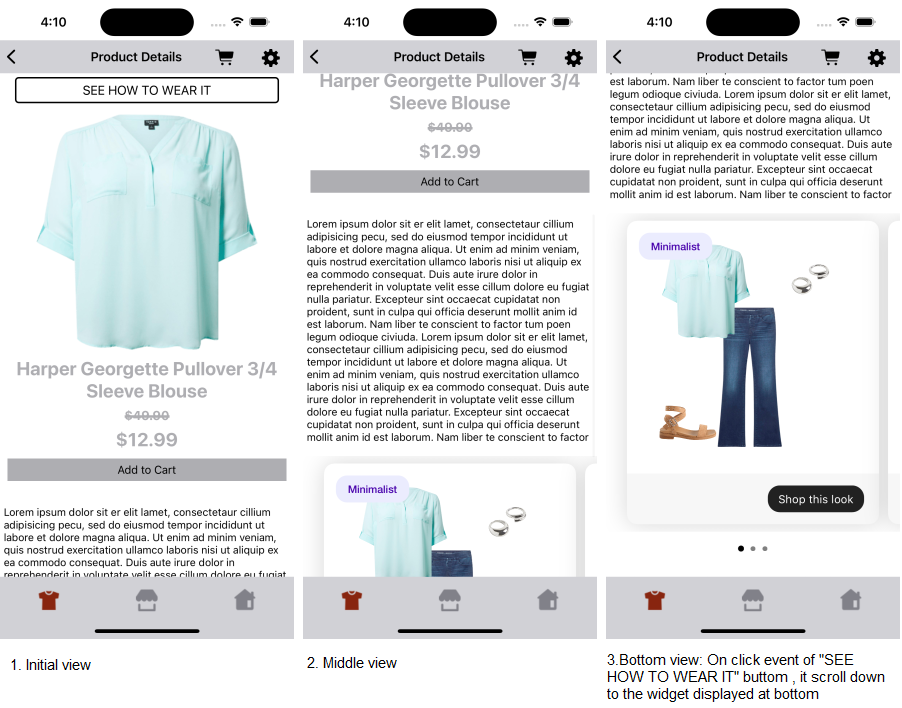
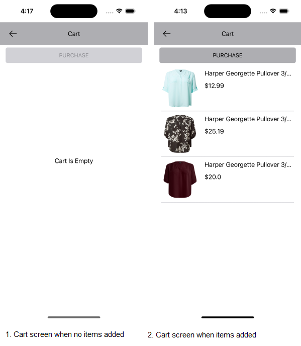
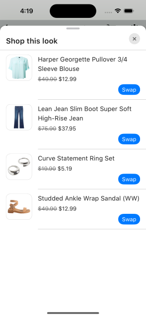
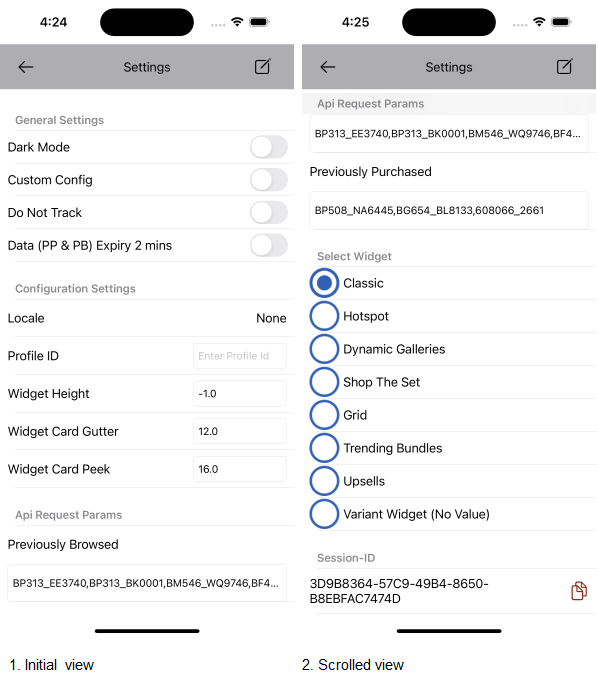

# Stylitics Sample Integrator App

This is a Sample Integrator application to showcase the integration of Stylitics Data & UX SDK.
- The Data SDK is used by Sample Integrator app to use Stylitics services. Currently the Data SDK provides services to fetch Outfits, replacements, Dynamic Gallery and send tracking events.
- The UX SDK provides views to display Stylitics data. For example, Classic Outfit widget can be used to display Outfits Data. These views automatically sends the required tracking events to Stylitics server which reduces efforts for the Integrator App.
- This file is an overview of the sample app, with a brief description of its screens and how it uses Stylitics SDKs; more detail can be found in the [DATA SDK README](DATA_SDK_README.md) and the [UX SDK README](UX_SDK_README.md).

## Dependency Manager

## CocoaPods

### Prerequisite
Make sure you have pod installed version > 1.9.0

*Note : To check pod version execute below command:*
```console
pod --version
```
If pod is not installed or version is less than 1.9.0 Execute below command to install or update pod.

```console
gem install cocoapods
```
*Note : Use the command below if a permissions-related problem arises.*
```console
sudo gem install cocoapods
```
    
### Steps To install Dependencies:

   * When Consumer already have podfile.
    
   Add below command in podfile and execute from step 3.

```console
pod ’StyliticsUX', '1.8.0', :source => "git@github.com:Stylitics/ios-sdk-cocoapods-artifacts.git"
```

   * When Consumer Does not have podfile.
    
   1. Open terminal and move inside consumer application folder using cd command.
```console
cd <path to project>/StyliticsSampleApp
```
   2. Create pod file using below command
```console
cat > Podfile <<-EOF
target 'StyliticsSampleApp' do
    use_frameworks!
    pod 'StyliticsUX', '1.8.0', :source => "git@github.com:Stylitics/ios-sdk-cocoapods-artifacts.git"
end
EOF
```
   3. Close any running instance of Xcode.
   4. Install dependencies using below command in terminal.
```console
pod install
```
   5. Open .xcworkspace

### Steps to update any particular version of framework

   * Update version in pod file like below:

```console
pod ’StyliticsUX', '1.8.0', :source => "git@github.com:Stylitics/ios-sdk-cocoapods-artifacts.git"
```
   * Run below command in terminal

```console
pod update
```

## Swift Package Manager

### Adding SPM Dependency in Xcode:

**Prerequisites:**
- Xcode installed on your machine.

**Instructions:**

1. **Open Your Xcode Project:**
   - Open your project in Xcode.

2. **Navigate to the Project Settings:**
   - Select your project in the Xcode Navigator to access the project settings.

3. **Select the Target:**
   - Under the "Targets" section, select the target for which you want to add the SPM dependency.

4. **Open the "Swift Packages" Tab:**
   - Navigate to the "Swift Packages" tab in the project settings.

5. **Add a New Package:**
   - Click on the "+" button to add a new package.

6. **Enter Package Repository URL:**
   - In the dialog that appears, enter the URL of the package repository:
     ```
     https://github.com/Stylitics/ios-ux-sdk-spm-artifacts.git
     ```

7. **Specify the Version:**
   - Choose to specify a version, branch, or commit.


8. **Add the Package:**
   - Click the "Add Package" button.

9. **Confirm Package Addition:**
   - Confirm that you want to add the package to your project.

10. **Wait for Xcode to Resolve Dependencies:**
    - Xcode will resolve and fetch the package. This process might take a moment.

11. **Use the Package:**
    - Once Xcode has finished fetching the package, you can start using the functionality provided by the `ios-ux-sdk-spm-artifacts` package in your project.

## Screens and Features

Sample app supports the below screens to showcase features of Stylitics Data and UX SDKs. 

### Configure Username and Environment
This screen lets the user select and configure the username and Environment. When user taps the *Build Store* button, the Data SDK's Config API is invoked to configure some required and optional configurations for the Data SDK.


### Sample Integrator Product Grid
When the "store" is ready, the user is shown two tabs. Both tabs show a grid of products that have outfit coverage (per the API server of the selected environment). Tapping on one brings the user to a sample PDP screen.

Tapping on -
* The gallery icon, the user will navigate to the Gallery screen
* The settings icon, the user will navigate to the Settings screen.
* The cart icon, the user will navigate to the Cart screen.
* The tab icon, the user can switch to another tab.

</br>

### Gallery

In this screen, we show multiple carousels for the outfits fetched from Stylitics server using different filters.

</br>

### PDP Screen 
On this screen, basic product details are shown, in addition to a recommended client-implemented feature (jumplink / "See How to Wear It"), and the app uses the Data SDK to fetch Stylitics Data. It sends the Api response data to the UX SDK to display in the Widget.



### Jumplink - See How to Wear It
When user clicks on the "See Wow to Wear it" button in the Product details page,
   * It automatically scrolls down to the Outfits view created using UX SDK.
   * Sample Integrator App should invoke 'jumplinkClicked' event using engagements API in Data SDK.
   * When Outfits comes into the view port, UX SDK sends the Outfit 'view' event for the visible Outfits using engagement API in Data SDK.
   * When user selects one of the Outfit, they are navigated to the Product List screen. 

*Note : If there are no outfits for an item, the **See how to wear it** button will be hidden.*

*Note: this is a feature that Stylitics recommend the integrator app put in place; it is not a component provided by the Stylitics UX SDK, currently.*

### Add To Cart
When user taps on Add to Cart CTA in the PDP page, 
* The Item will be added to the Cart.
* Sample Integrator app sends the [`add-to-cart`](DATA_SDK_README.md#Item-add-to-cart-event) tracking event using Data SDK's engagements API.

### Cart Screen
This screen shows the list of product items added by user and they can purchase all the product items from the Cart.
When user taps on `PURCHASE` button, Sample Integrator app sends the [`Purchase`](DATA_SDK_README.md#Purchase-event) tracking event using Data SDK's engagements API.



### Show Product Items
This screen shows the list of all Outfit items belonging to the selected Outfit from Product details page.When user enters this screen, the UX SDK sends item 'view' tracking event for the visible item using Data SDK's engagements API.

When user taps on any item in the list:
- The UX SDK sends the `outfitItemClicked` tracking event using Data SDK's engagements API.
- The UX SDK calls a corresponding listener function, which can be provided / attached by the integrator. All key UX events fire a similar callback/listener function. Many are useful for integrator-specific analytics attachments, but this one is particularly important because Stylitics strongly recommends that the client/integrator implement and attach this callback in order to -- in addition to any integrator analytics -- natively navigate the user to the selected item's PDP (or launch a quick shop experience).
- If the item click listener is not implemented by Sample Integrator App, it redirects to the web view when an item is clicked.



### Settings Screen

1. Enable/Disable Dark Mode
   
   Users can switch application's appearance using this option, by default it reflects the device's appearance setting.

2. Enable/Disable Custom Configuration

   With this option, users can switch to the custom configuration for UX SDK UI components. By default, it is disabled.

3. Do Not Track

   With this option, users can enable or disable the tracking feature. By default, tracking is enabled.  

4. Change Locale

    This shows the current locale selection in the app and also provides an option to change the locale in global configuration.
    
5. Widget Height
    
    With this option, users can change the Outfit widget view height in Sample/Integrator App.
    
6. Profile Id 

    It provides an option to change Customer Profile Id in global configuration. It also shows the current value for Customer Profile Id.

7. Api Request Params
  
   It provides an option to change Api Request Params. It also shows the current values for these params. 

8. Select Widget

    With this option, users can change the template for UX SDK UI components used to display Stylitics Data. By default, it is set to Classic.

9. Session-ID

   This is a UUID generated in DataSDK, user can view and copy this Id to clipboard.

   

## Tracking Events
This is to track the user's interaction with the App by calling the engagement API implemented in Data SDK. 

### Invoked from UX SDK

Widget related `view` and `click` tracking events are invoked and handled by the UX SDK. [Click here](DATA_SDK_README.md#Tracking-API-Examples) to read more about all tracking events.

### Invoked from Sample Integrator app
- Jumplink Clicked event - This event is invoked when user clicks on "See How To Wear It" button on the PDP page. 
- Purchase events (See Data SDK README)

---

[Click here](CODE_REFERENCE_README.md) for reference to files in the Sample Application that uses Data and UX SDK features.

---

### Configure Data SDK
There are some configurations which are required to access Data SDK features. [Click here](DATA_SDK_README.md#sdk-configuration) to know about the SDK configuration details.

### Fetch Stylitics Data
Fetch Stylitics data using Data APIs provided by the Data SDK. [Here](DATA_SDK_README.md#Stylitics-Data-API-Call-Examples) are the code examples for fetching the Stylitics Data.

### Display Stylitics Data
Use UX SDK views to display the Stylitics data provided by the Data SDK. [Click here](UX_SDK_README.md) to learn more about the UX SDK views and their configurations.

### Implement Exposed Listeners
Click on the widget template below to learn more about the list of listeners exposed to the Sample Integrator app.

  1. [Classic Outfit widget](CLASSIC_WIDGET_README.md#Implement-Exposed-Listeners)
  2. [Hotspot Outfit widget](HOTSPOT_WIDGET_README.md#Implement-Exposed-Listeners)
  3. [Grid Outfit widget](GRID_WIDGET_README.md#Implement-Exposed-Listeners)
  4. [Standard Product list view](STANDARD_PRODUCTLIST_README.md#Implement-Exposed-Listeners)
  5. [Dynamic Gallery widget](DYNAMIC_GALLERY_WIDGET_README.md#Implement-Exposed-Listeners)
  6. [Outfit Bundle Product list view](OUTFIT_BUNDLE_PRODUCTLIST_README.md#Implement-Exposed-Listeners)
  7. [Shop the Set widget](SHOP_THE_SET_WIDGET_README.md#Implement-Exposed-Listeners)
  8. [Styled For You widget](STYLED_FOR_YOU_WIDGET_README.md#Implement-Exposed-Listeners)
  9. [Outfit Landing Page widget](OUTFIT_LANDING_PAGE_WIDGET_README.md#Implement-Exposed-Listeners)
  10. [Styled For You Full Page](STYLED_FOR_YOU_FULL_PAGE_WIDGET_README.md#STYLED-FOR-YOU-FULL-PAGE-WIDGET)
  11. [Trending Bundles](TRENDING_BUNDLES_WIDGET_README.md#Implement-Exposed-Listeners)
  12. [Upsell Items](UPSELL_ITEMS_WIDGET_README.md#Implement-Exposed-Listeners)
  13. [Variant Widget](VARIANT_WIDGET_README.md#Implement-Exposed-Listeners)

### Purchase Events
This event should be triggered by Sample Integrator app when user purchases any item provided by Stylitics data. It will help Stylitics server to provide better recommendations for the user. [Click here to read about Purchase Event implementation](DATA_SDK_README.md#purchase-event).

### Mix And Match
When this feature is enabled, it enables the user to view replacements for the Outfit items.

* *_**Enable Mix and Match**_* - 
    [Click here](DATA_SDK_README.md#Mix-and-Match) to learn about enabling/disabling the mix and match feature.

* *_**Configure Mix and Match**_* - 
  [Click here](MIX_AND_MATCH_SCREEN_README.md#Configurations) to configure Mix and Match UI feature.

* *_**Swap CTA**_* - When user clicks on this button in Product List screen, UX SDK Navigates to Mix and Match screen and shows a list of all replacement items received from the Data SDK belonging to the selected item.

* *_**Mix and Match**_* - When user clicks on any item in the Mix and Match screen, the currently displayed item Product list screen will be replaced with the clicked item in Mix and Match screen.
  [Here](MIX_AND_MATCH_SCREEN_README.md#MIX-AND-MATCH-SCREEN) are more details and a code example to enable the item swapping feature in Product list screen.

### Memory Management
It is advised to clear data for an Outfit template view(ex. Classic Widget) whenever it's getting removed from screen.
   * To clear data on any particular action(ex. close) or event call below method:

```Swift
StyliticsUIApis.clearData(for: requestId)
```

   * To clear data when view is released call it in `deinit` like below:

```Swift
deinit {
    guard let requestId = outfits.list.first?.requestId else {
        return
    }
    StyliticsUIApis.clearData(for: requestId)
}
```

* *_**Note**_*
   1. `requestId` is present in outfit and outfitItem model.
   2. If memory is released when Outfit template view(ex. Classic Widget) is in use it could lead to crash.

## Light And Dark Mode support

The UX SDK provides the default Light and Dark mode support and it is customizable from the Sample Integrator App. [Click here ](DARK_AND_LIGHT_MODE_README.md) to learn more about it.

## Technologies Used

Below technologies are used for implementing the Sample Integrator App.

- Xcode as IDE(**v** 13.3.1)
- Swift as programming language(**v** 5)
- Storyboards for UI implementation
- SwiftLint as quality assurance tool(**v** 0.46.4)

## iOS Versioning Support

- Minimum required iOS APP version to access features of SDK is - (iOS 13.0)

## License

Copyright © 2023 Stylitics
