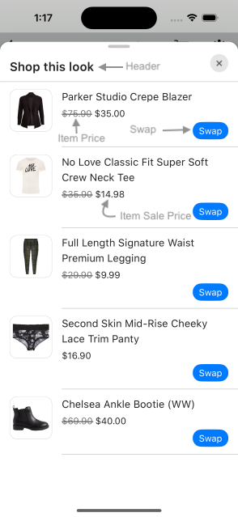
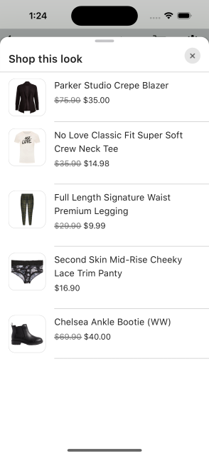
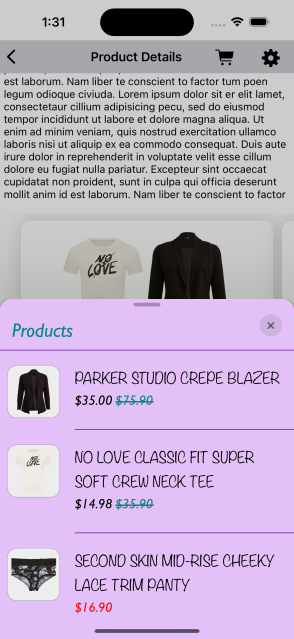
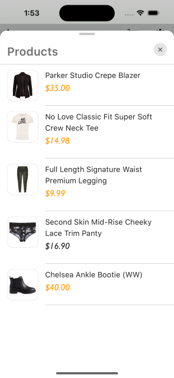
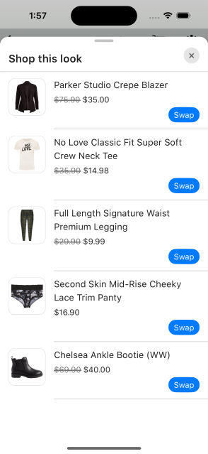
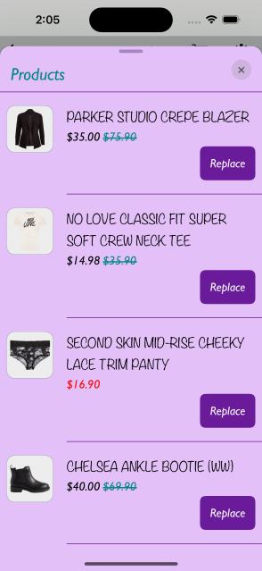

# STANDARD PRODUCT LIST

It provides views to display Stylitics data Outfit items. It also handles invoking of item tracking events based on user interaction with these views.

## Product List Screen

* This screen is displayed when user clicks on an Outfit.
* There are two different ways to show Product List Screen.
    1. Product List Screen From UX SDK
    2. Product List Screen From Integrator App

### Product List Screen From UX SDK

Below are the features for Product List Screen 
* Configure all the UI elements for Product List Screen.
* Handles Outfit Item `View` and `Click` tracking events so Integrator App does not have to do it.
* Provides listeners to Integrator App so they can handle the Outfit Item `View` and `Click` events.
* If Integrator App does not implement Outfit Item click listener, a Web View is opened when user selects an Outfit Item.

*Note - It is recommended that Sample Integrator App always provides the `onOutfitItemClick` listener implementation.*

### Product List Screen Configurations



### Header

  
| Fields                         | Description                                                                                        | Default Value                      |
| ------------------------------ | -------------------------------------------------------------------------------------------------- | ---------------------------------- |
| `title`                        | to set the title of the text                                                                       | `Shop this look`                   |
| `productListScreenHeaderAlign` | to set the product list screen title alignment. It will be center aligned when the value is CENTER | `ProductListScreenHeaderAlign.top` |  
| `fontFamilyAndWeight`          | is the font style with the font weight                                                             | `SFProText-Semibold`               |
| `fontSize`                     | is the size in CGFloat                                                                             | `20`                               |
| `fontColor`                    | is text color                                                                                      | `#202020`                          |

### Presentation Style

| Fields              | Description                                 | Default Value |
| ------------------- | ------------------------------------------- | ------------- |
| `presentationStyle` | to set the product list presentation style  | `.automatic`  |

### Product List View

| Fields                   | Description                                                                  | Default Value  |
|--------------------------|------------------------------------------------------------------------------|----------------|
| `backgroundColor`        | is to change product list background color and is accessed from assets file  | `#FFFFFF`      |
| `paddingVertical`        | is top and bottom padding of the button in CGFloat                           | `12`           |
| `paddingHorizontal`      | is left and right padding of the button in CGFloat                           | `16`           |
| `imageBackgroundColor`   | is the background to the item image                                          | `#FFFFFF`      |
| `imageBorderColor`       | is the border color to the item image                                        | `#FFFFFF`      |
| `productDetailsPadding`  | is left and right padding of the item text content view in CGFloat           | `16`           |
| `itemDividerColor`       | is the item divider color                                                    | `#202020`      |


### Item Name
  
| Fields                | Description                                                                                | Default Value       |
| --------------------- | ------------------------------------------------------------------------------------------ | ------------------- |
| `verticalSpacing`     | is to set the spacing between two lines                                                    | `2`                 |
| `fontFamilyAndWeight` | is the font style with the font weight                                                     | `SFProText-Regular` |
| `fontSize`            | is the size in CGFloat                                                                     | `16`                |
| `fontColor`           | is text color                                                                              | `#202020`           |
| `titleTextTransform`  | to change the case of item name text. When the value is upper it will appear in upper case | `none`              |

### Item Price

| Fields                        | Description                                                                                                      | Default Value       |
| ----------------------------- | ---------------------------------------------------------------------------------------------------------------- | ------------------- |
| `verticalSpacing`             | is to set the spacing between two item name and item price text.                                                 | `3`                 | 
| `fontFamilyAndWeight`         | is the text font style with the font weight                                                                      | `SFProText-Regular` |
| `fontSize`                    | is the font size in CGFloat                                                                                      | `15`                |
| `priceFontColor`              | to set item price text color                                                                                     | `#202020`           |
| `salePriceFontColor`          | to set item sale price text color                                                                                | `#202020`           |
| `strikeThroughPriceFontColor` | is strike through price text color                                                                               | `#747474`           |
| `style`                       | is to show or hide the Strike Through Price                                                                      | `.show`             |
| `swapPricesPosition`          | is boolean value, when it is false it shows strike through price first and then sale price. Vice versa when true | `false`             |


### Product List Item Divider Color

| Fields             | Description                     | Default Value |
| ------------------ | ------------------------------- | ------------- |
| `itemDividerColor` | is to change item divider color | `#202020`     |


### Hide Anchor Item

| Fields            | Description                                                                         | Default Value for Classic | Default Value for Hotspot |
|-------------------|-------------------------------------------------------------------------------------|---------------------------|---------------------------|
| `hideAnchorItem ` | is to hide anchor item in Product list screen, it will be hidden when set to `true` | `false`                   | `true`                    |


[Click here](CODE_REFERENCE_README.md#Classic-Widget-Configuration-Samples) to find code references for different configuration examples.

## Implement Exposed Listeners

Below are the list of Standard Product List listeners exposed to Integrator App

  1. `onOutfitItemClick` - On click event of Outfit Item, this listener will be triggered. It is highly recommended that Integrator app should implement this listener.
  2. `onOutfitItemView` - On view event of Outfit Item, this listener will be triggered.

### Product List Screen from UX SDK with Default Configurations

Below is the example of Product List Screen when Integrator App chooses to use default UI configurations.

*_**Swift**_*

Below is the code to access Product List Screen from SDK.

It is recommended that Integrator App provide the `onOutfitItemClick` listener implementation.

```swift
static func widgetWithProductListFromUXSDKAndAllDefaultConfigurations(outfits: Outfits) -> UIView {
    let productListListener = ProductListListener(onOutfitItemClick: { outfitBundleInfo, outfitBundleItemInfo in
        print("Outfit item click event triggered : outfitBundleInfo: \(String(describing: outfitBundleInfo.outfitBundle.id)), outfitBundleItemInfo: \(outfitBundleItemInfo.position)")
        print("Outfit Item otherClientItemId = \(String(describing: outfitBundleItemInfo.outfitBundleItem.otherClientItemIds))")
    })
    let productListScreenConfig = ProductListScreenConfig(productListListener: productListListener)
    let productListScreenTemplate = ProductListScreenTemplate.standard(productListScreenConfig: productListScreenConfig)
    return StyliticsUIApis.load(outfits: outfits,
                                outfitsTemplate: .classic(),
                                productListScreenTemplate: productListScreenTemplate)
}
```

- When Product List Screen is displayed from UX SDK, Sample Integrator App can choose to close it using below code.

```swift
let requestId = outfitBundleItem.requestId
StyliticsUIApis.closeProductListScreen(requestId: requestId)
```

- Below is the Product List screenshot when Sample Integrator App uses the default configurations



### Product List Screen from UX SDK with Custom Configurations

Below are the examples of Product List Screen when Sample Integrator App chooses to use custom configurations.

*_**Swift**_*

*_**1. With All Custom Configurations and Listeners**_*

```swift
static func widgetWithProductListFromUXSDKAndAllCustomConfigurations(outfits: Outfits) -> UIView {
    let productListListener = ProductListListener { outfitBundleInfo, outfitBundleItemInfo in
        print("Outfit item click event triggered : outfitBundleInfo : \(outfitBundleInfo), outfitBundleItemInfo : \(outfitBundleItemInfo)")
        print("outfitItem otherClientItemId = \(String(describing: outfitBundleItemInfo.outfitBundleItem.otherClientItemIds))")
    } onOutfitItemView: { outfitBundleInfo, outfitBundleItemInfo in
        print("Outfit item view event triggered : \(outfitBundleInfo), outfitBundleItemInfo : \(outfitBundleItemInfo)")
    }
    
    let productListScreenConfig = ProductListScreenConfig(itemListHeader: ProductListScreenConfig.ItemListHeader(title: "Products",
                                                                                                                 productListScreenHeaderAlign: .top,
                                                                                                                 fontFamilyAndWeight: "Gill Sans Italic",
                                                                                                                 fontSize: 26,
                                                                                                                 fontColor: UIColor(named: "standard_product_list_screen_title_font_color")!),
                                                          productListConfig: ProductListConfig(backgroundColor: UIColor(named: "standard_product_list_item_background_color")!,
                                                                                               paddingVertical: 20,
                                                                                               paddingHorizontal: 10,
                                                                                               imageBackgroundColor: UIColor(named: "standard_product_list_image_background_color")!,
                                                                                               imageBorderColor: UIColor(named: "standard_product_list_image_border_color")!,
                                                                                               productDetailsPadding: 20,
                                                                                               itemName: ProductListConfig.ItemName(fontFamilyAndWeight: "Noteworthy",
                                                                                                                                    fontSize: 19,
                                                                                                                                    fontColor: UIColor(named: "standard_product_list_item_name_font_color")!,
                                                                                                                                    titleTextTransform: .upper),
                                                                                               /*
                                                                                                itemPrice - is to set ItemPrice configurations.
                                                                                                priceFontColor - is the color configuration of actual price.
                                                                                                salePriceFontColor - is the color configuration of sale price.
                                                                                                strikeThroughPriceFontColor - is the color configuration of old price.
                                                                                                style - is Hide or Show the strikeThroughPriceFontColor.
                                                                                                swapPricesPosition - swaps the positions of Sale Price and Strike-Through Price.
                                                                                                */
                                                                                               itemPrice: ProductListConfig.ItemPrice(verticalSpacing: 3,
                                                                                                                                      fontFamilyAndWeight: "Gill Sans Italic",
                                                                                                                                      fontSize: 18,
                                                                                                                                      priceFontColor: UIColor(named: "standard_product_list_item_price_font_color")!,
                                                                                                                                      salePriceFontColor: UIColor(named: "standard_product_list_item_sale_price_font_color")!,
                                                                                                                                      strikeThroughPriceFontColor: UIColor(named: "standard_product_list_item_price_strike_color")!,
                                                                                                                                      style: .show,
                                                                                                                                      swapPricesPosition: true),
                                                                                               itemDividerColor: UIColor(named: "standard_product_list_item_divider_color")!,
                                                                                               hideAnchorItem: true),
                                                          productListListener: productListListener,
                                                          presentationStyle: .automatic)
    let productListScreenTemplate = ProductListScreenTemplate.standard(productListScreenConfig: productListScreenConfig)
    return StyliticsUIApis.load(outfits: outfits,
                                outfitsTemplate: .classic(),
                                productListScreenTemplate: productListScreenTemplate)
}
```
- Below is the Product List screenshot when Sample Integrator App uses the above configurations.

</br>

*_**2. With Some Custom Configurations and Listeners**_*

```swift
static func widgetWithProductListFromUXSDKAndSomeCustomConfigurations(outfits: Outfits) -> UIView {
    let productListScreenConfig = ProductListScreenConfig(itemListHeader: ProductListScreenConfig.ItemListHeader(title: "Products",
                                                                                                                 productListScreenHeaderAlign: .centre,
                                                                                                                 fontSize: 26,
                                                                                                                 fontColor: UIColor(named: "standard_product_list_screen_title_font_color")!),
                                                          productListConfig: ProductListConfig(itemPrice: ProductListConfig.ItemPrice(fontFamilyAndWeight: "Gill Sans Italic",
                                                                                                                                      fontSize: 20,
                                                                                                                                      salePriceFontColor: UIColor(named: "standard_product_list_item_sale_price_font_color")!,
                                                                                                                                      style: .hide)))
    let productListScreenTemplate = ProductListScreenTemplate.standard(productListScreenConfig: productListScreenConfig)
    return StyliticsUIApis.load(outfits: outfits,
                                outfitsTemplate: .classic(),
                                productListScreenTemplate: productListScreenTemplate)
}
```
- Below is the Product List screenshot when Sample Integrator App uses the above configurations.



### Product List Screen From Sample Integrator App

If Sample Integrator App wants to implement their own Product List Screen, they need to implement Outfit click listener as shown below and create view on their own.

```swift
static func widgetWhenProductListFromIntegrator(outfits: Outfits) -> UIView {
    let listener = ClassicListener(onClick: { outfitBundleInfo in
        /// To display Product List Screen (from Integrator) when user selects an OutfitBundle
        ScreenDisplayUtility.showDetailsOverlayScreen(outfitBundle: outfitBundleInfo.outfitBundle)
    })
    return StyliticsUIApis.load(outfits: outfits,
                                outfitsTemplate: .classic(classicListener: listener),
                                displayProductListFromSDK: false)
}
```
Sample Integrator can create their own Product List View or access and implement it from UX SDK as given below.

*_**1. Product List View with default configurations**_*

Below is the code to call your own Product List Screen. 

```swift
static func showDetailsOverlayScreen(outfitBundle: OutfitBundle) {
    DispatchQueue.main.async {
        let storyboard = UIStoryboard(name: Constants.CLASSIC_DISPLAY_STORYBOARD_IDENTIFIER,
                                      bundle: nil)
        let detailsOverlayViewController = storyboard.instantiateViewController(withIdentifier: Constants.DETAILS_OVERLAY_SCREEN_IDENTIFIER) as! DetailsOverlayViewController
        detailsOverlayViewController.viewModel.prepareData(outfit)
        UIApplication.shared.activeViewController?.present(detailsOverlayViewController, animated: true)
    }
}
```

```swift
func showProductListFromIntegrator() {
    if let outfitBundle = viewModel.outfitBundle {
        let outfitsView = StyliticsUIApis.load(outfitBundle: outfitBundle,
                                               productListTemplate: .standard(productListListener: ProductListListener(onOutfitItemClick: { outfitBundleInfo, outfitBundleItemInfo in
            print("Outfit item click event triggered : outfitInfo: \(outfitBundleInfo), outfitItemInfo: \(outfitBundleItemInfo)")
        })))
        containerView.addSubviewConstraints(subview: outfitsView)
    }
}
```

*_**2. Product List View with custom configurations**_*

```swift
func showProductListFromIntegrator() {
    if let outfitBundle = viewModel.outfitBundle {
        let outfitsView = StyliticsUIApis.load(outfitBundle: outfitBundle,
                                               productListTemplate: .standard(productListConfig: ProductListConfig(itemName: ProductListConfig.ItemName(fontFamilyAndWeight: "Gill Sans Medium",
                                                                                                                                                        fontSize: 18),
                                                                                                                   itemPrice: ProductListConfig.ItemPrice(fontSize: 14,
                                                                                                                                                          strikeThroughPriceFontColor: UIColor(red: 0,
                                                                                                                                                                                               green: 128/255,
                                                                                                                                                                                               blue: 128/255,
                                                                                                                                                                                               alpha: 1),
                                                                                                                                                          style: .show),
                                                                                                                   shop: .text(ProductListConfig.ShopText(title: "Buy",
                                                                                                                                                          fontFamilyAndWeight: "Gill Sans Bold",
                                                                                                                                                          fontSize: 18,
                                                                                                                                                          fontColor: UIColor(red: 0,
                                                                                                                                                                             green: 0,
                                                                                                                                                                             blue: 128/255,
                                                                                                                                                                             alpha: 1))
                                                                                                                   )),
                                                                              productListListener: ProductListListener(onOutfitItemClick: { outfitBundleInfo, outfitBundleItemInfo in
            print("Outfit item click event triggered : outfitInfo : \(outfitBundleInfo.position), outfitItemInfo : \(outfitBundleItemInfo.position)")
        },
                                                                                                                       onOutfitItemView: { outfitBundleInfo, outfitBundleItemInfo in
            print("Outfit item view event triggered : outfitInfo : \(outfitBundleInfo.position), outfitItemInfo : \(outfitBundleItemInfo.position)")
        })))
        containerView.addSubviewConstraints(subview: outfitsView)
    }
}
```

## Mix and Match (MnM)

* Mix and Match (MnM) feature can be enabled or disabled from Integrator App
* [Data SDK](DATA_SDK_README.md#mix-and-match) has more details to enable Mix and Match
* When Mix and Match feature is enabled, user can swap items from Product List View

## Product List Screen with Mix and Match 

* When Mix and Match is enabled
    * Swap CTA will be displayed for each Outfit Item having Replacement Items
    * Upon clicking the swap button, the user will be navigated to the Replacement screen, where they can perform the item swapping.
    * Handles item `onMixAndMatchExpand`, `onItemSwap` and `onMixAndMatchCollapse` tracking event. 
    * Exposes `onMixAndMatchExpand`, `OnItemSwap` and `onMixAndMatchCollapse` listener to Integrator App.

#### Swap CTA Configurations

| Fields                | Description                                                 | Default Value        |
|-----------------------|-------------------------------------------------------------|----------------------|
| `title`               | is the title of text                                        | `Swap`               |
| `fontFamilyAndWeight` | is the font style with the font weight                      | `SFProText-Regular`  |
| `fontSize`            | is font size in CGFloat                                     | `15`                 |
| `fontColor`           | is the cta text color and is accessed from assets file      | `#FFFFFF`            |
| `backgroundColor`     | is background set to cta and is accessed from assets file   | `#0079FF`            |
| `paddingVertical`     | is top and bottom padding of the button in CGFloat          | `4`                  |
| `paddingHorizontal`   | is left and right padding of the button in CGFloat          | `10`                 |


#### 1. Product List Screen with Default Configuration for Swap

*_**Swift**_*

```swift
static func widgetWithItemSwapFeatureEnabled(outfits: Outfits) -> UIView {
    // When fetching outfits from the Server make sure Mix And Match is enabled to test below feature
    let productListListener = ProductListListener(onOutfitItemClick: { outfitBundleInfo, outfitBundleItemInfo in
        // Here, in addition to handling any integrator analytics, natively navigate the user to the selected item's PDP (or launch a quick shop experience).
        print("Item click event triggered, outfitInfo: \(String(describing: outfitBundleInfo.outfitBundle.id)), outfitItemInfo :\(outfitBundleItemInfo.position)")
        print("Outfit Item otherClientItemId = \(String(describing: outfitBundleItemInfo.outfitBundleItem.otherClientItemIds))")
    })

    let productListScreenConfig = ProductListScreenConfig(productListListener: productListListener)
    let productListScreenTemplate = ProductListScreenTemplate.standard(productListScreenConfig: productListScreenConfig)

    return StyliticsUIApis.load(outfits: outfits,
                                outfitsTemplate: .classic(),
                                productListScreenTemplate: productListScreenTemplate)
}
```

* Below is the Product List screenshot when Sample Integrator App uses the above configurations.

</br>

#### 2. Product List Screen with Custom configuration for Swap

*_**Swift**_*

```swift
static func widgetWithMnMCustomConfigurationsOnProductListScreen(outfits: Outfits) -> UIView {
    let productListListener = ProductListListener { outfitBundleInfo, outfitBundleItemInfo in
        print("Outfit item click event triggered : outfitBundleInfo : \(outfitBundleInfo), outfitBundleItemInfo : \(outfitBundleItemInfo)")
        print("outfitItem otherClientItemId = \(String(describing: outfitBundleItemInfo.outfitBundleItem.otherClientItemIds))")
    } onOutfitItemView: { outfitBundleInfo, outfitBundleItemInfo in
        print("Outfit item view event triggered : \(outfitBundleInfo), outfitBundleItemInfo : \(outfitBundleItemInfo)")
    }

    let productListScreenConfig = ProductListScreenConfig(itemListHeader: ProductListScreenConfig.ItemListHeader(title: "Products",
                                                                                                                 productListScreenHeaderAlign: .centre,
                                                                                                                 fontFamilyAndWeight: "Gill Sans Italic",
                                                                                                                 fontSize: 26,
                                                                                                                 fontColor: UIColor(named: "standard_product_list_screen_title_font_color")!),
                                                          productListConfig: ProductListConfig(backgroundColor: UIColor(named: "standard_product_list_item_background_color")!,
                                                                                               paddingVertical: 20,
                                                                                               paddingHorizontal: 10,
                                                                                               imageBackgroundColor: UIColor(named: "standard_product_list_image_background_color")!,
                                                                                               imageBorderColor: UIColor(named: "standard_product_list_image_border_color")!,
                                                                                               productDetailsPadding: 20,
                                                                                               itemName: ProductListConfig.ItemName(fontFamilyAndWeight: "Noteworthy",
                                                                                                                                    fontSize: 19,
                                                                                                                                    fontColor: UIColor(named: "standard_product_list_item_name_font_color")!,
                                                                                                                                    titleTextTransform: .upper),
                                                                                               /*
                                                                                                   itemPrice - is to set ItemPrice configurations.
                                                                                                   priceFontColor - is the color configuration of actual price.
                                                                                                   salePriceFontColor - is the color configuration of sale price.
                                                                                                   strikeThroughPriceFontColor - is the color configuration of old price.
                                                                                                   style - is Hide or Show the strikeThroughPriceFontColor.
                                                                                                   swapPricesPosition - swaps the positions of Sale Price and Strike-Through Price.
                                                                                               */
                                                                                               itemPrice: ProductListConfig.ItemPrice(verticalSpacing: 3,
                                                                                                                                      fontFamilyAndWeight: "Gill Sans Italic",
                                                                                                                                      fontSize: 18,
                                                                                                                                      priceFontColor: UIColor(named: "standard_product_list_item_price_font_color")!,
                                                                                                                                      salePriceFontColor: UIColor(named: "standard_product_list_item_sale_price_font_color")!,
                                                                                                                                      strikeThroughPriceFontColor: UIColor(named: "standard_product_list_item_price_strike_color")!,
                                                                                                                                      style: .show,
                                                                                                                                      swapPricesPosition: true),
                                                                                               swapButton: ProductListConfig.SwapButton(title: "Replace",
                                                                                                                                        fontFamilyAndWeight: "Gill Sans Italic",
                                                                                                                                        fontSize: 18,
                                                                                                                                        fontColor: UIColor(named: "standard_product_list_swap_text_font_color")!,
                                                                                                                                        backgroundColor: UIColor(named: "standard_product_list_swap_button_background_color")!,
                                                                                                                                        paddingVertical: 15,
                                                                                                                                        paddingHorizontal: 15,
                                                                                                                                        cornerRadius: 8),
                                                                                               itemDividerColor: UIColor(named: "standard_product_list_item_divider_color")!,
                                                                                               hideAnchorItem: false),
                                                          productListListener: productListListener,
                                                          presentationStyle: .automatic)
    let productListScreenTemplate = ProductListScreenTemplate.standard(productListScreenConfig: productListScreenConfig)
    return StyliticsUIApis.load(outfits: outfits,
                                outfitsTemplate: .classic(),
                                productListScreenTemplate: productListScreenTemplate)
}
```
* Below is the Product List screenshot when Sample Integrator App uses the above configurations.

</br>


## Mix and Match Screen

* [Mix and Match Screen](MIX_AND_MATCH_SCREEN_README.md#MIX-AND-MATCH-SCREEN) has more details about Mix and Match Feature.

## License

Copyright © 2024 Stylitics
