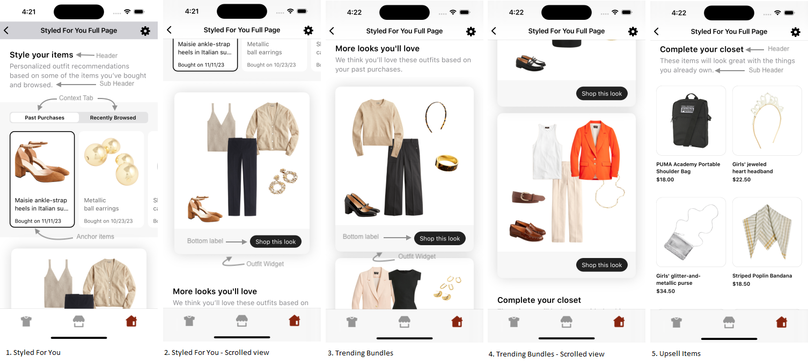
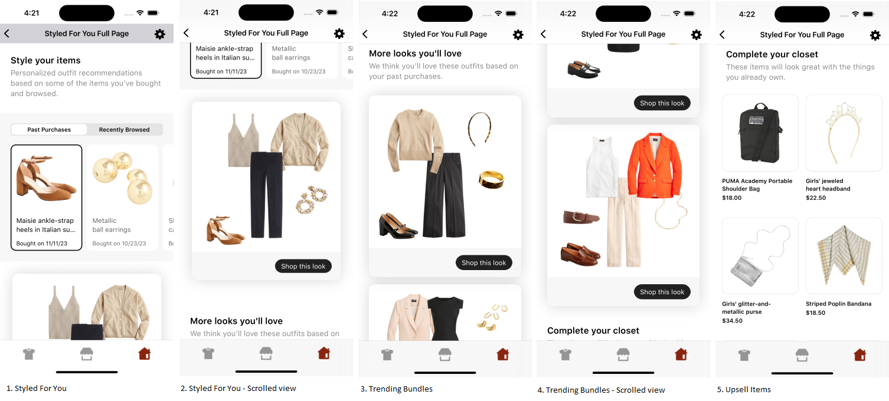
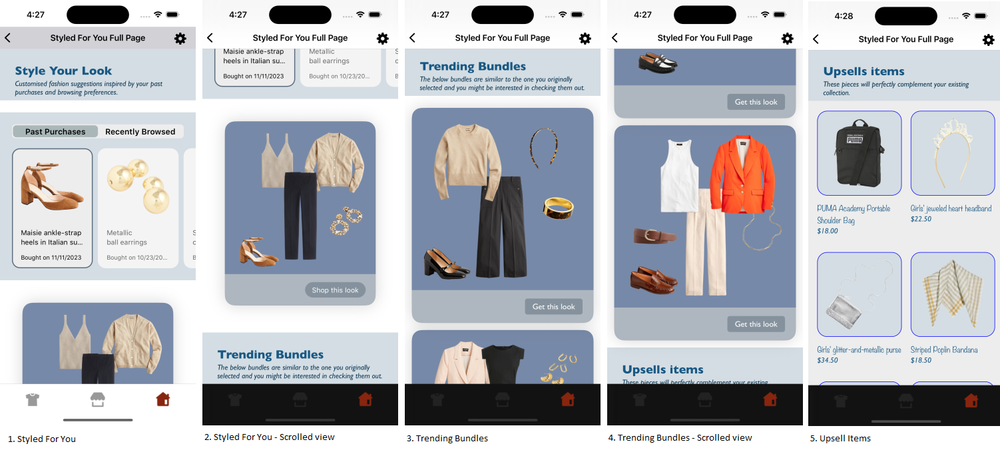
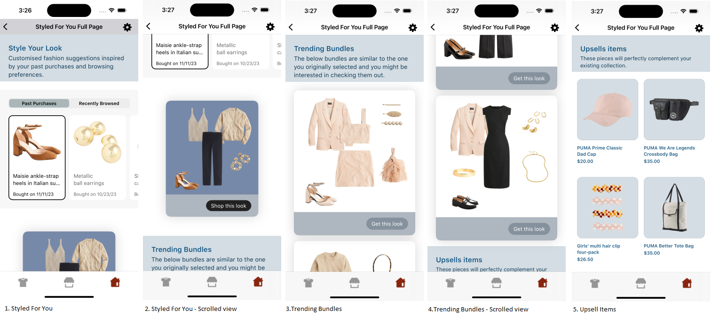

# STYLED FOR YOU FULL PAGE WIDGET

It provides view to display Stylitics StyledForYouFullPage data. It also handles invoking of widget tracking events based on user interaction with these views.

Below are the features for StyledForYou Full Page Widget.</br>

* Configure all the UI elements for StyledForYouFullPage Widget
* Handles tracking events so Integrator App does not have to do it
* Provides listeners to Integrator App so they can handle the events (if needed) based on user interaction.
* Configure whether to display bundle items of StyledForYou and TrendingBundles directly from SDK or not
* When Bundle Items are configured to display from SDK, Integrator App can provide configs for it.


StyledForYou Full Page widget is the combination of [Styled For You](STYLED_FOR_YOU_WIDGET_README.md#Configurations), [Trending Bundles](TRENDING_BUNDLES_WIDGET_README.md#Configurations) and [Upsells Items](UPSELL_ITEMS_WIDGET_README.md#Configurations) widget as shown in the below screenshot.




## Default Configurations:

* Below are the examples of StyledForYouFullPage Widget when Integrator App chooses to use default UI configurations.</br>

* The StyledForYouFullPage UI component can be implemented in below different ways.
    1. Product List enabled from SDK
    2. Product List disabled from SDK
    3. Configure Event Listeners

*_**Swift**_*

### 1. Product List enabled from SDK:

When product list is enabled from UX SDK and Integrator App does not provide configurations, it will take default configurations from SDK.

```kotlin
static func widgetWithDefaultConfigurations(styledForYouFullPageResponse: StyledForYouFullPageResponse) -> UIView {
    StyliticsUIApis.load(styledForYouFullPageResponse: styledForYouFullPageResponse)
}
```

### 2. Product List disabled from SDK:

```swift
static func widgetWhenProductListFromIntegrator(styledForYouFullPageResponse: StyledForYouFullPageResponse) -> UIView {
    let productListScreenConfig = OutfitBundleProductListScreenConfig(outfitBundleProductListConfig: OutfitBundleProductListConfigSamples.productListConfig,
                                                                      outfitBundleProductListListener: OutfitBundleProductListConfigSamples.productListListener)
    let styledForYouListener = StyledForYouListener(onOutfitClickCTA: { outfitBundleInfo in
        print("Styled For You onOutfitClickCTA listener triggered for bundle = \(outfitBundleInfo.outfitBundle) at position \(outfitBundleInfo.position)")
        ScreenDisplayUtility.showOutfitBundleOverlayScreen(outfitBundleInfo: outfitBundleInfo)
    })
    let trendingBundlesListener = TrendingBundlesListener(onOutfitClickCTA: { outfitBundleInfo in
        print("Trending Bundles onOutfitClickCTA listener triggered for bundle = \(outfitBundleInfo.outfitBundle) at position = \(outfitBundleInfo.position)")
        ScreenDisplayUtility.showOutfitBundleOverlayScreen(outfitBundleInfo: outfitBundleInfo)
    })
    return StyliticsUIApis.load(styledForYouFullPageResponse: styledForYouFullPageResponse,
                                styledForYouFullPageInfo: StyledForYouFullPageInfo(styledForYouInfo: StyledForYouInfo(listener:styledForYouListener),
                                                                                   trendingBundlesInfo: TrendingBundlesInfo(listener: trendingBundlesListener)),
                                displayProductListFromSDK: false,
                                outfitBundleProductListScreenConfig: productListScreenConfig)
}
```

*Note : When "displayProductListFromSDK" is set to false, the Product List from UX will be disabled for both StyledForYou and TrendingBundle and vide versa.*

### 3. Configure Event Listeners:

```swift
static func widgetWithListenersConfigured(styledForYouFullPageResponse: StyledForYouFullPageResponse) -> UIView {
    let styledForYouAllCustomListener = StyledForYouListener { context, contextItemArray in
        print("Styled For You on onContextClick listener triggered for context = \(context) with items = \(contextItemArray)")
    } onAnchorItemClick: { contextItemInfo in
        print("Styled For You onAnchorItemClick listener triggered for item = \(contextItemInfo.contextItem) at position \(contextItemInfo.position) for contextType = \(contextItemInfo.contextType)")
    } onAnchorItemView: { contextItemInfo in
        print("Styled For You onAnchorItemView listener triggered for item = \(contextItemInfo.contextItem) at position \(contextItemInfo.position) for contextType = \(contextItemInfo.contextType)")
    } onOutfitClick: { outfitBundleInfo in
        print("Styled For onOutfitClick listener triggered for bundle = \(outfitBundleInfo.outfitBundle) at position \(outfitBundleInfo.position)")
    } onOutfitClickCTA: { outfitBundleInfo in
        print("Styled For You onOutfitClickCTA listener triggered for bundle = \(outfitBundleInfo.outfitBundle) at position \(outfitBundleInfo.position)")
    } onOutfitView: { outfitBundleInfo in
        print("Styled For You onOutfitView listener triggered for bundle = \(outfitBundleInfo.outfitBundle) at position \(outfitBundleInfo.position)")
    }

    let trendingBundlesListener = TrendingBundlesListener { outfitBundleInfo in
        print("Trending Bundles onOutfitClick listener triggered for bundle = \(outfitBundleInfo.outfitBundle) at position = \(outfitBundleInfo.position)")
    } onOutfitClickCTA: { outfitBundleInfo in
        print("Trending Bundles onOutfitClickCTA listener triggered for bundle = \(outfitBundleInfo.outfitBundle) at position = \(outfitBundleInfo.position)")
    } onOutfitView: { outfitBundleInfo in
        print("Trending Bundles onOutfitView listener triggered for bundle = \(outfitBundleInfo.outfitBundle) at position = \(outfitBundleInfo.position)")
    }

    let upsellsListener = UpsellsListener { outfitBundleItemInfo in
        print("Upsells onItemClick listener triggered for item = \(outfitBundleItemInfo.outfitBundleItem) at position = \(outfitBundleItemInfo.position)")
    } onItemView: { outfitBundleItemInfo in
        print("Upsells onItemView listener triggered for item = \(outfitBundleItemInfo.outfitBundleItem) at position = \(outfitBundleItemInfo.position)")
    }

    return StyliticsUIApis.load(styledForYouFullPageResponse: styledForYouFullPageResponse,
                                styledForYouFullPageInfo: StyledForYouFullPageInfo(styledForYouInfo: StyledForYouInfo(listener: styledForYouAllCustomListener),
                                                                                   trendingBundlesInfo: TrendingBundlesInfo(listener: trendingBundlesListener),
                                                                                   upsellsInfo: UpsellsInfo(listener: upsellsListener)))
}
```


### Default StyledForYou Full Page Screen

* Below is the StyledForYou Full Page Widget screenshot when Sample Integrator App uses the above configurations.

</br></br>

## Custom Configurations:

* Integrator App can customise some or all configurations & implement listeners.
* Below are the examples of StyledForYou Full Page Widget when Sample Integrator App customises configurations.

### 1. With all configurations & Listeners:

```swift
static func widgetWithAllCustomConfigurations(styledForYouFullPageResponse: StyledForYouFullPageResponse) -> UIView {
    let styledForYouAllCustomConfig = StyledForYouConfig(header: StyledForYouConfig.Header(backgroundColor: UIColor(named: "styled_for_you_header_background_color")!,
                                                                                           paddingVertical: 30,
                                                                                           paddingHorizontal: 30,
                                                                                           headerText: "Style Your Look",
                                                                                           headerFontColor: UIColor(named: "styled_for_you_header_font_color")!,
                                                                                           headerFontFamilyAndWeight: "Gill Sans Bold",
                                                                                           headerFontSize: 24,
                                                                                           subHeaderText: "Customised fashion suggestions inspired by your past purchases and browsing preferences.",
                                                                                           subHeaderFontColor: UIColor(named: "styled_for_you_header_sub_header_font_color")!,
                                                                                           subHeaderFontFamilyAndWeight: "Gill Sans Italic",
                                                                                           subHeaderFontSize: 15),
                                                         widget: StyledForYouConfig.Widget(cornerRadius: 20,
                                                                                           backgroundColor: UIColor(named: "styled_for_you_widget_background_color")!,
                                                                                           cardGutter: 10,
                                                                                           cardPeek: 35),
                                                         tabContext: StyledForYouConfig.TabContext(backgroundColor: UIColor(named: "styled_for_you_context_background_color")!,
                                                                                                   labelSelectedBackgroundColor: UIColor(named: "styled_for_you_context_label_selected_background_color")!,
                                                                                                   labelFontSize: 16,
                                                                                                   labelFontColor: UIColor(named: "styled_for_you_context_title_font_color")!),
                                                         anchorItems: StyledForYouConfig.AnchorItems(backgroundColor: UIColor(named: "styled_for_you_anchor_items_background_color")!,
                                                                                                     selectedBorderColor: UIColor(named: "styled_for_you_anchor_items_selected_border_color")!,
                                                                                                     itemBackgroundColor: UIColor(named: "styled_for_you_anchor_item_background_color")!,
                                                                                                     itemCornerRadius: 16,
                                                                                                     cardPaddingVertical: 13,
                                                                                                     cardPaddingHorizontal: 18,
                                                                                                     productNameFontColor: UIColor(named: "styled_for_you_anchor_item_product_name_font_color")!,
                                                                                                     productNameFontSize: 14,
                                                                                                     contextNameFontColor: UIColor(named: "styled_for_you_anchor_item_context_name_font_color")!,
                                                                                                     contextNameFontSize: 12,
                                                                                                     contextDateFormat: .mm_dd_yyyy,
                                                                                                     priceFontColor: UIColor(named: "styled_for_you_anchor_item_price_font_color")!,
                                                                                                     priceFontSize: 16,
                                                                                                     salePriceFontColor: UIColor(named: "styled_for_you_anchor_item_sale_price_font_color")!,
                                                                                                     strikeThroughPriceFontColor: UIColor(named: "styled_for_you_anchor_item_sale_price_strike_color")!,
                                                                                                     style: .hide),
                                                         outOfStock: StyledForYouConfig.OutOfStock(badgeFontColor: UIColor(named: "styled_for_you_out_of_stock_badge_font_color")!,
                                                                                                   badgeFontSize: 16,
                                                                                                   badgeVerticalSpacing: 5,
                                                                                                   badgeHorizontalSpacing: 25,
                                                                                                   badgeBackgroundColor: UIColor(named: "styled_for_you_out_of_stock_badge_background_color")!),
                                                         similarItems: StyledForYouConfig.SimilarItems(badgeFontColor: UIColor(named: "styled_for_you_similar_items_badge_font_color")!,
                                                                                                       badgeFontSize: 16,
                                                                                                       badgeVerticalSpacing: 5,
                                                                                                       badgeHorizontalSpacing: 25,
                                                                                                       badgeBackgroundColor: UIColor(named: "styled_for_you_similar_items_badge_background_color")!),
                                                         bottomLabel: StyledForYouConfig.BottomLabel(ctaTitle: "Shop this look",
                                                                                                     fontSize: 14,
                                                                                                     fontColor: UIColor(named: "styled_for_you_bottom_label_title_font_color")!,
                                                                                                     backgroundColor: UIColor(named: "styled_for_you_bottom_label_background_color")!,
                                                                                                     ctaBackgroundColor: UIColor(named: "styled_for_you_bottom_label_title_background_color")!),
                                                         bullet: StyledForYouConfig.Bullet(defaultColor: UIColor(named: "styled_for_you_bullet_default_color")!,
                                                                                           highlightedColor: UIColor(named: "styled_for_you_bullet_highlighted_color")!,
                                                                                           paddingVertical: 10))
    let styledForYouAllCustomListener = StyledForYouListener { context, ContextItemArray in
        print("Styled For You on onContextClick listener triggered for context = \(context) with items = \(ContextItemArray)")
    } onAnchorItemClick: { contextItemInfo in
        print("Styled For You onAnchorItemClick listener triggered for item = \(contextItemInfo.contextItem) at position \(contextItemInfo.position) for contextType = \(contextItemInfo.contextType)")
    } onAnchorItemView: { contextItemInfo in
        print("Styled For You onAnchorItemView listener triggered for item = \(contextItemInfo.contextItem) at position \(contextItemInfo.position) for contextType = \(contextItemInfo.contextType)")
    } onOutfitClick: { outfitBundleInfo in
        print("Styled For onOutfitClick listener triggered for bundle = \(outfitBundleInfo.outfitBundle) at position \(outfitBundleInfo.position)")
    } onOutfitClickCTA: { outfitBundleInfo in
        print("Styled For You onOutfitClickCTA listener triggered for bundle = \(outfitBundleInfo.outfitBundle) at position \(outfitBundleInfo.position)")
    } onOutfitView: { outfitBundleInfo in
        print("Styled For You onOutfitView listener triggered for bundle = \(outfitBundleInfo.outfitBundle) at position \(outfitBundleInfo.position)")
    }

    let trendingBundlesAllCustomConfig = TrendingBundlesConfig(header: TrendingBundlesConfig.Header(backgroundColor: UIColor(named: "trending_bundles_header_background_color")!,
                                                                                                    paddingVertical: 30,
                                                                                                    paddingHorizontal: 30,
                                                                                                    headerText: "Trending Bundles",
                                                                                                    headerFontColor: UIColor(named: "trending_bundles_header_font_color")!,
                                                                                                    headerFontFamilyAndWeight: "Gill Sans Bold",
                                                                                                    headerFontSize: 24,
                                                                                                    subHeaderText: "The below bundles are similar to the one you originally selected and you might be interested in checking them out.",
                                                                                                    subHeaderFontColor: UIColor(named: "trending_bundles_sub_header_font_color")!,
                                                                                                    subHeaderFontFamilyAndWeight: "Gill Sans Italic",
                                                                                                    subHeaderFontSize: 15),
                                                               widget: TrendingBundlesConfig.Widget(cornerRadius: 20,
                                                                                                    backgroundColor: UIColor(named: "trending_bundles_widget_background_color")!,
                                                                                                    paddingVertical: 14,
                                                                                                    paddingHorizontal: 14),
                                                               bottomLabel: TrendingBundlesConfig.BottomLabel(ctaTitle: "Get this look",
                                                                                                              fontFamilyAndWeight: "Gill Sans",
                                                                                                              fontSize: 16,
                                                                                                              fontColor: UIColor(named: "trending_bundles_bottom_label_title_font_color")!,
                                                                                                              backgroundColor: UIColor(named: "trending_bundles_bottom_label_background_color")!,
                                                                                                              ctaBackgroundColor: UIColor(named: "trending_bundles_bottom_label_title_background_color")!,
                                                                                                              paddingVertical: 17,
                                                                                                              paddingHorizontal: 22,
                                                                                                              ctaPaddingVertical: 6,
                                                                                                              ctaPaddingHorizontal: 15,
                                                                                                              cornerRadius: 5))
    let trendingBundlesListener = TrendingBundlesListener { outfitBundleInfo in
        print("Trending Bundles onOutfitClick listener triggered for bundle = \(outfitBundleInfo.outfitBundle) at position = \(outfitBundleInfo.position)")
    } onOutfitClickCTA: { outfitBundleInfo in
        print("Trending Bundles onOutfitClickCTA listener triggered for bundle = \(outfitBundleInfo.outfitBundle) at position = \(outfitBundleInfo.position)")
    } onOutfitView: { outfitBundleInfo in
        print("Trending Bundles onOutfitView listener triggered for bundle = \(outfitBundleInfo.outfitBundle) at position = \(outfitBundleInfo.position)")
    }

    let upsellsAllCustomConfig = UpsellsConfig(header: UpsellsConfig.Header(backgroundColor: UIColor(named: "upsells_card_background_color")!,
                                                                            paddingVertical: 30,
                                                                            paddingHorizontal: 30,
                                                                            headerText: "Upsells items",
                                                                            headerFontColor: UIColor(named: "upsells_tem_product_name_font_color")!,
                                                                            headerFontFamilyAndWeight: "Gill Sans Bold",
                                                                            headerFontSize: 24,
                                                                            subHeaderText: "These pieces will perfectly complement your existing collection.",
                                                                            subHeaderFontColor: UIColor(named: "upsells_subheader_font_color")!,
                                                                            subHeaderFontFamilyAndWeight: "Gill Sans Italic",
                                                                            subHeaderFontSize: 15),
                                               items: UpsellsConfig.Items(paddingOutsideHorizontal: 18,
                                                                          paddingInsideHorizontal: 18,
                                                                          paddingInsideVertical: 34),
                                               item: UpsellsConfig.Item(backgroundColor: UIColor(named: "upsells_item_background_color")!,
                                                                        imageBackgroundColor: UIColor(named: "upsells_card_background_color")!,
                                                                        borderColor: .blue,
                                                                        borderWidth: 1,
                                                                        borderRadius: 20,
                                                                        imageMarginHorizontal: 15,
                                                                        imageMarginVertical: 15,
                                                                        fontColor: UIColor(named: "upsell_item_title_font_color")!,
                                                                        fontFamilyAndWeight: "Noteworthy",
                                                                        fontSize: 15,
                                                                        priceFontColor: UIColor(named: "upsells_item_price_font_color")!,
                                                                        priceFontFamilyAndWeight: "Gill Sans Italic",
                                                                        priceFontSize: 15,
                                                                        salePriceFontColor: UIColor(named: "upsells_item_sale_price_font_color")!,
                                                                        strikeThroughPriceFontColor: UIColor(named: "upsells_item_sale_price_strike_color")!,
                                                                        style: .show,
                                                                        swapPricesPosition: true))

    let upsellsListener = UpsellsListener { outfitBundleItemInfo in
        print("Upsells onItemClick listener triggered for item = \(outfitBundleItemInfo.outfitBundleItem) at position = \(outfitBundleItemInfo.position)")
    } onItemView: { outfitBundleItemInfo in
        print("Upsells onItemView listener triggered for item = \(outfitBundleItemInfo.outfitBundleItem) at position = \(outfitBundleItemInfo.position)")
    }

    return StyliticsUIApis.load(styledForYouFullPageResponse: styledForYouFullPageResponse,
                                styledForYouFullPageInfo: StyledForYouFullPageInfo(styledForYouInfo: StyledForYouInfo(config: styledForYouAllCustomConfig,
                                                                                                                      listener: styledForYouAllCustomListener),
                                                                                   trendingBundlesInfo: TrendingBundlesInfo(config: trendingBundlesAllCustomConfig,
                                                                                                                            listener: trendingBundlesListener),
                                                                                   upsellsInfo: UpsellsInfo(config: upsellsAllCustomConfig,
                                                                                                            listener: upsellsListener)))
}
```


* Below is the StyledForYouFullPage Widget screenshot when Sample Integrator App uses the above configurations.

</br>

### 2. With some custom configurations & Listeners:

If Integrator App provides only few configurations, UX SDK will take default configurations for missing fields.

```swift
static func widgetWithSomeCustomConfigurations(styledForYouFullPageResponse: StyledForYouFullPageResponse) -> UIView {
    let styledForYouSomeCustomConfig = StyledForYouConfig(header: StyledForYouConfig.Header(backgroundColor: UIColor(named: "styled_for_you_header_background_color")!,
                                                                                            headerText: "Style Your Look",
                                                                                            headerFontColor: UIColor(named: "styled_for_you_header_font_color")!,
                                                                                            subHeaderText: "Customised fashion suggestions inspired by your past purchases and browsing preferences.",
                                                                                            subHeaderFontColor: UIColor(named: "styled_for_you_header_sub_header_font_color")!),
                                                          widget: StyledForYouConfig.Widget(backgroundColor: UIColor(named: "styled_for_you_widget_background_color")!,
                                                                                            cardGutter: 30,
                                                                                            cardPeek: 35),
                                                          tabContext: StyledForYouConfig.TabContext(backgroundColor: UIColor(named: "styled_for_you_context_background_color")!,
                                                                                                    labelSelectedBackgroundColor: UIColor(named: "styled_for_you_context_label_selected_background_color")!,
                                                                                                    labelFontColor: UIColor(named: "styled_for_you_context_title_font_color")!),
                                                          bottomLabel: StyledForYouConfig.BottomLabel(fontColor: UIColor(named: "styled_for_you_bottom_label_title_font_color")!,
                                                                                                      backgroundColor: UIColor(named: "styled_for_you_bottom_label_background_color")!),
                                                          bullet: StyledForYouConfig.Bullet(defaultColor: UIColor(named: "styled_for_you_bullet_default_color")!,
                                                                                            highlightedColor: UIColor(named: "styled_for_you_bullet_highlighted_color")!))
    let styledForYouSomeCustomListener = StyledForYouListener(onOutfitClick: { outfitBundleInfo in
        print("Styled For onOutfitClick listener triggered for bundle = \(outfitBundleInfo.outfitBundle) at position \(outfitBundleInfo.position)")
    }, onOutfitClickCTA: { outfitBundleInfo in
        print("Styled For You onOutfitClickCTA listener triggered for bundle = \(outfitBundleInfo.outfitBundle) at position \(outfitBundleInfo.position)")
    })

    let trendingBundlesSomeCustomConfig = TrendingBundlesConfig(header: TrendingBundlesConfig.Header(backgroundColor: UIColor(named: "trending_bundles_header_background_color")!,
                                                                                                     headerText: "Trending Bundles",
                                                                                                     headerFontColor: UIColor(named: "trending_bundles_header_font_color")!,
                                                                                                     subHeaderText: "The below bundles are similar to the one you originally selected and you might be interested in checking them out.",
                                                                                                     subHeaderFontColor: UIColor(named: "trending_bundles_sub_header_font_color")!),
                                                                bottomLabel: TrendingBundlesConfig.BottomLabel(ctaTitle: "Get this look",
                                                                                                               fontColor: UIColor(named: "trending_bundles_bottom_label_title_font_color")!,
                                                                                                               backgroundColor: UIColor(named: "trending_bundles_bottom_label_background_color")!,
                                                                                                               ctaBackgroundColor: UIColor(named: "trending_bundles_bottom_label_title_background_color")!,
                                                                                                               ctaPaddingVertical: 6,
                                                                                                               ctaPaddingHorizontal: 15))
    let trendingBundlesListener = TrendingBundlesListener(onOutfitClickCTA: { outfitBundleInfo in
        print("Trending Bundles onOutfitClickCTA listener triggered for bundle = \(outfitBundleInfo.outfitBundle) at position = \(outfitBundleInfo.position)")
    })

    let upsellsSomeCustomConfig = UpsellsConfig(header: UpsellsConfig.Header(backgroundColor: UIColor(named: "upsells_card_background_color")!,
                                                                             headerText: "Upsells items",
                                                                             headerFontColor: UIColor(named: "upsells_tem_product_name_font_color")!,
                                                                             subHeaderText: "These pieces will perfectly complement your existing collection.",
                                                                             subHeaderFontColor: UIColor(named: "upsells_subheader_font_color")!,
                                                                             subHeaderFontSize: 15),
                                                item: UpsellsConfig.Item(imageBackgroundColor: UIColor(named: "upsells_card_background_color")!,
                                                                         imageMarginHorizontal: 15,
                                                                         fontColor: UIColor(named: "upsell_item_title_font_color")!,
                                                                         priceFontColor: UIColor(named: "upsells_item_price_font_color")!,
                                                                         salePriceFontColor: UIColor(named: "upsells_item_sale_price_font_color")!,
                                                                         strikeThroughPriceFontColor: UIColor(named: "upsells_item_sale_price_strike_color")!,
                                                                         style: .show,
                                                                         swapPricesPosition: true))

    let upsellsListener = UpsellsListener(onItemClick: { outfitBundleItemInfo in
        print("Upsells onItemClick listener triggered for item = \(outfitBundleItemInfo.outfitBundleItem) at position = \(outfitBundleItemInfo.position)")
    })

    return StyliticsUIApis.load(styledForYouFullPageResponse: styledForYouFullPageResponse,
                                styledForYouFullPageInfo: StyledForYouFullPageInfo(styledForYouInfo: StyledForYouInfo(config: styledForYouSomeCustomConfig,
                                                                                                                      listener: styledForYouSomeCustomListener),
                                                                                   trendingBundlesInfo: TrendingBundlesInfo(config: trendingBundlesSomeCustomConfig,
                                                                                                                            listener: trendingBundlesListener),
                                                                                   upsellsInfo: UpsellsInfo(config: upsellsSomeCustomConfig,
                                                                                                            listener: upsellsListener)))
}    
```

* Below is the StyledForYouFullPage Widget screenshot when Sample Integrator App uses the above configurations.

</br>


## Refresh StyledForYou Full Page Widget

**Overview**

The `refreshSyfyFullPageTemplate` method can be used to update the StyledForYou Full Page widget data or its configurations or both.

**Example**

```swift
static func refreshTemplate(view: UIView,
                                   styledForYouFullPageResponse: StyledForYouFullPageResponse? = nil,
                                   widgetConfig: IWidgetConfig? = nil)
```

**Parameters**

- `styledForYouFullPageResponse`: Optional parameter to provide updated StyledForYouFullPage data.
- `widgetConfig`: Optional parameter to provide updated configurations for StyledForYou Full Page template.

**Usage**

Call the method on the view with optional data/config.

- Get the StyledForYou Full Page widget Template view
```swift
let styledForYouFullPageView = StyliticsUIApis.load(styledForYouFullPageResponse: styledForYouFullPageResponse)
```

- To refresh the StyledForYou Full Page widget Template with new StyledForYouFullPage data
```swift
StyliticsUIApis.refreshTemplate(view: styledForYouFullPageView,
                                styledForYouFullPageResponse: newStyledForYouFullPageResponse)
```
- To refresh the StyledForYou Full Page widget Template with new config
```swift
StyliticsUIApis.refreshTemplate(view: styledForYouFullPageView,
                                widgetConfig: newConfig)
```
- To refresh the StyledForYou Full Page widget Template with both new StyledForYouFullPage data and config
```swift
StyliticsUIApis.refreshTemplate(view: styledForYouFullPageView,
                                styledForYouFullPageResponse: newStyledForYouFullPageResponse,
                                widgetConfig: newConfig)
```

## License

Copyright © 2023 Stylitics
