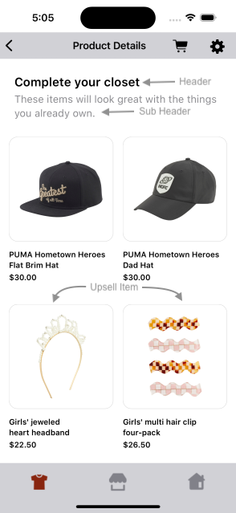
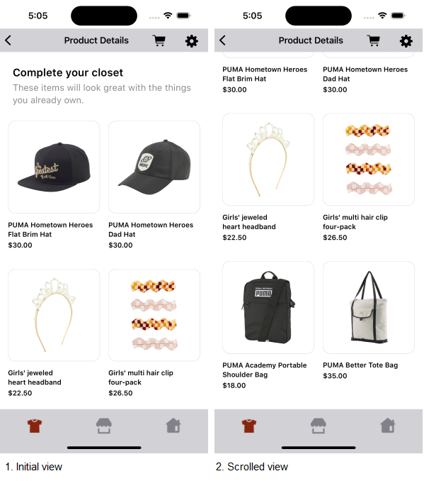
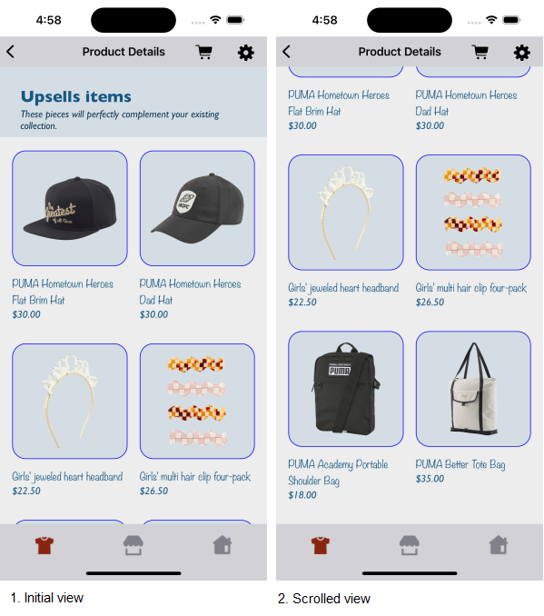
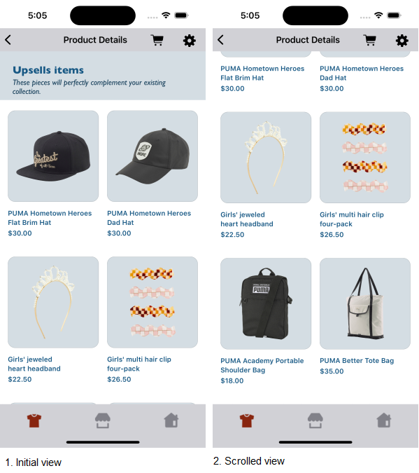

# UPSELL ITEMS WIDGET

It provides view to display Stylitics UpsellItems data. It also handles invoking of widget tracking events based on user interaction with these views.

Below are the features for UpsellItems Widget.</br>

* Configure all the UI elements for UpsellItems Widget
* Handles tracking events so Integrator App does not have to do it
* Provides listeners to Integrator App so they can handle the events (if needed) based on user interaction.


## Configurations:



### Header

| Fields                         | Description                                                                                     | Default Value                                                  |
|--------------------------------|-------------------------------------------------------------------------------------------------|----------------------------------------------------------------|
| `backgroundColor`              | to set the background color to the header of the widget                                         | `#FFFFFF`                                                      |           
| `paddingVertical`              | is top spacing for the content inside header, accepts CGFloat                                   | `24`                                                           |           
| `paddingHorizontal`            | is left and right spacing of the header view, accepts CGFloat                                   | `24`                                                           |
| `headerText`                   | is to set text for the header                                                                   | `Complete your closet`                                         |
| `headerFontColor`              | is header text color and is accessed from assets file                                           | `#000000`                                                      |
| `headerFontFamilyAndWeight`    | is the header font style with the font weight and is accessed from the font resource folder     | `SFProText-Semibold`                                           |           
| `headerFontSize`               | is the header font size in CGFloat                                                              | `20`                                                           |
| `subHeaderText`                | is to set text for the sub header                                                               | `These items will look great with the things you already own`  |
| `subHeaderFontColor`           | is sub header text color and is accessed from assets file                                       | `#3B3B43`                                                      |
| `subHeaderFontFamilyAndWeight` | is the sub title font style with the font weight and is accessed from the font resource folder  | `SFProText-Regular`                                            |
| `subHeaderFontSize`            | is the sub title font size in CFFloat                                                           | `17`                                                           |

### Items

| Fields                       | Description                                                                        | Default Value  |
|------------------------------|------------------------------------------------------------------------------------|----------------|
| `paddingOutsideHorizontal`   | is left and right spacing of the Upsell items with the margin. It accepts CGFloat  | `15`           |  
| `paddingInsideHorizontal`    | is the horizontal spacing between two items of Upsell items. It accepts CGFloat    | `16`           |  
| `paddingInsideVertical`      | is the vertical spacing between two items of Upsell items. It accepts CGFloat      | `36`           |

### Item

| Fields                        | Description                                                                                                        | Default Value              | 
|-------------------------------|--------------------------------------------------------------------------------------------------------------------|----------------------------|
| `backgroundColor`             | is the Upsell items background color and is accessed from assets file                                              | `#FFFFFF`                  | 
| `imageBackgroundColor`        | is the background to the item image                                                                                | `#FFFFFF`                  |
| `borderColor`                 | is the item image border color                                                                                     | `#202020`                  |
| `borderWidth`                 | is the item image border width in CGFloat                                                                          | `0.5`                      |
| `borderRadius`                | is the item border radius in CGFloat                                                                               | `14     `                  |
| `imageMarginHorizontal`       | is left and right spacing inside item imageView within an item. It accepts CGFloat                                 | `17`                       |            
| `imageMarginVertical`         | is top and bottom spacing inside item imageView within an item. It accepts CGFloat                                 | `17`                       |            
| `fontColor`                   | is item name text color and is accessed from assets file                                                           | `#000000`                  |            
| `fontFamilyAndWeight`         | is item name font style with the font weight and is accessed from the font resource folder                         | `SFProText-Semibold`       |            
| `fontSize`                    | is the item name font size in CGFloat                                                                              | `13`                       |
| `priceFontColor`              | to set item price text color which is accessed from assets file                                                    | `#000000`                  |            
| `priceFontFamilyAndWeight`    | is the item price font style with the font weight and is accessed from the font resource folder                    | `SFProText-Semibold`       |            
| `priceFontSize`               | is the item price font size in CGFloat                                                                             | `13`                       |            
| `salePriceFontColor`          | to set item sale price text color which is accessed from assets file                                               | `#808080`                  |            
| `strikeThroughPriceFontColor` | is strike through price text color which is accessed from assets file                                              | `#808080`                  |
| `style`                       | to show or hide the Strike Through Price                                                                           | `PriceStrikeThrough.show`  |            
| `swapPricesPosition`          | is boolean value, when it is false it shows strike through price first and then sale price. Vice versa when true.  | `false`                    |


# Implement Exposed Listeners

Below are the list of UpsellItems widget listeners exposed to the Integrator app.

4. `onItemView` - On view event of an Outfit bundle item displayed in an UpsellsItems widget, this listener will be invoked.
5. `onItemClick` - On click event of an Outfit bundle item displayed in an UpsellsItems widget, this listener will be invoked.

## Default Configurations:

* Below are the examples of `UpsellItems` Widget when Integrator App chooses to use default UI configurations.</br>

* The `UpsellItems` UI component can be implemented in below different ways.
  1. Default UpsellItems widget
  2. Configure Event Listeners

*_**Swift**_*

### 1. Default UpsellItems widget:

```swift
static func widgetWithDefaultConfigurations(upsellItems: UpsellItems) -> UIView {
    StyliticsUIApis.load(upsellItems: upsellItems)
}
```

### 2. Configure Event Listeners:

```swift
static func widgetWithListenersConfigured(upsellItems: UpsellItems) -> UIView {
    let listener = UpsellsListener { outfitBundleInfo in
        print("Upsells Bundles onItemClick: \(outfitBundleInfo)")
    } onItemView: { outfitBundleInfo in
        print("Upsells Bundles onItemView: \(outfitBundleInfo)")
    }

    return StyliticsUIApis.load(upsellItems: upsellItems,
                                upsellsInfo: UpsellsInfo(listener: listener))
}
```


### Default UpsellItems Screen

* Below is the UpsellItems Widget screenshot when Sample Integrator App uses the above configurations.

</br></br>

## Custom Configurations:

* Integrator App can customise some or all configurations & implement listeners.
* Below are the examples of UpsellItems Widget when Sample Integrator App customises configurations.

### 1. With all configurations & Listeners:

```swift
static func widgetWithAllCustomConfigurations(upsellItems: UpsellItems) -> UIView {
    let allCustomConfigs = UpsellsConfig(header: UpsellsConfig.Header(backgroundColor: UIColor(named: "upsells_card_background_color")!,
                                                                      paddingVertical: 30,
                                                                      paddingHorizontal: 30,
                                                                      headerText: "Upsells items",
                                                                      headerFontColor: UIColor(named: "upsells_tem_product_name_font_color")!,
                                                                      headerFontFamilyAndWeight: "Gill Sans Bold",
                                                                      headerFontSize: 24,
                                                                      subHeaderText: "These pieces will perfectly complement your existing collection.",
                                                                      subHeaderFontColor: UIColor(named: "upsells_subheader_font_color")!,
                                                                      subHeaderFontFamilyAndWeight: "Gill Sans Italic",
                                                                      subHeaderFontSize: 15),
                                         items: UpsellsConfig.Items(paddingOutsideHorizontal: 18,
                                                                    paddingInsideHorizontal: 18,
                                                                    paddingInsideVertical: 34),
                                         item: UpsellsConfig.Item(backgroundColor: UIColor(named: "upsells_item_background_color")!,
                                                                  imageBackgroundColor: UIColor(named: "upsells_card_background_color")!,
                                                                  borderColor: .blue,
                                                                  borderWidth: 1,
                                                                  borderRadius: 20,
                                                                  imageMarginHorizontal: 15,
                                                                  imageMarginVertical: 15,
                                                                  fontColor: UIColor(named: "upsell_item_title_font_color")!,
                                                                  fontFamilyAndWeight: "Noteworthy",
                                                                  fontSize: 15,
                                                                  priceFontColor: UIColor(named: "upsells_item_price_font_color")!,
                                                                  priceFontFamilyAndWeight: "Gill Sans Italic",
                                                                  priceFontSize: 15,
                                                                  salePriceFontColor: UIColor(named: "upsells_item_sale_price_font_color")!,
                                                                  strikeThroughPriceFontColor: UIColor(named: "upsells_item_sale_price_strike_color")!,
                                                                  style: .show,
                                                                  swapPricesPosition: true))

    let listener = UpsellsListener { outfitBundleInfo in
        print("Upsells Bundles onItemClick: \(outfitBundleInfo)")
    } onItemView: { outfitBundleInfo in
        print("Upsells Bundles onItemView: \(outfitBundleInfo)")
    }

    return StyliticsUIApis.load(upsellItems: upsellItems,
                                upsellsInfo: UpsellsInfo(config: allCustomConfigs,
                                                         listener: listener))
}
```


* Below is the UpsellItems Widget screenshot when Sample Integrator App uses the above configurations.

</br>

### 2. With some custom configurations & Listeners:

If Integrator App provides only few configurations, UX SDK will take default configurations for missing fields.

```swift
static func widgetWithSomeCustomConfigurations(upsellItems: UpsellItems) -> UIView {
    let cardBackgroundColor = UIColor(named: "upsells_card_background_color")!
    let itemFontColor = UIColor(named: "upsells_tem_product_name_font_color")!
    let itemPriceFontColor = UIColor(named: "upsells_item_price_font_color")!
    let itemSalePriceFontColor = UIColor(named: "upsells_item_sale_price_font_color")!
    let itemSalePriceStrikeColor = UIColor(named: "upsells_item_sale_price_strike_color")!
    let subHeaderFontColor = UIColor(named: "upsells_subheader_font_color")!
    let someCustomConfigs = UpsellsConfig(header: UpsellsConfig.Header(backgroundColor: cardBackgroundColor,
                                                                       headerText: "Upsells items",
                                                                       headerFontColor: itemFontColor,
                                                                       headerFontFamilyAndWeight: "Gill Sans Bold",
                                                                       subHeaderText: "These pieces will perfectly complement your existing collection.",
                                                                       subHeaderFontColor: subHeaderFontColor,
                                                                       subHeaderFontFamilyAndWeight: "Gill Sans Italic",
                                                                       subHeaderFontSize: 15),
                                          item: UpsellsConfig.Item(imageBackgroundColor: cardBackgroundColor,
                                                                   imageMarginHorizontal: 15,
                                                                   fontColor: itemFontColor,
                                                                   priceFontColor: itemPriceFontColor,
                                                                   salePriceFontColor: itemSalePriceFontColor,
                                                                   strikeThroughPriceFontColor: itemSalePriceStrikeColor,
                                                                   style: .show,
                                                                   swapPricesPosition: true))
    return StyliticsUIApis.load(upsellItems: upsellItems,
                         upsellsInfo: UpsellsInfo(config: someCustomConfigs))
}
```

* Below is the UpsellItems Widget screenshot when Sample Integrator App uses the above configurations.

</br>


## Refresh UpsellItems Widget

**Overview**

The `refreshUpsellsTemplate` method can be used to update the UpsellItems widget data or its configurations or both.

**Example**

```swift
static func refreshTemplate(view: UIView, upsellItems: UpsellItems? = nil, widgetConfig: IWidgetConfig? = nil)
```

**Parameters**

- `upsellItems`: Optional parameter to provide updated UpsellItems data.
- `widgetConfig`: Optional parameter to provide updated configurations for UpsellItems template.

**Usage**

Call the method on the view with optional data/config.

- Get the UpsellItems Widget Template view
```swift
let upsellsView = StyliticsUIApis.load(upsellItems: upsellItems)
```

- To refresh the UpsellItems Widget Template with new UpsellItems data
```swift
StyliticsUIApis.refreshTemplate(view: upsellsView,
                                upsellItems: newUpsellsData)
```
- To refresh the UpsellItems Widget Template with new config
```swift
StyliticsUIApis.refreshTemplate(view: upsellsView,
                                widgetConfig: newConfig)
```
- To refresh the UpsellItems Widget Template with both new UpsellItems data and config
```swift
StyliticsUIApis.refreshTemplate(view: upsellsView,
                                upsellItems: newUpsellsData,
                                widgetConfig: newConfig)
```

## License

Copyright © 2023 Stylitics
