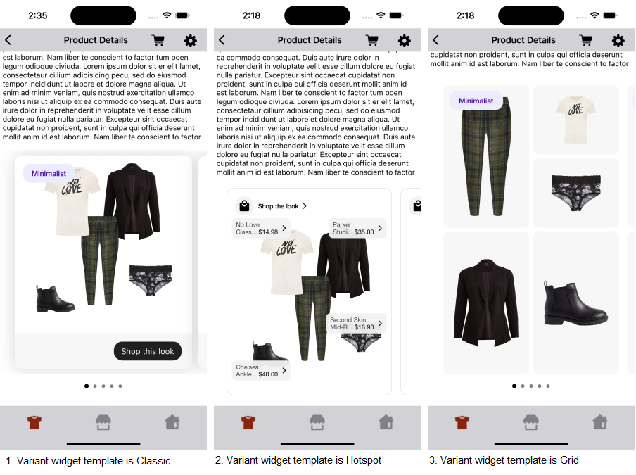
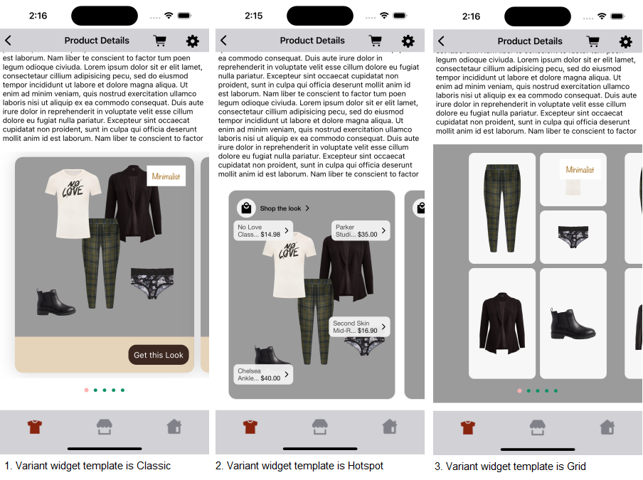
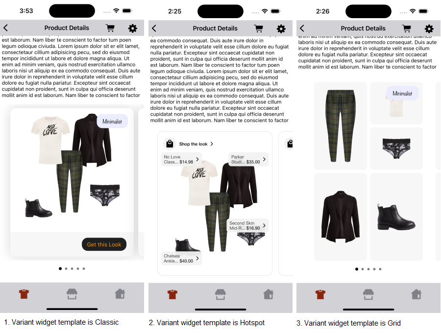

# VARIANT WIDGET

It provides view to display Stylitics data. It also handles invoking of Widget tracking events based on user interaction with these views.

Below are the features for Variant Widget.</br>

* Configure all the UI elements for each Outfit
* Handles Outfit `View` and `Click` tracking events so Integrator App does not have to do it
* Provides listeners to Integrator App so they can handle the Outfit View and Click events
* Configure whether to display Outfit Items directly from SDK or not
    * When Outfit Items are configured to display from SDK, Integrator App can provide configs for it along with Variant Widget configs

## Configurations:

### Widget

| Fields            | Description                                                                 | Default Value |
|-------------------|-----------------------------------------------------------------------------|---------------|
| `cornerRadius`    | is the border corner radius and is accessed as CGFloat                      | `14`          |
| `backgroundColor` | is the widget background color and is accessed from assets file             | `#FFFFFF`     |
| `cardGutter`      | is the space between two OutfitBundle cards and is accessed as CGFloat      | `12`          |
| `cardPeek`        | is the previous and next OutfitBundle card peek and is accessed as CGFloat  | `16`          |  

### Top Label

UX SDK provides various Label styles for the Top Label. [Click here](LABELS_README.md) to learn more about it.

### Bottom Label

| Fields                 | Description                                                                            | Default Value        | 
|------------------------|----------------------------------------------------------------------------------------|----------------------|
| `ctaTitle`             | to set the title of the label                                                          | `Shop this look`     |            
| `fontFamilyAndWeight`  | is the label font style                                                                | `SFProText-Regular`  |            
| `fontSize`             | is the label font size in CGFloat                                                      | `15`                 |
| `fontColor`            | is label text color and is accessed from assets file                                   | `#FFFFFF`            | 
| `backgroundColor`      | is widget footer background color and is accessed from assets file                     | `#F7F7F7`            | 
| `ctaBackgroundColor`   | is label background color and is accessed from assets file                             | `#202020`            |
| `cornerRadius`         | is the border corner radius and is accessed as CGFloat                                 | `14`                 |            
| `ctaPaddingVertical`   | is top and bottom spacing for the label's content, accepts CGFloat value               | `7`                  |            
| `ctaPaddingHorizontal` | is left and right spacing for the label's content, accepts CGFloat value               | `14`                 | 
| `paddingVertical`      | is top and bottom spacing for the content inside widget footer, accepts CGFloat value  | `16`                 |            
| `paddingHorizontal`    | is left and right spacing for the content inside widget footer, accepts CGFloat value  | `20`                 |


### Bullet

| Fields               | Description                                                                | Default Value | 
|----------------------|----------------------------------------------------------------------------|---------------|
| `unselectedColor`    | is color of unselected bullet and is accessed from assets file             | `#D3D3D3`     | 
| `selectedColor`      | is color of selected bullet and is accessed from assets file               | `#000000`     | 
| `paddingVertical`    | is top and bottom spacing of the page indicator view in CGFloat            | `10`          |             
| `paddingHorizontal`  | is spacing between two adjacent bullets of page indicator view in CGFloat  | `8`           |             

### Top Label Position

| Fields              | Description                                                  | Default Value |
|---------------------|--------------------------------------------------------------|---------------|
| `topLabelPosition`  | is to change the top label position to top left or top right | `TOP.LEFT`    |

[Click here](CODE_REFERENCE_README.md#Variant-Widget-Configuration-Samples) to find code references for different configuration examples.

## Implement Exposed Listeners
Below are the list of Variant Widget listeners exposed to the Integrator app. If integrator wishes to implement their own product list screen they will have to provide the definition for widget `onClick` listener.

1. `onClick` - On click event of widget, this listener will be triggered.
2. `onView` - On view event of Outfit, this listener will be triggered.
3. `onOutfitItemClick` - On outfit item label click in Hotspot widget as apart of Variant Widget, this listener will be triggered.

## Default Configurations:

* Variant Widget supports Classic, Hotspot and Grid templates. Classic is the default template. Below are the examples of Variant Widget when Integrator App chooses to use default UI configurations.</br>

* The Variant Widget UI component can be implemented in below different ways.
    1. Product List enabled from SDK
    2. Product List disabled from SDK
    3. Configure Event Listeners

* Variant Widget supports `WRAP_CONTENT` as a height.

*_**Swift**_*

### 1. Product List enabled from SDK:

#### Without Default Template Configuration 

When product list is enabled from UX SDK and Integrator App does not provide configurations, it will take default configurations from SDK.

```swift
static func widgetWithDefaultConfigurations(outfits: Outfits) -> UIView {
    StyliticsUIApis.load(outfits: outfits,
                         variantWidgetInfo: VariantWidgetInfo())
}
```

#### With Default Template Configuration 

```swift
static func widgetWithoutDefaultConfiguration(outfits: Outfits) -> UIView {
    StyliticsUIApis.load(outfits: outfits,
                         variantWidgetInfo: VariantWidgetInfo(),
                         defaultVariantWidgetTemplate: .grid)
}
```

### 2. Product List disabled from SDK:

#### Without Default Template Configuration

```swift
static func widgetWhenProductListFromIntegrator(outfits: Outfits) -> UIView {
    let listener = VariantWidgetListener(onClick: { outfitBundleInfo in
        print("Variant Widget onClick Listener triggered: \(outfitBundleInfo)")
        ScreenDisplayUtility.showDetailsOverlayScreen(outfitBundle: outfitBundleInfo.outfitBundle)
    })
    return StyliticsUIApis.load(outfits: outfits,
                                variantWidgetInfo: VariantWidgetInfo(listener: listener),
                                displayProductListFromSDK: false)
}
```

#### With Default Template Configuration

```swift
static func widgetWhenProductListFromIntegrator(outfits: Outfits) -> UIView {
    let listener = VariantWidgetListener(onClick: { outfitBundleInfo in
        print("Variant Widget onClick Listener triggered: \(outfitBundleInfo)")
        ScreenDisplayUtility.showDetailsOverlayScreen(outfitBundle: outfitBundleInfo.outfitBundle)
    })
    return StyliticsUIApis.load(outfits: outfits,
                                variantWidgetInfo: VariantWidgetInfo(listener: listener),
                                defaultVariantWidgetTemplate: .hotspots,
                                displayProductListFromSDK: false)
}
```

### 3. Configure Event Listeners:

```swift
static func widgetWithListenersConfigured(outfits: Outfits) -> UIView {
    let listener = VariantWidgetListener { outfitBundleInfo in
        print("Variant Widget onClick Listener triggered: \(outfitBundleInfo)")
    } onView: { outfitBundleInfo in
        print("Variant Widget  onView Listener triggered: \(outfitBundleInfo)")
    } onOutfitItemClick: { outfitBundleInfo, outfitBundleItemInfo in
        print("Variant Widget  onOutfitItemClick Listener triggered: \(outfitBundleInfo), \(outfitBundleItemInfo)")
    }

    return StyliticsUIApis.load(outfits: outfits,
                                variantWidgetInfo: VariantWidgetInfo(listener: listener))
}
```

### Default Variant Widget Screens

* Below is the Variant Widget screenshot when Sample Integrator App uses the above configurations.

</br></br>

## Custom Configurations:

* Integrator App can customise some or all configurations & implement listeners.
* Below are the examples of Variant Widget when Sample Integrator App customises configurations.

### 1. With all configurations & Listeners:

```swift
static func widgetWithAllCustomConfigurations(outfits: Outfits) -> UIView {
    let customConfig = VariantWidgetConfig(widget: VariantWidgetConfig.Widget(cornerRadius: 15,
                                                                              backgroundColor: .gray,
                                                                              cardGutter: 30,
                                                                              cardPeek: 35),
                                           topLabel: TopLabel(label5: TopLabel.Label5(fontFamilyAndWeight: "Noteworthy",
                                                                                      fontSize: 14,
                                                                                      fontColor: UIColor(named: "classic_top_label5_font_color")!,
                                                                                      backgroundColor: UIColor(named: "classic_top_label5_background_color")!,
                                                                                      cornerRadius: 0,
                                                                                      paddingVertical: 8,
                                                                                      paddingHorizontal: 10)),
                                           topLabelPosition: .topRight,
                                           bottomLabel: VariantWidgetConfig.BottomLabel(ctaTitle: "Get this Look",
                                                                                        fontSize: 15,
                                                                                        fontColor: UIColor(named: "variantWidgetBottomLabelFontColor")!,
                                                                                        backgroundColor: UIColor(named: "variantWidgetBackgroundColor")!,
                                                                                        ctaBackgroundColor: UIColor(named: "variantWidgetCtaBackgroundColor")!,
                                                                                        cornerRadius: 15,
                                                                                        ctaPaddingVertical: 10,
                                                                                        ctaPaddingHorizontal: 10,
                                                                                        paddingVertical: 15,
                                                                                        paddingHorizontal: 10),
                                           bullet: VariantWidgetConfig.Bullet(unselectedColor: UIColor(named: "variantWidgetBulletUnselectedColor")!,
                                                                              selectedColor: UIColor(named: "variantWidgetBulletSelectedColor")!,
                                                                              paddingVertical: 10,
                                                                              paddingHorizontal: 9))
    let listener = VariantWidgetListener { outfitBundleInfo in
        print("Variant Widget onClick Listener triggered: \(outfitBundleInfo)")
    } onView: { outfitBundleInfo in
        print("Variant Widget  onView Listener triggered: \(outfitBundleInfo)")
    } onOutfitItemClick: { outfitBundleInfo, outfitBundleItemInfo in
        print("Variant Widget  onOutfitItemClick Listener triggered: \(outfitBundleInfo), \(outfitBundleItemInfo)")
    }

    return StyliticsUIApis.load(outfits: outfits,
                                variantWidgetInfo: VariantWidgetInfo(config: customConfig,
                                                                     listener: listener))
}
```

* Below is the Variant Widget screenshot when Sample Integrator App uses the above configurations.

</br>

### 2. With some custom configurations & Listeners:

If Sample Integrator App provides only few configurations, UX SDK will take default configurations for missing fields.

```swift
static func widgetWithSomeCustomConfigurations(outfits: Outfits) -> UIView {
    let customConfig = VariantWidgetConfig(widget: VariantWidgetConfig.Widget(cornerRadius: 15,
                                                                              cardGutter: 30),
                                           topLabel: TopLabel(label5: TopLabel.Label5(fontFamilyAndWeight: "Noteworthy",
                                                                                      fontSize: 14,
                                                                                      fontColor: .black)),
                                           topLabelPosition: .topRight,
                                           bottomLabel: VariantWidgetConfig.BottomLabel(ctaTitle: "Get this Look",
                                                                                        fontSize: 15,
                                                                                        fontColor: UIColor(named: "variantWidgetBottomLabelFontColorForSomeCustomConfig")!))
    let listener = VariantWidgetListener(onClick: { outfitBundleInfo in
        print("Variant Widget onClick Listener triggered: \(outfitBundleInfo)")
    })
    
    return StyliticsUIApis.load(outfits: outfits,
                                variantWidgetInfo: VariantWidgetInfo(config: customConfig,
                                                                     listener: listener))
}       
```

* Below is the Variant Widget screenshot when Sample Integrator App uses the above configurations.

</br>

## Refresh Variant Widget

**Overview**

The `refreshTemplate` method can be used to update the Variant Widget data or its configurations or both.

**Example**

```swift
import StyliticsUI

// Refresh with both new data and config
func refreshTemplate(view: UIView, outfits: Outfits? = nil, widgetConfig: IWidgetConfig? = nil)
```

**Parameters**

- `view`: `variantView` returned by Stylitics UX SDK to display Outfits using `StyliticsUIApis.load` method.
- `outfits`: Optional parameter to provide updated Outfits data.
- `widgetConfig`: Optional parameter to provide updated configurations for Classic Outfits template.

**Usage**

Call the method with the view and optional data/config.

- Get the Variant Widget Template
```swift
// Load Classic Outfit Widget Template
let variantView = StyliticsUIApis.load(outfits: outfits, outfitsTemplate: .classic())
```

- To refresh the Classic Outfit Widget Template with new Outfit data
```Swift
StyliticsUIApis.refreshTemplate(view: variantView, outfits: newOutfits)
```
- To refresh the Classic Outfit Widget Template with new config
```Swift
StyliticsUIApis.refreshTemplate(view: variantView, widgetConfig: newConfig)
```

- To refresh the Classic Outfit Widget Template with both new Outfit data and config
```Swift
StyliticsUIApis.refreshTemplate(view: variantView, outfits: newOutfits, widgetConfig: newConfig)
```

## License

Copyright © 2024 Stylitics
