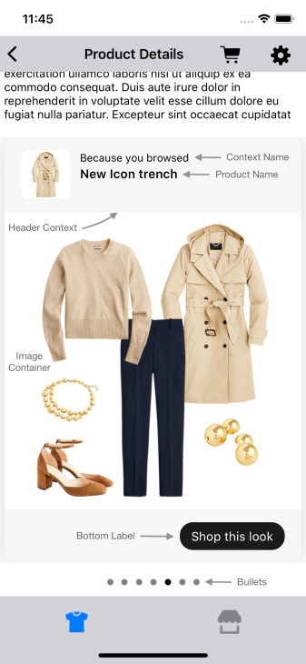
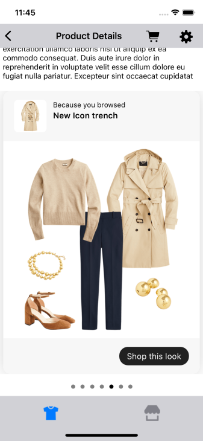
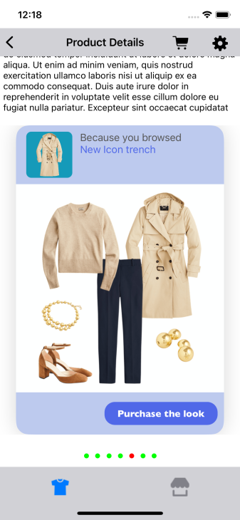
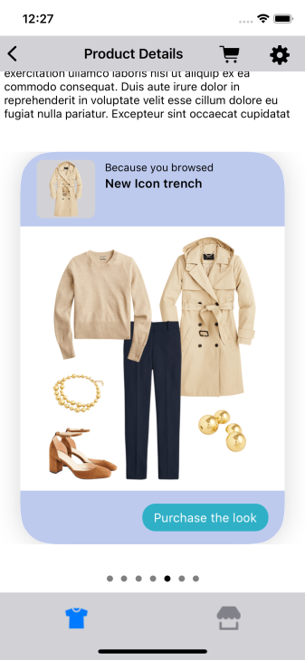

# DYNAMIC GALLERY

It provides view to display Stylitics data Dynamic Gallery widget. It also handles invoking of Widget tracking events based on user interaction with these views.

## Dynamic Gallery Widget

Below are the features for Dynamic Gallery Widget.</br>

* Configure all the UI elements for Dynamic Gallery Widget
* Handles Bundle `View` and `Click` tracking events so Sample Integrator App does not have to do it
* Provides listeners to Sample Integrator App so they can handle the `View` and `Click` events
* Configure whether to display Gallery Bundle Items directly from SDK or not
    * When Bundle Items configured to display from SDK, Sample Integrator App can provide configs for it

### Dynamic Gallery Widget Configurations:



### Widget Background

| Fields | Description | Default Value |
| --- | --- | --- |
| `cornerRadius` | is the widget corner radius | `14px` |
| `backgroundColor` | is the widget background color | `#FFFFFF` |
| `cardGutter` | is the space between two widget card in CGFloat | `12px` |
| `cardPeek` | is the Outfit bundle card peek in CGFloat | `16px` |

### Header Context

| Fields | Description | Default Value |
| --- | --- | --- |
| `productNameFontFamilyAndWeight` | is the font style with the font weight| `SFPro semibold` |
| `productNameFontSize` | is the font size in CGFloat | `15px` |
| `productNameFontColor` | is text color | `#000000` |
| `backgroundColor` | is the header context background color | `#F7F7F7` |
| `paddingVertical` | is top and bottom padding of the context header in CGFloat| `16px` |
| `paddingHorizontal` | is left and right padding of the context header in CGFloat | `20px` |
| `productNameVerticalSpacing` | is the vertical spacing between two lines of product name | `2px` |
| `imageBackgroundColor` | is the header context's image background color | `#FFFFFF` |
| `titleNameFontFamilyAndWeight` | is the font style with the font weight| `SFPro regular` |
| `titleNameFontSize` | is the font size in CGFloat | `13px` |
| `titleNameFontColor` | is text color | `#000000` |

### Bottom Label

| Fields | Description | Default Value |
|---|---|---|
| `ctaTitle` | to set the title of the label | `Shop this look` |
| `fontFamilyAndWeight` | is the font style with the font weight | `Helvetica Neue regular` |
| `fontSize` | is the font size in CGFloat | `15px` |
| `fontColor` | is text color | `#FFFFFF` |
| `backgroundColor` | is background color | `#F7F7F7` |
| `ctaBackgroundColor` | is background color | `#000000` |
| `paddingVertical` | is top and bottom padding of the button in CGFloat | `16px` |
| `paddingHorizontal` | is left and right padding of the button in CGFloat| `20px` |
| `ctaPaddingVertical` | is top and bottom padding of the Shop this look cta in CGFloat | `7px` |
| `ctaPaddingHorizontal` | is left and right padding of the Shop this look cta in CGFloat| `14px` |
| `cornerRadius` | is border corner radius | `40px` |

### Bullets

| Fields | Description | Default Value |
|---|---|---|
| `defaultColor` | to set the default bullet color | `#F7F7F7` |
| `highlightedColor` | to set highlighted bullet color | `#000000` |
| `paddingVertical` | is the vertical padding between widget and bullets in CGFloat | `10px` |


[Click here](CODE_REFERENCE_README.md#dynamic-gallery-widget-configuration-samples) to find code references for different configuration examples.

## Implement Exposed Listeners
Below are the list of Dynamic Gallery widget listeners exposed to the Sample Integrator app. If Sample integrator wishes to implement their own product list screen they will have to provide the definition for widget `onClick` listener.

  1. `onClick` - On click event of `Shop this look` cta in Gallery Bundle widget, this listener will be triggered.
  2. `onView` - On view event of Gallery Bundle, this listener will be triggered.

### Default Configurations:

Below are the examples of Dynamic Gallery Widget when Sample Integrator App chooses to use default UI configurations.</br>

- The Dynamic Gallery UI component can be implemented in below different ways.
    1. Product List enabled from SDK
    2. Product List disabled from SDK
    3. Configure Event Listeners

* The recommended height for the Dynamic Gallery Widget is `ScreenWidth - CardGutter + BulletVerticalPadding + 190`. And default values are as shown in table below.

| Fields | Description | Default Value |
|---|---|---|
| `cardGutter` | is the space between two widget card in CGFloat | `12px` |
| `bulletVerticalPadding` | is the vertical padding between widget bottom and bullets in CGFloat | `10px` |

*_**swift**_*

*_**1. Product List enabled from SDK:**_*

When product list is enabled from UX SDK and Sample Integrator App does not provide configurations, it will take default configurations from SDK.

```swift
static func widgetWithProductListFromUXSDK(galleryBundles: GalleryBundles) -> UIView {
    StyliticsUIApis.load(galleryBundles: galleryBundles)
}
```

*_**2. Product List disabled from SDK:**_*

```swift
static func widgetWhenProductListFromIntegrator(galleryBundles: GalleryBundles) -> UIView {
    let listener = DynamicGalleryListener(onClick: { outfitBundleInfo in
        ScreenDisplayUtility.showOutfitBundleOverlayScreen(outfitBundleInfo: outfitBundleInfo)
    })

    return StyliticsUIApis.load(galleryBundles: galleryBundles,
                                dynamicGalleryInfo: DynamicGalleryInfo(listener: listener),
                                displayProductListFromSDK: false)
}
```

*_**3. Configure Event Listeners:**_*

```swift
static func widgetWithListenersConfigured(galleryBundles: GalleryBundles) -> UIView {
    let listener = DynamicGalleryListener(onClick: { outfitBundleInfo in
        print("Bundle click event triggered : \(outfitBundleInfo)")
    },
                                          onView: { outfitBundleInfo in
        print("Bundle view event triggered : \(outfitBundleInfo)")
    })

    return StyliticsUIApis.load(galleryBundles: galleryBundles,
                                dynamicGalleryInfo: DynamicGalleryInfo(listener: listener))
}
```

### Default Dynamic Gallery Widget Screen

* Below is the Dynamic Gallery Widget screenshot when Sample Integrator App uses the above configurations.

</br></br>

### Custom Configurations:

- Sample Integrator App can customise some or all configurations & implement listeners.
- Below are the examples of Dynamic Gallery Widget when Sample Integrator App customises configurations.

*_**1. With all custom configurations & Listeners:**_*
```swift
static func widgetWithAllCustomConfigurations(galleryBundles: GalleryBundles) -> UIView {
    let dynamicGalleryConfigs = DynamicGalleryConfig(widget: DynamicGalleryConfig.Widget(cornerRadius: 30,
                                                                                         backgroundColor: .systemGray5,
                                                                                         cardGutter: 50),
                                                     headerContext: DynamicGalleryConfig.HeaderContext(backgroundColor: .systemYellow,
                                                                                                       imageBackgroundColor: .systemGray4,
                                                                                                       paddingHorizontal: 30,
                                                                                                       paddingVertical: 12,
                                                                                                       productNameFontColor: .systemGray,
                                                                                                       titleFontColor: .red,
                                                                                                       productNameVerticalSpacing: 0),
                                                     bottomLabel: DynamicGalleryConfig.BottomLabel(ctaTitle: "items",
                                                                                                   fontSize: 34,
                                                                                                   fontColor: .brown,
                                                                                                   backgroundColor: .systemYellow,
                                                                                                   ctaBackgroundColor: .systemTeal,
                                                                                                   ctaPaddingVertical: 2,
                                                                                                   paddingVertical: 20,
                                                                                                   paddingHorizontal: 60),
                                                     bullet: DynamicGalleryConfig.Bullet(defaultColor: .green,
                                                                                         highlightedColor: .red,
                                                                                         paddingVertical: 20))
    let listener = DynamicGalleryListener(onClick: { outfitBundleInfo in
        print("Bundle click event triggered : \(outfitBundleInfo)")
    },
                                          onView: { outfitBundleInfo in
        print("Bundle view event triggered : \(outfitBundleInfo)")
    })

    return StyliticsUIApis.load(galleryBundles: galleryBundles,
                                dynamicGalleryInfo: DynamicGalleryInfo(config: dynamicGalleryConfigs,
                                                                       listener: listener))
}
```

- Below is the Dynamic Gallery Widget screenshot when Sample Integrator App uses the above configurations.

</br>

*_**2. With some custom configurations & Listeners:**_*

If Sample Integrator App provides only few custom configurations, UX SDK will take default configurations for missing fields.

```swift
static func widgetWithSomeCustomConfigurations(galleryBundles: GalleryBundles) -> UIView {
    let dynamicGalleryConfigs = DynamicGalleryConfig(widget: DynamicGalleryConfig.Widget(cornerRadius: 40,
                                                                                         backgroundColor: .white,
                                                                                         cardGutter: 50),
                                                     headerContext: DynamicGalleryConfig.HeaderContext(backgroundColor: .systemYellow,
                                                                                                       imageBackgroundColor: .systemGray4,
                                                                                                       paddingVertical: 10),
                                                     bottomLabel: DynamicGalleryConfig.BottomLabel(ctaTitle: "Purchase the look",
                                                                                                   backgroundColor: .systemYellow,
                                                                                                   ctaBackgroundColor: .systemTeal))

    let listener = DynamicGalleryListener(onClick: { outfitBundleInfo in
        print("Bundle click event triggered : \(outfitBundleInfo)")
    })

    return StyliticsUIApis.load(galleryBundles: galleryBundles,
                                dynamicGalleryInfo: DynamicGalleryInfo(config: dynamicGalleryConfigs,
                                                                       listener: listener))
}
```

- Below is the Dynamic Gallery Widget screenshot when Sample Integrator App uses the above configurations.

</br>

### Refresh Dynamic Gallery Widget

**Overview**

The `refreshTemplate` method can be used to update the Dynamic Gallery widget data or its configurations or both.

**Example**

```swift
import StyliticsUI

// Refresh with both new data and config
func refreshTemplate(view: UIView, galleryBundles: GalleryBundles? = nil, widgetConfig: IWidgetConfig? = nil)
```

**Parameters**

- `view`: `galleryBundlesView` returned by Stylitics UX SDK to display Gallery Bundles using `StyliticsUIApis.load` method.
- `galleryBundles`: Optional parameter to provide updated GalleryBundles data.
- `widgetConfig`: Optional parameter to provide updated configurations for Dynamic Gallery template.

**Usage**

Call the method with the view and optional data/config.

- Get the Dynamic Gallery Widget Template
```swift
// Load Dynamic Gallery Template
let galleryBundlesView = StyliticsUIApis.load(galleryBundles: galleryBundles)
```

- To refresh the Dynamic Gallery Widget Template with new Gallery Bundles data
```Swift
StyliticsUIApis.refreshTemplate(view: galleryBundlesView, galleryBundles: newGalleryBundles)
```
- To refresh the Dynamic Gallery Widget Template with new config
```Swift
StyliticsUIApis.refreshTemplate(view: galleryBundlesView, widgetConfig: newConfig)
```

- To refresh the Dynamic Gallery Widget Template with both new Gallery Bundles data and config
```Swift
StyliticsUIApis.refreshTemplate(view: galleryBundlesView, galleryBundles: newGalleryBundles, widgetConfig: newConfig)
```

## License

Copyright © 2023 Stylitics

