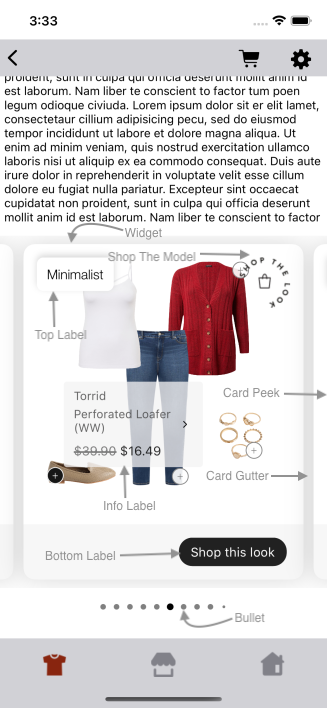

# HOTSPOT WIDGET

It provides view to display Stylitics data. It also handles invoking of Widget tracking events based on user interaction with these views.

Below are the features for Hotspot Outfit Widget.</br>

* Configure all the UI elements for each Outfit
* Handles Outfit `View` and `Click` tracking events so Integrator App does not have to do it
* Provides listeners to Integrator App so they can handle the Outfit View and Click events
* Configure whether to display Outfit Items directly from SDK or not
    * When Outfit Items are configured to display from SDK, Integrator App can provide configs for it along with Hotspot configs.

## Configurations:



### Widget

| Fields            | Description                                                                 | Default Value |
|-------------------|-----------------------------------------------------------------------------|---------------|
| `cornerRadius`    | is the border corner radius and is accessed as CGFloat                      | `14`          |
| `backgroundColor` | is the widget background color and is accessed from assets file             | `#FFFFFF`     |
| `cardGutter`      | is the space between two OutfitBundle cards and is accessed as CGFloat      | `12`          |
| `cardPeek`        | is the previous and next OutfitBundle card peek and is accessed as CGFloat  | `16`          |

### Top Label

UX SDK provides various Label styles for the Top Label. [Click here](LABELS_README.md) to learn more about it.

### Bottom Label

| Fields                 | Description                                                                      | Default Value       |
|------------------------|----------------------------------------------------------------------------------|---------------------|
| `ctaTitle`             | to set the title of the label                                                    | `Shop this look`    |
| `fontFamilyAndWeight`  | is the font style with the font weight                                           | `SFProText-Regular` |
| `fontSize`             | is the font size in CGFloat                                                      | `15`                |
| `fontColor`            | is text color                                                                    | `#FFFFFF`           |
| `backgroundColor`      | is widget footer background color and is accessed from assets file               | `#F7F7F7`           |
| `ctaBackgroundColor`   | is label background color and is accessed from assets files                      | `#202020`           |
| `cornerRadius`         | is the label border corner radius                                                | `16`                |
| `ctaPaddingVertical`   | is top and bottom spacing for the label's content, accepts CGFloat               | `7`                 |
| `ctaPaddingHorizontal` | is left and right spacing for the label's content, accepts CGFloat               | `14`                |
| `paddingVertical`      | is top and bottom spacing for the content inside widget footer, accepts CGFloat  | `16`                |
| `paddingHorizontal`    | is left and right spacing for the content inside widget footer, accepts CGFloat  | `20`                |

### Shop The Model

| Fields     | Description                                                                                     | Default Value |
| ---------- | ----------------------------------------------------------------------------------------------- | ------------- |
| `name`     | is the name of image (from Integrator assets) to be displayed for Shop the model badge          | ""            |
| `position` | is to change the badge position to the Top and Bottom.                                          | `top`         |
| `width`    | is the width of image view in CGFloat                                                           | `60`          |
| `height`   | is the height of image view in CGFloat                                                          | `60`          |

*Note:</br>1. If the "Shop The Model" position is set to ShopTheModelPosition.TOP, the "Shop The Model" view will be placed either to the Right or Left of the screen, depending on the position of the Top Label, in order to avoid any overlapping of views.</br>2. If the "Shop The Model" position is set to ShopTheModelPosition.BOTTOM, it will be positioned to the Left to prevent overlapping with the Bottom Label.*

### Bullet

| Fields               | Description                                                                 | Default Value |
|----------------------|-----------------------------------------------------------------------------|---------------|
| `unselectedColor`    | is color of unselected bullet and is accessed from assets file              | `#7F7F7F`     |
| `selectedColor`      | is color of selected bullet and is accessed from assets file                | `#000000`     |
| `paddingVertical`    | is top and bottom spacing of the page indicator view in CGFloat             | `10`          |
| `paddingHorizontal`  | is spacing between two adjacent bullets of page indicator view in CGFloat   | `8`           |

### Info Label

| Fields                        | Description                                                                                                       | Default Value             |
|-------------------------------|-------------------------------------------------------------------------------------------------------------------|---------------------------|
| `backgroundColor`             | is background color of label and is accessed from assets file                                                     | `#F4F3F4`                 |
| `fontFamilyAndWeight`         | is the item name and brand name font style with the font weight                                                   | `SFProText-Regular`       |
| `fontSize`                    | is the item name and brand name font size in CGFloat                                                              | `14`                      |
| `fontColor`                   | is item name and brand name font color and is accessed from assets file                                           | `#5B5B5B`                 |
| `cornerRadius`                | is border corner radius                                                                                           | `4`                       |
| `showArrow`                   | is to hide or show the arrow icon and is accessed boolean                                                         | `true`                    |
| `showBrand`                   | is to hide or show the item brand name and is accessed boolean                                                    | `true`                    |
| `dotBackgroundColor`          | is hotspot dot background color when unselected and is accessed from assets file                                  | `#FFFFFF`                 |
| `dotBackgroundColorSelected`  | is hotspot dot background color when selected and is accessed from assets file                                    | `#161616`                 |
| `paddingHorizontal`           | is left and right spacing for the label's content in CGFloat                                                      | `12`                      |
| `paddingVertical`             | is top and bottom spacing for the label's content in CGFloat                                                      | `7`                      |
| `priceFontColor`              | to set item price text color which is accessed from assets file                                                   | `#202020`                 |
| `priceFontFamilyAndWeight`    | is the price text font style with the font weight                                                                 | `SFProText-Regular`       |
| `priceFontSize`               | is price font size in CGFloat                                                                                     | `15`                      |
| `salePriceFontColor`          | to set item sale price text color which is accessed from assets file                                              | `#202020`                 |
| `strikeThroughPriceFontColor` | is strike through price text color which is accessed from assets file                                             | `#747474`                 |
| `style`                       | to show or hide the Strike Through Price                                                                          | `PriceStrikethrough.show` |
| `swapPricesPosition`          | is boolean value, when it is false it shows strike through price first and then sale price. Vice versa when true. | `false`                   |

### Top Label Position

| Fields             | Description                                                  | Default Value |
|--------------------|--------------------------------------------------------------|---------------|
| `topLabelPosition` | is to change the top label position to top left or top right | `topLeft`     |

[Click here](CODE_REFERENCE_README.md#hotspot-widget-configuration-samples) to find code references for different configuration examples.

## Implement Exposed Listeners
Below are the list of Hotspot Outfit widget listeners exposed to the Integrator app. If Integrator wishes to implement their own Product list screen they will have to provide the definition for widget `onClick` listener.

  1. `onClick` - On click event of `Shop this look` CTA, this listener will be triggered.
  2. `onView` - On view event of Outfit, this listener will be triggered.
  3. `onOutfitItemClick` - On click event of `Info-label` in Outfit collage, this listener will be triggered.


### Default Configurations:

* Below are the examples of Hotspot Outfit Widget when Integrator App chooses to use default UI configurations.</br>

* The Hotspot Outfit UI component can be implemented in below different ways.
    1. Product List enabled from SDK
    2. Product List disabled from SDK
    3. Configure Event Listeners
    4. Shop The Model

* Hotspot Outfit Widget supports dynamic height.

*_**swift**_*

### 1. Product List enabled from SDK:

When product list is enabled from UX SDK and Integrator App does not provide configurations, it will take default configurations from SDK.

```swift
static func widgetWithProductListFromUXSDK(outfits: Outfits) -> UIView {
    StyliticsUIApis.load(outfits: outfits,
                         outfitsTemplate: .hotspot())
}
```

### 2. Product List disabled from SDK:

```swift
static func widgetWhenProductListFromIntegrator(outfits: Outfits) -> UIView {
    let listener = HotspotListener(onClick: { outfitBundleInfo in
        ScreenDisplayUtility.showDetailsOverlayScreen(outfit: outfitBundleInfo.outfitBundle)
        // Invoke Product List Screen from Integrator here
    })
    return StyliticsUIApis.load(outfits: outfits,
                                outfitsTemplate: .hotspot(hotspotListener: listener),
                                displayProductListFromSDK: false)
    // StandardProductListConfigurationSamples.swift is the class for sample code to configure product list when displayed form Integrator App.
}
```

### 3. Configure Event Listeners:

```swift
static func widgetWithListenersConfigured(outfits: Outfits) -> UIView {
    let hotspotListener = HotspotListener(onClick: { outfitBundleInfo in
        print("Outfit click event triggered : OutfitBundleInfo : \(String(describing: outfitBundleInfo.outfitBundle.id))")
    }, onView: { outfitBundleInfo in
        print("Outfit view event triggered : OutfitBundleInfo : \(String(describing: outfitBundleInfo.outfitBundle.id))")
    }, onOutfitItemClick: { outfitBundleInfo, outfitBundleItemInfo in
        print("Outfit Item click event triggered : OutfitBundleInfo : \(String(describing: outfitBundleInfo.outfitBundle.id)) outfitBundleItem name : \(String(describing: outfitBundleItemInfo.outfitBundleItem.name))")
    })
    return StyliticsUIApis.load(outfits: outfits,
                                outfitsTemplate: .hotspot(hotspotListener: hotspotListener),
                                displayProductListFromSDK: false)
}
```

### 4. Shop The Model:

If in the Outfits response, `on-model-image` flag is true & Integrator App provides a valid image for Shop The Model it will be displayed for the Outfit.

```swift
static func widgetWithShopTheModel(_ outfits: Outfits) -> UIView {
    StyliticsUIApis.load(
        outfits: outfits,
        outfitsTemplate: .hotspot(
            hotspotConfig: .init(
                shopTheModel: ShopTheModel(
                    name: "ShopTheLook"
                )
            )
        )
    )
}
```

**Default Hotspot Outfit Widget Screen**

* Below is the Hotspot Outfit Widget screenshot when Sample Integrator App uses the above configurations.

</br></br>

### Custom Configurations:

* Integrator App can customise some or all configurations & implement listeners.
* Below are the examples of Hotspot Outfit Widget when Sample Integrator App customises configurations.

*_**1. With all configurations & Listeners:**_*

```swift
static func widgetWithMnMWithAllCustomConfigurations(_ outfits: Outfits) -> UIView {
    let hotspotConfig = HotspotConfig(
        widget: HotspotConfig.Widget(
            cornerRadius: 20,
            backgroundColor: selectedTheme.widgetBackgroundColor,
            cardGutter: Template.hotspot.cardGutter(),
            cardPeek: Template.hotspot.cardPeek()
        ),
        topLabel: TopLabel(
            label1: TopLabel.Label1(
                fontFamilyAndWeight: "Noteworthy",
                fontSize: 14,
                fontColor: selectedTheme.topLabel1FontColor,
                borderColor: selectedTheme.topLabel1BorderColor,
                cornerRadius: 0,
                paddingVertical: 8,
                paddingHorizontal: 10
            ),
            label3: TopLabel.Label3(
                fontSize: 14,
                fontColor: UIColor(named: "top_label3_font_color")!,
                cornerRadius: 0,
                paddingVertical: 8,
                paddingHorizontal: 10
            )
        ),
        bottomLabel: HotspotConfig.BottomLabel(
            ctaTitle: "Get this look",
            fontFamilyAndWeight: "Gill Sans",
            fontSize: 16,
            fontColor: selectedTheme.bottomLabelFontColor,
            backgroundColor: selectedTheme.bottomLabelBackgroundColor,
            ctaBackgroundColor: selectedTheme.bottomLabelCtaBgColor,
            cornerRadius: 5,
            ctaPaddingVertical: 6,
            ctaPaddingHorizontal: 15,
            paddingVertical: 17,
            paddingHorizontal: 22
        ),
        shopTheModel: ShopTheModel(
            name: "shopTheLook",
            position: .bottom,
            width: 60,
            height: 60
        ),
        bullet: HotspotConfig.Bullet(
            unselectedColor: selectedTheme.bulletUnselectedColor,
            selectedColor: selectedTheme.bulletSelectedColor,
            paddingVertical: 10,
            paddingHorizontal: 12
        ),
        infoLabel: HotspotConfig.InfoLabel(
            backgroundColor: selectedTheme.infoLabelBackgroundColor,
            fontFamilyAndWeight: "Papyrus",
            fontSize: 15,
            fontColor: selectedTheme.infoLabelFontColor,
            cornerRadius: 12,
            showArrow: false,
            showBrand: false,
            dotBackgroundColor: selectedTheme.infoLabelDotBackgroundColor,
            dotBackgroundColorSelected: selectedTheme.infoLabelDotBackgroundSelectedColor,
            paddingHorizontal: 20,
            paddingVertical: 10,
            priceFontColor: selectedTheme.infoLabelPriceFontColor,
            priceFontFamilyAndWeight: "Chalkduster",
            priceFontSize: 14,
            salePriceFontColor: selectedTheme.infoLabelSalePriceFontColor,
            strikeThroughPriceFontColor: selectedTheme.infoLabelStrikedPriceFontColor,
            style: .show,
            swapPricesPosition: true
        ),
        topLabelPosition: TopLabelPosition.topRight
    )
    return StyliticsUIApis.load(
        outfits: outfits,
        outfitsTemplate: .hotspot(
            hotspotConfig: hotspotConfig,
            hotspotListener: hotspotListener
        ),
        displayProductListFromSDK: true,
        productListScreenTemplate: StandardProductListConfigViewModel.productListScreenTemplate
    )
}
```

*Note : For Shop the model configuration, if height and width provided by Sample Integrator has different aspect ratio than the Image, it will leave some default space around the image and the image will be at the center*.

* Below is the Hotspot Outfit Widget screenshot when Sample Integrator App uses the above configurations.

</br>

</br>*_**2. With some custom configurations & Listeners:**_*

If Integrator App provides only few configurations, UX SDK will take default configurations for missing fields.

```swift
static func widgetWithSomeCustomConfigurations(_ outfits: Outfits) -> UIView {
    let hotspotConfig = HotspotConfig(
        widget: HotspotConfig.Widget(
            cornerRadius: 30,
            backgroundColor: UIColor(named: "theme3_widget_background_color")!
        ),
        topLabel: TopLabel(
            label2: TopLabel.Label2(
                backgroundColor: .red
            ),
            label3: TopLabel.Label3(
                fontColor: UIColor(named: "top_label3_font_color")!,
                cornerRadius: 0,
                paddingVertical: 8,
                paddingHorizontal: 10
            ),
            label7: TopLabel.Label7(
                fontColor: .red
            )
        ),
        bottomLabel: HotspotConfig.BottomLabel(
            ctaTitle: "Get this look",
            ctaPaddingHorizontal: 15
        ),
        infoLabel: HotspotConfig.InfoLabel(
            backgroundColor: UIColor(named: "theme3_info_label_background_color")!,
            fontColor: UIColor(named: "theme3_info_label_font_color")!,
            cornerRadius: 7,
            showArrow: false,
            showBrand: false,
            dotBackgroundColor: UIColor(named: "theme3_dot_background_color")!,
            dotBackgroundColorSelected: UIColor(named: "theme3_dot_selected_background_color")!,
            salePriceFontColor: UIColor(named: "theme3_sale_price_font_color")!,
            strikeThroughPriceFontColor: UIColor(named: "theme3_strike_through_price_font_color")!,
            style: .show
        ),
        topLabelPosition: TopLabelPosition.topRight
    )
    return StyliticsUIApis.load(
        outfits: outfits,
        outfitsTemplate: .hotspot(
            hotspotConfig: hotspotConfig
        )
    )
}
```

* Below is the Hotspot Outfit Widget screenshot when Sample Integrator App uses the above configurations.

</br>

### Refresh Hotspot Outfit Widget

**Overview**

The `refreshTemplate` method can be used to update the Hotspot Outfit widget data or its configurations or both.

**Example**

```swift
import StyliticsUI

// Refresh with both new data and config
func refreshTemplate(view: UIView, outfits: Outfits? = nil, widgetConfig: IWidgetConfig? = nil)
```

**Parameters**

- `view`: `outfitsView` returned by Stylitics UX SDK to display Outfits using `StyliticsUIApis.load` method.
- `outfits`: Optional parameter to provide updated Outfits data.
- `widgetConfig`: Optional parameter to provide updated configurations for Hotspot Outfits template.

**Usage**

Call the method with the view and optional data/config.

- Get the Hotspot Outfit Widget Template
```swift
// Load Hotspot Outfit Widget Template
let outfitsView = StyliticsUIApis.load(outfits: outfits, outfitsTemplate: .hotspot())
```

- To refresh the Hotspot Outfit Widget Template with new Outfit data
```Swift
StyliticsUIApis.refreshTemplate(view: outfitsView, outfits: newOutfits)
```
- To refresh the Hotspot Outfit Widget Template with new config
```Swift
StyliticsUIApis.refreshTemplate(view: outfitsView, widgetConfig: newConfig)
```

- To refresh the Hotspot Outfit Widget Template with both new Outfit data and config
```Swift
StyliticsUIApis.refreshTemplate(view: outfitsView, outfits: newOutfits, widgetConfig: newConfig)
```

## License

Copyright © 2024 Stylitics
