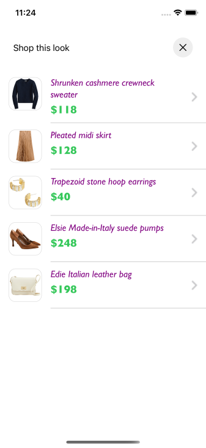

# OUTFIT BUNDLE PRODUCT LIST

It provides views to display Stylitics OutfitBundleItems. It also handles invoking of item tracking events based on user interaction with these views.

## Outfit Bundle Product List Screen

* This screen is displayed when user clicks on `Shop this look` cta.
* There are two different ways to show Outfit Bundle List Screen.
    1. Product List Screen From UX SDK
    2. Product List Screen From Integrator App

### Outfit Bundle Product List Screen From UX SDK

Below are the features for Outfit Bundle Product List Screen 
* Configure all the UI elements for Outfit Bundle Product List Screen
* Handles OutfitBundle Item `View` and `Click` tracking events so Integrator App does not have to do it
* Provides listeners to Integrator App so they can handle the OutfitBundle Item `View` and `Click` events
* If Integrator App does not implement OutfitBundle Item click listener, a Web View is opened when user selects OutfitBundleItem

*Note - It is recommended that Integrator App always provides the `onOutfitItemClick` listener implementation.*

### Product List Screen Configurations


### Header

| Fields | Description | Default Value |
| --- | --- | --- |
| `title` | to set the header title of the text  | `Shop this look` | 
| `fontFamilyAndWeight` | is the header font style with the font weight  | `SFPro Semibold` |
| `fontSize` | is the size in CGFloat  | `17px` |
| `fontColor` | is text color  | `#000000` |

### Presentation Style

| Fields | Description | Default Value |
| --- | --- | --- |
| `presentationStyle` | to set the product list presentation style  | `.automatic` |

### Item Name
  
| Fields | Description | Default Value |
| --- | --- | --- |
| `fontFamilyAndWeight` | is the item name font style with the font weight  | `SFPro Regular` |
| `fontSize` | is the size in CGFloat  | `17px` |
| `fontColor` | is text color  | `#000000` |
| `productNameVerticalSpacing` | to set the spacing between two lines of product name  | `2px` |

### Item Price

| Fields | Description | Default Value |
| --- | --- | --- |
| `fontFamilyAndWeight` | is the item price font style with the font weight  | `SFPro Regular` |
| `fontSize` | is the font size in CGFloat  | `15px` |
| `priceFontColor` | to set item price text color  | `#000000` |
| `salePriceFontColor` | to set item sale price text color  | `#000000` |
| `strikeThroughPriceFontColor` | is strike through price text color  | `#3C3C43` |
| `style` | is to show or hide the Strike Through Price | `.show` |
| `swapPricesPosition` | is boolean value, when it is false it shows strike through price first and then sale price. Vice versa when true | `false` |

### Product List Background Color

| Fields | Description | Default Value |
| --- | --- | --- |
| `backgroundColor` | is to change Product List view background color | `#FFFFFF` |

### Image Color

| Fields | Description | Default Value |
| --- | --- | --- |
| `imageBackgroundColor` | is to change Product List image background color | `#FFFFFF` |
| `imageBorderColor` | is to change Product List image border color | `#212121` |

### Product List Item Border Color

| Fields | Description | Default Value |
| --- | --- | --- |
| `itemBorderColor` | is to change item divider color | `#212121` |

### Padding

| Fields | Description | Default Value |
| --- | --- | --- |
| `paddingVertical` | is vertical spacing between header view and product name | `12px` |
| `paddingHorizontal` | is horizontal spacing between leading edge and image | `16px` |
| `productDetailsPadding` | is horizontal spacing between image and product content | `16px` |

[Click here](CODE_REFERENCE_README.md#outfit-bundle-product-list-configuration-samples) to find code references for different configuration examples.

## Implement Exposed Listeners
Below are the list of Outfit Bundle Product List view listeners exposed to Integrator App

   1. `onOutfitItemClick` - On click event of Outfit Bundle Item, this listener will be triggered. It is highly recommended that Integrator app should implement this listener.
   2. `onOutfitItemView` - On view event of Outfit Bundle Item, this listener will be triggered.

### Compatible with

OutfitBundle product list screen can be used for the following templates:
1. Dynamic Gallery widget
2. Styled For You widget

### Outfit Bundle Product List Screen from UX SDK with Default Configurations

Below is the example of Product List Screen when Sample Integrator App chooses to use default UI configurations.

*_**Swift**_*

Below is the code to access Product List Screen from SDK.

It is recommended that Integrator App provide the `onOutfitItemClick` listener implementation.

```swift
// Code example for Dynamic gallery widget with default OutfitBundle Product list screen.
static func widgetWithProductListFromUXSDKAndAllDefaultConfigurations(bundles: GalleryBundles) -> UIView {
    let productListListener = OutfitBundleProductListListener(onOutfitItemClick: { outfitBundleInfo, outfitBundleItemInfo in
        print("bundle item click event triggered : \(outfitBundleInfo \(outfitBundleItemInfo)")
    },
                                                              onOutfitItemView: { outfitBundleInfo, outfitBundleItemInfo in
        print("bundle item view event triggered : \(outfitBundleInfo) \(outfitBundleItemInfo)")
    })

    return StyliticsUIApis.load(bundles: bundles,
                                outfitBundleProductListScreenConfig: OutfitBundleProductListScreenConfig(outfitBundleProductListInfo: OutfitBundleProductListInfo(productListListener: productListListener)))
}

// Code example for Styled For You widget with default OutfitBundle Product list screen.
static func widgetWithProductListFromUXSDKAndAllDefaultConfigurations(bundles: StyledForYou) -> UIView {
    let productListListener = OutfitBundleProductListListener(onOutfitItemClick: { outfitBundleInfo, outfitBundleItemInfo in
        print("bundle item click event triggered : \(outfitBundleInfo \(outfitBundleItemInfo)")
    },
                                                              onOutfitItemView: { outfitBundleInfo, outfitBundleItemInfo in
        print("bundle item view event triggered : \(outfitBundleInfo) \(outfitBundleItemInfo)")
    })
    return StyliticsUIApis.load(bundles: bundles,
                                outfitBundleProductListScreenConfig: OutfitBundleProductListScreenConfig(outfitBundleProductListInfo: OutfitBundleProductListInfo(productListListener: productListListener)))
}
```
**_**Note:**_* The rest of the code examples are provided only for the *_**Dynamic Gallery widget**_*, similar ones can be referred to for the Styled For You widget.*

- When Product List Screen is displayed from UX SDK, Sample Integrator App can choose to close it using below code.

```swift
let requestId = outfitBundleItem.requestId
StyliticsUIApis.closeProductListScreen(requestId: requestId)
```

- Below is the Product List screenshot when Sample Integrator App uses the default configurations


### Outfit Bundle Product List Screen from UX SDK with Custom Configurations

Below are the examples of Product List Screen when Sample Integrator App chooses to use custom configurations.

*_**Swift**_*

*_**1. With All Custom Configurations and Listeners**_*

```swift
static func widgetWithProductListFromUXSDKAndAllCustomConfigurations(bundles: GalleryBundles) -> UIView {
    let backgroundColor = UIColor(named: "outfit_bundle_product_list_background_color")!
    let titleFontColor = UIColor(named: "outfit_bundle_product_list_title_font_color")!
    let priceFontColor = UIColor(named: "outfit_bundle_product_list_price_font_color")!
    let itemBorderColor = UIColor(named: "outfit_bundle_product_item_border_color")!
    let imageBorderColor = UIColor(named: "outfit_bundle_product_image_border_color")!
    let productListConfigs = OutfitBundleProductListConfig(itemName: OutfitBundleProductListConfig.ItemName(fontFamilyAndWeight: "Gill Sans Italic",
                                                                                                            fontSize: 17,
                                                                                                            fontColor: titleFontColor,
                                                                                                            productNameVerticalSpacing: 5),
                                                           itemPrice: OutfitBundleProductListConfig.ItemPrice(fontFamilyAndWeight: "Gill Sans Bold",
                                                                                                              fontSize: 20,
                                                                                                              priceFontColor: priceFontColor,
                                                                                                              salePriceFontColor: .blue,
                                                                                                              strikeThroughPriceFontColor: .red,
                                                                                                              style: .show,
                                                                                                              priceVerticalSpacing: 5),
                                                           backgroundColor: backgroundColor,
                                                           imageBackgroundColor: backgroundColor,
                                                           imageBorderColor: imageBorderColor,
                                                           itemBorderColor: itemBorderColor)

    let productListListener = OutfitBundleProductListListener(onOutfitItemClick: { outfitBundleInfo, outfitBundleItemInfo in
        print("bundle item click event triggered : \(outfitBundleInfo \(outfitBundleItemInfo)")
    },
                                                              onOutfitItemView: { outfitBundleInfo, outfitBundleItemInfo in
        print("bundle item view event triggered : \(outfitBundleInfo) \(outfitBundleItemInfo)")
    })

    let headerConfigs = OutfitBundleProductListScreenConfig.ItemListHeader(title: "Product List",
                                                                           productListScreenHeaderAlign: .centre,
                                                                           fontFamilyAndWeight: "Gill Sans Bold",
                                                                           fontColor: .black)

    let outfitBundleProductListScreenConfig = OutfitBundleProductListScreenConfig(itemListHeader: headerConfigs,
                                                                       outfitBundleProductListInfo: OutfitBundleProductListInfo(productListConfig: productListConfigs,
                                                                                                                                productListListener: productListListener),
                                                                       presentationStyle: .fullScreen)

    return StyliticsUIApis.load(galleryBundles: bundles,
                                outfitBundleProductListScreenConfig: outfitBundleProductListScreenConfig)
}
```
- Below is the Product List screenshot when Sample Integrator App uses the above configurations.

</br>

*_**2. With some custom configurations and listeners**_*

```swift
static func widgetWithProductListFromUXSDKAndSomeCustomConfigurations(bundles: GalleryBundles) -> UIView {
    let backgroundColor = UIColor(named: "outfit_bundle_product_list_background_color")!
    let imageBorderColor = UIColor(named: "outfit_bundle_product_image_border_color")!
    let productListConfigs = OutfitBundleProductListConfig(itemName: OutfitBundleProductListConfig.ItemName(fontFamilyAndWeight: "Gill Sans Italic",
                                                                                                            fontSize: 17),
                                                           itemPrice: OutfitBundleProductListConfig.ItemPrice(fontFamilyAndWeight: "Gill Sans Bold",
                                                                                                              fontSize: 20,
                                                                                                              salePriceFontColor: .blue,
                                                                                                              strikeThroughPriceFontColor: .red),
                                                           backgroundColor: backgroundColor,
                                                           itemBorderColor: itemBorderColor)

    let productListListener = OutfitBundleProductListListener(onOutfitItemClick: { outfitBundleInfo, outfitBundleItemInfo in
        print("bundle item click event triggered : \(outfitBundleInfo \(outfitBundleItemInfo)")
    },
                                                              onOutfitItemView: { outfitBundleInfo, outfitBundleItemInfo in
        print("bundle item view event triggered : \(outfitBundleInfo) \(outfitBundleItemInfo)")
    })

    let headerConfigs = OutfitBundleProductListScreenConfig.ItemListHeader(title: "Product List",
                                                                           productListScreenHeaderAlign: .centre,
                                                                           fontFamilyAndWeight: "Gill Sans Bold")

    let outfitBundleProductListScreenConfig = OutfitBundleProductListScreenConfig(itemListHeader: headerConfigs,
                                                                                  outfitBundleProductListInfo: OutfitBundleProductListInfo(productListConfig: productListConfigs,
                                                                                                                                           productListListener: productListListener),
                                                                                  presentationStyle: .fullScreen)

    return StyliticsUIApis.load(galleryBundles: bundles,
                                outfitBundleProductListScreenConfig: outfitBundleProductListScreenConfig)
}
```
- Below is the Product List screenshot when Sample Integrator App uses the above configurations.



### Product List Screen From Sample Integrator App

If Integrator App wants to implement their own Product List Screen, they need to implement OutfitBundle click listener as shown below and create view on their own.

```swift
static func widgetWhenProductListFromIntegrator(bundles: GalleryBundles) -> UIView {
    let listener = DynamicGalleryListener(onClick: { outfitBundleInfo in
        ScreenDisplayUtility.showOutfitBundleOverlayScreen(outfitBundleInfo: outfitBundleInfo)
    })

    return StyliticsUIApis.load(galleryBundles: bundles,
                                dynamicGalleryInfo: DynamicGalleryInfo(listener: listener),
                                displayProductListFromSDK: false)
}
```
Integrator can create their own Product List View or access and implement it from UX SDK as given below.

*_**1. Product List View with default configurations**_*

Below is the code to call your own Product List Screen. 

```swift
func showProductListFromIntegrator() {
    if let outfitBundleInfo = viewModel.outfitBundleInfo {
        let productListView = StyliticsUIApis.load(bundleInfo: outfitBundleInfo,
                                                   outfitBundleProductListInfo: OutfitBundleProductListInfo(productListListener: OutfitBundleProductListListener(onOutfitItemClick: { outfitBundleInfo, outfitBundleItemInfo in
            print("click listener triggered : \(outfitBundleInfo) \(outfitBundleItemInfo)")
        })))
        containerView.addSubviewConstraints(subview: productListView)
    }
}
```

*_**2. Product List View with custom configurations**_*

```swift
func showProductListFromIntegrator() {
    if let outfitBundleInfo = viewModel.outfitBundleInfo {
        let productListConfigs = OutfitBundleProductListConfig(itemName: OutfitBundleProductListConfig.ItemName(fontFamilyAndWeight: "Gill Sans Italic",
                                                                                                                fontSize: 17,
                                                                                                                fontColor: .orange,
                                                                                                                productNameVerticalSpacing: 5),
                                                               itemPrice: OutfitBundleProductListConfig.ItemPrice(fontFamilyAndWeight: "Gill Sans Bold",
                                                                                                                  fontSize: 20,
                                                                                                                  priceFontColor: .black,
                                                                                                                  salePriceFontColor: .blue,
                                                                                                                  strikeThroughPriceFontColor: .red,
                                                                                                                  style: .show,
                                                                                                                  priceVerticalSpacing: 5),
                                                               backgroundColor: .blue,
                                                               imageBackgroundColor: .gray,
                                                               imageBorderColor: .purple,
                                                               itemBorderColor: .black)
        let productListListener = OutfitBundleProductListListener(onOutfitItemClick: { _, bundleItemInfo in
        print("bundle item click event triggered : \(bundleItemInfo)")
    },
                                                              onOutfitItemView: { _, bundleItemInfo in
        print("bundle item view event triggered : \(bundleItemInfo)")
    })

        let productListView = StyliticsUIApis.load(bundleInfo: outfitBundleInfo,
                                                   outfitBundleProductListInfo: OutfitBundleProductListInfo(productListConfig: productListConfigs,
                                                                                                            productListListener: productListListener))
        containerView.addSubviewConstraints(subview: productListView)
    }
}
```

## License

Copyright © 2023 Stylitics
