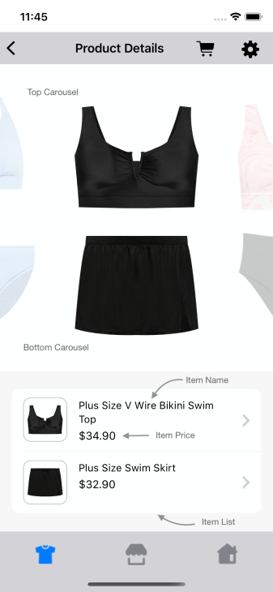
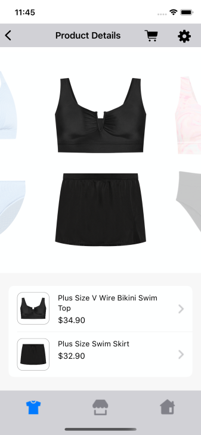
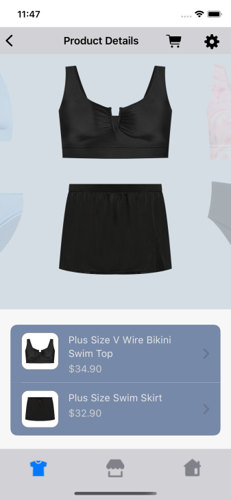
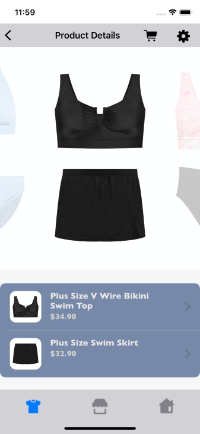

# SHOP THE SET WIDGET

It provides view to display Stylitics Shop the Set data. It also handles invoking of Widget tracking events based on user interaction with these views.

Below are the features for Shop the Set Widget.</br>

* Configure all the UI elements for Shop the Set data
* Handles Shop the Set Top and bottom carousel `View` tracking events so Sample Integrator App does not have to do it.
* Handles Shop the Set Top and bottom Item detail view `Click` tracking events so Sample Integrator App does not have to do it.
* Provides listeners to Sample Integrator App so they can handle the Set item View and Click events

## Shop The Set Configurations:



### Carousel

| Fields | Description | Default Value |
| --- | --- | --- |
| `paddingVertical` | is top and bottom padding of the carousel in CGFloat | `30px` |
| `backgroundColor` | is the carousel background color | `#FFFFFF` |
| `imageSize` | is product image height and width value in CGFloat | `176px` |
| `imageGutter` | is the gutter spacing between two carousel images | `48px` |


### Item List

| Fields | Description | Default Value |
|---|---|---|
| `fontFamilyAndWeight` | is the item name font style with the font weight | `SFPro Regular` |
| `fontSize` | is the item name font size in CGFloat | `14px` |
| `fontColor` | is item name text color | `#000000` |
| `backgroundColor` | is item list background color | `#FFFFFF` |
| `cornerRadius` | is item list border corner radius | `10px` |
| `paddingVertical` | is top and bottom padding between carousel bottom and item list top in CGFloat | `24px` |
| `paddingHorizontal` | is left and right padding to the item list in CGFloat| `16px` |
| `itemPaddingVertical` | is top and bottom padding to item list in CGFloat | `12px` |
| `itemPaddingHorizontal` | is left and right padding to the item list in CGFloat| `16px` |
| `itemBackgroundColor` | is background color of image | `#FFFFFF` |
| `itemCornerRadius` | is border corner radius of item list image | `10px` |
| `imageSize` | is the item list image size | `56px` |
| `priceFontFamilyAndWeight` | is the item price text font style with the font weight  | `SFPro Regular` |
| `fontSize` | is the item price font size in CGFloat  | `15px` |
| `priceFontColor` | to set item price text color  | `#000000` |
| `salePriceFontColor` | to set item sale price text color  | `#000000` |
| `strikeThroughPriceFontColor` | is strike through price text color  | `#000000` |
| `style` | is to show or hide the Strike Through Price | `.show` |
| `swapPricesPosition` | is boolean value, when it is false it shows strike through price first and then sale price. Vice versa when true | `false` |


[Click here](CODE_REFERENCE_README.md#shop-the-set-widget-configuration-samples) to find code references for different configuration examples.

### Implement Exposed Listeners
Below are the list of Shop The Set Widget listeners exposed to Sample Integrator App

  1. `onItemView` - When user swipes top or bottom item from carousel, this listener will be invoked.
  2. `onItemClick` - On click event of item from item list for Shop the Set widget, this listener will be invoked.

### Default Configurations:

* Below are the examples of Shop the Set Widget when Sample Integrator App chooses to use default UI configurations.</br>

* The Shop the Set UI component can be implemented in below different ways.
    1. Default Shop the set widget 
    2. Configure Event Listeners

* Shop The Set Widget supports different heights with the following constraints:
  1. Recommended height: 630

*_**swift**_*

*_**1. Shop The Set Default configuration:**_*

When Sample/Integrator App does not provide configurations, it will take default configurations from SDK.

```swift
static func widgetWithDefaultConfigurations(shopTheSet: ShopTheSet) -> UIView {
    StyliticsUIApis.load(shopTheSet: shopTheSet)
}
```

*_**2. Configure Event Listeners:**_*

```swift
static func widgetWithListenerConfigured(shopTheSet: ShopTheSet) -> UIView {
    StyliticsUIApis.load(shopTheSet: shopTheSet,
                         shopTheSetInfo: ShopTheSetInfo(listener: ShopTheSetListener(onItemClick: { shopTheSetItemsInfo in
        print("shop the set item click event triggered : \(shopTheSetItemsInfo)")
    },
                                                                                     onItemView: { shopTheSetItemsInfo in
        print("shop the set item view event triggered : \(shopTheSetItemsInfo)")
    })))
}
```

**Default Shop The Set Widget Screen**

- Below is the Shop The Set Widget screenshot when Sample Integrator App uses the above configurations.



### Custom Configurations:

- Sample Integrator App can customise some or all configurations & implement listeners.
- Below are the examples of Shop The Set Widget when Sample Integrator App customises configurations.

*_**1. With all custom configurations:**_*
```swift
static func widgetWithAllCustomConfigurations(shopTheSet: ShopTheSet) -> UIView {

    guard let carouselBackgroundColor = UIColor(named: "shop_the_set_carousel_background_color"),
          let imageBackgroundColor = UIColor(named: "shop_the_set_image_background_color"),
          let itemListBackgroundColor = UIColor(named: "shop_the_set_item_list_background_color"),
          let itemNameColor = UIColor(named: "shop_the_set_item_name_color"),
          let priceFontColor = UIColor(named: "shop_the_set_price_font_color"),
          let salePriceFontColor = UIColor(named: "shop_the_set_sale_price_font_color"),
          let strikeThroughPriceColor = UIColor(named: "shop_the_set_strike_through_price_color") else {
        return StyliticsUIApis.load(shopTheSet: shopTheSet, shopTheSetConfig: ShopTheSetConfigs())
    }

    let shopTheSetConfigs = ShopTheSetConfigs(carousel: ShopTheSetConfigs.Carousel(paddingVertical: 35,
                                                                                   backgroundColor: carouselBackgroundColor,
                                                                                   imageSize: 190,
                                                                                   imageGutter: 50),
                                              itemList: ShopTheSetConfigs.ItemList(fontFamilyAndWeight: "SFProText-Regular",
                                                                                   fontSize: 16,
                                                                                   fontColor: itemNameColor,
                                                                                   backgroundColor: itemListBackgroundColor,
                                                                                   cornerRadius: 11,
                                                                                   paddingVertical: 25,
                                                                                   paddingHorizontal: 17,
                                                                                   itemPaddingVertical: 13,
                                                                                   itemPaddingHorizontal: 18,
                                                                                   itemBackgroundColor: imageBackgroundColor,
                                                                                   itemCornerRadius: 11,
                                                                                   imageSize: 57,
                                                                                   priceFontFamilyAndWeight: "SFProText-Regular",
                                                                                   priceFontSize: 16,
                                                                                   priceFontColor: priceFontColor,
                                                                                   salePriceFontColor: salePriceFontColor,
                                                                                   strikeThroughPriceFontColor: strikeThroughPriceColor,
                                                                                   strikethroughStyle: .show,
                                                                                   swapPricesPosition: true))

    return StyliticsUIApis.load(shopTheSet: shopTheSet, shopTheSetConfig: shopTheSetConfigs)
}
```

</br>

*_**2. With some custom configurations & Listeners:**_*

If Sample Integrator App provides only few custom configurations, UX SDK will take default configurations for missing fields.

```swift
static func widgetWithSomeCustomConfigurations(shopTheSet: ShopTheSet) -> UIView {

    guard let itemListBackgroundColor = UIColor(named: "shop_the_set_item_list_background_color"),
          let itemNameColor = UIColor(named: "shop_the_set_item_name_color"),
          let priceFontColor = UIColor(named: "shop_the_set_price_font_color"),
          let strikeThroughPriceColor = UIColor(named: "shop_the_set_strike_through_price_color") else {
        return StyliticsUIApis.load(shopTheSet: shopTheSet)
    }

    let shopTheSetConfigs = ShopTheSetConfigs(carousel: ShopTheSetConfigs.Carousel(paddingVertical: 32,
                                                                                   imageGutter: 50),
                                              itemList: ShopTheSetConfigs.ItemList(fontFamilyAndWeight: "Gill Sans Bold",
                                                                                   fontSize: 16,
                                                                                   fontColor: itemNameColor,
                                                                                   backgroundColor: itemListBackgroundColor,
                                                                                   paddingVertical: 26,
                                                                                   paddingHorizontal: 0,
                                                                                   itemPaddingVertical: 14,
                                                                                   itemPaddingHorizontal: 18,
                                                                                   itemCornerRadius: 12,
                                                                                   priceFontFamilyAndWeight: "Gill Sans Bold",
                                                                                   priceFontColor: priceFontColor,
                                                                                   strikeThroughPriceFontColor: strikeThroughPriceColor))

    let shopTheSetInfo = ShopTheSetInfo(config: shopTheSetConfigs, listener: listener)
    return StyliticsUIApis.load(shopTheSet: shopTheSet, shopTheSetInfo: shopTheSetInfo)
}
```

- Below is the Shop The Set Widget screenshot when Sample Integrator App uses the above configurations.

</br>


### Refresh Shop The Set Widget

**Overview**

The `refreshTemplate` method can be used to update the Shop The Set Widget data or its configurations or both.

**Example**

```swift
import StyliticsUI

// Refresh with both new data and config
func refreshTemplate(view: UIView, shopTheSet: ShopTheSet? = nil, widgetConfig: IWidgetConfig? = nil)
```

**Parameters**

- `view`: `ShopTheSetView` returned by Stylitics UX SDK to display Outfits using `StyliticsUIApis.load` method.
- `shopTheSet`: Optional parameter to provide updated Shop The Set data.
- `widgetConfig`: Optional parameter to provide updated configurations for Shop The Set template.

**Usage**

Call the method with the view and optional data/config.

- Get the Shop The Set Widget Template
```swift
// Load Shop The Set Widget Template
let shopTheSetView = StyliticsUIApis.load(shopTheSet: ShopTheSet)
```

- To refresh the Shop The Set Widget with new data
```Swift
StyliticsUIApis.refreshTemplate(view: bundlesView, shopTheSet: newShopTheSet)
```
- To refresh the Shop The Set Widget with new config
```Swift
StyliticsUIApis.refreshTemplate(view: bundlesView, widgetConfig: newConfig)
```

- To refresh the Shop The Set Widget with both new ShopTheSet data and config
```Swift
StyliticsUIApis.refreshTemplate(view: bundlesView, shopTheSet: newShopTheSet, widgetConfig: newConfig)
```

## License

Copyright © 2023 Stylitics
