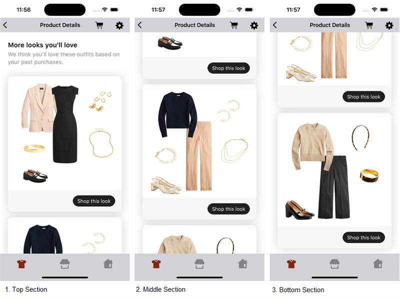
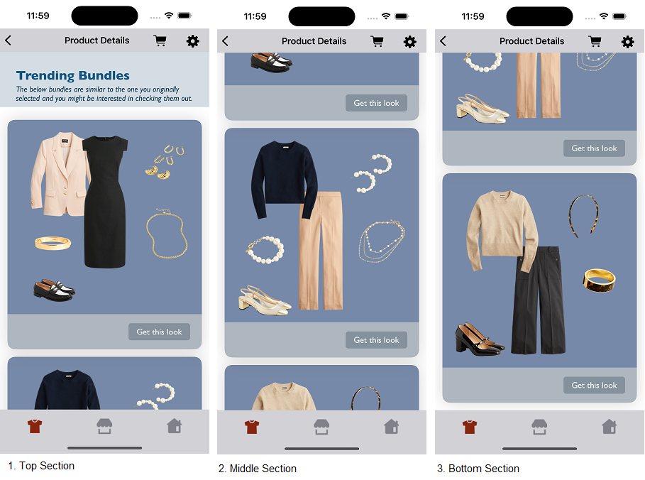
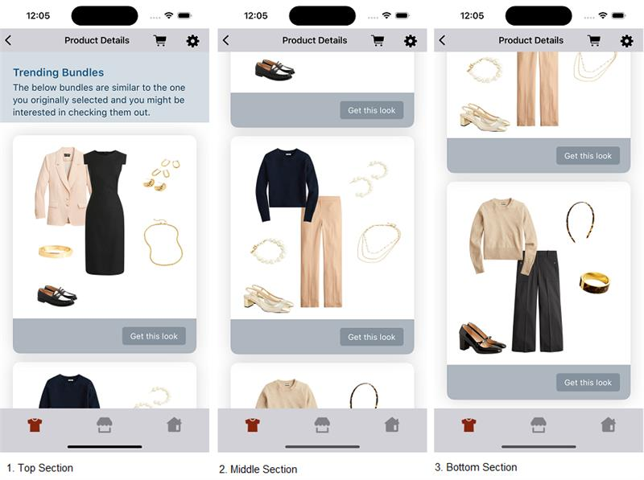

# TRENDING BUNDLES WIDGET

It provides view to display Stylitics Trending Bundles data. It also handles invoking of widget tracking events based on user interaction with these views.

Below are the features for Trending Bundles Widget.</br>

* Configure all the UI elements for Trending Bundles Widget
* Handles tracking events so Integrator App does not have to do it
* Provides listeners to Integrator App so they can handle the events (if needed) based on user interaction.
* Configure whether to display Trending Bundle Items directly from SDK or not
* When Bundle Items are configured to display from SDK, Integrator App can provide configs for it.


## Configurations:


### Header

| Fields                         | Description                                                                                     | Default Value                                                     |
|--------------------------------|-------------------------------------------------------------------------------------------------|-------------------------------------------------------------------|
| `backgroundColor`              | to set the background color to the header of the widget                                         | `#FFFFFF`                                                         |           
| `paddingVertical`              | is top spacing for the content inside header, accepts CGFloat                                   | `24`                                                              |           
| `paddingHorizontal`            | is left and right spacing of the header view, accepts CGFloat                                   | `24`                                                              |
| `headerText`                   | is to set text for the header                                                                   | `More looks you’ll love`                                          |
| `headerFontColor`              | is header text color and is accessed from assets file                                           | `#000000`                                                         |
| `headerFontFamilyAndWeight`    | is the header font style with the font weight and is accessed from the font resource folder     | `SFProText-Semibold`                                              |           
| `headerFontSize`               | is the header font size in float                                                                | `20`                                                              |
| `subHeaderText`                | is to set text for the sub header                                                               | `We think you’ll love these outfits based on your past purchased` |
| `subHeaderFontColor`           | is sub header text color and is accessed from assets file                                       | `#3B3B43`                                                         |
| `subHeaderFontFamilyAndWeight` | is the sub title font style with the font weight and is accessed from the font resource folder  | `SFProText-Regular`                                               |
| `subHeaderFontSize`            | is the sub title font size in CGFloat                                                           | `17`                                                              |

### Widget

| Fields               | Description                                                                      | Default Value |
|----------------------|----------------------------------------------------------------------------------|---------------|
| `cornerRadius`       | is border corner radius                                                          | `14`          |
| `backgroundColor`    | is widget background color and is accessed from assets file                      | `#FFFFFF`     |  
| `paddingVertical`    | is the left and right margin to the lists of bundles and is accessed as CGFloat  | `16`          |  
| `paddingHorizontal`  | is the bottom spacing to the widget and is accessed as CGFloat                   | `24`          |

### Bottom Label

| Fields                 | Description                                                                                 | Default Value        | 
|------------------------|---------------------------------------------------------------------------------------------|----------------------|
| `ctaTitle`             | to set the title of the label                                                               | `Shop this look`     |            
| `fontFamilyAndWeight`  | is the label font style with the font weight and is accessed from the font resource folder  | `SFProText-Regular`  |            
| `fontSize`             | is the label font size in CGFloat                                                           | `15`                 |
| `fontColor`            | is label text color and is accessed from assets file                                        | `#FFFFFF`            | 
| `backgroundColor`      | is widget footer background color and is accessed from assets file                          | `#F7F7F7`            | 
| `ctaBackgroundColor`   | is label background color and is accessed from assets file                                  | `#202020`            | 
| `paddingVertical`      | is top and bottom spacing for the content inside widget footer, accepts CGFloat             | `16`                 |            
| `paddingHorizontal`    | is left and right spacing for the content inside widget footer, accepts CGFloat             | `20`                 |            
| `ctaPaddingVertical`   | is top and bottom spacing for the label's content, accepts CGFloat                          | `7`                  |            
| `ctaPaddingHorizontal` | is left and right spacing for the label's content, accepts CGFloat                          | `14`                 |            
| `cornerRadius`         | is left and right spacing for the label's content, accepts CGFloat                          | `18`                 |


# Implement Exposed Listeners
Below are the list of Trending Bundles widget listeners exposed to the Integrator app. If Integrator wishes to implement their own product list screen they will have to provide the definition for widget `onOutfitClickCTA` listener.

1. `onOutfitView` -  On view event of Trending Outfit bundle, this listener will be invoked.
2. `onOutfitClick` - On click event of Trending Outfit bundle, this listener will be invoked.
3. `onOutfitClickCTA` - On click event of `Shop this look` cta in Trending Bundles widget, this listener will be invoked.

## Default Configurations:

* Below are the examples of Trending Bundles Widget when Integrator App chooses to use default UI configurations.</br>

* The Trending Bundles UI component can be implemented in below different ways.
    1. Product List enabled from SDK
    2. Product List disabled from SDK
    3. Configure Event Listeners


*_**Swift**_*

### 1. Product List enabled from SDK:

When product list is enabled from UX SDK and Integrator App does not provide configurations, it will take default configurations from SDK.

```swift
static func widgetWithDefaultConfigurations(trendingBundles: TrendingBundles) -> UIView {
    StyliticsUIApis.load(trendingBundles: trendingBundles)
}
```

### 2. Product List disabled from SDK:

```swift
static func widgetWhenProductListFromIntegrator(trendingBundles: TrendingBundles) -> UIView {
    let listener = TrendingBundlesListener(onOutfitClickCTA: { outfitBundleInfo in
        ScreenDisplayUtility.showOutfitBundleOverlayScreen(outfitBundleInfo: outfitBundleInfo)
    })

    return StyliticsUIApis.load(trendingBundles: trendingBundles,
                                trendingBundlesInfo: TrendingBundlesInfo(listener: listener),
                                displayProductListFromSDK: false)
}
```

### 3. Configure Event Listeners:

```swift
static func widgetWithListenersConfigured(trendingBundles: TrendingBundles) -> UIView {
    let listener = TrendingBundlesListener(onOutfitClick: { outfitBundleInfo in
        print("Trending Bundles onOutfitClick: \(outfitBundleInfo)")
    }, onOutfitClickCTA: { outfitBundleInfo in
        print("Trending Bundles onOutfitClickCTA: \(outfitBundleInfo)")
        ScreenDisplayUtility.showOutfitBundleOverlayScreen(outfitBundleInfo: outfitBundleInfo)
    }, onOutfitView: { outfitBundleInfo in
        print("Trending Bundles onOutfitView: \(outfitBundleInfo)")
    })

    return StyliticsUIApis.load(trendingBundles: trendingBundles,
                                trendingBundlesInfo: TrendingBundlesInfo(listener: listener))
}
```


### Default Trending Bundles Screen

* Below is the Trending Bundles Widget screenshot when Sample Integrator App uses the above configurations.

</br></br>

## Custom Configurations:

* Integrator App can customise some or all configurations & implement listeners.
* Below are the examples of Trending Bundles Widget when Sample Integrator App customises configurations.

### 1. With all configurations & Listeners:

```swift
static func widgetWithAllCustomConfigurations(trendingBundles: TrendingBundles) -> UIView {
    let widgetBackgroundColor = UIColor(named: "trending_bundles_widget_background_color")!
    let headerBackgroundColor = UIColor(named: "trending_bundles_header_background_color")!
    let bottomLabelTitleFontColor = UIColor(named: "trending_bundles_bottom_label_title_font_color")!
    let bottomLabelBackgroundColor = UIColor(named: "trending_bundles_bottom_label_background_color")!
    let bottomLabelTitleBackgroundColor = UIColor(named: "trending_bundles_bottom_label_title_background_color")!
    let headerFontColor = UIColor(named: "trending_bundles_header_font_color")!
    let subHeaderFontColor = UIColor(named: "trending_bundles_sub_header_font_color")!

    let allCustomConfig = TrendingBundlesConfig(header: TrendingBundlesConfig.Header(backgroundColor: headerBackgroundColor,
                                                                                     paddingVertical: 30,
                                                                                     paddingHorizontal: 30,
                                                                                     headerText: "Trending Bundles",
                                                                                     headerFontColor: headerFontColor,
                                                                                     headerFontFamilyAndWeight: "Gill Sans Bold",
                                                                                     headerFontSize: 24,
                                                                                     subHeaderText: "The below bundles are similar to the one you originally selected and you might be interested in checking them out.",
                                                                                     subHeaderFontColor: subHeaderFontColor,
                                                                                     subHeaderFontFamilyAndWeight: "Gill Sans Italic",
                                                                                     subHeaderFontSize: 15),
                                                widget: TrendingBundlesConfig.Widget(backgroundColor: widgetBackgroundColor,
                                                                                     paddingVertical: 14,
                                                                                     paddingHorizontal: 14),
                                                bottomLabel: TrendingBundlesConfig.BottomLabel(ctaTitle: "Get this look",
                                                                                               fontFamilyAndWeight: "Gill Sans",
                                                                                               fontSize: 16,
                                                                                               fontColor: bottomLabelTitleFontColor,
                                                                                               backgroundColor: bottomLabelBackgroundColor,
                                                                                               ctaBackgroundColor: bottomLabelTitleBackgroundColor,
                                                                                               paddingVertical: 17,
                                                                                               paddingHorizontal: 22,
                                                                                               ctaPaddingVertical: 6,
                                                                                               ctaPaddingHorizontal: 15,
                                                                                               cornerRadius: 5))

    let allCustomListener = TrendingBundlesListener(onOutfitClick: { outfitBundleInfo in
        print("Trending Bundles onOutfitClick: \(outfitBundleInfo)")
    }, onOutfitClickCTA: { outfitBundleInfo in
        print("Trending Bundles onOutfitClickCTA: \(outfitBundleInfo)")
        ScreenDisplayUtility.showOutfitBundleOverlayScreen(outfitBundleInfo: outfitBundleInfo)
    }, onOutfitView: { outfitBundleInfo in
        print("Trending Bundles onOutfitView: \(outfitBundleInfo)")
    })

    let productListScreenConfig = OutfitBundleProductListScreenConfig(outfitBundleProductListConfig: OutfitBundleProductListConfigSamples.productListConfig,
                                                                      outfitBundleProductListListener: OutfitBundleProductListConfigSamples.productListListener)
    return StyliticsUIApis.load(trendingBundles: trendingBundles,
                                trendingBundlesInfo: TrendingBundlesInfo(config: allCustomConfig,
                                                                         listener: allCustomListener),
                                displayProductListFromSDK: false,
                                outfitBundleProductListScreenConfig: productListScreenConfig)
}
```


* Below is the Trending Bundles Widget screenshot when Sample Integrator App uses the above configurations.

</br>

### 2. With some custom configurations & Listeners:

If Integrator App provides only few configurations, UX SDK will take default configurations for missing fields.

```swift
static func widgetWithSomeCustomConfigurations(trendingBundles: TrendingBundles) -> UIView {
    let headerBackgroundColor = UIColor(named: "trending_bundles_header_background_color")!
    let bottomLabelTitleFontColor = UIColor(named: "trending_bundles_bottom_label_title_font_color")!
    let bottomLabelBackgroundColor = UIColor(named: "trending_bundles_bottom_label_background_color")!
    let bottomLabelTitleBackgroundColor = UIColor(named: "trending_bundles_bottom_label_title_background_color")!
    let headerFontColor = UIColor(named: "trending_bundles_header_font_color")!
    let subHeaderFontColor = UIColor(named: "trending_bundles_sub_header_font_color")!

    let someCustomConfig = TrendingBundlesConfig(header: TrendingBundlesConfig.Header(backgroundColor: headerBackgroundColor,
                                                                                      headerText: "Trending Bundles",
                                                                                      headerFontColor: headerFontColor,
                                                                                      subHeaderText: "The below bundles are similar to the one you originally selected and you might be interested in checking them out.",
                                                                                      subHeaderFontColor: subHeaderFontColor),
                                                 bottomLabel: TrendingBundlesConfig.BottomLabel(ctaTitle: "Get this look",
                                                                                                fontColor: bottomLabelTitleFontColor,
                                                                                                backgroundColor: bottomLabelBackgroundColor,
                                                                                                ctaBackgroundColor: bottomLabelTitleBackgroundColor,
                                                                                                ctaPaddingVertical: 6,
                                                                                                ctaPaddingHorizontal: 15,
                                                                                                cornerRadius: 5))
    return StyliticsUIApis.load(trendingBundles: trendingBundles,
                         trendingBundlesInfo: TrendingBundlesInfo(config: someCustomConfig))
}        
```

* Below is the Trending Bundles Widget screenshot when Sample Integrator App uses the above configurations.

</br>


## Refresh Trending Bundles Widget

**Overview**

The `refreshTemplate` method can be used to update the Trending Bundles widget data or its configurations or both.

**Example**

```swift
static func refreshTemplate(view: UIView, trendingBundles: TrendingBundles? = nil, widgetConfig: IWidgetConfig? = nil) 
```

**Parameters**

- `trendingBundles`: Optional parameter to provide updated TrendingBundles data.
- `widgetConfig`: Optional parameter to provide updated configurations for Trending Bundles template.

**Usage**

Call the method on the view with optional data/config.

- Get the Trending Bundles Widget Template view
```swift
let bundlesView = StyliticsUIApis.load(trendingBundles: trendingBundles)
```

- To refresh the Trending Bundles Widget Template with new TrendingBundles data
```swift
StyliticsUIApis.refreshTemplate(view: bundlesView,
                                trendingBundles: newTrendingBundles)
```
- To refresh the Trending Bundles Widget Template with new config
```swift
StyliticsUIApis.refreshTemplate(view: bundlesView,
                                widgetConfig: newConfig)
```
- To refresh the Trending Bundles Widget Template with both new TrendingBundles data and config
```swift
StyliticsUIApis.refreshTemplate(view: bundlesView,
                                trendingBundles: newTrendingBundles,
                                widgetConfig: newConfig)
```

## License

Copyright © 2023 Stylitics
